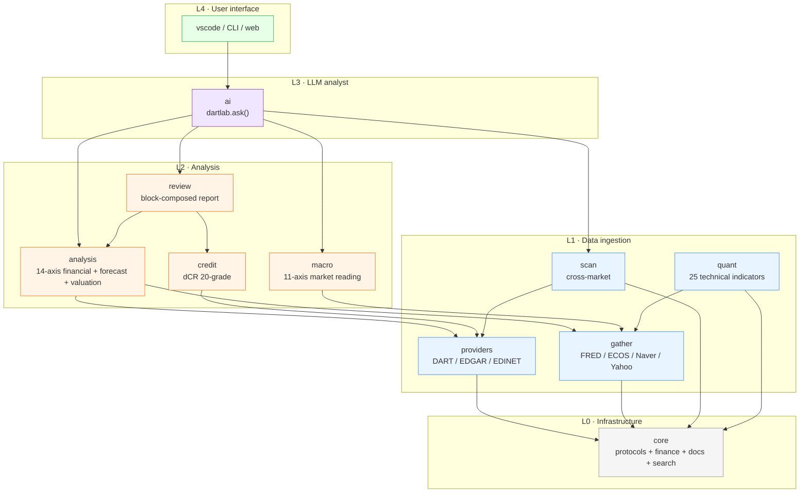

<div align="center">

<br>


<h3>DartLab</h3>

<p><b>One stock code. The whole story.</b></p>
<p>DART + EDGAR filings, structured and comparable — in one line of Python.</p>

<p>
<a href="https://pypi.org/project/dartlab/"></a>
<a href="https://pypi.org/project/dartlab/"></a>
<a href="LICENSE"></a>
<a href="https://github.com/eddmpython/dartlab/actions/workflows/ci.yml"></a>
<a href="https://codecov.io/gh/eddmpython/dartlab"></a>
<a href="https://eddmpython.github.io/dartlab/"></a>
<a href="https://eddmpython.github.io/dartlab/blog/"></a>
</p>

<p>
<a href="https://eddmpython.github.io/dartlab/">Docs</a> · <a href="https://eddmpython.github.io/dartlab/blog/">Blog</a> · <a href="https://huggingface.co/spaces/eddmpython/dartlab">Live Demo</a> · <a href="https://colab.research.google.com/github/eddmpython/dartlab/blob/master/notebooks/colab/01_company.ipynb">Open in Colab</a> · <a href="https://molab.marimo.io/github/eddmpython/dartlab/blob/master/notebooks/marimo/01_company.py">Open in Molab</a> · <a href="README_KR.md">한국어</a> · <a href="https://buymeacoffee.com/eddmpython">Sponsor</a>
</p>

<p>
<a href="https://huggingface.co/datasets/eddmpython/dartlab-data"></a>
</p>

<a href="https://www.youtube.com/shorts/97lYLWMWzvA"></a>

</div>

## The Problem

A public company files hundreds of pages every quarter. Revenue trends, risk warnings, management strategy, competitive position — the complete truth about a company, written by the company itself.

**Nobody reads it.**

Not because they don't want to. Because the same information is named differently by every company, structured differently every year, and scattered across formats designed for regulators, not readers. The same "revenue" appears as `ifrs-full_Revenue`, `dart_Revenue`, `SalesRevenue`, or dozens of Korean variations. The same "business overview" is titled differently in every filing.

DartLab is built on one premise: **every period must be comparable, and every company must be comparable.** It normalizes disclosure sections into a topic-period grid (~95% mapping rate) and standardizes XBRL accounts into canonical names (~97% mapping rate) — so you compare companies, not filing formats.

## Quick Start

```bash
uv add dartlab

pip install dartlab              # core + AI (openai, gemini included)
pip install dartlab[server]      # + web server (FastAPI, MCP)
pip install dartlab[viz]         # + charts (Plotly)
pip install dartlab[all]         # everything
```

```python
import dartlab

c = dartlab.Company("005930")       # Samsung Electronics

c.sections                          # every topic, every period, side by side
# shape: (41, 12) — 41 topics across 12 periods
#                     2025Q4  2024Q4  2024Q3  2023Q4  ...
# companyOverview       v       v       v       v
# businessOverview      v       v       v       v
# riskManagement        v       v       v       v

c.show("businessOverview")          # what this company actually does
c.diff("businessOverview")          # what changed since last year
c.BS                                # standardized balance sheet
c.ratios                            # financial ratios, already calculated

# Same interface, different country
us = dartlab.Company("AAPL")
us.show("business")
us.ratios

# Ask in natural language
dartlab.ask("Analyze Samsung Electronics financial health")
```

No API key needed. Data auto-downloads from [HuggingFace](https://huggingface.co/datasets/eddmpython/dartlab-data) on first use, then loads instantly from local cache.

## What DartLab Is

13 engines, one calling convention. Each engine is callable with `dartlab.engine()` for the guide and `dartlab.engine("axis")` for one example.

| Layer | Engine | What it does | Entry point | Notebook |
|-------|--------|--------------|-------------|----------|
| Data | [Data](ops/data.md) | Pre-built HuggingFace datasets, auto-download | `Company("005930")` | — |
| L0/L1 | [Company](ops/company.md) | Sections horizontalization + 4 namespaces | `c.show()`, `c.select()` | [01](notebooks/marimo/01_company.py) |
| L1 | [Gather](ops/gather.md) | External market data (price, flow, macro, news) | `dartlab.gather()` | [02](notebooks/marimo/02_gather.py) |
| L1 | [Scan](ops/scan.md) | Cross-company comparison across 13 axes | `dartlab.scan()` | [03](notebooks/marimo/03_scan.py) |
| L1 | [Quant](ops/quant.md) | Quantitative axes (momentum/factor/pattern) | `c.quant()` | [04](notebooks/marimo/04_quant.py) |
| L2 | [Analysis](ops/analysis.md) | 14-axis financial + valuation + forecast | `c.analysis("financial", "수익성")` | [05](notebooks/marimo/05_analysis.py) |
| L2 | [Macro](ops/macro.md) | Market-level macro — 11 axes, no Company needed | `dartlab.macro("사이클")` | [06](notebooks/marimo/06_macro.py) |
| L2 | [Credit](ops/credit.md) | Independent credit rating (dCR 20-grade) | `c.credit("등급")` | [07](notebooks/marimo/07_credit.py) |
| L2 | [Review](ops/review.md) | 4-engine composition (analysis + credit + macro + quant) | `c.review("수익성")` | [08](notebooks/marimo/08_review.py) |
| L3 | [AI](ops/ai.md) | Active analyst — code execution + interpretation | `dartlab.ask()` | [09](notebooks/marimo/09_ai.py) |
| core | [Search](ops/search.md) | Semantic filing search *(alpha)* | `dartlab.search()` | [10](notebooks/marimo/10_search.py) |
| facade | [Listing](ops/listing.md) | Catalog API (companies, filings, topics) | `dartlab.listing()` | [11](notebooks/marimo/11_listing.py) |
| viz | [Viz](ops/viz.md) | Charts and diagrams (emit_chart) | `emit_chart({...})` | [12](notebooks/marimo/12_viz.py) |
| guide | [Guide](ops/guide.md) | Concierge — readiness, error handling, education | `dartlab.guide.checkReady()` | [13](notebooks/marimo/13_guide.py) |
| L4 | UI | VSCode extension | `dartlab chat --stdio` | — |

> All notebooks: [marimo](notebooks/marimo/) · [colab](notebooks/colab/) · [](https://marimo.app/github.com/eddmpython/dartlab/blob/master/notebooks/marimo)

### Company

> Design: [ops/company.md](ops/company.md)

Three data sources — docs (full-text disclosures), finance (XBRL statements), report (DART API) — merged into one object. Data auto-downloads from [HuggingFace](https://huggingface.co/datasets/eddmpython/dartlab-data), no setup needed.

```python
c = dartlab.Company("005930")

c.index                         # what's available -- topic list + periods
c.show("BS")                    # view data -- DataFrame per topic
c.select("IS", ["매출액"])       # extract data -- finance or docs, same pattern
c.trace("BS")                   # where it came from -- source provenance
c.diff()                        # what changed -- text changes across periods
```

### Scan — Cross-Company Comparison

> Design: [ops/scan.md](ops/scan.md)

13 axes across 2,700+ companies. Governance, workforce, capital, debt, cashflow, audit, insider, quality, liquidity, digest, network, account, ratio.

```python
dartlab.scan("governance")            # governance across all firms
dartlab.scan("ratio", "roe")          # ROE across all firms
dartlab.scan("cashflow")              # OCF/ICF/FCF + 8-pattern classification
```

### Gather — External Market Data

> Design: [ops/gather.md](ops/gather.md)

Price, flow, macro, news — all as Polars DataFrames.

```python
dartlab.gather("price", "005930")             # KR OHLCV
dartlab.gather("price", "AAPL", market="US")  # US stock
dartlab.gather("macro", "FEDFUNDS")           # auto-detects US
dartlab.gather("news", "삼성전자")             # Google News RSS
```

### Analysis — 14-Axis Financial Analysis

> Design: [ops/analysis.md](ops/analysis.md)

Revenue structure, profitability, growth, stability, cash flow, capital allocation — 14 axes that turn raw statements into a causal narrative. Each axis feeds into Review (reports), AI (interpretation), and humans (direct reading).

```python
c.analysis("financial", "수익성")       # profitability analysis
c.analysis("financial", "현금흐름")    # cash flow analysis

print(c.credit())                           # 8-axis guide DataFrame (self-discovery)
c.credit("등급")                            # dCR-AA, healthScore 93/100
c.credit("등급", detail=True)               # 7-axis narrative + metrics
```

### Credit — Independent Credit Rating

> Design: [ops/credit.md](ops/credit.md) | Reports: [dartlab.pages.dev/blog/credit-reports](https://dartlab.pages.dev/blog/credit-reports)

Independent credit analysis with 3-Track model (general/financial/holding), Notch Adjustment, CHS market correction, and separate financial statement blending.

**79-company validation: large-cap 87% (26/30), mid-cap 82% (41/50), full sample 70% (55/79, re-measurement pending after v5.0 overvaluation fix). Samsung AA+ exact match.** See [methodology](docs/methodology.md) for validation details.

```python
print(c.credit())           # self-discovery — 7 axes + grade

cr = c.credit("등급")        # main grade
print(cr["grade"])          # dCR-AA+
print(cr["healthScore"])    # 96 (0-100, higher is better)
print(cr["pdEstimate"])     # 0.01% default probability

cr = c.credit("등급", detail=True)  # 7-axis narrative + metrics + divergence explanation
print(cr["divergenceExplanation"])  # why it differs from agencies
```

Publish reports (credit narrative + audit are auto-included in review's 5막):

```python
from dartlab.review.publisher import publishReport
publishReport("005930")               # 6막 report including credit narrative + audit
```

### Review — Analysis to Report

> Design: [ops/review.md](ops/review.md)

Assembles analysis into a structured report. 4 output formats: rich (terminal), html, markdown, json.

```python
c.review()              # full report
c.reviewer()            # report + AI interpretation
```

**Sample reports:** [Samsung Electronics](docs/samples/005930.md) · [SK Hynix](docs/samples/000660.md) · [Kia](docs/samples/000270.md) · [HD Hyundai Heavy Industries](docs/samples/042660.md) · [SK Telecom](docs/samples/017670.md) · [LG Chem](docs/samples/051910.md) · [NCSoft](docs/samples/036570.md) · [Amorepacific](docs/samples/090430.md)

### Search — Find Filings by Meaning *(alpha)*

> Design: [ops/search.md](ops/search.md)

No model, no GPU, no cold start. 95% precision on 4M documents — better than neural embeddings at 1/100th the cost. See [methodology](docs/methodology.md) for benchmark details.

```python
dartlab.search("유상증자 결정")                     # find capital raise filings
dartlab.search("대표이사 변경", corp="005930")       # filter by company
dartlab.search("회사가 돈을 빌렸다")                 # natural language works too
```

### AI — Active Analyst

> Design: [ops/ai.md](ops/ai.md)

The AI writes and executes Python code using dartlab's full API. You see every line of code it runs. 60+ questions validated, 95%+ first-try success. See [methodology](docs/methodology.md) for validation scope and limits.

```python
dartlab.ask("Analyze Samsung Electronics financial health")
dartlab.ask("Samsung analysis", provider="gemini")  # free providers available
```

Providers: `gemini` (free), `groq` (free), `cerebras` (free), `oauth-codex` (ChatGPT subscription), `openai`, `ollama` (local), and more. Auto-fallback across providers when rate-limited.

### Architecture

```
L0  core/        Protocols, finance utils, docs utils, registry
L1  providers/   Country-specific data (DART, EDGAR, EDINET)
    gather/      External market data (Naver, Yahoo, FRED)
    scan/        Market-wide analysis — scan("group", "axis")
L2  analysis/    Financial + forecast + valuation + quant — analysis("group", "axis")
    credit/      Independent credit rating — c.credit()
    macro/       Market-level macro — dartlab.macro()
    review/      Block composition (analysis + credit)
L3  ai/          Active analyst — dartlab.ask()
L4  vscode/      VSCode extension (dartlab chat --stdio)
```

Import direction enforced by CI. Adding a new country means one provider package — zero core changes.

#### Layer consumption flow

Who consumes whom across the stack:



**Core rules**:
- Arrows always flow top → bottom (L4→L3→L2→L1→L0). Reverse imports forbidden (CI-enforced)
- L2 engines never import each other — analysis ↛ credit, macro ↛ analysis. Composition is review's or ai's job
- When adding a feature, pick the right layer first and let data flow in one direction only

## EDGAR (US)

Same interface, different data source. Auto-fetched from SEC API — no pre-download needed.

```python
# Korea (DART)                          # US (EDGAR)
c = dartlab.Company("005930")           c = dartlab.Company("AAPL")
c.sections                              c.sections
c.show("businessOverview")              c.show("business")
c.BS                                    c.BS
c.ratios                                c.ratios
c.diff("businessOverview")              c.diff("10-K::item7Mdna")
```

## Macro — Economy Without a Ticker

> Design: [ops/macro.md](ops/macro.md)

No Company needed. Read the economy with `import dartlab`.

```python
dartlab.macro("사이클")          # Business cycle — 4 phases
dartlab.macro("금리")            # Rates + Nelson-Siegel yield curve
dartlab.macro("예측")            # LEI + Cleveland Fed probit + Hamilton RS + GDP Nowcast
dartlab.macro("위기")            # Credit-to-GDP gap + Minsky + Koo + Fisher
dartlab.macro("기업집계")        # Bottom-up: earnings cycle, Ponzi ratio, leverage
dartlab.macro("종합")            # All 10 axes + 40 strategies + portfolio allocation

# Scenario
dartlab.macro("사이클", overrides={"hy_spread": 600})

# Backtest
dartlab.macro("금리", as_of="2022-01-01")
```

11 axes (cycle / rates / assets / sentiment / liquidity / forecast / crisis / inventory / corporate / trade / summary), 12 methods (Hamilton EM, Kalman DFM, Nelson-Siegel, Cleveland Fed probit, Sahm Rule, BIS Credit-to-GDP, GHS, Minsky, Koo, Fisher, Cu/Au, FCI), 40 investment strategies with strength/confidence — all implemented in **numpy only** (zero statsmodels/scipy).

Backtest result (2000-2024, FRED): Cleveland Fed probit detected **3/3 US recessions** with 2-16 month lead time, recall 90% at threshold 0.20.

## MCP — AI Assistant Integration

Built-in [MCP](https://modelcontextprotocol.io/) server for Claude Desktop, Claude Code, Cursor, and any MCP-compatible client.

```bash
# Claude Code — one line setup
claude mcp add dartlab -- uv run dartlab mcp

# Codex CLI
codex mcp add dartlab -- uv run dartlab mcp
```

<details>
<summary>Claude Desktop / Cursor config</summary>

Add to `claude_desktop_config.json` or `.cursor/mcp.json`:

```json
{
  "mcpServers": {
    "dartlab": {
      "command": "uv",
      "args": ["run", "dartlab", "mcp"]
    }
  }
}
```

Or auto-generate: `dartlab mcp --config claude-desktop`

</details>

## OpenAPI — Raw Public APIs

```python
from dartlab import OpenDart, OpenEdgar

# Korea (requires free API key from opendart.fss.or.kr)
d = OpenDart()
d.filings("삼성전자", "2024")
d.finstate("삼성전자", 2024)

# US (no API key needed)
e = OpenEdgar()
e.filings("AAPL", forms=["10-K", "10-Q"])
```

## Data

All data is pre-built on [HuggingFace](https://huggingface.co/datasets/eddmpython/dartlab-data) — auto-downloads on first use. EDGAR data comes directly from the SEC API.

| Dataset | Coverage | Size |
|---------|----------|------|
| DART docs | 2,500+ companies | ~8 GB |
| DART finance | 2,700+ companies | ~600 MB |
| DART report | 2,700+ companies | ~320 MB |
| EDGAR | On-demand | SEC API |

Pipeline: local cache (instant) → HuggingFace (auto-download) → DART API (with your key). Most users never leave the first two.

## Try It Now

**[Live Demo](https://huggingface.co/spaces/eddmpython/dartlab)** — no install, no Python

**Notebooks:** [Company](https://colab.research.google.com/github/eddmpython/dartlab/blob/master/notebooks/colab/01_company.ipynb) · [Scan](https://colab.research.google.com/github/eddmpython/dartlab/blob/master/notebooks/colab/02_scan.ipynb) · [Review](https://colab.research.google.com/github/eddmpython/dartlab/blob/master/notebooks/colab/03_review.ipynb) · [Gather](https://colab.research.google.com/github/eddmpython/dartlab/blob/master/notebooks/colab/04_gather.ipynb) · [Analysis](https://colab.research.google.com/github/eddmpython/dartlab/blob/master/notebooks/colab/05_analysis.ipynb) · [Ask (AI)](https://colab.research.google.com/github/eddmpython/dartlab/blob/master/notebooks/colab/06_ask.ipynb)

## Documentation

[Docs](https://eddmpython.github.io/dartlab/) · [Quick Start](https://eddmpython.github.io/dartlab/docs/getting-started/quickstart) · [API Overview](https://eddmpython.github.io/dartlab/docs/api/overview) · [Blog (120+ articles)](https://eddmpython.github.io/dartlab/blog/)

## Stability

| Tier | Scope |
|------|-------|
| **Stable** | DART Company (sections, show, trace, diff, BS/IS/CF, CIS, index, filings, profile), EDGAR Company core, valuation, forecast, simulation |
| **Beta** | EDGAR power-user (SCE, notes, freq, coverage), credit, insights, distress, ratios, timeseries, network, governance, workforce, capital, debt, chart/table/text tools, ask/chat, OpenDart, OpenEdgar, Server API, MCP |
| **Experimental** | AI tool calling, export, viz (charts) |

See [docs/stability.md](docs/stability.md).

## Contributing

**Contributors are very welcome.** Whether it's a bug report, a new analysis axis, a mapping fix, or a documentation improvement — every contribution makes dartlab better for everyone.

The one rule: **experiment first, engine second.** Validate your idea in `experiments/` before changing the engine. This keeps the core stable while making it easy to try bold ideas.

- **Experiment folder**: `experiments/XXX_name/` — each file must be independently runnable with actual results in its docstring
- **Data contributions** (e.g. `accountMappings.json`, `sectionMappings.json`): accepted when backed by experiment evidence
- Issues and PRs in Korean or English are both welcome
- Not sure where to start? Open an issue — we'll help you find the right place

## License

MIT
