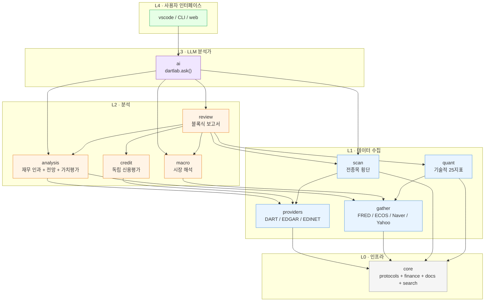

<div align="center">

<br>


<h3>DartLab</h3>

<p><b>종목코드 하나. 기업의 전체 이야기.</b></p>
<p>DART 전자공시와 EDGAR 공시, 한 줄의 Python으로 구조화하고 비교한다.</p>

<p>
<a href="https://pypi.org/project/dartlab/"></a>
<a href="https://pypi.org/project/dartlab/"></a>
<a href="LICENSE"></a>
<a href="https://github.com/eddmpython/dartlab/actions/workflows/ci.yml"></a>
<a href="https://codecov.io/gh/eddmpython/dartlab"></a>
<a href="https://eddmpython.github.io/dartlab/"></a>
<a href="https://eddmpython.github.io/dartlab/blog/"></a>
</p>

<p>
<a href="https://eddmpython.github.io/dartlab/">문서</a> · <a href="https://eddmpython.github.io/dartlab/blog/">블로그</a> · <a href="https://huggingface.co/spaces/eddmpython/dartlab">라이브 데모</a> · <a href="https://colab.research.google.com/github/eddmpython/dartlab/blob/master/notebooks/colab/01_company.ipynb">Colab에서 열기</a> · <a href="https://molab.marimo.io/github/eddmpython/dartlab/blob/master/notebooks/marimo/01_company.py">Molab에서 열기</a> · <a href="README_EN.md">English</a> · <a href="https://buymeacoffee.com/eddmpython">후원</a>
</p>

<p>
<a href="https://huggingface.co/datasets/eddmpython/dartlab-data"></a>
</p>

<a href="https://www.youtube.com/shorts/97lYLWMWzvA"></a>

</div>

## 회사에는 이야기가 있다

숫자를 나열하면 대시보드가 되지만, 숫자의 인과를 연결하면 스토리가 된다.
DartLab은 그 스토리를 읽는 두 가지 방법을 제공한다.

**사람이 직접 읽는다** — 종목코드 하나로 재무제표, 공시, 비율을 꺼내고, 6막 인과 구조로 "왜 이 회사의 마진이 이 수준인가"를 추적한다. 코드 한 줄이면 데이터가 나오고, 그 데이터가 이야기를 만든다.

**AI가 읽어준다** — 같은 도구를 AI가 조합해서 질문에 맞는 분석 흐름을 스스로 설계하고, 코드와 결과를 투명하게 보여준다. 사용자는 답만 얻는 게 아니라 분석 방법을 배운다.

두 경로 모두 같은 엔진 위에서 동작한다.

## 문제

삼성전자의 "매출액"을 5년간 비교하려고 한 적 있는가?

DART에서 사업보고서를 열면 같은 숫자가 `ifrs-full_Revenue`, `dart_Revenue`, `매출액`, `영업수익` 네 가지 이름으로 나온다. 작년과 올해의 목차 구조가 다르다. SK하이닉스와 비교하려면 같은 작업을 처음부터 다시 해야 한다.

**진짜 문제는 데이터가 없는 게 아니다. 같은 데이터가 너무 많은 이름으로 존재하는 것이다.**

DartLab은 하나의 전제 위에 서 있다: **모든 기간은 비교 가능해야 하고, 모든 회사는 비교 가능해야 한다.** 공시 섹션을 토픽-기간 그리드로 정규화하고(~95% 매핑율), XBRL 계정을 표준 이름으로 통일한다(~97% 매핑율) — 양식이 아니라 기업을 비교한다.

## 빠른 시작

```bash
uv add dartlab
```

```python
import dartlab

c = dartlab.Company("005930")       # 삼성전자

c.sections                          # 모든 topic, 모든 기간, 나란히
# shape: (41, 12) — 41개 토픽 × 12개 기간
#                     2025Q4  2024Q4  2024Q3  2023Q4  ...
# companyOverview       v       v       v       v
# businessOverview      v       v       v       v
# riskManagement        v       v       v       v

c.show("businessOverview")          # 이 회사가 실제로 뭘 하는지
c.diff("businessOverview")          # 작년 대비 뭐가 바뀌었는지
c.show("BS")                        # 표준화된 재무상태표
c.show("ratios")                    # 재무비율, 이미 계산됨
#                     2025    2024    2023    ...
# ROE               15.7%   5.4%   -4.3%
# 영업이익률         21.4%   8.6%   -0.9%
# 부채비율          37.5%  36.5%   35.6%

# 같은 인터페이스, 다른 나라
us = dartlab.Company("AAPL")
us.show("business")
us.show("ratios")

# 자연어로 질문
dartlab.ask("삼성전자 재무건전성 분석해줘")
# → AI가 코드를 실행하며 분석: "영업이익률이 8.6%→21.4%로 반등..."
```

API 키 불필요. [HuggingFace](https://huggingface.co/datasets/eddmpython/dartlab-data)에서 자동 다운로드, 로컬 캐시로 즉시 로드.

## DartLab은 무엇인가

하나의 호출 계약. `dartlab.엔진()` 으로 가이드 보고 `dartlab.엔진("축")` 으로 실행.

> **처음이라면?** `Company` → `Review` → `Ask` 순서로. 종목코드로 데이터를 보고, 보고서를 만들고, AI에게 물어본다.

| 레이어 | 엔진 | 하는 일 | 진입점 | 노트북 |
|--------|------|---------|--------|:------:|
| Data | [Data](ops/data.md) | HuggingFace 사전 구축, 자동 다운로드 | `Company("005930")` | — |
| L0/L1 | [Company](ops/company.md) | 공시 + 재무제표 + 정형 데이터를 종목코드 하나로 통합 | `c.show()`, `c.select()` | [](https://colab.research.google.com/github/eddmpython/dartlab/blob/master/notebooks/colab/01_company.ipynb) [](https://marimo.app/github.com/eddmpython/dartlab/blob/master/notebooks/marimo/01_company.py) |
| L1 | [Gather](ops/gather.md) | 외부 시장 데이터 (주가/수급/매크로/뉴스) | `dartlab.gather()` | [](https://colab.research.google.com/github/eddmpython/dartlab/blob/master/notebooks/colab/02_gather.ipynb) [](https://marimo.app/github.com/eddmpython/dartlab/blob/master/notebooks/marimo/02_gather.py) |
| L1 | [Scan](ops/scan.md) | 전 종목 횡단 비교 (거버넌스/비율/현금흐름 등) | `dartlab.scan()` | [](https://colab.research.google.com/github/eddmpython/dartlab/blob/master/notebooks/colab/03_scan.ipynb) [](https://marimo.app/github.com/eddmpython/dartlab/blob/master/notebooks/marimo/03_scan.py) |
| L1 | [Quant](ops/quant.md) | 기술적·정량 분석 (모멘텀/팩터/패턴) | `c.quant()` | [](https://colab.research.google.com/github/eddmpython/dartlab/blob/master/notebooks/colab/04_quant.ipynb) [](https://marimo.app/github.com/eddmpython/dartlab/blob/master/notebooks/marimo/04_quant.py) |
| L2 | [Analysis](ops/analysis.md) | 수익성/안정성/현금흐름 등 재무 인과 분석 + 가치평가 + 전망 | `c.analysis("financial", "수익성")` | [](https://colab.research.google.com/github/eddmpython/dartlab/blob/master/notebooks/colab/05_analysis.ipynb) [](https://marimo.app/github.com/eddmpython/dartlab/blob/master/notebooks/marimo/05_analysis.py) |
| L2 | [Macro](ops/macro.md) | 시장 레벨 매크로 (사이클/금리/유동성/심리/자산) | `dartlab.macro("사이클")` | [](https://colab.research.google.com/github/eddmpython/dartlab/blob/master/notebooks/colab/06_macro.ipynb) [](https://marimo.app/github.com/eddmpython/dartlab/blob/master/notebooks/marimo/06_macro.py) |
| L2 | [Credit](ops/credit.md) | 독립 신용평가 (dCR 등급, 부도확률, 건전도) | `c.credit("등급")` | [](https://colab.research.google.com/github/eddmpython/dartlab/blob/master/notebooks/colab/07_credit.ipynb) [](https://marimo.app/github.com/eddmpython/dartlab/blob/master/notebooks/marimo/07_credit.py) |
| L2 | [Review](ops/review.md) | 분석 엔진을 조합한 보고서 (rich/html/markdown/json) | `c.review("수익성")` | [](https://colab.research.google.com/github/eddmpython/dartlab/blob/master/notebooks/colab/08_review.ipynb) [](https://marimo.app/github.com/eddmpython/dartlab/blob/master/notebooks/marimo/08_review.py) |
| L3 | [AI](ops/ai.md) | 적극적 분석가 — 코드 실행 + 해석 | `dartlab.ask()` | [](https://colab.research.google.com/github/eddmpython/dartlab/blob/master/notebooks/colab/09_ai.ipynb) [](https://marimo.app/github.com/eddmpython/dartlab/blob/master/notebooks/marimo/09_ai.py) |
| L4 | [Channel](ops/channel.md) | 외부 공유 — `dartlab channel` 한 줄로 폰에서 PC dartlab 사용 | `dartlab channel` | — |
| core | [Search](ops/search.md) | 공시 시맨틱 검색 *(alpha)* | `dartlab.search()` | [](https://colab.research.google.com/github/eddmpython/dartlab/blob/master/notebooks/colab/10_search.ipynb) [](https://marimo.app/github.com/eddmpython/dartlab/blob/master/notebooks/marimo/10_search.py) |
| facade | [Listing](ops/listing.md) | 종목/공시/topic 카탈로그 API | `dartlab.listing()` | [](https://colab.research.google.com/github/eddmpython/dartlab/blob/master/notebooks/colab/11_listing.ipynb) [](https://marimo.app/github.com/eddmpython/dartlab/blob/master/notebooks/marimo/11_listing.py) |
| viz | [Viz](ops/viz.md) | 차트/다이어그램 (`emit_chart`) | `emit_chart({...})` | — |
| guide | [Guide](ops/guide.md) | 안내 데스크 — readiness/에러/교육 | `dartlab.guide.checkReady()` | — |

> 모든 노트북: [marimo](notebooks/marimo/) · [colab](notebooks/colab/) · [](https://marimo.app/github.com/eddmpython/dartlab/blob/master/notebooks/marimo)

### Company

> 설계: [ops/company.md](ops/company.md)

세 가지 데이터 소스 — docs(전문 공시), finance(XBRL 재무제표), report(DART API 정형 데이터) — 를 하나의 객체로 통합. [HuggingFace](https://huggingface.co/datasets/eddmpython/dartlab-data)에서 자동 다운로드, 설정 불필요.

```python
c = dartlab.Company("005930")

c.index                         # 뭐가 있는지 -- topic 목록 + 가용 기간
c.show("BS")                    # 데이터를 보려면 -- topic별 DataFrame
c.select("IS", ["매출액"])       # 데이터를 뽑으려면 -- finance든 docs든 같은 패턴
c.trace("BS")                   # 어디서 왔는지 -- source provenance
c.diff()                        # 뭐가 바뀌었는지 -- 기간 간 텍스트 변화
```

**주석(Notes)** — BS/IS 총액 이면의 항목별 분해. `c.show("topic")`으로 재무제표와 같은 패턴으로 접근. DART(K-IFRS HTML 파싱)와 EDGAR(US-GAAP XBRL 태그) 동일 인터페이스.

| `c.show(...)` | 내용 | DART | EDGAR |
|---------------|------|:----:|:-----:|
| `"inventory"` | 원재료/재공품/제품 분해 | ✅ | ✅ |
| `"borrowings"` | 단기/장기 차입금 분해 | ✅ | ✅ |
| `"tangibleAsset"` | 유형자산 취득원가/감가상각/장부가 | ✅ | ✅ |
| `"intangibleAsset"` | 영업권/개발비 등 | ✅ | ✅ |
| `"receivables"` | 매출채권 + 대손충당금 | ✅ | ✅ |
| `"provisions"` | 보증/소송/구조조정 충당부채 | ✅ | ✅ |
| `"eps"` | 기본/희석 주당이익 | ✅ | ✅ |
| `"segments"` | 부문별 매출/이익 | ✅ | ✅ |
| `"costByNature"` | 원재료/급여/감가상각 성격별 비용 | ✅ | ✅ |
| `"lease"` | 사용권자산/리스부채 | ✅ | ✅ |
| `"affiliates"` | 관계기업 지분법 투자 | ✅ | ✅ |
| `"investmentProperty"` | 투자부동산 공정가치/장부가 | ✅ | ✅ |

> [](https://marimo.app/github.com/eddmpython/dartlab/blob/master/notebooks/marimo/01_company.py) [](https://colab.research.google.com/github/eddmpython/dartlab/blob/master/notebooks/colab/01_company.ipynb)

### Scan — 전 종목 횡단 비교

> 설계: [ops/scan.md](ops/scan.md)

전 종목 대상 횡단 분석. 거버넌스, 인력, 주주환원, 부채, 현금흐름, 감사, 내부자, 이익의 질, 유동성, 네트워크, 계정/비율 비교 등.

```python
dartlab.scan("governance")            # 전종목 지배구조
dartlab.scan("ratio", "roe")          # 전종목 ROE
dartlab.scan("cashflow")              # OCF/ICF/FCF + 8유형 패턴 분류
```

### Gather — 외부 시장 데이터

> 설계: [ops/gather.md](ops/gather.md)

주가, 수급, 거시지표, 뉴스 — Polars DataFrame으로.

```python
dartlab.gather("price", "005930")             # KR OHLCV
dartlab.gather("price", "AAPL", market="US")  # US 주가
dartlab.gather("macro", "FEDFUNDS")           # 자동 US 감지
dartlab.gather("news", "삼성전자")             # Google News RSS
```

### Analysis — 재무 인과 분석

> 설계: [ops/analysis.md](ops/analysis.md)

수익구조 → 수익성 → 성장성 → 안정성 → 현금흐름 → 자본배분 → 가치평가 → 전망. 원본 재무제표를 인과 서사로 가공한다.

```python
c.analysis("financial", "수익성")       # 수익성 분석
c.analysis("수익성")                     # 단축형 (financial 자동)

print(c.credit())                            # 사용 가능한 축 가이드 DataFrame (self-discovery)
c.credit("등급")                             # dCR-AA, 건전도 93/100
c.credit("등급", detail=True)                # 등급 + 서사 + 지표 시계열
```

### Credit — 독립 신용분석

> 설계: [ops/credit.md](ops/credit.md) | 보고서: [dartlab.pages.dev/blog/credit-reports](https://dartlab.pages.dev/blog/credit-reports)

3-Track 모델(일반/금융/지주) + Notch Adjustment + CHS 시장 보정 + 별도재무 블렌딩.

**79개사 검증: 대기업 87% (26/30), 중대형 82% (41/50), 전체 70% (55/79, v5.0 과대평가 수정 후 재측정 예정). 삼성전자 AA+ 정확 일치.** 검증 방법론은 [methodology](docs/methodology.md) 참조.

```python
print(c.credit())            # self-discovery — 사용 가능한 축 + 종합 등급

cr = c.credit("등급")        # 종합 등급
print(cr["grade"])          # dCR-AA+
print(cr["healthScore"])    # 96 (0-100, 높을수록 건전)
print(cr["pdEstimate"])     # 0.01% 부도확률

cr = c.credit("등급", detail=True)  # 등급 + 서사 + 지표 + 괴리 설명
print(cr["divergenceExplanation"])  # 신평사와 왜 다른지
```

신용분석 보고서 발간 (credit 서사 + 신평사 대조가 review 5막에 자동 통합):

```python
from dartlab.review.publisher import publishReport
publishReport("005930")               # 6막 보고서 (credit narrative + audit 포함)
```

### Review — 분석을 보고서로

> 설계: [ops/review.md](ops/review.md)

analysis를 구조화 보고서로 조립. 4개 출력 형식: rich(터미널), html, markdown, json.

```python
c.review()              # 전체 보고서
c.reviewer()            # 보고서 + AI 종합의견
```

> 삼성전자 보고서 미리보기: *"매출 +23.8% 성장, 영업이익률 8.6%→21.4% 반등. FCF 양수 전환, ROIC > WACC — 재투자가 가치를 창출하는 구간."*

**샘플 보고서:** [삼성전자](docs/samples/005930.md) · [SK하이닉스](docs/samples/000660.md) · [기아](docs/samples/000270.md) · [한화오션](docs/samples/042660.md) · [SK텔레콤](docs/samples/017670.md) · [LG화학](docs/samples/051910.md) · [엔씨소프트](docs/samples/036570.md) · [아모레퍼시픽](docs/samples/090430.md)

### 이야기꾼 — 숫자가 아니라 이야기다

> 설계: [ops/review.md](ops/review.md) · 시리즈: [기업이야기](https://eddmpython.github.io/dartlab/blog/series/company-reports)

기업분석은 비율 나열이 아니다. DartLab은 5개 엔진(analysis, credit, scan, quant, macro)의 결과를 **6막 스토리텔링 구조**로 조합해 블로그에 발간 가능한 기업이야기를 자동 생성한다.

```python
from dartlab.review.publisher import publishReport
publishReport("068270")    # 셀트리온 — 6막 기업이야기 자동 발간
```

**발간된 기업이야기:**

| 기업 | 이야기 |
|------|--------|
| [SK하이닉스](https://eddmpython.github.io/dartlab/blog/000660-skhynix) | 한국 반도체 30년의 미스터리, 영업이익률 58% |
| [삼양식품](https://eddmpython.github.io/dartlab/blog/003230-samyang-foods) | 라면 빅3 꼴등이 매출 2.3조 글로벌 식품 거인이 되기까지 |
| [두산에너빌리티](https://eddmpython.github.io/dartlab/blog/034020-doosan-enerbility) | 부채비율 305%에서 129%까지, 9년 다이어트의 진짜 모습 |
| [알테오젠](https://eddmpython.github.io/dartlab/blog/196170-alteogen) | 9년 적자 바이오텍이 한 건의 라이선스로 영업이익 +1,069억 |
| [HMM](https://eddmpython.github.io/dartlab/blog/011200-hmm) | 시장이 아니라 사이클이 주가를 결정하는 회사 |
| [셀트리온](https://eddmpython.github.io/dartlab/blog/068270-celltrion) | IMF로 직장 잃은 41세, 5천만원으로 시작해 25년 후 무형자산 13.78조 |
| [한화에어로스페이스](https://eddmpython.github.io/dartlab/blog/012450-hanwha-aerospace) | 삼성이 8,400억에 버린 무기가 수주잔고 37조가 됐다 |
| [HD현대일렉트릭](https://eddmpython.github.io/dartlab/blog/267260-hd-hyundai-electric) | 7년 전 적자 1,006억이 올해 1조가 됐다, 변압기 하나로 |
| [고려아연](https://eddmpython.github.io/dartlab/blog/010130-korea-zinc) | 50년 만에 첫 순손실 2,457억, 그런데 영업이익은 사상 최대 |
| [에이피알](https://eddmpython.github.io/dartlab/blog/278470-apr) | 화장품 회사가 가전을 4,070억 팔았다, 그게 시작이었다 |

<a href="https://www.youtube.com/watch?v=d7RUQIlimVM"></a>

> [셀트리온 이야기 보기](https://www.youtube.com/watch?v=d7RUQIlimVM) · [DartLab 30초 데모](https://www.youtube.com/shorts/97lYLWMWzvA) · [유튜브 채널](https://www.youtube.com/@eddmpython)

### Search — 공시를 의미로 검색 *(alpha)*

> 설계: [ops/search.md](ops/search.md)

모델 없음, GPU 없음, cold start 없음. 400만 문서 95% 정밀도 — 임베딩보다 정확, 1/100 비용. 벤치마크 상세는 [methodology](docs/methodology.md) 참조.

```python
dartlab.search("유상증자 결정")                     # 유상증자 공시 찾기
dartlab.search("대표이사 변경", corp="005930")       # 종목 필터
dartlab.search("회사가 돈을 빌렸다")                 # 자연어도 동작
```

### AI — 적극적 분석가

> 설계: [ops/ai.md](ops/ai.md)

AI가 dartlab의 전체 API로 Python 코드를 작성하고 실행한다. 모든 코드와 결과를 볼 수 있다. 60+ 질문 검증, 1회 성공률 95%+. 검증 범위와 한계는 [methodology](docs/methodology.md) 참조.

```python
dartlab.ask("삼성전자 재무건전성 분석해줘")
dartlab.ask("삼성전자 분석", provider="gemini")  # 무료 provider 사용 가능
```

Provider: `gemini`(무료), `groq`(무료), `cerebras`(무료), `oauth-codex`(ChatGPT 구독), `openai`, `ollama`(로컬) 등. Rate limit 시 자동 대체.

### Channel — 외부에서 내 PC dartlab 접근

> 설계: [ops/channel.md](ops/channel.md)

PC에서 한 줄이면 폰에서 dartlab UI 그대로 사용. Microsoft DevTunnels 자동 셋업.

```bash
dartlab channel
```

흐름:
1. winget으로 devtunnel CLI 자동 설치 (최초 1회)
2. GitHub OAuth 1회 인증 (브라우저 자동 오픈)
3. 영구 URL + QR 발급 (`https://<id>-8400.<region>.devtunnels.ms`)
4. 폰 Chrome에 URL/QR 입력 → dartlab UI 그대로 동작

도메인 0개, 토큰 트릭 0개. VS Code Remote Tunnels와 동일 인프라라 모바일 호환성 검증됨. 메시징 봇 옵션 (`--telegram/slack/discord`) 도 지원.

### 아키텍처

```
L0  core/        프로토콜, 재무 유틸, docs 유틸, 레지스트리
L1  providers/   국가별 데이터 (DART, EDGAR, EDINET)
    gather/      외부 시장 데이터 (Naver, Yahoo, FRED)
    scan/        시장 횡단분석 — scan("그룹", "축")
    quant/       기술적 분석 — c.quant()
L2  analysis/    재무 + 전망 + 가치평가 — analysis("그룹", "축")
    credit/      독립 신용평가 — c.credit()
    macro/       시장 레벨 매크로 — dartlab.macro()
    review/      5엔진 조합 보고서 (analysis + credit + scan + quant + macro)
L3  ai/          적극적 분석가 — dartlab.ask()
L4  vscode/      VSCode 확장 (dartlab chat --stdio)
    ui/web/      Svelte SPA 웹 인터페이스
```

import 방향은 CI 강제. 새 국가 추가 = provider 패키지 하나, core 수정 0줄.

#### 레이어 간 소비 흐름

각 레이어가 누구를 소비하고 누구에게 소비되는지:



**핵심 규칙**:
- 화살표는 항상 위→아래 (L4→L3→L2→L1→L0). 역방향 import 금지 (CI 검증)
- L2 엔진끼리는 서로 import 금지 — analysis ↛ credit, macro ↛ analysis. 조합은 review 또는 ai의 몫
- 새 기능 추가 시 적합한 레이어를 먼저 결정한 뒤 한 방향으로만 데이터가 흐르게 한다

## EDGAR (미국)

같은 인터페이스, 다른 데이터 소스. SEC API에서 자동 수집, 사전 다운로드 불필요.

```python
# Korea (DART)                          # US (EDGAR)
c = dartlab.Company("005930")           c = dartlab.Company("AAPL")
c.sections                              c.sections
c.show("businessOverview")              c.show("business")
c.show("BS")                            c.show("BS")
c.show("ratios")                        c.show("ratios")
c.diff("businessOverview")              c.diff("10-K::item7Mdna")
```

## Macro — 종목코드 없이 경제를 읽다

> 설계: [ops/macro.md](ops/macro.md)

Company 없이 경제 환경을 분석합니다. `import dartlab` 하나로.

```python
dartlab.macro("사이클")          # 경기 4국면 판별
dartlab.macro("금리")            # 금리 + Nelson-Siegel 수익률곡선
dartlab.macro("예측")            # LEI + 침체확률 + Hamilton RS + GDP Nowcast
dartlab.macro("위기")            # Credit-to-GDP + Minsky + Koo + Fisher
dartlab.macro("기업집계")        # 전종목 이익사이클, Ponzi비율, 레버리지
dartlab.macro("종합")            # 매크로 종합 + 투자전략 + 포트폴리오 매핑

# 시나리오
dartlab.macro("사이클", overrides={"hy_spread": 600})

# 백테스트
dartlab.macro("금리", as_of="2022-01-01")
```

시장 사이클·금리·유동성·심리·자산 신호와 글로벌 거시 분석 방법론(Hamilton EM, Kalman DFM, Nelson-Siegel, Cleveland Fed 프로빗, Sahm Rule, BIS Credit-to-GDP, GHS, Minsky, Koo, Fisher, Cu/Au, FCI)을 **numpy만으로 직접 구현** (statsmodels/scipy 0).

백테스트 실증 (2000-2024, FRED): Cleveland Fed 프로빗이 **미국 3/3 침체를 2-16개월 전에 사전 감지**, recall 90%.

## MCP — AI 어시스턴트 연동

[MCP](https://modelcontextprotocol.io/) 서버 내장. Claude Desktop, Claude Code, Cursor에서 사용 가능.

```bash
# Claude Code — 한 줄 설정
claude mcp add dartlab -- uv run dartlab mcp

# Codex CLI
codex mcp add dartlab -- uv run dartlab mcp
```

<details>
<summary>Claude Desktop / Cursor 설정</summary>

`claude_desktop_config.json` 또는 `.cursor/mcp.json`에 추가:

```json
{
  "mcpServers": {
    "dartlab": {
      "command": "uv",
      "args": ["run", "dartlab", "mcp"]
    }
  }
}
```

자동 생성: `dartlab mcp --config claude-desktop`

</details>

## OpenAPI — 원본 공공 API

```python
from dartlab import OpenDart, OpenEdgar

# 한국 (opendart.fss.or.kr 무료 API 키 필요)
d = OpenDart()
d.filings("삼성전자", "2024")
d.finstate("삼성전자", 2024)

# 미국 (API 키 불필요)
e = OpenEdgar()
e.filings("AAPL", forms=["10-K", "10-Q"])
```

## 데이터

모든 데이터는 [HuggingFace](https://huggingface.co/datasets/eddmpython/dartlab-data)에 사전 구축 — 자동 다운로드. EDGAR는 SEC API 직접 수집.

| 데이터셋 | 규모 | 용량 |
|----------|------|------|
| DART docs | 2,500+ 기업 | ~8 GB |
| DART finance | 2,700+ 기업 | ~600 MB |
| DART report | 2,700+ 기업 | ~320 MB |
| EDGAR | 주문형 | SEC API |

파이프라인: 로컬 캐시(즉시) → HuggingFace(자동 다운로드) → DART API(키 필요). 대부분 처음 두 단계로 충분.

## 바로 시작하기

**[라이브 데모](https://huggingface.co/spaces/eddmpython/dartlab)** — 설치 없이 브라우저에서 바로

**노트북:** [Company](https://colab.research.google.com/github/eddmpython/dartlab/blob/master/notebooks/colab/01_company.ipynb) · [Scan](https://colab.research.google.com/github/eddmpython/dartlab/blob/master/notebooks/colab/02_scan.ipynb) · [Review](https://colab.research.google.com/github/eddmpython/dartlab/blob/master/notebooks/colab/03_review.ipynb) · [Gather](https://colab.research.google.com/github/eddmpython/dartlab/blob/master/notebooks/colab/04_gather.ipynb) · [Analysis](https://colab.research.google.com/github/eddmpython/dartlab/blob/master/notebooks/colab/05_analysis.ipynb) · [Ask (AI)](https://colab.research.google.com/github/eddmpython/dartlab/blob/master/notebooks/colab/06_ask.ipynb)

## 문서

[문서](https://eddmpython.github.io/dartlab/) · [빠른 시작](https://eddmpython.github.io/dartlab/docs/getting-started/quickstart) · [API 개요](https://eddmpython.github.io/dartlab/docs/api/overview)

**블로그 (120+ 글):** [전체](https://eddmpython.github.io/dartlab/blog/) · [기업이야기](https://eddmpython.github.io/dartlab/blog/series/company-reports) · [신용평가 보고서](https://eddmpython.github.io/dartlab/blog/credit-reports) · [매크로 보고서](https://eddmpython.github.io/dartlab/blog/macro-reports)

## 안정성

| Tier | 범위 |
|------|------|
| **Stable** | DART Company (sections, show, trace, diff, BS/IS/CF, CIS, index, filings, profile), EDGAR Company core, valuation, forecast, simulation |
| **Beta** | EDGAR 파워유저 (SCE, notes, freq, coverage), credit, insights, distress, ratios, timeseries, network, governance, workforce, capital, debt, chart/table/text 도구, ask/chat, OpenDart, OpenEdgar, Server API, MCP |
| **Experimental** | AI 도구 호출, export, viz (차트) |

자세한 기준은 [docs/stability.md](docs/stability.md)를 본다.

## 기여

**기여자를 대환영합니다.** 버그 리포트, 새 분석 축, 매핑 수정, 문서 개선 — 어떤 기여든 dartlab을 더 좋게 만듭니다.

규칙 하나: **실험 먼저, 엔진은 그 다음.** 아이디어는 `experiments/`에서 검증한 뒤 엔진에 반영한다.

- **실험 폴더**: `experiments/XXX_name/` — 각 파일은 독립 실행 가능, docstring에 실제 결과 포함
- **데이터 기여** (`accountMappings.json`, `sectionMappings.json` 등): 실험 증거가 있을 때 수용
- 한국어/영어 이슈와 PR 모두 환영
- 어디서 시작할지 모르겠다면 이슈를 열어주세요

## 라이선스

MIT
