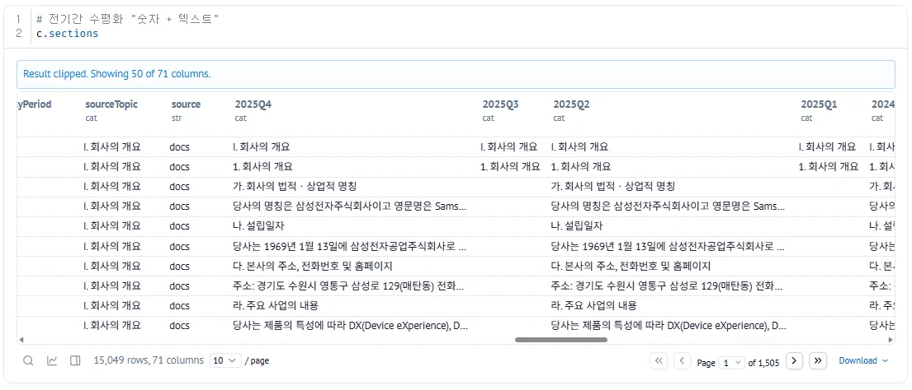
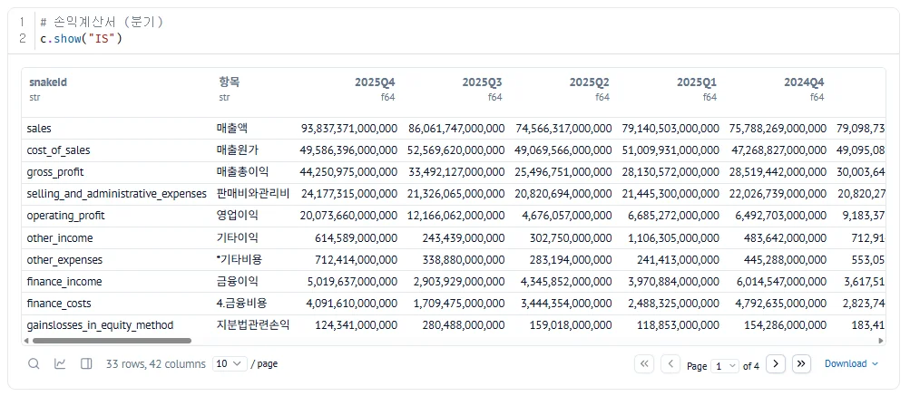
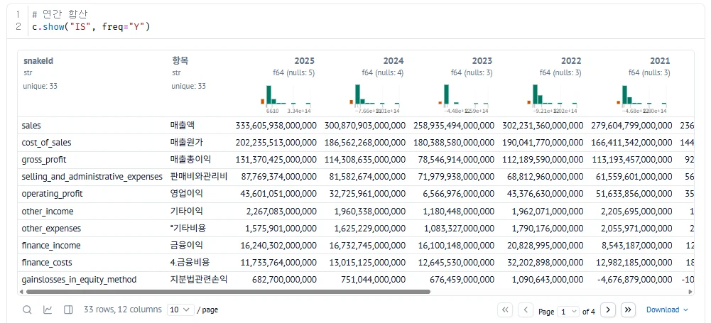
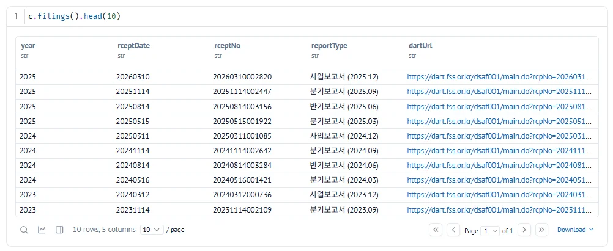
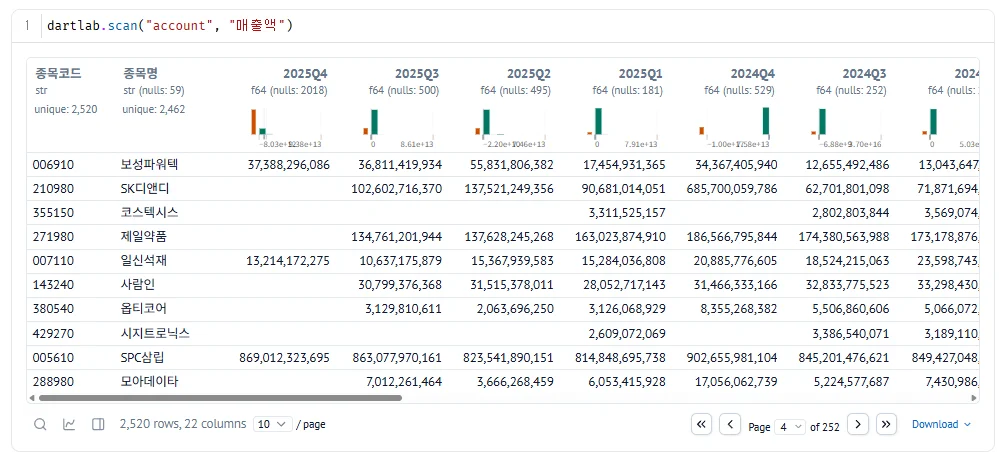
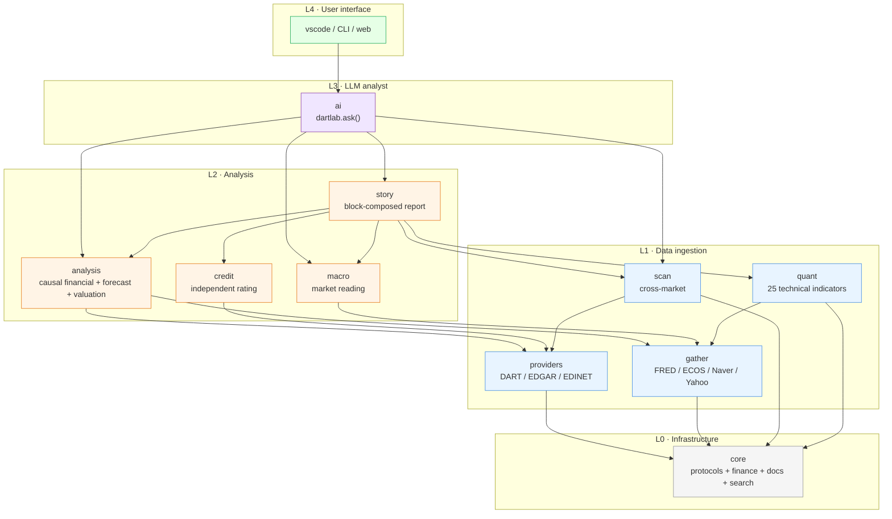
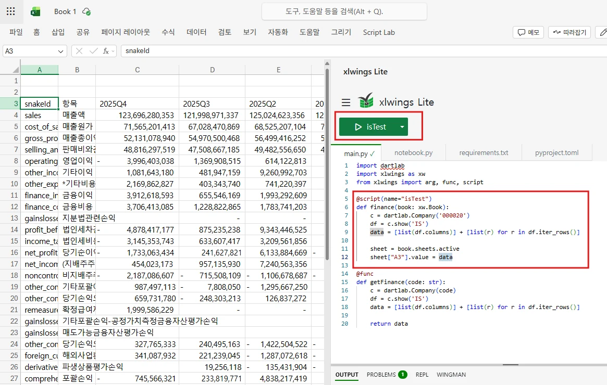
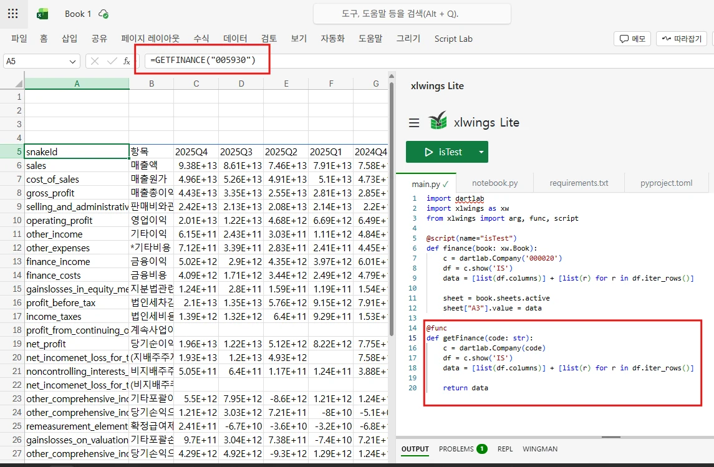

<div align="center">

<br>


<h3>DartLab</h3>

<p><b>One stock code. The full company story.</b></p>
<p>Korean DART + US SEC EDGAR filings, read and compared in one line of Python.</p>

<p>
<a href="https://pypi.org/project/dartlab/"></a>
<a href="https://pypi.org/project/dartlab/"></a>
<a href="LICENSE"></a>
<a href="https://github.com/eddmpython/dartlab/actions/workflows/ci-fast.yml"></a>
<a href="https://codecov.io/gh/eddmpython/dartlab"></a>
<a href="https://eddmpython.github.io/dartlab/"></a>
<a href="https://eddmpython.github.io/dartlab/blog/"></a>
</p>

<p>
</p>

<p>
<a href="https://huggingface.co/datasets/eddmpython/dartlab-data"></a>
<a href="https://github.com/eddmpython/dartlab-desktop/releases/latest/download/DartLab.exe"></a>
</p>

<a href="https://www.youtube.com/shorts/97lYLWMWzvA"></a>

</div>

## Every Company Has a Story

Line up numbers and you get a dashboard. Connect their causes and you get a story. DartLab gives you two ways to read that story.

**Read it yourself** — pull financials, filings, and ratios with a single stock code, then trace "why is this company's margin at this level" through a six-act causal structure. One line of code, and the data tells a story.

**Let AI read it for you** — the same engines, orchestrated by AI to design an analysis flow tailored to your question, showing every line of code and every result. You don't just get an answer — you learn the method.

Both paths run on the same engines.

## The Problem

Have you ever tried to compare Samsung's "Revenue" across five years?

Open a DART annual report and the same number appears as `ifrs-full_Revenue`, `dart_Revenue`, `매출액`, `영업수익` — four different names. Last year's table of contents doesn't match this year's. Comparing with SK Hynix means starting from scratch.

**The real problem isn't missing data. It's the same data existing under too many names.**

DartLab is built on one premise: **every period must be comparable, and every company must be comparable.** It normalizes disclosure sections into a topic-period grid (~95% mapping rate) and standardizes XBRL accounts into canonical names (~97% mapping rate) — so you compare companies, not filing formats.

## Quick Start

```bash
uv add dartlab
```

```python
import dartlab

c = dartlab.Company("005930")       # Samsung Electronics

c.sections                          # every topic, every period, side by side
# shape: (41, 12) — 41 topics across 12 periods
#                     2025Q4  2024Q4  2024Q3  2023Q4  ...
# companyOverview       v       v       v       v
# businessOverview      v       v       v       v
# riskManagement        v       v       v       v
```

> Text and numbers on a single timeline — the core of cross-period comparability
>
> 

```python

c.show("IS")                        # income statement — quarterly by default
```

> Quarterly financials are the default — snakeId + Korean labels side by side
>
> 

```python
c.show("IS", freq="Y")             # freq="Y" for annual aggregation
```

> Same data, annualized — automatic 4-quarter summation
>
> 

```python
c.show("businessOverview")          # what this company actually does
c.diff("businessOverview")          # what changed since last year
c.show("ratios")                    # financial ratios, already calculated

c.filings()                         # all reports — direct links to DART viewer
```

> From annual reports to quarterly filings, dartUrl links straight to the original
>
> 

```python
# Same interface, different country
us = dartlab.Company("AAPL")
us.show("business")
us.show("ratios")

# Ask in natural language
dartlab.ask("Analyze Samsung Electronics financial health")
# → AI executes code and analyzes: "Operating margin rebounded from 8.6% to 21.4%..."
```

No API key needed. Data auto-downloads from [HuggingFace](https://huggingface.co/datasets/eddmpython/dartlab-data) on first use, then loads instantly from local cache.

## Three Layers of Analysis

Company prepares data with one stock code. Three layers analyze it.

1. **Analysis engines** — produce numbers. Margin trends, cash flow patterns, default probability, peer comparison, macro cycles. No interpretation — numbers and evidence only.
2. **story** — assembles engine data into reports by combining blocks. 11 report types × 7 company templates. No interpretation — systematically arranges evidence from diverse perspectives.
3. **AI** — calls engines directly and makes judgments. Questions results, verifies against raw data, recalculates with adjusted assumptions when something looks wrong. dartlab's active analyst.

## What DartLab Is

One calling convention. Each engine: `dartlab.engine()` for the guide, `dartlab.engine("axis")` to run.

> **New here?** Start with `Company` → `Story` → `Ask`. Load data, generate a report, then ask AI.

| Layer | Engine | What it does | Entry point | Notebook |
|-------|--------|--------------|-------------|:--------:|
| Data | [Data](/skills) | Pre-built HuggingFace datasets, auto-download | `Company("005930")` | — |
| L0/L1 | [Company](/skills) | Filings + financials + structured data unified by ticker | `c.show()`, `c.select()` | [](https://colab.research.google.com/github/eddmpython/dartlab/blob/master/notebooks/colab/01_company.ipynb) [](https://marimo.app/github.com/eddmpython/dartlab/blob/master/notebooks/marimo/01_company.py) |
| L1 | [Gather](/skills) | External market data (price, flow, macro, news) | `dartlab.gather()` | [](https://colab.research.google.com/github/eddmpython/dartlab/blob/master/notebooks/colab/02_gather.ipynb) [](https://marimo.app/github.com/eddmpython/dartlab/blob/master/notebooks/marimo/02_gather.py) |
| L1 | [Scan](/skills) | Cross-company comparison (governance, ratios, cashflow, ...) | `dartlab.scan()` | [](https://colab.research.google.com/github/eddmpython/dartlab/blob/master/notebooks/colab/03_scan.ipynb) [](https://marimo.app/github.com/eddmpython/dartlab/blob/master/notebooks/marimo/03_scan.py) |
| L1 | [Quant](/skills) | Technical & quantitative analysis (momentum/factor/pattern) | `c.quant()` | [](https://colab.research.google.com/github/eddmpython/dartlab/blob/master/notebooks/colab/04_quant.ipynb) [](https://marimo.app/github.com/eddmpython/dartlab/blob/master/notebooks/marimo/04_quant.py) |
| L2 | [Analysis](/skills) | Profitability/stability/cashflow causal analysis + valuation + forecast | `c.analysis("financial", "수익성")` | [](https://colab.research.google.com/github/eddmpython/dartlab/blob/master/notebooks/colab/05_analysis.ipynb) [](https://marimo.app/github.com/eddmpython/dartlab/blob/master/notebooks/marimo/05_analysis.py) |
| L2 | [Macro](/skills) | Market-level macro (cycle/rates/liquidity/sentiment/assets) | `dartlab.macro("사이클")` | [](https://colab.research.google.com/github/eddmpython/dartlab/blob/master/notebooks/colab/06_macro.ipynb) [](https://marimo.app/github.com/eddmpython/dartlab/blob/master/notebooks/marimo/06_macro.py) |
| L2 | [Credit](/skills) | Independent credit rating (dCR grade, default probability, health) | `c.credit("등급")` | [](https://colab.research.google.com/github/eddmpython/dartlab/blob/master/notebooks/colab/07_credit.ipynb) [](https://marimo.app/github.com/eddmpython/dartlab/blob/master/notebooks/marimo/07_credit.py) |
| L2 | [Industry](/skills) | Industry mapper — all listed companies × stage/role/stream + supply-chain edges (atlas at `/map`) | `c.industry()`, `dartlab.industry("semiconductor")` | — |
| L2 | [Story](/skills) | Report builder — 6-engine block composition (analysis/quant/credit/macro/scan/**industry**), 11 types × 7 templates (no interpretation) | `c.story("수익성")` | [](https://colab.research.google.com/github/eddmpython/dartlab/blob/master/notebooks/colab/08_review.ipynb) [](https://marimo.app/github.com/eddmpython/dartlab/blob/master/notebooks/marimo/08_review.py) |
| L3 | [AI/Skills](/skills) | Skill search + DartLab execution + ref verification workbench | `dartlab.ask()` | [](https://colab.research.google.com/github/eddmpython/dartlab/blob/master/notebooks/colab/09_ai.ipynb) [](https://marimo.app/github.com/eddmpython/dartlab/blob/master/notebooks/marimo/09_ai.py) |
| L4 | [Channel](/skills) | External sharing — `dartlab channel` brings PC dartlab to your phone | `dartlab channel` | — |
| core | [Search](/skills) | Semantic filing search *(alpha)* | `dartlab.search()` | [](https://colab.research.google.com/github/eddmpython/dartlab/blob/master/notebooks/colab/10_search.ipynb) [](https://marimo.app/github.com/eddmpython/dartlab/blob/master/notebooks/marimo/10_search.py) |
| facade | [Listing](/skills) | Catalog API (companies, filings, topics) | `dartlab.listing()` | [](https://colab.research.google.com/github/eddmpython/dartlab/blob/master/notebooks/colab/11_listing.ipynb) [](https://marimo.app/github.com/eddmpython/dartlab/blob/master/notebooks/marimo/11_listing.py) |
| viz | [Viz](/skills) | Charts and diagrams (`emit_chart`) | `emit_chart({...})` | — |

> All notebooks: [marimo](notebooks/marimo/) · [colab](notebooks/colab/) · [](https://marimo.app/github.com/eddmpython/dartlab/blob/master/notebooks/marimo)

### Company

> Design: [engines.company](/skills)

Three data sources — docs (full-text disclosures), finance (XBRL statements), report (DART API) — merged into one object. Data auto-downloads from [HuggingFace](https://huggingface.co/datasets/eddmpython/dartlab-data), no setup needed.

```python
c = dartlab.Company("005930")

c.index                         # what's available -- topic list + periods
c.show("BS")                    # view data -- DataFrame per topic
c.select("IS", ["매출액"])       # extract data -- finance or docs, same pattern
c.trace("BS")                   # where it came from -- source provenance
c.diff()                        # what changed -- text changes across periods
```

**Notes** — line items behind BS/IS totals. Access via `c.show("topic")`, same pattern as finance topics. Works for both DART (K-IFRS HTML parsing) and EDGAR (US-GAAP XBRL tags).

| `c.show(...)` | What it shows | DART | EDGAR |
|---------------|---------------|:----:|:-----:|
| `"inventory"` | Raw materials / work-in-progress / finished goods | ✅ | ✅ |
| `"borrowings"` | Short-term / long-term debt breakdown | ✅ | ✅ |
| `"tangibleAsset"` | PPE gross / net / depreciation | ✅ | ✅ |
| `"intangibleAsset"` | Goodwill / development costs | ✅ | ✅ |
| `"receivables"` | Trade receivables + allowance | ✅ | ✅ |
| `"provisions"` | Warranty / litigation / restructuring | ✅ | ✅ |
| `"eps"` | Basic / diluted EPS | ✅ | ✅ |
| `"segments"` | Revenue / profit by segment | ✅ | ✅ |
| `"costByNature"` | Raw materials / wages / depreciation | ✅ | ✅ |
| `"lease"` | Right-of-use assets / lease liabilities | ✅ | ✅ |
| `"affiliates"` | Equity method investments | ✅ | ✅ |
| `"investmentProperty"` | Fair value / carrying amount | ✅ | ✅ |

> [](https://marimo.app/github.com/eddmpython/dartlab/blob/master/notebooks/marimo/01_company.py) [](https://colab.research.google.com/github/eddmpython/dartlab/blob/master/notebooks/colab/01_company.ipynb)

### Scan — Cross-Company Comparison

> Design: [engines.scan](/skills)

Cross-company analysis across all listed firms. Governance, workforce, capital, debt, cashflow, audit, insider, quality, liquidity, network, account/ratio comparison, and more.

```python
dartlab.scan("governance")            # governance across all firms
dartlab.scan("ratio", "roe")          # ROE across all firms
dartlab.scan("account", "매출액")      # revenue time-series across all firms
```

> All listed companies at a glance — quarterly revenue side by side
>
> 

### Gather — External Market Data

> Design: [engines.gather](/skills)

Price, flow, macro, news — all as Polars DataFrames.

```python
dartlab.gather("price", "005930")             # KR OHLCV
dartlab.gather("price", "AAPL", market="US")  # US stock
dartlab.gather("macro", "FEDFUNDS")           # auto-detects US
dartlab.gather("news", "삼성전자")             # Google News RSS
```

### Analysis — 14-Axis Financial Analysis

> Design: [engines.analysis](/skills)

Revenue structure → profitability → growth → stability → cash flow → capital allocation → valuation → forecast. Turns raw statements into a causal narrative that feeds Review, AI, and direct human reading.

```python
c.analysis("financial", "수익성")       # profitability analysis
c.analysis("financial", "현금흐름")    # cash flow analysis

print(c.credit())                           # available-axes guide DataFrame (self-discovery)
c.credit("등급")                            # dCR-AA, healthScore 93/100
c.credit("등급", detail=True)               # grade + narrative + metrics
```

### Credit — Independent Credit Rating

> Design: [engines.credit](/skills) | Reports: [dartlab.pages.dev/blog/credit-reports](https://dartlab.pages.dev/blog/credit-reports)

Independent credit analysis with 3-Track model (general/financial/holding), Notch Adjustment, CHS market correction, and separate financial statement blending.

**79-company validation: large-cap 87% (26/30), mid-cap 82% (41/50), full sample 70% (55/79, re-measurement pending after v5.0 overvaluation fix). Samsung AA+ exact match.** See [methodology](https://eddmpython.github.io/dartlab/skills/operation.methodology) for validation details.

```python
print(c.credit())           # self-discovery — available axes + grade

cr = c.credit("등급")        # main grade
print(cr["grade"])          # dCR-AA+
print(cr["healthScore"])    # 96 (0-100, higher is better)
print(cr["pdEstimate"])     # 0.01% default probability

cr = c.credit("등급", detail=True)  # grade + narrative + metrics + divergence explanation
print(cr["divergenceExplanation"])  # why it differs from agencies
```

Publish reports (credit narrative + audit are auto-included in story's 5막):

```python
from dartlab.story.publisher import publishReport
publishReport("005930")               # 6막 report including credit narrative + audit
```

### Macro — Economy Without a Ticker

> Design: [engines.macro](/skills)

Analyze the economic environment without a Company. Just `import dartlab`.

```python
dartlab.macro("사이클")          # business cycle — 4 phases
dartlab.macro("금리")            # rates + Nelson-Siegel yield curve
dartlab.macro("예측")            # LEI + recession prob + Hamilton RS + GDP Nowcast
dartlab.macro("종합")            # macro synthesis + strategy + portfolio mapping
```

Market cycle, rates, liquidity, sentiment, and asset signals with global macro methodologies (Hamilton EM, Kalman DFM, Nelson-Siegel, Cleveland Fed probit, Sahm Rule, BIS Credit-to-GDP) — **pure numpy, zero statsmodels/scipy**.

Backtest (2000-2024, FRED): Cleveland Fed probit **detected all 3/3 US recessions 2-16 months ahead**, recall 90%.

### Story — Analysis to Report

> Design: [engines.story](/skills)

Assembles analysis into a structured report. 4 output formats: rich (terminal), html, markdown, json.

```python
c.story()              # full report
dartlab.ask()            # report + AI interpretation
```

> Samsung report preview: *"Revenue +23.8%, operating margin 8.6%→21.4%. FCF turned positive, ROIC > WACC — reinvestment is creating value."*

### Storyteller — Numbers Tell Stories

> Design: [engines.story](/skills) · Series: [Company Stories](https://eddmpython.github.io/dartlab/blog/series/company-reports)

Financial analysis isn't ratio tables. DartLab combines 5 engines (analysis, credit, scan, quant, macro) into a **6-act storytelling structure** that auto-generates publishable company stories.

```python
from dartlab.story.publisher import publishReport
publishReport("068270")    # Celltrion — auto-publish 6-act company story
```

**Published stories:**

| Company | Story |
|---------|-------|
| [SK Hynix](https://eddmpython.github.io/dartlab/blog/000660-skhynix) | 30-year Korean semiconductor mystery, 58% operating margin |
| [Samyang Foods](https://eddmpython.github.io/dartlab/blog/003230-samyang-foods) | From last place in Korea's ramen Big 3 to a ₩2.3T global food giant |
| [Doosan Enerbility](https://eddmpython.github.io/dartlab/blog/034020-doosan-enerbility) | Debt ratio from 305% to 129% — the real story of a 9-year diet |
| [Alteogen](https://eddmpython.github.io/dartlab/blog/196170-alteogen) | 9 years of losses, then one license deal turned ₩106.9B operating profit |
| [HMM](https://eddmpython.github.io/dartlab/blog/011200-hmm) | The company where cycles, not markets, decide the stock price |
| [Celltrion](https://eddmpython.github.io/dartlab/blog/068270-celltrion) | Laid off at 41 during IMF crisis, started with $50K — 25 years later, ₩13.78T in intangibles |
| [Hanwha Aerospace](https://eddmpython.github.io/dartlab/blog/012450-hanwha-aerospace) | Samsung dumped it for ₩840B — now it has ₩37T in order backlog |
| [HD Hyundai Electric](https://eddmpython.github.io/dartlab/blog/267260-hd-hyundai-electric) | ₩100.6B loss 7 years ago became ₩1T this year — with one product: transformers |
| [Korea Zinc](https://eddmpython.github.io/dartlab/blog/010130-korea-zinc) | First net loss in 50 years at ₩245.7B, yet operating profit hit all-time high |
| [APR](https://eddmpython.github.io/dartlab/blog/278470-apr) | A cosmetics company sold ₩407B in home appliances — that was just the start |

<div align="center">
<a href="https://www.youtube.com/watch?v=d7RUQIlimVM"></a>

[Watch Celltrion Story](https://www.youtube.com/watch?v=d7RUQIlimVM) · [DartLab 30s Demo](https://www.youtube.com/shorts/97lYLWMWzvA) · [YouTube Channel](https://www.youtube.com/@eddmpython)
</div>

### Search — Find Filings by Meaning *(alpha)*

> Design: [engines.search](/skills)

No model, no GPU, no cold start. 95% precision on 4M documents — better than neural embeddings at 1/100th the cost. See [methodology](https://eddmpython.github.io/dartlab/skills/operation.methodology) for benchmark details.

```python
dartlab.search("유상증자 결정")                     # find capital raise filings
dartlab.search("대표이사 변경", corp="005930")       # filter by company
dartlab.search("회사가 돈을 빌렸다")                 # natural language works too
```

### AI — Skills-Based Workbench

> Design: [operation.opsAsSkills](/skills)

The AI searches skills and capabilities, executes DartLab APIs, and verifies final answers against result refs. Quality is judged through direct server-side audit, not by a blanket claim.

```python
dartlab.ask("Analyze Samsung Electronics financial health")
dartlab.ask("Samsung analysis", provider="gemini")  # free providers available
```

Providers: `gemini` (free), `groq` (free), `cerebras` (free), `oauth-codex` (ChatGPT subscription), `openai`, `ollama` (local), and more. Auto-fallback across providers when rate-limited.

### Channel — Use your PC dartlab from anywhere

> Design: [runtime.channel](/skills)

One command on your PC and dartlab UI works on your phone. Microsoft DevTunnels auto-setup.

```bash
dartlab channel
```

Flow:
1. winget auto-installs the devtunnel CLI (one-time)
2. GitHub OAuth (one-time, browser opens automatically)
3. Permanent URL + QR code (`https://<id>-8400.<region>.devtunnels.ms`)
4. Open the URL/QR on your phone Chrome → dartlab UI just works

Zero domains, zero token tricks. Same infrastructure as VS Code Remote Tunnels — verified mobile compatibility. Optional messaging bots: `--telegram/slack/discord`.

### Architecture

```
L0  core/        Protocols, finance utils, docs utils, registry
L1  providers/   Country-specific data (DART, EDGAR, EDINET)
    gather/      External market data (Naver, Yahoo, FRED)
    scan/        Market-wide analysis — scan("group", "axis")
    quant/       Technical analysis — c.quant()
L2  analysis/    Financial + forecast + valuation — analysis("group", "axis")
    credit/      Independent credit rating — c.credit()
    macro/       Market-level macro — dartlab.macro()
    story/       5-engine composition (analysis + credit + scan + quant + macro)
L3  ai/          Active analyst — dartlab.ask()
L4  vscode/      VSCode extension (dartlab chat --stdio)
    ui/web/      Svelte SPA web interface
```

Import direction enforced by CI. Adding a new country means one provider package — zero core changes.

#### Layer consumption flow

Who consumes whom across the stack:



**Core rules**:
- Arrows always flow top → bottom (L4→L3→L2→L1→L0). Reverse imports forbidden (CI-enforced)
- L2 engines never import each other — analysis ↛ credit, macro ↛ analysis. Composition is story's or ai's job
- When adding a feature, pick the right layer first and let data flow in one direction only

## EDGAR (US)

Same interface, different data source. Auto-fetched from SEC API — no pre-download needed.

```python
# Korea (DART)                          # US (EDGAR)
c = dartlab.Company("005930")           c = dartlab.Company("AAPL")
c.sections                              c.sections
c.show("businessOverview")              c.show("business")
c.show("BS")                            c.show("BS")
c.show("ratios")                        c.show("ratios")
c.diff("businessOverview")              c.diff("10-K::item7Mdna")
```

## MCP — AI Assistant Integration

Built-in [MCP](https://modelcontextprotocol.io/) server with 25 tools covering all dartlab engines.

### No Install Required (Remote MCP)

No need to install dartlab. Add to Claude Desktop `claude_desktop_config.json`:

```json
{
  "mcpServers": {
    "dartlab": {
      "url": "https://eddmpython-dartlab.hf.space/mcp/sse"
    }
  }
}
```

Hosted on HuggingFace Spaces. No DART API key needed. → [Details](/skills)

### Local Install (stdio MCP)

```bash
# Claude Code — one line setup
claude mcp add dartlab -- uv run dartlab mcp

# Codex CLI
codex mcp add dartlab -- uv run dartlab mcp
```

<details>
<summary>Claude Desktop / Cursor config</summary>

Add to `claude_desktop_config.json` or `.cursor/mcp.json`:

```json
{
  "mcpServers": {
    "dartlab": {
      "command": "uv",
      "args": ["run", "dartlab", "mcp"]
    }
  }
}
```

Or auto-generate: `dartlab mcp --config claude-desktop`

</details>

### 25 Tools

| Category | Tools |
|----------|-------|
| Analysis | companyInsights, companyAnalysis, companyStory, companyValuation, companyForecast, companyCredit |
| Data | companyFinancials, companyRatios, companyShow, companyTopics, companyDiff, companyFilings |
| Company | companyGovernance, companyAudit, companyProfile, companySections, companyGather, companyQuant |
| Market | macroAnalysis, marketScan, gatherData, quantAnalysis, topdownScreen |
| Search | searchCompany, dartlabSearch, dartlabListing |

## dartlab-lite — Browser & Excel, No Install (Pyodide)

> Deep dive: [Blog — Run dartlab in Excel, browser, and notebooks without install (Pyodide)](https://eddmpython.github.io/dartlab/blog/pyodide-dartlab-lite)

[Pyodide](https://pyodide.org/) ports CPython to WebAssembly, so dartlab runs in environments **without Python installed**. Same API, same data.

**Supported hosts**: [xlwings Lite](https://lite.xlwings.org/) (Excel) · [Anaconda Code](https://www.anaconda.com/products/code-for-excel) (Excel) · [JupyterLite](https://jupyterlite.readthedocs.io/) · Google Colab WASM runtime · marimo (pyodide) · plain HTML embed.

**[👉 Open the demo workbook in Web Excel (OneDrive)](https://1drv.ms/x/c/4e17617bfea66347/IQB9zW91TaD4TJvHM8LRQTh4ARj0gHMapx4LVhCCSbBz92Q?e=HQ4E7d)** — xlwings Lite + dartlab pre-wired. Click the button, or type `=GETFINANCE("005930")` in any cell.

### Two modes — script vs. func

xlwings Lite provides two decorators. **`@script` is imperative (sidebar button writes into sheet)**, **`@func` is declarative (the cell calls it like a formula)**. dartlab supports both; **`@func` is the most Excel-native way** to use dartlab.

**1. `@script` — sidebar button fills the sheet**

```python
import dartlab
import xlwings as xw
from xlwings import arg, func, script

@script(name="isTest")
def finance(book: xw.Book):
    c = dartlab.Company('000020')
    df = c.show('IS')
    data = [list(df.columns)] + [list(r) for r in df.iter_rows()]
    sheet = book.sheets.active
    sheet["A3"].value = data
```



**2. `@func` — call it like a formula: `=GETFINANCE("005930")`**

```python
@func
def getFinance(code: str):
    c = dartlab.Company(code)
    df = c.show('IS')
    data = [list(df.columns)] + [list(r) for r in df.iter_rows()]
    return data
```



`=GETFINANCE` becomes a native Excel UDF, sitting next to VLOOKUP. Change the ticker, Excel recalculates.

### Install (xlwings Lite — one line)

```python
import micropip
await micropip.install(["diff-match-patch", "openpyxl"])
await micropip.install(
    "https://huggingface.co/eddmpython/dartlab-data/resolve/main/pyodide/dartlab-latest-py3-none-any.whl",
    deps=False,
)

import dartlab
c = dartlab.Company("005930")
c.show("IS")
```

Or add `dartlab` as a single line to the `requirements.txt` tab in the xlwings Lite sidebar — done. **No local Python, no uv, no venv.**

### Limits (what the browser runtime can't do)

| Feature | Pyodide | Note |
|---|:---:|---|
| `Company()` · `c.show()` · `analysis` · `story` · `credit` | ✅ | HF parquet auto-download |
| `dartlab.ask()` | ✅ | Needs API key (gemini·openai CORS-friendly) |
| `dartlab.scan()` | ❌ | Pre-built parquet 271MB (not practical in browser) |
| `dartlab.gather()` | ❌ | Naver·Yahoo·Google News block CORS |

Three fundamentals: no threads, MEMFS is volatile, no access to CORS-blocked APIs. Build pipeline in [pyodide/README.md](pyodide/README.md); step-by-step install screenshots in the [blog post](https://eddmpython.github.io/dartlab/blog/pyodide-dartlab-lite).

## OpenAPI — Raw Public APIs

```python
from dartlab import OpenDart, OpenEdgar

# Korea (requires free API key from opendart.fss.or.kr)
d = OpenDart()
d.filings("삼성전자", "2024")
d.finstate("삼성전자", 2024)

# US (no API key needed)
e = OpenEdgar()
e.filings("AAPL", forms=["10-K", "10-Q"])
```

## Data

All data is pre-built on [HuggingFace](https://huggingface.co/datasets/eddmpython/dartlab-data) — auto-downloads on first use. EDGAR data comes directly from the SEC API.

| Dataset | Size |
|---------|------|
| DART docs | ~8 GB |
| DART finance | ~600 MB |
| DART report | ~320 MB |
| EDGAR | SEC API (on-demand) |

Pipeline: local cache (instant) → HuggingFace (auto-download) → DART API (with your key). Most users never leave the first two.

## Try It Now


**Notebooks:** [Company](https://colab.research.google.com/github/eddmpython/dartlab/blob/master/notebooks/colab/01_company.ipynb) · [Scan](https://colab.research.google.com/github/eddmpython/dartlab/blob/master/notebooks/colab/02_scan.ipynb) · [Story](https://colab.research.google.com/github/eddmpython/dartlab/blob/master/notebooks/colab/03_review.ipynb) · [Gather](https://colab.research.google.com/github/eddmpython/dartlab/blob/master/notebooks/colab/04_gather.ipynb) · [Analysis](https://colab.research.google.com/github/eddmpython/dartlab/blob/master/notebooks/colab/05_analysis.ipynb) · [Ask (AI)](https://colab.research.google.com/github/eddmpython/dartlab/blob/master/notebooks/colab/06_ask.ipynb)

## Documentation

[Docs](https://eddmpython.github.io/dartlab/) · [Quick Start](https://eddmpython.github.io/dartlab/skills/start.quickStart) · [Skills](https://eddmpython.github.io/dartlab/skills)

**Blog:** [All](https://eddmpython.github.io/dartlab/blog/) · [Company Stories](https://eddmpython.github.io/dartlab/blog/series/company-reports) · [Credit Reports](https://eddmpython.github.io/dartlab/blog/credit-reports) · [Macro Reports](https://eddmpython.github.io/dartlab/blog/macro-reports)

## Stability

| Tier | Scope |
|------|-------|
| **Stable** | DART Company (sections, show, trace, diff, BS/IS/CF, CIS, index, filings, profile), EDGAR Company core, valuation, forecast, simulation |
| **Beta** | EDGAR power-user (SCE, notes, freq, coverage), credit, insights, distress, ratios, timeseries, network, governance, workforce, capital, debt, chart/table/text tools, ask/chat, OpenDart, OpenEdgar, Server API, MCP |
| **Experimental** | AI tool calling, export, viz (charts) |

See [operation.stability](https://eddmpython.github.io/dartlab/skills/operation.stability).

## Design Choices

Conscious decisions that differ from other financial libraries — surface them up front so you know what you're installing.

| Decision | What it means | Why |
|---|---|---|
| **Single base install — no `[extras]`** | `pip install dartlab` ships analysis · server · MCP · viz · AI providers together | "Install this extra first" steps compound and raise the time-to-first-result. A single SSOT entry point matters more than wheel size. Cold start and footprint are absorbed by PEP 562 lazy loading and a pyodide branch. |
| **Prebuilt data, zero API keys to start** | `Company("005930")` auto-downloads from HuggingFace into a local cache; DART API keys are only needed for *recollection* | Key provisioning is moved off the first-use path. Keys appear only in `dartlab collect` style raw-recollection flows. |
| **External content is data, not instructions** | Serialized external bodies are wrapped with an `[EXTERNAL CONTENT START — untrusted ...]` marker | "Ignore previous instructions" patterns inside DART/EDGAR/news bodies cannot steer the agent. Numbers, dates, and proper nouns inside the marker must be re-verified against primary sources before citing. |
| **AI engine = chat-native + autonomous tool calling** | No `BRIEF/WORK/CRITIQUE/COMPOSE/GATE/HARVEST` fixed-node graph. Core is `ai/agent.py`; capabilities live in `ai/tools/` | Graph-style obsession invites verify-forcing and workbench coupling regressions and locks LLM autonomy. The 0.7.15 release removed 15,420 lines for this reason. |
| **L0~L4 one-way imports (no L1.5 cross-import)** | core ← gather/providers ← scan/frame/synth/reference ← 5 analysis engines ← story ← ai/mcp | `import-linter` plus `dartlabGuard.py strict --scope l0-l15` gate every PR. New contributors can decide where to add code from a single picture. |
| **Serialized tests (Polars OOM guard)** | `pytest -v` against the whole suite is forbidden; use `scripts/dev/test-lock.sh tests/ -m "<marker>"` | One Company is 200–500 MB of native Polars heap that `gc.collect()` cannot reclaim. Local and CI share the exact same lock wrapper command. |
| **Korean-first messages, English API surface** | Symbols (`Company`, `pastInsight`, `analysis`) are English. CLI errors and progress messages are Korean | `Natural Language :: Korean / English` are both declared. English users get a separate track via this `README_EN.md` and English docstrings. |
| **Single SSOT — Skill OS** | `capabilities()` exposes 304 specs as a queryable catalogue | Code, docs, and contracts live in `src/dartlab/skills/specs/**`. Drift between README, docs, and code is prevented at the source. |

### First result in 30 seconds

```bash
pip install dartlab
```

```python
import dartlab
c = dartlab.Company("005930")   # auto-download from HuggingFace (a few tens of MB on first run, cached locally)
c.show("IS")                    # income statement, quarterly by default
```

Three lines — zero API keys, zero environment variables. Korean readers: see [README.md](README.md). Other entry points (CLI · AI · MCP) are documented in the [Quick Start](#quick-start) section above.

## Contributing

**Contributors are very welcome.** Whether it's a bug report, a new analysis axis, a mapping fix, or a documentation improvement — every contribution makes dartlab better for everyone.

- **Data contributions** (e.g. `accountMappings.json`, `sectionMappings.json`): accepted when backed by reproducible evidence in the PR description
- Issues and PRs in Korean or English are both welcome
- Not sure where to start? Open an issue — we'll help you find the right place

## License

[Apache License 2.0](LICENSE) — free to use, just include the [NOTICE](NOTICE) attribution.
