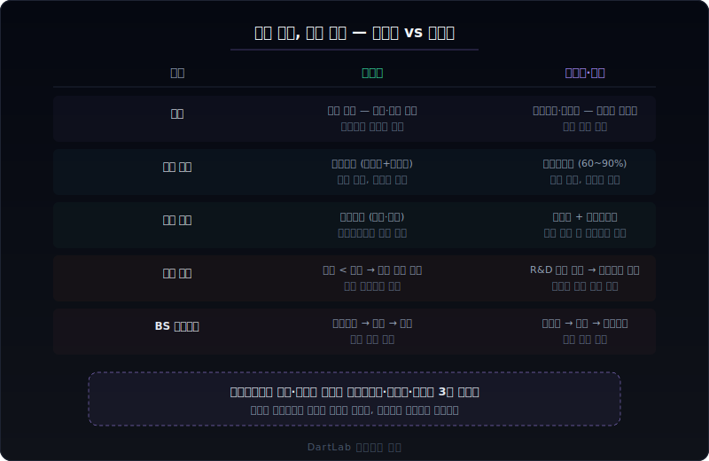

# 바이오·제약 공시는 어디가 과열 신호인가

바이오·제약 사업보고서를 일반 제조업처럼 읽으면 거의 항상 틀린다. 매출이 없는데 시가총액이 수조 원이고, 적자가 수백억인데 주가가 오르며, 개발비 잔액이 커질수록 좋아 보이지만 실제로는 실패 확률이 누적되고 있는 구조가 바이오의 기본이다. 같은 재무제표 항목이라도 **읽는 순서와 판단 기준이 완전히 다르다**.

핵심은 한 문장으로 줄일 수 있다. 바이오·제약에서는 `매출`보다 `파이프라인 → 임상 단계 → 개발비 자산화 → 마일스톤 → 현금 소진 속도`라는 **가치 전환 루프**를 먼저 읽어야 한다. 이 루프가 건강한지 과열인지가 회사의 실질적 전망을 결정한다.

이 글은 바이오·제약 사업보고서를 `파이프라인 확인 → 개발비 자산화 정책 → 마일스톤과 기술이전 → 임상 실패와 손상 → 현금 소진 속도` 순서로 읽는 방법을 정리한다. 기존 글에서 항목별로 깊게 다룬 내용을 바이오·제약이라는 하나의 업종 맥락으로 묶어서, 어디서 시작해서 어디까지 확인해야 하는지를 보여준다.

---

## 같은 항목인데 바이오에서 해석이 갈리는 이유

일반 제조업에서는 매출이 사업의 출발점이다. 원재료를 사서, 제품을 만들고, 팔아서, 돈을 받는다. 바이오·제약에서는 이 흐름이 근본적으로 다르다.

**매출 구조가 다르다.** 신약 개발 바이오는 제품 매출이 없거나 극히 작다. 매출 대부분이 기술이전 계약금(업프론트), 마일스톤 수취, 정부 보조금으로 구성된다. 이 말은 곧 **매출이 일회성 이벤트에 의존하고 반복 가능성이 낮다**는 뜻이다. 제조업에서는 매출이 줄면 문제지만, 바이오에서는 매출이 갑자기 늘어도 그것이 마일스톤 일시 인식인지 확인해야 한다.

**비용 구조가 다르다.** 제조업은 매출원가(원재료+인건비+감가상각)가 비용의 대부분이다. 바이오는 연구개발비가 비용의 60~90%를 차지한다. 그리고 이 연구개발비 중 얼마를 비용 처리하고 얼마를 자산화하느냐에 따라 손익이 완전히 달라진다. 같은 100억 원을 쓰더라도 전액 비용 처리하면 적자 100억, 80억을 자산화하면 적자 20억이 된다.

**자산의 성격이 다르다.** 제조업의 핵심 자산은 유형자산(공장, 설비)이다. 바이오의 핵심 자산은 **개발비(무형자산)**와 **현금성자산**이다. 개발비는 임상이 실패하면 하루아침에 전액 손상될 수 있고, 현금은 매달 줄어든다. 그래서 바이오에서 재무상태표를 읽을 때는 유형자산보다 `개발비 잔액 + 현금성자산 + 자본잠식 여부`를 먼저 본다.

---

## 바이오·제약에서 먼저 봐야 할 5가지 숫자

바이오·제약 사업보고서를 처음 펼쳤을 때, 아래 5가지를 이 순서대로 확인하면 회사의 큰 그림이 빠르게 잡힌다.

### 1. 파이프라인과 임상 단계

파이프라인은 바이오 회사의 유일한 미래 가치다. 하지만 **파이프라인의 수보다 단계가 먼저**다.

- **임상 단계 분포**: 전임상, 임상 1상, 2상, 3상, 허가 신청 중 어디에 몇 개가 있는지. 전임상과 1상에만 몰려 있으면 제품화까지 5~10년이 걸린다.
- **핵심 파이프라인 집중도**: 전체 가치가 하나의 파이프라인에 의존하는지, 여러 개로 분산되어 있는지. 단일 파이프라인 의존도가 높으면 임상 실패 시 회사 전체가 흔들린다.
- **적응증과 시장 규모**: 희귀질환은 허가 가능성이 높지만 시장이 작고, 항암·대사질환은 시장이 크지만 경쟁이 치열하다.

사업보고서의 '사업의 내용'에서 파이프라인 현황표를 찾는다. 여기서 임상 단계, 적응증, 계약 상대방을 한눈에 볼 수 있다.

### 2. 개발비 자산화 정책

개발비 자산화는 바이오 재무제표에서 가장 중요한 회계 판단이다.

- **자산화 비율**: 연구개발비 중 얼마를 자산화했는지. K-IFRS는 기술적 실현가능성이 입증된 시점부터 자산화를 허용하지만, 그 시점 판단은 경영진의 재량이다.
- **자산화 시작 시점**: 임상 몇 상부터 자산화를 시작하는지. 1상부터 자산화하는 회사와 3상 허가 직전에야 자산화하는 회사는 보수성이 완전히 다르다.
- **개발비 잔액 추이**: 매년 얼마씩 쌓이고 있는지, 상각은 언제 시작하는지. 잔액만 늘고 상각이 안 되면 아직 제품화가 안 됐다는 뜻이다.

[개발비·무형자산은 어디서 과열 신호가 보이나](/blog/development-costs-and-intangibles)에서 자산화 정책의 보수성을 판단하는 기본 프레임을 깊게 다뤘다.

### 3. 마일스톤과 기술이전 계약

바이오 매출의 상당 부분은 기술이전(라이선스 아웃) 계약에서 나온다.

- **계약 구조**: 업프론트(계약금) + 개발 마일스톤 + 판매 마일스톤 + 로열티. 총 계약 규모가 크더라도 실제로 받는 돈은 조건 달성 시에만 들어온다.
- **마일스톤 인식 시점**: 마일스톤을 달성 시점에 일시 인식했는지, 기간에 걸쳐 분할 인식했는지. 일시 인식이면 해당 분기 매출이 급증하고 다음 분기에 급감한다.
- **계약 해지 조건**: 파트너사가 중도 해지할 수 있는 조건이 무엇인지. 임상 실패 시 파트너가 빠지면 업프론트를 반환해야 할 수도 있다.

주석의 '수익 인식' 항목과 사업보고서의 '기술이전 계약 현황'에서 이 정보를 확인한다.

### 4. 임상 실패와 손상 인식

바이오에서 가장 큰 이벤트 리스크는 임상 실패다.

- **손상 인식 기준**: 임상이 실패하면 해당 파이프라인의 개발비를 전액 손상 처리해야 한다. 하지만 경영진이 "아직 가능성이 있다"며 손상을 미루는 경우가 많다.
- **손상 이력**: 과거에 개발비 손상을 인식한 적이 있는지, 얼마 규모였는지. 손상 이력이 있으면 나머지 파이프라인의 자산화 판단도 보수적으로 봐야 한다.
- **감사보고서 KAM**: 감사인이 개발비 자산화의 적정성을 핵심감사사항으로 지목했는지. KAM에 올라왔으면 감사인도 불확실성이 높다고 보고 있다는 뜻이다.

[개발비·무형자산은 어디서 과열 신호가 보이나](/blog/development-costs-and-intangibles)에서 손상 지연과 과열 신호를 상세하게 정리했다. [감사보고서와 핵심감사사항은 무엇을 먼저 봐야 하나](/blog/audit-report-and-kam)에서 KAM 읽기 기본도 함께 보면 좋다.

### 5. 현금 소진 속도(번 레이트)와 자금 조달

바이오 회사의 생존은 결국 **현금이 언제 바닥나느냐**에 달려 있다.

- **번 레이트(burn rate)**: 월간 또는 분기별 순현금 유출 속도. 영업현금흐름이 마이너스인 바이오에서 이 숫자가 생존 기한을 결정한다.
- **현금 활주로(runway)**: 현금성자산 / 번 레이트 = 추가 자금 조달 없이 버틸 수 있는 개월 수. 12개월 미만이면 곧 유상증자나 CB/BW 발행이 나온다.
- **자금 조달 이력**: 유상증자를 몇 번 했는지, 전환사채(CB)·신주인수권부사채(BW)를 발행했는지. 반복적인 자금 조달은 기존 주주 희석을 의미한다.

[영업현금흐름이 순이익을 부정할 때](/blog/operating-cash-flow-vs-net-income)의 기본 프레임이 바이오에서도 그대로 작동한다. [전환사채·신주인수권부사채 공시](/blog/treasury-stock-third-party-allotment-and-major-shareholder-change)에서 CB/BW 구조의 주주 희석 효과를 상세하게 다뤘다.

---

## 건강한 바이오 vs 과열된 바이오

같은 바이오·제약이라도 구조가 전혀 다를 수 있다. 아래 기준으로 나눠 보면 회사의 체력이 빠르게 드러난다.

### 건강한 구조

- 핵심 파이프라인이 **임상 2상 이상**에 진입해 있고, 중간 데이터가 공개되어 있다.
- 개발비 자산화가 **보수적**이다. 임상 3상 이후 또는 기술적 실현가능성이 명확히 입증된 후에야 자산화를 시작한다.
- 기술이전 계약의 파트너가 **글로벌 빅파마**이고, 업프론트를 이미 수취했다. 파트너의 자체 임상 투자가 진행 중이다.
- 현금 활주로가 **24개월 이상**이다. 다음 마일스톤 달성 전까지 추가 자금 조달 없이 버틸 수 있다.
- 영업현금흐름 적자가 **예측 가능한 범위**에 있다. R&D 지출이 계획대로 집행되고 있다.

### 과열된 구조

- 파이프라인 대부분이 **전임상~1상**에 머물러 있는데 시가총액이 수천억 이상이다.
- 개발비를 **1상부터 자산화**한다. 잔액이 매년 큰 폭으로 늘지만 상각 시작 파이프라인이 없다.
- 기술이전 계약의 총 규모는 크지만 **실제 수취한 금액은 업프론트뿐**이고, 나머지 마일스톤 달성 가능성이 불투명하다.
- 현금 활주로가 **12개월 미만**이다. 유상증자나 CB 발행을 반복하고 있고, 발행 조건이 점점 불리해진다.
- 임상 실패 후에도 개발비를 **손상 처리하지 않고** "적응증 변경" 또는 "추가 연구"로 이월한다.
- 계속기업 불확실성이 감사보고서에 **기재**되어 있거나, 자본잠식 상태에 진입했다.

---

## 업종과 맥락에 따라 달라지는 기준

바이오·제약 안에서도 하위 업종에 따라 읽기 포인트가 달라진다.

### 신약 개발(R&D 중심) vs 제네릭·바이오시밀러

- **신약 개발**: 매출이 없거나 극히 작다. 가치의 100%가 파이프라인에 의존한다. 개발비 자산화, 임상 단계, 현금 소진이 핵심 판단 포인트다.
- **제네릭·바이오시밀러**: 이미 매출이 있고, 원가 경쟁이 핵심이다. 매출 성장률, 마진, 약가 인하 리스크를 일반 제조업에 가깝게 읽는다. 다만 바이오시밀러는 동등성 입증 실패 리스크가 추가된다.

### CMO·CDMO(위탁생산)

- 바이오 의약품을 위탁 생산하는 CDMO는 바이오지만 사실상 **제조업에 가까운 구조**다.
- 수주잔고, 설비 가동률, 설비투자가 핵심이다. 건설업처럼 수주 파이프라인을 읽어야 한다.
- [건설업 사업보고서는 어디부터 읽어야 하나](/blog/construction-company-filings)의 수주-현금 루프 프레임이 CDMO에도 적용된다.

### 플랫폼·진단

- 진단 키트·플랫폼 바이오는 상대적으로 빠른 매출화가 가능하다.
- 하지만 코로나 특수 같은 **일시적 매출 급증**에 주의해야 한다. 일시 매출이 빠진 뒤의 기저 성장률을 확인한다.
- 재고 급증, 매출채권 회전율 하락은 일반 제조업과 같은 기준으로 읽는다.

---

## 바이오·제약 사업보고서 30분 읽기 루프

처음 바이오·제약 사업보고서를 읽을 때 아래 순서로 30분만 투자하면 핵심이 잡힌다.

**1단계 — 파이프라인 현황 (5분)**
사업의 내용에서 파이프라인 현황표를 찾는다. 임상 단계별 분포, 핵심 파이프라인의 적응증, 파트너사를 확인한다. 전임상·1상에만 몰려 있는지, 2상 이상 진입한 것이 있는지 본다.

**2단계 — 개발비와 무형자산 (5분)**
재무상태표에서 개발비(무형자산) 잔액을 찾는다. 주석에서 파이프라인별 자산화 금액과 자산화 시작 시점을 확인한다. 전기 대비 잔액 증가율을 본다.

**3단계 — 기술이전과 마일스톤 (5분)**
주석의 수익 인식 항목에서 기술이전 계약 현황을 찾는다. 업프론트 수취 여부, 달성한 마일스톤과 미달성 마일스톤, 계약 해지 조건을 확인한다.

**4단계 — 손상과 임상 이력 (5분)**
주석에서 무형자산 손상 인식 이력을 찾는다. 감사보고서의 KAM에 개발비 자산화가 언급되는지 본다. 사업의 내용에서 임상 중단·실패 이력을 확인한다.

**5단계 — 현금 소진 속도 (5분)**
현금흐름표에서 영업활동현금흐름을 본다. 월간 번 레이트를 계산한다. 현금성자산과 비교해서 활주로를 추정한다. 자금 조달 이력(유증, CB, BW)을 투자활동·재무활동에서 확인한다.

**6단계 — 자본 구조와 계속기업 (5분)**
자본잠식 여부를 확인한다. 감사보고서에 계속기업 불확실성이 기재되어 있는지 본다. 전환사채·신주인수권 행사 시 최대 주식 수를 계산해서 희석 규모를 추정한다.

---

## 비교 체크리스트

| 확인 항목 | 건강한 신호 | 과열 신호 |
|---|---|---|
| 핵심 파이프라인 단계 | 2상 이상, 중간 데이터 공개 | 전임상~1상에 집중, 데이터 미공개 |
| 개발비 자산화 시점 | 3상 또는 기술적 실현 입증 후 | 1상부터 자산화, 잔액만 증가 |
| 기술이전 실제 수취 | 업프론트 + 개발 마일스톤 달성 | 업프론트만 수취, 마일스톤 미달성 |
| 손상 인식 | 임상 실패 시 즉시 전액 손상 | 적응증 변경으로 이월, 손상 지연 |
| 현금 활주로 | 24개월 이상 | 12개월 미만, 반복 유증·CB |
| 영업CF 적자 추이 | 예측 범위, R&D 계획 내 | 급격 확대, 계획 초과 |
| 감사 의견 | 적정, KAM에 개발비 미포함 | 계속기업 불확실성 또는 KAM에 개발비 |

---

## FAQ

**바이오에서 매출이 갑자기 늘면 좋은 신호인가?**

반드시 그렇지 않다. 바이오 매출 급증은 대부분 마일스톤 일시 인식이다. 다음 분기에 같은 규모가 반복될 가능성은 낮다. 매출 구성에서 제품 매출과 기술이전 매출을 분리해서, 제품 매출의 추세를 따로 봐야 한다. [매출 인식 시점 변경은 어디가 신호인가](/blog/operating-cash-flow-vs-net-income)에서 이 문제를 더 깊게 다뤘다.

**개발비 잔액이 크면 좋은 것 아닌가?**

아니다. 개발비 잔액이 크다는 것은 그만큼 많은 돈을 자산화했다는 뜻이지, 그 자산이 가치가 있다는 뜻이 아니다. 임상 성공 확률은 1상→허가까지 10% 미만이다. 잔액이 클수록 임상 실패 시 손상 규모도 커진다. 핵심은 잔액의 크기가 아니라 그 뒤의 **임상 단계와 데이터**다. [개발비·무형자산은 어디서 과열 신호가 보이나](/blog/development-costs-and-intangibles)에서 자산화 과열을 판단하는 기준을 정리했다.

**유상증자를 하면 무조건 나쁜 신호인가?**

바이오에서 유상증자는 사업 모델의 일부다. 매출이 없으니 외부 자금 조달이 불가피하다. 문제는 **빈도와 조건**이다. 2~3년마다 한 번이고 조건이 합리적이면 정상이다. 매년 반복하고, 할인율이 점점 커지며, CB·BW의 리픽싱 조건이 극단적이면 기존 주주를 희석시키면서 버티는 구조다. [전환사채·신주인수권부사채 공시](/blog/treasury-stock-third-party-allotment-and-major-shareholder-change)에서 상세하게 다뤘다.

**CMO·CDMO는 일반 바이오와 같은 기준으로 읽어야 하나?**

아니다. CDMO는 바이오 기업이지만 비즈니스 모델은 제조업에 가깝다. 수주잔고, 설비 가동률, 설비투자 효율성이 핵심이다. 파이프라인 리스크보다 설비 투자 회수와 고객 집중도 리스크를 먼저 본다. [건설업 사업보고서는 어디부터 읽어야 하나](/blog/construction-company-filings)의 수주-현금 프레임과 [설비투자 뒤 감가상각은 언제 보이나](/blog/capacity-utilization-capex)의 설비 투자 프레임을 함께 적용하면 된다.

**계속기업 불확실성이 기재되면 바로 위험한가?**

바이오에서는 다른 업종보다 상대적으로 자주 나타난다. 매출 없이 적자가 지속되면 감사인이 형식적으로라도 기재하는 경우가 있다. 하지만 가볍게 넘겨서는 안 된다. 핵심은 **현금 활주로와 자금 조달 능력**이다. 현금이 12개월 미만이고 추가 조달 계획이 불분명하면 실질적 위험이다. [계속기업 불확실성은 어디가 진짜 위험인가](/blog/clean-audit-opinion-but-still-risky)에서 이 판단 기준을 상세하게 정리했다.

---

## 기존 글로 더 깊이 들어가기

이 글은 바이오·제약이라는 업종 맥락에서 읽기 순서를 정리한 허브다. 각 항목을 더 깊게 파고 싶으면 아래 글로 들어가면 된다.

**개발비와 무형자산**
- [개발비·무형자산은 어디서 과열 신호가 보이나](/blog/development-costs-and-intangibles) — 자산화 정책의 보수성 판단, 손상 지연 감지

**매출 인식과 기술이전**
- [매출 인식 시점 변경은 어디가 신호인가](/blog/operating-cash-flow-vs-net-income) — 마일스톤 일시 인식과 매출 변동 해석
- [신사업·사업 다각화 공시는 어디까지 믿어야 하나](/blog/how-far-to-trust-new-business-plans) — 파이프라인 확장의 실현 가능성 판단

**현금흐름과 생존**
- [영업현금흐름이 순이익을 부정할 때](/blog/operating-cash-flow-vs-net-income) — 바이오 적자 구조에서 현금 검증 프레임
- [계속기업 불확실성은 어디가 진짜 위험인가](/blog/clean-audit-opinion-but-still-risky) — 자본잠식, 계속기업 판단 기준

**자금 조달과 주주 희석**
- [전환사채·신주인수권부사채 공시](/blog/treasury-stock-third-party-allotment-and-major-shareholder-change) — CB·BW 구조와 희석 계산

**감사와 경고 신호**
- [감사보고서와 핵심감사사항은 무엇을 먼저 봐야 하나](/blog/audit-report-and-kam) — KAM에서 개발비 리스크 읽기
- [자본잠식과 관리종목 지정 신호](/blog/clean-audit-opinion-but-still-risky) — 자본잠식 진행 단계와 상장 폐지 리스크

**설비 투자 (CDMO 참고)**
- [건설업 사업보고서는 어디부터 읽어야 하나](/blog/construction-company-filings) — 수주-현금 루프 (CDMO 적용 가능)
- [설비투자 뒤 감가상각은 언제 보이나](/blog/capacity-utilization-capex) — 설비 투자 회수 프레임

---

## 출처

- K-IFRS 제1038호 '무형자산' — 개발비 자산화 요건 (기술적 실현가능성, 사용·판매 의도, 미래 경제적 효익)
- K-IFRS 제1036호 '자산 손상' — 개발비 손상 검사 및 인식 기준
- K-IFRS 제1115호 '고객과의 계약에서 생기는 수익' — 마일스톤 수익 인식
- 금융감독원 전자공시시스템(DART) — 바이오·제약 사업보고서 원문

---

## 한 줄 정리

바이오·제약 사업보고서는 매출이 아니라 **파이프라인 → 개발비 자산화 → 마일스톤 → 손상 → 현금 소진**의 가치 전환 루프를 먼저 읽어야 한다. 이 루프가 건강하면 적자는 투자이고, 루프가 과열이면 적자는 소모의 예고편이다.
