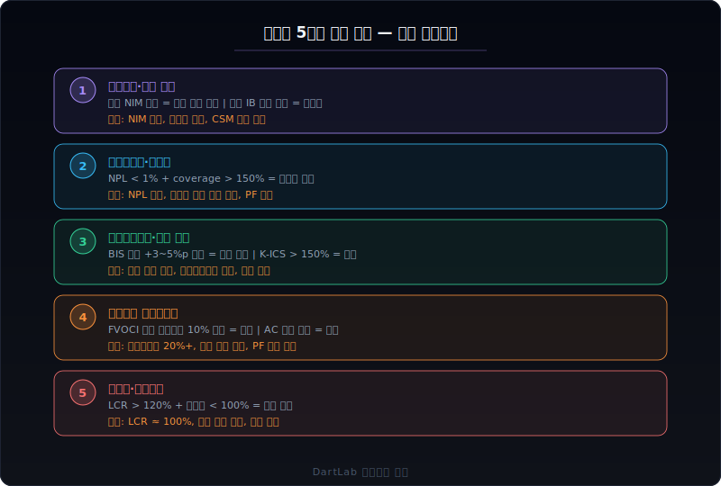
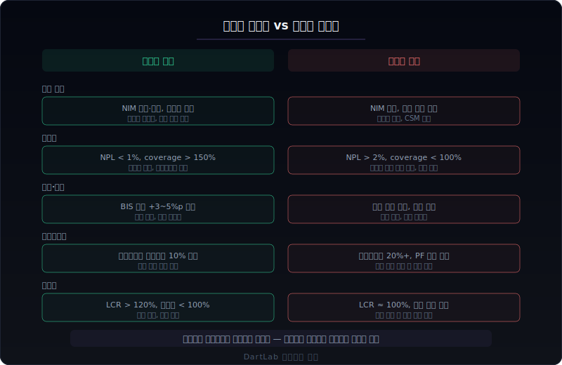

# 금융업 사업보고서는 무엇이 다른가

금융업 사업보고서를 제조업처럼 읽으면 첫 페이지부터 막힌다. 매출원가가 없고, 재고자산이 없으며, 부채비율이 1000%를 넘는데도 정상이다. 금융업에서는 재무제표의 **구조 자체가 다르다**. 같은 항목명이라도 의미가 완전히 달라지기 때문에, 일반 기업에서 쓰던 비율과 판단 기준을 그대로 가져오면 거의 항상 틀린다.

핵심은 한 문장으로 줄일 수 있다. 금융업에서는 `매출`이 아니라 `마진 스프레드 → 자산 건전성 → 자본 적정성 → 유동성 → 포트폴리오 구성`이라는 **수익-리스크 루프**를 먼저 읽어야 한다. 이 루프가 어느 한 곳에서 무너지면 다른 곳이 멀쩡해 보여도 전체가 흔들린다.

이 글은 금융업 사업보고서를 `이자마진과 수익 구조 → 대손충당금과 자산 건전성 → 자기자본비율과 규제 → 유가증권 포트폴리오 → 유동성과 자금조달` 순서로 읽는 방법을 정리한다. 은행, 증권, 보험, 카드·캐피탈이라는 네 하위 업종의 차이까지 포함해서, 금융업 공시를 처음 읽는 사람이 어디서 시작해서 어디까지 확인해야 하는지를 보여준다.

---

## 같은 항목인데 금융업에서 해석이 완전히 달라지는 이유

일반 제조업은 `원재료 매입 → 생산 → 판매 → 회수`라는 실물 사이클을 중심으로 돌아간다. 금융업은 이 구조가 근본적으로 존재하지 않는다.

**재무상태표의 구성이 다르다.** 제조업에서 자산은 공장, 설비, 재고다. 금융업에서 자산은 **대출채권, 유가증권, 보험계약자산**이다. 은행의 자산 중 70~80%가 대출이고, 보험사의 자산 중 50% 이상이 투자 포트폴리오다. 그래서 금융업 재무상태표를 읽을 때 유형자산은 거의 의미가 없고, 대출채권의 질과 유가증권의 구성이 핵심이다.

**부채의 의미가 다르다.** 제조업에서 부채는 갚아야 할 빚이고, 부채비율이 높으면 위험하다. 금융업에서 부채는 **영업의 원료**다. 은행의 예수금(고객 예금)은 부채지만 이것이 바로 대출의 재원이다. 부채비율이 1000%를 넘어도 정상이며, 오히려 부채를 제대로 조달하지 못하면 영업이 안 된다. 그래서 금융업에서는 부채비율 대신 **자기자본비율(BIS 비율)**을 본다.

**손익의 구조가 다르다.** 제조업은 `매출 - 매출원가 = 매출총이익`이다. 금융업에는 매출원가가 없다. 은행은 `이자수익 - 이자비용 = 순이자이익(NII)`이 핵심이고, 증권사는 `수수료수익 + 자기매매손익`이 핵심이며, 보험사는 `보험수익 - 보험서비스비용`이 핵심이다. 이 구조를 모르면 손익계산서 첫 줄부터 읽을 수 없다.

**비용의 핵심이 다르다.** 제조업은 원재료비와 인건비가 비용의 대부분이다. 금융업에서 가장 중요한 비용은 **대손충당금(신용손실충당금)**이다. 대출이 부실화되면 충당금을 쌓아야 하는데, 이 금액이 수천억 원 단위로 변동한다. 충당금 적립 규모 하나가 분기 이익을 뒤집을 수 있다. 경기가 나빠지면 매출은 크게 안 줄어도 충당금이 급증해서 이익이 반토막 나는 것이 금융업의 고유한 리스크 구조다.

**규제가 재무제표에 직접 반영된다.** 제조업은 회계 기준만 지키면 된다. 금융업은 금융감독당국의 건전성 규제가 재무구조를 직접 제약한다. BIS 자기자본비율, 유동성커버리지비율(LCR), 지급여력비율(RBC/K-ICS) 같은 규제 비율이 떨어지면 배당을 못 하고, 더 떨어지면 영업이 제한되며, 최악의 경우 적기시정조치를 받는다. 이 규제 비율이 금융업 사업보고서의 가장 중요한 숫자 중 하나다.

---

## 금융업에서 먼저 봐야 할 5가지 숫자

금융업 사업보고서를 처음 펼쳤을 때, 아래 5가지를 이 순서대로 확인하면 회사의 큰 그림이 빠르게 잡힌다.

### 1. 이자마진과 수익 구조

금융업 수익의 출발점이다. 하위 업종마다 핵심 수익원이 다르지만, 공통 원칙은 **수익의 안정성과 반복 가능성**을 먼저 보는 것이다.

**은행의 경우:**
- **순이자마진(NIM)**: `순이자이익 / 이자부자산 평균잔액`. 은행 수익의 60~80%가 여기서 나온다. NIM이 0.1%p 움직이면 수천억 원이 달라진다.
- **NIM 추이**: 금리 인상기에는 NIM이 벌어지고, 인하기에는 좁아진다. 하지만 대출 경쟁이 심하면 금리가 올라도 NIM이 안 벌어진다.
- **비이자이익 비중**: 수수료, 신탁, 방카슈랑스 등. NIM 변동에 대한 완충 역할을 하는지 확인한다.

**증권사의 경우:**
- **수수료수익**: 위탁매매(브로커리지), IB(인수·자문), 자산관리. 시장 거래량에 연동되는 위탁매매 vs 상대적으로 안정적인 IB·자산관리 비중을 본다.
- **자기매매손익(트레이딩)**: 자기자본으로 투자해서 번 손익. 시장 방향에 크게 흔들린다. 비중이 높으면 변동성이 크다.

**보험사의 경우:**
- **보험수익과 CSM(계약서비스마진)**: IFRS 17 도입 이후 보험 수익은 CSM에서 풀려나온다. CSM 잔액이 보험사의 미래 이익 저수지다. CSM이 줄고 있으면 신계약이 부진하거나 해지가 많다는 뜻이다.
- **투자수익률**: 보험료로 받은 돈을 투자해서 번 수익. 금리·증시에 연동된다.

### 2. 대손충당금과 자산 건전성

금융업에서 **가장 중요한 비용**이자 **가장 중요한 판단 포인트**다.

- **고정이하여신비율(NPL ratio)**: 은행 대출 중 3개월 이상 연체된 비율. 1% 미만이면 양호, 2%를 넘으면 주의가 필요하다.
- **대손충당금적립률(coverage ratio)**: 부실채권 대비 충당금을 얼마나 쌓았는지. 100% 이상이면 부실채권을 전액 커버할 수 있다는 뜻이지만, 부동산 경기 급락 같은 시나리오에서는 부족할 수 있다.
- **대손충당금 전입액 추이**: 매 분기 얼마씩 쌓고 있는지. 갑자기 크게 늘면 경영진이 경기 악화를 반영하기 시작한 신호다. 반대로 충당금을 환입하면 단기 이익은 좋아 보이지만 보수성이 약해지는 것이다.
- **업종별 대출 포트폴리오**: 부동산 PF, 자영업, 가계, 대기업 대출 비중. 특정 업종에 편중되어 있으면 해당 업종 경기 악화 시 충당금이 한꺼번에 늘어난다.

대손충당금은 경영진의 재량이 가장 크게 작용하는 영역이다. 경기가 좋을 때 충당금을 적게 쌓아서 이익을 높이고, 나빠지면 한꺼번에 쏟아내는 패턴이 반복된다. [영업현금흐름이 순이익을 부정할 때](/blog/operating-cash-flow-vs-net-income)의 프레임이 금융업에서는 충당금 경유로 작동한다.

### 3. 자기자본비율과 규제 여유

금융업에서 가장 중요한 안전판이다.

- **BIS 자기자본비율**: 은행의 경우 `자기자본 / 위험가중자산`. 규제 최소 8%, 시스템적 중요 은행(D-SIB)은 추가 버퍼 요구. 실제로는 12~15%가 일반적이다.
- **보통주자본비율(CET1 ratio)**: BIS 비율 중 가장 질 좋은 자본만으로 계산한 비율. 규제 요구 4.5%이지만 실제로는 10% 이상이 일반적이다.
- **지급여력비율(RBC/K-ICS)**: 보험사의 자기자본비율. 보험부채 대비 가용자본. K-ICS 도입 이후 기준이 바뀌어서 전후 비교 시 주의가 필요하다.
- **규제 비율과 배당 여력**: 자기자본비율이 규제 하한에 가까우면 배당을 줄이거나 유상증자를 해야 한다. 비율이 떨어지는 추세면 주주환원 축소 신호다.

규제 비율은 사업보고서 본문의 '경영지표'나 별도 공시에서 확인한다. 이 비율이 전기 대비 하락했는지, 규제 하한 대비 여유가 얼마인지가 금융주 투자의 핵심 판단 중 하나다.

### 4. 유가증권 포트폴리오

금융업 자산의 상당 부분이 유가증권이다. 이 포트폴리오의 구성과 평가 방식이 재무제표에 큰 영향을 미친다.

- **분류별 비중**: 당기손익-공정가치(FVPL), 기타포괄손익-공정가치(FVOCI), 상각후원가(AC). FVPL은 시가 변동이 바로 손익에 반영되고, FVOCI는 OCI에만 반영되며, AC는 시가 변동이 반영되지 않는다.
- **미실현손익 규모**: FVOCI 증권의 미실현손익이 기타포괄손익누계액에 쌓여 있다. 금리가 급등하면 채권 가격이 하락해서 미실현손실이 커진다. 이것이 자기자본비율을 깎는다.
- **부동산 PF 익스포저**: 증권사·캐피탈의 경우 부동산 PF 투자와 보증이 큰 리스크다. 부동산 경기 하락 시 손실이 한꺼번에 현실화된다.

[기타포괄손익 누적은 어디서 진짜 위험인가](/blog/beyond-the-numbers)에서 OCI 누적이 자본에 미치는 영향을 상세하게 다뤘다. 금융업에서 이 효과는 제조업보다 훨씬 크다.

### 5. 유동성과 자금조달 구조

금융업의 생존은 **유동성**에 달려 있다. 자산이 충분해도 당장 현금이 부족하면 무너진다.

- **유동성커버리지비율(LCR)**: 30일 내 순현금유출 대비 고유동성자산. 규제 최소 100%. 이 비율이 100% 미만이면 단기 유동성 위기 신호다.
- **순안정자금조달비율(NSFR)**: 필요안정자금 대비 가용안정자금. 중장기 자금조달의 안정성을 본다.
- **예대율**: 은행의 `대출 / 예금` 비율. 100%를 넘으면 예금보다 대출이 많아서 다른 자금을 끌어다 쓰고 있다는 뜻이다.
- **자금조달 구성**: 예금 vs 은행채 vs 콜머니. 예금은 안정적이지만 금리 경쟁이 있고, 은행채는 시장 금리에 노출되며, 콜머니는 하루짜리라 가장 불안정하다.

금융업에서 유동성 위기는 수익성 악화보다 빠르게 회사를 무너뜨린다. 2023년 미국 실리콘밸리은행(SVB) 사태가 보여준 것처럼, 자산 건전성이 괜찮아도 예금 이탈이 한꺼번에 일어나면 3일 만에 파산할 수 있다.

---

## 건강한 금융사 vs 위험한 금융사

같은 금융업이라도 구조가 전혀 다를 수 있다. 아래 기준으로 나눠 보면 회사의 체력이 빠르게 드러난다.

### 건강한 구조

- NIM 또는 핵심 수익원이 **안정적이거나 개선 추세**다. 비이자수익이 NIM 변동을 일부 완충한다.
- 고정이하여신비율(NPL)이 **1% 미만**이고, 대손충당금적립률(coverage)이 **150% 이상**이다. 충당금을 넉넉히 쌓아두고 있어서 경기 악화에 대비가 되어 있다.
- BIS 비율(또는 K-ICS)이 **규제 하한 대비 3~5%p 이상 여유**가 있다. 배당 여력이 충분하다.
- 유가증권 포트폴리오에서 FVOCI 미실현손실이 **자기자본 대비 10% 미만**이다. 금리 변동에 대한 자본 완충이 있다.
- LCR이 **120% 이상**이고, 예대율이 **100% 이하**다. 자금조달이 안정적이다.

### 위험한 구조

- NIM이 **축소 추세**이고, 대출 경쟁 때문에 금리 인상 효과를 못 누리고 있다. 비이자수익도 줄고 있다.
- NPL이 **2% 이상**이고 충당금적립률이 **100% 미만**이다. 부실이 늘고 있는데 충당금이 부족하다. 또는 충당금을 환입해서 이익을 높이고 있다.
- BIS 비율이 **규제 하한에 근접**하고 있다. 배당을 줄이거나 유상증자를 해야 할 수도 있다. 위험가중자산이 빠르게 증가하고 있다.
- FVOCI 미실현손실이 **자기자본 대비 20% 이상**이다. 금리 추가 상승 시 자본 훼손 우려가 있다.
- LCR이 **100%에 근접**하거나 예대율이 **100%를 상회**한다. 단기 자금조달에 의존하고 있다.
- 특정 업종(부동산 PF, 자영업 등)에 대출이 **편중**되어 있고, 해당 업종 경기가 악화되고 있다.

---

## 하위 업종별로 다르게 읽어야 하는 포인트

금융업 안에서도 은행, 증권, 보험, 카드·캐피탈은 비즈니스 모델이 완전히 다르다. 같은 금융업이라고 같은 잣대로 읽으면 안 된다.

### 은행

은행은 금융업의 가장 기본적인 형태다. `예금을 받아서 대출을 내주고, 그 차이(스프레드)로 수익을 낸다.`

- **핵심 수익**: 순이자이익(NII). 전체 수익의 60~80%.
- **핵심 비용**: 대손충당금 전입액. 경기 순환에 따라 수천억 원 변동.
- **핵심 자산**: 대출채권(70~80%). 대출 포트폴리오의 업종별·담보별 구성이 건전성의 기초.
- **핵심 규제**: BIS 비율, LCR, NSFR, 예대율. 시스템적 중요 은행은 추가 자본 버퍼 요구.
- **차별 포인트**: 가계 vs 기업 대출 비중, 부동산 PF 익스포저, 디지털뱅킹 전환 속도.

은행 사업보고서에서 가장 먼저 찾아야 할 것은 **경영지표 요약 테이블**이다. NIM, NPL, coverage, BIS 비율이 한눈에 나온다. 그다음 대출 포트폴리오 구성과 대손충당금 전입 추이를 본다.

### 증권사

증권사는 은행과 달리 **시장 변동에 직접 노출**된다.

- **핵심 수익**: 수수료(브로커리지+IB) + 자기매매손익. 시장 거래량과 지수에 연동.
- **핵심 비용**: 인건비(성과급 비중 높음), 차입 이자, 금융자산 평가손실.
- **핵심 자산**: 유가증권 + 파생상품. 자기매매(proprietary trading) 포트폴리오의 규모와 리스크가 핵심.
- **핵심 규제**: 순자본비율(NCR). 자기자본 대비 총위험액. 영업용 순자본이 규제 하한 미만이면 영업 제한.
- **차별 포인트**: IB 딜 파이프라인, 부동산 PF 보증·투자, 해외 진출 규모, 디지털 리테일 점유율.

증권사는 **부동산 PF 익스포저**가 최근 가장 큰 리스크 요인이다. PF 보증과 브릿지론 규모를 사업보고서 주석에서 반드시 확인해야 한다. 지급보증·담보·약정 공시의 프레임이 증권사 PF에도 그대로 적용된다.

### 보험사

보험사는 **초장기 부채**를 안고 있다는 점에서 은행·증권과 근본적으로 다르다.

- **핵심 수익**: 보험수익(보험료 수입에서 CSM 방출분) + 투자수익. IFRS 17 이후 보험수익의 인식 방식이 완전히 바뀌었다.
- **핵심 비용**: 보험서비스비용(보험금 지급, 손해조사비) + 대손충당금(보증보험 등).
- **핵심 자산**: 투자 포트폴리오(채권 50~60%, 주식, 대체투자). 보험료를 받아서 보험금을 지급하기까지의 기간(보통 수십 년) 동안 투자한다.
- **핵심 부채**: 보험계약부채. 미래에 지급해야 할 보험금의 현재가치. IFRS 17 이후 시가 평가되어 금리 변동에 크게 흔들린다.
- **핵심 규제**: 지급여력비율(K-ICS, 구 RBC). 가용자본 / 요구자본. 100% 미만이면 적기시정조치.
- **차별 포인트**: CSM 잔액과 신계약 CSM, 손해율 추이, 장기보험 vs 단기보험 비중, 금리 민감도.

보험사의 CSM은 **미래 이익의 저수지**다. CSM 잔액이 매 분기 이익으로 풀려나오면서 보험영업이익을 만든다. CSM이 줄어드는 추세면 신계약이 부진하거나 기존 계약의 해지가 많다는 뜻이다. CSM의 증감 분석이 보험사 가치 판단의 핵심이다.

### 카드·캐피탈(여전사)

카드사와 캐피탈은 은행과 비슷하지만 **예금을 받지 못한다**는 점이 다르다.

- **핵심 수익**: 카드 수수료, 할부금융 이자, 리스 수익. 가맹점 수수료 인하 규제에 직접 노출.
- **핵심 비용**: 조달 비용(은행에서 차입하거나 채권 발행), 대손충당금.
- **핵심 자산**: 할부금융채권, 리스채권, 신용판매채권.
- **핵심 규제**: 조정자기자본비율. 여전사는 은행과 다른 건전성 규제를 받는다.
- **차별 포인트**: 카드 결제 시장 점유율, 개인신용대출 vs 기업금융 비중, 자동차금융 특화 여부.

카드·캐피탈은 **자금조달 비용**이 수익성의 핵심이다. 예금이 없으니 은행채·사채 발행으로 조달하는데, 시장 금리가 오르면 조달 비용이 바로 올라간다. 자산(대출)은 고정금리가 많은데 부채(차입)는 변동금리인 구조라면 금리 인상기에 마진이 급격히 좁아진다.

---

## 금융업 사업보고서 30분 읽기 루프

처음 금융업 사업보고서를 읽을 때 아래 순서로 30분만 투자하면 핵심이 잡힌다.

**1단계 — 경영지표 요약 (5분)**
사업보고서 초반의 경영지표 요약 테이블을 찾는다. 은행이면 NIM, NPL, coverage, BIS 비율. 보험이면 CSM, 손해율, K-ICS. 증권이면 NCR, 자기매매손익. 전기 대비 방향을 먼저 확인한다.

**2단계 — 수익 구조 분해 (5분)**
손익계산서에서 이자이익 vs 비이자이익(은행), 수수료 vs 자기매매(증권), 보험수익 vs 투자수익(보험)을 분리한다. 핵심 수익원의 전기 대비 증감과 이유를 본다.

**3단계 — 대손충당금과 건전성 (5분)**
주석에서 대손충당금 전입액, 고정이하여신 분류, 업종별 대출 포트폴리오를 찾는다. 충당금이 전기 대비 크게 늘었거나 줄었으면 그 이유를 확인한다. 부동산 PF 익스포저도 여기서 확인한다.

**4단계 — 자기자본비율과 규제 여유 (5분)**
BIS 비율(은행), NCR(증권), K-ICS(보험)를 확인한다. 규제 하한 대비 여유가 얼마인지, 전기 대비 추세가 어떤지 본다. 위험가중자산의 증가 속도도 확인한다.

**5단계 — 유가증권과 미실현손익 (5분)**
주석에서 유가증권 분류별 잔액과 공정가치를 찾는다. FVOCI 미실현손익이 OCI에 얼마나 쌓여 있는지, 전기 대비 변동을 본다. 보험사는 보험계약부채의 금리 민감도도 확인한다.

**6단계 — 유동성과 자금조달 (5분)**
LCR, NSFR(은행), 예대율을 확인한다. 자금조달 구성(예금 vs 시장 조달)과 만기 분포를 본다. 카드·캐피탈은 차입 만기 집중 여부를 특히 주의한다.

---

## 비교 체크리스트

| 확인 항목 | 건강한 신호 | 위험한 신호 |
|---|---|---|
| NIM(은행) / 핵심 수익 | 안정 또는 개선, 비이자 보완 | 축소 추세, 대출 경쟁 심화 |
| NPL 비율 | &lt; 1%, 안정 추세 | > 2% 또는 급등 |
| 대손충당금적립률 | > 150% | &lt; 100% 또는 환입으로 이익 보정 |
| BIS / K-ICS | 규제 +3~5%p 이상 여유 | 규제 하한 근접, 하락 추세 |
| FVOCI 미실현손실 | 자기자본 10% 미만 | 자기자본 20% 이상, 확대 추세 |
| LCR / 예대율 | LCR > 120%, 예대율 &lt; 100% | LCR ≈ 100%, 예대율 > 100% |
| 업종 편중 | 포트폴리오 분산 | 부동산 PF·자영업 편중 |

---

## FAQ

**금융업 부채비율이 1000%가 넘는데 괜찮은 건가?**

괜찮다. 금융업에서 부채는 영업의 원료다. 은행의 예수금(고객 예금)은 부채지만 이것이 대출의 재원이다. 그래서 금융업에서는 부채비율 대신 BIS 자기자본비율을 본다. 자기자본이 위험가중자산 대비 충분한지가 핵심이고, 부채의 절대 규모는 의미가 다르다.

**대손충당금을 많이 쌓으면 보수적이라서 좋은 건가?**

일반적으로는 그렇다. 충당금을 넉넉히 쌓아두면 경기 악화 시 완충이 된다. 하지만 충당금을 갑자기 크게 늘리는 것은 이미 부실이 현실화되고 있다는 신호일 수 있다. 반대로 충당금을 환입해서 이익을 높이는 것은 단기적으로 좋아 보이지만 향후 경기 악화 시 버퍼가 부족해진다. 핵심은 **추이와 방향**이다. [감사보고서와 핵심감사사항은 무엇을 먼저 봐야 하나](/blog/audit-report-and-kam)에서 KAM에 충당금 적정성이 올라오는 경우를 다뤘다.

**IFRS 17 이후 보험사 재무제표가 왜 어려워졌나?**

IFRS 17은 보험 부채를 시가로 평가하고, 보험 수익을 CSM(계약서비스마진)에서 풀어내는 방식으로 바꿨다. 이전에는 보험료 수입이 바로 매출이었지만, 이제는 CSM이라는 저수지에 먼저 쌓이고 서비스를 제공하는 기간에 걸쳐 풀려나온다. 덕분에 보험사의 진짜 수익성을 더 정확하게 볼 수 있지만, 보험계약부채가 금리에 따라 크게 변동하면서 자본도 흔들린다. CSM 잔액과 신계약 CSM 증감이 핵심 지표가 되었다.

**증권사 부동산 PF가 왜 큰 리스크인가?**

증권사가 부동산 PF에 참여하는 방식은 브릿지론(토지 매입 자금), 본PF 인수, PF 보증 등 다양하다. 분양이 잘 되면 수수료와 이자를 챙기지만, 부동산 경기가 꺾이면 분양이 안 되고 시행사가 이자를 못 내면서 보증이 현실화된다. 건설업의 PF 리스크가 증권사로 전이되는 구조다. 사업보고서 주석에서 PF 보증·투자 잔액을 자기자본 대비로 확인해야 한다. 지급보증·담보·약정 공시의 프레임이 여기에도 적용된다.

**금융업에서 배당이 갑자기 줄면 무슨 신호인가?**

금융업 배당은 규제 비율에 직접 연동된다. BIS 비율이 떨어지면 금융감독당국이 배당을 제한할 수 있고, 회사 스스로도 자본 보전을 위해 배당을 줄인다. 배당이 갑자기 줄면 ① 규제 비율이 빠듯하거나 ② 향후 대손충당금 증가를 대비하거나 ③ 위험가중자산 증가로 자본이 필요한 상황일 수 있다. 배당 변화를 보면 경영진의 건전성 전망을 간접적으로 읽을 수 있다.

---

## 기존 글로 더 깊이 들어가기

이 글은 금융업이라는 업종 맥락에서 읽기 순서를 정리한 허브다. 각 항목을 더 깊게 파고 싶으면 아래 글로 들어가면 된다.

**자산 건전성과 충당금**
- [영업현금흐름이 순이익을 부정할 때](/blog/operating-cash-flow-vs-net-income) — 충당금 경유 이익 보정 프레임
- [감사보고서와 핵심감사사항은 무엇을 먼저 봐야 하나](/blog/audit-report-and-kam) — KAM에서 충당금·자산 건전성 읽기

**자본과 규제**
- [자본잠식과 관리종목 지정 신호](/blog/clean-audit-opinion-but-still-risky) — 자본 훼손 단계와 규제 리스크
- [차입 약정 위반과 기한이익상실 위험](/blog/clean-audit-opinion-but-still-risky) — 금융업 규제 비율 위반의 결과

**유가증권과 미실현손익**
- [기타포괄손익 누적은 어디서 진짜 위험인가](/blog/beyond-the-numbers) — FVOCI 미실현손실이 자본에 미치는 영향
- [지분법손익은 본업과 어떻게 구분해서 읽어야 하나](/blog/associates-joint-ventures-and-equity-method) — 금융지주 지분법 구조

**자금조달과 유동성**
- 지급보증·담보·약정 공시 — PF 보증 구조와 위험 판단
- [리스부채·차입 만기 집중은 어디서 위험해지나](/blog/lease-liabilities-and-debt-maturity) — 자금조달 만기 분포

**배당과 주주환원**
- [좋은 배당 vs 위험한 배당은 어디서 갈리나](/blog/shareholder-return-what-matters) — 규제 비율과 배당 여력의 관계

---

## 출처

- 은행업감독규정 — BIS 자기자본비율, LCR, NSFR 규제 기준
- 보험업법 및 보험업감독규정 — K-ICS 지급여력비율 기준
- K-IFRS 제1109호 '금융상품' — 금융자산 분류 및 기대신용손실 모형
- K-IFRS 제1117호 '보험계약' — CSM, 보험수익 인식, 보험계약부채 측정
- 금융감독원 전자공시시스템(DART) — 금융업 사업보고서 원문

---

## 한 줄 정리

금융업 사업보고서는 매출이 아니라 **마진 스프레드 → 자산 건전성 → 자본 적정성 → 유동성 → 포트폴리오**의 수익-리스크 루프를 먼저 읽어야 한다. 이 루프가 한 곳에서 무너지면 다른 곳이 멀쩡해 보여도 전체가 흔들린다.
