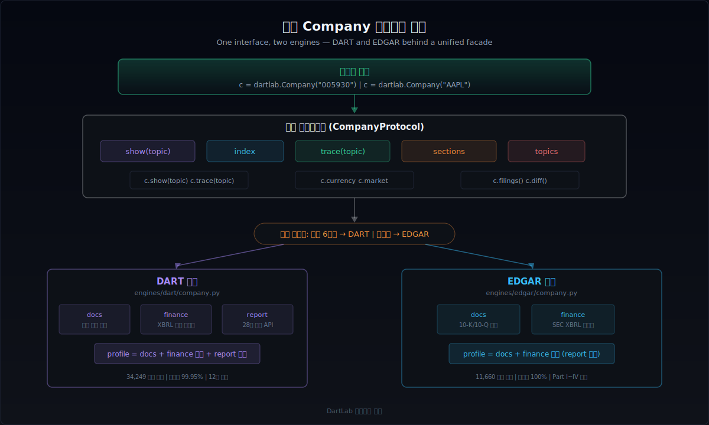

한국 주식만 보던 투자자가 미국 주식을 처음 분석하려 하면, 가장 먼저 부딪히는 벽은 언어가 아니다. **데이터 구조가 완전히 다르다는 것**이다. DART 전자공시에서 삼성전자의 재무제표를 뽑는 방식과 EDGAR에서 Apple의 10-K를 뽑는 방식은 API도 다르고, 계정 체계도 다르고, 보고서 구조도 다르다.

DartLab은 이 두 시스템을 **하나의 Company 인터페이스**로 합친다. `dartlab.Company("005930")`과 `dartlab.Company("AAPL")`이 같은 메서드를 쓰고, 같은 형태의 DataFrame을 돌려준다. 이 글에서는 그 통합이 실제로 어떤 설계 위에서 작동하는지, 어디서 타협이 필요한지, 어디까지 가능한지를 정리한다.


## 왜 국경을 넘는 데이터 통합이 필요한가

한국 개인 투자자의 해외 주식 보유 잔고는 2025년 기준 100조 원을 넘겼다. 대부분이 미국 주식이다. "삼성전자와 TSMC를 비교하고 싶다", "현대차와 Toyota의 영업이익률을 나란히 보고 싶다"는 요구는 이미 일상적이다.

문제는 비교의 **토대**가 없다는 것이다. DART에서 삼성전자의 매출액을 가져오면 K-IFRS 기준이고, EDGAR에서 Apple의 Revenue를 가져오면 US-GAAP 기준이다. 계정 이름이 다르고, 회계 처리 방식이 다르고, 보고 주기도 미묘하게 다르다. 이걸 손으로 맞추려면 양쪽 기준서를 모두 이해해야 하고, 매번 수작업으로 대응 관계를 짜야 한다.

통합 데이터 구조의 목표는 분명하다.

- **같은 질문을 같은 코드로 던진다**: `c.show("IS")`가 한국 기업이든 미국 기업이든 손익계산서를 돌려준다.
- **비교 가능한 형태로 정규화한다**: 계정 이름, 기간 표기, 통화 단위가 맞물려야 비교표를 만들 수 있다.
- **차이가 있으면 차이를 명시한다**: 1:1 매핑이 불가능한 항목은 억지로 합치지 않고, 무엇이 다른지 추적할 수 있게 남겨둔다.


## K-IFRS vs US-GAAP — 같은 듯 다른 회계 기준

한국 DART는 K-IFRS(한국채택국제회계기준)를 쓰고, 미국 EDGAR는 US-GAAP(미국 일반회계원칙)를 쓴다. 두 기준은 2000년대 초부터 수렴(convergence)을 시도해왔고, 리스 회계나 수익 인식 같은 주요 영역에서 상당히 가까워졌다. 그러나 실무에서 데이터를 합치려 하면, 여전히 날카로운 차이가 드러난다.

### 수익 인식

IFRS 15와 ASC 606은 모두 5단계 수익 인식 모형을 쓴다. 원칙은 거의 같다. 그러나 세부 적용 지침에서 차이가 난다. 예를 들어 라이선스 수익을 "시점 인식"할지 "기간 배분"할지 판단하는 기준이 미묘하게 다르다. 실무적으로는 대부분의 제조업/서비스업에서 동일한 결과가 나오지만, 소프트웨어/미디어/제약 업종에서는 같은 계약이 다른 금액으로 잡힐 수 있다.

### 연구개발비 자본화

이것이 가장 눈에 띄는 차이다. K-IFRS(IAS 38)는 연구 단계는 비용 처리하고, **개발 단계에서 기술적 실현가능성 등 6가지 조건을 충족하면 자본화를 허용**한다. 반면 US-GAAP는 소프트웨어 개발비 등 극히 제한된 경우를 제외하면 **거의 전액 비용 처리**한다.

결과적으로 같은 연구개발 활동을 하는 두 기업을 비교할 때, K-IFRS 기업은 무형자산이 더 크고 당기 비용이 적게 나오고, US-GAAP 기업은 무형자산이 작고 당기 비용이 크게 나온다. 영업이익률을 단순 비교하면 K-IFRS 기업이 과대평가될 수 있다.

### 재고자산 평가

K-IFRS(IAS 2)는 **후입선출법(LIFO)을 금지**한다. 선입선출법(FIFO) 또는 가중평균법만 허용한다. US-GAAP는 LIFO를 허용한다. 인플레이션 환경에서 LIFO를 쓰는 미국 기업은 매출원가가 높게 잡히고 재고자산이 낮게 잡힌다. 같은 물건을 팔아도 이익이 달라진다.

실제로 미국 석유/화학 기업 중 상당수가 LIFO를 쓰고 있어서, 한국 화학 기업과 단순 비교하면 수익성이 왜곡된다. EDGAR 10-K의 주석에서 LIFO Reserve를 찾아 조정해야 정확한 비교가 된다.

### 리스 회계

IFRS 16과 ASC 842는 모두 운용리스를 재무상태표에 올리도록 바꿨다. 수렴이 가장 잘 된 영역이다. 다만 US-GAAP는 운용리스와 금융리스를 구분해서 손익계산서 표시 방식이 다르고, IFRS는 모든 리스를 **단일 모형**으로 처리한다. 결과적으로 리스 비중이 높은 기업(항공, 유통)에서 영업이익 숫자가 달라질 수 있다.

| 항목 | K-IFRS | US-GAAP | 통합 시 영향 |
|------|--------|---------|-------------|
| 수익 인식 | IFRS 15 (원칙 기반) | ASC 606 (규칙 기반) | 대부분 동일, 라이선스/SW 주의 |
| R&amp;D 자본화 | 개발비 조건부 자본화 허용 | 거의 전액 비용 처리 | 영업이익률 직접 비교 주의 |
| 재고 평가 | LIFO 금지 | LIFO 허용 | LIFO Reserve 조정 필요 |
| 리스 회계 | IFRS 16 단일 모형 | ASC 842 이중 모형 | 영업이익 차이 가능 |
| 금융상품 분류 | IFRS 9 (3분류) | ASC 320/326 (4분류) | 평가손익 위치 차이 |
| 손상차손 환입 | 허용 | 금지 (영업권 제외) | 회복기 이익 차이 |

이 차이들은 "알면 조정 가능하고, 모르면 오해"하는 영역이다. 통합 데이터 구조는 차이를 없애는 것이 아니라, **차이가 있다는 사실을 구조 안에 남기면서 비교 가능한 형태를 제공하는 것**이 목표다.


## 계정 매핑 — snakeId 브릿지

DART와 EDGAR 양쪽 모두 원본 재무 데이터를 표준 `snakeId`로 정규화한다. 문제는 양쪽의 snakeId가 **독립적으로** 만들어졌다는 것이다.

DART 쪽은 K-IFRS XBRL 택소노미에서 출발한다. `ifrs-full_Revenue`, `dart_OperatingIncomeLoss` 같은 원본 계정ID를 prefix 제거, 동의어 통합, CORE_MAP 오버라이드를 거쳐 `revenue`, `operating_income` 같은 snakeId로 바꾼다. 매핑 데이터는 34,249개다.

EDGAR 쪽은 US-GAAP XBRL 택소노미에서 출발한다. `us-gaap_Revenues`, `us-gaap_OperatingIncomeLoss` 같은 태그를 같은 방식으로 정규화한다. 매핑 데이터는 11,660개다.


### EDGAR_TO_DART_ALIASES — 37개 브릿지

두 시스템의 snakeId를 연결하는 것이 `EDGAR_TO_DART_ALIASES`다. 현재 37개 매핑이 등록되어 있다.

```python
# 실제 매핑 예시
EDGAR_TO_DART_ALIASES = {
    "revenues": "revenue",
    "cost_of_goods_and_services_sold": "cost_of_sales",
    "stockholders_equity": "total_equity",
    "common_stock_shares_outstanding": "issued_shares",
    # ... 37개
}
```

이 매핑이 있으면 `c.finance.IS`가 DART든 EDGAR든 `revenue`, `cost_of_sales`, `operating_income` 같은 동일한 행 이름을 쓰게 된다. 사용자가 코드를 바꿀 필요가 없다.

### 1:1 매핑이 불가능한 경우

모든 계정이 깔끔하게 대응되지는 않는다. 대표적인 예가 **영업이익**이다.

- **DART**: `dart_OperatingIncomeLoss`가 표준 태그로 존재한다. K-IFRS에서 영업이익은 공시 의무 항목이다.
- **EDGAR**: US-GAAP에는 `OperatingIncomeLoss` 태그가 있지만, **영업이익의 정의가 회사마다 다르다**. 어떤 회사는 구조조정 비용을 영업이익에 포함하고, 어떤 회사는 제외한다.

이런 경우 DartLab은 매핑은 하되, `trace(topic)` 기능을 통해 **원본 태그와 출처를 항상 추적**할 수 있게 한다.

```python
c = dartlab.Company("AAPL")
c.trace("IS")
# source: edgar/finance
# original_tag: us-gaap_OperatingIncomeLoss
# mapped_to: operating_income
```

또 다른 예로, DART에는 `dart_TotalComprehensiveIncomeLoss`(포괄손익)가 필수 공시지만, EDGAR에서는 회사에 따라 별도 재무제표(Statement of Comprehensive Income)로 분리하기도 하고 손익계산서에 포함하기도 한다. 이런 구조적 차이는 매핑으로 해결하는 것이 아니라, **어떤 재무제표에서 왔는지를 메타데이터로 보존**하는 방식으로 처리한다.


## 통화 처리 — 원화와 달러 사이

재무 데이터를 통합할 때 통화는 피할 수 없는 문제다.

### 단위 차이

DART 재무제표는 기본 단위가 **원(KRW)**이다. 삼성전자의 매출은 `302,231,009,000,000`처럼 나온다 (약 302조 원). EDGAR는 기업마다 다르지만, 대부분 **천 달러(thousands)** 또는 **백만 달러(millions)** 단위로 보고한다. Apple의 매출은 `394,328`(백만 달러)로 나온다.

DartLab은 각 엔진이 원본 단위를 그대로 보존하면서, `currency` 속성으로 통화 정보를 노출한다.

```python
kr = dartlab.Company("005930")
kr.currency  # 'KRW'

us = dartlab.Company("AAPL")
us.currency  # 'USD'
```

### 환율 적용 시점

두 기업의 매출을 같은 통화로 비교하려면 환율을 적용해야 한다. 여기서 **어느 시점의 환율**을 쓸지가 문제다.

- **기말 환율(period-end rate)**: 재무상태표 항목(자산, 부채, 자본)에 적합하다. 12월 31일 기준 환율로 환산한다.
- **평균 환율(average rate)**: 손익계산서 항목(매출, 비용, 이익)에 적합하다. 해당 기간의 평균 환율로 환산한다.

이것은 단순히 환율을 곱하는 문제가 아니라, **어떤 재무제표 항목이냐에 따라 다른 환율을 적용해야 한다**는 뜻이다. 현재 DartLab은 통화 변환을 자동으로 수행하지 않는다. 원본 통화를 보존하고, 비교 시 사용자가 명시적으로 환율을 지정하는 방식을 택했다. 자동 변환은 편리하지만, 환율 선택에 따라 비교 결과가 달라지는 만큼 투명성이 더 중요하다고 판단했다.


## sections 수평화 — DART 12장 vs EDGAR Part I/II

재무 숫자만큼이나 중요한 것이 **서술형 문서 구조의 통합**이다. DART 사업보고서는 12개 장(chapter)으로 구성되고, EDGAR 10-K는 Part I ~ Part IV로 구성된다. 겉보기에는 완전히 다르지만, 내용상 대응 관계가 분명한 영역이 있다.


### 의미적 대응 6쌍

DartLab에는 이미 6개의 의미적 대응(semantic pair)이 매핑되어 있다.

| DART topic | DART 제목 | EDGAR topic | EDGAR 제목 |
|------------|-----------|-------------|------------|
| `businessOverview` | 사업의 내용 | `business` | Item 1 — Business |
| `riskFactors` | 투자위험요소 | `riskFactors` | Item 1A — Risk Factors |
| `mdna` | 경영진 의견 | `mdna` | Item 7 — MD&amp;A |
| `financialStatements` | 재무제표 | `financialStatements` | Item 8 — Financial Statements |
| `legalProceedings` | 소송 사항 | `legalProceedings` | Item 3 — Legal Proceedings |
| `controls` | 내부통제 | `controls` | Item 9A — Controls and Procedures |

이 매핑 덕분에 `c.show("businessOverview")`는 DART 기업이면 "사업의 내용"을, EDGAR 기업이면 "Item 1 Business"를 같은 형태로 돌려준다. [sections 구조를 자세히 알고 싶다면 이전 글](/blog/dartlab-easy-start)을 참고하라.

### 매핑이 안 되는 영역

DART에만 있는 것:
- **임원 현황, 직원 현황, 배당 관련 사항** — DART의 report 28개 정형 API 체계에서 오는 데이터다. EDGAR에는 대응하는 정형 데이터가 없다. EDGAR 기업의 임원 정보는 10-K의 서술형 텍스트(Item 10~14)에 흩어져 있다.

EDGAR에만 있는 것:
- **Item 5 Market for Registrant's Common Equity** — 주식 시장 정보, 자사주 매입 이력 등이 정형화되어 있다. DART에서는 이에 대응하는 별도 섹션이 없고, "주식의 총수" 등 여러 항목에 분산되어 있다.

통합 구조에서는 한쪽에만 있는 topic을 **억지로 대응시키지 않는다**. 대신 `c.topics`로 해당 기업에 어떤 topic이 있는지 확인하고, 없는 topic을 요청하면 빈 결과를 명확히 돌려준다.


## 보고 주기 — 분기 보고의 미묘한 차이

DART와 EDGAR 모두 분기별 보고를 하지만, 구조가 미묘하게 다르다.

| 구분 | DART 전자공시 | EDGAR |
|------|-------------|-------|
| 분기 보고 | 1분기, 반기, 3분기, 사업 | 10-Q, 10-Q, 10-Q, 10-K |
| 연간 보고 | 사업보고서 (= Q4) | 10-K (= Annual) |
| 기간 표기 | `2024Q1`, `2024Q2`, `2024Q3`, `2024Q4` | `2024-Q1`, `2024-Q2`, `2024-Q3`, `2024-FY` |
| 반기 특이성 | 반기보고서 = H1 (6개월 누적) | 해당 없음 |
| 재무 누적 | IS/CF 누적 공시 → standalone 역산 | 분기별 standalone 직접 공시 |

DART의 가장 큰 특이점은 **반기보고서**의 존재다. 2분기(Q2) 실적을 직접 공시하는 것이 아니라, 1월~6월 누적(H1)을 공시한다. DartLab은 이 누적값에서 Q1을 빼서 Q2 standalone을 역산한다.

또 하나 주의할 점은 DART의 `2024Q4`가 사실상 **연간 사업보고서**라는 것이다. EDGAR의 `2024-FY`와 같은 의미다. DartLab에서는 `show(period="2024")`로 요청하면 DART는 `2024Q4`를, EDGAR는 `2024-FY`를 자동으로 찾아준다. 이 연간 alias 처리는 양쪽에서 동일하게 작동한다.


## 통합 Company 프로토콜

DartLab의 `Company`는 DART든 EDGAR든 같은 인터페이스를 쓴다. 이것이 가능한 이유는 **엔진별 백엔드가 분리되어 있고, 루트 facade가 프로토콜을 강제**하기 때문이다.



### 공통 인터페이스

```python
import dartlab

# 한국 기업 — DART 엔진
kr = dartlab.Company("005930")

# 미국 기업 — EDGAR 엔진
us = dartlab.Company("AAPL")

# 같은 메서드, 같은 반환 형태
kr.show("IS")      # 손익계산서 — K-IFRS
us.show("IS")      # 손익계산서 — US-GAAP

kr.sections         # topic x period 매트릭스
us.sections         # topic x period 매트릭스

kr.topics           # 사용 가능한 topic 목록
us.topics           # 사용 가능한 topic 목록

kr.trace("IS")      # 출처 추적
us.trace("IS")      # 출처 추적

kr.index            # 전체 목차 (chapter, topic, source, shape)
us.index            # 전체 목차 (chapter, topic, source, shape)
```

### 엔진별 백엔드

내부적으로는 완전히 다른 코드가 동작한다.

- `engines/dart/company.py`: DART 전용 본체. docs(공시 문서 파싱) + finance(XBRL 재무 정규화) + report(28개 정형 API)를 합쳐서 `profile`을 만든다.
- `engines/edgar/company.py`: EDGAR 전용 본체. docs(10-K/10-Q 섹션 파싱) + finance(SEC XBRL 재무 정규화)를 합쳐서 `profile`을 만든다. EDGAR에는 report 레이어가 없다.

루트 `dartlab.Company`는 종목 코드를 보고 어떤 엔진을 쓸지 자동으로 결정한다. 숫자 6자리면 DART, 알파벳 티커면 EDGAR다. 사용자는 엔진을 신경 쓸 필요가 없다.

### profile이 합치는 방식

Company의 기본 뷰인 `profile`은 세 레이어를 특정 우선순위로 합친다.

1. **docs** — 서술형 텍스트와 테이블의 기간별 수평화 (sections)
2. **finance** — 정량 재무 데이터 (BS, IS, CF, SCE). docs의 재무 topic을 **대체**한다.
3. **report** — DART 전용 정형 데이터. 해당 topic에 **채운다**.

EDGAR는 report 레이어가 없으므로 docs + finance 대체만으로 완성된다. 이것이 [sections 사상](/blog/dartlab-easy-start)의 핵심이다. sections가 전체 지도이고, finance가 숫자를 더 강하게 덮고, report가 빈 곳을 채운다.


## 실전에서 부딪히는 6가지 벽

이론적으로 통합 구조를 설계하는 것과 실제로 동작하게 만드는 것 사이에는 간극이 있다. DartLab이 실제로 마주한 주요 문제들을 정리한다.


### 1. 회계연도 불일치

삼성전자의 회계연도는 1월~12월이다. Apple의 회계연도는 10월~9월이다(FY2024 = 2023.10~2024.09). 같은 "2024년 실적"을 비교한다고 해도, **실제로 다른 기간을 보고 있다**.

이 문제는 매핑으로 해결할 수 없다. 기간 정보를 **투명하게 노출**하고, 비교 시 기간 차이를 사용자가 인지하도록 하는 것이 현실적인 접근이다. DartLab은 각 기간의 시작일과 종료일을 메타데이터로 보존한다.

### 2. 부문(세그먼트) 보고 차이

K-IFRS와 US-GAAP 모두 IFRS 8 / ASC 280 기반의 부문 보고를 요구하지만, 실무에서 부문을 나누는 방식은 회사 재량이다. 삼성전자는 DS(반도체), SDC(디스플레이), MX(모바일) 등으로 나누고, Apple은 Products/Services 두 부문만 쓴다.

부문 이름을 표준화하는 것은 불가능하다. 대신 DartLab은 부문 데이터를 **원본 구조 그대로** sections에 담고, `show("segments")`로 접근하게 한다.

### 3. 연결/별도 재무제표 복잡성

DART는 연결재무제표(CFS)와 별도재무제표(OFS)를 모두 공시한다. DartLab은 CFS를 우선 사용하되, CFS가 없으면 OFS로 fallback한다. EDGAR는 대부분 연결재무제표만 공시한다.

두 시스템에서 "연결"의 범위가 같은지도 주의가 필요하다. 관계사 정의, 변동이익실체(VIE) 처리 등에서 차이가 날 수 있다.

### 4. 계정 누락과 비대칭

DART finance의 매핑률은 97.07%다. 대부분의 핵심 계정이 매핑되지만, 업종 특화 계정(보험업의 보험계약부채, 은행업의 예수부채 등)은 매핑이 안 될 수 있다. EDGAR도 마찬가지로, 회사 고유(extension) 태그를 쓰는 경우 표준 snakeId에 매핑되지 않는다.

통합 구조에서는 매핑되지 않은 계정을 **버리지 않고** 원본 태그 그대로 보존한다. `trace()`를 통해 어떤 계정이 매핑되었고 어떤 계정이 원본 그대로인지 확인할 수 있다.

### 5. 데이터 수집 범위의 비대칭

현재 DartLab의 DART 데이터는 한국 상장기업 전체를 커버하고 [데이터를 분할 관리](/blog/corp-code-to-filing-pipeline)한다. EDGAR 데이터는 974개 기업이 수집되어 있다. 이 비대칭은 데이터 확장으로 점진적으로 해소할 문제이며, 구조적 한계는 아니다.

### 6. 주석(Notes) 구조의 비대칭

재무제표 본문만으로는 기업의 실체를 파악하기 어렵다. 리스 부채의 만기 분포, 사업 부문별 상세 실적, 관계사 거래 내역, 우발 채무 규모 같은 핵심 정보는 대부분 **주석(Notes)**에 담겨 있다. 문제는 DART와 EDGAR의 주석 제공 방식이 근본적으로 다르다는 것이다.

DART 주석은 K-IFRS 분류체계에 따라 비교적 체계적으로 구조화되어 있다. OpenDART API를 통해 주석 항목별로 접근할 수 있고, 각 주석이 어떤 K-IFRS 기준서(IAS 1, IFRS 7 등)에 대응하는지가 명확하다. 주석 안의 테이블도 일정한 형식을 따르는 편이어서 파싱 난이도가 상대적으로 낮다.

반면 EDGAR 주석은 **Inline XBRL**로 HTML 문서 안에 직접 태깅되어 있다. 10-K 원문 자체가 주석이다. XBRL 태그가 텍스트와 숫자에 붙어 있지만, 태그 간의 계층 구조와 테이블 경계가 회사마다 제각각이다. 같은 리스 만기 스케줄이라도 회사에 따라 테이블 구조, 컬럼명, 행 배치가 완전히 다르다. 표준 택소노미 태그를 쓰더라도 실제 HTML 렌더링 구조에서 정보를 추출하는 것은 별개의 문제다.

이 차이가 치명적인 이유는 **비교에 진짜 필요한 정보가 주석에 있기 때문**이다. 영업이익 숫자는 손익계산서에서 바로 뽑을 수 있지만, 그 영업이익이 어떤 부문에서 왔는지, 리스 비용이 향후 몇 년간 어떻게 분포하는지, 특수관계자와 얼마나 거래했는지는 주석을 열어야 한다.

DartLab은 sections의 topic × period 수평화로 주석 영역까지 포괄한다. DART 쪽은 주석 테이블이 sections 안에서 `blockType="table"`로 분리되어 수평화가 작동한다. 그러나 EDGAR 주석 파싱은 아직 초기 단계로, 서술형 텍스트는 sections에 들어오지만 주석 내 테이블의 구조화 수준은 DART에 비해 뒤처져 있다.

장기적으로는 테이블 매퍼를 EDGAR 주석에도 확장하여, 구조화 가능한 주석 테이블(리스 만기, 부문별 매출, 관계사 거래)부터 순차적으로 수평화 범위를 넓혀갈 계획이다. 모든 주석을 한 번에 통합하기보다는, 비교 분석에서 실제로 쓰이는 주석 항목을 우선순위로 잡고 하나씩 파서를 검증하는 접근이 현실적이다.


## 비교 체크리스트

DART-EDGAR 통합 데이터를 사용할 때 확인해야 할 항목을 정리한다.

| 체크 항목 | 확인 방법 | 주의 사항 |
|-----------|-----------|-----------|
| 회계 기준 | `c.currency`로 통화 확인 | K-IFRS vs US-GAAP 차이 인지 |
| 계정 매핑 | `c.trace("IS")`로 원본 태그 확인 | 영업이익 정의 차이 주의 |
| 기간 대응 | `c.sections` 기간 컬럼 확인 | 회계연도 시작월 차이 |
| 통화 단위 | 원본 단위 보존 여부 확인 | EDGAR는 천/백만 달러 단위 주의 |
| 연결/별도 | CFS 우선 사용 여부 확인 | DART는 CFS+OFS, EDGAR는 CFS만 |
| 부문 데이터 | `c.show("segments")` | 부문 분류 기준 회사마다 다름 |
| R&amp;D 처리 | 자본화 여부 확인 | K-IFRS 자본화 vs US-GAAP 비용 |
| 재고 평가 | LIFO 사용 여부 확인 | LIFO Reserve 조정 필요 |


## 현재 가능한 것과 로드맵

### 지금 가능한 것

- **동일 인터페이스**: `Company("005930")`과 `Company("AAPL")`이 같은 `show()`, `sections`, `index`, `trace()`, `topics` 메서드를 쓴다.
- **계정 매핑**: DART 34,249개 + EDGAR 11,660개 매핑, EDGAR_TO_DART_ALIASES 37개 브릿지로 핵심 재무 비교 가능.
- **sections 수평화**: DART 매핑률 99.95%, EDGAR 100%. 서술형 문서를 topic x period로 비교 가능.
- **finance 정규화**: BS/IS/CF/SCE가 양쪽 모두 표준 snakeId로 제공된다.
- **출처 추적**: `trace()`로 모든 데이터의 원본 출처와 매핑 경로를 확인 가능.

### 아직 남은 것

- **자동 통화 변환**: 환율 자동 적용과 시점 선택은 아직 수동이다. 사용자가 명시적으로 환율을 지정해야 한다.
- **회계 기준 차이 자동 조정**: R&D 자본화, LIFO 조정 등은 사용자가 직접 판단해야 한다. 자동 조정은 오히려 위험할 수 있다.
- **EDGAR 기업 확장**: 현재 974개 → 전체 SEC 등록 기업으로 확장 예정.
- **cross-border 비교 함수**: 두 Company를 나란히 놓고 차이를 하이라이트하는 전용 비교 기능은 향후 과제다.

[XBRL 계정 매핑의 구체적인 작동 방식](/blog/opendart-xbrl-notes-pipeline)과 [대량 데이터 수집 과정](/blog/corp-code-to-filing-pipeline)을 이전 글에서 다뤘으니 참고하라.


## FAQ

### DART와 EDGAR 데이터를 합쳐서 한 화면에서 비교할 수 있나요?

`dartlab.Company`를 각각 생성하면 같은 `show()`, `sections` 인터페이스로 접근할 수 있다. 현재는 두 Company 객체를 나란히 놓고 비교하는 방식이다. 통화 단위가 다르므로 환율은 사용자가 적용해야 한다.

### 영업이익 비교가 정확한가요?

DART의 영업이익은 K-IFRS 표준 정의에 따라 비교적 일관된다. EDGAR의 영업이익은 회사마다 포함/제외 항목이 다를 수 있다. `trace("IS")`로 원본 태그를 확인하고, 필요하면 주석에서 영업이익 정의를 확인하는 것을 권장한다.

### EDGAR 데이터는 어떤 기업이 지원되나요?

현재 974개 기업이 수집되어 있다. S&P 500을 포함한 주요 대형주가 우선 수집 대상이다. 기업 확장은 지속적으로 진행 중이다.

### K-IFRS와 US-GAAP 차이 때문에 재무비율 비교가 의미 없는 건 아닌가요?

완전히 동일한 기준은 아니지만, 자기자본수익률, 부채비율, 매출성장률 같은 핵심 비율은 충분히 의미 있는 비교가 된다. 다만 R&D 집약 업종이나 LIFO 사용 기업에서는 조정이 필요하다. 비교 체크리스트를 활용해서 조정이 필요한 항목을 먼저 확인하라.

### DartLab 없이 직접 통합하려면 어떤 작업이 필요한가요?

최소한 (1) 양쪽 XBRL 택소노미에서 계정 매핑 테이블 구축, (2) 기간 표기 통일, (3) 통화/단위 변환, (4) 누적→standalone 역산(DART), (5) section title → topic 매핑을 직접 해야 한다. 각각이 수천 개의 예외를 포함하는 작업이다.


## 출처

- [IFRS Foundation](https://www.ifrs.org/) — 국제회계기준 원문 및 해석
- [SEC EDGAR](https://www.sec.gov/edgar) — 미국 전자공시 시스템
- [DART 전자공시시스템](https://dart.fss.or.kr/) — 한국 전자공시 시스템
- [K-IFRS 한국채택국제회계기준](https://www.kasb.or.kr/) — 한국회계기준원
- [ASC 606 Revenue from Contracts with Customers](https://asc.fasb.org/) — US-GAAP 수익 인식
- [IFRS 16 vs ASC 842 비교](https://www.iasplus.com/en/standards/ifrs/ifrs-16) — Deloitte IAS Plus


## 한 줄 정리

DART와 EDGAR의 통합은 차이를 없애는 것이 아니라, **같은 질문을 같은 코드로 던지면서 차이는 추적 가능하게 보존하는 것**이다. `Company` 하나로 양쪽 데이터에 접근하고, `trace()`로 무엇이 같고 무엇이 다른지 언제든 확인할 수 있다.
