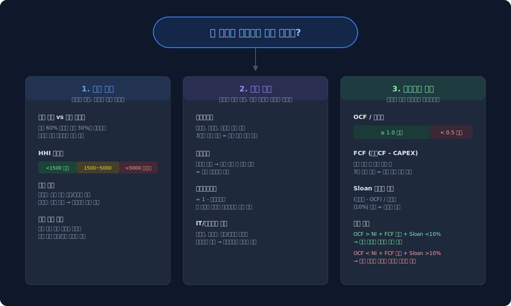
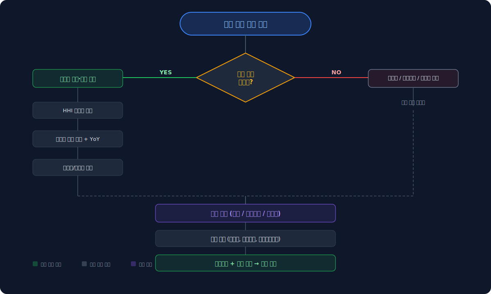
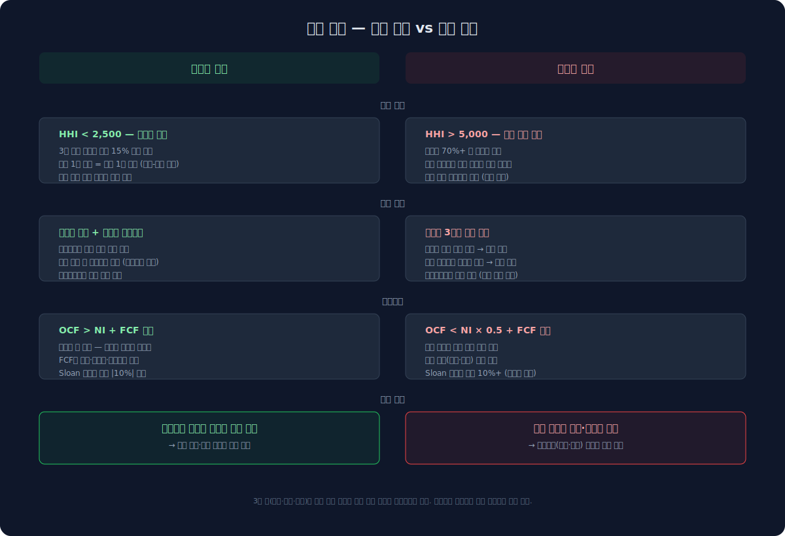
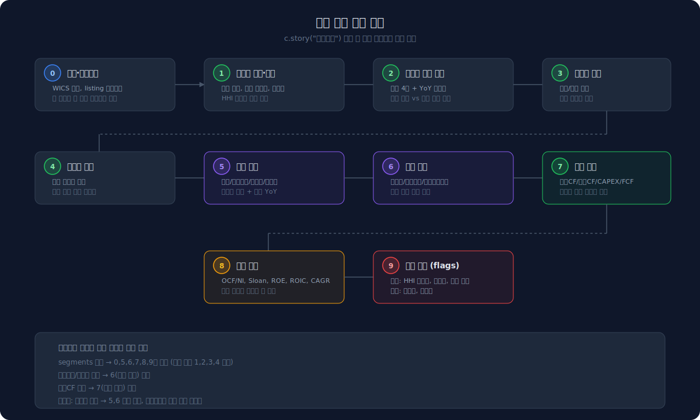
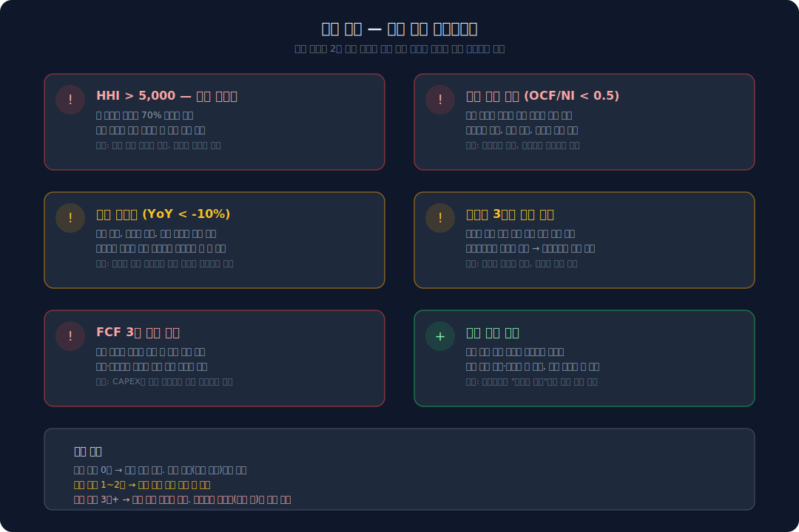

# 이 회사는 무엇으로 돈을 버는가 — 수익 구조 읽기

기업 분석을 시작할 때 가장 먼저 떠오르는 질문은 "이 회사 실적이 어떤가?"다. PER, 자기자본수익률, 영업이익률 같은 숫자를 먼저 보게 된다. 하지만 그 숫자가 `어디에서 나오는지`를 모르면 판단의 기반이 없다. 영업이익률이 15%라는 숫자는 한 가지 사업에서 나온 15%인지, 네 가지 사업의 평균인지에 따라 완전히 다른 의미를 가진다.

수익 구조는 재무제표 이전에 사업을 이해하는 과정이다. 이 글은 "무엇으로 돈을 버는가"라는 질문에만 집중한다. 비용 구조, 현금흐름, 이익의 질은 별도 섹션에서 다룬다. 여기서는 부문별 매출·이익 구성 → 매출 성장 추이 → 매출 집중도를 순서대로 읽는 프레임워크를 정리한다.



---

## 왜 수익 구조부터 보는가

재무비율을 먼저 보면 숫자의 방향만 보게 된다. "영업이익률이 올랐다", "자기자본수익률가 내렸다"는 사실은 확인하지만, 왜 그런지는 설명하지 못한다. 수익 구조를 먼저 보면 다르다.

- 삼성전자의 영업이익률이 크게 변하면, DS(반도체)와 DX(모바일·가전) 중 어디가 움직였는지를 먼저 물을 수 있다
- 카카오의 매출이 올랐는데 영업이익이 안 따라오면, 어떤 자회사가 적자인지를 확인하게 된다
- 매출이 한 부문에 70% 이상 집중되어 있으면, 그 부문의 업황이 곧 회사 전체 실적이라는 뜻이다

수익 구조를 알아야 숫자의 변화에 이유를 붙일 수 있고, 이유를 알아야 다음 분기를 추정할 수 있다. 순서를 바꾸면 안 된다.

기업 분석의 전체 흐름은 이렇다: `무엇으로 버는가(수익)` → `어떻게 자금을 조달하는가(자금)` → `얼마를 남기는가(이익)` → `투자 효율은 어떤가(ROIC)`. 이 글은 첫 번째 단계다.



---

## 부문별 매출·이익 구성을 본다

부문(세그먼트) 공시가 있는 회사라면, 가장 먼저 볼 것은 `매출 비중`과 `이익 기여도`의 차이다. 매출의 60%를 차지하는 부문이 이익의 30%만 기여한다면, 그 부문은 규모는 크지만 수익성은 낮다. 반대로 매출 비중 20%인 부문이 이익의 50%를 가져간다면, 그 부문의 마진이 전체 실적을 지탱하는 구조다.

이 차이를 읽는 것이 핵심이다. 매출액 순위와 영업이익 순위가 다른 회사일수록 수익 구조의 편중이 존재한다.

### 부문별 매출 추이와 YoY

부문 구성을 한 시점에서 보는 것만으로는 부족하다. 다년간 추이를 보면 어떤 부문이 성장하고 어떤 부문이 정체하는지 방향이 드러난다. 부문별 YoY 성장률이 엇갈리는 시점이 구조 전환의 신호다.

### 지역별·제품별 매출

지역별 매출은 내수/수출 비중을 보여준다. 수출 비중이 70%를 넘으면 환율과 글로벌 수요에 민감한 구조다. 제품별 매출은 단일 제품 의존도를 판단하는 데 쓴다. 하나의 제품이 매출의 60% 이상이면 그 제품의 수요 사이클이 곧 회사의 사이클이다.

```python
import dartlab
c = dartlab.Company("005930")  # 삼성전자
c.story("수익구조")
```

위 명령 한 줄이면 부문별 매출·이익 구성, 지역별 매출, 제품별 매출, 매출 성장 분석, 매출 집중도를 한 번에 볼 수 있다. 부문 공시가 없는 회사에서는 자동으로 해당 섹션이 생략되고 매출 성장 분석 중심으로 보고서가 생성된다.

---

## HHI와 매출 집중도

매출이 특정 부문에 얼마나 몰려 있는지를 정량화하는 방법이 HHI(허핀달-허슈만 지수)다.

- **HHI 1,500 미만**: 분산된 매출 구조. 한 부문이 무너져도 전체에 미치는 충격이 제한적이다
- **HHI 1,500~2,500**: 적당한 집중. 2~3개 핵심 부문이 리드하는 구조
- **HHI 2,500~5,000**: 중간 집중. 상위 1~2개 부문에 의존하는 구조로, 부문별 업황 차이에 주의한다
- **HHI 5,000 초과**: 고집중. 사실상 단일 사업 의존이며, 해당 부문의 산업 사이클이 곧 회사의 사이클이다

HHI 외에 `상위 1개 부문 비중`도 함께 본다. HHI가 3,000이더라도 1위 부문이 50%인지 70%인지에 따라 리스크가 다르다.

부문 수 변화도 중요하다. 전년 4개 부문이 올해 8개로 늘었다면 사업 재편이 있었다는 뜻이다. 부문 재편은 단순히 조직 변경일 수도 있지만, 인수·합병이나 사업 분리를 반영하는 경우가 많다.

부문 공시가 없는 회사도 많다. 금융업은 부문 대신 이자수익·수수료수익으로 구분하고, 중소형 기업은 단일 부문인 경우가 흔하다.



---

## 매출 성장 분석

매출의 방향을 보는 지표는 세 가지다.

### YoY — 단기 방향

매출 YoY(전년 동기 대비 성장률)는 가장 기본적인 방향 지표다. +20% 이상이면 고성장, -10% 이하면 역성장 경고다. 분기별 QoQ(전분기 대비)도 함께 보면 계절성과 반전 시점을 감지할 수 있다.

### 3Y 연평균성장률 — 중기 추세

1~2분기의 등락으로 판단하면 노이즈에 속기 쉽다. 3년 연평균성장률(연평균 복합성장률)은 중기 추세를 보여준다. YoY가 높아도 3Y 연평균성장률이 낮으면 반짝 회복일 수 있고, YoY가 낮아도 3Y 연평균성장률이 높으면 일시적 둔화일 수 있다.

### 분기별 매출 추이

최근 4~5분기 매출을 나란히 놓으면 계절성(Q4 강세 등)과 추세 반전을 눈으로 확인할 수 있다. 분기 매출이 3분기 연속 감소하고 있다면, YoY나 연평균성장률보다 먼저 경고를 보내는 신호다.

---

## 실전: 삼성전자 vs IT 플랫폼

같은 프레임워크를 다른 유형의 회사에 적용하면 무엇이 달라지는지 비교해보자.

### 삼성전자 — 부문별 이익률 차이가 핵심

삼성전자는 DX(모바일·가전), DS(반도체), SDC(디스플레이), Harman 등의 부문으로 보고한다. 2025년 기준 DX 부문이 매출의 67%를 차지하지만, DS 부문의 영업이익률이 더 높다. 반도체 업황에 따라 전체 실적의 방향이 바뀌는 구조다. 매출 HHI는 약 3,500으로 중간 집중이며, 매출 3Y 연평균성장률은 +5.8%다.

### 카카오 — 자회사별 매출 비중이 핵심

카카오는 7개 이상의 자회사가 부문별로 보고된다. 카카오엔터, 카카오페이, 카카오모빌리티 등 각 자회사의 매출 비중과 성장 방향이 다르다. 어떤 자회사가 성장을 이끌고 어떤 자회사가 정체하는지를 부문 추이에서 읽어야 한다.

### 금융업 — 완전히 다른 계정 구조

은행·보험사는 매출액이라는 일반 계정이 없다. 이자수익, 수수료수익이 매출 역할을 한다. 부문(세그먼트) 공시도 없는 경우가 많다. 이런 회사에서는 부문 구성 분석을 건너뛰고, 매출 성장 분석으로 바로 간다. dartlab의 `c.story()`는 이런 경우를 자동으로 감지하여 해당 섹션을 생략한다.



---

## dartlab이 아직 못 보여주는 것

현재 `c.story("수익구조")`가 보여주는 것은 한 회사의 수익 구조 스냅샷이다. 아직 아래 항목은 지원하지 않는다.

- **경쟁사 대비 부문 구성 비교**: 삼성전자와 SK하이닉스의 반도체 부문 매출 비중을 나란히 보는 기능
- **부문별 마진 추세 차트**: 3년간 DS 부문 영업이익률이 어떻게 변했는지 시계열 시각화
- **성장 분해(Organic vs M&A)**: 매출 성장 중 인수 효과를 분리하는 기능

이 항목들은 향후 업데이트에서 추가할 예정이다.

---

## 체크리스트

수익 구조를 읽을 때 확인해야 할 핵심 질문이다.

- 매출 1위 부문이 이익 1위인가? 아니라면 이익을 실제로 만드는 부문은 어디인가
- 부문별 YoY가 엇갈리고 있는가? 성장 부문과 정체 부문의 방향이 다르면 구조 전환 신호다
- 매출 YoY와 3Y 연평균성장률이 같은 방향인가? 어긋나면 반짝 회복인지 일시적 둔화인지 판단한다
- HHI 5,000 초과이면 단일 부문 의존 — 해당 부문의 산업 사이클 리스크를 확인한다
- 내수/수출 비중이 한쪽으로 70% 이상 쏠려 있으면, 환율·지역 리스크를 점검한다



---

## 다음 글

이 글은 "무엇으로 돈을 버는가"에 대한 답이었다. 다음 글에서는 "돈을 어디서 조달하는가" — [자금 구조](/blog/revenue-structure-how-to-read)를 다룬다. 부채비율, 차입 만기, 이자보상배율, 부실 예측 지표를 통해 사업의 지속 가능성을 판단하는 프레임워크를 정리한다.

그 이후에는 "얼마를 남기는가" — 이익 구조(비용, 마진, 영업 레버리지)와 "이익이 진짜 현금인가" — 이익의 질(영업활동현금흐름/NI, Sloan, 잉여현금흐름)을 순서대로 다룬다.

세그먼트(부문) 공시 자체의 구조와 읽는 법은 [세그먼트 공시는 어디서 읽고 무엇을 비교해야 하나](/blog/segment-reporting-interpretation)에서 더 자세히 다루고 있다.
