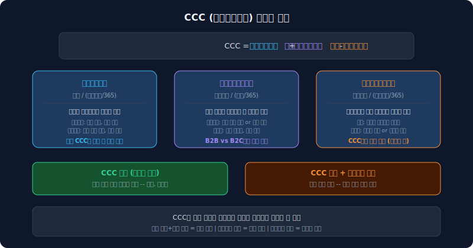
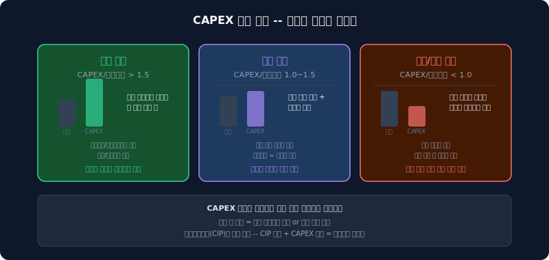
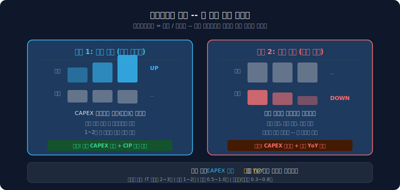

# 자산 구조 분석 — BS를 영업/비영업으로 재분류하면 보이는 것들

대차대조표는 유동자산과 비유동자산으로 나뉜다. 1년 안에 현금이 되는가, 아닌가. 이 분류는 유동성(지급 능력)을 볼 때는 유용하지만, "이 회사가 사업에 얼마나 투자하고 있는가"를 보기에는 부족하다. 현금과 매출채권이 같은 유동자산에 묶이고, 유형자산과 투자자산이 같은 비유동자산에 묶인다. 사업에 쓰이는 자산과 사업 밖 자산이 구분되지 않는다.

자산을 **용도** 기준으로 다시 나누면 다른 질문이 가능해진다. 이 글은 [수익 구조 읽기](/blog/revenue-structure-how-to-read)에서 시작한 기업 분석의 세 번째 축이다. 수익 구조에서 "무엇으로 버는가"를, 자금 구조에서 "돈을 어디서 가져오는가"를 봤다면, 여기서는 "가져온 돈이 어디에 묶여 있는가"를 본다.


---

## 왜 영업/비영업으로 나누는가

Penman의 Reformulated Balance Sheet가 제안하는 방식이다. 자산을 유동/비유동이 아니라, **사업에 직접 쓰이는 자산**(영업)과 **사업 밖 자산**(비영업)으로 나눈다.

| 분류 | 포함 항목 | 의미 |
|------|-----------|------|
| **영업자산** | 매출채권, 재고자산, 유형자산, 무형자산, 건설중인자산, 사용권자산 | 사업 운영에 직접 투입된 자산 |
| **비영업자산** | 현금, 단기금융상품, 장기투자자산, 관계기업투자 | 사업과 직접 관련 없는 자산 |
| **영업부채** | 매입채무, 선수금, 미지급비용 | 영업 과정에서 자연스럽게 발생하는 부채 |

영업자산에서 영업부채를 빼면 **순영업자산(NOA, Net Operating Assets)**이 나온다. NOA는 "이 회사가 사업을 돌리기 위해 실제로 묶어둔 순자산"이다. 투하자본수익률 계산의 분모이기도 하다.

이 재분류를 하면 세 가지가 보인다.

1. **사업 집중도**: 영업자산 비중이 높으면 자산 대부분이 사업에 묶여 있다. 비영업자산 비중이 높으면 여유 자금이 많거나 지주사/투자 성격이다
2. **전략 변화**: 5년간 영업자산 비중이 올라가면 사업 확장 중이고, 내려가면 투자 회수 또는 사업 축소 중이다
3. **투자 효율**: NOA 대비 매출(또는 이익)을 보면 투입된 자산이 얼마나 효율적으로 수익을 만드는지 판단할 수 있다

유동/비유동 분류만으로는 이 세 가지를 물을 수 없다.

```python
import dartlab
c = dartlab.Company("005930")  # 종목코드만 바꾸면 어떤 회사든 동일
c.story("자산구조")
```

위 명령 한 줄이면 영업/비영업 재분류, NOA 시계열, 자산 구성 상세, 현금전환주기, 설비투자 패턴, 자산회전율까지 한 번에 나온다.

---

## 영업/비영업 비중 변화를 시계열로 읽는다

한 시점의 비중만 보면 "영업자산 60%"라는 사실만 확인된다. 5년 추이를 보면 방향이 보인다.


**확장형**: 영업자산 비중이 올라간다. 유형자산, 건설중인자산이 빠르게 늘어나는 회사다. 배터리, 반도체처럼 대규모 설비 투자가 필요한 산업에서 흔하다. 비영업자산(현금, 투자자산)은 상대적으로 줄어든다. 투자에 현금을 쏟아붓고 있다는 뜻이다.

**안정형**: 비중이 크게 변하지 않는다. 사업 구조가 안정적이거나, 투자와 감가상각이 균형을 이루는 성숙기 기업이다.

**축소형/전환형**: 영업자산 비중이 내려가고 비영업자산이 늘어난다. 사업을 축소하거나, 자산을 매각하거나, 지주사로 전환하는 경우다.

비중 변화의 속도도 중요하다. 5년간 영업자산 비중이 10pp 이상 올랐다면 상당한 전략적 방향 전환이 있었다는 뜻이다. 이때 NOA가 함께 올랐는지, 매출도 따라왔는지를 반드시 확인한다.

---

## 자산 구성 상세 — 무엇이 묶여 있는가

영업/비영업 비중이 방향을 알려주면, 다음은 항목별 상세다. 어떤 자산이 늘고 줄었는지를 보면 사업의 실체가 드러난다.

| 항목 | 성격 | 이것이 크면 |
|------|------|-------------|
| **매출채권** | 외상 매출 | 결제 조건이 느슨하거나 매출 규모가 크다. 회전율 하락 시 회수 위험 |
| **재고자산** | 미판매 재고 | 제조업/유통업에서 크다. 급증 시 수요 둔화 또는 과잉 생산 신호 |
| **유형자산(PPE)** | 공장/설비 | 자본집약 산업의 핵심. 설비투자 누적 결과 |
| **건설중인자산(CIP)** | 미완성 투자 | 향후 감가상각 부담의 선행지표. 유형자산으로 전환 예정 |
| **무형자산** | 영업권/특허/개발비 | 인수 합병 이력 또는 R&D 집약 구조 |
| **사용권자산(ROU)** | 리스 자산 | IFRS 16 적용 후 급증. 실질적 임차 비용 |
| **현금** | 즉시 가용 자금 | 많으면 여유, 갑자기 줄면 투자 또는 상환에 사용 |
| **투자자산** | 관계기업 지분 등 | 지주사 성격이 강할수록 크다 |

이 항목들을 5년 시계열로 보면 투자 방향이 명확해진다. 유형자산이 2배로 늘면서 현금이 반으로 줄었다면, 적극적 설비 투자 중이다. 건설중인자산이 크면 "아직 가동을 시작하지 않은 투자"가 많다는 뜻이고, 이것이 유형자산으로 전환되면 감가상각비가 추가로 발생한다.

예를 들어 삼성SDI(006400)의 경우 유형자산이 5년간 7.6조에서 19.2조로 2.5배 늘었다. 배터리 공장에 집중 투자한 결과다. 반면 현금은 2.3조에서 1.8조로 줄었다. 투자에 현금을 소진하고 있다는 뜻이다.

---

## 운전자본과 현금전환주기 — 현금이 돌아오는 속도

운전자본(Working Capital)은 영업 과정에서 묶이는 순자산이다. 매출채권과 재고로 돈이 나가고, 매입채무로 돌아온다. 이 순환 속도를 측정하는 지표가 현금전환주기(Cash Conversion Cycle, 현금전환주기)다.

```
CCC = 재고회전일수 + 매출채권회전일수 - 매입채무회전일수
```



현금전환주기가 길면 현금이 오래 묶인다. 짧으면 현금이 빨리 돌아온다.

- **현금전환주기 양수, 길어지는 추세**: 재고가 쌓이거나 매출채권 회수가 느려지고 있다. 영업 효율 악화 신호
- **현금전환주기 양수, 짧아지는 추세**: 재고 관리가 좋아지거나 매출채권 회수가 빨라지고 있다. 효율 개선
- **현금전환주기 음수**: 매입채무가 매출채권+재고보다 크다. 고객에게 먼저 돈을 받고 공급자에게 나중에 지불하는 구조. 유통/플랫폼 업종에서 흔하다

현금전환주기를 볼 때 산업 평균과 비교하는 것이 중요하다. 배터리/반도체 같은 자본집약 산업은 현금전환주기가 길고, IT 서비스/유통은 짧다. 같은 산업 내에서 현금전환주기가 경쟁사보다 빠르게 길어지면 주의가 필요하다.

현금전환주기의 구성 요소를 분리하면 병목이 어디인지 특정할 수 있다. 재고회전일수가 급증했는데 매출은 제자리라면, 수요가 둔화되면서 재고가 쌓이고 있다. 매출채권회전일수가 늘었다면, 결제 조건을 느슨하게 해서 매출을 밀어내고 있을 수 있다.

실제로 삼성SDI의 현금전환주기는 315일에 달한다. 재고회전일수 352일이 병목이다. 배터리 셀 제조의 긴 리드타임과 대규모 증설기 원재료 선행 확보가 겹친 결과다. 같은 회사라도 2022년에는 192일이었다가 매출 둔화와 함께 급등했다.

---

## 설비투자 패턴 — 성장 투자인가 유지 투자인가

설비투자(자본적 지출)는 유형자산과 무형자산의 취득 금액이다. 회사가 미래를 위해 얼마나 투자하고 있는지를 보여주는 직접적 지표다.

설비투자 절대액보다 중요한 것은 **설비투자/감가상각비 비율**이다.

| 설비투자/감가상각비 | 의미 |
|-----------------|------|
| **1.5 이상** | 공격적 성장 투자. 감가상각 속도보다 빠르게 투자하고 있다 |
| **1.0~1.5** | 적정 수준. 기존 자산을 유지하면서 점진적 확장 |
| **1.0 미만** | 유지 투자. 기존 자산이 노후화되는 속도를 투자가 따라가지 못한다 |



설비투자 추이도 시계열로 봐야 한다. 3년간 설비투자가 급증했다가 올해 급감했다면, 대형 프로젝트가 일단락된 것인지 투자 여력이 없어진 것인지를 구분해야 한다. 건설중인자산(CIP)이 함께 줄면 프로젝트 완료 가능성이 높고, CIP는 그대로인데 설비투자만 줄면 프로젝트가 지연된 것일 수 있다.

업종별 설비투자 성격도 다르다. 반도체/배터리는 한 공장에 수조 원이 들어가므로 설비투자가 덩어리로 움직인다. 소프트웨어/서비스는 개발비가 설비투자 성격이지만 규모가 작다. 유통/물류는 물류 센터 투자가 주기적으로 나타난다.

---

## 자산회전율 — 같은 자산으로 매출을 더 뽑는가

자산회전율은 자산 1원당 만들어내는 매출이다. 투자 효율의 가장 직접적인 지표다.

```
총자산회전율 = 매출 / 총자산
유형자산회전율 = 매출 / 유형자산
```



회전율이 내려가는 데는 두 가지 이유가 있다.

**자산 팽창**: 대규모 투자로 분모(자산)가 빠르게 늘었는데, 분자(매출)는 아직 따라오지 못한다. 신규 공장이 양산에 돌입하기 전에 나타나는 자연스러운 현상이다. 이 경우 1~2년 뒤 회전율이 회복되는지를 추적하면 된다.

**매출 둔화**: 자산은 크게 변하지 않았는데 매출이 줄었다. 수요 감소나 경쟁 심화로 기존 자산의 가동률이 떨어진 것이다. 이쪽이 더 위험하다.

두 원인을 구분하려면 설비투자 추이와 함께 봐야 한다. 최근 2~3년 설비투자가 급증한 상태에서 회전율이 낮다면 투자 확대기일 가능성이 높다. 설비투자가 안정적인데 회전율이 낮아지면 효율 악화를 의심한다.

업종별 기준도 다르다. IT 서비스는 자산이 적고 매출이 높아서 회전율이 2~3회 이상 나오기도 한다. 중공업/반도체/배터리는 0.3~0.8 수준이 일반적이다. 같은 업종 내에서 경쟁사 대비 추세를 비교하는 것이 핵심이다.

---

## 자산 구조에서 경고 신호를 읽는 법

자산 구조 분석에서 주의해야 할 패턴들이 있다.

1. **영업자산 급증 + 매출 정체**: 투자는 했는데 매출이 따라오지 않는다. 과잉 투자 또는 투자 회수 지연
2. **NOA 급증 + 회전율 하락**: 순영업자산은 늘어나는데 효율은 떨어진다. 자산이 매출을 만들지 못하고 있다
3. **재고 급증 + 매출 정체**: 수요가 둔화되면서 재고가 쌓인다. 현금전환주기가 길어지는 선행 지표
4. **건설중인자산 비중 급등**: 향후 감가상각비 급증이 예고된다. 이익에 영향을 줄 수 있다
5. **설비투자/감가상각 1.0 미만 지속**: 기존 설비 유지도 안 되는 투자 수준. 장기화되면 경쟁력 하락
6. **비영업자산 급감**: 현금과 투자자산이 빠르게 줄고 있다면, 영업 적자를 메우거나 투자에 소진하는 것

이런 신호를 하나만 보고 판단하면 안 된다. 예를 들어 영업자산 급증은 그 자체로 나쁜 것이 아니다. 문제는 **급증한 영업자산이 매출을 만들어내는지**, 그리고 **그 투자를 감당할 현금흐름이 있는지**다. 자산 구조는 자금 구조와 [현금흐름](/blog/cashflow-how-to-read)을 함께 봐야 완성된다.

---

## dartlab의 자산 구조 분석은 무엇을 보여주는가

```python
import dartlab
c = dartlab.Company("005930")
c.story("자산구조")
```

이 명령은 다섯 가지를 보여준다.

1. **자산 재분류 추이**: 영업자산, 비영업자산, 기타자산의 비중 변화를 5년 시계열로
2. **자산 구성 상세 추이**: 매출채권, 재고, 유형자산, 무형자산, 건설중인자산, 현금, 투자자산 등 항목별 5년 시계열
3. **운전자본**: 재고회전일수, 매출채권회전일수, 매입채무회전일수, 현금전환주기
4. **설비투자 패턴**: 설비투자 절대액과 감가상각비 대비 비율
5. **자산 효율**: 총자산회전율, 유형자산회전율

개별 계산 함수를 직접 쓸 수도 있다.

```python
from dartlab.analysis.strategy.asset import (
    calcAssetStructure,
    calcWorkingCapital,
    calcCapexPattern,
    calcAssetEfficiency,
)
comp = calcAssetStructure(c)   # 영업/비영업 재분류 + 구성 상세
wc = calcWorkingCapital(c)     # 운전자본 + CCC
capex = calcCapexPattern(c)    # CAPEX + 감가상각비 비율
eff = calcAssetEfficiency(c)   # 자산회전율
```

---

## 시리즈 안내

이 글은 **숫자 뒤 맥락 읽기** 시리즈의 한 편이다. 같은 프레임워크를 구조별로 적용한다.

- [수익 구조 읽기](/blog/revenue-structure-how-to-read) — 무엇으로 돈을 버는가
- **자산 구조 읽기** — 조달한 돈이 어디에 묶여 있는가 (이 글)
- [현금흐름 읽기](/blog/cashflow-how-to-read) — 실제로 현금은 어떻게 흘렀는가

수익 구조에서 "무엇으로 버는가"를 봤다면, 이 글에서는 "돈이 어디에 얼마나 묶여 있는가"를 본다. 다음은 "그래서 현금은 실제로 얼마나 남는가"를 본다.

---

<details>
<summary>FAQ</summary>

**Q. 영업/비영업 분류 기준이 회사마다 다르지 않나?**

맞다. 어떤 자산을 영업자산으로 볼지는 산업과 사업 모델에 따라 다르다. 예를 들어 금융업에서 투자자산은 영업자산이다. dartlab은 일반 제조업/서비스업 기준의 표준 분류를 적용한다. 매출채권, 재고, 유형자산, 무형자산, 건설중인자산, 사용권자산을 영업자산으로, 현금, 금융상품, 투자자산을 비영업자산으로 분류한다. 은행/보험/증권 등 금융업에는 이 분류가 적합하지 않을 수 있다.

**Q. NOA가 높으면 좋은 건가 나쁜 건가?**

NOA 자체의 크기보다 **NOA 대비 수익(투하자본수익률)**이 중요하다. NOA가 높다는 건 사업에 많은 자산이 투입되어 있다는 뜻이다. 그 자산이 충분한 이익을 만들면 좋은 것이고, 이익 없이 자산만 늘면 비효율이다. NOA가 빠르게 늘고 있다면 매출과 이익이 따라오는지를 반드시 확인한다.

**Q. 현금전환주기가 마이너스면 무조건 좋은 건가?**

대체로 유리하지만 무조건 좋은 것은 아니다. 현금전환주기 마이너스는 공급자에게 나중에 돈을 주고 고객에게 먼저 돈을 받는 구조다. 이 구조가 지속 가능하려면 회사의 교섭력이 공급자보다 강해야 한다. 만약 공급자가 결제 조건을 바꾸면 현금전환주기가 갑자기 길어질 수 있다.

**Q. dartlab에서 다른 회사도 같은 분석을 할 수 있나?**

```python
import dartlab
c = dartlab.Company("373220")  # 종목코드만 바꾸면 됨
c.story("자산구조")
```

어떤 상장사든 종목코드만 넣으면 동일한 영업/비영업 재분류, NOA 시계열, 현금전환주기, 설비투자, 회전율을 볼 수 있다.

</details>
