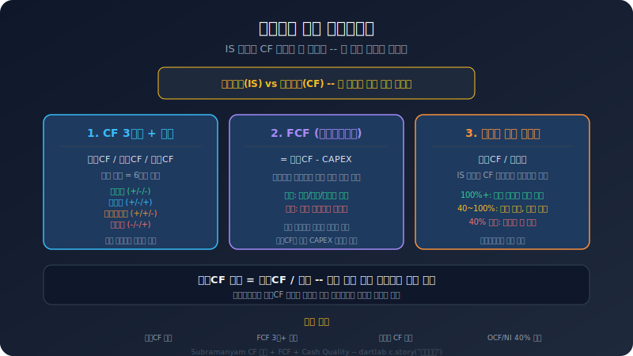
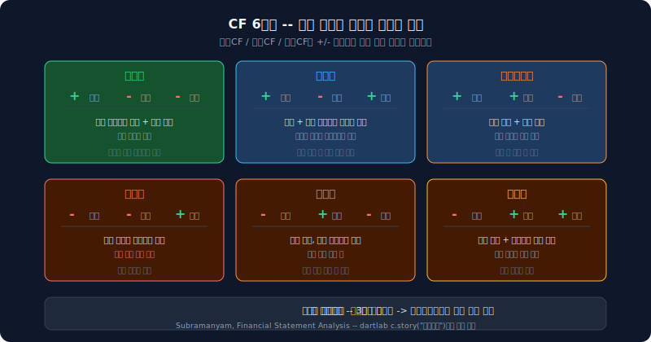
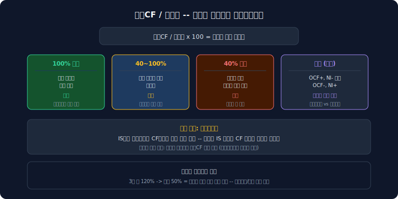
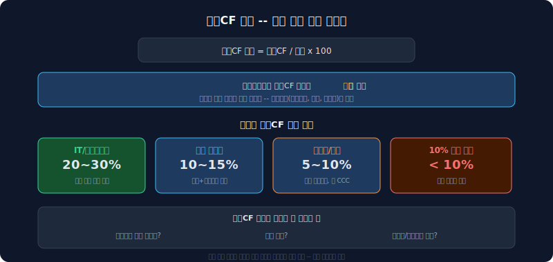

# 현금흐름 분석 — 손익계산서 이익과 현금흐름표 현금은 왜 다른가

손익계산서에서 흑자인 회사가 부도난다. 현금흐름표에서 영업CF가 적자인 회사가 배당을 한다. 이익과 현금은 다르다.

이유는 간단하다. 손익계산서는 **발생주의**로 작성된다. 물건을 팔면 아직 돈을 받지 않아도 매출로 잡힌다. 감가상각비는 비용으로 잡히지만 실제 현금 유출이 아니다. 현금흐름표는 **현금주의**다. 실제로 돈이 들어오고 나간 것만 기록한다. 이 차이가 "이익은 나지만 현금이 없는" 상황을 만든다.

이 글은 [자산 구조 분석](/blog/asset-structure-how-to-read)의 후속이다. 자산 구조에서 "조달한 돈이 어디에 묶여 있는가"를 봤다면, 여기서는 "그래서 실제로 현금은 얼마나 남았는가"를 본다.



---

## 현금흐름표의 세 구간

현금흐름표는 세 구간으로 나뉜다. 이 세 구간의 부호 조합이 회사의 현금 순환 구조를 말해준다.

| 구간 | 의미 | 양수일 때 | 음수일 때 |
|------|------|-----------|-----------|
| **영업활동(영업활동현금흐름)** | 본업에서 번 현금 | 사업이 현금을 만든다 | 본업에서 현금이 나가고 있다 |
| **투자활동(ICF)** | 설비/자산에 쓴 현금 | 자산 매각 또는 투자 회수 | 설비 투자, 자산 취득 |
| **재무활동(잉여현금흐름)** | 차입/상환/배당 | 외부에서 자금 유입 (차입, 유증) | 부채 상환, 배당 지급 |

영업CF가 양수이면 본업에서 현금이 들어온다. 투자CF가 음수이면 미래를 위해 투자하고 있다. 재무CF가 음수이면 빚을 갚거나 배당을 하고 있다.

중요한 것은 각 구간의 부호가 아니라 **세 구간의 조합**이다.

```python
import dartlab
c = dartlab.Company("005930")  # 종목코드만 바꾸면 어떤 회사든 동일
c.story("현금흐름")
```

위 명령 한 줄이면 CF 3구간 시계열, 잉여현금흐름 추이, 영업CF 마진, 이익의 현금 뒷받침 비율, CF 패턴 판정까지 한 번에 나온다.

---

## CF 패턴 — 부호 조합이 말하는 여섯 가지

세 구간의 부호(+/-)를 조합하면 여섯 가지 패턴이 나온다. Subramanyam의 *Financial Statement Analysis*에서 제시하는 분류법이다. 어떤 패턴이 좋고 나쁜 것이 아니라, 회사가 지금 어떤 단계에 있는지를 보여주는 지표다.



| 패턴 | 영업 | 투자 | 재무 | 의미 |
|------|------|------|------|------|
| **성숙형** | + | - | - | 본업 현금으로 투자도 하고 빚도 갚는다. 가장 건강한 구조 |
| **확장형** | + | - | + | 본업 현금 + 외부 자금으로 공격적 투자. 성장기 기업에 자연스럽다 |
| **구조조정형** | + | + | - | 자산을 매각하면서 부채 상환. 투자를 줄이고 재무 건전성 회복 중 |
| **위기형** | - | - | + | 영업 적자인데 빚으로 투자까지. 외부 자금 의존 심각 |
| **축소형** | - | + | - | 영업 적자, 자산 매각으로 부채 상환. 사업 축소 중 |
| **전환형** | - | + | + | 자산 매각 + 차입으로 영업 적자 보전. 위기 또는 사업 전환기 |

**성숙형**이 반드시 최선은 아니다. 성장기 기업이 성숙형이면 오히려 투자를 안 하고 있다는 뜻일 수 있다. 패턴 자체보다 **패턴의 변화**가 더 중요하다. 3년간 확장형이던 회사가 구조조정형으로 바뀌었다면, 투자 전략이 바뀌었거나 투자 여력이 소진된 것이다.

---

## 잉여현금흐름 — 자유현금흐름이 말하는 것

자유현금흐름(Free Cash Flow)은 영업CF에서 설비투자를 뺀 것이다.

```
FCF = 영업CF - CAPEX
```

본업에서 번 현금으로 필수 투자(설비 유지/확장)까지 감당하고 남는 돈이다. 이것이 양수여야 배당, 부채 상환, 추가 투자 여력이 생긴다.


- **잉여현금흐름 양수**: 본업으로 투자를 감당하고도 돈이 남는다. 이 돈으로 배당, 자사주 매입, 부채 상환이 가능하다
- **잉여현금흐름 음수**: 본업 현금으로 투자를 감당하지 못한다. 차입이나 유상증자로 부족분을 메워야 한다
- **잉여현금흐름 음수가 오래 지속**: 외부 자금 의존도가 누적된다. 차입 한도에 가까워지면 위험해진다

잉여현금흐름 음수가 반드시 나쁜 것은 아니다. 아마존도 수년간 잉여현금흐름 적자였고, 그 투자가 현재의 사업을 만들었다. 문제는 **기간**과 **추세**다. 3년 이상 잉여현금흐름 적자가 지속되면서 영업CF 자체도 줄어들고 있다면, 설비투자를 줄이지 않는 한 잉여현금흐름가 개선될 경로가 보이지 않는다.

예를 들어 삼성SDI(006400)는 2021년부터 2025년까지 5년 연속 잉여현금흐름 적자다. 배터리 공장에 매년 수천억~수조 원을 투자했는데, 영업CF가 이를 감당하지 못했다. 2025년에 설비투자를 전년 대비 70% 줄였지만 영업CF도 함께 줄어서 잉여현금흐름는 여전히 적자다.

---

## 영업CF/순이익 — 이익이 현금으로 뒷받침되는가

영업CF/순이익 비율은 손익계산서의 이익이 실제 현금으로 얼마나 전환되는지를 보여준다.



| 비율 | 해석 |
|------|------|
| **100% 이상** | 이익만큼(또는 그 이상) 현금이 들어왔다. 양호 |
| **40~100%** | 이익의 일부가 현금으로 전환되지 않았다. 매출채권 증가, 재고 증가 등 운전자본 변동 확인 필요 |
| **40% 미만** | 이익의 현금 뒷받침이 심각하게 부족하다. 이익의 질에 의문 |
| **음수 (영업활동현금흐름+, NI-)** | 순이익 적자지만 영업CF 양수. 감가상각비 같은 비현금 비용이 크다 |
| **음수 (영업활동현금흐름-, NI+)** | 흑자인데 현금이 나간다. 운전자본이 급증하거나 일시적 요인 |

**감가상각비**가 이 비율의 핵심 변수다. 대규모 설비를 보유한 기업은 감가상각비가 매년 수천억 원이다. 이 비용은 손익계산서에서 이익을 깎지만, 현금이 실제로 나가는 것은 아니다. 그래서 순이익이 적자여도 영업CF가 양수일 수 있다. 이것이 "손익계산서만 보면 적자, 현금흐름표를 보면 사업 자체는 현금을 벌고 있다"는 상황이다.

이 비율을 시계열로 봐야 한다. 3년 전에는 120%였는데 올해 50%라면, 이익이 현금으로 전환되는 비율이 악화되고 있다. 매출채권이 늘었는지, 재고가 쌓였는지, 선수금이 줄었는지를 확인하면 원인이 특정된다.

---

## 영업CF 마진 — 매출 대비 현금 창출력

영업CF 마진은 매출 100원당 실제로 남는 현금이다.

```
영업CF 마진 = 영업CF / 매출 * 100
```



영업이익률과 영업CF 마진의 차이가 크다면, 이익의 상당 부분이 현금으로 전환되지 않고 있다는 뜻이다. 매출채권, 재고, 선급금 등 운전자본에 현금이 묶이고 있을 가능성이 높다.

영업CF 마진이 10% 미만이면 현금 창출력이 약해진 것이다. 특히 설비투자가 큰 산업에서 영업CF 마진이 낮으면, 잉여현금흐름가 구조적으로 적자가 될 수밖에 없다.

업종별 기준이 다르다. IT/소프트웨어는 영업CF 마진이 20~30%도 흔하다. 자본이 적게 드는 사업 구조이기 때문이다. 제조업은 10~15%, 중공업/건설은 5~10% 수준이 일반적이다. 같은 업종 내에서 경쟁사 대비 추세를 비교하는 것이 핵심이다.

---

## 현금흐름에서 경고 신호를 읽는 법

현금흐름 분석에서 주의해야 할 패턴들이 있다.

1. **영업CF 적자**: 본업에서 현금이 나오지 않는다. 가장 기본적인 위험 신호. 1~2분기 일시적 적자는 있을 수 있지만, 연간 기준 영업CF 적자는 사업 자체의 현금 창출 능력에 문제가 있다
2. **잉여현금흐름 적자 장기화**: 3년 이상 잉여현금흐름 적자가 지속되면 외부 자금 의존도가 누적된다. [자금 구조](/blog/revenue-structure-how-to-read)에서 차입 비중이 함께 올라가고 있는지 교차 확인
3. **위기형/축소형 CF 패턴**: 영업CF 적자 상태에서 차입으로 버티는 구조. 지속 가능성에 심각한 의문
4. **영업CF 3년 연속 감소**: 절대액이 계속 줄어드는 추세. 매출 둔화와 함께 나타나면 구조적 문제
5. **영업CF/순이익 40% 미만**: 이익이 현금으로 전환되지 않고 있다. 이익의 질에 의문. 매출채권, 재고 급증 확인
6. **영업CF 마진 급락**: 매출은 유지되는데 현금 창출력이 떨어지면 운전자본 효율 악화

이런 신호들은 단독으로 보면 안 된다. 현금흐름은 [수익 구조](/blog/revenue-structure-how-to-read), [자금 구조](/blog/revenue-structure-how-to-read), [자산 구조](/blog/asset-structure-how-to-read)와 함께 봐야 완성된다. 영업CF가 줄어드는 원인이 매출 자체의 문제인지(수익 구조), 운전자본 효율의 문제인지(자산 구조), 아니면 일시적 요인인지를 구분해야 한다.

---

## dartlab의 현금흐름 분석은 무엇을 보여주는가

```python
import dartlab
c = dartlab.Company("005930")
c.story("현금흐름")
```

이 명령은 세 가지를 보여준다.

1. **CF 3구간 + 잉여현금흐름**: 영업CF, 투자CF, 재무CF, 설비투자, 잉여현금흐름를 5년 시계열로. 각 연도의 CF 패턴(성숙형/확장형/구조조정형 등) 판정 포함
2. **이익의 현금 뒷받침**: 영업CF, 순이익, 매출, 영업CF/순이익 비율, 영업CF 마진을 5년 시계열로
3. **현금흐름 경고 신호**: 영업CF 적자, 잉여현금흐름 적자, 위기형 패턴, 3년 연속 감소 등 자동 감지

개별 계산 함수를 직접 쓸 수도 있다.

```python
from dartlab.analysis.strategy.cashflow import (
    calcCashFlowOverview,
    calcCashQuality,
    calcCashFlowFlags,
)
overview = calcCashFlowOverview(c)  # CF 3구간 + FCF + 패턴
quality = calcCashQuality(c)        # 영업CF/순이익, 영업CF 마진
flags = calcCashFlowFlags(c)        # 경고 신호
```

---

## 시리즈 안내

이 글은 **숫자 뒤 맥락 읽기** 시리즈의 한 편이다. 같은 프레임워크를 구조별로 적용한다.

- [수익 구조 읽기](/blog/revenue-structure-how-to-read) — 무엇으로 돈을 버는가
- [자산 구조 읽기](/blog/asset-structure-how-to-read) — 조달한 돈이 어디에 묶여 있는가
- **현금흐름 읽기** — 실제로 현금은 어떻게 흘렀는가 (이 글)

수익 구조에서 "무엇으로 버는가"를, 자산 구조에서 "돈이 어디에 묶여 있는가"를 봤다. 이 글에서는 "그래서 현금은 실제로 남는가"를 봤다. 세 편을 이어 읽으면 재무 3표(IS/BS/CF)를 관통하는 하나의 이야기가 완성된다.

---

<details>
<summary>FAQ</summary>

**Q. 잉여현금흐름 적자가 몇 년이면 심각한 건가?**

일률적인 기준은 없다. 성장기 기업에서 2~3년 잉여현금흐름 적자는 흔하다. 핵심은 영업CF가 개선되고 있는지, 설비투자 투자가 매출 성장으로 이어지고 있는지다. 5년 이상 잉여현금흐름 적자가 지속되면서 영업CF도 감소 추세라면, 외부 자금 의존이 구조화된 것이므로 주의해야 한다. 차입 한도, 이자보상배율, 유동비율을 함께 확인한다.

**Q. 순이익 적자인데 영업CF 양수가 가능한 이유는?**

감가상각비 때문이다. 감가상각비는 손익계산서에서 비용으로 잡히지만, 현금이 실제로 나가지 않는다. 대규모 설비를 보유한 기업은 감가상각비가 수천억 원이다. 이 비현금 비용이 순이익에서는 적자를 만들지만, 현금흐름에서는 영업CF를 양수로 유지시킨다.

**Q. 확장형 패턴이 오래 지속되면 괜찮은 건가?**

확장형(+/-/+)은 외부 자금을 동원해 적극 투자하는 패턴이다. 성장기에 자연스럽지만, 오래 지속되면 부채가 누적된다. 확장형이 3년 이상 계속되면 차입 비중, 이자보상배율, 잉여현금흐름 추이를 반드시 확인한다. 투자한 자산이 매출로 전환되기 시작하면 성숙형으로 이동해야 정상이다.

**Q. dartlab에서 다른 회사도 같은 분석을 할 수 있나?**

```python
import dartlab
c = dartlab.Company("373220")  # 종목코드만 바꾸면 됨
c.story("현금흐름")
```

어떤 상장사든 종목코드만 넣으면 동일한 CF 3구간, 잉여현금흐름, 영업CF 마진, CF 패턴 판정을 볼 수 있다.

</details>
