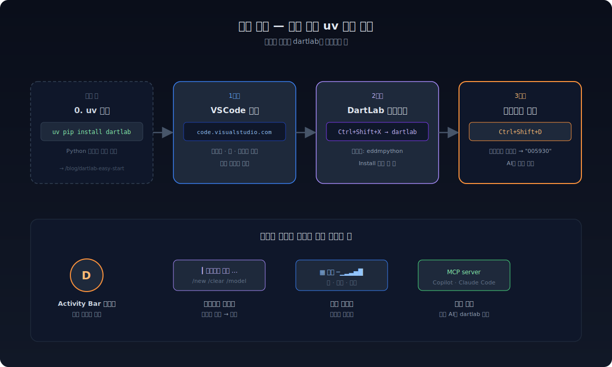
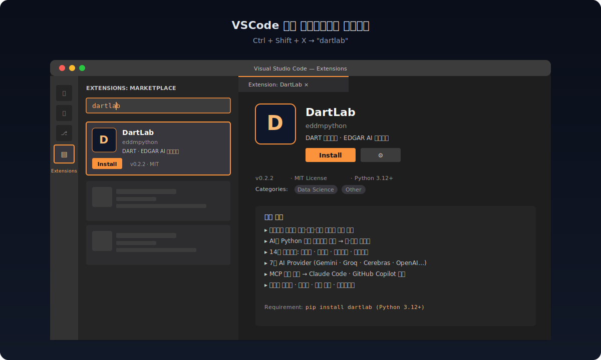
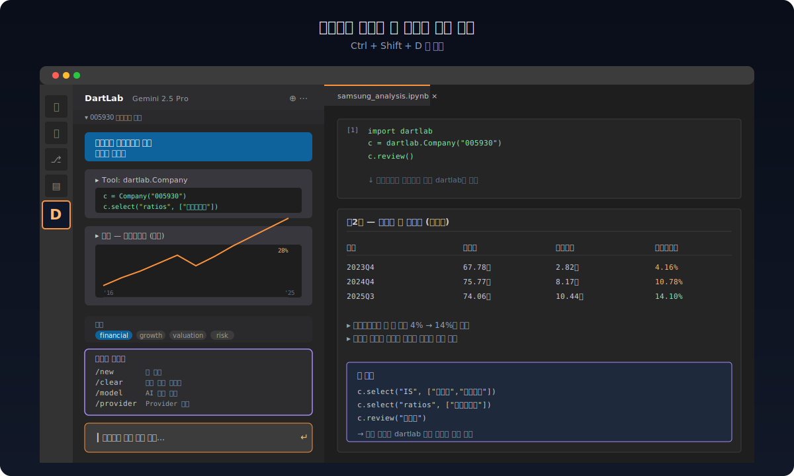
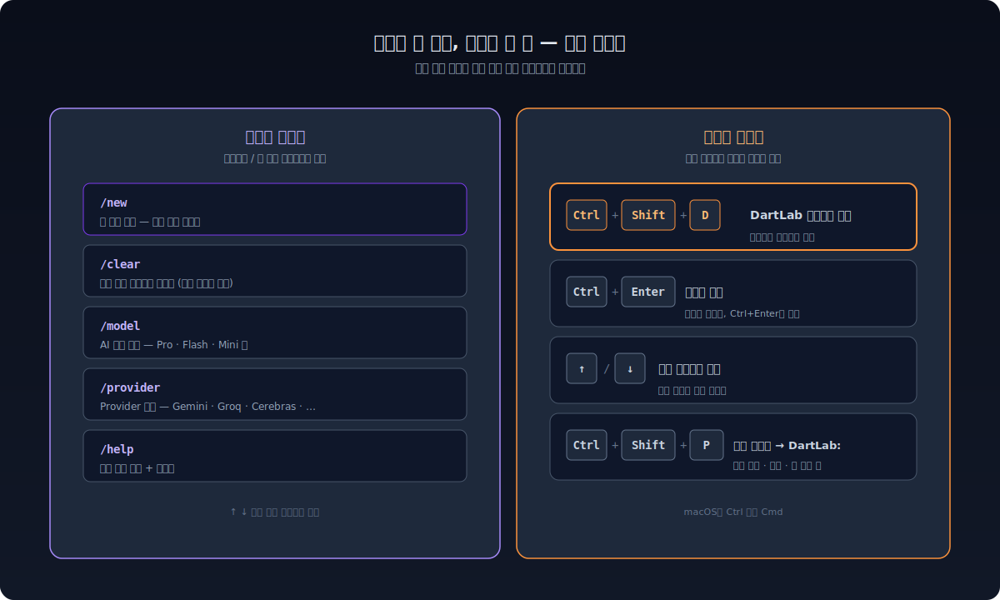

<script>
import YouTube from '$lib/components/YouTube.svelte';
</script>

**[지난 글](/blog/dartlab-easy-start)에서 uv로 dartlab을 설치했다.** 이번에는 VSCode 익스텐션이다. 터미널을 열지 않아도 된다. VSCode 사이드바에 채팅창이 뜨고, 종목코드 하나만 입력하면 AI가 재무제표·공시·14축 분석까지 화면 안에서 다 보여준다.

<YouTube id="B_DdM3Mcpt4" shorts title="dartlab VSCode 익스텐션 설치 안내" />



---

## 왜 익스텐션인가

지금까지 dartlab은 터미널에서 `python`이나 `uv run python`으로 돌리는 도구였다. 코드를 한 줄씩 짜고, 결과를 터미널에서 보고, 차트를 따로 띄우고. 익숙한 사람에겐 빠르지만, **처음 시작하는 사람에겐 진입장벽이 있다**.

VSCode 익스텐션은 그 벽을 없앤다.

- **사이드바 채팅창** — Cursor나 Claude Code처럼, 종목코드/질문을 자연어로 입력
- **AI가 코드 짜고 실행** — Python을 몰라도 됨. AI가 dartlab 함수를 알아서 호출
- **결과가 그 자리에서 — 표·차트·공시 링크가 채팅창 안에 바로 렌더링
- **MCP 자동 등록** — Claude Code, GitHub Copilot에서도 dartlab 도구가 그대로 보임

uv 설치까지 끝낸 사람에겐 **자연스러운 다음 단계**다. 터미널은 그대로 살아 있고, 익스텐션이 그 위에 클릭 가능한 인터페이스를 한 겹 얹는다.

---

## 1단계 — VSCode 설치 (이미 있으면 스킵)

VSCode가 없으면 먼저 설치한다. 무료다.

- **Windows / macOS / Linux**: [code.visualstudio.com](https://code.visualstudio.com/)
- 다운로드 → 더블클릭 → 다음 → 끝. 별도 설정 필요 없음.

이미 VSCode를 쓰고 있으면 다음 단계로.

---

## 2단계 — DartLab 익스텐션 설치

VSCode에서 익스텐션을 설치하는 방법은 두 가지다.

### 방법 A — VSCode 안에서 검색

1. VSCode 왼쪽 Activity Bar에서 **확장(Extensions)** 아이콘 클릭 (또는 `Ctrl+Shift+X`)
2. 검색창에 **`dartlab`** 입력
3. **DartLab** (게시자: eddmpython) 선택 → **Install** 클릭



### 방법 B — 마켓플레이스 페이지에서

[marketplace.visualstudio.com/items?itemName=eddmpython.dartlab](https://marketplace.visualstudio.com/items?itemName=eddmpython.dartlab) 페이지에서 **Install** 버튼을 누르면 VSCode가 자동으로 열리면서 설치된다.

설치가 끝나면 VSCode를 다시 시작할 필요는 없다. Activity Bar에 **DartLab 아이콘**이 새로 생긴다.

---

## 3단계 — Python 패키지 확인

[지난 글](/blog/dartlab-easy-start)에서 uv로 `dartlab`을 이미 설치했다면 이 단계는 건너뛴다. 안 했으면 터미널에서 한 줄:

```bash
uv pip install dartlab
```

또는 일반 pip을 쓴다면:

```bash
pip install dartlab
```

익스텐션은 시스템에 설치된 dartlab Python 패키지를 자동으로 찾아 쓴다. 가상환경(`.venv`)이 있으면 우선 사용한다. **요구사항: Python 3.12+**.

---

## 4단계 — 첫 실행: 종목코드 하나 입력

1. Activity Bar의 **DartLab 아이콘** 클릭 (또는 `Ctrl+Shift+D`)
2. 사이드바에 채팅창이 뜬다
3. **AI Provider 선택** — 처음 한 번만. 무료 옵션 추천:
   - **Gemini** — Google AI Studio에서 무료 키 발급
   - **Groq** — 무료 티어 6K~30K TPM
   - **Cerebras** — 1M tokens/day 무료
4. 입력창에 종목코드 또는 질문 입력:

```
삼성전자 재무건전성 분석해줘
```

```
005930 최근 공시 변화 알려줘
```

```
SK하이닉스랑 삼성전자 영업이익률 비교해줘
```

AI가 dartlab 함수를 알아서 호출하고, 결과를 표·차트로 채팅창에 그려준다. **Python 한 줄 안 짜고 끝난다.**



---

## 슬래시 커맨드 — 한 글자로 빠르게

채팅창에서 슬래시(`/`)를 치면 자주 쓰는 명령이 자동완성된다.

| 명령 | 동작 |
|---|---|
| `/new` | 새 대화 시작 |
| `/clear` | 현재 대화 비우기 |
| `/model` | AI 모델 변경 |
| `/provider` | AI Provider 변경 |
| `/help` | 도움말 |

키보드 단축키도 있다.

| 단축키 | 동작 |
|---|---|
| `Ctrl+Shift+D` | DartLab 사이드바 열기 |
| `↑` / `↓` | 이전/다음 입력 히스토리 |
| `Ctrl+Enter` | 메시지 전송 |



---

## AI Provider — 어떤 걸 고를까

dartlab 익스텐션은 7개 Provider를 지원한다. 처음 시작이라면 **무료 키부터** 추천한다.

| Provider | 무료 티어 | 특징 |
|---|---|---|
| **Gemini** | Gemini 2.5 Pro/Flash 무료 | 분석·코드 생성 균형 |
| **Groq** | 6K~30K TPM 무료 | LLaMA 3.3 70B, 매우 빠름 |
| **Cerebras** | 1M tokens/day 무료 | LLaMA 3.3 70B, 빠름 |
| **Mistral** | 1B tokens/month 무료 | Mistral Small |
| OpenAI | 유료 | GPT-4o |
| ChatGPT | OAuth 로그인 | 구독 계정 사용 |
| Ollama | 로컬 실행 | 인터넷 불필요 |

키 발급 → 익스텐션 설정에 붙여넣기 → 끝. 익스텐션이 키 발급 페이지로 직접 연결해 준다.

---

## MCP 자동 등록 — Claude Code/Copilot에서도 같이

DartLab 익스텐션은 설치되는 순간 **MCP 서버로 자동 등록**된다. 이게 무슨 뜻이냐면:

- VSCode의 **GitHub Copilot Chat**에서 "삼성전자 재무 분석해줘"라고 물으면 → Copilot이 dartlab MCP 도구를 호출 → 같은 결과
- **Claude Code**(터미널 또는 VSCode 확장)에서도 동일하게 dartlab 도구가 보임
- 다른 MCP 호환 클라이언트에서도 자동 인식

같은 dartlab을 **여러 AI 클라이언트가 공유**한다. 한 곳에 설치하면 어디서든 쓴다.

---

## 진단이 안 될 때

설치는 됐는데 채팅이 안 뜨면 우선 두 가지를 본다.

1. **`Ctrl+Shift+P` → `DartLab: 진단 정보`** — Python 경로, dartlab 버전, 서버 상태를 한 번에 표시
2. **`Ctrl+Shift+P` → `DartLab: Show Logs`** — 로그에서 에러 메시지 확인

가장 흔한 원인:
- Python 3.12 미만 (3.11에서는 안 됨) → `python --version`으로 확인
- dartlab 패키지 미설치 → `pip show dartlab`
- 가상환경 인식 실패 → VSCode에서 인터프리터를 직접 선택 (`Ctrl+Shift+P → Python: Select Interpreter`)

해결이 안 되면 [GitHub Issues](https://github.com/eddmpython/dartlab/issues)에 진단 정보를 붙여서 올리면 된다.

---

## 다음 — 익스텐션으로 뭐부터 해볼까

설치가 끝났으면 곧바로 다음 글로 가서 실제로 써본다. 익스텐션 채팅창에 그대로 따라 입력해도 된다.

- **[전 종목 횡단 분석](/blog/scan-market-finance)** — `dartlab.scan`으로 2,700개 종목을 한 줄에
- **[종목코드 하나로 기업 전체](/blog/company-one-stock-code)** — `dartlab.Company`가 여는 14축 분석
- **[모델 없이 공시 검색](/blog/search-without-embeddings)** — `dartlab.search`로 400만 공시에서 165ms 만에 결과

VSCode 채팅창에 "삼성전자 매출 추이 차트로 보여줘"라고 한 번만 쳐보면, 위 글들이 무슨 말을 하는지 즉시 체감된다. **터미널 없이, Python 코드 없이, 클릭 한 번으로** 시작하는 게 익스텐션의 핵심이다.
