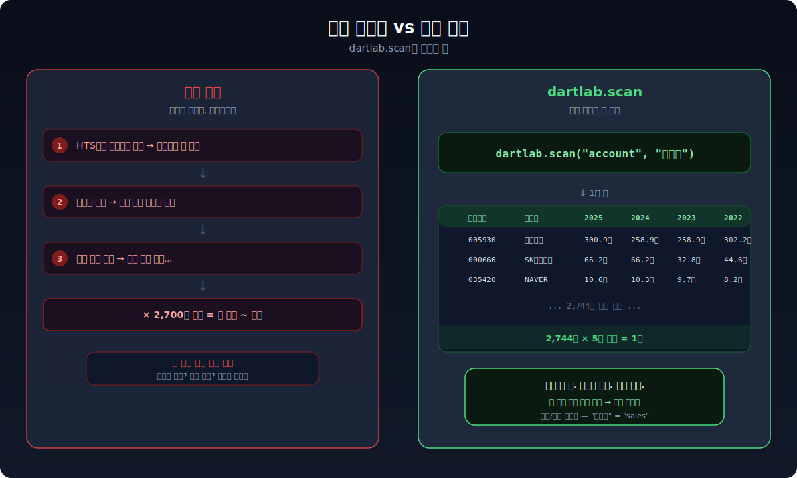
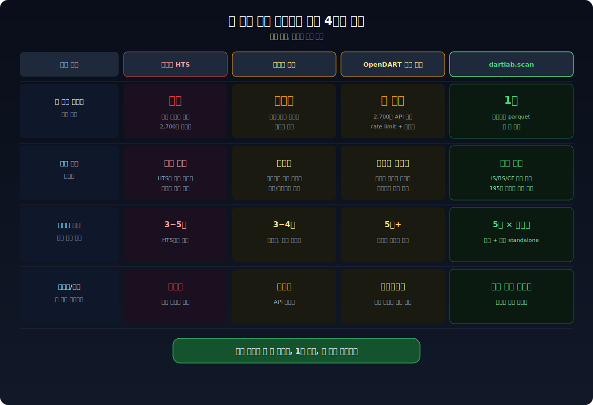
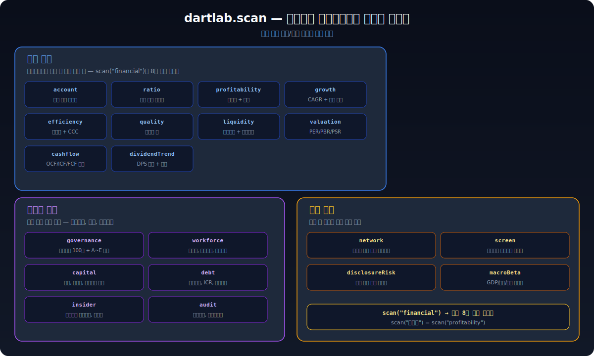

**삼성전자 매출액은 네이버에서 30초면 본다.** 그런데 전 상장사 2,700개 종목의 매출액을 한 화면에 보려면? 지금까지 방법이 없었다. dartlab.scan은 이 문제를 해결한다. Python 한 줄이면 시장 전체의 재무 데이터가 테이블 하나로 펼쳐진다.



---

## 왜 전 종목 재무 데이터를 한번에 못 봤나

주식 투자를 하면서 이런 경험이 있을 것이다.

"**ROE가 높은 종목을 찾고 싶다.**" 네이버 증권에서 종목을 하나 검색하고, 재무 탭을 열고, ROE를 확인하고, 뒤로 가서 다른 종목을 검색하고... 이걸 2,700번 반복할 수는 없다.

"**전 종목의 매출액 추이를 비교하고 싶다.**" 증권사 HTS에는 종목별 재무제표가 있다. 하지만 "모든 종목의 매출액을 한 테이블에 나란히"는 지원하지 않는다. 스크리너가 있긴 하지만, 임의의 계정을 골라서 시계열로 뽑을 수는 없다.

"**그러면 OpenDART API를 직접 호출하면 되지 않나?**" 이론적으로는 가능하다. 실제로 해보면 — 종목당 API 1회, 2,700개 종목이면 2,700회 호출, rate limit에 걸리고, 계정명이 기업마다 다르고, 연결/별도 재무제표를 구분해야 하고, 분기별 standalone 계산이 필요하고... 반나절 작업이다. 그리고 다음 분기에 또 해야 한다.

핵심은 이것이다: **시장 전체를 한 장의 테이블로 펼치는 도구가 없었다.**



---

## scan이 해결한다 — 한 줄이면 시장 전체가 보인다

```python
import dartlab

# 전 상장사 매출액 시계열
dartlab.scan("account", "매출액")
```

이 한 줄이 반환하는 것:

| 종목코드 | 종목명 | 2025 | 2024 | 2023 | 2022 | 2021 |
|---------|--------|------|------|------|------|------|
| 005930 | 삼성전자 | 300.9조 | 258.9조 | 258.9조 | 302.2조 | 279.6조 |
| 000660 | SK하이닉스 | 66.2조 | 66.2조 | 32.8조 | 44.6조 | 42.9조 |
| 035420 | NAVER | 10.6조 | 10.3조 | 9.7조 | 8.2조 | 6.8조 |
| ... | ... | ... | ... | ... | ... | ... |

2,744개 종목. 5개 연도. **1초.**

비율도 같은 방식이다.

```python
# 전 종목 ROE
dartlab.scan("ratio", "roe")

# 전 종목 부채비율
dartlab.scan("ratio", "debtRatio")

# 전 종목 영업이익률
dartlab.scan("ratio", "operatingMargin")
```

무엇이 가능한지 모르겠으면 가이드를 호출한다.

```python
# 축 목록 + 사용법 안내
dartlab.scan()

# 가용 계정 목록 (매출액, 영업이익 등)
dartlab.scan("account")

# 가용 비율 목록 (ROE, 부채비율 등)
dartlab.scan("ratio")
```

한글과 영문 모두 된다. `scan("account", "매출액")`과 `scan("account", "sales")`는 같은 결과를 반환한다.

---

## 계정부터 거버넌스까지 — 시장 전체를 읽는다

scan은 단순히 계정 하나를 뽑는 기능이 아니다. 수익성, 성장성, 부채, 거버넌스, 현금흐름, 공시 리스크까지 시장 전체를 읽는다.



### 재무 수치

재무제표에서 뽑을 수 있는 모든 것.

```python
dartlab.scan("account", "매출액")        # 임의 계정의 전종목 시계열
dartlab.scan("ratio", "roe")             # 임의 비율의 전종목 시계열
dartlab.scan("profitability")            # 영업이익률/순이익률/ROE/ROA + 등급
dartlab.scan("growth")                   # 매출/영업이익/순이익 CAGR + 성장 패턴
dartlab.scan("efficiency")               # 자산/재고/매출채권 회전율 + CCC
dartlab.scan("quality")                  # 발생액비율 + CF/NI — 이익이 진짜인지
dartlab.scan("liquidity")               # 유동비율 + 당좌비율
dartlab.scan("valuation")               # PER/PBR/PSR + 시가총액
dartlab.scan("cashflow")                # OCF/ICF/FCF + 현금흐름 패턴 8종
dartlab.scan("dividendTrend")           # DPS 3개년 추이 + 패턴
```

재무 축을 한번에 가이드로 보려면:

```python
dartlab.scan("financial")               # 재무 8축 가이드
dartlab.scan("financial", "수익성")      # 그룹 내 특정 축 실행
```

### 비재무 구조

숫자 뒤에 있는 구조를 본다.

```python
dartlab.scan("governance")              # 지배구조 100점 + A~E 등급
dartlab.scan("workforce")              # 직원수, 평균급여, 인건비율
dartlab.scan("capital")                # 배당, 자사주, 증자/감자 — 주주환원 분류
dartlab.scan("debt")                   # 사채만기, 부채비율, ICR, 위험등급
dartlab.scan("insider")                # 최대주주 지분변동, 경영권 안정성
dartlab.scan("audit")                  # 감사의견, 감사인변경, 특기사항
```

### 시장 관계

기업 간 관계와 시장 수준 신호.

```python
dartlab.scan("network")                # 상장사 전체 관계 네트워크 (출자/계열)
dartlab.scan("screen", "value")        # 멀티팩터 스크리닝 프리셋
dartlab.scan("disclosureRisk")         # 공시 변화 기반 선행 리스크 감지
dartlab.scan("macroBeta")             # GDP/금리/환율 민감도 횡단면
```

**한글/영문 양방향.** `scan("수익성")`과 `scan("profitability")`는 같은 결과다. `scan("거버넌스")`, `scan("지배구조")`, `scan("governance")` 모두 같다.

---

## 1초의 비밀 — 프리빌드 parquet과 XBRL 정규화

"2,700개 종목을 1초에 어떻게?" 비밀은 세 가지다.


### 1. 프리빌드 parquet — 2,744개 종목을 한 파일로

dartlab은 전 상장사의 재무제표를 **하나의 파일**(finance.parquet, 197MB)로 미리 합산해둔다. 이 파일은 GitHub Actions가 매주 자동으로 빌드해서 [HuggingFace](https://huggingface.co/datasets/eddmpython/dartlab-data)에 배포한다.

`scan("account", "매출액")`을 실행하면, 2,744개 종목 파일을 하나하나 여는 게 아니라 이 **합산 파일 하나에서 필터**한다. 개별 파일 2,744개를 순차로 열면 수 분이 걸리는데, 합산 파일에서 필터하면 1초다.

프리빌드 파일이 없으면? dartlab은 자동으로 HuggingFace에서 다운로드한다. 그래도 없으면 개별 종목 parquet을 ThreadPool 8개로 병렬 처리하는 fallback이 동작한다.

### 2. XBRL 정규화 — "매출액"이 100가지 이름을 가진 문제

한국 상장사들이 DART에 제출하는 재무제표는 XBRL이라는 표준 형식을 쓴다. 문제는 같은 "매출액"이 기업마다 다른 태그명으로 기록된다는 것이다.

| 기업 | 태그 | 실제 의미 |
|------|------|----------|
| 삼성전자 | `ifrs-full_Revenue` | 매출액 |
| SK하이닉스 | `dart_매출액` | 매출액 |
| 현대차 | `RevenueFromContractsWithCustomers` | 매출액 |

dartlab의 AccountMapper가 이 문제를 해결한다. **195개 한글 동의어**와 **89개 영문 동의어**를 매핑해서, 사용자가 "매출액"이라고 입력하면 모든 변형을 자동으로 찾는다. `scan("account", "매출액")`이 모든 종목에서 동작하는 이유다.

### 3. Polars lazy scan — Rust가 필요한 행만 읽는다

dartlab은 pandas가 아니라 [Polars](https://pola.rs)를 쓴다. Polars는 Rust로 만들어진 데이터프레임 라이브러리로, **lazy evaluation**을 지원한다.

197MB 파일 전체를 메모리에 올리지 않는다. "IS(손익계산서)에서 매출액만 필터"라는 조건을 I/O 단계에 밀어넣어서, **필요한 행만** 디스크에서 읽는다. Rust의 네이티브 I/O 최적화 덕분에 이 과정이 극도로 빠르다.

---

## 실전 — 이걸로 뭘 할 수 있나

### ROE 상위 종목 찾기

```python
import dartlab

roe = dartlab.scan("ratio", "roe")
top50 = roe.sort("2024", descending=True).head(50)
print(top50)
```

2,700개 종목 중 ROE가 가장 높은 50개를 1초 만에 뽑는다. 같은 방식으로 `operatingMargin`, `debtRatio`, 아무 비율이나 바꿔 넣으면 된다.

### 거버넌스 등급 분포 보기

```python
gov = dartlab.scan("governance")
print(gov["등급"].value_counts())
```

전 상장사의 거버넌스 등급(A~E) 분포를 한눈에 본다. "A등급이 몇 개인지, E등급은 어디인지"를 1초 만에 확인할 수 있다. [거버넌스 점수가 무엇을 의미하는지](/blog/governance-red-flags)는 별도 글에서 다룬다.

### 매출 성장 + 이익의 질 교차 필터

```python
growth = dartlab.scan("growth")
quality = dartlab.scan("quality")

# 매출 CAGR 15% 이상이면서 발생액비율이 낮은 종목
fast_growers = growth.filter(growth["매출CAGR"] > 15)
good_quality = quality.filter(quality["발생액비율"].abs() < 5)

candidates = fast_growers.join(good_quality, on="종목코드")
print(candidates)
```

[수익 구조 분석](/blog/revenue-structure-how-to-read)에서 배운 매출 성장의 질을 시장 전체에서 스크리닝한다. 성장률이 높으면서 이익이 현금으로 뒷받침되는 종목만 걸러내는 것이다.

### 현금흐름 패턴으로 분류하기

```python
cf = dartlab.scan("cashflow")
print(cf["패턴"].value_counts())
```

dartlab은 [현금흐름 패턴](/blog/cashflow-how-to-read)을 8가지로 자동 분류한다. 영업CF 양수 + 투자CF 음수 + 재무CF 음수 = "건전한 성장형". 전 종목이 어떤 패턴에 속하는지 한눈에 볼 수 있다.

---

## 코드를 안 짜도 된다 — AI에게 물어보면 scan이 돌아간다

위에서 본 코드를 직접 짤 필요가 없다. dartlab의 AI 엔진은 scan을 도구로 쓴다. 사용자는 한국어로 질문만 하면 되고, AI가 어떤 scan 축을 호출할지 스스로 판단해서 실행한다.

```bash
uv run dartlab ask "ROE 높으면서 부채 낮은 종목 찾아줘"
```

AI가 뒤에서 하는 일:

1. `dartlab.scan("ratio", "roe")` 호출 — 전 종목 ROE를 뽑고
2. `dartlab.scan("ratio", "debtRatio")` 호출 — 전 종목 부채비율을 뽑고
3. 두 결과를 교차 필터링한 뒤
4. 결과를 해석해서 사용자에게 돌려준다

이게 위의 "매출 성장 + 이익의 질 교차 필터" 코드를 AI가 대신 짜서 실행하는 것이다. 질문을 바꾸면 AI가 다른 축을 골라서 조합한다.

```bash
uv run dartlab ask "거버넌스 A등급인데 배당도 꾸준한 종목은?"
```

→ AI가 `scan("governance")` + `scan("dividendTrend")`를 조합한다.

```bash
uv run dartlab ask "매출 성장률 상위 종목 중에서 현금흐름이 건전한 곳만"
```

→ AI가 `scan("growth")` + `scan("cashflow")`를 조합한다.

코드가 편하면 코드를 쓰고, 질문이 편하면 질문을 하면 된다. scan은 사용자가 직접 쓸 수도 있고, AI의 도구로 뒤에서 돌아갈 수도 있다.

dartlab이 아직 설치되어 있지 않다면 [정말 쉬운 dartlab 사용법](/blog/dartlab-easy-start)에서 5분 만에 설치할 수 있다.
