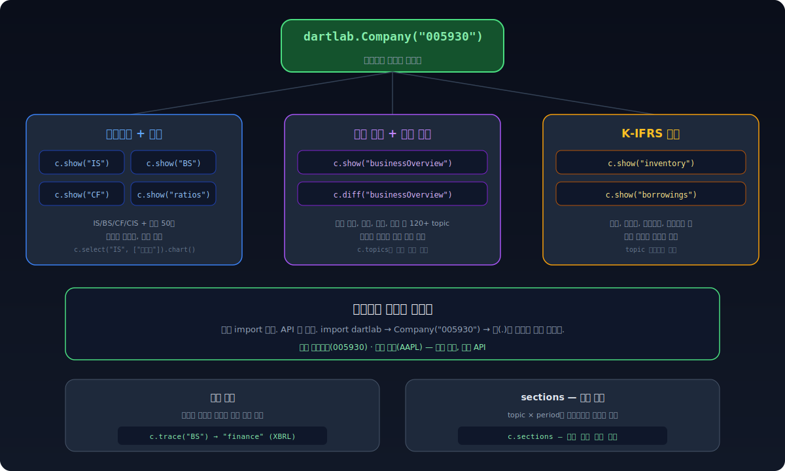
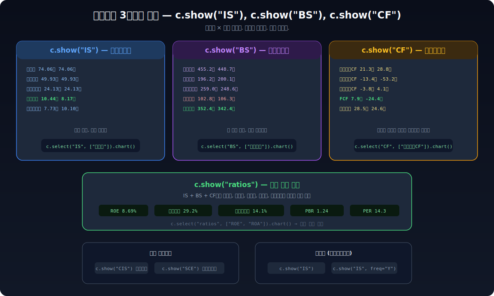
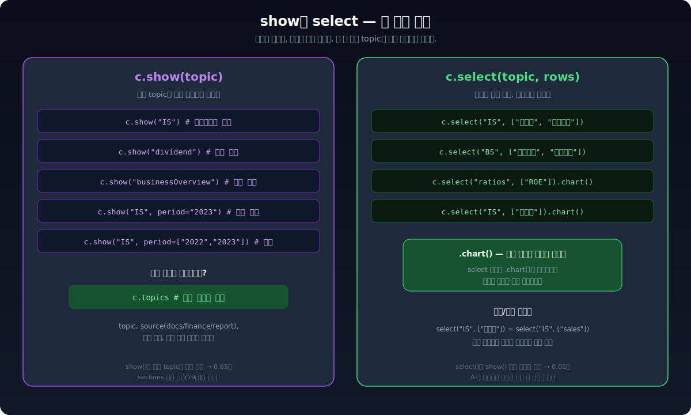

**삼성전자의 종목코드는 005930이다.** 이 여섯 자리를 dartlab에 넣으면 재무제표, 사업보고서 원문, 비율 50개, K-IFRS 주석, 기간간 변경 이력까지 전부 꺼낼 수 있다. 추가 import 없다. API 키 없다. 종목코드 하나면 끝이다.



---

## 6자리 숫자 하나로 회사 전체가 열린다

```python
import dartlab

c = dartlab.Company("005930")  # 삼성전자
```

이 한 줄이 반환하는 객체 `c`가 삼성전자의 모든 공시 데이터에 대한 진입점이다. `c` 뒤에 점(.)을 찍으면 재무제표, 비율, 사업보고서, 주석까지 전부 나온다.

미국 기업도 같은 방식이다. 종목코드 대신 티커를 넣으면 된다.

```python
c = dartlab.Company("AAPL")   # Apple
c = dartlab.Company("MSFT")   # Microsoft
```

한국이든 미국이든, 사용법은 완전히 동일하다.

---

## 재무제표 — 3줄이면 IS, BS, CF 전부

```python
c.show("IS")   # 손익계산서 — 매출, 영업이익, 순이익
c.show("BS")   # 재무상태표 — 자산, 부채, 자본
c.show("CF")   # 현금흐름표 — 영업/투자/재무 현금흐름
```

각각이 **계정명 × 기간** 테이블로 돌아온다. 기간은 분기별 시계열이다.

```
              account     2025Q3      2025Q2      2024Q4      2024Q2  ...
0              매출액   74.06조     74.06조     75.77조     74.07조
1           매출원가   49.93조     49.93조     52.39조     50.87조
2         매출총이익   24.13조     24.13조     23.38조     23.20조
3           영업이익   10.44조     10.44조      8.17조      9.18조
...
```

포괄손익계산서(`c.show("CIS")`)와 자본변동표(`c.show("SCE")`)도 같은 방식으로 접근한다.



---

## 비율 50개 — 자동 계산, 시계열로

```python
c.show("ratios")
```

이것 하나로 수익성, 안정성, 성장성, 효율성, 밸류에이션 비율이 분기별 시계열로 나온다. 자기자본수익률, 부채비율, 영업이익률, 자산회전율, PER, PBR 같은 지표를 직접 계산할 필요가 없다.

특정 비율만 뽑아서 차트까지 그릴 수 있다.

```python
c.select("ratios", ["ROE"]).chart()          # ROE 추이 차트
c.select("ratios", ["ROE", "ROA"]).chart()   # ROE + ROA 비교
```

---

## show — 사업보고서부터 배당까지, 뭐든 꺼낸다

재무제표는 숫자다. 하지만 기업을 이해하려면 **텍스트**도 봐야 한다. "이 회사가 뭘 하는 회사인지", "임원이 누구인지", "배당 정책이 어떤지". 이런 건 사업보고서에 있다.

`c.show()`가 이 모든 걸 꺼낸다.

```python
c.show("businessOverview")     # 사업의 내용
c.show("dividend")             # 배당 정보
c.show("boardOfDirectors")     # 임원 현황
c.show("employee")             # 직원 현황
c.show("majorShareholder")     # 최대주주
```

120개 이상의 topic이 있다. 뭐가 있는지 모르겠으면:

```python
c.topics   # 전체 데이터 지도 — topic, source, 기간, 블록 수
```

기간 필터도 된다.

```python
c.show("IS", period="2023")                    # 2023년만
c.show("IS", period=["2022", "2023"])          # 2022 vs 2023 나란히
```

---

## select — 원하는 행만 뽑고, 차트까지

show가 전체를 보여준다면, select는 **필요한 행만** 뽑는다.

```python
c.select("IS", ["매출액", "영업이익"])            # 매출과 영업이익만
c.select("BS", ["자산총계", "부채총계"])          # 자산과 부채만
c.select("IS", ["매출액"]).chart()               # 매출 추이 차트
```



한글과 영문 모두 된다. `select("IS", ["매출액"])`과 `select("IS", ["sales"])`는 같은 결과다. 미국 기업에서 `select("IS", ["매출액"])`을 쓰면 자동으로 해당 영문 계정을 찾는다.

---

## diff — 지난 분기 대비 뭐가 바뀌었나

사업보고서는 매 분기 제출된다. 그런데 **어디가 바뀌었는지** 찾으려면 두 문서를 나란히 놓고 눈으로 비교해야 한다. dartlab이 이걸 자동으로 한다.

```python
c.diff()                          # 전체 변경 요약 — 어떤 topic이 바뀌었는지
c.diff("businessOverview")        # 사업 개요의 변경 이력
```

"사업의 내용"에서 새로운 사업 계획이 추가됐거나, "위험 요인"이 바뀌었거나, 임원이 교체됐으면 diff가 잡아낸다. 공시 텍스트의 변화는 종종 숫자보다 먼저 신호를 보낸다. [사업보고서 텍스트가 왜 중요한지](/blog/reading-business-reports)는 별도 글에서 다뤘다.

---

## notes — K-IFRS 주석을 테이블로

재무제표의 총액만으로는 안 보이는 것이 있다. "재고자산 1조"라고 적혀 있어도, 그게 상품인지 원재료인지 미착품인지 모른다. 이 분해가 K-IFRS 주석에 있다.

```python
c.show("inventory")        # 재고자산 분해 (상품/제품/원재료/미착품)
c.show("borrowings")       # 차입금 분해 (단기/장기, 이자율)
c.show("tangibleAsset")    # 유형자산 변동 (카테고리별 기초/기말)
c.show("segments")         # 부문정보 (부문별 매출/이익)
c.show("receivables")      # 매출채권 (대손충당금 포함)
c.show("costByNature")     # 비용 성격별 분류 (원재료/급여/감가상각)
```

한글로도 접근 가능하다.

```python
c.show("inventory")        # 재고자산
c.show("borrowings")       # 차입금
```

뭐가 있는지 모르겠으면 `c.topics`에서 topic 목록을 확인한다.

---

## trace — 이 숫자가 어디서 왔는지

dartlab은 하나의 topic에 대해 여러 데이터 소스(docs, finance, report)를 갖고 있다. 재무상태표는 finance에서 오고, 사업 개요는 docs에서 온다. `trace`는 **지금 보고 있는 데이터가 어디서 왔는지** 알려준다.

```python
c.trace("BS")              # → finance (XBRL 재무제표에서 가져옴)
c.trace("dividend")        # → report (정기보고서 구조화 데이터)
c.trace("businessOverview") # → docs (사업보고서 원문)
```

숫자가 이상할 때, 출처를 확인하면 원인을 찾기 쉽다.


---

## sections — 사업보고서 전체 지도

Company의 근간은 **sections**다. 사업보고서의 모든 항목(topic)을 기간(period)별로 정리한 표다.

```python
c.sections
```

```
              topic        2025Q3           2025Q2           2024Q4  ...
0   companyOverview   회사의 개요...     회사의 개요...     회사의 개요...
1  businessOverview   사업의 내용...     사업의 내용...     사업의 내용...
2              mdna   경영진단 및...     경영진단 및...     경영진단 및...
...
```

같은 항목이 기간별로 나란히 놓여 있으니, **어떤 기간이든 비교 가능**하다. 2022년 사업 개요와 2024년 사업 개요를 나란히 보고 뭐가 바뀌었는지 확인할 수 있다. dartlab이 "모든 기간은 비교 가능해야 한다"는 전제 위에 만들어진 이유다.

> sections는 전체 데이터를 통합 로드하므로 메모리를 많이 쓴다. 특정 항목만 볼 때는 `c.show(topic)`이 훨씬 빠르다.

---

## 코드를 안 짜도 된다 — AI에게 물어보면 Company가 돌아간다

위의 모든 걸 직접 코드로 할 수 있지만, AI에게 질문만 해도 된다. dartlab의 AI 엔진은 Company를 도구로 쓴다.

```bash
uv run dartlab ask "삼성전자 재무건전성 분석해줘"
```

AI가 뒤에서 하는 일:

1. `dartlab.Company("005930")` — 삼성전자 Company 객체 생성
2. `c.show("IS")`, `c.show("BS")`, `c.show("CF")` — 재무제표 꺼내기
3. `c.show("ratios")` — 비율 계산
4. `c.show("borrowings")` — 차입금 주석 확인
5. 전부 종합해서 재무건전성을 판단하고 돌려준다

```bash
uv run dartlab ask "삼성전자 사업보고서에서 바뀐 부분 알려줘"
```

→ AI가 `c.diff()`를 호출해서 변경 사항을 정리한다.

```bash
uv run dartlab ask "삼성전자 재고자산 구성이 어떻게 되어 있어?"
```

→ AI가 `c.show("inventory")`를 호출해서 분해 결과를 설명한다.

[scan 글](/blog/scan-market-finance)에서 본 것처럼, 코드가 편하면 코드를 쓰고, 질문이 편하면 질문을 하면 된다. Company도 scan도 AI의 도구다.

dartlab이 아직 설치되어 있지 않다면 [정말 쉬운 dartlab 사용법](/blog/dartlab-easy-start)에서 5분 만에 설치할 수 있다.
