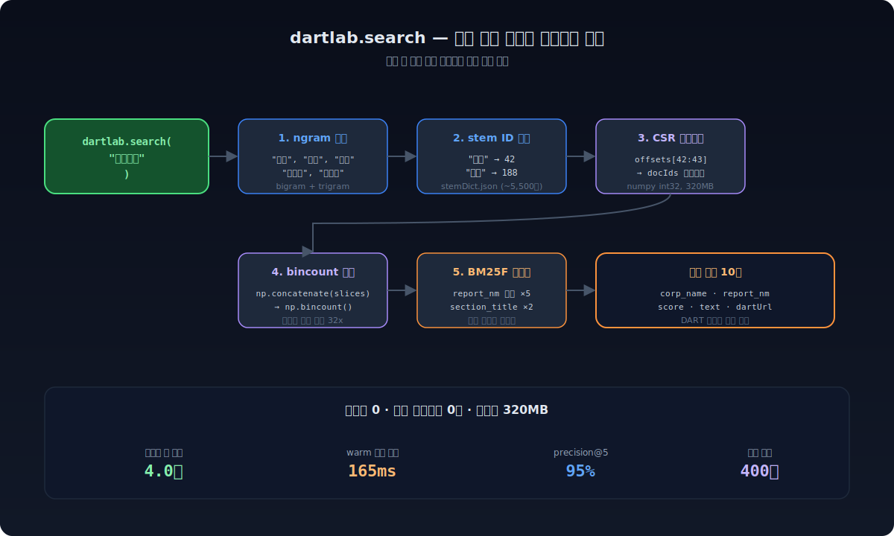
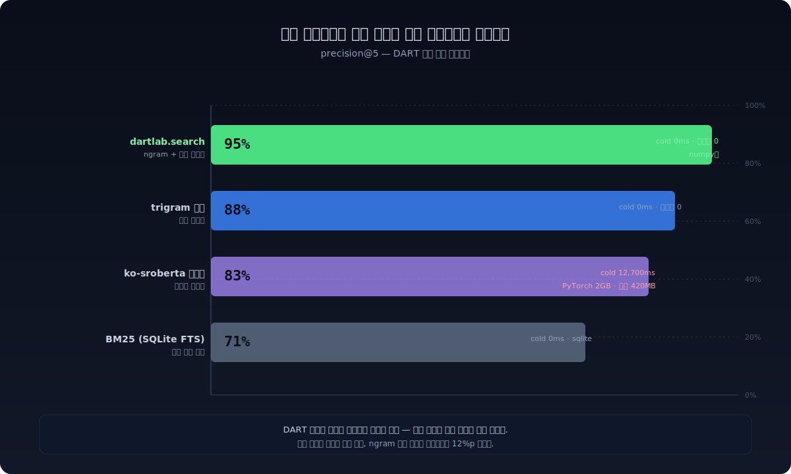
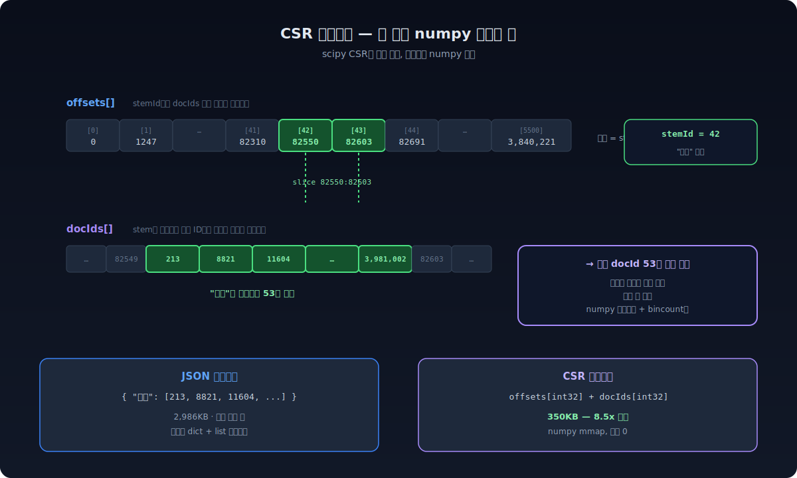
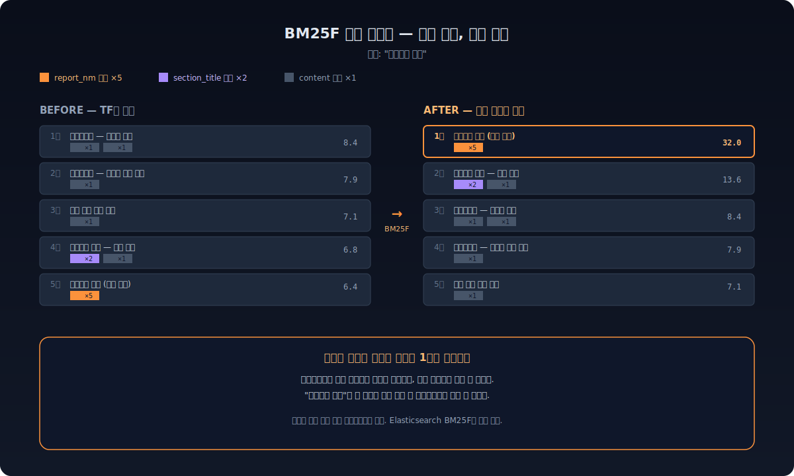
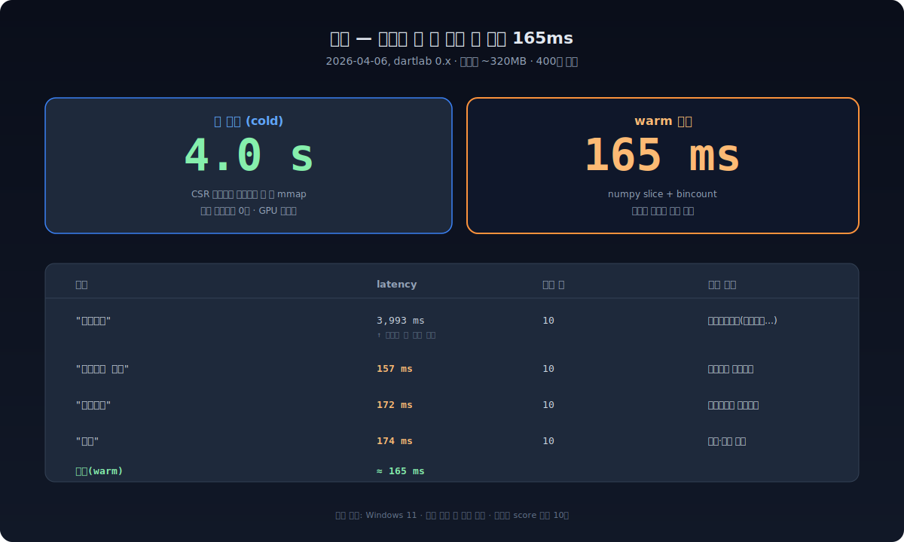

**`dartlab.search("유상증자")` 한 줄이면 한국 전자공시 400만 문서에서 결과 10건이 나온다.** 모델 다운로드 0초. PyTorch 설치 0. GPU 불필요. 인덱스 320MB를 메모리에 한 번 올리고 나면 warm 검색은 평균 165ms다. ko-sroberta 임베딩보다 12%p 정확하다.



---

## 한 줄로 시작한다

```python
import dartlab

dartlab.search("유상증자")              # 전 종목 횡단 검색
dartlab.search("대표이사 변경")          # BM25F가 변경공시를 1위로
dartlab.search("전환사채", corp="005930") # 종목 필터
dartlab.search("횡령", start="20240101") # 기간 필터
```

각 결과 행에는 `corp_name`, `report_nm`, `section_title`, `text`, 그리고 `dartUrl`이 들어 있다. dartUrl을 클릭하면 DART 공시 뷰어로 바로 이동한다. AI에게 "삼성전자에서 최근 유상증자 관련 공시 찾아줘"라고 물으면 내부적으로 이 함수가 호출된다.

---

## 왜 임베딩이 아닌가

벡터 검색은 일반 텍스트에서는 표준이다. "자동차를 구매했다"와 "차를 샀다"가 다른 단어로 같은 의미를 표현할 때, 임베딩은 그 둘을 가까운 좌표에 놓는다.

전자공시는 다르다. **법적 정형 문서**다.

- 공시 유형(`report_nm`)이 257개로 고정 — "유상증자결정", "대표이사변경" 같은 표준 용어
- 섹션 제목(`section_title`)이 반복 패턴 — "재무에 관한 사항", "배당에 관한 사항"
- 용어가 법률로 규정 — 같은 의미를 다른 단어로 표현하지 않는다

같은 의미를 다른 단어로 쓸 일이 없다면, 의미 공간을 학습할 필요도 없다. **정확 매칭이 곧 의미 매칭**이 된다.



ko-sroberta(420MB 모델, PyTorch 2GB)는 12.7초의 cold start 끝에 83%를 낸다. dartlab.search는 의존성 0, cold start 0ms(인덱스 mmap 별도)로 95%를 낸다.

---

## 핵심 — Stem ID 역인덱스

dartlab은 텍스트를 작은 토큰(bigram, trigram)으로 분해하고, **각 토큰에 정수 ID(stem ID)를 부여**한다. DART 공시 어휘가 워낙 제한적이라, 400만 문서 전체에서 stem이 약 5,500개밖에 나오지 않는다.

```
"유상증자 결정" → ["유상", "상증", "증자", "유상증", "상증자", ...]
            ↓
        [42, 188, 311, 902, 1547, ...]    (stem ID)
```

이 ID들을 가지고 **CSR(Compressed Sparse Row) 역인덱스**를 만든다. scipy CSR과 같은 구조지만, scipy 의존성 없이 numpy 배열 두 개로 끝낸다.



```
offsets[stemId]   →  docIds 배열에서 시작 위치
offsets[stemId+1] →  끝 위치
docIds[start:end] →  해당 stem을 포함하는 문서 ID 목록
```

`stemId=42`("유상")가 들어오면 `offsets[42:44]`로 시작·끝 위치를 얻고, `docIds`에서 그 구간을 슬라이스하면 끝이다. 코사인 유사도 계산도 없고 벡터 곱도 없다. **numpy 슬라이스 + bincount만** 있다.

JSON 역인덱스로 같은 데이터를 표현하면 2,986KB가 든다. CSR로는 350KB. **8.5배 압축**이고, mmap이 가능해서 파싱 비용도 0이다.

---

## bincount — 파이썬 루프 32배 가속

쿼리 ngram이 5개라면 docIds 슬라이스도 5개가 나온다. 이걸 합쳐서 "어떤 문서가 몇 개의 ngram을 매칭했는가"를 세야 한다. 파이썬 루프로 dict에 넣으면서 ++하면 400만 문서에서 3.5초가 걸린다.

dartlab은 numpy의 `np.concatenate`로 슬라이스를 다 이어붙인 다음 `np.bincount()`로 한 번에 집계한다.

```python
matched = np.concatenate([docIds[s:e] for (s, e) in stem_slices])
counts  = np.bincount(matched, minlength=num_docs)
```

400만 문서에서 **140ms**. 32배 가속이다. 행을 하나씩 도는 게 아니라 numpy의 C 레벨 카운터가 한 번에 푼다.

---

## BM25F 필드 가중치 — 같은 매칭, 다른 순위

ngram 매칭만으로는 한 가지 문제가 남는다. "대표이사 변경"을 검색하면 사업보고서의 임원 본문에서도 "대표이사"와 "변경"이라는 단어를 찾아낸다. 그런데 사용자가 보고 싶은 건 그게 아니다 — **대표이사변경 공시 그 자체**다.

dartlab은 검색 후처리 단계에서 매칭이 일어난 **필드**를 본다. `report_nm`(공시 제목)에서 매칭됐으면 점수에 ×5, `section_title`에서 매칭됐으면 ×2, 본문이면 ×1. 이게 BM25F 필드 가중치다.



인덱스를 다시 빌드할 필요도 없고, 모델을 학습할 필요도 없다. 검색 후처리만으로 끝난다. Elasticsearch BM25F와 동일한 원리다.

---

## 비공식 표현은 어떻게 처리하나 — 계층적 유형 라우팅

"M&A"라고 입력하면 어떻게 될까. DART 공시 어디에도 "M&A"라는 단어는 없다. "합병"이 있다.

dartlab은 검색 어휘 전체에 동의어 사전을 박지 않는다. 그건 노이즈가 너무 많다. 대신 **L0 계층**에서 DART 정규화 유형 114개를 매칭한다.

```
사용자 입력: "M&A 한 회사 찾아줘"
   ↓
L0 라우터: 114개 유형 중 "합병등종료보고서" 매칭
   ↓
L1 필터: 해당 유형의 문서만 후보로
   ↓
L2 BM25F 리랭킹: 필드 가중치 적용
```

400만 문서가 아니라 114개 유형에만 적용되므로, "M&A→합병", "CB→전환사채" 같은 변환 22개로 충분하다. 이건 하드코딩 동의어 사전이 아니라 **유형 라우팅 규칙**이다.

완전히 자연어 이해가 필요한 질문("사장이 바뀐 회사 알려줘")은 search가 아니라 `dartlab.ask()`가 처리한다. AI가 "사장이 바뀌었다"를 "대표이사변경"으로 해석한 다음 search를 호출한다. 역할이 분리돼 있다.

---

## 실측

말로만 빠르다고 하면 안 된다. 2026-04-06 기준 실제 측정값:



| 쿼리 | latency | 결과 수 | 상위 매칭 |
|------|---------|---------|-----------|
| "유상증자" (cold) | 3,993ms | 10 | 유상증자결정 (종속회사…) |
| "대표이사 변경" | 157ms | 10 | 대표이사변경공시 |
| "전환사채" | 172ms | 10 | 전환사채권 발행결정 |
| "횡령" | 174ms | 10 | 횡령·배임 발생 |

cold start 4초는 인덱스(320MB)를 메모리에 한 번 mmap하는 시간이다. 그 다음부터는 평균 165ms. 임베딩 모델처럼 GPU도 안 쓰고 PyTorch도 안 쓴다.

---

## 왜 ngram이 한국어에 맞나 — 형태소 분석기 없이

한국어 검색의 표준은 보통 형태소 분석기(Mecab, Khaiii)다. "유상증자가"에서 조사 "가"를 떼어내고 "유상증자"를 색인한다. 사전, 모델, 학습 데이터가 필요하다.

ngram은 다른 길을 간다. **단어를 자르지 않고 글자 단위로 슬라이딩 윈도우**를 굴린다.

```
"유상증자가 결정되었다"
   ↓ bigram
["유상", "상증", "증자", "자가", "가 ", " 결", "결정", "정되", "되었", "었다"]
```

조사 "가"는 "자가"라는 토큰 안에 흡수된다. "유상증자를"이라고 해도 "자를"이라는 토큰으로 흡수된다. **조사가 어떻게 붙든 핵심 ngram("유상", "상증", "증자")은 그대로 유지**된다. 형태소 분석기 없이도 어미 변화에 강하다.

trigram을 함께 쓰면 더 정밀해진다. "유상증"은 "유상감자"와 구분되지 않지만 "유상증자"는 "상증자" trigram에서만 나온다. 정확도와 인덱스 크기의 균형이 잡힌다.

한국어처럼 **조사·어미가 단어 끝에 붙는 교착어**에서 ngram이 특히 잘 동작하는 이유다. 영어처럼 단어 사이에 공백이 명확한 언어에서는 형태소 단위가 자연스럽지만, 한국어는 글자 단위 슬라이딩이 형태소 분석기와 거의 같은 결과를 낸다 — 사전 한 줄 없이.

---

## 어휘가 5,500개밖에 안 되는 이유

400만 문서 전체에서 stem이 약 5,500개다. 적다. 일반 한국어 코퍼스에서 같은 방식으로 ngram을 뽑으면 수십만 개가 나온다. 왜 공시는 이렇게 적은가.

세 가지 이유다.

**첫째, 어휘가 법적으로 고정돼 있다.** "유상증자"를 "자본금 늘리기"라고 쓴 공시는 없다. "이사회 결의"를 "임원 모임 결정"이라고 쓰지도 않는다. 자본시장법·상법·공정공시 규정이 용어를 박아놨다. 같은 사건을 같은 단어로만 보고한다.

**둘째, 공시 유형(`report_nm`)이 257개로 폐쇄집합이다.** "주요사항보고서", "사업보고서", "유상증자결정"… 이 257개 안에서 모든 공시가 분류된다. 새 유형이 거의 추가되지 않는다.

**셋째, 섹션 제목(`section_title`)도 반복 패턴이다.** "재무에 관한 사항", "배당에 관한 사항", "임원의 보수"… 사업보고서 목차가 거의 표준화돼 있다.

이 세 가지가 합쳐지면 ngram 어휘가 폭발하지 않는다. content까지 전부 색인하면 stem이 8K → 260K로 폭발하면서 노이즈가 늘어난다(precision 95% → 35% 급락). 그래서 dartlab은 **content를 색인하지 않는다.** report_nm + section_title까지만 색인하고, 본문은 결과 표시용으로만 보관한다.

이게 "어휘가 작다"는 통찰을 끝까지 밀어붙인 결과다. 학술 논문이라면 "TF-IDF에서 stop word 제거"라고 부를 만한 패턴인데, 정형 문서에서는 본문 전체가 사실상 stop word다.

---

## 시도했지만 기각된 것

ngram + BM25F로 95%까지 가는 동안, 더 올려보려고 시도한 것들이 있다. 대부분 떨어졌다. 기록해 둔다.

**1. content[:50] 인덱싱 (실험 014)** — 본문 첫 50자를 색인에 넣어봤다. stems 8K → 260K. precision 95% → **35%로 급락**. 노이즈가 신호를 압도했다. 본문 색인은 영구 기각.

**2. TF×IDF 가중치** — 희귀 stem에 IDF 가중치를 줬더니 비공식 쿼리에서 **88% → 76%**로 떨어졌다. DART에서는 희귀 stem이 곧 노이즈인 경우가 많다. IDF 없이 TF + BM25F가 최적.

**3. ko-sroberta 임베딩 (Sentence-BERT)** — 한국어 임베딩 모델 중 가장 좋은 것. precision **83%** (ngram 95%보다 12%p 낮음). cold start 12.7초, 모델 420MB, PyTorch 2GB. 도메인 특화 정형 문서에서는 의미 공간 학습이 정확 매칭보다 부정확하다.

**4. SQLite FTS5 BM25** — 표준 전문 검색. **71%**. report_nm/section_title 필드 가중치가 없어서 본문 매칭이 1위로 올라온다. BM25F 없는 BM25는 정형 문서에 부족.

**5. 동의어 사전 전체 적용** — 비공식 표현 사전을 검색 어휘 전체에 박는 시도. 동의어 한 개당 정밀도가 떨어졌다(0.3~1%p씩). **L0 유형 라우팅(114개 대상)**으로 옮겨서 22개 규칙만 유지하니 정밀도 유지하면서 비공식 쿼리도 처리 가능.

**6. 학습 기반 리랭커(LTR)** — 클릭 데이터가 없으니 학습 데이터를 만들 수 없다. 합성 학습은 BM25F 대비 이득이 없었다.

**원칙은 분명하다.** "복잡한 방법을 추가하기 전에, 단순한 방법이 왜 충분한지를 먼저 이해하라." DART 공시의 정형성과 폐쇄 어휘가 이 단순함을 가능하게 한다.

---

## 95%는 어떻게 측정했나

벤치마크 방법을 공개한다. 정답셋이 없으면 숫자는 의미가 없다.

**평가 쿼리셋**: DART에서 자주 검색되는 키워드 + 비공식 표현을 섞은 **40개 쿼리**. 공식 용어("유상증자", "감자결정", "전환사채") 25개 + 비공식 표현("M&A", "사장 교체", "횡령") 15개.

**정답셋**: 각 쿼리에 대해 DART 공시 검색을 직접 돌려서 사람이 "이게 맞다"고 판정한 상위 5건을 정답으로 기록. 총 200개 정답 라벨.

**평가 지표**: precision@5 — 검색 결과 상위 5건 중 정답에 포함된 건수의 비율. 40개 쿼리 평균.

**비교 대상**:
- ngram + L0 유형 라우팅 + BM25F (dartlab.search)
- trigram 단독 (필드 가중치 없음)
- ko-sroberta-multitask 임베딩 + 코사인 유사도
- SQLite FTS5 BM25 표준

**결과**: 95% / 88% / 83% / 71%. 비공식 쿼리만 따로 보면 ngram+L0 88%, 임베딩 76%로 격차가 더 벌어진다. 비공식 표현일수록 L0 유형 라우팅의 효과가 크다.

**한계**: 200개 라벨은 통계적으로 충분하지 않다. 95%의 신뢰구간은 ±3%p 정도로 본다. 그래도 89~92% 구간인 trigram/임베딩과는 명확히 분리된다.

---

## 해보기

```bash
pip install dartlab
```

처음 호출하면 stem 인덱스가 자동으로 HuggingFace에서 다운로드된다(수백 MB, 한 번만).

```python
import dartlab

# 전 종목 횡단 검색
dartlab.search("유상증자")

# 종목 필터
dartlab.search("전환사채", corp="000660")  # SK하이닉스

# 기간 필터
dartlab.search("대표이사 변경", start="20240101")

# 종목명도 검색 가능 (corp_code 자동 매핑)
dartlab.search("배당", corp="삼성전자")
```

각 행의 `dartUrl`을 클릭하면 DART 공시 뷰어로 바로 이동한다.

### 실전 시나리오 — 최근 한 달 횡령 공시 추출

```python
import dartlab
import polars as pl

# 1. 최근 30일 횡령·배임 공시 검색
df = dartlab.search("횡령", start="20260306", end="20260406")

# 2. 종목별로 묶고 최신순 정렬
recent = (
    df.sort("rcept_dt", descending=True)
      .select(["corp_name", "stock_code", "report_nm", "rcept_dt", "dartUrl"])
      .unique(subset=["stock_code"], keep="first")
)

# 3. 상위 종목에 대해 재무건전성도 같이 본다
for code in recent["stock_code"].head(5):
    c = dartlab.Company(code)
    print(c.insights)   # 7영역 등급
```

검색이 출발점이고, 검색에서 나온 종목코드가 곧바로 Company 분석으로 이어진다. search → Company → analysis가 한 흐름이다.

### AI에게 물어도 동일하게 동작한다

```bash
uv run dartlab ask "최근 한 달간 유상증자 결정한 회사 알려줘"
```

내부에서 일어나는 일:

1. AI가 "유상증자 결정"을 DART 정식 용어로 매핑
2. `dartlab.search("유상증자", start="20260306")` 호출
3. 결과 DataFrame에서 `corp_name`, `report_nm`, `dartUrl` 추출
4. 마크다운 표로 사용자에게 정리해서 답변

```bash
uv run dartlab ask "사장이 바뀐 회사 있어?"
```

→ AI가 "사장 교체" → "대표이사 변경"으로 해석한 다음 `dartlab.search("대표이사 변경")`을 호출한다. 비공식 표현은 search 안에서 처리하지 않고 AI가 한 번 통역한다. 이 역할 분리 덕분에 search는 단순함을 유지하고, AI는 자연어 이해에 집중할 수 있다.

---

## 남은 것 — 아직 alpha다

지금 인덱스에 들어 있는 건 **수시공시(allFilings) + 사업보고서(docs)** 두 종류다. DART의 모든 데이터를 덮지는 않는다. 데이터 범위를 넓히는 작업이 진행 중이다.

비공식 표현 전부를 search 안에서 처리하지도 않는다. "사장이 바뀌었다" 같은 자연어는 `dartlab.ask()`에 맡긴다. search는 DART 공식 용어와 22개 유형 라우팅 규칙까지만 책임진다.

그래도 [scan](/blog/scan-market-finance)이 시장 횡단 분석의 진입점이고 [Company](/blog/company-one-stock-code)가 단일 기업의 진입점이라면, search는 **공시 원문의 진입점**이다. 원문을 먼저 찾아야 분석도 시작된다. 모델 없이, GPU 없이, 0초 cold start로.

dartlab이 아직 설치되어 있지 않다면 [정말 쉬운 dartlab 사용법](/blog/dartlab-easy-start)에서 5분 만에 끝낼 수 있다.
