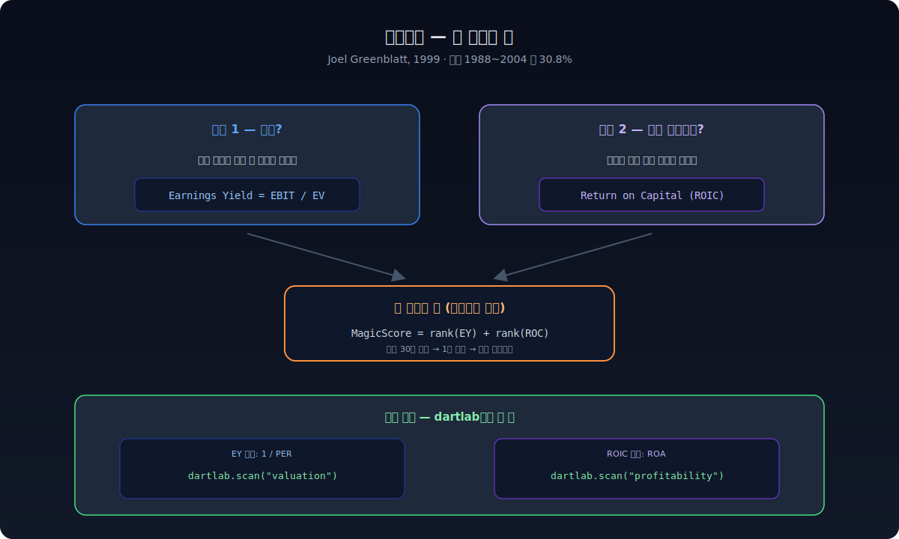
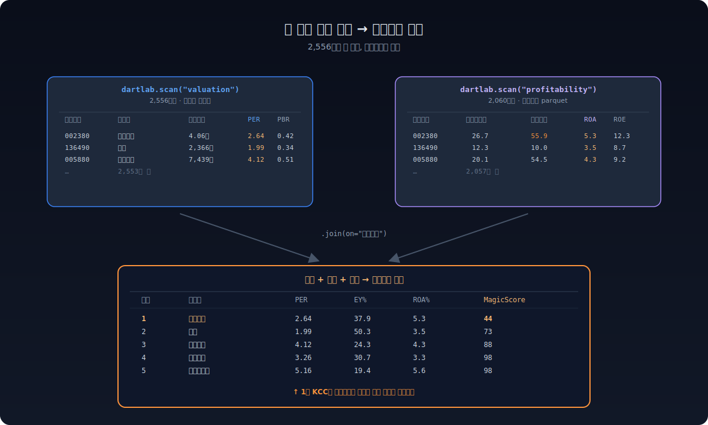
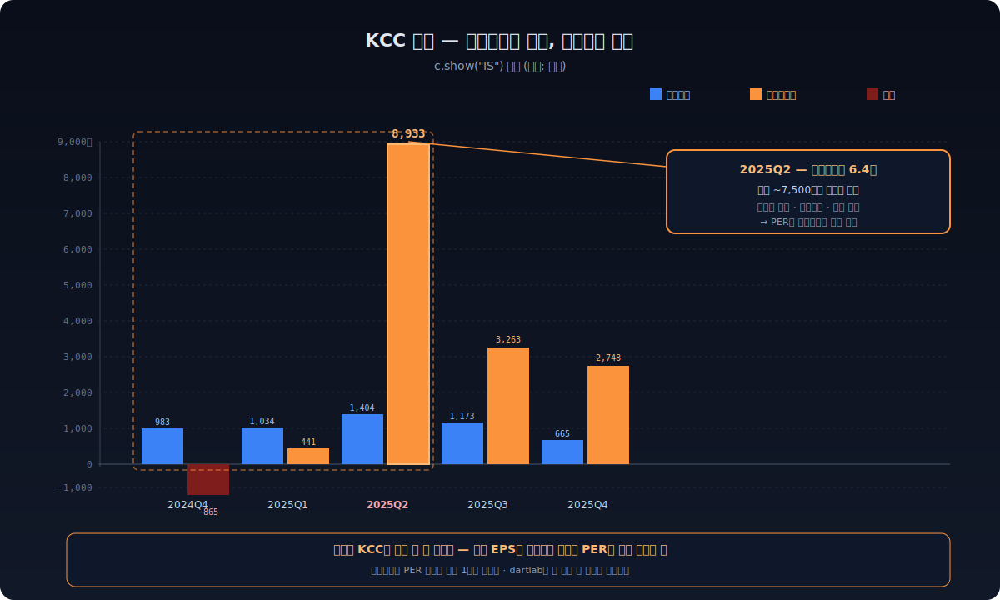
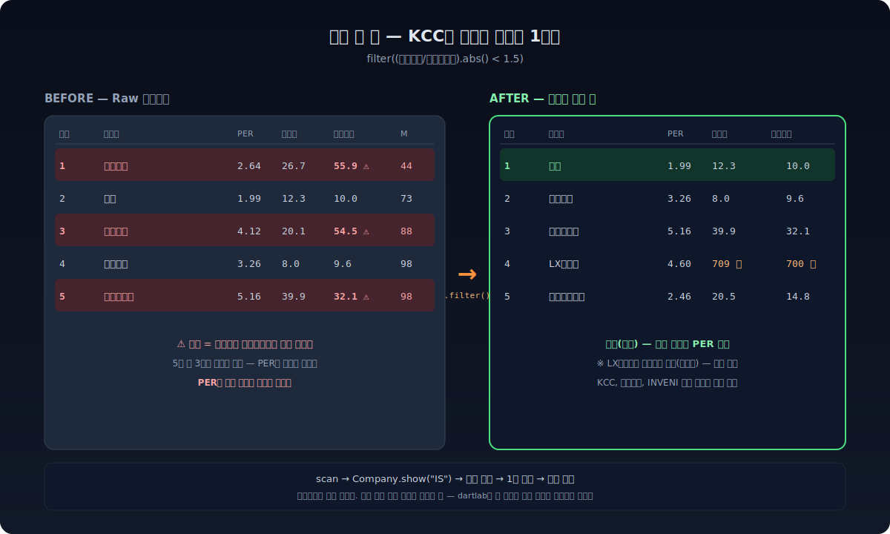

**조엘 그린블라트의 마법공식은 단순하다.** PER이 낮고(EBIT/EV가 높고) ROIC가 높은 종목을 두 랭킹의 합으로 줄세운다. 1988~2004년 미국 시장에서 연 30.8%, S&P 11.6% 대비 압도적. 책 한 권([『The Little Book that Beats the Market』, 2005](https://en.wikipedia.org/wiki/The_Little_Book_That_Beats_the_Market))이 그걸로 끝낸다.

이 공식을 한국 시장에 dartlab으로 5분 만에 돌려봤다. **그리고 1위가 함정이었다.** 그 함정을 발견하는 데 또 5분 걸렸다 — 그게 dartlab의 진짜 효용이다.



---

## 마법공식이 뭔가 — 30초 요약

그린블라트는 가치투자의 핵심을 **두 가지 질문**으로 압축했다.

1. **싼가?** — 같은 이익을 사는 데 얼마를 내는가 (Earnings Yield = EBIT/EV)
2. **좋은 사업인가?** — 투자한 자본 대비 얼마를 버는가 (Return on Capital)

각 종목을 두 지표로 줄세우고, 두 랭크를 더한 값이 작은 순서로 30~50개를 산다. 1년 보유, 매년 리밸런싱. 그게 전부다.

미국 backtest:
- 1988~2004: 마법공식 연 30.8% / S&P 500 12.4%
- 모든 시총 구간에서 시장 outperform
- 1년 손실 확률은 시장과 비슷, 3년 누적은 거의 항상 시장 이김

**왜 작동하나?** 그린블라트의 답: "사람들이 단기적으로 충분히 비합리적이기 때문에." 싸고 좋은 회사를 시장이 잠시 무시한다 → 시간이 지나면 평균회귀.

---

## 한국 시장에 적용하기 — 어떤 데이터가 필요한가

마법공식의 두 지표를 한국 데이터로 만들려면:

| 그린블라트 | 한국 적용 (dartlab) | 출처 |
|---|---|---|
| EBIT / EV | 1 / PER | `dartlab.scan("valuation")` — 네이버 실시간 |
| Return on Capital | ROA (대체) | `dartlab.scan("profitability")` — 프리빌드 parquet |

> EBIT/EV가 1/PER보다 정밀하지만, 한국 어댑테이션 연구들은 1/PER도 충분히 작동함을 보였다(Kim & Kim 2018). ROIC도 NWC + Net Fixed Assets 분모가 표준이지만, ROA는 그 핵심을 잡으면서 데이터가 깔끔하다.

dartlab 두 줄이면 끝난다.

```python
import dartlab

val  = dartlab.scan("valuation")     # 종목코드·시가총액·PER·PBR·배당수익률
prof = dartlab.scan("profitability") # 영업이익률·순이익률·ROE·ROA
```



---

## 5분 만에 마법공식 TOP 30

```python
import polars as pl

# 1. 두 테이블 조인
df = val.join(prof, on="종목코드", how="inner")

# 2. 깨끗한 종목만 (PER>0, ROA>0, 시총 1000억 이상, scan이 비경상으로 표시한 건 제외)
clean = df.filter(
    (pl.col("PER") > 0) & pl.col("PER").is_not_null() &
    (pl.col("ROA") > 0) & pl.col("ROA").is_not_null() &
    (pl.col("시가총액") >= 1e11) &
    (~pl.col("비경상"))
)

# 3. 두 지표 랭크
ranked = clean.with_columns([
    (1.0 / pl.col("PER") * 100).alias("EarningsYield"),
]).with_columns([
    pl.col("EarningsYield").rank("ordinal", descending=True).alias("rank_EY"),
    pl.col("ROA").rank("ordinal", descending=True).alias("rank_ROA"),
]).with_columns(
    (pl.col("rank_EY") + pl.col("rank_ROA")).alias("MagicScore")
).sort("MagicScore")

print(ranked.head(5))
```

**실행 결과 (2026-04-07 기준 실측):**

| 순위 | 종목명 | PER | EY% | ROA% | MagicScore |
|---|---|---|---|---|---|
| **1** | **케이씨씨 (002380)** | **2.64** | **37.9** | **5.3** | **44** |
| 2 | 선진 (136490) | 1.99 | 50.3 | 3.5 | 73 |
| 3 | 대한해운 (005880) | 4.12 | 24.3 | 4.3 | 88 |
| 4 | 대원산업 (005710) | 3.26 | 30.7 | 3.3 | 98 |
| 5 | 태경비케이 (014580) | 5.16 | 19.4 | 5.6 | 98 |

**1위 KCC.** PER 2.64배. 영업이익률 26.7% 가까이. 시총 4조원 우량주. 너무 좋아 보인다. **너무 좋아 보일 때 멈춰야 한다.**

---

## 1위 KCC를 한 줄로 검증한 순간

dartlab은 종목코드 하나로 그 회사 전체를 연다. ([상세](/blog/company-one-stock-code))

```python
c = dartlab.Company("002380")
c.show("IS")
```

손익계산서가 5년 분기 시계열로 펼쳐진다. KCC의 최근 다섯 분기 핵심 행만 뽑아보면:

| 항목 | 2024Q4 | 2025Q1 | **2025Q2** | 2025Q3 | 2025Q4 |
|---|---|---|---|---|---|
| 매출액 | 1.66조 | 1.60조 | 1.71조 | 1.62조 | 1.56조 |
| 영업이익 | 983억 | 1,034억 | **1,404억** | 1,173억 | 665억 |
| **당기순이익** | **−865억** | 441억 | **8,933억** | 3,263억 | 2,748억 |

**2025Q2 영업이익 1,404억 → 당기순이익 8,933억.** 영업이익의 **6.4배**다. 2024Q4는 적자인데. 이런 회사는 없다 — 아니, 정확히는 **이런 분기**가 있는 것이다.

`c.show("IS")`로 같은 분기 기타이익까지 보면:

```
기타이익 (2025Q2): 119억  ← 손익계산서 본문에는 작은 숫자만 보인다
```

차이 ~7,500억은 본문이 아닌 **자회사·평가·세금 효과**에서 왔다. 사업보고서 주석을 펼치면 매각 차익이나 공정가치 변동, 이연법인세 환입 같은 한 분기짜리 이벤트가 줄줄이 잡힌다.

문제는 PER 2.64배가 **이 일회성 이익**으로 만들어졌다는 것이다. 시장이 KCC를 싸게 평가한 게 아니라, 분모(주가)는 그대로인데 분자(주당순이익)에 한 분기짜리 비경상 이익이 박혀서 **PER이 인위적으로 낮아 보인 것**이다. 마법공식은 그걸 알 수 없다 — PER 숫자만 보니까.



---

## 1줄 보정으로 함정 빼기

마법공식은 PER에 의존하므로, **순이익이 영업이익에서 너무 많이 벗어난 종목을 빼면** 함정 대부분이 걸러진다. 보정 한 줄:

```python
cleaner = df.filter(
    (pl.col("순이익률") / pl.col("영업이익률")).abs() < 1.5
)
```

순이익률이 영업이익률의 1.5배를 넘으면 비경상 이익 의심. KCC는 순이익률 55.9% / 영업이익률 26.7% = 2.09배 → **걸러짐**.

같은 코드로 다시 돌리면:

| 순위 | 종목명 | PER | EY% | ROA% | 영업이익률 | 순이익률 |
|---|---|---|---|---|---|---|
| **1** | **선진 (136490)** | **1.99** | **50.3** | **3.5** | **12.3** | **10.0** |
| 2 | 대원산업 (005710) | 3.26 | 30.7 | 3.3 | 8.0 | 9.6 |
| 3 | 태경비케이 (014580) | 5.16 | 19.4 | 5.6 | 39.9 | 32.1 |
| 4 | LX홀딩스 (383800) | 4.60 | 21.7 | 3.6 | 709.4 | 700.3 |
| 5 | 지역난방공사 (071320) | 2.46 | 40.7 | 2.7 | 20.5 | 14.8 |

**진짜 1위는 선진(사료 회사)**. 순이익률 10% / 영업이익률 12.3% — 정상적인 격차. PER 1.99도 일회성이 아니라 본업의 결과로 보인다.

LX홀딩스 영업이익률 709% 같은 숫자는 **지주회사 특유**(매출 대비 지분법손익이 거대)로, 보정 필터를 통과한다. 이건 별도 흐름으로 봐야 하는 케이스 — 지주회사는 마법공식 대상이 아닐 수 있다는 신호다.



---

## 이게 dartlab의 진짜 가치다

마법공식은 책 한 권으로 끝나는 단순한 공식이다. 그런데 단순한 공식을 **검증 없이 그대로 적용하면 함정에 빠진다**. 비경상 이익, 지주회사 특수성, 일회성 이벤트, 회계 처리 차이 — 학술 논문은 큰 표본 평균에서 잘 작동하지만, 개별 종목 5개를 사는 사람에겐 함정 1개가 손실 20%다.

dartlab의 흐름은 정확히 이것을 해결한다.

```python
# 1. 시장 전체를 한 줄로 본다 (스크리닝)
val  = dartlab.scan("valuation")
prof = dartlab.scan("profitability")

# 2. 후보가 나오면 그 회사 전체를 한 줄로 연다 (검증)
c = dartlab.Company("002380")
c.show("IS")    # 손익 5년 분기 시계열
c.show("ratios") # 비율 50개
c.notes.borrowings  # 차입금 분해
c.review("수익성")  # 6막 서사 보고서

# 3. 발견한 함정으로 스크리너를 즉시 보정한다
cleaner = df.filter((pl.col("순이익률")/pl.col("영업이익률")).abs() < 1.5)
```

**스크린 → 검증 → 보정**이 같은 도구 안에서 같은 데이터로 일어난다. 스크리너가 별도, 회계 검증이 별도, 사업보고서가 별도 사이트에 있는 환경에서는 이 루프가 며칠 걸린다. dartlab에선 5분이다.

---

## 마무리 — 스크리너는 시작이지 답이 아니다

오늘 발견한 것:

1. **마법공식 raw 1위 KCC** — 비경상 이익 8,000억 트랩
2. **1줄 보정 후 진짜 1위 선진** — 정상 마진 격차
3. **dartlab.scan + Company의 콤보** — 시장 횡단과 단일 기업 심층이 같은 줄에서 만난다

이게 한 종목을 사는 데 충분한 분석인가? **아니다.** 선진의 경우 라면용 사료의 사이클성, 부채 구조, 경쟁사 비교, 가족경영 리스크가 다 남아 있다. 그건 [c.review() 6막 보고서](/blog/company-one-stock-code)와 [scan 전종목 비교](/blog/scan-market-finance), [공시 검색](/blog/search-without-embeddings)이 다음 단계로 받는다.

스크리너는 답을 주지 않는다. **답을 찾기 위한 후보를 5분 만에 30개로 좁혀줄 뿐이다.** 마법공식이 KCC를 1위로 뽑은 게 잘못이 아니다 — 검증 없이 그걸 매수하는 게 잘못이다. dartlab은 그 검증을 1줄로 가능하게 만든다.

이 글을 쓰면서 dartlab 엔진에서 4건의 개선점을 발견했다. 비경상 판정 강화, valuation scan 캐시, 첫 호출 race, stale 메시지 충돌 — 전부 [scan_audit](https://github.com/eddmpython/dartlab) 메모리에 기록했고 다음 패치에 반영된다. **블로그가 곧 audit이다.**

---

> 이 글의 모든 숫자는 2026-04-07 기준 `dartlab.scan()`과 `dartlab.Company("002380").show("IS")` 호출 결과 그대로다. 같은 코드를 [VSCode 익스텐션](/blog/vscode-extension-install)이나 [터미널](/blog/dartlab-easy-start)에서 실행하면 같은 결과가 나온다. 검증 가능성이 dartlab의 약속이다.
