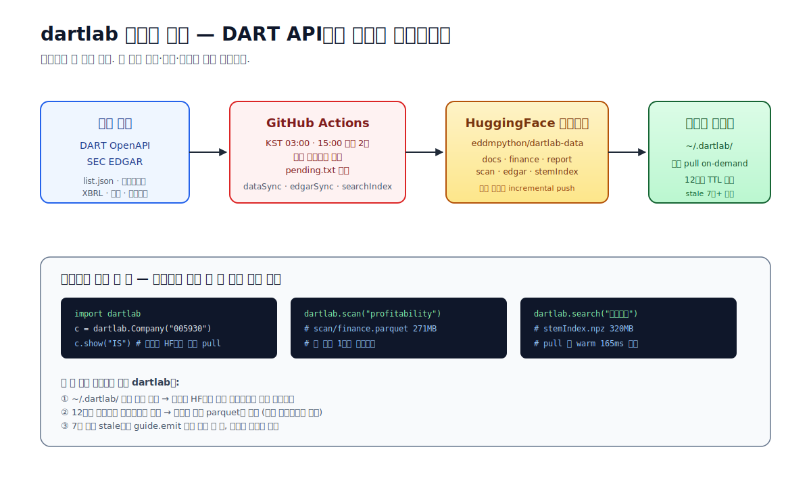
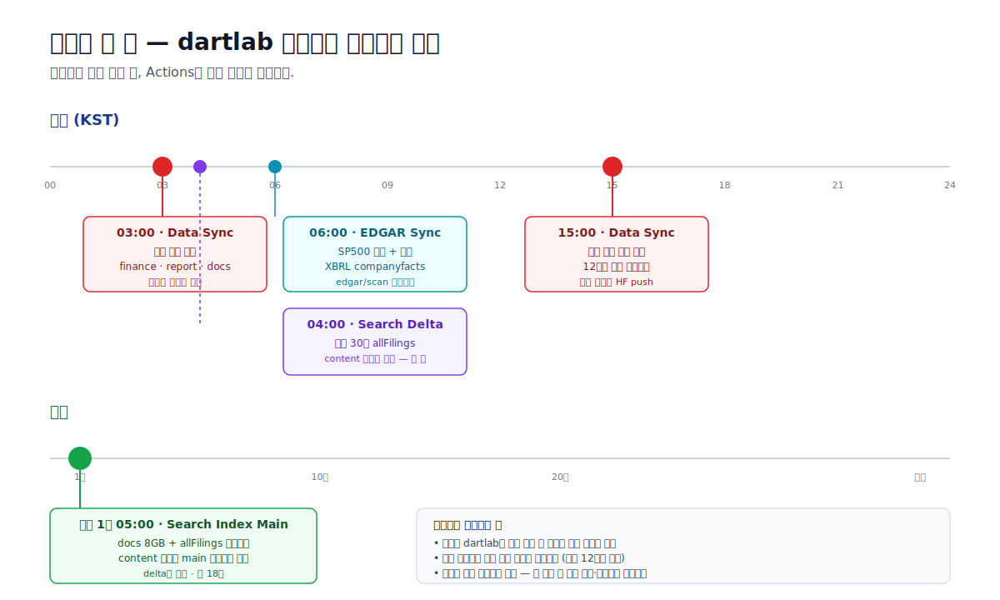
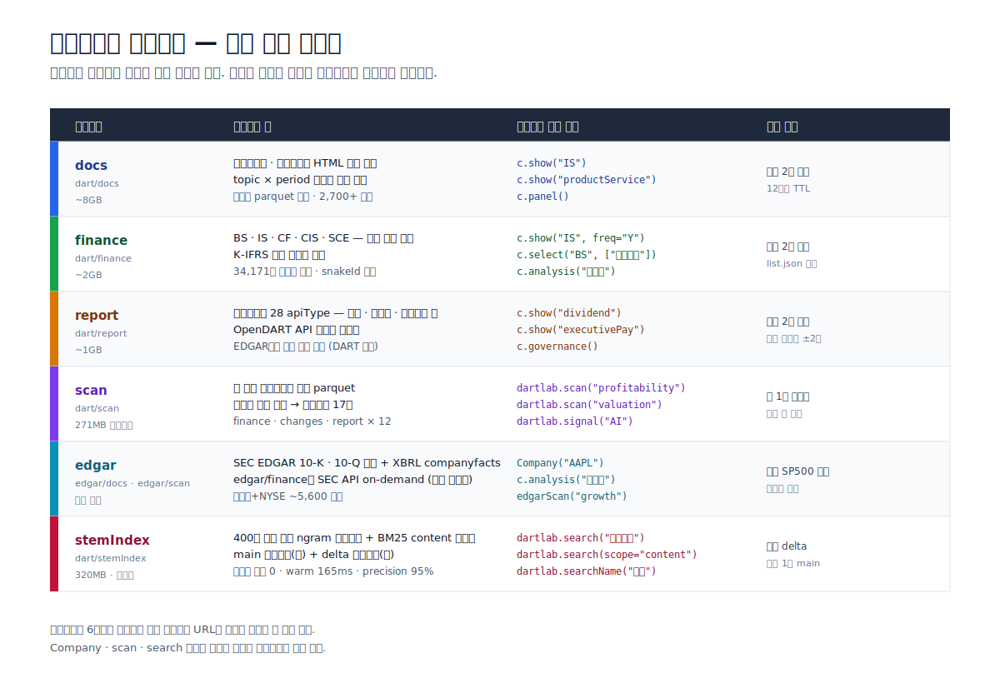
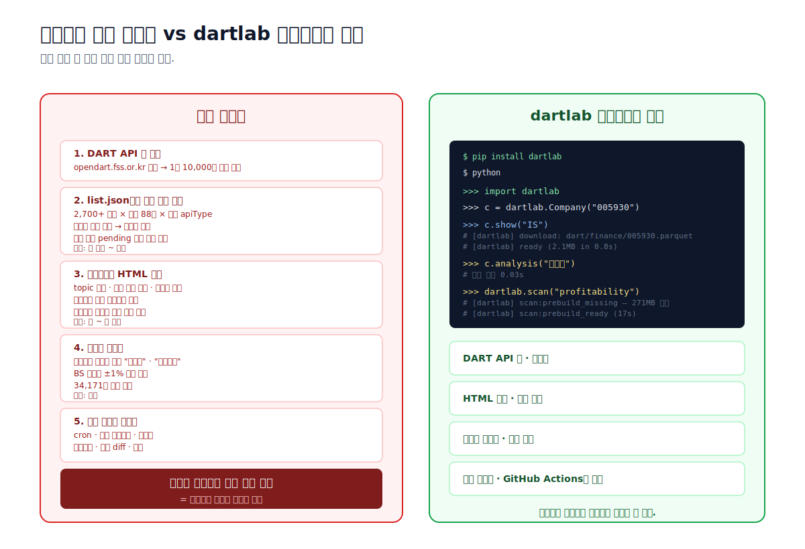
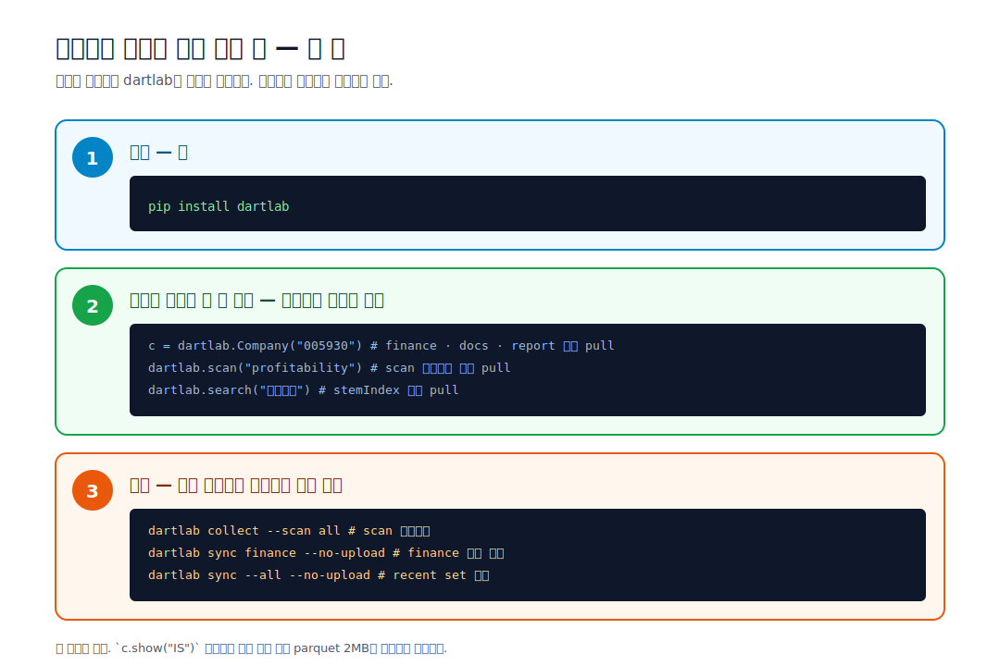

**사용자가 dartlab을 설치한 순간, 전자공시 데이터 수집 인프라 하나를 통째로 얻는다.** DART OpenAPI 키도, HTML 파서도, cron도, 재시도 로직도 필요 없다. 한국 상장사 2,700+ 종목 × 수십 분기 × 수백 개 공시 유형을 수집·정제·표준화한 결과가 HuggingFace 데이터셋 하나에 올라가 있고, GitHub Actions가 매일 두 번 그 데이터셋을 갱신한다.

사용자 입장에서 이 모든 게 **`c.panel("IS")` 한 줄 뒤에 숨어 있다.** 호출하는 순간 dartlab이 로컬 캐시를 확인하고, 없으면 HF에서 해당 종목 parquet 2MB만 선별적으로 끌어온다. 12시간 지났으면 백그라운드에서 새 버전을 비교하고, 변경된 종목만 교체한다.



---

## 사용자가 받기 전에 일어나는 일

대부분의 사용자는 dartlab의 첫 화면만 본다. `pip install dartlab` 하고, 파이썬 콘솔에서 `c = dartlab.Company("005930")`을 치면 그냥 결과가 나온다. 하지만 그 결과가 나오려면 그 전에 누군가가 DART API를 두드렸어야 한다. dartlab은 그 누군가를 **GitHub Actions**로 대체했다.

매일 두 번, 고정된 시간에 워크플로우가 돈다.

- **KST 03:00** — 전날 저녁까지 올라온 공시를 캡처한다. DART 공시는 장 마감 후에 몰리므로 새벽 수집이 가장 촘촘하다.
- **KST 15:00** — 당일 오전 올라온 공시를 반영한다. 오후에 분석을 시작하는 사용자도 당일 공시를 놓치지 않는다.



이 워크플로우는 `dataSync.yml`이라는 한 파일에서 관리된다. 핵심은 **88분기 차집합을 매번 하지 않는다**는 것. list.json으로 "최근 60일 동안 새로 올라온 공시"만 조회하고, 그중 로컬에 없는 종목·분기만 수집한다. 지난 실행이 API 한도에 걸려 잘린 요청은 `pending.txt`에 남겨두고 다음 실행에서 우선 회수한다. 실패 없이 복구되는 구조다.

---

## 데이터셋 하나, 카테고리 6개

모든 데이터는 [HuggingFace `eddmpython/dartlab-data`](https://huggingface.co/datasets/eddmpython/dartlab-data) 한 곳에 있다. GitHub Releases 업로드는 2026-04-08에 폐지됐다. **HF 단일 소스**가 더 단순하고, 부분 다운로드가 가능하기 때문이다.



각 카테고리는 **사용자가 부르는 함수**와 1:1로 매핑돼 있다. 사용자는 카테고리 이름을 외울 필요가 없다.

- `c.panel("IS")`를 부르면 dartlab은 속으로 "아 이건 `dart/finance`가 필요하겠네" 한다.
- `dartlab.scan("profitability")`을 부르면 `dart/scan/finance.parquet`이 필요하다고 판단한다.
- `dartlab.search("유상증자")`를 부르면 `dart/stemIndex` 를 메모리에 mmap한다.

이 매핑은 [`src/dartlab/core/dataConfig.py`](https://github.com/eddmpython/dartlab/blob/master/src/dartlab/core/dataConfig.py)의 `DATA_RELEASES` dict에 모여 있다. 카테고리 하나 추가하려면 이 dict에 한 줄만 넣으면 전체 파이프라인이 자동으로 인지한다. HF URL을 다른 파일에 하드코딩하는 것은 CLAUDE.md에서 금지하고 있다.

---

## 왜 직접 긁는 것과 다른가

DART API는 누구에게나 열려 있다. 키를 발급받고 requests를 몇 줄 쓰면 list.json을 긁어 올 수 있다. 그런데 그 한 줄이 분석의 시작이 아니라 **분석 전의 선행 비용**으로 부풀어 오르는 것이 함정이다.



직접 한다면 — API 키 발급, 레이트 리밋 튕김 처리, 2,700 종목 × 88 분기 × 여러 apiType을 빠짐없이 회수, 사업보고서 HTML을 topic별로 쪼개는 파서, 회사마다 다르게 쓰는 "매출액 / 영업수익 / 매출" 을 하나의 계정으로 매핑하는 사전, 이걸 매일 돌리는 cron, 에러 알림, 스토리지 —. 각 단계가 분석이 아니라 인프라다.

dartlab은 그 인프라를 깃허브 리포에 공개된 워크플로우로 옮겼다. 사용자는 그 결과(parquet · 인덱스 · 프리빌드)만 받는다. 34,171개 계정명 매핑은 [`learnedSynonyms.json`](https://github.com/eddmpython/dartlab/blob/master/src/dartlab/core/data/learnedSynonyms.json)과 `accountMappings.json`에 누적돼 있고, BS 항등식 ±1% 검증을 통과한 매핑만 반영된다. 한 번의 실수로 숫자가 틀어지는 일이 없도록, 학습 루프가 측정 → 수집 → 분석 → 병합 → 검증 6단계를 거친다.

---

## 한 줄 호출 뒤에 일어나는 세 가지

`c = dartlab.Company("005930")` 또는 `c.panel("IS")`를 부르는 순간, dartlab은 세 가지를 동시에 한다.

**① 로컬 캐시 확인.** `~/.dartlab/` 아래에 해당 parquet이 있고 12시간 이내에 받은 것이면 그대로 쓴다. 호출이 끝날 때까지 네트워크 I/O가 0회다.

**② 없으면 HF에서 해당 종목만 pull.** 전체 2GB가 아니라 `dart/finance/005930.parquet` 한 파일, 약 2MB만 받는다. `guide.emit`이 `download:start → download:done_short` 이벤트를 띄워 다운로드가 시작되고 끝났음을 사용자에게 알린다. 침묵하지 않는다는 것이 원칙이다.

**③ 12시간 지난 캐시면 백그라운드 비교.** 오래된 파일이면 HF의 파일 해시와 비교해서 변경이 있을 때만 다시 받는다. 7일 이상 stale이면 `data:stale_warning` 이벤트가 한 번 뜨고, 분석은 그대로 진행된다. "오래됐다는 사실을 알고 쓰는 것"과 "오래된 줄 모르고 쓰는 것"을 구분한다.



사용자가 "전부 미리 받아 두고 싶다"고 하면 `dartlab.downloadAll("scan")` 한 줄로 끝난다. 비행기에서 쓰기 전날 밤에 한 번 돌리고 자면 된다.

---

## 검색 인덱스는 하루 단위로 성장한다

공시 데이터와 별개로, dartlab은 400만 문서를 검색할 수 있는 인덱스를 같이 관리한다. [임베딩 없이 공시 검색 글](/blog/search-without-embeddings)에서 구조를 설명한 그 인덱스다. 이건 재무 parquet과는 갱신 리듬이 다르다.

인덱스는 **main + delta 두 세그먼트**로 쪼개져 있다. main은 무거운 풀리빌드라 매월 1일 KST 05시에 한 번 돈다 (`searchIndexMain.yml`, 약 18분). delta는 가벼운 증분이라 매일 KST 04시에 돈다 (`searchIndexDelta.yml`, 수 초). 검색 시 두 세그먼트를 합쳐 BM25 점수를 구하고 중복은 delta 우선으로 제거한다.

덕분에 **오늘 올라온 공시가 내일 아침이면 검색된다.** 사용자는 `rebuildIndex()`를 직접 돌릴 필요가 없다. `dartlab.search("유상증자")`를 부르면 dartlab이 stemIndex가 로컬에 없으면 HF에서 자동으로 pull하고, 있으면 mmap으로 메모리에 바로 올린다.

---

## 워크플로우는 리포에 공개돼 있다

dartlab의 GitHub Actions는 secret이 아니다. `.github/workflows/` 아래에 전부 공개돼 있고, 누구나 읽을 수 있다.

| 워크플로우 | 주기 | 하는 일 |
| --- | --- | --- |
| `dataSync.yml` | 매일 03시 · 15시 | DART finance · report · docs 증분 수집 |
| `edgarSync.yml` | 매일 | SEC EDGAR SP500 전체 + 나머지 증분 |
| `searchIndexDelta.yml` | 매일 04시 | 최근 30일 allFilings 인덱스 증분 |
| `searchIndexMain.yml` | 매월 1일 05시 | 검색 인덱스 main 세그먼트 풀리빌드 |
| `dataPrebuild.yml` | 주 단위 | scan 횡단분석용 parquet 합산 |
| `kindlist.yml` | 일 단위 | KRX 상장 종목 마스터 갱신 |

수동으로 돌려야 할 때는 `workflow_dispatch`로 실행 가능하다. `full` 모드를 고르면 88분기 차집합을 다시 해서 누락된 과거 공시까지 전부 회수한다. 이건 API 한도가 넉넉한 주말에 한 번씩 돌린다.

변경된 파일만 HF에 올라간다. `dist/changed_finance.txt`에 들어 있는 경로만 uploadData.py가 처리한다. 사용자가 다음에 pull할 때도 바뀐 파일만 내려온다. **증분 push, 증분 pull** — 양 끝에서 낭비가 없다.

---

## 점검 — 사용자는 어떻게 확인하는가

dartlab은 데이터 수집을 침묵하지 않는다. 긴 작업이 시작되면 반드시 알린다. `src/dartlab/guide/README.md`에 정의된 `guide.emit` 이벤트 중 "항상 보여주는" 카테고리가 있다.

- `download:start` / `download:done_short` — 단일 parquet 다운로드
- `download_all:*` — 카테고리 전체 다운로드
- `edgar:bulk_start` / `edgar:bulk_done` — EDGAR 배치 수집
- `scan:prebuild_missing` / `scan:prebuild_ready` — scan 프리빌드 첫 호출
- `stemindex:hf_start` / `stemindex:hf_done` — 검색 인덱스 pull
- `data:stale_warning` — 로컬 캐시가 7일 이상 지났을 때 (세션당 1회)

`verbose=False`여도 이 이벤트는 항상 뜬다. "언제부터 뭘 받고 있는지"가 보이지 않으면 사용자는 dartlab이 멈춘 줄 알고 Ctrl+C를 누른다. 그게 가장 나쁜 실패 모드다.

사용자가 "지금 내 데이터가 얼마나 신선한가" 확인하고 싶다면 한 줄이면 된다.

```python
>>> import dartlab
>>> dartlab.guide.checkReady("finance", stockCode="005930")
{
  "ready": True,
  "localPath": "~/.dartlab/dart/finance/005930.parquet",
  "localMtime": "2026-04-14 03:17:22",
  "hfLatest":   "2026-04-14 03:12:08",
  "ageHours": 0.4,
  "stale": False,
  "apiKey": "optional — HF에서 받을 수 있음"
}
```

`ready=False` 일 때는 뭐가 빠졌고 어떻게 채우는지도 같이 뱉는다. 예를 들어 scan이 없으면 `"hint": "dartlab.downloadAll('scan') — 271MB"` 가 붙고, API 키가 없으면 "없어도 괜찮다, HF로 받을 수 있다" 를 명시적으로 알려준다.

일괄 다운로드가 필요하면 카테고리별 규모도 미리 안다.

| 카테고리 | 규모 | 쓰는 경우 |
| --- | --- | --- |
| `scan` | 271MB | 전종목 횡단분석을 처음 돌릴 때 |
| `stemIndex` | 320MB | 공시 검색을 많이 쓸 때 |
| `finance` | 약 2GB | 오프라인에서 다수 종목 분석할 때 |
| `report` | 약 1GB | 배당·임원보수·자사주 스캔할 때 |
| `docs` | 약 8GB | 공시 원문까지 필요할 때 (드묾) |
| `downloadAll()` | 10GB+ | 비행기 타기 전날 밤 |

종목 하나만 볼 거라면 아무것도 미리 받을 필요가 없다 — 호출할 때 해당 종목 2MB만 내려온다.

---

## 데이터 계약 — 한 번 정한 키는 바뀌지 않는다

마지막으로 데이터셋 사용자에게 약속한 것이 하나 있다. **parquet의 컬럼 이름, snakeId, topic 키는 한 번 정해지면 바꾸지 않는다.** 바꾸면 그 데이터를 쓰던 기존 스크립트가 전부 깨진다. 새 속성이 필요하면 같은 진입점에 파라미터로 토글한다 (`annual=True`, `cumulative=True`, `basePeriod=...`). 이건 코드뿐만 아니라 데이터셋에도 적용되는 dartlab의 API Contract다 (`operation.apiContract`).

덕분에 이 글을 읽고 오늘 `c.panel("IS")`를 배운 사용자는 1년 뒤에 같은 호출을 써도 같은 구조의 DataFrame을 받는다. 그 DataFrame이 지난밤 03시에 GitHub Actions가 수집한 최신 분기를 포함하고 있을 뿐이다.

사용자는 분석에 집중하고, 수집은 Actions가 한다. 그게 이 데이터셋이 존재하는 이유다.
