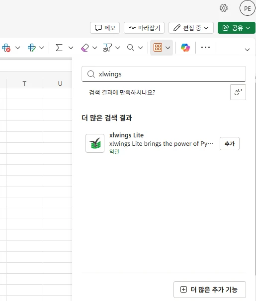
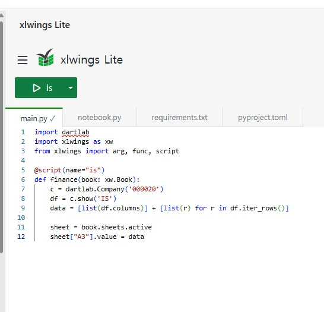

**dartlab은 파이썬 패키지다.** 그런데 파이썬이 설치돼 있지 않은 환경에서도 돌아간다. 엑셀 웹 버전, 사내 웹 주피터, 크롬 탭 하나 — 어디서든 `import dartlab` 한 줄로 삼성전자의 손익계산서가 나온다. 지난 2년 사이 조용히 퍼진 한 인프라, **Pyodide** 덕분이다.

이 글에서는 dartlab의 Pyodide 지원(이하 **dartlab-lite**)이 어떤 환경에서 어떻게 돌아가는지, 그리고 엑셀에서 사용자 정의 함수로 쓰는 실제 화면을 두 장 보여준다. 더불어 Pyodide가 뭔지, 어떤 제약이 있는지도 정확히 짚는다. 설치형 dartlab과 **같은 API**, **같은 데이터**인데 배포만 브라우저 안에서 이뤄진다.

> **[웹 엑셀에서 지금 바로 열어보기](https://1drv.ms/x/c/4e17617bfea66347/IQB9zW91TaD4TJvHM8LRQTh4ARj0gHMapx4LVhCCSbBz92Q?e=HQ4E7d)** — OneDrive 공유 워크북. 엑셀 웹에서 열면 xlwings Lite 사이드바 + dartlab 호출이 세팅돼 있어 버튼만 누르거나 셀에 `=GETFINANCE("005930")`만 쳐도 된다.

---

## Pyodide가 뭔가

**Pyodide는 CPython을 WebAssembly(WASM)로 컴파일한 런타임이다.** 모질라가 2018년에 시작해 지금은 독립 프로젝트로 운영 중이다. 핵심 한 줄:

> **브라우저 탭 하나 안에서 진짜 CPython이 돈다.** `numpy`·`pandas`·`scipy`·`polars` 같은 네이티브 확장까지 포함해서.

서버 왕복 없음. 코드는 내 컴퓨터의 브라우저 안에서만 실행된다. 파이썬 인터프리터가 `.wasm` 파일로 배포되고, JS는 `pyodide.runPython("...")`으로 호출한다. 파이썬 객체가 그대로 JS에 노출되고, `fetch` 같은 브라우저 API도 파이썬에서 `await`로 쓸 수 있다.

덕분에 **"파이썬이 설치된 런타임"이라는 전제가 브라우저에 딸려 온다.** 이 전제 위에 최근 2년 사이 도구들이 쏟아졌다.

| 제품 | 무엇 | 어떻게 쓰나 |
|---|---|---|
| **xlwings Lite** | Excel(웹·데스크톱 통합) 안에서 파이썬 실행 | 엑셀 사이드바에서 `@script` / `@func` 데코레이터로 함수 작성 |
| **Anaconda Code** | Excel 추가기능(Anaconda에서 배포) | 엑셀에서 파이썬 셀로 분석, 결과를 그대로 시트에 반환 |
| **JupyterLite** | 서버 없는 Jupyter — 전부 브라우저에서 | 정적 호스팅만 하면 노트북 환경 배포 |
| **Google Colab (WASM 런타임)** | 로컬 런타임 옵션으로 브라우저 Python 지원 | 기존 노트북 UX 그대로 |
| **marimo (pyodide 모드)** | 반응형 노트북을 정적 페이지로 배포 | `marimo export html-wasm` 한 줄 |

공통점: **서버 없이 파이썬이 돈다.** 사용자는 "파이썬 설치"를 거치지 않고도 코드를 돌릴 수 있다.

---

## dartlab-lite — 같은 API, 다른 배포

dartlab은 v0.9.9부터 Pyodide 전용 wheel을 함께 배포한다. [pyodide/README.md](https://github.com/eddmpython/dartlab/blob/master/pyodide/README.md)에 빌드 파이프라인 전부가 있다. 핵심은 세 가지.

- **CPython 계열 의존성은 Pyodide 내장** — `numpy`·`pandas`·`polars`·`pyarrow`는 Pyodide가 제공하는 WASM 빌드를 쓴다. dartlab wheel은 이들을 다시 다운로드하지 않는다.
- **parquet 로드 경로만 우회** — polars의 WASM 빌드는 `read_parquet`/`write_parquet`가 비활성화돼 있다. dartlab-lite는 `pyarrow.parquet.read_table(BytesIO) → pl.from_arrow()`로 한 단계 우회한다.
- **데이터는 HuggingFace에서 직접 fetch** — 사용자가 `Company("005930")`을 부르면 JS가 HF URL에서 parquet를 받아 `pyodide.FS.writeFile("/data/dart/finance/005930.parquet")`로 MEMFS에 놓고, 파이썬이 그걸 읽는다.

사용자 입장에서는 import 구문 하나 늘어날 뿐 차이를 못 느낀다.

```python
# 어떤 환경이든 — 데스크톱, xlwings Lite, JupyterLite, Colab WASM
import dartlab

c = dartlab.Company("005930")
c.show("IS")
c.analysis("financial", "수익성")
c.review("수익성").toMarkdown()
```

---

## xlwings Lite — 두 가지 사용 모드

엑셀에서 dartlab을 쓰는 방법은 xlwings Lite가 제공하는 두 개의 데코레이터로 갈린다. **스크립트형**(`@script`)과 **함수형**(`@func`)이다. 같은 dartlab 호출을 어떻게 포장하느냐의 차이다.

### 1. 스크립트형 — 버튼 누르면 시트에 채운다

`@script`는 엑셀 사이드바에 **버튼**을 만든다. 사용자가 버튼을 누르면 파이썬 함수가 실행되고, 시트를 직접 조작한다. "이 데이터를 저 셀부터 채워라"라는 **명령형** 스타일이다.


```python
import dartlab
import xlwings as xw
from xlwings import arg, func, script

@script(name="isTest")
def finance(book: xw.Book):
    c = dartlab.Company('000020')
    df = c.show('IS')
    data = [list(df.columns)] + [list(r) for r in df.iter_rows()]

    sheet = book.sheets.active
    sheet["A3"].value = data
```

- `@script(name="isTest")` — xlwings Lite 사이드바 드롭다운에 "isTest" 항목이 뜬다
- `book: xw.Book` — 엑셀 워크북 자체를 파이썬 객체로 받는다. 시트·범위 전체를 제어 가능
- `sheet["A3"].value = data` — 헤더 한 줄 + 값 행을 A3부터 한번에 붙여넣는다

사용 흐름: **엑셀 사이드바 → isTest 버튼 → 시트에 손익계산서가 찍힌다.** 파이썬은 "실행되는 스크립트"로 취급된다.

### 2. 함수형 — 엑셀 셀에 수식처럼 쓴다

`@func`는 완전히 다르다. 파이썬 함수가 **엑셀 사용자 정의 함수(UDF)**로 등록된다. 그래서 사용자는 셀에 `=GETFINANCE("005930")`처럼 **수식**을 입력하면 되고, 결과가 스필(spill) 배열로 주변 셀까지 자동으로 채워진다.


```python
@func
def getFinance(code: str):
    c = dartlab.Company(code)
    df = c.show('IS')
    data = [list(df.columns)] + [list(r) for r in df.iter_rows()]
    return data
```

- `@func` — 이 함수가 엑셀 전체에서 수식처럼 호출 가능한 UDF가 된다
- 반환값이 2D 배열이면 스필 범위로 자동 배치됨 (`A5`에 입력 → `A5:G22` 전체에 IS가 펼쳐진다)
- 셀 수식이므로 **재계산도 자동** — 인수(종목코드) 바꾸면 값이 전부 갱신된다

이게 xlwings Lite가 데이터 분석 도구로 가지는 결정적 매력이다. dartlab을 **엑셀 네이티브 함수로 끼워 넣는다.** VLOOKUP과 나란히 `=GETFINANCE`가 동작한다.

> **핵심 차이**: `@script`는 버튼형·명령형(시트를 고쳐 쓴다), `@func`는 수식형·선언형(셀이 호출한다). dartlab은 둘 다 지원한다. **xlwings Lite에서 제공하는 함수형이 dartlab을 가장 엑셀답게 쓰는 방법이다.**

---

## 처음부터 — xlwings Lite 설치 5단계

프로그래밍 경험이 없어도 따라할 수 있다. 엑셀 데스크톱이 없어도 된다. 구글 검색창 하나로 시작한다.

### 1단계. 웹 엑셀 열기

구글에서 **"엑셀"**을 검색하고 맨 위 [**excel.cloud.microsoft**](https://excel.cloud.microsoft/) 링크를 클릭한다. Microsoft 계정(outlook·hotmail·라이브·학교/회사 계정 다 됨)으로 로그인하면 브라우저 엑셀이 바로 열린다. 로컬 설치 0줄.


### 2단계. 빈 통합 문서 만들기

로그인 후 "빈 통합 문서 만들기"를 누르거나 기존 Book을 연다. 새 워크북이 열리면 화면 상단 메뉴가 뜬다.


### 3단계. xlwings Lite 추가 기능 설치

엑셀 상단 리본의 **추가 기능(홈 > 추가 기능)** 아이콘을 누르고 검색창에 **"xlwings"**를 입력한다. 검색 결과의 **xlwings Lite** 항목에서 "추가"를 누른다. 처음 한 번만 하면 된다. 계정에 종속되므로 다른 워크북을 열어도 따라온다.



### 4단계. requirements.txt에 dartlab 한 줄 추가

화면 오른쪽에 **xlwings Lite 사이드바**가 뜬다. 사이드바 상단 탭에서 `requirements.txt`를 클릭하고 맨 아래 줄에 **`dartlab`**이라고만 쓴다. 줄바꿈 후 저장(Ctrl+S). 이게 xlwings Lite에게 "이 워크북에서 dartlab 패키지를 쓰겠다"고 알리는 방법이다. 재시작이 필요하다 — 사이드바 메뉴 버튼에서 "Python 커널 재시작"을 누르면 Pyodide가 dartlab을 자동으로 받아 올린다.


### 5단계. main.py에 코드 쓰고 실행

사이드바의 `main.py` 탭으로 돌아가 아래 코드를 그대로 붙여넣는다. 상단 초록 버튼 옆 드롭다운에 `is`(스크립트 이름)가 뜨면 정상. 버튼을 누르면 시트에 삼성SDI 손익계산서가 `A3`부터 채워진다.

```python
import dartlab
import xlwings as xw
from xlwings import arg, func, script

@script(name="is")
def finance(book: xw.Book):
    c = dartlab.Company('000020')
    df = c.show('IS')
    data = [list(df.columns)] + [list(r) for r in df.iter_rows()]

    sheet = book.sheets.active
    sheet["A3"].value = data
```



여기까지 5단계. **로컬 파이썬 0줄, uv 0줄, venv 0줄.** 브라우저 한 탭으로 dartlab 풀 스택이 돈다.

> 바로 써보고 싶으면 위 OneDrive 링크를 열면 된다. 설치 4단계가 다 끝나 있는 워크북이다.

---

## xlwings Lite에서 dartlab 깔기 (고급)

`requirements.txt`에 `dartlab`만 써도 자동 설치되지만, 버전을 고정하거나 pyodide 전용 wheel을 직접 지정하고 싶다면 첫 셀에서 `micropip`을 쓰면 된다. 이 이후 `import dartlab`이 동작한다.

```python
import micropip
await micropip.install(["diff-match-patch", "openpyxl"])
await micropip.install(
    "https://huggingface.co/eddmpython/dartlab-data/resolve/main/pyodide/dartlab-latest-py3-none-any.whl",
    deps=False,
)
```

- `deps=False` — dartlab wheel의 의존성 중 `numpy`·`polars`·`pyarrow`는 Pyodide가 이미 제공한다. 중복 설치 방지
- `diff-match-patch`·`openpyxl`은 dartlab의 선택 의존성 중 xlwings Lite 환경에서 필요한 최소 집합
- URL의 `dartlab-latest`는 자동 최신화 심볼릭 — 고정 버전이 필요하면 `dartlab-0.9.13-py3-none-any.whl`처럼 박아 쓰면 된다

HuggingFace에서 받는 `.parquet`(공시·재무 데이터)도 동일 도메인이라 **CORS 설정 0줄**로 동작한다.

---

## JupyterLite / Colab / HTML 임베드에서 쓰기

xlwings Lite가 아니라도 원리는 같다. Pyodide 런타임 위에 `micropip install`로 dartlab wheel을 올리면 끝이다.

**JupyterLite** — `pyproject.toml`의 `dependencies`나 첫 셀에서 동일 `micropip.install(...)` 호출. 노트북을 정적 호스팅하면(`jupyter lite build`) 어떤 CDN이든 풀린다.

**Google Colab (WASM 런타임)** — "로컬 런타임 연결" 드롭다운에서 Pyodide를 선택하면 첫 셀에서 `!pip install micropip` 대신 `import micropip; await micropip.install(...)`로 동일하게 깐다.

**순수 HTML 페이지에 임베드** — 웹페이지 하나에 dartlab을 얹고 싶다면 dartlab이 준비한 `loader.js`를 불러오면 된다.

```html
<script src="https://cdn.jsdelivr.net/pyodide/v0.27.2/full/pyodide.js"></script>
<script type="module">
  import { initDartlab } from "https://raw.githubusercontent.com/eddmpython/dartlab/master/pyodide/loader.js";

  const { run } = await initDartlab({ stockCode: "005930", onLog: console.log });
  await run(`print(c.show("IS"))`);
  await run(`print(c.analysis("financial", "수익성"))`);
</script>
```

`initDartlab`이 런타임 부팅, wheel 설치, 데이터 프리페치까지 한 번에 해준다. 사내 포털 어딘가에 분석 패널 하나를 붙이는 가장 빠른 방법이다.

---

## Pyodide의 제약 — 되는 것, 안 되는 것

Pyodide는 "브라우저 안의 CPython"이지 서버 파이썬이 아니다. 세 가지 근본 제약이 있고, dartlab-lite의 기능 범위도 이 선을 따른다.

### 1. 스레드가 없다

브라우저 자바스크립트 스레드 하나에 파이썬이 얹힌다. `threading.Thread`는 생성은 되지만 실제 병렬 실행은 안 된다. 그래서 dartlab은 Pyodide 환경에서 **순차 실행**만 쓴다. `ThreadPoolExecutor`·`asyncio.to_thread` 경로는 전부 동기 fallback을 탄다.

### 2. 파일시스템이 휘발성이다

Pyodide의 파일시스템은 **MEMFS**다. 탭을 닫으면 사라진다. 그래서 dartlab-lite의 로컬 캐시는 세션 단위로만 유효하다. 같은 종목을 두 번째 조회할 땐 빠르지만, 새로고침하면 다시 HF에서 받는다. 매우 큰 사전 빌드 데이터를 로컬에 계속 두고 쓰는 패턴은 불가능하다.

- 해결: 자주 쓰는 parquet는 IndexedDB로 지속화 가능(별도 플러그인 필요). dartlab은 기본값에선 MEMFS만 쓴다.

### 3. CORS가 붙지 않은 외부 API는 못 부른다

브라우저는 `fetch`를 통해서만 네트워크에 접근한다. 대상 서버가 CORS 헤더를 안 붙여 놨으면 호출이 막힌다. 이 탓에 dartlab의 일부 엔진은 Pyodide에서 비활성화된다.

| 엔진 | Pyodide에서 | 이유 |
|---|:---:|---|
| `Company(code)` + `c.show()` | ✅ | HF parquet (CORS OK) |
| `c.analysis(...)` · `c.review(...)` · `c.credit(...)` | ✅ | Company 데이터만 있으면 로컬 계산 |
| `dartlab.ask(...)` | ✅ | Gemini·OpenAI REST는 CORS 허용 — API 키만 있으면 됨 |
| `dartlab.scan(...)` | ❌ | 사전 빌드 parquet 271MB — 브라우저 다운로드 비현실적 |
| `dartlab.gather("price"/"news")` | ❌ | Naver·Yahoo·Google News 측 CORS 차단 |
| `dartlab.search(...)` | ⚠ | 인덱스 다운로드만 가능, 베타 |

`scan`은 서버 프록시를 따로 두면 풀 수 있지만, dartlab-lite의 배포 철학("서버 없이 그대로 동작")에 어긋난다. 그래서 당분간은 **Company 중심 워크플로우만 Pyodide 범위**로 둔다.

### 4. AI는 되지만 키가 있어야 한다

`dartlab.ask()`는 브라우저에서도 돈다. 단, API 키를 직접 설정해야 한다.

```python
import os
os.environ["GEMINI_API_KEY"] = "your-key"
dartlab.ask("삼성전자 수익성 분석해줘", provider="gemini")
```

[Gemini API 키 받기](https://aistudio.google.com/app/apikey) · [OpenAI API 키](https://platform.openai.com/api-keys). **키를 공개 페이지에 박아 넣지 말 것** — 로컬 개발/사내 도구에서만 쓸 것.

---

## 그래서 어디서 쓰나

세 가지 정리된 시나리오가 있다.

1. **재무팀의 Excel 파이썬 UDF** — `=GETFINANCE("005930")`을 셀에 쓰고 VLOOKUP과 엮어 분기별 트렌드 시트를 자동 갱신한다. xlwings Lite + `@func`.
2. **사내 위키 / 리포트 페이지** — 마크다운 뷰어 안에 분석 위젯을 임베드. `initDartlab` 하나로 공시·재무 요약을 실시간 생성한다.
3. **학교·세미나 교재 (JupyterLite)** — 수강생이 파이썬 설치 없이 링크만 열면 dartlab 튜토리얼이 그대로 돈다. 로컬 환경 세팅에 세션 첫 30분을 쓰지 않아도 된다.

---

## 정리

- Pyodide가 CPython·numpy·polars까지 브라우저 WASM 런타임으로 포팅했고, 그 위에 xlwings Lite·Anaconda Code·JupyterLite·Colab·marimo가 올라탔다.
- dartlab은 v0.9.9부터 Pyodide 전용 wheel을 HF에 올려, **같은 API로 브라우저에서도 동작**한다.
- xlwings Lite에서는 두 모드를 다 쓸 수 있다. **`@script`는 버튼형, `@func`는 수식형**. 함수형이 dartlab을 엑셀답게 쓰는 방식이다.
- 제약은 셋 — 스레드 없음, MEMFS 휘발, CORS 미허용 API 불가. 그래서 `scan`·`gather` 일부는 빠지지만 **Company 중심 분석 · review · ask는 전부 돈다.**

설치 없는 분석이 기본값이 되고 있다. dartlab-lite는 그 흐름에 얹히는 가장 얕은 레이어다. 엑셀 셀에 `=GETFINANCE("005930")`을 쳐 보면 감이 온다.

---

**참고**

- [pyodide/README.md — 빌드·임베드 가이드](https://github.com/eddmpython/dartlab/blob/master/pyodide/README.md)
- [xlwings Lite 공식 문서](https://lite.xlwings.org/)
- [Pyodide 공식 문서](https://pyodide.org/)
- [JupyterLite](https://jupyterlite.readthedocs.io/)
- [Anaconda Code for Excel](https://www.anaconda.com/products/code-for-excel)
