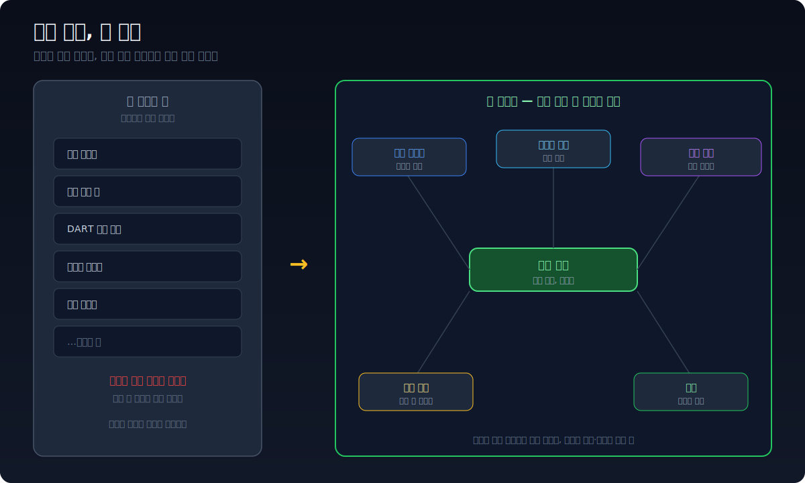
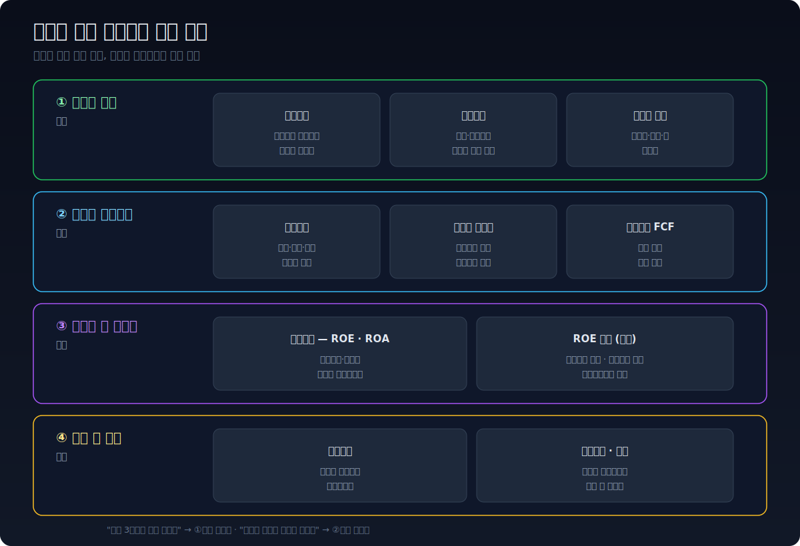
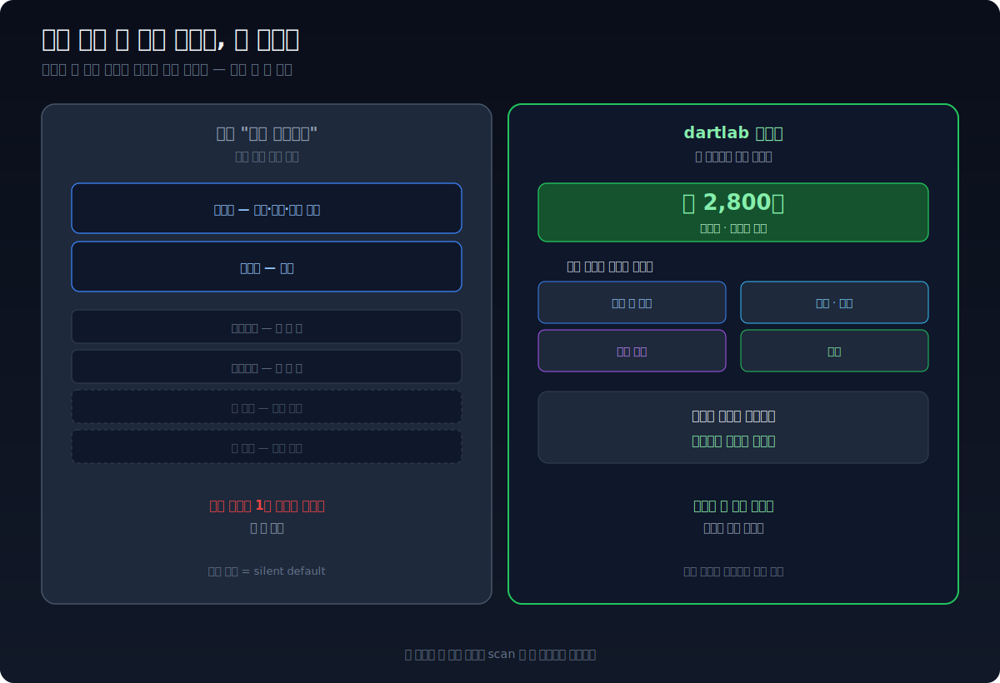
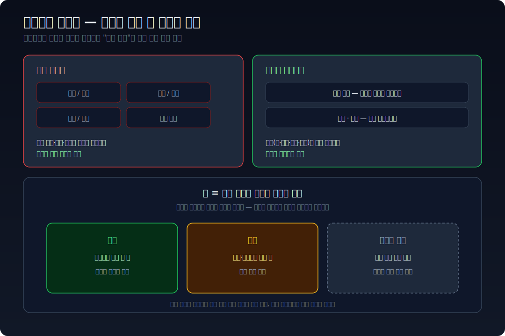
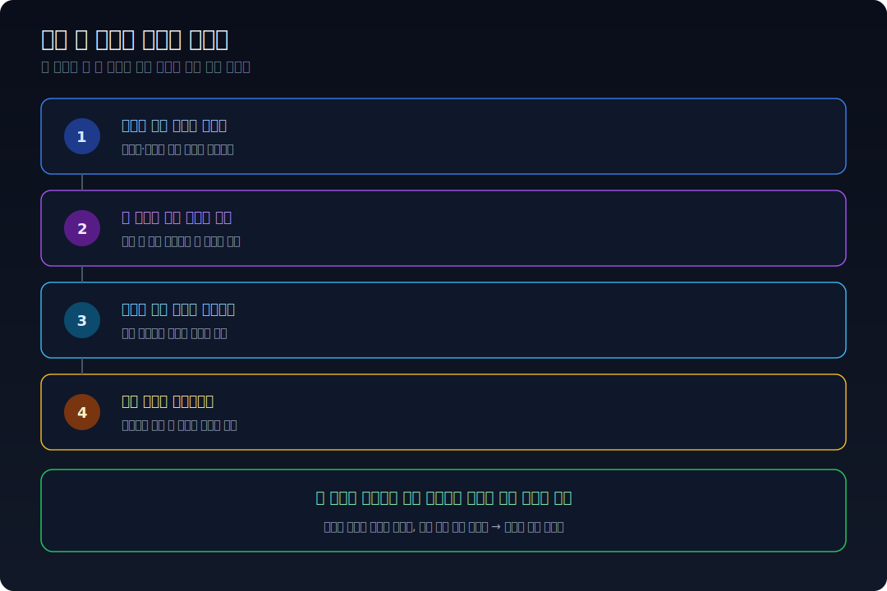

## 종목 하나를 판단하는 데 창이 몇 개 필요한가

한 회사를 제대로 보기로 마음먹은 날을 떠올려 보자. 재무는 한 사이트에서 열고, 주가 차트는 다른 앱, 공시 원문은 DART, 업종에서 어디쯤인지는 증권사 리포트, 신용은 또 다른 페이지. 탭 예닐곱 개를 띄워 놓고 이리저리 옮겨 다닌다. 그러다 보면 정작 머릿속에서 이 숫자들을 **겹쳐 보는** 일이 시작되기도 전에 맥락이 끊긴다.

이상한 건, 데이터가 없어서가 아니라는 점이다. 재무도, 차트도, 공시도, 신용도 — 다 어딘가에 있다. 없는 건 정보가 아니라, **이걸 한 화면에서 같은 종목 맥락으로 동시에 보는 자리**다.

## 한 화면에 같이 뜨는 것들

dartlab 터미널은 종목 하나를 열면 다섯 축이 같은 시간선 위에 한꺼번에 뜬다.

- **재무 시계열** — 손익·재무상태·현금흐름을 분기별로 길게. 한 분기만이 아니라 흐름으로.
- **라이브 차트** — 주가가 그 시점에 어떻게 반응했는지.
- **공시 레일** — 사업보고서·수시공시가 시간선 위 어디에 찍혔는지.
- **산업 위치** — 같은 업종 안에서 이 회사가 어디쯤인지.
- **신용** — 공시 데이터만으로 재현한 독립 신용 시각.

핵심은 "기능이 다섯 개"가 아니라 **읽는 방식**이다. 터미널은 스크롤해서 읽는 문서가 아니라 한눈에 스캔하는 *계기판*이다. 비행기 조종석이 고도·속도·연료를 한 시야에 두는 것처럼, 재무가 꺾인 자리에서 눈만 옮기면 그때의 공시와 주가 반응이 바로 옆에 있다. 찾으러 떠날 필요가 없다.

## 재무는 보는 순서대로 — 손익 → 현금 → 효율 → 체력

재무 화면은 계정을 잔뜩 늘어놓지 않는다. **전문가가 회사를 읽는 순서** 그대로 묶여 있다.

1. **얼마나 버나 (손익)** — 매출에서 이익까지 어디서 새는지(손익구조), 원가와 판관비가 매출을 먹는 정도(비용구조), 그래서 남는 이익률(GPM·OPM·NPM) 추이.
2. **이익이 진짜인가 (현금)** — 영업·투자·재무 현금흐름, 순이익이 실제 현금으로 바뀌는지(이익의 현금화), 쓰고 남는 잉여현금(FCF).
3. **자본을 잘 굴리나 (효율)** — ROE·ROA, 그리고 그 ROE가 마진에서 왔는지 회전에서 왔는지 레버리지에서 왔는지(듀폰 분해).
4. **버틸 수 있나 (체력)** — 자산이 무엇으로 구성됐는지, 부채와 유동성으로 버틸 수 있는지(레버리지).

이 순서가 그대로 화면 흐름이다. "매출이 3배인데 이익은 제자리"인 회사는 1번에서 걸리고, "이익은 느는데 현금은 마르는" 회사는 2번에서 걸린다. 숫자를 외울 필요 없이, 어디서 걸리는지만 보면 된다.

## 시총 상위 몇 개가 아니라, 전 상장사

대부분의 "분석 대시보드"는 시가총액 상위 몇십 개만 깊게 보여준다. 그 바깥은 표 한 줄짜리거나 아예 없다. 터미널은 반대다. **전 상장사(약 2,800사)가 같은 깊이로 열린다.** 코스피·코스닥 어느 구석의 회사든, 대형주와 똑같은 재무 전 기간·공시·차트·산업·신용을 펼친다. ([전 종목을 한 줄로 꺼내는 scan](/blog/scan-market-finance) 이 그 데이터의 바닥이다.)

관심이 가는 회사가 늘 1등 기업인 건 아니다. 남들이 안 보는 종목을 남들과 같은 도구로 볼 수 있다는 게, 사실 더 큰 차이다.

## 판정하지 않는다 — 색은 증거지 방향이 아니다

터미널은 "매수"도 "매도"도, "수혜주"도 찍지 않는다. 이건 기능이 빠진 게 아니라 **정책**이다. 블룸버그가 수익률 곡선을 보여주되 "지금 사라"고 적지 않는 것과 같다. 곡선·분포·국면을 그려서 보여주고, 판단은 보는 사람이 한다.

그래서 색도 분석 방향이 아니라 **증거의 상태**를 가리킨다. 어디가 실측이고 어디가 추정인지, 어느 구간은 데이터가 아예 없는지를 화면에 그대로 드러낸다. 빈칸을 그럴듯한 값으로 메우지 않는다. 어떤 숫자가 추정인지 알고 보는 것과 모르고 보는 것은, 같은 화면이라도 전혀 다른 판단을 낳는다.

## 열 때마다, 지금의 숫자

터미널은 미리 만들어 둔 화면을 꺼내 보여주는 게 아니다. 회사를 여는 순간 그 시점의 공개 데이터로 화면을 채운다. 어제 숫자가 아니라 **지금 숫자**다. 새 공시가 올라오면 다음에 열 때 이미 반영돼 있다.

## 무료로, 브라우저에서 바로

여기까지가 따로 설치할 것도, 로그인할 것도 없이 **브라우저에서 그대로** 도는 바닥이다. 무거운 서버 연산에 기대지 않고 공개 데이터와 브라우저 계산만으로 한 종목을 다 펼친다. 누구나 받는 이 바닥이 먼저고, 무거운·실시간·AI 기능은 그 위에 얹히는 상위 기능일 뿐이다. 계기의 질은 바닥에서부터 같다.

## 그래서, 다음에 종목을 열 때

터미널을 한 번 써보고 나면 남는 건 도구가 아니라 **순서**다. 한 회사를 볼 때 재무가 꺾인 자리에서 공시로, 공시에서 주가 반응으로, 다시 업종 안에서의 위치로 — 무엇을 어떤 순서로 겹쳐 봐야 하는지. 이 순서는 터미널이 없는 곳에서도 종목을 보는 방식이 된다.

그리고 그렇게 한 화면에서 찾아낸 발견은, 대개 혼자 보기 아깝다. 긴 글을 쓸 시간은 없는데 이 회사 이야기는 지금 누군가에게 보내고 싶을 때 — 그 화면을 **글 없이 카드 한 묶음으로 만들어 공유하는 법**은 [다음 글](/blog/cards-publish)에서 이어진다.
