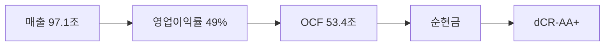

> ⚠️ **면책**: 본 보고서는 dartlab dCR v4.0 방법론에 따라 공시 데이터만으로 작성되었습니다. 제도권 신용등급과 다를 수 있으며, 투자 권유가 아닙니다. [방법론](https://github.com/eddmpython/dartlab/blob/master/src/dartlab/analysis/CREDIT.md)

> **dCR-AA+** | 투자적격 상위+ | 2026-04-05 | 방법론 v4.0

## 1. 등급 요약

| 항목 | 값 |
|------|------|
| **신용등급** | **dCR-AA+** (투자적격 상위+) |
| 카테고리 | 최우량 (투자적격) |
| 종합 점수 | 4.5 / 100 |
| 부도확률(1Y) | 0.01% |
| 현금흐름등급 | eCR-3 |
| 등급 전망 | 긍정적 |
| 업종 | IT |
| 기준 기간 | 2025Q4 |

```
건전도: [███████████████████░] 95/100
```

## 2. Executive Summary

SK하이닉스는 매출 97.1조 규모의 IT 기업으로, **dCR-AA+** (건전도 95/100) 등급이다.

dCR-AA+는 [매출 97.1조원 규모]에서 출발하는 [영업이익률 49%의 수익 기반]이 [영업활동현금흐름 53.4조원의 현금창출력]를 유지하게 하고, [부채 부담 없는 순현금 구조]가 등급을 뒷받침하는 구조를 반영한다. 핵심 강점인 채무상환능력, 자본구조, 유동성, 현금흐름, 재무신뢰성, 공시리스크이 업황 변동 시에도 등급을 방어하는 완충 역할을 한다.

**인과 연결**: 인과 요약: 매출 97.1조원 → 영업이익률 49%로 수익성이 높아, EBITDA 47.2조원 이상의 현금(영업활동현금흐름 53.4조원)을 창출하고 → 순현금 포지션을 유지한다. 종합 dCR-AA+.

## 3. 재무 하이라이트

| 지표 | 값 | 전년비 |
|------|-----:|------:|
| 매출 | 97.1조 | +46.8% |
| 영업이익 | 47.2조 | +101.2% |
| EBITDA | 47.2조 | - |
| 영업현금흐름 | 53.4조 | - |
| 순차입금 | 순현금 | - |
| Debt/EBITDA | 0.0x | - |

## 4. 사업 분석

### 4.1 기업 개요

- 섹터: IT > 반도체와반도체장비
- 주요제품: 반도체,컴퓨터,통신기기 제조,도매
- 매출 규모: 97.1조


> **사업보고서 발췌**: "II. 사업의 내용 1. 사업의 개요 당사는 경기도 이천시에 위치한 본사를 거점으로 4개의 생산기지와 3개의 연구개발법인 및 미국, 중국, 싱가포르, 대만, 홍콩 등 판매법인과 사무소를 운영하고 있는 글로벌 반도체 기업입니다. 당사 및 당사의 종속기업의 주력 제품은 DRAM 및 NAND를 중심으로 하는 메모리 반도체이며, Foundry 사업도 병행하고 있습"

## 5. 등급 근거 상세

dCR-AA+는 [매출 97.1조원 규모]에서 출발하는 [영업이익률 49%의 수익 기반]이 [영업활동현금흐름 53.4조원의 현금창출력]를 유지하게 하고, [부채 부담 없는 순현금 구조]가 등급을 뒷받침하는 구조를 반영한다. 핵심 강점인 채무상환능력, 자본구조, 유동성, 현금흐름, 재무신뢰성, 공시리스크이 업황 변동 시에도 등급을 방어하는 완충 역할을 한다. 다만 사업안정성은 등급 하방 압력 요인으로 모니터링이 필요하다.

**인과 요약: 매출 97.1조원 → 영업이익률 49%로 수익성이 높아, EBITDA 47.2조원 이상의 현금(영업활동현금흐름 53.4조원)을 창출하고 → 순현금 포지션을 유지한다. 종합 dCR-AA+.**

### 등급 결정 요인 분해

| 축 | 점수 | 가중치 | 기여도 | 비고 |
|------|-----:|------:|------:|------|
| 채무상환능력 | 0 | 25% | 0.0점 | 우수 |
| 자본구조 | 3 | 20% | 0.6점 | 우수 |
| 유동성 | 6 | 15% | 0.8점 | 우수 |
| 현금흐름 | 0 | 15% | 0.0점 | 우수 |
| 사업안정성 | 28 | 10% | 2.8점 | 보통 ← 등급 하방 압력 |
| 재무신뢰성 | 0 | 10% | 0.0점 | 우수 |
| **합계** | | | **4.5점** | **→ dCR-AA+** |

### 강점
- **채무상환능력**: 채무상환능력은 IT 업종 기준 매우 우수하다.
- **자본구조**: 자본구조는 매우 건전하다.
- **유동성**: 유동성은 매우 충분하다.
- **현금흐름**: 현금흐름 창출 능력은 우수하다.
- **재무신뢰성**: 재무 신뢰성은 우수하다.
- **공시리스크**: 공시 리스크 신호가 감지되지 않았다.

### 약점
- **사업안정성**: 사업 안정성은 변동성이 존재한다.




## 6. 재무 분석

| 축 | 비중 | 판정 | 점수 |
|------|:---:|:---:|------|
| 채무상환능력 | 25% | **우수** | ██████████ 0/100 |
| 자본구조 | 20% | **우수** | █████████░ 3/100 |
| 유동성 | 15% | **우수** | █████████░ 6/100 |
| 현금흐름 | 15% | **우수** | ██████████ 0/100 |
| 사업안정성 | 10% | 보통 | ███████░░░ 28/100 |
| 재무신뢰성 | 10% | **우수** | ██████████ 0/100 |
| 공시리스크 | 5% | - | ░░░░░░░░░░ 평가 불가 |

### 6.* 차입금 구성

| 구분 | 금액 | 비중 |
|------|-----:|-----:|
| 단기차입금 | 2.4조 | 10.8% |
| 유동성장기차입금 | 1.5조 | 6.6% |
| 유동성사채 | 4.3조 | 19.3% |
| 장기차입금 | 2.9조 | 12.9% |
| 사채 | 11.2조 | 50.4% |
| **합계** | **22.2조** | **100%** |

### 6.1 채무상환능력 (25%)

**판정: 우수** (0점/100)

채무상환능력은 IT 업종 기준 매우 우수하다. 매출 97.1조원 기반 EBITDA 47.2조원을 창출한다. 이자 부담이 사실상 없어 무차입에 준하는 재무구조다. Debt/EBITDA 0.0배로 차입금을 1년 내 상환 가능한 수준이다.

| 지표 | 점수 | 판정 |
|------|:---:|:---:|
| FFO/총차입금 | 0 | 우수 |
| Debt/EBITDA | 0 | 우수 |
| FOCF/Debt | 0 | 우수 |
| EBITDA/이자비용 | 0 | 우수 |

### 6.2 자본구조 (20%)

**판정: 우수** (3점/100)

자본구조는 매우 건전하다. 부채비율 46%로 재무구조가 매우 보수적이다. 순차입금/EBITDA 0.0배로 실질 부채 부담이 낮다.

| 지표 | 점수 | 판정 |
|------|:---:|:---:|
| 부채비율 | 6 | 우수 |
| 차입금의존도 | 0 | 우수 |
| 순차입금/EBITDA | 3 | 우수 |

### 6.3 유동성 (15%)

**판정: 우수** (6점/100)

유동성은 매우 충분하다. 유동비율 186%로 단기 유동성이 양호하다. 현금비율 40%로 즉시 동원 가능한 현금이 충분하다.

| 지표 | 점수 | 판정 |
|------|:---:|:---:|
| 유동비율 | 7 | 우수 |
| 현금비율 | 4 | 우수 |

### 6.4 현금흐름 (15%)

**판정: 우수** (0점/100)

현금흐름 창출 능력은 우수하다. 영업활동현금흐름/매출 54.9%로 매출 대비 현금 창출력이 우수하다. 투자 이후에도 잉여현금흐름(잉여현금흐름)이 양수로 자체 성장 여력이 있다. 영업현금흐름이 3기 연속 양수로 안정적이다.

| 지표 | 점수 | 판정 |
|------|:---:|:---:|
| 영업활동현금흐름/매출 | 0 | 우수 |
| 잉여현금흐름/매출 | 0 | 우수 |
| 영업활동현금흐름추세 | 0 | 우수 |

### 6.5 사업안정성 (10%)

**판정: 주의** (28점/100)

사업 안정성은 변동성이 존재한다. 매출 변동계수 45.4%로 실적 변동성이 크다. 매출 규모 97조원으로 대형 기업의 사업 안정성을 보유한다.

| 지표 | 점수 | 판정 |
|------|:---:|:---:|
| 매출안정성 | 50 | 주의 |
| 이익안정성 | 35 | 보통 |
| 규모 | 0 | 우수 |

### 6.6 재무신뢰성 (10%)

**판정: 우수** (0점/100)

재무 신뢰성은 우수하다. Piotroski F-Score 8/9로 재무 펀더멘탈이 강건하다. 감사의견은 적정으로 재무제표 신뢰성에 문제가 없다.

| 지표 | 점수 | 판정 |
|------|:---:|:---:|
| Piotroski F | 0 | 우수 |
| 감사의견 | 0 | 우수 |

### 6.7 공시리스크 (5%)

**판정: 우수** (평가 불가)

공시 리스크 신호가 감지되지 않았다. scan 데이터 범위 내 특이 신호 없음.

## 7. 5개년 재무 시계열

| 기간 | 매출 | 영업이익 | EBITDA/이자 | Debt/EBITDA | 부채비율 | 유동비율 | 영업활동현금흐름/매출 |
|------|------|------|------|------|------|------|------|
| 2025Q4 | 97.1조 | 47.2조 | 무차입 | 0.0x → | 46% ↓ | 186% ↑ | 54.9% |
| 2024Q4 | 66.2조 | 23.5조 | 무차입 | 0.0x | 62% ↓ | 169% ↑ | 45.0% |
| 2023Q4 | 32.8조 | -7.7조 | - | - | 88% ↑ | 145% → | 13.1% |
| 2022Q4 | 44.6조 | 6.8조 | 무차입 | 0.0x → | 64% ↑ | 145% ↓ | 33.1% |
| 2021Q4 | 43.0조 | 12.4조 | 무차입 | 0.0x | 55% | 182% | 46.0% |

## 8. 리스크 진단

### 8.1 감사 리스크

- 감사의견: **적정**
  - 적정 의견 **8기 연속** 유지, 재무제표 신뢰도 양호

### 8.2 우발부채

- 우발부채 만성화 신호 없음

### 8.3 공시 리스크 키워드

- 리스크 키워드(횡령/배임/과징금 등) 감지 없음

### 8.4 구조 변화

- 감사인/계열 구조 변화 없음

### 8.5 전기 대비 주요 변화

- **종속회사**: 전기 대비 대폭 변화 (변화 블록 1개)
- **계열사현황**: 전기 대비 대폭 변화 (변화 블록 1개)
- **investmentInOtherDetail**: 전기 대비 대폭 변화 (변화 블록 1개)

## 9. 등급 전망

현재 전망: **긍정적**

### 하향 트리거
- 대규모 차입으로 이자보상배율이 5배 이하로 하락
- 부채비율이 현 46%에서 92% 이상으로 증가
- Debt/EBITDA가 현 0.0배에서 5배 이상으로 악화

## 10. 신평사 등급 대조

| 기관 | 등급 | dartlab | 차이 |
|------|------|---------|------|
| KIS | AA- | dCR-AA+ | 2n |
| KR | AA- | dCR-AA+ | 2n |

평균 괴리: 2.0 notch

### 동의
- KIS AA-등급은 dartlab 정량 분석 결과(dCR-AA+, 점수 4.5)와 ±2 notch 범위로 합리적이다.
- KR AA-등급은 dartlab 정량 분석 결과(dCR-AA+, 점수 4.5)와 ±2 notch 범위로 합리적이다.


## 11. 등급 괴리 분석

dartlab dCR 등급이 외부 신평사 등급과 다를 수 있는 이유:

- dartlab dCR은 공시 정량 데이터 기반. 시장 지위, 경영진, 그룹 지원 등 정성 요소는 미반영

## 12. 방법론 참조

- dartlab 독립 신용분석(dCR) v4.0
- 방법론 상세: [src/dartlab/analysis/CREDIT.md](https://github.com/eddmpython/dartlab/blob/master/src/dartlab/analysis/CREDIT.md)
- 발행일: 2026-04-05
