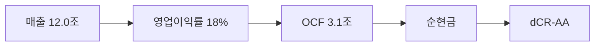

> ⚠️ **면책**: 본 보고서는 dartlab dCR v4.0 방법론에 따라 공시 데이터만으로 작성되었습니다. 제도권 신용등급과 다를 수 있으며, 투자 권유가 아닙니다. [방법론](https://github.com/eddmpython/dartlab/blob/master/src/dartlab/analysis/CREDIT.md)

> **dCR-AA** | 투자적격 상위 | 2026-04-05 | 방법론 v4.0

## 1. 등급 요약

| 항목 | 값 |
|------|------|
| **신용등급** | **dCR-AA** (투자적격 상위) |
| 카테고리 | 최우량 (투자적격) |
| 종합 점수 | 5.5 / 100 |
| 부도확률(1Y) | 0.02% |
| 현금흐름등급 | eCR-1 |
| 등급 전망 | 안정적 |
| 업종 | 커뮤니케이션서비스 (지주사조정) |
| 기준 기간 | 2025Q4 |
| 구조 | 지주사 |

```
건전도: [██████████████████░░] 94/100
```

## 2. Executive Summary

NAVER은 매출 12.0조 규모의 커뮤니케이션서비스 기업으로, **dCR-AA** (건전도 94/100) 등급이다.

dCR-AA는 [매출 12.0조원 규모]에서 출발하는 [영업이익률 18%의 수익 기반]이 [OCF 3.1조원의 현금창출력]를 유지하게 하고, [부채 부담 없는 순현금 구조]가 등급을 뒷받침하는 구조를 반영한다. 핵심 강점인 채무상환능력, 자본구조, 유동성, 현금흐름, 재무신뢰성, 공시리스크이 등급의 안정적 기반이다.

**인과 연결**: 인과 요약: 매출 12.0조원 → 영업이익률 18%로 수익성이 높아, EBITDA 2.2조원 이상의 현금(OCF 3.1조원)을 창출하고 → 순현금 포지션을 유지한다. 종합 dCR-AA.

## 3. 재무 하이라이트

| 지표 | 값 | 전년비 |
|------|-----:|------:|
| 매출 | 12.0조 | +12.1% |
| 영업이익 | 2.2조 | +11.6% |
| EBITDA | 2.2조 | - |
| 영업현금흐름 | 3.1조 | - |
| 순차입금 | 순현금 | - |
| Debt/EBITDA | 0.5x | ↓개선 |

## 4. 사업 분석

### 4.1 기업 개요

- 섹터: 커뮤니케이션서비스 > 인터넷과카탈로그소매
- 주요제품: 포털 서비스 및 온라인 광고
- 매출 규모: 12.0조


> **사업보고서 발췌**: "II. 사업의 내용 1. 사업의 개요 '팀네이버'는 대한민국의 대표적인 IT 테크 기업으로 끊임없는 도전과 성장을 이뤄가고 있습니다. 첨단의 기술을 일상의 서비스에 담아 사용자에게 새로운 연결의 경험을 선보이는 도전을 멈추지 않음으로써, 다양한 기회와 가능성을 열어 나가고 네이버를 둘러싼 모든 이해관계자들에게 차별화된 가치를 제공하고 있습니다. 네이버를 둘"

### 4.2 부문별 매출 구성

| 부문 | 매출 | 비중 |
|------|-----:|-----:|
| 핀테크 | 5.4조 | 45.2% |
| 클라우드 | 3.7조 | 30.8% |
| 콘텐츠 | 2.9조 | 24.0% |

## 5. 등급 근거 상세

dCR-AA는 [매출 12.0조원 규모]에서 출발하는 [영업이익률 18%의 수익 기반]이 [OCF 3.1조원의 현금창출력]를 유지하게 하고, [부채 부담 없는 순현금 구조]가 등급을 뒷받침하는 구조를 반영한다. 핵심 강점인 채무상환능력, 자본구조, 유동성, 현금흐름, 재무신뢰성, 공시리스크이 등급의 안정적 기반이다. 지주사 구조로 지분법손익이 실적에 영향을 미친다.

**인과 요약: 매출 12.0조원 → 영업이익률 18%로 수익성이 높아, EBITDA 2.2조원 이상의 현금(OCF 3.1조원)을 창출하고 → 순현금 포지션을 유지한다. 종합 dCR-AA.**

### 등급 결정 요인 분해

| 축 | 점수 | 가중치 | 기여도 | 비고 |
|------|-----:|------:|------:|------|
| 채무상환능력 | 1 | 15% | 0.1점 | 우수 |
| 자본구조 | 1 | 25% | 0.3점 | 우수 |
| 유동성 | 8 | 15% | 1.1점 | 우수 |
| 현금흐름 | 2 | 15% | 0.3점 | 우수 |
| 사업안정성 | 16 | 15% | 2.4점 | 양호 ← 등급 하방 압력 |
| 재무신뢰성 | 5 | 10% | 0.5점 | 우수 |
| **합계** | | | **5.5점** | **→ dCR-AA** |

### 강점
- **채무상환능력**: 채무상환능력은 커뮤니케이션서비스 (지주사조정) 업종 기준 매우 우수하다.
- **자본구조**: 자본구조는 매우 건전하다.
- **유동성**: 유동성은 매우 충분하다.
- **현금흐름**: 현금흐름 창출 능력은 우수하다.
- **재무신뢰성**: 재무 신뢰성은 우수하다.
- **공시리스크**: 공시 리스크 신호가 감지되지 않았다.

### 양호
- **사업안정성**: 사업 안정성은 양호한 수준이다.




## 6. 재무 분석

| 축 | 비중 | 판정 | 점수 |
|------|:---:|:---:|------|
| 채무상환능력 | 15% | **우수** | █████████░ 1/100 |
| 자본구조 | 25% | **우수** | █████████░ 1/100 |
| 유동성 | 15% | **우수** | █████████░ 8/100 |
| 현금흐름 | 15% | **우수** | █████████░ 2/100 |
| 사업안정성 | 15% | 양호 | ████████░░ 16/100 |
| 재무신뢰성 | 10% | **우수** | █████████░ 5/100 |
| 공시리스크 | 5% | - | ░░░░░░░░░░ 평가 불가 |

### 6.* 차입금 구성

| 구분 | 금액 | 비중 |
|------|-----:|-----:|
| 차입금명칭 | 4,500억 | 0.0% |
| 네이버-제 5-1회공모사채 | 1,700억 | 0.0% |
| 네이버-제 5-2회공모사채 | 300억 | 0.0% |
| 네이버-외화선순위무담보사채_2 | 140억 | 0.0% |
| 네이버-외화선순위무담보사채_3 | 15억 | 0.0% |
| 네이버-외화선순위무담보사채_4 | 15억 | 0.0% |
| 네이버-외화선순위무담보사채_5 | 30억 | 0.0% |
| 네이버-제 4-2회공모사채 | 4,500억 | 0.0% |
| 단기차입금및유동성장기차입금 | 1,929억 | 0.0% |
| 장기차입금 | 9,936억 | 0.0% |
| 차입금, 외화금액 | 1,122억 | 0.0% |
| 외화대출 | 506억 | 0.0% |
| 원화대출 | 500억 | 0.0% |
| 유동성장기차입금 | 300억 | 0.0% |
| 단기&cr;차입금 | 20억 | 0.0% |
| 유동성장기&cr;차입금 | 450억 | 0.0% |
| 외화단기차입금 | 11961820.0조 | 93.8% |
| Mizuho Corporate Bank. | 782119.0조 | 6.1% |
| Shinhan Bank Japan(*) | 8803.8조 | 0.1% |
| 하나은행 | 1840.3조 | 0.0% |
| 계 | 2,085억 | 0.0% |
| **합계** | **12754585.9조** | **100%** |

### 6.1 채무상환능력 (15%)

**판정: 우수** (1점/100)

채무상환능력은 커뮤니케이션서비스 (지주사조정) 업종 기준 매우 우수하다. 매출 12.0조원 기반 EBITDA 2.2조원을 창출한다. 총차입금 1.0조원 대비 이자 부담이 사실상 없어 무차입에 준하는 재무구조다. Debt/EBITDA 0.5배로 차입금을 1년 내 상환 가능한 수준이다. FFO/총차입금 308%로 우수한 내부 현금 창출력을 보인다.

| 지표 | 점수 | 판정 |
|------|:---:|:---:|
| FFO/총차입금 | 0 | 우수 |
| Debt/EBITDA | 1 | 우수 |
| FOCF/Debt | 0 | 우수 |
| EBITDA/이자비용 | 0 | 우수 |

### 6.2 자본구조 (25%)

**판정: 우수** (1점/100)

자본구조는 매우 건전하다. 부채비율 42%로 재무구조가 매우 보수적이다. 순차입금이 마이너스(순현금 포지션)로 실질적 부채 부담이 없다.

| 지표 | 점수 | 판정 |
|------|:---:|:---:|
| 부채비율 | 2 | 우수 |
| 차입금의존도 | 1 | 우수 |
| 순차입금/EBITDA | 0 | 우수 |

### 6.3 유동성 (15%)

**판정: 우수** (8점/100)

유동성은 매우 충분하다. 유동비율 136%로 단기 유동성이 적정하다. 현금비율 75%로 즉시 동원 가능한 현금이 충분하다.

| 지표 | 점수 | 판정 |
|------|:---:|:---:|
| 유동비율 | 16 | 양호 |
| 현금비율 | 0 | 우수 |
| 단기차입금비중 | 7 | 우수 |

### 6.4 현금흐름 (15%)

**판정: 우수** (2점/100)

현금흐름 창출 능력은 우수하다. OCF/매출 25.7%로 매출 대비 현금 창출력이 우수하다. 투자 이후에도 잉여현금흐름(FCF)이 양수로 자체 성장 여력이 있다. 영업현금흐름이 3기 연속 양수로 안정적이다.

| 지표 | 점수 | 판정 |
|------|:---:|:---:|
| OCF/매출 | 0 | 우수 |
| FCF/매출 | 0 | 우수 |
| OCF추세 | 0 | 우수 |

### 6.5 사업안정성 (15%)

**판정: 양호** (16점/100)

사업 안정성은 양호한 수준이다. 매출 변동계수 26.2%로 실적 변동성이 크다. 매출 규모 12조원으로 대형 기업의 사업 안정성을 보유한다.

| 지표 | 점수 | 판정 |
|------|:---:|:---:|
| 매출안정성 | 37 | 보통 |
| 이익안정성 | 5 | 우수 |
| 규모 | 5 | 우수 |

### 6.6 재무신뢰성 (10%)

**판정: 우수** (5점/100)

재무 신뢰성은 우수하다. 감사의견은 적정으로 재무제표 신뢰성에 문제가 없다.

| 지표 | 점수 | 판정 |
|------|:---:|:---:|
| Piotroski F | 10 | 양호 |
| 감사의견 | 0 | 우수 |

### 6.7 공시리스크 (5%)

**판정: 우수** (평가 불가)

공시 리스크 신호가 감지되지 않았다. scan 데이터 범위 내 특이 신호 없음.

## 7. 5개년 재무 시계열

| 기간 | 매출 | 영업이익 | EBITDA/이자 | Debt/EBITDA | 부채비율 | 유동비율 | OCF/매출 |
|------|------|------|------|------|------|------|------|
| 2025Q4 | 12.0조 | 2.2조 | 무차입 | 0.5x ↓ | 42% → | 136% ↓ | 25.7% |
| 2024Q4 | 10.7조 | 2.0조 | 무차입 | 0.5x ↓ | 41% ↓ | 154% ↑ | 24.1% |
| 2023Q4 | 9.7조 | 1.5조 | 무차입 | 0.9x ↓ | 47% ↑ | 111% ↓ | 20.7% |
| 2022Q4 | 8.2조 | 1.3조 | 무차입 | 1.3x ↓ | 45% ↑ | 118% ↓ | 17.7% |
| 2021Q4 | 6.8조 | 1.3조 | 무차입 | 1.5x | 40% | 141% | 20.2% |

## 8. 리스크 진단

### 8.1 감사 리스크

- 감사의견: **적정**
  - 적정 의견 **8기 연속** 유지, 재무제표 신뢰도 양호

### 8.2 우발부채

- 우발부채 만성화 신호 없음

### 8.3 공시 리스크 키워드

- 리스크 키워드(횡령/배임/과징금 등) 감지 없음

### 8.4 구조 변화

- 감사인/계열 구조 변화 없음

### 8.5 전기 대비 주요 변화

- **공시변경사항**: 전기 대비 대폭 변화 (변화 블록 1개)
- **종속회사**: 전기 대비 대폭 변화 (변화 블록 1개)
- **계열사현황**: 전기 대비 대폭 변화 (변화 블록 1개)

## 9. 등급 전망

현재 전망: **안정적**

### 하향 트리거
- 대규모 차입으로 이자보상배율이 5배 이하로 하락
- 부채비율이 현 42%에서 84% 이상으로 증가
- Debt/EBITDA가 현 0.5배에서 5배 이상으로 악화

## 10. 신평사 등급 대조

| 기관 | 등급 | dartlab | 차이 |
|------|------|---------|------|
| KIS | AA+ | dCR-AA | 1n |
| NICE | AA+ | dCR-AA | 1n |

평균 괴리: 1.0 notch

### 동의
- KIS AA+등급은 dartlab 정량 분석 결과(dCR-AA, 점수 5.5)와 ±1 notch 범위로 합리적이다.
- NICE AA+등급은 dartlab 정량 분석 결과(dCR-AA, 점수 5.5)와 ±1 notch 범위로 합리적이다.

### 구조적 참고
- 지주사 구조 — 지분법손익 비중이 크고 자체 매출이 제한적이어서 영업 지표의 해석에 주의가 필요하다.


## 11. 등급 괴리 분석

외부 신평사 등급과 dartlab dCR 등급이 일치합니다.
이는 공시 재무 데이터만으로도 이 기업의 신용 건전성을 정확히 포착할 수 있음을 의미합니다.

주요 등급 지지 요인:
- **채무상환능력**: 채무상환능력은 커뮤니케이션서비스 (지주사조정) 업종 기준 매우 우수하다.
- **자본구조**: 자본구조는 매우 건전하다.
- **유동성**: 유동성은 매우 충분하다.

dartlab dCR 등급이 외부 신평사 등급과 다를 수 있는 이유:

- 지주사 연결 구조 — 자회사 부채가 연결 레버리지에 반영
- dartlab dCR은 공시 정량 데이터 기반. 시장 지위, 경영진, 그룹 지원 등 정성 요소는 미반영

## 12. 별도재무제표 비교

연결 재무제표에 자회사 부채가 포함되어 왜곡될 수 있으므로, 별도(모회사) 재무를 함께 확인합니다.

| 지표 | 연결 | 별도 |
| --- | ---: | ---: |
| D/EBITDA | 0.5x | 0.2x |
| 부채비율 | 42% | 29% |
| 총차입금 | 1.0조 | 4,822억 |

## 13. 방법론 참조

- dartlab 독립 신용분석(dCR) v4.0
- 방법론 상세: [src/dartlab/analysis/CREDIT.md](https://github.com/eddmpython/dartlab/blob/master/src/dartlab/analysis/CREDIT.md)
- 발행일: 2026-04-05
