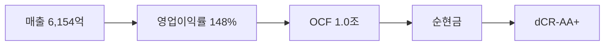

> ⚠️ **면책**: 본 보고서는 dartlab dCR v4.0 방법론에 따라 공시 데이터만으로 작성되었습니다. 제도권 신용등급과 다를 수 있으며, 투자 권유가 아닙니다. [방법론](https://github.com/eddmpython/dartlab/blob/master/src/dartlab/analysis/CREDIT.md)

> **dCR-AA+** | 투자적격 상위+ | 2026-04-05 | 방법론 v4.0

## 1. 등급 요약

| 항목 | 값 |
|------|------|
| **신용등급** | **dCR-AA+** (투자적격 상위+) |
| 카테고리 | 최우량 (투자적격) |
| 종합 점수 | 5.0 / 100 |
| 부도확률(1Y) | 0.01% |
| 현금흐름등급 | eCR-1 |
| 등급 전망 | 부정적 |
| 업종 | IT (지주사조정) |
| 기준 기간 | 2025Q4 |
| 구조 | 지주사 |

```
건전도: [███████████████████░] 95/100
```

## 2. Executive Summary

LG은 매출 6,154억 규모의 IT 기업으로, **dCR-AA+** (건전도 95/100) 등급이다.

dCR-AA+는 [매출 6,154억원 규모]에서 출발하는 [영업이익률 148%의 수익 기반]이 [영업활동현금흐름 1.0조원의 현금창출력]를 유지하게 하고, [부채 부담 없는 순현금 구조]가 등급을 뒷받침하는 구조를 반영한다. 핵심 강점인 채무상환능력, 자본구조, 유동성, 현금흐름, 공시리스크이 업황 변동 시에도 등급을 방어하는 완충 역할을 한다.

**인과 연결**: 인과 요약: 지주사로서 자체 매출 6,154억원, 자회사 배당 등으로 영업활동현금흐름 1.0조원 확보, 순현금 포지션으로 재무 안정성이 높다. 종합 dCR-AA+.

## 3. 재무 하이라이트

| 지표 | 값 | 전년비 |
|------|-----:|------:|
| 매출 | 6,154억 | +2.7% |
| 영업이익 | 9,122억 | -5.7% |
| EBITDA | 9,122억 | - |
| 영업현금흐름 | 1.0조 | - |
| 순차입금 | 순현금 | - |
| Debt/EBITDA | 0.2x | ↓개선 |

## 4. 사업 분석

### 4.1 기업 개요

- 섹터: IT > 기술하드웨어와장비
- 주요제품: 지주회사
- 매출 규모: 6,154억


> **사업보고서 발췌**: "II. 사업의 내용 1. 사업의 개요 당사는 '독점규제 및 공정거래에 관한 법률'상 지주회사로서 공시서류 작성 기준일 현재 LG전자(주), (주)LG화학, (주)LG유플러스를 포함하여 총 9개의 국내 자회사를 보유하고 있습니다. 당사의 영업수익(별도 재무제표 기준)은 자회사 및 기타 투자회사로부터의 배당수익, 상표권 사용수익, 임대수익 등으로 구성되어 있습"

## 5. 등급 근거 상세

dCR-AA+는 [매출 6,154억원 규모]에서 출발하는 [영업이익률 148%의 수익 기반]이 [영업활동현금흐름 1.0조원의 현금창출력]를 유지하게 하고, [부채 부담 없는 순현금 구조]가 등급을 뒷받침하는 구조를 반영한다. 핵심 강점인 채무상환능력, 자본구조, 유동성, 현금흐름, 공시리스크이 업황 변동 시에도 등급을 방어하는 완충 역할을 한다. 다만 사업안정성은 등급 하방 압력 요인으로 모니터링이 필요하다. 지주사 구조로 지분법손익이 실적에 영향을 미친다.

**인과 요약: 지주사로서 자체 매출 6,154억원, 자회사 배당 등으로 영업활동현금흐름 1.0조원 확보, 순현금 포지션으로 재무 안정성이 높다. 종합 dCR-AA+.**

### 등급 결정 요인 분해

| 축 | 점수 | 가중치 | 기여도 | 비고 |
|------|-----:|------:|------:|------|
| 채무상환능력 | 0 | 15% | 0.0점 | 우수 |
| 자본구조 | 0 | 25% | 0.0점 | 우수 |
| 유동성 | 1 | 15% | 0.1점 | 우수 |
| 현금흐름 | 0 | 15% | 0.0점 | 우수 |
| 사업안정성 | 39 | 15% | 5.8점 | 주의 ← 등급 하방 압력 |
| 재무신뢰성 | 12 | 10% | 1.2점 | 양호 |
| **합계** | | | **5.0점** | **→ dCR-AA+** |

### 강점
- **채무상환능력**: 채무상환능력은 IT (지주사조정) 업종 기준 매우 우수하다.
- **자본구조**: 자본구조는 매우 건전하다.
- **유동성**: 유동성은 매우 충분하다.
- **현금흐름**: 현금흐름 창출 능력은 우수하다.
- **공시리스크**: 공시 리스크 신호가 감지되지 않았다.

### 약점
- **사업안정성**: 사업 안정성은 변동성이 존재한다.

### 양호
- **재무신뢰성**: 재무 신뢰성은 양호하다.




## 6. 재무 분석

| 축 | 비중 | 판정 | 점수 |
|------|:---:|:---:|------|
| 채무상환능력 | 15% | **우수** | █████████░ 0/100 |
| 자본구조 | 25% | **우수** | █████████░ 0/100 |
| 유동성 | 15% | **우수** | █████████░ 1/100 |
| 현금흐름 | 15% | **우수** | ██████████ 0/100 |
| 사업안정성 | 15% | 보통 | ██████░░░░ 39/100 |
| 재무신뢰성 | 10% | 양호 | ████████░░ 12/100 |
| 공시리스크 | 5% | - | ░░░░░░░░░░ 평가 불가 |

### 6.* 차입금 구성

| 구분 | 금액 | 비중 |
|------|-----:|-----:|
| 장부금액 | 55억 | 3.1% |
| 당좌차월 | 39억 | 2.2% |
| 외화단기차입금 | 196억 | 11.0% |
| 차입금액 | 966억 | 54.2% |
| CP 발행 | 250억 | 14.0% |
| 매출채권의양도(*) | 265억 | 14.9% |
| Usance | 10억 | 0.6% |
| **합계** | **1,782억** | **100%** |

### 6.1 채무상환능력 (15%)

**판정: 우수** (0점/100)

채무상환능력은 IT (지주사조정) 업종 기준 매우 우수하다. 매출 6,154억원 기반 EBITDA 9,122억원을 창출한다. 이자보상배율 31.7배로 충분한 이자 지급 여력을 보유한다. Debt/EBITDA 0.2배로 차입금을 1년 내 상환 가능한 수준이다. FFO/총차입금 635%로 우수한 내부 현금 창출력을 보인다.

| 지표 | 점수 | 판정 |
|------|:---:|:---:|
| FFO/총차입금 | 0 | 우수 |
| Debt/EBITDA | 1 | 우수 |
| FOCF/Debt | 0 | 우수 |
| EBITDA/이자비용 | 0 | 우수 |

### 6.2 자본구조 (25%)

**판정: 우수** (0점/100)

자본구조는 매우 건전하다. 부채비율 12%로 재무구조가 매우 보수적이다. 순차입금이 마이너스(순현금 포지션)로 실질적 부채 부담이 없다.

| 지표 | 점수 | 판정 |
|------|:---:|:---:|
| 부채비율 | 0 | 우수 |
| 차입금의존도 | 0 | 우수 |
| 순차입금/EBITDA | 0 | 우수 |

### 6.3 유동성 (15%)

**판정: 우수** (1점/100)

유동성은 매우 충분하다. 유동비율 244%로 단기 유동성이 매우 우수하다. 현금비율 65%로 즉시 동원 가능한 현금이 충분하다.

| 지표 | 점수 | 판정 |
|------|:---:|:---:|
| 유동비율 | 3 | 우수 |
| 현금비율 | 0 | 우수 |
| 단기차입금비중 | 0 | 우수 |

### 6.4 현금흐름 (15%)

**판정: 우수** (0점/100)

현금흐름 창출 능력은 우수하다. 영업활동현금흐름/매출 164.9%로 자체 매출 대비 현금흐름이 매우 크다. 이는 자회사 배당수입 등 영업외 현금이 포함된 것으로 판단된다. 투자 이후에도 잉여현금흐름(잉여현금흐름)이 양수로 자체 성장 여력이 있다. 영업현금흐름이 3기 연속 양수로 안정적이다.

| 지표 | 점수 | 판정 |
|------|:---:|:---:|
| 영업활동현금흐름/매출 | 0 | 우수 |
| 잉여현금흐름/매출 | 0 | 우수 |
| 영업활동현금흐름추세 | 0 | 우수 |

### 6.5 사업안정성 (15%)

**판정: 주의** (39점/100)

사업 안정성은 변동성이 존재한다. 매출 변동계수 174.5%로 실적 변동성이 크다.

| 지표 | 점수 | 판정 |
|------|:---:|:---:|
| 매출안정성 | 55 | 주의 |
| 이익안정성 | 31 | 보통 |
| 규모 | 30 | 보통 |

### 6.6 재무신뢰성 (10%)

**판정: 양호** (12점/100)

재무 신뢰성은 양호하다. 감사의견은 적정으로 재무제표 신뢰성에 문제가 없다.

| 지표 | 점수 | 판정 |
|------|:---:|:---:|
| Piotroski F | 25 | 양호 |
| 감사의견 | 0 | 우수 |

### 6.7 공시리스크 (5%)

**판정: 우수** (평가 불가)

공시 리스크 신호가 감지되지 않았다. scan 데이터 범위 내 특이 신호 없음.

## 7. 5개년 재무 시계열

| 기간 | 매출 | 영업이익 | EBITDA/이자 | Debt/EBITDA | 부채비율 | 유동비율 | 영업활동현금흐름/매출 |
|------|------|------|------|------|------|------|------|
| 2025Q4 | 6,154억 | 9,122억 | 31.7x | 0.2x ↓ | 12% → | 244% ↑ | 164.9% |
| 2024Q4 | 5,992억 | 9,668억 | 35.8x | 0.4x ↑ | 12% → | 226% ↓ | 227.2% |
| 2023Q4 | 5,951억 | 1.6조 | 무차입 | 0.3x ↑ | 12% ↓ | 268% ↑ | 148.3% |
| 2022Q4 | 5,983억 | 1.9조 | 무차입 | 0.2x → | 13% ↓ | 201% → | 107.1% |
| 2021Q4 | 5,388억 | 2.5조 | 9.3x | 0.2x | 17% | 197% | 189.2% |

## 8. 리스크 진단

### 8.1 감사 리스크

- 감사의견: **적정**
  - 적정 의견 **8기 연속** 유지, 재무제표 신뢰도 양호

### 8.2 우발부채

- 우발부채 만성화 신호 없음

### 8.3 공시 리스크 키워드

- 리스크 키워드(횡령/배임/과징금 등) 감지 없음

### 8.4 구조 변화

- 감사인/계열 구조 변화 없음

### 8.5 전기 대비 주요 변화

- **investmentInOtherDetail**: 전기 대비 대폭 변화 (변화 블록 2개)
- **operatingFacilities**: 전기 대비 대폭 변화 (변화 블록 1개)
- **내부통제**: 전기 대비 대폭 변화 (변화 블록 15개)

## 9. 등급 전망

현재 전망: **부정적**

### 하향 트리거
- 이자보상배율이 현 31.7배에서 2배 이하로 악화
- 부채비율이 현 12%에서 100% 이상으로 증가
- Debt/EBITDA가 현 0.2배에서 5배 이상으로 악화

## 10. 신평사 등급 대조

| 기관 | 등급 | dartlab | 차이 |
|------|------|---------|------|
| KIS | AA | dCR-AA+ | 1n |

평균 괴리: 1.0 notch

### 동의
- KIS AA등급은 dartlab 정량 분석 결과(dCR-AA+, 점수 5.0)와 ±1 notch 범위로 합리적이다.

### 구조적 참고
- 지주사 구조 — 지분법손익 비중이 크고 자체 매출이 제한적이어서 영업 지표의 해석에 주의가 필요하다.


## 11. 등급 괴리 분석

외부 신평사 등급과 dartlab dCR 등급이 일치합니다.
이는 공시 재무 데이터만으로도 이 기업의 신용 건전성을 정확히 포착할 수 있음을 의미합니다.

주요 등급 지지 요인:
- **채무상환능력**: 채무상환능력은 IT (지주사조정) 업종 기준 매우 우수하다.
- **자본구조**: 자본구조는 매우 건전하다.
- **유동성**: 유동성은 매우 충분하다.

dartlab dCR 등급이 외부 신평사 등급과 다를 수 있는 이유:

- 사업안정성 축이 39점으로 등급 하방 압력
- 지주사 연결 구조 — 자회사 부채가 연결 레버리지에 반영
- dartlab dCR은 공시 정량 데이터 기반. 시장 지위, 경영진, 그룹 지원 등 정성 요소는 미반영

## 12. 별도재무제표 비교

연결 재무제표에 자회사 부채가 포함되어 왜곡될 수 있으므로, 별도(모회사) 재무를 함께 확인합니다.

| 지표 | 연결 | 별도 |
| --- | ---: | ---: |
| D/EBITDA | - | - |
| 부채비율 | 12% | 5% |

## 13. 방법론 참조

- dartlab 독립 신용분석(dCR) v4.0
- 방법론 상세: [src/dartlab/analysis/CREDIT.md](https://github.com/eddmpython/dartlab/blob/master/src/dartlab/analysis/CREDIT.md)
- 발행일: 2026-04-05
