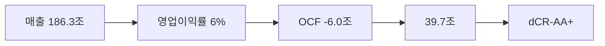

> ⚠️ **면책**: 본 보고서는 dartlab dCR v4.0 방법론에 따라 공시 데이터만으로 작성되었습니다. 제도권 신용등급과 다를 수 있으며, 투자 권유가 아닙니다. [방법론](https://github.com/eddmpython/dartlab/blob/master/src/dartlab/analysis/CREDIT.md)

> **dCR-AA+** | 최우량 (notch 조정) | 2026-04-05 | 방법론 v4.0

## 1. 등급 요약

| 항목 | 값 |
|------|------|
| **신용등급** | **dCR-AA+** (최우량 (notch 조정)) |
| 카테고리 | 최우량 (투자적격) |
| 종합 점수 | 19.8 / 100 |
| 부도확률(1Y) | 0.01% |
| 현금흐름등급 | eCR-5 |
| 등급 전망 | 긍정적 |
| 업종 | 경기관련소비재 (캡티브금융조정) |
| 기준 기간 | 2025Q4 |
| 구조 | 캡티브금융 복합기업 (유틸리티 기준 적용) |

```
건전도: [████████████████░░░░] 80/100
```

## 2. Executive Summary

현대자동차는 매출 186.3조 규모의 경기관련소비재 기업으로, **dCR-AA+** (건전도 80/100) 등급이다.

dCR-AA+는 [매출 186.3조원 규모]에서 출발하는 [영업이익률 6%의 수익 기반]이 [부채비율 189%의 레버리지 부담]를 유지하게 하고, 등급을 뒷받침하는 구조를 반영한다. 핵심 강점인 자본구조, 공시리스크이 업황 변동 시에도 등급을 방어하는 완충 역할을 한다.

**인과 연결**: 인과 요약: 매출 186.3조원 → 영업이익률 6%로, 영업에서 현금이 유출되어 → 부채비율 189%로 레버리지 부담이 있다. 종합 dCR-AA+.

## 3. 재무 하이라이트

| 지표 | 값 | 전년비 |
|------|-----:|------:|
| 매출 | 186.3조 | +6.3% |
| 영업이익 | 11.5조 | -19.5% |
| EBITDA | 11.5조 | - |
| 영업현금흐름 | -6.0조 | - |
| 순차입금 | 39.7조 | - |
| Debt/EBITDA | 5.1x | ↑악화 |

## 4. 사업 분석

### 4.1 기업 개요

- 섹터: 경기관련소비재 > 자동차와부품
- 주요제품: 자동차(승용차,버스,트럭,특장차),자동차부품,자동차전착도료 제조,차량정비사업
- 매출 규모: 186.3조


> **사업보고서 발췌**: "II. 사업의 내용 당사와 연결종속회사(이하 연결실체)는 자동차와 자동차부품의 제조 및 판매, 차량정비 등의 사업을 운영하는 차량부문과 차량할부금융 및 결제대행업무 등의 사업을 운영하는 금융부문 및 철도차량 제작 등의 사업을 운영하는 기타부문으로 구성되어 있습니다. 각 부문별 매출비중은 2025년 기준으로 차량부문이 약 78%, 금융부문이 약 16%, 기타"

### 4.2 부문별 매출 구성

| 부문 | 매출 | 비중 |
|------|-----:|-----:|
| 차량 | 164.7조 | 88.4% |
| 금융 | 21.6조 | 11.6% |

## 5. 등급 근거 상세

dCR-AA+는 [매출 186.3조원 규모]에서 출발하는 [영업이익률 6%의 수익 기반]이 [부채비율 189%의 레버리지 부담]를 유지하게 하고, 등급을 뒷받침하는 구조를 반영한다. 핵심 강점인 자본구조, 공시리스크이 업황 변동 시에도 등급을 방어하는 완충 역할을 한다. 다만 유동성, 현금흐름은 등급 하방 압력 요인으로 모니터링이 필요하다. 캡티브 금융 복합기업으로 연결 재무제표의 구조적 왜곡이 존재한다.

**인과 요약: 매출 186.3조원 → 영업이익률 6%로, 영업에서 현금이 유출되어 → 부채비율 189%로 레버리지 부담이 있다. 종합 dCR-AA+.**

### 등급 결정 요인 분해

| 축 | 점수 | 가중치 | 기여도 | 비고 |
|------|-----:|------:|------:|------|
| 채무상환능력 | 15 | 30% | 4.4점 | 양호 |
| 자본구조 | 5 | 15% | 0.8점 | 우수 |
| 유동성 | 31 | 15% | 4.6점 | 보통 |
| 현금흐름 | 33 | 15% | 5.0점 | 보통 ← 등급 하방 압력 |
| 사업안정성 | 19 | 10% | 1.9점 | 양호 |
| 재무신뢰성 | 22 | 10% | 2.2점 | 보통 |
| **합계** | | | **19.8점** | **→ dCR-AA+** |

### 강점
- **자본구조**: 자본구조는 매우 건전하다.
- **공시리스크**: 공시 리스크 신호가 감지되지 않았다.

### 약점
- **유동성**: 유동성은 주의가 필요한 수준이다.
- **현금흐름**: 현금흐름 창출 능력은 보통 수준이다.

### 양호
- **채무상환능력**: 채무상환능력은 경기관련소비재 (캡티브금융조정) 업종 기준 양호한 수준이다.
- **사업안정성**: 사업 안정성은 양호한 수준이다.
- **재무신뢰성**: 재무 신뢰성은 양호하다.

**등급 조정**: 정량 평가 기준 dCR-BBB+ 수준이나, 다음의 정성 대리 신호를 반영하여 **-6 notch 상향** 조정했다:
- 대형기업 (매출 186조)
- 캡티브금융 별도 D/EBITDA 0.5x (양호)
- 연속 8기 영업흑자 (경영 안정성)
이는 제도권 신평사가 시장 지위, 그룹 지원 등 정성 요소로 등급을 조정하는 것과 유사한 접근이다.




## 6. 재무 분석

| 축 | 비중 | 판정 | 점수 |
|------|:---:|:---:|------|
| 채무상환능력 | 30% | 양호 | ████████░░ 15/100 |
| 자본구조 | 15% | **우수** | █████████░ 5/100 |
| 유동성 | 15% | 보통 | ██████░░░░ 31/100 |
| 현금흐름 | 15% | 보통 | ██████░░░░ 33/100 |
| 사업안정성 | 10% | 양호 | ████████░░ 19/100 |
| 재무신뢰성 | 10% | 양호 | ███████░░░ 22/100 |
| 공시리스크 | 5% | - | ░░░░░░░░░░ 평가 불가 |

### 6.* 차입금 구성

| 구분 | 금액 | 비중 |
|------|-----:|-----:|
| 단기차입금 | 10.4조 | 5.9% |
| 사채, 명목금액 | 91.3조 | 52.3% |
| 사채 | 73.0조 | 41.8% |
| **합계** | **174.7조** | **100%** |

### 6.1 채무상환능력 (30%)

**판정: 양호** (15점/100)

채무상환능력은 경기관련소비재 (캡티브금융조정) 업종 기준 양호한 수준이다. 매출 186.3조원 기반 EBITDA 11.5조원을 창출한다. 총차입금 58.1조원 대비 이자 부담이 사실상 없어 무차입에 준하는 재무구조다. Debt/EBITDA 5.1배로 차입금 상환에 장기간이 소요된다. 참고: 별도 기준 D/EBITDA는 0.5x로, 연결 대비 크게 양호하다.

| 지표 | 점수 | 판정 |
|------|:---:|:---:|
| FFO/총차입금 | 85 | 주의 |
| Debt/EBITDA | 33 | 보통 |
| EBITDA/이자비용 | 0 | 우수 |

### 6.2 자본구조 (15%)

**판정: 우수** (5점/100)

자본구조는 매우 건전하다. 부채비율 189%로 적정 수준의 레버리지를 활용한다. 차입금의존도 16%로 적정 수준이다. 참고: 별도 재무 기준 부채비율은 41%로, 연결(189%) 대비 크게 낮다. 이는 금융자회사 차입금이 연결에 포함되기 때문이다.

| 지표 | 점수 | 판정 |
|------|:---:|:---:|
| 부채비율 | 14 | 양호 |
| 차입금의존도 | 6 | 우수 |
| 순차입금/EBITDA | 21 | 양호 |

### 6.3 유동성 (15%)

**판정: 주의** (31점/100)

유동성은 주의가 필요한 수준이다. 유동비율 136%로 단기 유동성이 적정하다. 단기차입금 비중 58%로 차환 리스크가 존재한다.

| 지표 | 점수 | 판정 |
|------|:---:|:---:|
| 유동비율 | 16 | 양호 |
| 현금비율 | 17 | 양호 |
| 단기차입금비중 | 59 | 주의 |

### 6.4 현금흐름 (15%)

**판정: 주의** (33점/100)

현금흐름 창출 능력은 보통 수준이다. 영업활동현금흐름/매출 -3.2%로 영업에서 현금이 유출되고 있다. 투자 부담으로 잉여현금흐름(잉여현금흐름)이 음수이다. 참고: 영업활동현금흐름가 음수인 것은 연결 기준으로 금융자회사의 대출 원금 유출이 포함되기 때문이다. 제조 모회사 단독으로는 영업활동현금흐름가 정상 범위일 수 있다.

| 지표 | 점수 | 판정 |
|------|:---:|:---:|
| 영업활동현금흐름/매출 | 53 | 주의 |
| 잉여현금흐름/매출 | 43 | 보통 |
| 영업활동현금흐름추세 | 50 | 주의 |

### 6.5 사업안정성 (10%)

**판정: 양호** (19점/100)

사업 안정성은 양호한 수준이다. 매출 변동계수 24.1%로 실적 변동성이 크다. 매출 규모 186조원으로 대형 기업의 사업 안정성을 보유한다.

| 지표 | 점수 | 판정 |
|------|:---:|:---:|
| 매출안정성 | 34 | 보통 |
| 이익안정성 | 22 | 양호 |
| 규모 | 0 | 우수 |

### 6.6 재무신뢰성 (10%)

**판정: 양호** (22점/100)

재무 신뢰성은 양호하다. Piotroski F-Score 1/9로 재무 펀더멘탈이 취약하다. 다만, 캡티브 금융 연결 효과로 영업활동현금흐름/유동비율 등이 왜곡되어 F-Score가 실제 모회사 체력보다 낮게 산출될 수 있다. 감사의견은 적정으로 재무제표 신뢰성에 문제가 없다.

| 지표 | 점수 | 판정 |
|------|:---:|:---:|
| Piotroski F | 45 | 보통 |
| 감사의견 | 0 | 우수 |

### 6.7 공시리스크 (5%)

**판정: 우수** (평가 불가)

공시 리스크 신호가 감지되지 않았다. scan 데이터 범위 내 특이 신호 없음.

## 7. 5개년 재무 시계열

| 기간 | 매출 | 영업이익 | EBITDA/이자 | Debt/EBITDA | 부채비율 | 유동비율 | 영업활동현금흐름/매출 |
|------|------|------|------|------|------|------|------|
| 2025Q4 | 186.3조 | 11.5조 | 무차입 | 5.1x ↑ | 189% → | 136% ↓ | -3.2% |
| 2024Q4 | 175.2조 | 14.2조 | 무차입 | 3.6x ↑ | 183% → | 146% ↑ | -3.2% |
| 2023Q4 | 162.7조 | 15.1조 | 무차입 | 2.8x ↓ | 177% → | 139% ↑ | -1.6% |
| 2022Q4 | 142.5조 | 9.8조 | 무차입 | 3.9x ↓ | 181% → | 130% ↓ | 7.5% |
| 2021Q4 | 117.6조 | 6.7조 | 무차입 | 4.7x | 183% | 138% | -1.0% |

## 8. 리스크 진단

### 8.1 감사 리스크

- 감사의견: **적정**
  - 적정 의견 **8기 연속** 유지, 재무제표 신뢰도 양호

### 8.2 우발부채

- 우발부채 만성화 신호 없음

### 8.3 공시 리스크 키워드

- 리스크 키워드(횡령/배임/과징금 등) 감지 없음

### 8.4 구조 변화

- 감사인/계열 구조 변화 없음

### 8.5 전기 대비 주요 변화

- **종속회사**: 전기 대비 대폭 변화 (변화 블록 1개)
- **계열사현황**: 전기 대비 대폭 변화 (변화 블록 3개)
- **rndDetail**: 전기 대비 대폭 변화 (변화 블록 1개)

## 9. 등급 전망

현재 전망: **긍정적**

### 상향 트리거
- 부채비율이 현 189%에서 80% 이하로 축소
- Debt/EBITDA가 현 5.1배에서 2배 이하로 개선

### 하향 트리거
- 대규모 차입으로 이자보상배율이 5배 이하로 하락
- 부채비율이 현 189%에서 239% 이상으로 증가

## 10. 신평사 등급 대조

| 기관 | 등급 | dartlab | 차이 |
|------|------|---------|------|
| KIS | AA | dCR-AA+ | 1n |
| KR | AA+ | dCR-AA+ | 0n |

평균 괴리: 0.5 notch

### 동의
- KIS AA등급은 dartlab 정량 분석 결과(dCR-AA+, 점수 19.8)와 ±1 notch 범위로 합리적이다.
- KR AA+등급은 dartlab 정량 분석 결과(dCR-AA+, 점수 19.8)와 ±0 notch 범위로 합리적이다.

### 구조적 참고
- 캡티브 금융 복합기업 — 연결 재무제표에 금융자회사 차입금이 포함되어 정량 등급이 실제보다 낮을 수 있다. 제도권 등급은 제조/금융 부문을 분리하여 평가한다.


## 11. 등급 괴리 분석

외부 신평사 등급과 dartlab dCR 등급이 일치합니다.
이는 공시 재무 데이터만으로도 이 기업의 신용 건전성을 정확히 포착할 수 있음을 의미합니다.

주요 등급 지지 요인:
- **자본구조**: 자본구조는 매우 건전하다.
- **공시리스크**: 공시 리스크 신호가 감지되지 않았다.

dartlab dCR 등급이 외부 신평사 등급과 다를 수 있는 이유:

- 현금흐름 축이 33점으로 등급 하방 압력
- 잉여현금흐름·영업활동현금흐름 모두 음수 — 현금흐름 악화 신호
- 캡티브 금융자회사 연결 — 연결 차입금에 금융자회사 대출 원금 포함
- dartlab dCR은 공시 정량 데이터 기반. 시장 지위, 경영진, 그룹 지원 등 정성 요소는 미반영

## 12. Notch Adjustment 상세

총 조정: **-6 notch (상향)**

적용 규칙:
- 대형기업 (매출 186조)
- 캡티브금융 별도 D/EBITDA 0.5x (양호)
- 연속 8기 영업흑자 (경영 안정성)

## 13. 별도재무제표 비교

연결 재무제표에 자회사 부채가 포함되어 왜곡될 수 있으므로, 별도(모회사) 재무를 함께 확인합니다.

| 지표 | 연결 | 별도 |
| --- | ---: | ---: |
| D/EBITDA | 5.1x | 0.5x |
| 부채비율 | 189% | 41% |
| 총차입금 | 58.1조 | 1.9조 |

## 14. 방법론 참조

- dartlab 독립 신용분석(dCR) v4.0
- 방법론 상세: [src/dartlab/analysis/CREDIT.md](https://github.com/eddmpython/dartlab/blob/master/src/dartlab/analysis/CREDIT.md)
- 발행일: 2026-04-05
