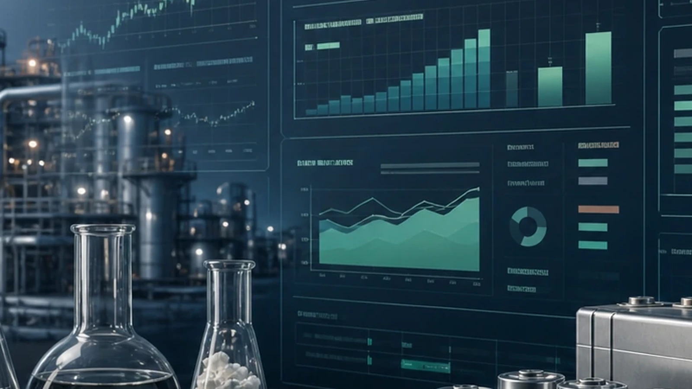
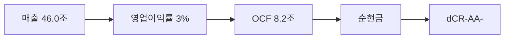

> ⚠️ **면책**: 본 보고서는 dartlab dCR v4.0 방법론에 따라 공시 데이터만으로 작성되었습니다. 제도권 신용등급과 다를 수 있으며, 투자 권유가 아닙니다. [방법론](https://github.com/eddmpython/dartlab/blob/master/src/dartlab/analysis/CREDIT.md)

> **dCR-AA-** | 투자적격 상위- | 2026-04-05 | 방법론 v4.0

## 1. 등급 요약

| 항목 | 값 |
|------|------|
| **신용등급** | **dCR-AA-** (투자적격 상위-) |
| 카테고리 | 최우량 (투자적격) |
| 종합 점수 | 9.7 / 100 |
| 부도확률(1Y) | 0.03% |
| 현금흐름등급 | eCR-3 |
| 등급 전망 | 안정적 |
| 업종 | 소재 |
| 기준 기간 | 2025Q4 |

```
건전도: [██████████████████░░] 90/100
```

## 2. Executive Summary

LG화학은 매출 46.0조 규모의 소재 기업으로, **dCR-AA-** (건전도 90/100) 등급이다.

dCR-AA-는 [매출 46.0조원 규모]에서 출발하는 [영업이익률 3%의 수익 기반]이 [영업활동현금흐름 8.2조원의 현금창출력]를 유지하게 하고, [부채 부담 없는 순현금 구조]가 등급을 뒷받침하는 구조를 반영한다. 핵심 강점인 채무상환능력, 자본구조, 공시리스크이 등급의 안정적 기반이다.

**인과 연결**: 인과 요약: 매출 46.0조원 → 영업이익률 3%에 불과하여, EBITDA 1.2조원 이상의 현금(영업활동현금흐름 8.2조원)을 창출하고 → 순현금 포지션을 유지한다. 종합 dCR-AA-.

## 3. 재무 하이라이트

| 지표 | 값 | 전년비 |
|------|-----:|------:|
| 매출 | 46.0조 | -6.0% |
| 영업이익 | 1.2조 | +29.8% |
| EBITDA | 1.2조 | - |
| 영업현금흐름 | 8.2조 | - |
| 순차입금 | 순현금 | - |
| Debt/EBITDA | 0.0x | - |

## 4. 사업 분석

### 4.1 기업 개요

- 섹터: 소재 > 화학
- 주요제품: 유화/기능/합성수지,재생섬유소,산업재,리튬이온전지,평광판,PVC 제조,도매
- 매출 규모: 46.0조


> **사업보고서 발췌**: "II. 사업의 내용 1. 사업의 개요 당사는 2025년말 기준으로 약 45조 9,322억원의 매출을 달성하였으며 각 사업부문별 매출액은 LG에너지솔루션 51.5%, 석유화학 사업부문 38.2%, 첨단소재 사업부문 5.7%, 생명과학 사업부문 2.9%, 공통 및 기타부문 1.6%로 구성되어 있습니다. [석유화학 사업부문] 석유화학사업은 납사 등을 원료로 하여"

### 4.2 부문별 매출 구성

| 부문 | 매출 | 비중 |
|------|-----:|-----:|
| 소형전지, 자동차전지, 전력저장전지 등 | 23.7조 | 51.5% |
| ABS, PC, PE, PP, 아크릴,알코올, SAP, PVC, 합성고무,특수수지, BPA, 에틸렌, 프로필렌 등 | 17.6조 | 38.2% |
| 편광판 및 편광판 소재 사업 및 Water Solutions 사업을 매각하기로 경영진이 승인함에 따라 중단영업으로 표시된 관련 손익은 주석 34에서 표시하고 있습니다. | 2.6조 | 5.7% |
| 성장호르몬, 백신, 당뇨치료제, 농약원제 등 | 1.3조 | 2.8% |
| 공통 및 기타는 보고의 요건을 충족하지 못하는 영업과 영업에 대한 지원활동 및 연구개발활동을 수행하는 부서 등을 포함하고 있습니다. | 7,731억 | 1.7% |

## 5. 등급 근거 상세

dCR-AA-는 [매출 46.0조원 규모]에서 출발하는 [영업이익률 3%의 수익 기반]이 [영업활동현금흐름 8.2조원의 현금창출력]를 유지하게 하고, [부채 부담 없는 순현금 구조]가 등급을 뒷받침하는 구조를 반영한다. 핵심 강점인 채무상환능력, 자본구조, 공시리스크이 등급의 안정적 기반이다.

**인과 요약: 매출 46.0조원 → 영업이익률 3%에 불과하여, EBITDA 1.2조원 이상의 현금(영업활동현금흐름 8.2조원)을 창출하고 → 순현금 포지션을 유지한다. 종합 dCR-AA-.**

### 등급 결정 요인 분해

| 축 | 점수 | 가중치 | 기여도 | 비고 |
|------|-----:|------:|------:|------|
| 채무상환능력 | 0 | 30% | 0.0점 | 우수 |
| 자본구조 | 9 | 15% | 1.4점 | 우수 |
| 유동성 | 12 | 15% | 1.8점 | 양호 |
| 현금흐름 | 19 | 15% | 2.8점 | 양호 ← 등급 하방 압력 |
| 사업안정성 | 24 | 10% | 2.4점 | 보통 |
| 재무신뢰성 | 12 | 10% | 1.2점 | 양호 |
| **합계** | | | **9.7점** | **→ dCR-AA-** |

### 강점
- **채무상환능력**: 채무상환능력은 소재 업종 기준 매우 우수하다.
- **자본구조**: 자본구조는 매우 건전하다.
- **공시리스크**: 공시 리스크 신호가 감지되지 않았다.

### 양호
- **유동성**: 유동성은 적정 수준이다.
- **현금흐름**: 현금흐름 창출 능력은 양호하다.
- **사업안정성**: 사업 안정성은 양호한 수준이다.
- **재무신뢰성**: 재무 신뢰성은 양호하다.




## 6. 재무 분석

| 축 | 비중 | 판정 | 점수 |
|------|:---:|:---:|------|
| 채무상환능력 | 30% | **우수** | ██████████ 0/100 |
| 자본구조 | 15% | **우수** | █████████░ 9/100 |
| 유동성 | 15% | 양호 | ████████░░ 12/100 |
| 현금흐름 | 15% | 양호 | ████████░░ 19/100 |
| 사업안정성 | 10% | 양호 | ███████░░░ 24/100 |
| 재무신뢰성 | 10% | 양호 | ████████░░ 12/100 |
| 공시리스크 | 5% | - | ░░░░░░░░░░ 평가 불가 |

### 6.* 차입금 구성

| 구분 | 금액 | 비중 |
|------|-----:|-----:|
| 단기차입금 | 3.3조 | 0.0% |
| 유동성장기차입금 | 3.1조 | 0.0% |
| 유동성사채 | 5.2조 | 0.0% |
| 유동차입금및비유동차입금(사채포함)의유동성대체부분 | 11.7조 | 0.0% |
| 장기차입금 | 6.2조 | 0.0% |
| 사채 | 15.0조 | 0.0% |
| 발행시권면총액 | 1000.0조 | 0.0% |
| 발행가액 | 1000.0조 | 0.0% |
| 발행일 | 20.2조 | 0.0% |
| 교환대상 | 1.8조 | 0.0% |
| 교환청구기간 | 2023082820.3조 | 100.0% |
| 발행자의조기상환권 | 514301.3조 | 0.0% |
| **합계** | **2023599188.2조** | **100%** |

### 6.1 채무상환능력 (30%)

**판정: 우수** (0점/100)

채무상환능력은 소재 업종 기준 매우 우수하다. 매출 46.0조원 기반 EBITDA 1.2조원을 창출한다. 이자 부담이 사실상 없어 무차입에 준하는 재무구조다. Debt/EBITDA 0.0배로 차입금을 1년 내 상환 가능한 수준이다.

| 지표 | 점수 | 판정 |
|------|:---:|:---:|
| FFO/총차입금 | 0 | 우수 |
| Debt/EBITDA | 0 | 우수 |
| EBITDA/이자비용 | 0 | 우수 |

### 6.2 자본구조 (15%)

**판정: 우수** (9점/100)

자본구조는 매우 건전하다. 부채비율 115%로 적정 수준의 레버리지를 활용한다. 순차입금/EBITDA 0.0배로 실질 부채 부담이 낮다.

| 지표 | 점수 | 판정 |
|------|:---:|:---:|
| 부채비율 | 24 | 양호 |
| 차입금의존도 | 0 | 우수 |
| 순차입금/EBITDA | 3 | 우수 |

### 6.3 유동성 (15%)

**판정: 양호** (12점/100)

유동성은 적정 수준이다. 유동비율 124%로 단기 유동성이 적정하다. 현금비율 38%로 즉시 동원 가능한 현금이 충분하다.

| 지표 | 점수 | 판정 |
|------|:---:|:---:|
| 유동비율 | 19 | 양호 |
| 현금비율 | 5 | 우수 |

### 6.4 현금흐름 (15%)

**판정: 양호** (19점/100)

현금흐름 창출 능력은 양호하다. 영업활동현금흐름/매출 17.9%로 매출 대비 현금 창출력이 우수하다. 투자 부담으로 잉여현금흐름(잉여현금흐름)이 음수이다. 영업현금흐름이 3기 연속 양수로 안정적이다.

| 지표 | 점수 | 판정 |
|------|:---:|:---:|
| 영업활동현금흐름/매출 | 10 | 양호 |
| 잉여현금흐름/매출 | 47 | 보통 |
| 영업활동현금흐름추세 | 0 | 우수 |

### 6.5 사업안정성 (10%)

**판정: 양호** (24점/100)

사업 안정성은 양호한 수준이다. 매출 변동계수 24.8%로 실적 변동성이 크다. 매출 규모 46조원으로 대형 기업의 사업 안정성을 보유한다.

| 지표 | 점수 | 판정 |
|------|:---:|:---:|
| 매출안정성 | 35 | 보통 |
| 이익안정성 | 33 | 보통 |
| 규모 | 5 | 우수 |

### 6.6 재무신뢰성 (10%)

**판정: 양호** (12점/100)

재무 신뢰성은 양호하다. 감사의견은 적정으로 재무제표 신뢰성에 문제가 없다.

| 지표 | 점수 | 판정 |
|------|:---:|:---:|
| Piotroski F | 25 | 양호 |
| 감사의견 | 0 | 우수 |

### 6.7 공시리스크 (5%)

**판정: 우수** (평가 불가)

공시 리스크 신호가 감지되지 않았다. scan 데이터 범위 내 특이 신호 없음.

## 7. 5개년 재무 시계열

| 기간 | 매출 | 영업이익 | EBITDA/이자 | Debt/EBITDA | 부채비율 | 유동비율 | 영업활동현금흐름/매출 |
|------|------|------|------|------|------|------|------|
| 2025Q4 | 46.0조 | 1.2조 | 무차입 | 0.0x → | 115% ↑ | 124% ↓ | 17.9% |
| 2024Q4 | 48.9조 | 9,168억 | 무차입 | 0.0x → | 96% ↑ | 132% ↓ | 14.3% |
| 2023Q4 | 55.7조 | 2.5조 | 무차입 | 0.0x → | 89% ↑ | 157% ↓ | 13.5% |
| 2022Q4 | 51.9조 | 3.0조 | 무차입 | 0.0x → | 81% ↓ | 180% ↑ | 1.1% |
| 2021Q4 | 42.7조 | 5.0조 | 무차입 | 0.0x | 120% | 136% | 12.9% |

## 8. 리스크 진단

### 8.1 감사 리스크

- 감사의견: **적정**
  - 적정 의견 **8기 연속** 유지, 재무제표 신뢰도 양호

### 8.2 우발부채

- 우발부채 만성화 신호 없음

### 8.3 공시 리스크 키워드

- 리스크 키워드(횡령/배임/과징금 등) 감지 없음

### 8.4 구조 변화

- 감사인/계열 구조 변화 없음

### 8.5 전기 대비 주요 변화

- **내부통제**: 전기 대비 대폭 변화 (변화 블록 7개)
- **공시변경사항**: 전기 대비 대폭 변화 (변화 블록 4개)
- **종속회사**: 전기 대비 대폭 변화 (변화 블록 1개)

## 9. 등급 전망

현재 전망: **안정적**

### 상향 트리거
- 부채비율이 현 115%에서 80% 이하로 축소

### 하향 트리거
- 대규모 차입으로 이자보상배율이 5배 이하로 하락
- 부채비율이 현 115%에서 165% 이상으로 증가
- Debt/EBITDA가 현 0.0배에서 5배 이상으로 악화

## 10. 신평사 등급 대조

### 구조적 참고
- 외부 신용등급 데이터 없음 — data/credit/external_grades.json에 등록 필요.


## 11. 등급 괴리 분석

외부 신평사 등급과 dartlab dCR 등급이 일치합니다.
이는 공시 재무 데이터만으로도 이 기업의 신용 건전성을 정확히 포착할 수 있음을 의미합니다.

주요 등급 지지 요인:
- **채무상환능력**: 채무상환능력은 소재 업종 기준 매우 우수하다.
- **자본구조**: 자본구조는 매우 건전하다.
- **공시리스크**: 공시 리스크 신호가 감지되지 않았다.

dartlab dCR 등급이 외부 신평사 등급과 다를 수 있는 이유:

- 잉여현금흐름 음수(영업활동현금흐름 양수) — 대규모 투자(설비투자) 사이클 중. 투자와 부실을 정량으로 구분 불가
- dartlab dCR은 공시 정량 데이터 기반. 시장 지위, 경영진, 그룹 지원 등 정성 요소는 미반영

## 12. 방법론 참조

- dartlab 독립 신용분석(dCR) v4.0
- 방법론 상세: [src/dartlab/analysis/CREDIT.md](https://github.com/eddmpython/dartlab/blob/master/src/dartlab/analysis/CREDIT.md)
- 발행일: 2026-04-05
