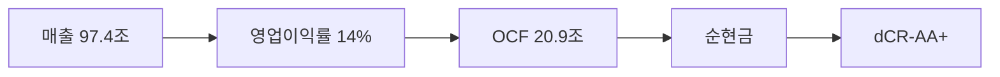

> ⚠️ **면책**: 본 보고서는 dartlab dCR v4.0 방법론에 따라 공시 데이터만으로 작성되었습니다. 제도권 신용등급과 다를 수 있으며, 투자 권유가 아닙니다. [방법론](https://github.com/eddmpython/dartlab/blob/master/src/dartlab/analysis/CREDIT.md)

> **dCR-AA+** | 최우량 (notch 조정) | 2026-04-05 | 방법론 v4.0

## 1. 등급 요약

| 항목 | 값 |
|------|------|
| **신용등급** | **dCR-AA+** (최우량 (notch 조정)) |
| 카테고리 | 최우량 (투자적격) |
| 종합 점수 | 26.0 / 100 |
| 부도확률(1Y) | 0.01% |
| 현금흐름등급 | eCR-3 |
| 등급 전망 | 긍정적 |
| 업종 | 유틸리티 |
| 기준 기간 | 2025Q4 |

```
건전도: [██████████████░░░░░░] 74/100
```

## 2. Executive Summary

한국전력공사는 매출 97.4조 규모의 유틸리티 기업으로, **dCR-AA+** (건전도 74/100) 등급이다.

dCR-AA+는 [매출 97.4조원 규모]에서 출발하는 [영업이익률 14%의 수익 기반]이 [OCF 20.9조원의 현금창출력]를 유지하게 하고, [부채 부담 없는 순현금 구조]가 등급을 뒷받침하는 구조를 반영한다. 핵심 강점인 채무상환능력, 현금흐름, 공시리스크이 업황 변동 시에도 등급을 방어하는 완충 역할을 한다.

**인과 연결**: 인과 요약: 매출 97.4조원 → 영업이익률 14%로, EBITDA 13.5조원 이상의 현금(OCF 20.9조원)을 창출하고 → 순현금 포지션을 유지한다. 종합 dCR-AA+.

## 3. 재무 하이라이트

| 지표 | 값 | 전년비 |
|------|-----:|------:|
| 매출 | 97.4조 | +4.3% |
| 영업이익 | 13.5조 | +61.3% |
| EBITDA | 13.5조 | - |
| 영업현금흐름 | 20.9조 | - |
| 순차입금 | 순현금 | - |
| Debt/EBITDA | 0.0x | - |

## 4. 사업 분석

### 4.1 기업 개요

- 섹터: 유틸리티 > 전력
- 주요제품: 전력자원개발,발전,송전,전력용기자재확보
- 매출 규모: 97.4조


> **사업보고서 발췌**: "II. 사업의 내용 1. 사업의 개요 현재 국내 전력 산업의 체계는 전력생산, 수송, 판매 체계로 이뤄지고 있으며, 당사는발전자회사와 민간발전회사, 구역전기사업자가 생산한 전력을 전력거래소에서 구입하여 일반 고객에게 판매하고 있습니다. (주요 사업 및 매출) 당사의 주요 사업은 네 개의 사업부문으로 구성되어 있습니다. ① 전기판매부문[한국전력공사(주)]에서"

### 4.2 부문별 매출 구성

| 부문 | 매출 | 비중 |
|------|-----:|-----:|
| 전력발전사업(화력) | 53.5조 | 54.9% |
| 전력발전사업(원자력) | 30.6조 | 31.4% |
| 전력지원사업 | 5.7조 | 5.8% |
| 전력판매사업 | 4.7조 | 4.9% |
| 기타사업 | 2.9조 | 3.0% |

## 5. 등급 근거 상세

dCR-AA+는 [매출 97.4조원 규모]에서 출발하는 [영업이익률 14%의 수익 기반]이 [OCF 20.9조원의 현금창출력]를 유지하게 하고, [부채 부담 없는 순현금 구조]가 등급을 뒷받침하는 구조를 반영한다. 핵심 강점인 채무상환능력, 현금흐름, 공시리스크이 업황 변동 시에도 등급을 방어하는 완충 역할을 한다. 다만 유동성은 등급 하방 압력 요인으로 모니터링이 필요하다.

**인과 요약: 매출 97.4조원 → 영업이익률 14%로, EBITDA 13.5조원 이상의 현금(OCF 20.9조원)을 창출하고 → 순현금 포지션을 유지한다. 종합 dCR-AA+.**

### 등급 결정 요인 분해

| 축 | 점수 | 가중치 | 기여도 | 비고 |
|------|-----:|------:|------:|------|
| 채무상환능력 | 8 | 25% | 2.0점 | 우수 |
| 자본구조 | 18 | 20% | 3.5점 | 양호 |
| 유동성 | 54 | 15% | 8.1점 | 주의 ← 등급 하방 압력 |
| 현금흐름 | 5 | 15% | 0.8점 | 우수 |
| 사업안정성 | 21 | 10% | 2.1점 | 보통 |
| 재무신뢰성 | 10 | 10% | 1.0점 | 우수 |
| **합계** | | | **26.0점** | **→ dCR-AA+** |

### 강점
- **채무상환능력**: 채무상환능력은 유틸리티 업종 기준 매우 우수하다.
- **현금흐름**: 현금흐름 창출 능력은 우수하다.
- **공시리스크**: 공시 리스크 신호가 감지되지 않았다.

### 약점
- **유동성**: 유동성은 부족하여 차환/유동성 위험이 높다.

### 양호
- **자본구조**: 자본구조는 양호하다.
- **사업안정성**: 사업 안정성은 양호한 수준이다.
- **재무신뢰성**: 재무 신뢰성은 양호하다.

**등급 조정**: 정량 평가 기준 dCR-BBB 수준이나, 다음의 정성 대리 신호를 반영하여 **-7 notch 상향** 조정했다:
- 대형기업 (매출 97조)
- 공기업 (정부 보증/규제 보호)
- 시가총액 26조
이는 제도권 신평사가 시장 지위, 그룹 지원 등 정성 요소로 등급을 조정하는 것과 유사한 접근이다.




## 6. 재무 분석

| 축 | 비중 | 판정 | 점수 |
|------|:---:|:---:|------|
| 채무상환능력 | 25% | **우수** | █████████░ 8/100 |
| 자본구조 | 20% | 양호 | ████████░░ 18/100 |
| 유동성 | 15% | 주의 | ████░░░░░░ 54/100 |
| 현금흐름 | 15% | **우수** | █████████░ 5/100 |
| 사업안정성 | 10% | 양호 | ███████░░░ 21/100 |
| 재무신뢰성 | 10% | 양호 | █████████░ 10/100 |
| 공시리스크 | 5% | - | ░░░░░░░░░░ 평가 불가 |

### 6.* 차입금 구성

| 구분 | 금액 | 비중 |
|------|-----:|-----:|
| 유동성장기차입금 | 8.7조 | 4.7% |
| 유동성사채 | 27.2조 | 14.6% |
| 사채, 명목금액 | 80.8조 | 43.4% |
| 단기차입금 | 2.9조 | 1.6% |
| 장기차입금 | 2.3조 | 1.2% |
| 사채 | 64.4조 | 34.6% |
| **합계** | **186.3조** | **100%** |

### 6.1 채무상환능력 (25%)

**판정: 우수** (8점/100)

채무상환능력은 유틸리티 업종 기준 매우 우수하다. 매출 97.4조원 기반 EBITDA 13.5조원을 창출한다. 이자보상배율 3.1배로 이자 지급은 가능하나 여유는 제한적이다. Debt/EBITDA 0.0배로 차입금을 1년 내 상환 가능한 수준이다.

| 지표 | 점수 | 판정 |
|------|:---:|:---:|
| FFO/총차입금 | 0 | 우수 |
| Debt/EBITDA | 0 | 우수 |
| FOCF/Debt | 0 | 우수 |
| EBITDA/이자비용 | 32 | 보통 |

### 6.2 자본구조 (20%)

**판정: 양호** (18점/100)

자본구조는 양호하다. 부채비율 417%로 과도한 레버리지를 사용하고 있다. 순차입금/EBITDA 0.0배로 실질 부채 부담이 낮다.

| 지표 | 점수 | 판정 |
|------|:---:|:---:|
| 부채비율 | 50 | 보통 |
| 차입금의존도 | 0 | 우수 |
| 순차입금/EBITDA | 3 | 우수 |

### 6.3 유동성 (15%)

**판정: 위험** (54점/100)

유동성은 부족하여 차환/유동성 위험이 높다. 유동비율 46%로 단기 유동성이 부족하다.

| 지표 | 점수 | 판정 |
|------|:---:|:---:|
| 유동비율 | 47 | 보통 |
| 현금비율 | 61 | 주의 |

### 6.4 현금흐름 (15%)

**판정: 우수** (5점/100)

현금흐름 창출 능력은 우수하다. OCF/매출 21.4%로 매출 대비 현금 창출력이 우수하다. 투자 이후에도 잉여현금흐름(FCF)이 양수로 자체 성장 여력이 있다. 영업현금흐름이 3기 연속 양수로 안정적이다.

| 지표 | 점수 | 판정 |
|------|:---:|:---:|
| OCF/매출 | 0 | 우수 |
| FCF/매출 | 15 | 양호 |
| OCF추세 | 0 | 우수 |

### 6.5 사업안정성 (10%)

**판정: 양호** (21점/100)

사업 안정성은 양호한 수준이다. 매출 변동계수 21.2%로 실적 변동성이 크다. 매출 규모 97조원으로 대형 기업의 사업 안정성을 보유한다.

| 지표 | 점수 | 판정 |
|------|:---:|:---:|
| 매출안정성 | 29 | 양호 |
| 이익안정성 | 35 | 보통 |
| 규모 | 0 | 우수 |

### 6.6 재무신뢰성 (10%)

**판정: 양호** (10점/100)

재무 신뢰성은 양호하다. 감사의견은 적정으로 재무제표 신뢰성에 문제가 없다.

| 지표 | 점수 | 판정 |
|------|:---:|:---:|
| Beneish M | 20 | 양호 |
| Piotroski F | 10 | 양호 |
| 감사의견 | 0 | 우수 |

### 6.7 공시리스크 (5%)

**판정: 우수** (평가 불가)

공시 리스크 신호가 감지되지 않았다. scan 데이터 범위 내 특이 신호 없음.

## 7. 5개년 재무 시계열

| 기간 | 매출 | 영업이익 | EBITDA/이자 | Debt/EBITDA | 부채비율 | 유동비율 | OCF/매출 |
|------|------|------|------|------|------|------|------|
| 2025Q4 | 97.4조 | 13.5조 | 3.1x | 0.0x → | 417% ↓ | 46% → | 21.4% |
| 2024Q4 | 93.4조 | 8.4조 | 1.8x | 0.0x | 497% ↓ | 46% ↓ | 17.0% |
| 2023Q4 | 88.2조 | -4.5조 | -1.0x | - | 543% ↑ | 48% ↓ | 1.7% |
| 2022Q4 | 71.3조 | -32.7조 | -11.6x | - | 459% ↑ | 67% → | -33.0% |
| 2021Q4 | 60.6조 | -5.9조 | -3.1x | - | 223% | 69% | 7.4% |

## 8. 리스크 진단

### 8.1 감사 리스크

- 감사의견: **적정**
  - 적정 의견 **8기 연속** 유지, 재무제표 신뢰도 양호

### 8.2 우발부채

- 우발부채 만성화 신호 없음

### 8.3 공시 리스크 키워드

- 리스크 키워드(횡령/배임/과징금 등) 감지 없음

### 8.4 구조 변화

- 감사인/계열 구조 변화 없음

### 8.5 전기 대비 주요 변화

- **investmentInOtherDetail**: 전기 대비 대폭 변화 (변화 블록 1개)
- **종속회사**: 전기 대비 대폭 변화 (변화 블록 2개)
- **경영진분석**: 전기 대비 대폭 변화 (변화 블록 128개)

## 9. 등급 전망

현재 전망: **긍정적**

### 상향 트리거
- 이자보상배율이 5배 이상으로 개선
- 부채비율이 현 417%에서 80% 이하로 축소

### 하향 트리거
- 이자보상배율이 현 3.1배에서 2배 이하로 악화
- 부채비율이 현 417%에서 467% 이상으로 증가
- Debt/EBITDA가 현 0.0배에서 5배 이상으로 악화

## 10. 신평사 등급 대조

### 구조적 참고
- 외부 신용등급 데이터 없음 — data/credit/external_grades.json에 등록 필요.


## 11. 등급 괴리 분석

외부 신평사 등급과 dartlab dCR 등급이 일치합니다.
이는 공시 재무 데이터만으로도 이 기업의 신용 건전성을 정확히 포착할 수 있음을 의미합니다.

주요 등급 지지 요인:
- **채무상환능력**: 채무상환능력은 유틸리티 업종 기준 매우 우수하다.
- **현금흐름**: 현금흐름 창출 능력은 우수하다.
- **공시리스크**: 공시 리스크 신호가 감지되지 않았다.

dartlab dCR 등급이 외부 신평사 등급과 다를 수 있는 이유:

- 유동성 축이 54점으로 등급 하방 압력
- dartlab dCR은 공시 정량 데이터 기반. 시장 지위, 경영진, 그룹 지원 등 정성 요소는 미반영

## 12. Notch Adjustment 상세

총 조정: **-7 notch (상향)**

적용 규칙:
- 대형기업 (매출 97조)
- 공기업 (정부 보증/규제 보호)
- 시가총액 26조

## 13. 방법론 참조

- dartlab 독립 신용분석(dCR) v4.0
- 방법론 상세: [src/dartlab/analysis/CREDIT.md](https://github.com/eddmpython/dartlab/blob/master/src/dartlab/analysis/CREDIT.md)
- 발행일: 2026-04-05
