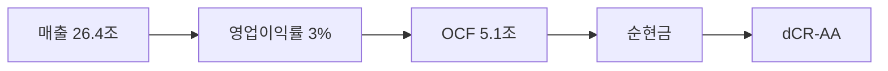

> ⚠️ **면책**: 본 보고서는 dartlab dCR v4.0 방법론에 따라 공시 데이터만으로 작성되었습니다. 제도권 신용등급과 다를 수 있으며, 투자 권유가 아닙니다. [방법론](https://github.com/eddmpython/dartlab/blob/master/src/dartlab/analysis/CREDIT.md)

> **dCR-AA** | 투자적격 상위 | 2026-04-05 | 방법론 v4.0

## 1. 등급 요약

| 항목 | 값 |
|------|------|
| **신용등급** | **dCR-AA** (투자적격 상위) |
| 카테고리 | 최우량 (투자적격) |
| 종합 점수 | 5.6 / 100 |
| 부도확률(1Y) | 0.02% |
| 현금흐름등급 | eCR-3 |
| 등급 전망 | 안정적 |
| 업종 | 커뮤니케이션서비스 |
| 기준 기간 | 2024Q4 |

```
건전도: [██████████████████░░] 94/100
```

## 2. Executive Summary

케이티는 매출 26.4조 규모의 커뮤니케이션서비스 기업으로, **dCR-AA** (건전도 94/100) 등급이다.

dCR-AA는 [매출 26.4조원 규모]에서 출발하는 [영업이익률 3%의 수익 기반]이 [영업활동현금흐름 5.1조원의 현금창출력]를 유지하게 하고, [부채 부담 없는 순현금 구조]가 등급을 뒷받침하는 구조를 반영한다. 핵심 강점인 채무상환능력, 자본구조, 현금흐름, 사업안정성, 재무신뢰성, 공시리스크이 등급의 안정적 기반이다.

**인과 연결**: 인과 요약: 매출 26.4조원 → 영업이익률 3%에 불과하여, EBITDA 8,095억원 이상의 현금(영업활동현금흐름 5.1조원)을 창출하고 → 순현금 포지션을 유지한다. 종합 dCR-AA.

## 3. 재무 하이라이트

| 지표 | 값 | 전년비 |
|------|-----:|------:|
| 매출 | 26.4조 | +0.2% |
| 영업이익 | 8,095억 | -50.9% |
| EBITDA | 8,095억 | - |
| 영업현금흐름 | 5.1조 | - |
| 순차입금 | 순현금 | - |
| Debt/EBITDA | 0.0x | - |

## 4. 사업 분석

### 4.1 기업 개요

- 섹터: 커뮤니케이션서비스 > 전기통신서비스
- 주요제품: 유무선통신사업,공중전기통신사업,인터넷,전자상거래,네트워크(전용회선,데이터통신,초고속사업 등)
- 매출 규모: 26.4조


> **사업보고서 발췌**: "II. 사업의 내용 1. (제조서비스업)사업의 개요 연결회사의 각 부분은 독립된 서비스 및 상품을 제공하는 법률적 실체에 의해 구분되어 있으며, 각 연결회사의 사업의 내용에 대해 (1)유무선 통신/컨버전스 사업을 제공하는 ICT , (2)신용카드사업을 제공하는 금융사업 , (3) 위성방송서비스사업 , (4)케이티의 자산을 활용한 부동산사업 , (5)콘텐츠,"

### 4.2 부문별 매출 구성

| 부문 | 매출 | 비중 |
|------|-----:|-----:|
| ICT | 20.8조 | 78.6% |
| 금융 | 4.2조 | 15.9% |
| 위성방송 | 8,005억 | 3.0% |
| 부동산 | 6,595억 | 2.5% |

## 5. 등급 근거 상세

dCR-AA는 [매출 26.4조원 규모]에서 출발하는 [영업이익률 3%의 수익 기반]이 [영업활동현금흐름 5.1조원의 현금창출력]를 유지하게 하고, [부채 부담 없는 순현금 구조]가 등급을 뒷받침하는 구조를 반영한다. 핵심 강점인 채무상환능력, 자본구조, 현금흐름, 사업안정성, 재무신뢰성, 공시리스크이 등급의 안정적 기반이다.

**인과 요약: 매출 26.4조원 → 영업이익률 3%에 불과하여, EBITDA 8,095억원 이상의 현금(영업활동현금흐름 5.1조원)을 창출하고 → 순현금 포지션을 유지한다. 종합 dCR-AA.**

### 등급 결정 요인 분해

| 축 | 점수 | 가중치 | 기여도 | 비고 |
|------|-----:|------:|------:|------|
| 채무상환능력 | 0 | 25% | 0.0점 | 우수 |
| 자본구조 | 4 | 20% | 0.8점 | 우수 |
| 유동성 | 14 | 15% | 2.1점 | 양호 ← 등급 하방 압력 |
| 현금흐름 | 5 | 15% | 0.8점 | 우수 |
| 사업안정성 | 5 | 10% | 0.5점 | 우수 |
| 재무신뢰성 | 5 | 10% | 0.5점 | 우수 |
| **합계** | | | **5.6점** | **→ dCR-AA** |

### 강점
- **채무상환능력**: 채무상환능력은 커뮤니케이션서비스 업종 기준 매우 우수하다.
- **자본구조**: 자본구조는 매우 건전하다.
- **현금흐름**: 현금흐름 창출 능력은 우수하다.
- **사업안정성**: 사업 안정성은 매우 높다.
- **재무신뢰성**: 재무 신뢰성은 우수하다.
- **공시리스크**: 공시 리스크 신호가 감지되지 않았다.

### 양호
- **유동성**: 유동성은 적정 수준이다.




## 6. 재무 분석

| 축 | 비중 | 판정 | 점수 |
|------|:---:|:---:|------|
| 채무상환능력 | 25% | **우수** | ██████████ 0/100 |
| 자본구조 | 20% | **우수** | █████████░ 4/100 |
| 유동성 | 15% | 양호 | ████████░░ 14/100 |
| 현금흐름 | 15% | **우수** | █████████░ 5/100 |
| 사업안정성 | 10% | **우수** | █████████░ 5/100 |
| 재무신뢰성 | 10% | **우수** | █████████░ 5/100 |
| 공시리스크 | 5% | - | ░░░░░░░░░░ 평가 불가 |

### 6.* 차입금 구성

| 구분 | 금액 | 비중 |
|------|-----:|-----:|
| 제 1회무기명식사모전환사채(*1) | 80억 | 19.9% |
| 제 1회기명식무보증사모전환사채(*3) | 300억 | 74.5% |
| 사채상환할증금 | 23억 | 5.6% |
| **합계** | **403억** | **100%** |

### 6.1 채무상환능력 (25%)

**판정: 우수** (0점/100)

채무상환능력은 커뮤니케이션서비스 업종 기준 매우 우수하다. 매출 26.4조원 기반 EBITDA 8,095억원을 창출한다. 이자 부담이 사실상 없어 무차입에 준하는 재무구조다. Debt/EBITDA 0.0배로 차입금을 1년 내 상환 가능한 수준이다.

| 지표 | 점수 | 판정 |
|------|:---:|:---:|
| FFO/총차입금 | 0 | 우수 |
| Debt/EBITDA | 0 | 우수 |
| EBITDA/이자비용 | 0 | 우수 |

### 6.2 자본구조 (20%)

**판정: 우수** (4점/100)

자본구조는 매우 건전하다. 부채비율 133%로 적정 수준의 레버리지를 활용한다. 순차입금/EBITDA 0.0배로 실질 부채 부담이 낮다.

| 지표 | 점수 | 판정 |
|------|:---:|:---:|
| 부채비율 | 8 | 우수 |
| 차입금의존도 | 0 | 우수 |
| 순차입금/EBITDA | 3 | 우수 |

### 6.3 유동성 (15%)

**판정: 양호** (14점/100)

유동성은 적정 수준이다. 유동비율 103%로 단기 유동성이 적정하다.

| 지표 | 점수 | 판정 |
|------|:---:|:---:|
| 유동비율 | 17 | 양호 |
| 현금비율 | 11 | 양호 |

### 6.4 현금흐름 (15%)

**판정: 우수** (5점/100)

현금흐름 창출 능력은 우수하다. 영업활동현금흐름/매출 19.2%로 매출 대비 현금 창출력이 우수하다. 영업현금흐름이 3기 연속 양수로 안정적이다.

| 지표 | 점수 | 판정 |
|------|:---:|:---:|
| 영업활동현금흐름/매출 | 10 | 양호 |
| 영업활동현금흐름추세 | 0 | 우수 |

### 6.5 사업안정성 (10%)

**판정: 우수** (5점/100)

사업 안정성은 매우 높다. 매출 변동계수 4.7%로 매출이 매우 안정적이다. 매출 규모 26조원으로 대형 기업의 사업 안정성을 보유한다.

| 지표 | 점수 | 판정 |
|------|:---:|:---:|
| 매출안정성 | 0 | 우수 |
| 이익안정성 | 11 | 양호 |
| 규모 | 5 | 우수 |

### 6.6 재무신뢰성 (10%)

**판정: 우수** (5점/100)

재무 신뢰성은 우수하다. 감사의견은 적정으로 재무제표 신뢰성에 문제가 없다.

| 지표 | 점수 | 판정 |
|------|:---:|:---:|
| Piotroski F | 10 | 양호 |
| 감사의견 | 0 | 우수 |

### 6.7 공시리스크 (5%)

**판정: 우수** (평가 불가)

공시 리스크 신호가 감지되지 않았다. scan 데이터 범위 내 특이 신호 없음.

## 7. 5개년 재무 시계열

| 기간 | 매출 | 영업이익 | EBITDA/이자 | Debt/EBITDA | 부채비율 | 유동비율 | 영업활동현금흐름/매출 |
|------|------|------|------|------|------|------|------|
| 2024Q4 | 26.4조 | 8,095억 | 무차입 | 0.0x → | 133% → | 103% ↓ | 19.2% |
| 2023Q4 | 26.4조 | 1.6조 | 무차입 | 0.0x → | 130% ↑ | 110% ↓ | 20.9% |
| 2022Q4 | 25.7조 | 1.7조 | 무차입 | 0.0x → | 123% → | 119% → | 14.0% |
| 2021Q4 | 24.9조 | 1.7조 | 무차입 | 0.0x → | 124% ↑ | 118% → | 22.3% |
| 2020Q4 | 23.9조 | 1.2조 | 무차입 | 0.0x | 116% | 121% | 19.8% |

## 8. 리스크 진단

### 8.1 감사 리스크

- 감사의견: **적정**
  - 적정 의견 **8기 연속** 유지, 재무제표 신뢰도 양호

### 8.2 우발부채

- 우발부채 만성화 신호 없음

### 8.3 공시 리스크 키워드

- 리스크 키워드(횡령/배임/과징금 등) 감지 없음

### 8.4 구조 변화

- 감사인/계열 구조 변화 없음

### 8.5 전기 대비 주요 변화

- **종속회사**: 전기 대비 대폭 변화 (변화 블록 1개)
- **계열사현황**: 전기 대비 대폭 변화 (변화 블록 1개)
- **subsequentEvents**: 전기 대비 대폭 변화 (변화 블록 46개)

## 9. 등급 전망

현재 전망: **안정적**

### 상향 트리거
- 부채비율이 현 133%에서 80% 이하로 축소

### 하향 트리거
- 대규모 차입으로 이자보상배율이 5배 이하로 하락
- 부채비율이 현 133%에서 183% 이상으로 증가
- Debt/EBITDA가 현 0.0배에서 5배 이상으로 악화

## 10. 신평사 등급 대조

### 구조적 참고
- 외부 신용등급 데이터 없음 — data/credit/external_grades.json에 등록 필요.


## 11. 등급 괴리 분석

외부 신평사 등급과 dartlab dCR 등급이 일치합니다.
이는 공시 재무 데이터만으로도 이 기업의 신용 건전성을 정확히 포착할 수 있음을 의미합니다.

주요 등급 지지 요인:
- **채무상환능력**: 채무상환능력은 커뮤니케이션서비스 업종 기준 매우 우수하다.
- **자본구조**: 자본구조는 매우 건전하다.
- **현금흐름**: 현금흐름 창출 능력은 우수하다.

dartlab dCR 등급이 외부 신평사 등급과 다를 수 있는 이유:

- dartlab dCR은 공시 정량 데이터 기반. 시장 지위, 경영진, 그룹 지원 등 정성 요소는 미반영

## 12. 방법론 참조

- dartlab 독립 신용분석(dCR) v4.0
- 방법론 상세: [src/dartlab/analysis/CREDIT.md](https://github.com/eddmpython/dartlab/blob/master/src/dartlab/analysis/CREDIT.md)
- 발행일: 2026-04-05
