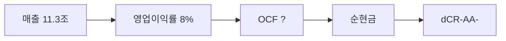

> ⚠️ **면책**: 본 보고서는 dartlab dCR v4.0 방법론에 따라 공시 데이터만으로 작성되었습니다. 제도권 신용등급과 다를 수 있으며, 투자 권유가 아닙니다. [방법론](https://github.com/eddmpython/dartlab/blob/master/src/dartlab/analysis/CREDIT.md)

> **dCR-AA-** | 투자적격 상위- | 2026-04-05 | 방법론 v4.0

## 1. 등급 요약

| 항목 | 값 |
|------|------|
| **신용등급** | **dCR-AA-** (투자적격 상위-) |
| 카테고리 | 최우량 (투자적격) |
| 종합 점수 | 8.1 / 100 |
| 부도확률(1Y) | 0.03% |
| 현금흐름등급 | eCR-? |
| 등급 전망 | 부정적 |
| 업종 | IT |
| 기준 기간 | 2025Q4 |

```
건전도: [██████████████████░░] 92/100
```

## 2. Executive Summary

삼성전기는 매출 11.3조 규모의 IT 기업으로, **dCR-AA-** (건전도 92/100) 등급이다.

dCR-AA-는 [매출 11.3조원 규모]에서 출발하는 [영업이익률 8%의 수익 기반]이 [부채 부담 없는 순현금 구조]를 유지하게 하고, 등급을 뒷받침하는 구조를 반영한다. 핵심 강점인 채무상환능력, 자본구조, 공시리스크이 업황 변동 시에도 등급을 방어하는 완충 역할을 한다.

**인과 연결**: 인과 요약: 매출 11.3조원 → 영업이익률 8%로, 순현금 포지션을 유지한다. 종합 dCR-AA-.

## 3. 재무 하이라이트

| 지표 | 값 | 전년비 |
|------|-----:|------:|
| 매출 | 11.3조 | +9.7% |
| 영업이익 | 9,133억 | +25.4% |
| EBITDA | 9,133억 | - |
| 영업현금흐름 | - | - |
| 순차입금 | 순현금 | - |
| Debt/EBITDA | 2.4x | ↑악화 |

## 4. 사업 분석

### 4.1 기업 개요

- 섹터: IT > 반도체와반도체장비
- 주요제품: 수동소자 (MLCC, Inductor, Chip Resistor 등), 모듈(카메라모듈, 통신모듈), 반도체패키지 기판
- 매출 규모: 11.3조


> **사업보고서 발췌**: "II. 사업의 내용 1. 사업의 개요 당사는 수동소자(MLCC, Inductor, Chip Resistor 등)를 생산하는 컴포넌트 사업부문, 반도체패키지기판을 생산하는 패키지솔루션 사업부문, 카메라모듈을 생산하는 광학솔루션 사업부문의 총 3개 사업부문으로 구성되어 있습니다.지역별로는 국내를 비롯해 미주, 유럽, 일본, 중국, 동남아시아 등 각 지역의 특성"

### 4.2 부문별 매출 구성

| 부문 | 매출 | 비중 |
|------|-----:|-----:|
| 부문 | 7.8조 | 69.3% |
| 광학솔루션 | 3.5조 | 30.7% |

## 5. 등급 근거 상세

dCR-AA-는 [매출 11.3조원 규모]에서 출발하는 [영업이익률 8%의 수익 기반]이 [부채 부담 없는 순현금 구조]를 유지하게 하고, 등급을 뒷받침하는 구조를 반영한다. 핵심 강점인 채무상환능력, 자본구조, 공시리스크이 업황 변동 시에도 등급을 방어하는 완충 역할을 한다. 다만 유동성은 등급 하방 압력 요인으로 모니터링이 필요하다.

**인과 요약: 매출 11.3조원 → 영업이익률 8%로, 순현금 포지션을 유지한다. 종합 dCR-AA-.**

### 등급 결정 요인 분해

| 축 | 점수 | 가중치 | 기여도 | 비고 |
|------|-----:|------:|------:|------|
| 채무상환능력 | 5 | 25% | 1.2점 | 우수 |
| 자본구조 | 8 | 20% | 1.5점 | 우수 |
| 유동성 | 32 | 15% | 4.8점 | 보통 ← 등급 하방 압력 |
| 사업안정성 | 12 | 10% | 1.2점 | 양호 |
| 재무신뢰성 | 22 | 10% | 2.2점 | 보통 |
| **합계** | | | **8.1점** | **→ dCR-AA-** |

### 강점
- **채무상환능력**: 채무상환능력은 IT 업종 기준 매우 우수하다.
- **자본구조**: 자본구조는 매우 건전하다.
- **공시리스크**: 공시 리스크 신호가 감지되지 않았다.

### 약점
- **유동성**: 유동성은 주의가 필요한 수준이다.

### 양호
- **현금흐름**: 현금흐름 창출 능력은 양호하다.
- **사업안정성**: 사업 안정성은 양호한 수준이다.
- **재무신뢰성**: 재무 신뢰성은 양호하다.




## 6. 재무 분석

| 축 | 비중 | 판정 | 점수 |
|------|:---:|:---:|------|
| 채무상환능력 | 25% | **우수** | █████████░ 5/100 |
| 자본구조 | 20% | **우수** | █████████░ 8/100 |
| 유동성 | 15% | 보통 | ██████░░░░ 32/100 |
| 현금흐름 | 15% | - | ░░░░░░░░░░ 평가 불가 |
| 사업안정성 | 10% | 양호 | ████████░░ 12/100 |
| 재무신뢰성 | 10% | 양호 | ███████░░░ 22/100 |
| 공시리스크 | 5% | - | ░░░░░░░░░░ 평가 불가 |

### 6.* 차입금 구성

| 구분 | 금액 | 비중 |
|------|-----:|-----:|
| 단기차입금 | 2.0조 | 32.7% |
| 장기차입금총액 | 2,344억 | 3.8% |
| 계, 장기차입금 | 2,165억 | 3.5% |
| 우리은행외 3곳 | 150억 | 0.2% |
| BoA | 415억 | 0.7% |
| 계 | 565억 | 0.9% |
| 우리은행외 2곳 | 3,681억 | 6.0% |
| 국민은행 | 381억 | 0.6% |
| 우리은행외 4곳 | 3,057억 | 5.0% |
| 우리은행외5곳 | 2,585억 | 4.2% |
| Citibank외8곳 | 7,035억 | 11.5% |
| Citibank외10곳 | 1.1조 | 17.1% |
| 우리은행외 6곳 | 2,162억 | 3.5% |
| Citibank외13곳 | 6,261억 | 10.2% |
| **합계** | **6.1조** | **100%** |

### 6.1 채무상환능력 (25%)

**판정: 우수** (5점/100)

채무상환능력은 IT 업종 기준 매우 우수하다. 매출 11.3조원 기반 EBITDA 9,133억원을 창출한다. 총차입금 2.2조원 대비 이자 부담이 사실상 없어 무차입에 준하는 재무구조다. Debt/EBITDA 2.4배로 차입금 부담이 적정하다.

| 지표 | 점수 | 판정 |
|------|:---:|:---:|
| Debt/EBITDA | 9 | 우수 |
| EBITDA/이자비용 | 0 | 우수 |

### 6.2 자본구조 (20%)

**판정: 우수** (8점/100)

자본구조는 매우 건전하다. 부채비율 49%로 재무구조가 매우 보수적이다. 차입금의존도 15%로 적정 수준이다. 순차입금이 마이너스(순현금 포지션)로 실질적 부채 부담이 없다.

| 지표 | 점수 | 판정 |
|------|:---:|:---:|
| 부채비율 | 7 | 우수 |
| 차입금의존도 | 13 | 양호 |
| 순차입금/EBITDA | 3 | 우수 |

### 6.3 유동성 (15%)

**판정: 주의** (32점/100)

유동성은 주의가 필요한 수준이다. 유동비율 186%로 단기 유동성이 양호하다. 단기차입금 비중 91%로 차환 리스크가 존재한다. 현금비율 71%로 즉시 동원 가능한 현금이 충분하다. 유동비율(186%)과 현금비율은 우수하나, 단기차입금 비중(91%)이 높아 차환 시점의 유동성 관리가 필요하다. 현금 보유량이 충분하므로 실질적 차환 위험은 낮다.

| 지표 | 점수 | 판정 |
|------|:---:|:---:|
| 유동비율 | 7 | 우수 |
| 현금비율 | 0 | 우수 |
| 단기차입금비중 | 90 | 주의 |

### 6.4 현금흐름 (15%)

**판정: 양호** (평가 불가)

현금흐름 창출 능력은 양호하다.

### 6.5 사업안정성 (10%)

**판정: 양호** (12점/100)

사업 안정성은 양호한 수준이다. 매출 변동계수 11.7%로 적정한 안정성을 보인다. 매출 규모 11조원으로 대형 기업의 사업 안정성을 보유한다.

| 지표 | 점수 | 판정 |
|------|:---:|:---:|
| 매출안정성 | 13 | 양호 |
| 이익안정성 | 18 | 양호 |
| 규모 | 5 | 우수 |

### 6.6 재무신뢰성 (10%)

**판정: 양호** (22점/100)

재무 신뢰성은 양호하다. Piotroski F-Score 2/9로 재무 펀더멘탈이 취약하다. 감사의견은 적정으로 재무제표 신뢰성에 문제가 없다.

| 지표 | 점수 | 판정 |
|------|:---:|:---:|
| Piotroski F | 45 | 보통 |
| 감사의견 | 0 | 우수 |

### 6.7 공시리스크 (5%)

**판정: 우수** (평가 불가)

공시 리스크 신호가 감지되지 않았다. scan 데이터 범위 내 특이 신호 없음.

## 7. 5개년 재무 시계열

| 기간 | 매출 | 영업이익 | EBITDA/이자 | Debt/EBITDA | 부채비율 | 유동비율 | 영업활동현금흐름/매출 |
|------|------|------|------|------|------|------|------|
| 2025Q4 | 11.3조 | 9,133억 | 무차입 | 2.4x ↑ | 49% ↑ | 186% → | - |
| 2024Q4 | 10.3조 | 7,283억 | 무차입 | 1.8x ↓ | 42% | 193% ↑ | - |
| 2023Q4 | 8.9조 | 6,394억 | 무차입 | 2.0x ↑ | - | 180% ↓ | - |
| 2022Q4 | 9.4조 | 1.2조 | 무차입 | 1.0x ↑ | 43% → | 194% ↓ | - |
| 2021Q4 | 9.7조 | 1.5조 | 무차입 | 0.5x | 45% | 206% | - |

## 8. 리스크 진단

### 8.1 감사 리스크

- 감사의견: **적정**
  - 적정 의견 **8기 연속** 유지, 재무제표 신뢰도 양호

### 8.2 우발부채

- 우발부채 만성화 신호 없음

### 8.3 공시 리스크 키워드

- 리스크 키워드(횡령/배임/과징금 등) 감지 없음

### 8.4 구조 변화

- 감사인/계열 구조 변화 없음

### 8.5 전기 대비 주요 변화

- **investmentInOtherDetail**: 전기 대비 대폭 변화 (변화 블록 1개)
- **계열사현황**: 전기 대비 대폭 변화 (변화 블록 2개)
- **경영진분석**: 전기 대비 대폭 변화 (변화 블록 88개)

## 9. 등급 전망

현재 전망: **부정적**

### 하향 트리거
- 대규모 차입으로 이자보상배율이 5배 이하로 하락
- 부채비율이 현 49%에서 98% 이상으로 증가
- Debt/EBITDA가 현 2.4배에서 5배 이상으로 악화

## 10. 신평사 등급 대조

### 구조적 참고
- 외부 신용등급 데이터 없음 — data/credit/external_grades.json에 등록 필요.


## 11. 등급 괴리 분석

외부 신평사 등급과 dartlab dCR 등급이 일치합니다.
이는 공시 재무 데이터만으로도 이 기업의 신용 건전성을 정확히 포착할 수 있음을 의미합니다.

주요 등급 지지 요인:
- **채무상환능력**: 채무상환능력은 IT 업종 기준 매우 우수하다.
- **자본구조**: 자본구조는 매우 건전하다.
- **공시리스크**: 공시 리스크 신호가 감지되지 않았다.

dartlab dCR 등급이 외부 신평사 등급과 다를 수 있는 이유:

- 유동성 축이 32점으로 등급 하방 압력
- dartlab dCR은 공시 정량 데이터 기반. 시장 지위, 경영진, 그룹 지원 등 정성 요소는 미반영

## 12. 방법론 참조

- dartlab 독립 신용분석(dCR) v4.0
- 방법론 상세: [src/dartlab/analysis/CREDIT.md](https://github.com/eddmpython/dartlab/blob/master/src/dartlab/analysis/CREDIT.md)
- 발행일: 2026-04-05
