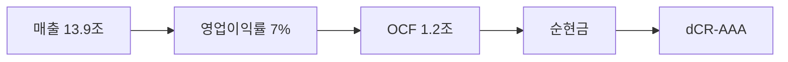

> ⚠️ **면책**: 본 보고서는 dartlab dCR v4.0 방법론에 따라 공시 데이터만으로 작성되었습니다. 제도권 신용등급과 다를 수 있으며, 투자 권유가 아닙니다. [방법론](https://github.com/eddmpython/dartlab/blob/master/src/dartlab/analysis/CREDIT.md)

> **dCR-AAA** | 투자적격 최상위 | 2026-04-05 | 방법론 v4.0

## 1. 등급 요약

| 항목 | 값 |
|------|------|
| **신용등급** | **dCR-AAA** (투자적격 최상위) |
| 카테고리 | 최우량 (투자적격) |
| 종합 점수 | 2.5 / 100 |
| 부도확률(1Y) | 0.00% |
| 현금흐름등급 | eCR-3 |
| 등급 전망 | 안정적 |
| 업종 | IT |
| 기준 기간 | 2025Q4 |

```
건전도: [███████████████████░] 97/100
```

## 2. Executive Summary

삼성에스디에스는 매출 13.9조 규모의 IT 기업으로, **dCR-AAA** (건전도 97/100) 등급이다.

dCR-AAA는 [매출 13.9조원 규모]에서 출발하는 [영업이익률 7%의 수익 기반]이 [영업활동현금흐름 1.2조원의 현금창출력]를 유지하게 하고, [부채 부담 없는 순현금 구조]가 등급을 뒷받침하는 구조를 반영한다. 핵심 강점인 채무상환능력, 자본구조, 유동성, 재무신뢰성, 공시리스크이 등급의 안정적 기반이다.

**인과 연결**: 인과 요약: 매출 13.9조원 → 영업이익률 7%로, EBITDA 9,571억원 이상의 현금(영업활동현금흐름 1.2조원)을 창출하고 → 순현금 포지션을 유지한다. 종합 dCR-AAA.

## 3. 재무 하이라이트

| 지표 | 값 | 전년비 |
|------|-----:|------:|
| 매출 | 13.9조 | +0.7% |
| 영업이익 | 9,571억 | +5.0% |
| EBITDA | 9,571억 | - |
| 영업현금흐름 | 1.2조 | - |
| 순차입금 | 순현금 | - |
| Debt/EBITDA | 0.0x | - |

## 4. 사업 분석

### 4.1 기업 개요

- 섹터: IT > IT서비스
- 주요제품: IT서비스, 물류BPO
- 매출 규모: 13.9조


> **사업보고서 발췌**: "II. 사업의 내용 1. 사업의 개요 당사와 연결종속회사가 영위하고 있는 주된 사업은 IT서비스와 물류의 2개 사업부문으로 구성되어 있습니다. (1) IT서비스 부문당사는 IT기술역량을 활용하여 고객의 요구에 맞는 다양한 IT서비스를 제공하고 있습니다. 당사가 제공하는 IT서비스는 크게 클라우드 서비스, SI, ITO의 3개 분야입니다. 클라우드 서비스는"

### 4.2 부문별 매출 구성

| 부문 | 매출 | 비중 |
|------|-----:|-----:|
| 물류서비스 | 7.1조 | 50.7% |
| IT서비스 | 6.9조 | 49.3% |

## 5. 등급 근거 상세

dCR-AAA는 [매출 13.9조원 규모]에서 출발하는 [영업이익률 7%의 수익 기반]이 [영업활동현금흐름 1.2조원의 현금창출력]를 유지하게 하고, [부채 부담 없는 순현금 구조]가 등급을 뒷받침하는 구조를 반영한다. 핵심 강점인 채무상환능력, 자본구조, 유동성, 재무신뢰성, 공시리스크이 등급의 안정적 기반이다.

**인과 요약: 매출 13.9조원 → 영업이익률 7%로, EBITDA 9,571억원 이상의 현금(영업활동현금흐름 1.2조원)을 창출하고 → 순현금 포지션을 유지한다. 종합 dCR-AAA.**

### 등급 결정 요인 분해

| 축 | 점수 | 가중치 | 기여도 | 비고 |
|------|-----:|------:|------:|------|
| 채무상환능력 | 0 | 25% | 0.0점 | 우수 |
| 자본구조 | 2 | 20% | 0.4점 | 우수 |
| 유동성 | 0 | 15% | 0.0점 | 우수 |
| 현금흐름 | 12 | 15% | 1.8점 | 양호 ← 등급 하방 압력 |
| 사업안정성 | 12 | 10% | 1.2점 | 양호 |
| 재무신뢰성 | 0 | 10% | 0.0점 | 우수 |
| **합계** | | | **2.5점** | **→ dCR-AAA** |

### 강점
- **채무상환능력**: 채무상환능력은 IT 업종 기준 매우 우수하다.
- **자본구조**: 자본구조는 매우 건전하다.
- **유동성**: 유동성은 매우 충분하다.
- **재무신뢰성**: 재무 신뢰성은 우수하다.
- **공시리스크**: 공시 리스크 신호가 감지되지 않았다.

### 양호
- **현금흐름**: 현금흐름 창출 능력은 양호하다.
- **사업안정성**: 사업 안정성은 양호한 수준이다.




## 6. 재무 분석

| 축 | 비중 | 판정 | 점수 |
|------|:---:|:---:|------|
| 채무상환능력 | 25% | **우수** | ██████████ 0/100 |
| 자본구조 | 20% | **우수** | █████████░ 2/100 |
| 유동성 | 15% | **우수** | ██████████ 0/100 |
| 현금흐름 | 15% | 양호 | ████████░░ 12/100 |
| 사업안정성 | 10% | 양호 | ████████░░ 12/100 |
| 재무신뢰성 | 10% | **우수** | ██████████ 0/100 |
| 공시리스크 | 5% | - | ░░░░░░░░░░ 평가 불가 |

### 6.* 차입금 구성

| 구분 | 금액 | 비중 |
|------|-----:|-----:|
| 단기차입금 | 16억 | 16.8% |
| 유동성장기차입금 | 59억 | 60.0% |
| 장기차입금 | 23억 | 23.3% |
| **합계** | **98억** | **100%** |

### 6.1 채무상환능력 (25%)

**판정: 우수** (0점/100)

채무상환능력은 IT 업종 기준 매우 우수하다. 매출 13.9조원 기반 EBITDA 9,571억원을 창출한다. 이자 부담이 사실상 없어 무차입에 준하는 재무구조다. Debt/EBITDA 0.0배로 차입금을 1년 내 상환 가능한 수준이다.

| 지표 | 점수 | 판정 |
|------|:---:|:---:|
| FFO/총차입금 | 0 | 우수 |
| Debt/EBITDA | 0 | 우수 |
| FOCF/Debt | 0 | 우수 |
| EBITDA/이자비용 | 0 | 우수 |

### 6.2 자본구조 (20%)

**판정: 우수** (2점/100)

자본구조는 매우 건전하다. 부채비율 31%로 재무구조가 매우 보수적이다. 순차입금/EBITDA 0.0배로 실질 부채 부담이 낮다.

| 지표 | 점수 | 판정 |
|------|:---:|:---:|
| 부채비율 | 4 | 우수 |
| 차입금의존도 | 0 | 우수 |
| 순차입금/EBITDA | 3 | 우수 |

### 6.3 유동성 (15%)

**판정: 우수** (0점/100)

유동성은 매우 충분하다. 유동비율 403%로 단기 유동성이 매우 우수하다. 현금비율 67%로 즉시 동원 가능한 현금이 충분하다.

| 지표 | 점수 | 판정 |
|------|:---:|:---:|
| 유동비율 | 0 | 우수 |
| 현금비율 | 0 | 우수 |

### 6.4 현금흐름 (15%)

**판정: 양호** (12점/100)

현금흐름 창출 능력은 양호하다. 영업활동현금흐름/매출 8.6%로 현금 창출이 양호하다. 투자 이후에도 잉여현금흐름(잉여현금흐름)이 양수로 자체 성장 여력이 있다. 영업현금흐름이 3기 연속 양수로 안정적이다.

| 지표 | 점수 | 판정 |
|------|:---:|:---:|
| 영업활동현금흐름/매출 | 20 | 양호 |
| 잉여현금흐름/매출 | 15 | 양호 |
| 영업활동현금흐름추세 | 0 | 우수 |

### 6.5 사업안정성 (10%)

**판정: 양호** (12점/100)

사업 안정성은 양호한 수준이다. 매출 변동계수 16.8%로 적정한 안정성을 보인다. 매출 규모 14조원으로 대형 기업의 사업 안정성을 보유한다.

| 지표 | 점수 | 판정 |
|------|:---:|:---:|
| 매출안정성 | 23 | 양호 |
| 이익안정성 | 9 | 우수 |
| 규모 | 5 | 우수 |

### 6.6 재무신뢰성 (10%)

**판정: 우수** (0점/100)

재무 신뢰성은 우수하다. Piotroski F-Score 7/9로 재무 펀더멘탈이 강건하다. 감사의견은 적정으로 재무제표 신뢰성에 문제가 없다.

| 지표 | 점수 | 판정 |
|------|:---:|:---:|
| Piotroski F | 0 | 우수 |
| 감사의견 | 0 | 우수 |

### 6.7 공시리스크 (5%)

**판정: 우수** (평가 불가)

공시 리스크 신호가 감지되지 않았다. scan 데이터 범위 내 특이 신호 없음.

## 7. 5개년 재무 시계열

| 기간 | 매출 | 영업이익 | EBITDA/이자 | Debt/EBITDA | 부채비율 | 유동비율 | 영업활동현금흐름/매출 |
|------|------|------|------|------|------|------|------|
| 2025Q4 | 13.9조 | 9,571억 | 무차입 | 0.0x → | 31% ↓ | 403% ↑ | 8.6% |
| 2024Q4 | 13.8조 | 9,111억 | 무차입 | 0.0x → | 36% → | 361% ↑ | 8.9% |
| 2023Q4 | 13.3조 | 8,082억 | 20.3x | 0.0x → | 37% ↓ | 341% ↑ | 11.0% |
| 2022Q4 | 17.2조 | 9,161억 | 무차입 | 0.0x → | 41% → | 321% → | 7.5% |
| 2021Q4 | 13.6조 | 8,081억 | 무차입 | 0.0x | 41% | 320% | 7.2% |

## 8. 리스크 진단

### 8.1 감사 리스크

- 감사의견: **적정**
  - 적정 의견 **8기 연속** 유지, 재무제표 신뢰도 양호

### 8.2 우발부채

- 우발부채 만성화 신호 없음

### 8.3 공시 리스크 키워드

- 리스크 키워드(횡령/배임/과징금 등) 감지 없음

### 8.4 구조 변화

- 감사인/계열 구조 변화 없음

### 8.5 전기 대비 주요 변화

- **내부통제**: 전기 대비 대폭 변화 (변화 블록 5개)
- **종속회사**: 전기 대비 대폭 변화 (변화 블록 1개)
- **affiliateGroup**: 전기 대비 대폭 변화 (변화 블록 87개)

## 9. 등급 전망

현재 전망: **안정적**

### 하향 트리거
- 대규모 차입으로 이자보상배율이 5배 이하로 하락
- 부채비율이 현 31%에서 62% 이상으로 증가
- Debt/EBITDA가 현 0.0배에서 5배 이상으로 악화

## 10. 신평사 등급 대조

### 구조적 참고
- 외부 신용등급 데이터 없음 — data/credit/external_grades.json에 등록 필요.


## 11. 등급 괴리 분석

외부 신평사 등급과 dartlab dCR 등급이 일치합니다.
이는 공시 재무 데이터만으로도 이 기업의 신용 건전성을 정확히 포착할 수 있음을 의미합니다.

주요 등급 지지 요인:
- **채무상환능력**: 채무상환능력은 IT 업종 기준 매우 우수하다.
- **자본구조**: 자본구조는 매우 건전하다.
- **유동성**: 유동성은 매우 충분하다.

dartlab dCR 등급이 외부 신평사 등급과 다를 수 있는 이유:

- dartlab dCR은 공시 정량 데이터 기반. 시장 지위, 경영진, 그룹 지원 등 정성 요소는 미반영

## 12. 방법론 참조

- dartlab 독립 신용분석(dCR) v4.0
- 방법론 상세: [src/dartlab/analysis/CREDIT.md](https://github.com/eddmpython/dartlab/blob/master/src/dartlab/analysis/CREDIT.md)
- 발행일: 2026-04-05
