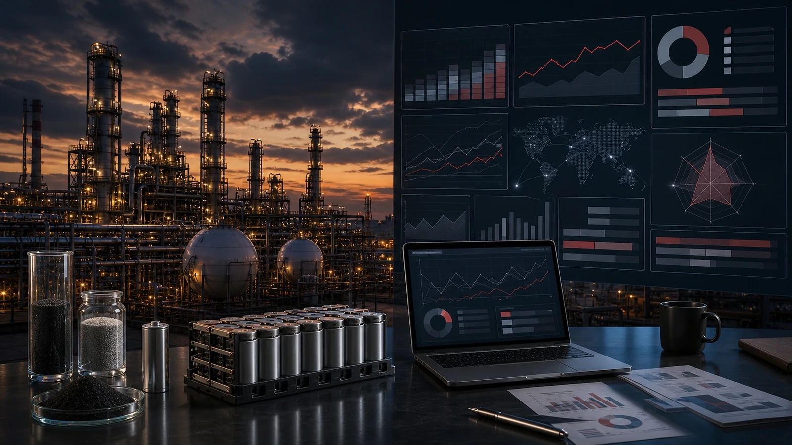
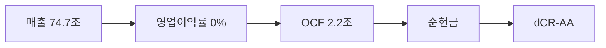

> ⚠️ **면책**: 본 보고서는 dartlab dCR v4.0 방법론에 따라 공시 데이터만으로 작성되었습니다. 제도권 신용등급과 다를 수 있으며, 투자 권유가 아닙니다. [방법론](https://github.com/eddmpython/dartlab/blob/master/src/dartlab/analysis/CREDIT.md)

> **dCR-AA** | 최우량 (notch 조정) | 2026-04-05 | 방법론 v4.0

## 1. 등급 요약

| 항목 | 값 |
|------|------|
| **신용등급** | **dCR-AA** (최우량 (notch 조정)) |
| 카테고리 | 최우량 (투자적격) |
| 종합 점수 | 18.2 / 100 |
| 부도확률(1Y) | 0.02% |
| 현금흐름등급 | eCR-4 |
| 등급 전망 | 긍정적 |
| 업종 | 에너지 (캡티브금융조정) |
| 기준 기간 | 2024Q4 |
| 구조 | 캡티브금융 복합기업 (유틸리티 기준 적용) |

```
건전도: [████████████████░░░░] 82/100
```

## 2. Executive Summary

SK이노베이션은 매출 74.7조 규모의 에너지 기업으로, **dCR-AA** (건전도 82/100) 등급이다.

dCR-AA는 [매출 74.7조원 규모]에서 출발하는 [영업이익률 0%의 수익 기반]이 [영업활동현금흐름 2.2조원의 현금창출력]를 유지하게 하고, [부채 부담 없는 순현금 구조]가 등급을 뒷받침하는 구조를 반영한다. 핵심 강점인 자본구조, 재무신뢰성, 공시리스크이 업황 변동 시에도 등급을 방어하는 완충 역할을 한다.

**인과 연결**: 인과 요약: 매출 74.7조원 → 영업이익률 0%에 불과하여, EBITDA 3,155억원 이상의 현금(영업활동현금흐름 2.2조원)을 창출하고 → 순현금 포지션을 유지한다. 종합 dCR-AA.

## 3. 재무 하이라이트

| 지표 | 값 | 전년비 |
|------|-----:|------:|
| 매출 | 74.7조 | -3.3% |
| 영업이익 | 3,155억 | -83.4% |
| EBITDA | 3,155억 | - |
| 영업현금흐름 | 2.2조 | - |
| 순차입금 | 순현금 | - |
| Debt/EBITDA | 17.6x | ↑악화 |

## 4. 사업 분석

### 4.1 기업 개요

- 섹터: 에너지 > 석유와가스
- 주요제품: 석유정제,석유화학제품,윤활유제품,아스팔트제품,의약중간체 제조,판매,유전개발,대체에너지사업
- 매출 규모: 74.7조


> **사업보고서 발췌**: "II. 사업의 내용 1. 사업의 개요 SK이노베이션은 2024년 11월 1일 부 SK E&S와의 합병을 통해 아시아·태평양 지역 민간 최대 종합 에너지 회사로 거듭났으며, 석유·화학, LNG, 전력, 배터리 등 현재와 미래 에너지를 아우르는 균형 잡힌 Energy Portfolio를 구축하였습니다.이를 통해 석유탐사 및 개발부터 석유화학제품 생산에 이르는"

### 4.2 부문별 매출 구성

| 부문 | 매출 | 비중 |
|------|-----:|-----:|
| 부문 | 63.9조 | 85.5% |
| 석유개발 | 5.1조 | 6.8% |
| 배터리 및 소재 | 3.6조 | 4.8% |
| 기타 | 1.4조 | 1.9% |
| 이엔에스 | 6,839억 | 0.9% |

## 5. 등급 근거 상세

dCR-AA는 [매출 74.7조원 규모]에서 출발하는 [영업이익률 0%의 수익 기반]이 [영업활동현금흐름 2.2조원의 현금창출력]를 유지하게 하고, [부채 부담 없는 순현금 구조]가 등급을 뒷받침하는 구조를 반영한다. 핵심 강점인 자본구조, 재무신뢰성, 공시리스크이 업황 변동 시에도 등급을 방어하는 완충 역할을 한다. 다만 유동성은 등급 하방 압력 요인으로 모니터링이 필요하다. 캡티브 금융 복합기업으로 연결 재무제표의 구조적 왜곡이 존재한다.

**인과 요약: 매출 74.7조원 → 영업이익률 0%에 불과하여, EBITDA 3,155억원 이상의 현금(영업활동현금흐름 2.2조원)을 창출하고 → 순현금 포지션을 유지한다. 종합 dCR-AA.**

### 등급 결정 요인 분해

| 축 | 점수 | 가중치 | 기여도 | 비고 |
|------|-----:|------:|------:|------|
| 채무상환능력 | 13 | 30% | 4.0점 | 양호 |
| 자본구조 | 3 | 15% | 0.5점 | 우수 |
| 유동성 | 43 | 15% | 6.4점 | 주의 ← 등급 하방 압력 |
| 현금흐름 | 24 | 15% | 3.6점 | 보통 |
| 사업안정성 | 24 | 10% | 2.4점 | 보통 |
| 재무신뢰성 | 0 | 10% | 0.0점 | 우수 |
| **합계** | | | **18.2점** | **→ dCR-AA** |

### 강점
- **자본구조**: 자본구조는 매우 건전하다.
- **재무신뢰성**: 재무 신뢰성은 우수하다.
- **공시리스크**: 공시 리스크 신호가 감지되지 않았다.

### 약점
- **유동성**: 유동성은 주의가 필요한 수준이다.

### 양호
- **채무상환능력**: 채무상환능력은 에너지 (캡티브금융조정) 업종 기준 양호한 수준이다.
- **현금흐름**: 현금흐름 창출 능력은 양호하다.
- **사업안정성**: 사업 안정성은 양호한 수준이다.

**등급 조정**: 정량 평가 기준 dCR-A- 수준이나, 다음의 정성 대리 신호를 반영하여 **-4 notch 상향** 조정했다:
- 대형기업 (매출 75조)
- 캡티브금융 별도 D/EBITDA 1.1x (양호)
- 설비투자집약 영업활동현금흐름양수 (투자 사이클)
이는 제도권 신평사가 시장 지위, 그룹 지원 등 정성 요소로 등급을 조정하는 것과 유사한 접근이다.




## 6. 재무 분석

| 축 | 비중 | 판정 | 점수 |
|------|:---:|:---:|------|
| 채무상환능력 | 30% | 양호 | ████████░░ 13/100 |
| 자본구조 | 15% | **우수** | █████████░ 3/100 |
| 유동성 | 15% | 주의 | █████░░░░░ 43/100 |
| 현금흐름 | 15% | 양호 | ███████░░░ 24/100 |
| 사업안정성 | 10% | 양호 | ███████░░░ 24/100 |
| 재무신뢰성 | 10% | **우수** | ██████████ 0/100 |
| 공시리스크 | 5% | - | ░░░░░░░░░░ 평가 불가 |

### 6.* 차입금 구성

| 구분 | 금액 | 비중 |
|------|-----:|-----:|
| 유동차입금(사채제외) | 4.7조 | 4.1% |
| 외화유동차입금(사채제외) | 2.5조 | 2.1% |
| 사채및장기차입금 | 32.2조 | 27.6% |
| 원화사채 | 12.0조 | 10.2% |
| 외화사채 | 3.4조 | 2.9% |
| 원화비유동차입금(사채제외) | 4.7조 | 4.0% |
| 외화비유동차입금(사채제외) | 12.2조 | 10.5% |
| 단기차입금에대한공시 | 12.1조 | 10.3% |
| 사채및장기차입금에대한공시 | 10.9조 | 9.3% |
| 비유동차입금의비유동성부분 | 17.7조 | 15.1% |
| 단기차입금: | 8,641억 | 0.7% |
| 원화장기차입금 | 7,590억 | 0.6% |
| 외화장기차입금 | 3.0조 | 2.6% |
| 단기차입금 | 219억 | 0.0% |
| **합계** | **117.0조** | **100%** |

### 6.1 채무상환능력 (30%)

**판정: 양호** (13점/100)

채무상환능력은 에너지 (캡티브금융조정) 업종 기준 양호한 수준이다. 매출 74.7조원 기반 EBITDA 3,155억원을 창출한다. 총차입금 5.5조원 대비 이자 부담이 사실상 없어 무차입에 준하는 재무구조다. Debt/EBITDA 17.6배로 차입금 상환에 장기간이 소요된다. FFO/총차입금 40%로 우수한 내부 현금 창출력을 보인다. 참고: 별도 기준 D/EBITDA는 1.1x로, 연결 대비 크게 양호하다.

| 지표 | 점수 | 판정 |
|------|:---:|:---:|
| FFO/총차입금 | 8 | 우수 |
| Debt/EBITDA | 85 | 주의 |
| EBITDA/이자비용 | 0 | 우수 |

### 6.2 자본구조 (15%)

**판정: 우수** (3점/100)

자본구조는 매우 건전하다. 부채비율 179%로 적정 수준의 레버리지를 활용한다. 순차입금이 마이너스(순현금 포지션)로 실질적 부채 부담이 없다. 참고: 별도 재무 기준 부채비율은 47%로, 연결(179%) 대비 크게 낮다. 이는 금융자회사 차입금이 연결에 포함되기 때문이다.

| 지표 | 점수 | 판정 |
|------|:---:|:---:|
| 부채비율 | 13 | 양호 |
| 차입금의존도 | 2 | 우수 |
| 순차입금/EBITDA | 0 | 우수 |

### 6.3 유동성 (15%)

**판정: 주의** (43점/100)

유동성은 주의가 필요한 수준이다. 유동비율 96%로 단기 유동성이 부족하다. 단기차입금 비중 100%로 차환 리스크가 존재한다. 현금비율 42%로 즉시 동원 가능한 현금이 충분하다.

| 지표 | 점수 | 판정 |
|------|:---:|:---:|
| 유동비율 | 35 | 보통 |
| 현금비율 | 3 | 우수 |
| 단기차입금비중 | 90 | 주의 |

### 6.4 현금흐름 (15%)

**판정: 양호** (24점/100)

현금흐름 창출 능력은 양호하다. 영업활동현금흐름/매출 3.0%로 현금 창출이 제한적이다. 투자 부담으로 잉여현금흐름(잉여현금흐름)이 음수이다. 영업현금흐름이 3기 연속 양수로 안정적이다.

| 지표 | 점수 | 판정 |
|------|:---:|:---:|
| 영업활동현금흐름/매출 | 35 | 보통 |
| 잉여현금흐름/매출 | 45 | 보통 |
| 영업활동현금흐름추세 | 0 | 우수 |

### 6.5 사업안정성 (10%)

**판정: 양호** (24점/100)

사업 안정성은 양호한 수준이다. 매출 변동계수 27.1%로 실적 변동성이 크다. 매출 규모 75조원으로 대형 기업의 사업 안정성을 보유한다.

| 지표 | 점수 | 판정 |
|------|:---:|:---:|
| 매출안정성 | 38 | 보통 |
| 이익안정성 | 35 | 보통 |
| 규모 | 0 | 우수 |

### 6.6 재무신뢰성 (10%)

**판정: 우수** (0점/100)

재무 신뢰성은 우수하다. Piotroski F-Score 8/9로 재무 펀더멘탈이 강건하다. 감사의견은 적정으로 재무제표 신뢰성에 문제가 없다.

| 지표 | 점수 | 판정 |
|------|:---:|:---:|
| Piotroski F | 0 | 우수 |
| 감사의견 | 0 | 우수 |

### 6.7 공시리스크 (5%)

**판정: 우수** (평가 불가)

공시 리스크 신호가 감지되지 않았다. scan 데이터 범위 내 특이 신호 없음.

## 7. 5개년 재무 시계열

| 기간 | 매출 | 영업이익 | EBITDA/이자 | Debt/EBITDA | 부채비율 | 유동비율 | 영업활동현금흐름/매출 |
|------|------|------|------|------|------|------|------|
| 2024Q4 | 74.7조 | 3,155억 | 무차입 | 17.6x ↑ | 179% ↑ | 96% ↓ | 3.0% |
| 2023Q4 | 77.3조 | 1.9조 | 무차입 | 1.6x ↓ | 169% ↓ | 113% → | 7.0% |
| 2022Q4 | 78.1조 | 3.9조 | 무차입 | 4.6x ↓ | 189% ↑ | 116% ↓ | 0.5% |
| 2021Q4 | 46.8조 | 1.8조 | 무차입 | 8.5x ↑ | 152% → | 148% ↑ | -1.0% |
| 2020Q4 | 34.2조 | -2.6조 | - | 4.7x | 149% | 121% | 8.3% |

## 8. 리스크 진단

### 8.1 감사 리스크

- 감사의견: **적정**
  - 적정 의견 **8기 연속** 유지, 재무제표 신뢰도 양호

### 8.2 우발부채

- 우발부채 만성화 신호 없음

### 8.3 공시 리스크 키워드

- 리스크 키워드(횡령/배임/과징금 등) 감지 없음

### 8.4 구조 변화

- 감사인/계열 구조 변화 없음

### 8.5 전기 대비 주요 변화

- **공시변경사항**: 전기 대비 대폭 변화 (변화 블록 3개)
- **종속회사**: 전기 대비 대폭 변화 (변화 블록 1개)
- **계열사현황**: 전기 대비 대폭 변화 (변화 블록 1개)

## 9. 등급 전망

현재 전망: **긍정적**

### 상향 트리거
- 부채비율이 현 179%에서 80% 이하로 축소
- Debt/EBITDA가 현 17.6배에서 2배 이하로 개선

### 하향 트리거
- 대규모 차입으로 이자보상배율이 5배 이하로 하락
- 부채비율이 현 179%에서 229% 이상으로 증가

## 10. 신평사 등급 대조

### 구조적 참고
- 캡티브 금융 복합기업 — 연결 재무제표에 금융자회사 차입금이 포함되어 정량 등급이 실제보다 낮을 수 있다. 제도권 등급은 제조/금융 부문을 분리하여 평가한다.
- 외부 신용등급 데이터 없음 — data/credit/external_grades.json에 등록 필요.


## 11. 등급 괴리 분석

외부 신평사 등급과 dartlab dCR 등급이 일치합니다.
이는 공시 재무 데이터만으로도 이 기업의 신용 건전성을 정확히 포착할 수 있음을 의미합니다.

주요 등급 지지 요인:
- **자본구조**: 자본구조는 매우 건전하다.
- **재무신뢰성**: 재무 신뢰성은 우수하다.
- **공시리스크**: 공시 리스크 신호가 감지되지 않았다.

dartlab dCR 등급이 외부 신평사 등급과 다를 수 있는 이유:

- 유동성 축이 43점으로 등급 하방 압력
- 잉여현금흐름 음수(영업활동현금흐름 양수) — 대규모 투자(설비투자) 사이클 중. 투자와 부실을 정량으로 구분 불가
- 주가 기반 CHS 모델이 +1.2점 하향 (PD 1.50%). 최근 주가 하락이 반영된 결과
- D/EBITDA 17.6x — 자본집약 업종 구조적 특성 (설비투자/리스 부채)
- 캡티브 금융자회사 연결 — 연결 차입금에 금융자회사 대출 원금 포함
- dartlab dCR은 공시 정량 데이터 기반. 시장 지위, 경영진, 그룹 지원 등 정성 요소는 미반영

## 12. Notch Adjustment 상세

총 조정: **-4 notch (상향)**

적용 규칙:
- 대형기업 (매출 75조)
- 캡티브금융 별도 D/EBITDA 1.1x (양호)
- 설비투자집약 영업활동현금흐름양수 (투자 사이클)

## 13. 별도재무제표 비교

연결 재무제표에 자회사 부채가 포함되어 왜곡될 수 있으므로, 별도(모회사) 재무를 함께 확인합니다.

| 지표 | 연결 | 별도 |
| --- | ---: | ---: |
| D/EBITDA | 17.6x | 1.1x |
| 부채비율 | 179% | 47% |
| 총차입금 | 5.5조 | 3.0조 |

## 14. 방법론 참조

- dartlab 독립 신용분석(dCR) v4.0
- 방법론 상세: [src/dartlab/analysis/CREDIT.md](https://github.com/eddmpython/dartlab/blob/master/src/dartlab/analysis/CREDIT.md)
- 발행일: 2026-04-05
