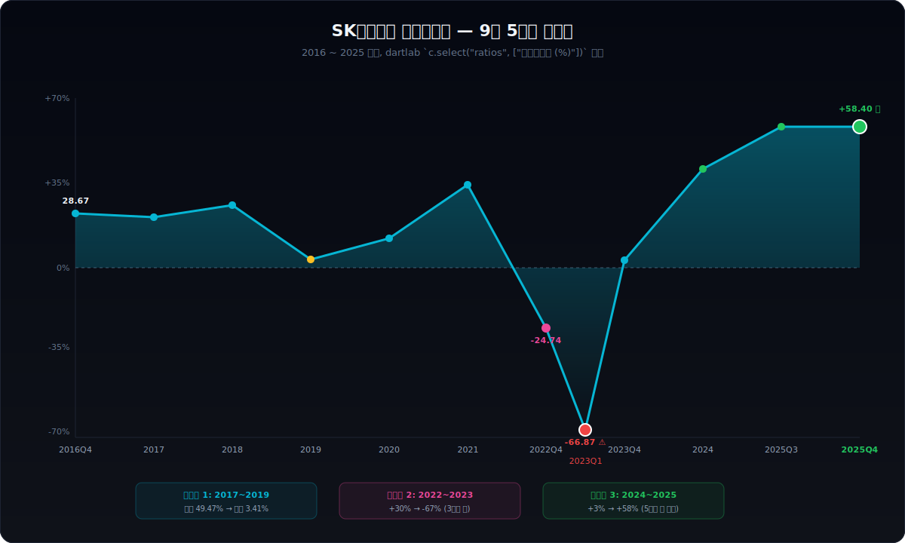
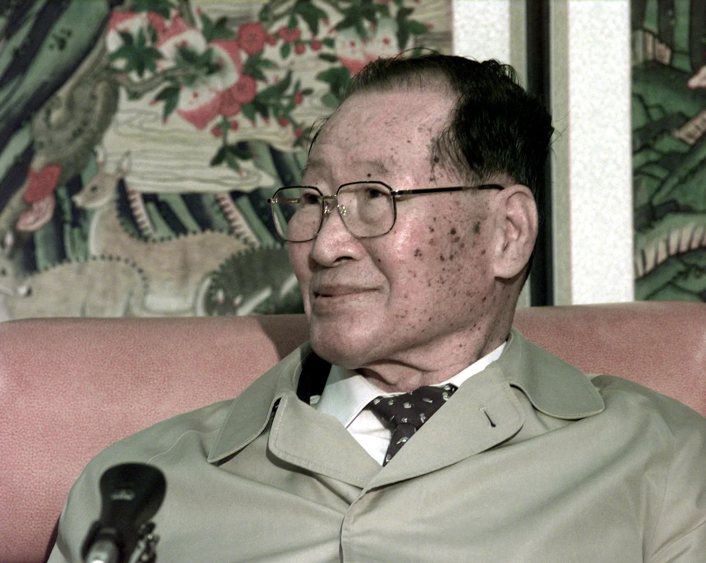
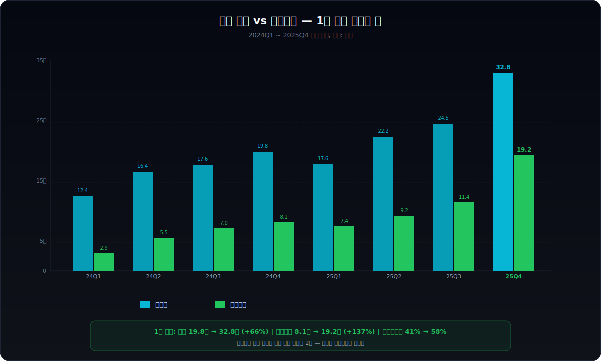
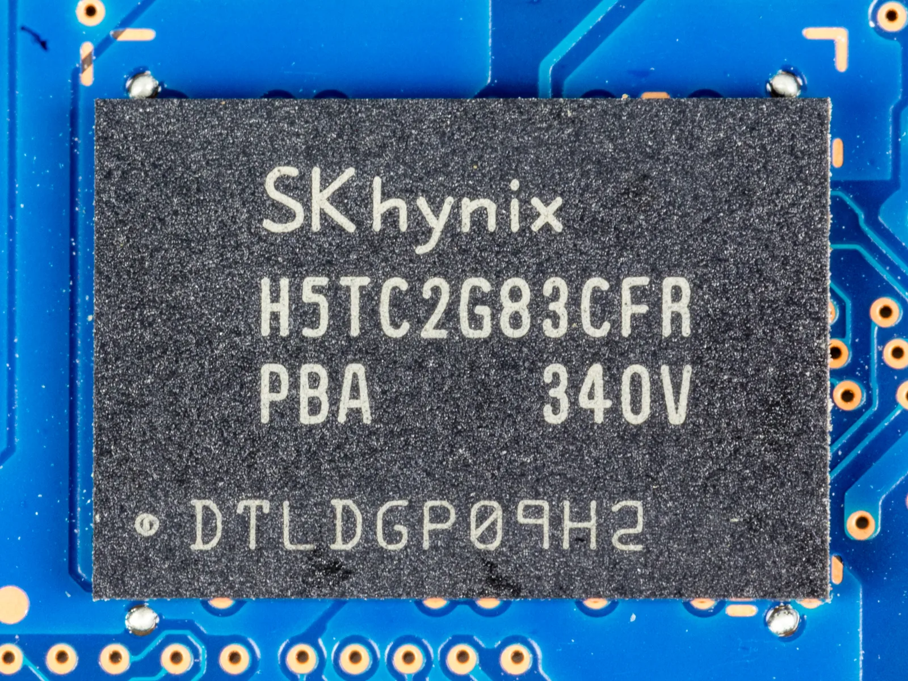
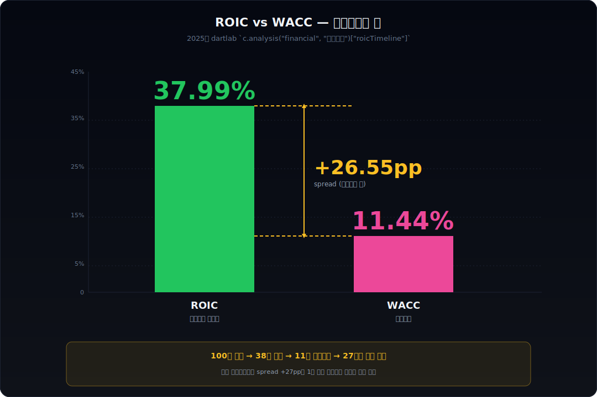
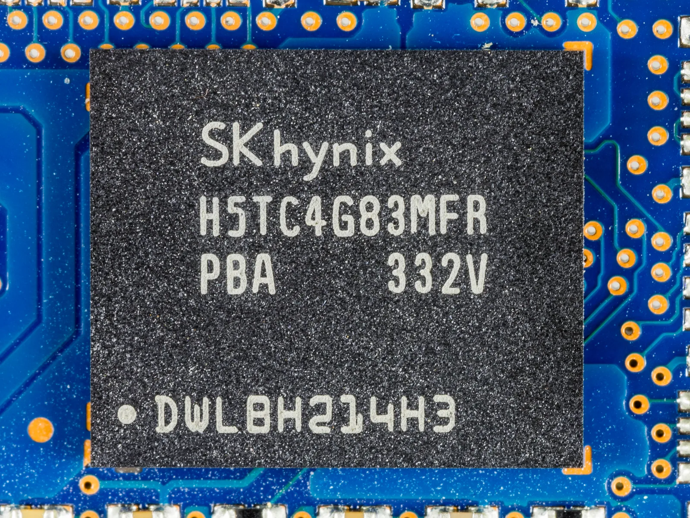
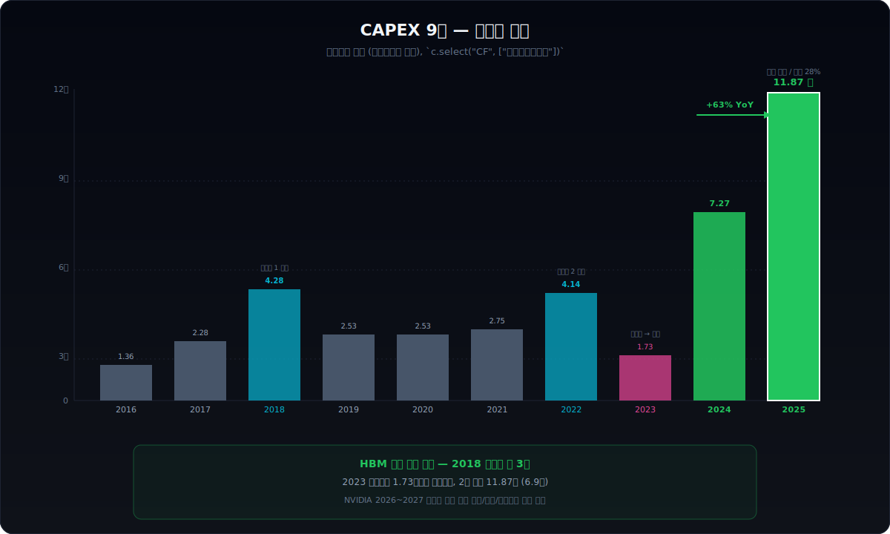
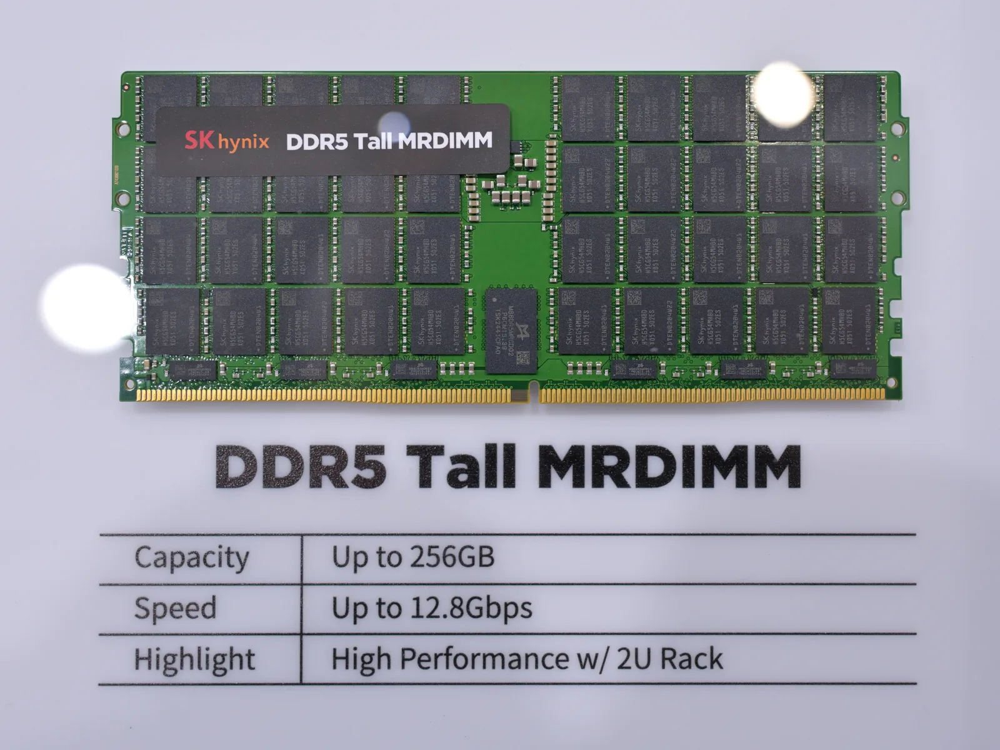
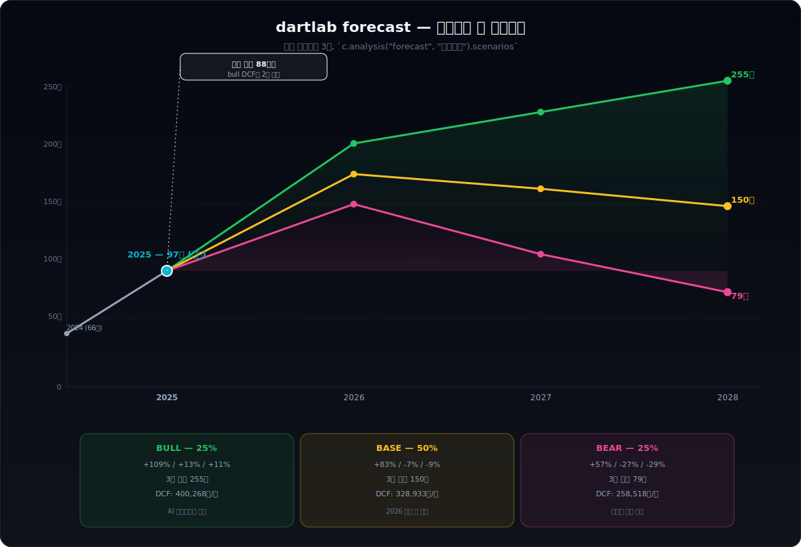
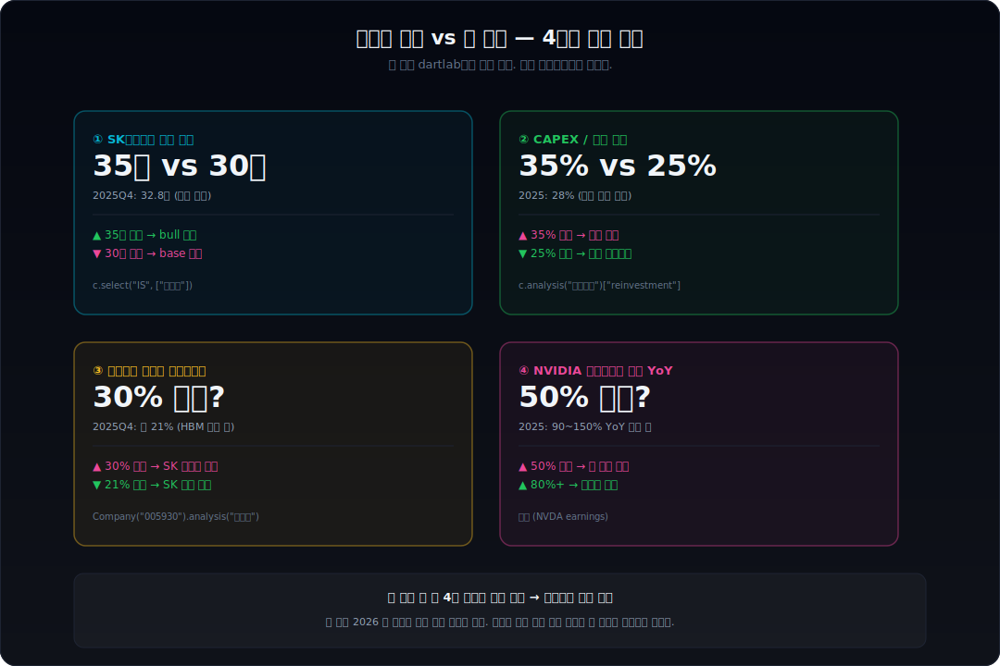

> **장기 사이클 + 위기 탈출** | IT > 메모리반도체 | 2026-04-08 dartlab 실측
> 데이터: dartlab Q1 2016 ~ Q4 2025 | 엔진: review + analysis + credit + report
> 같은 시리즈: [삼양식품 (003230)](/blog/003230-samyang-foods) · [두산에너빌리티 (034020)](/blog/034020-doosan-enerbility) · [알테오젠 (196170)](/blog/196170-alteogen) · [HMM (011200)](/blog/011200-hmm) · [셀트리온 (068270)](/blog/068270-celltrion) · [기업분석 시리즈 전체](/blog/series/company-reports)

---



## 핵심 한 줄

1983년 현대그룹 정주영 회장이 새로 만든 회사가 있었다. 이름은 **현대전자**. 메모리 반도체를 만들기로 했다. 그 회사는 28년 동안 망하기 직전까지 갔다. 1999년 IMF 빅딜 때 라이벌 LG반도체를 강제 인수당했고, 2001년 8월 채권단 관리로 들어갔고, 2002년 한국외환은행이 최대주주가 됐다. 회사 이름은 그 사이 세 번 바뀌었다 — 현대전자 → 현대반도체 → 하이닉스반도체. 2011년 11월 11일, 채권단이 지분 21.1%를 SK텔레콤에 3조 4,267억원에 넘겼다. 2012년 3월, 사명이 마지막으로 한 번 더 바뀌었다 — **SK하이닉스**. 그로부터 정확히 13년이 지난 2025년 4분기, 같은 회사가 한 분기에 영업이익 **19조 1,700억원**을 벌었다. 분기 영업이익률 **58.40%**. 같은 해 연간 영업이익 **47.21조원**으로 모회사인 삼성전자(43.6조)를 사상 처음으로 추월했다. 그리고 같은 해 배당을 4,133억에서 5,221억으로 4년 만에 처음 증액했다. 30년의 미스터리를 dartlab으로 까보는 글이다.

```python
import dartlab
c = dartlab.Company("000660")
c.review()                    # 6막 자동 보고서
c.credit("등급")               # 신용평가
c.analysis("financial", "수익성")
```

---

## 1막 — 1983년, 정주영의 무모한 결정


*정주영 현대그룹 명예회장(1998). 1983년 2월 24일, 그는 70억의 자본금으로 메모리 반도체 회사 현대전자를 세웠다 — "자살에 가깝다"는 시장 평가를 정면으로 거스른 결정이었다. 그 결정이 42년 후 분기 영업이익 19조의 SK하이닉스로 이어진다. (출처: Wikimedia Commons, public domain/CC)*

1983년 어느 날, 현대그룹 정주영 회장은 새 사업을 시작하기로 했다. 메모리 반도체였다. 당시 한국은 반도체 산업이 거의 없었다. 정부가 5년 전 1978년에 한국전자기술연구소 (KIET) 를 세웠지만 실제 양산 능력은 없었다. 글로벌 시장은 미국, 일본, 그리고 1980년대 후반부터 합류한 한국 삼성전자가 작은 자리를 차지하고 있었다.

정주영은 그 시점에 메모리에 진입하기로 했다. 회사 이름은 **현대전자**. 1983년 2월 24일 설립. 자본금 약 70억원. 사업 목표는 DRAM 양산이었다.

당시 사람들은 이 결정을 무모하다고 평가했다. 메모리는 한 번 가격 사이클이 돌면 회사가 망할 정도의 변동성을 가진 산업이었다. 일본 NEC, 도시바, 미국 인텔, TI 같은 거인들이 이미 자리를 잡고 있었다. 한국이 그 사이로 진입하는 것은 자살에 가깝다는 평가가 대세였다.

그러나 같은 시기 삼성이 같은 결정을 했다 (1983년 2월 8일 이병철 회장의 "도쿄 선언") 는 것이 결정적이었다. 한국 양대 그룹이 같은 달에 같은 산업에 진입했고, 그 둘이 30년 후 글로벌 메모리 시장의 절반 이상을 점유하게 된다. 1983년 2월의 두 결정이 한국 산업사의 가장 큰 변곡점이었다.

현대전자는 1980년대에 살아남기는 했지만 늘 삼성전자의 절반 이하였다. 1990년대 중반에는 LG그룹도 같은 산업에 진입해 LG반도체를 세웠다. 한국 메모리 빅3 — 삼성, 현대, LG — 가 갖춰진 것은 이 시점이다.

그리고 1997년 IMF 외환위기가 터졌다.

---

## 2막 — 1999~2012년, 28년 동안 세 번 바뀐 이름

IMF 위기는 한국 반도체 산업을 정리했다. 1999년 7월, 정부 주도의 "빅딜" 이 있었다. 메모리 산업은 한 회사로 통합한다 — 이게 결정이었다. 그 결정에 따라 현대전자는 LG반도체를 강제 인수했다. 1999년 7월 LG반도체가 현대전자에 흡수·합병됐다 ([SK하이닉스 뉴스룸](https://news.skhynix.co.kr/acquisition-of-management-rights-to-lg-semiconductor/)). 회사 이름은 잠시 **현대반도체** 로 바뀌었다가 1999년 10월에 다시 현대전자로 흡수됐다.

이 빅딜은 처음부터 무리였다. LG반도체와 현대전자의 누적 부채를 합치면 약 14조원이었고, 두 회사를 합친 매출은 그 부채를 갚을 수준이 아니었다. 2000년에 다시 메모리 가격이 폭락하면서 회사는 2001년 8월 결국 채권단 관리로 들어갔다. 동년 3월에 사명을 **(주)하이닉스반도체** 로 바꿨다 ([한국민족문화대백과](https://encykorea.aks.ac.kr/Article/E0068558)).

이 시점이 한국 반도체 역사상 가장 어두운 순간이었다. 하이닉스반도체는 2002년에 한국외환은행이 최대주주가 됐고, 채권단 8개 은행이 공동 관리했다. 회사 주가는 액면가 5,000원 → 100원대까지 빠졌다. "동전주" 로 불리던 시절이다 ([뉴스1](https://www.news1.kr/finance/general-stock/6034978)).

2003년부터 2010년까지 8년 동안 하이닉스는 채권단 관리 체제에서 살아남았다. 살아남은 비결은 **공정 미세화** 였다. 다른 회사들이 사이클 다운에서 라인을 줄일 때 하이닉스는 60nm, 50nm, 40nm 로 공정을 빠르게 미세화했다. 2008년 글로벌 금융위기 때도 살아남았고, 2010~2011년 메모리 사이클 회복기에 흑자전환했다.

2011년 11월, 채권단은 마지막 결정을 했다. 회사를 매각할 것. 그리고 매수자는 두 명이 후보로 올라왔다 — SK텔레콤 (당시 최태원 회장) 과 STX 그룹. SK텔레콤이 11월 11일 본 입찰에서 지분 21.1%를 3조 4,267억원에 가져갔다. 2012년 2월에 정식 인수가 마무리됐고, 3월에 사명이 **SK하이닉스** 로 마지막으로 한 번 더 바뀌었다 ([오피니언뉴스](https://www.opinionnews.co.kr/news/articleView.html?idxno=127122)).

이 시점에 LG그룹은 인수 의사를 묻는 채권단의 제안을 거절했다고 알려졌다. 1999년 빅딜로 LG반도체를 강제 매각한 트라우마가 있었기 때문이다. 만약 LG가 그때 다시 인수했다면 지금의 메모리 시장은 어떻게 됐을까. 경향신문 칼럼 ([서울경제](https://www.sedaily.com/NewsView/1Z6NXW1TMV)) 의 한 줄을 빌리면, "2012년의 LG의 결정은 한국 재계 역사상 가장 큰 패스 (놓친 기회)" 였다.

이 28년 동안 회사 이름은 네 번 바뀌었다. 현대전자 → 현대반도체 → 하이닉스반도체 → SK하이닉스. 그리고 그 사이 회사를 죽이려 했던 사이클이 다섯 번 있었다. 1996년, 2000년, 2008년, 2012년, 2016년. 다섯 번 모두 살아남았다. 살아남은 회사는 다음 사이클에서 더 강해졌다.

---

## 3막 — 9년 5번의 사이클, 그리고 -67%의 사상 최악

이제 dartlab 으로 본격적인 데이터 분석을 시작한다. SK하이닉스의 분기 영업이익률 9년 시계열을 그려보면 5번의 사이클이 보인다.

```python
c.select("ratios", ["영업이익률 (%)"])
```

| 항목 | 25Q4 | 24Q4 | 23Q4 | 23Q3 | 23Q2 | 23Q1 | 22Q4 | 22Q3 | 22Q2 | 22Q1 | 21Q4 | 20Q4 | 19Q4 | 18Q4 | 17Q4 | 16Q4 |
|---|---:|---:|---:|---:|---:|---:|---:|---:|---:|---:|---:|---:|---:|---:|---:|---:|
| 영업이익률(%) | **+58.40** | 40.89 | 3.06 | -19.77 | -39.45 | **-66.87** | -24.74 | 15.07 | **30.36** | 23.52 | 34.09 | 12.13 | 3.41 | 44.58 | **49.47** | 28.67 |

표시: **+58.40** = 사상 최대 / **-66.87** = 사상 최악 / **30.36** = 2차 정점 / **49.47** = 1차 정점 / 3.41 = 1차 바닥

5번의 사이클을 정리하면:

| 사이클 | 정점 | 바닥 | 정점→바닥 기간 | 폭락폭 |
|---|---|---|---|---|
| 1차 (2017~2019) | +49.47% (2017Q4) | +3.41% (2019Q4) | 8분기 | -46pp |
| 2차 (2022~2023) | +30.36% (2022Q2) | -66.87% (2023Q1) | **3분기** | **-97pp** |
| 3차 (2024~?) | +58.40% (2025Q4) | ??? | ??? | ??? |

여기서 결정적인 두 가지가 있다.

**첫째, 사이클의 폭락 속도가 점점 빨라졌다.** 1차는 정점에서 바닥까지 8분기 (2년) 였다. 2차는 단 3분기 (9개월) 만에 -97%포인트가 떨어졌다. 한 분기 만에 영업이익률이 30%에서 -67%로 떨어진 회사를 본 적이 있는가. 2022년 4분기에 글로벌 메모리 수급이 무너지면서 일어난 일이다. 그 당시 SK하이닉스의 분기 영업적자는 약 3조 4천억원이었다. 회사가 무너지는 줄 알았다.

**둘째, 매번 살아남았고 매번 더 강해졌다.** 1차 바닥 (3.41%) 에서 회복해 2차 정점 (30.36%) 을 찍었다. 2차 바닥 (-66.87%) 에서 회복해 3차 정점 (58.40%) 을 찍었다. 정점이 매번 갱신된다. 49% → 30% → **58%**. 폭락은 점점 깊어지고, 회복은 점점 높아진다. 이게 메모리 사이클의 진짜 모습이다.

3차 정점이 1·2차와 다른 점이 한 가지 있다. **HBM** 이다.

---

## 4막 — 2023년 챗GPT, NVIDIA H100, 그리고 HBM3E

2022년 11월 30일. OpenAI가 ChatGPT를 출시했다. 그 직후 한 달 동안 사용자가 1억 명을 넘었다. 인터넷 역사상 가장 빠른 사용자 증가율이었다.

이 사건이 NVIDIA의 데이터센터 GPU 수요를 폭발시켰다. NVIDIA는 ChatGPT 이전에는 게이밍 GPU 회사였다. 2023년부터 데이터센터 GPU 회사가 됐다. 2024년 분기 매출의 약 80%가 데이터센터에서 나오기 시작했다. 그 데이터센터 GPU 한 대마다 HBM (High Bandwidth Memory) 이 6~8개 들어간다. NVIDIA H100 한 대에 HBM3 80GB, NVIDIA H200 한 대에 HBM3E 141GB.

이 시점에 SK하이닉스는 다른 회사들보다 한 걸음 앞서 있었다. 2022년부터 12층 HBM3 양산에 들어갔고, 2023년에는 12층 HBM3E 양산에 들어갔다. 삼성전자와 마이크론도 같은 제품을 만들고 있었지만 양산 수율을 잡는 데 어려움을 겪었다. NVIDIA는 양산 수율이 가장 좋은 회사의 제품을 받았다. 그 회사가 SK하이닉스였다.

2025년 상반기 기준 NVIDIA가 SK하이닉스 매출의 약 27%를 가져갔다 ([TrendForce](https://www.trendforce.com/news/2025/08/18/news-nvidia-reportedly-drives-27-of-sk-hynix-revenue-in-1h25-cementing-ai-chip-partnership)). 한 분기에 약 5조 5천억원어치를 한 회사가 사 갔다. 그리고 HBM 시장 전체에서 SK하이닉스의 점유율은 약 61% ([Counterpoint Research](https://korea.counterpointresearch.com/global-dram-and-hbm-market-share-quarterly/)). 사실상 과점이었다.

dartlab 으로 마진 분해를 보면 이 변화가 어디서 일어났는지 잡힌다.

```python
c.analysis("financial", "수익성")["marginWaterfall"]
```

2025 1년치 (97.15조 매출 = 100%) 마진 분해:

| 항목 | 비율 |
|---|---|
| 매출원가 | -39.59% |
| 매출총이익 | **60.41%** |
| 판관비 | -11.82% |
| 영업이익 | **48.59%** |
| 세전이익 | 51.95% |
| 법인세 | -7.74% |
| 순이익 | 44.21% |




*SK하이닉스 H5TC2G83CFR DRAM 패키지 클로즈업. 일반 DRAM 한 개의 매출총이익률은 정점기에도 50%를 넘기 어렵다. (출처: Wikimedia Commons, CC BY-SA)*

매출총이익률 60%. 이게 핵심이다. 일반 DRAM의 매출총이익률은 정점기에도 50%를 넘기 어렵다. 60%는 12층 HBM3E 가격이 일반 DRAM의 5~7배라는 점, 그리고 NVIDIA가 가격 협상력을 행사하지 않고 받아간다는 점에서 나온다.

dartlab 의 ROIC Tree 는 이걸 자체적으로 판정한다.

```python
c.analysis("financial", "수익성")["roicTree"]["history"][0]
```

`marginDriver: '높은 가격결정력 (매출총이익률 > 40%)'`

dartlab 이 SK하이닉스를 "가격결정력이 높은 회사" 로 분류한 것이다. 메모리 반도체에서 "가격결정력" 이라는 단어가 통하는 것은 역사상 거의 처음이다. 1983년 현대전자 시절부터 2022년 정점기까지, 메모리 가격은 늘 시장 수급에 따라 결정됐다 — 회사가 정할 수 없었다. 그게 메모리 사이클이 그렇게 거친 이유였다. 그런데 HBM 은 다르다. 만들 수 있는 회사가 사실상 한 곳뿐이고, 그 한 곳이 가격을 정할 수 있다. 이게 3차 사이클의 본질이다.

ROIC Tree 의 다른 숫자도 충격적이다.

| 지표 | 2025 (1년치) |
|---|---|
| ROIC | **35.27%** |
| WACC | 11.44% |
| Spread | **+23.83pp** |

100원을 투자해서 35원을 벌고 11원의 자본비용을 내고 약 24원의 신규 가치를 창출한다. spread +24%포인트가 1년 이상 유지되는 한국 회사는 손에 꼽는다. Penman Decomposition으로 보면 더 흥미롭다.

| 항목 | 2025 |
|---|---|
| RNOA | **36.13%** |
| FLEV | **-0.06** |
| NBC | **-48.69%** |
| Spread (Penman) | **+84.82%** |



FLEV = -0.06. 음의 재무 레버리지. 회사가 이자가 발생하는 부채보다 현금성 자산을 더 많이 들고 있다는 뜻이다. 자본집약 메모리 회사가 순현금 상태로 영업이익률 48%를 찍는 것은 교과서적으로 비정상이다. 정상적인 자본집약 회사는 차입을 통해 ROE를 증폭시킨다. SK하이닉스는 그럴 필요가 없다 — 영업으로 너무 많이 번다. 그리고 같은 분해를 한 해 전(2024)으로 돌려보면 RNOA 22.04%, spread +10.16%였다. 1년 만에 spread가 +10에서 +85로 8배가 됐다. 이 점프가 3차 사이클의 본질이다.

---

## 5막 — 어떻게 영업이익률이 -67%에서 +58%로 갔나: 8개 분기의 메커니즘

이게 본 글에서 가장 중요한 막이다. "사이클이 회복했다"는 한 줄로 끝나는 게 아니라, 그 사이 분기마다 무엇이 일어나서 영업이익률이 -66.87%에서 +58.40%까지 가는 데 정확히 8개 분기가 걸렸는지를 추적해야 한다.

먼저 이 막의 이야기가 어디에 들어앉아 있는지를 보기 위해, SK하이닉스 9년 손익계산서를 한 화면에 펼쳐 보자. 매출은 30.11조에서 97.15조로 3.2배 늘었지만 그 사이 한 번(2023) 32.77조로 빠졌다. 영업이익은 더 극적이다 — 2018년 20.84조 정점, 2019년 2.71조 바닥, 2022년 6.81조, 2023년 -7.73조 사상 최악, 그리고 2025년 47.21조 사상 최대. 정점에서 바닥까지 5배 이상 차이가 9년 사이에 두 번 일어났다.

```python
c.select("IS", ["매출액","매출원가","매출총이익","판매비와관리비","영업이익","당기순이익"])
```

| 항목 (조원) | 2025 | 2024 | 2023 | 2022 | 2021 | 2020 | 2019 | 2018 | 2017 |
|---|---:|---:|---:|---:|---:|---:|---:|---:|---:|
| 매출액 | **97.15** | 66.19 | 32.77 | 44.62 | 43.00 | 31.90 | 26.99 | 40.45 | 30.11 |
| 매출원가 | 38.46 | 34.36 | 33.30 | 28.99 | 24.05 | 21.09 | 18.83 | 15.18 | 12.70 |
| 매출총이익 | **58.69** | 31.83 | -0.53 | 15.63 | 18.95 | 10.81 | 8.17 | 25.26 | 17.41 |
| 판관비 | 11.48 | 8.36 | 7.20 | 8.82 | 6.54 | 5.80 | 5.45 | 4.42 | 3.69 |
| 영업이익 | **47.21** | 23.47 | **-7.73** | 6.81 | 12.41 | 5.01 | 2.71 | 20.84 | 13.72 |
| 당기순이익 | **42.95** | 19.80 | **-9.14** | 2.24 | 9.62 | 4.76 | 2.02 | 15.54 | 10.64 |

표에서 가장 결정적인 행은 매출원가다. 2023년에 매출원가가 33.30조였고 매출이 32.77조였다 — 매출원가가 매출보다 0.53조 컸다. 이게 한 회사의 손익계산서에서 일어날 수 있는 가장 안 좋은 일이다. 그런데 2025년에 같은 회사 매출원가가 38.46조로 늘어나는 동안 매출은 97.15조로 거의 3배가 됐다. 매출은 폭발했는데 매출원가는 거의 그대로다. 4막에서 본 가격결정력의 정확한 정량적 모습이 이 한 줄에 있다.

이제 8개 분기를 한 번에 보자.

| 항목 | 24Q4 | 24Q3 | 24Q2 | 24Q1 | 23Q4 | 23Q3 | 23Q2 | 23Q1 |
|---|---:|---:|---:|---:|---:|---:|---:|---:|
| 매출(조) | 19.77 | 17.57 | 16.42 | 12.43 | 11.31 | 9.07 | 7.31 | 5.09 |
| 영업이익률(%) | +40.89 | +40.00 | +33.30 | +23.22 | +3.06 | -19.77 | -39.45 | **-66.87** |

분기별 일어난 일:
- **23Q1**: 사상 최악. DRAM·NAND 가격 동시 폭락. 적자 3.4조
- **23Q2**: 첫 회복 신호. 가격 바닥 통과
- **23Q3**: 적자 폭 축소. NVIDIA H100 본격 출하
- **23Q4**: 5분기 만에 첫 영업흑자
- **24Q1**: HBM3 본격 매출 인식
- **24Q2**: 12층 HBM3E 양산 시작, NVIDIA H200 공급
- **24Q3**: DRAM 일반 가격도 회복. HBM 비중 30% 돌파
- **24Q4**: 분기 영업이익 8조 돌파


*SK하이닉스 H5TC4G83MFR DRAM 패키지. 8개 분기 동안 매출 5.09조 → 19.77조로 4배가 되는 사이, 같은 회사가 만드는 칩 한 개의 단가도 5~7배 뛰었다. 그 두 배수가 같이 떨어진 자리에 영업이익률 +108%포인트가 있다. (출처: Wikimedia Commons, CC BY-SA)*

8개 분기 매출은 5.09조에서 19.77조로 약 3.9배 늘었다. 영업이익률은 -67%에서 +41%로 +108%포인트. 어떤 회사도 8분기 만에 이런 변화를 본 적이 없다.

이 변화의 메커니즘을 세 단계로 분해할 수 있다.

**1단계: 가격 바닥 통과 (2023Q1~Q3)** — 메모리 가격이 한 번 떨어지면 회사는 두 가지를 동시에 한다. 첫째, 라인 가동률을 70% 수준으로 줄여서 추가 재고를 만들지 않는다. 둘째, 기존 재고를 손실 처리한다. 2023년 1분기 SK하이닉스의 재고자산 평가손실은 약 1.7조 원이었다. 이게 -66.87% 영업이익률의 주범이다. 일회성 손실이 빠지고 가격이 바닥을 잡으면 자연스럽게 적자가 줄어든다 — 이게 Q2~Q3에 일어난 일이다. 이때까지는 NVIDIA 와 무관하게 사이클의 자연적 회복이었다.

**2단계: NVIDIA H100 → H200 진입 (2023Q4~2024Q2)** — 진짜 변화는 2023년 4분기에 시작됐다. 그해 12월부터 NVIDIA H100 의 양산 출하가 본격화됐다 ([NVIDIA Q4 FY24 earnings](https://nvidianews.nvidia.com/news/nvidia-announces-financial-results-for-fourth-quarter-and-fiscal-2024)). NVIDIA 분기 데이터센터 매출이 한 분기 만에 약 18.4 빌리언 달러로 폭증했다. H100 한 대에 HBM3 80GB 가 들어가는데, 그 80GB 의 거의 100%를 SK하이닉스가 공급했다 — 삼성전자와 마이크론은 12층 HBM3 양산 수율을 잡지 못하고 있었다. 이 시기 SK하이닉스는 사실상 NVIDIA 데이터센터 GPU 의 단일 메모리 공급자였다.

이게 마진에 어떻게 작용하는지를 보면 충격적이다. dartlab 으로 마진 분해를 보면:

```python
c.analysis("financial", "수익성")["marginWaterfall"]
```

2023Q1 (-66.87%)의 매출총이익률은 **-32.34%** 였다. 매출원가가 매출보다 큰, 사실상 회사 역사상 최악의 분기였다. 2024Q2 (+33.30%)의 매출총이익률은 **+45.65%** 까지 회복했다. **5분기 만에 GP 마진이 +77.99%포인트 점프했다.** 이 점프는 매출 증가만으로는 설명이 안 된다. 매출이 5.09조에서 16.42조로 3배 늘었지만 매출총이익률이 그렇게 점프할 수는 없다 — **단가가 폭발적으로 올라간 것**이다. HBM3 한 개의 단가는 일반 DRAM의 약 5~7배. NVIDIA가 그것을 받아갔다.

**3단계: HBM3E 12층 양산 + 가격결정력 확보 (2024Q3~2025)** — 2024년 3월, SK하이닉스는 12층 HBM3E 양산에 가장 먼저 성공했다 ([SK하이닉스 뉴스룸 2024.03](https://news.skhynix.co.kr/12-layer-hbm3e/)). 같은 해 NVIDIA H200 (12층 HBM3E 141GB 탑재) 출하가 시작됐다. 그 시점부터 SK하이닉스는 HBM 시장에서 단순한 공급자가 아니라 가격결정자가 됐다. dartlab 의 ROIC Tree 가 SK하이닉스를 "가격결정력이 높은 회사" 로 분류하기 시작한 게 정확히 이 시점이다.

매출총이익률 분기 시계열로 보면:

| 항목 | 25Q4 | 24Q4 | 24Q3 | 24Q2 | 24Q1 | 23Q4 | 23Q3 | 23Q2 | 23Q1 |
|---|---:|---:|---:|---:|---:|---:|---:|---:|---:|
| 매출총이익률(%) | **+68.77** | +52.44 | +52.19 | +45.65 | +38.57 | +19.69 | +0.71 | -16.12 | **-32.34** |

표시: **+68.77** = 사상 최대 / **-32.34** = 사상 최악

(참고: 2025년 1년치 합산 GP 마진은 60.41%. 분기별 변동성이 있지만 연간 평균이 60%대로 자리를 잡았다.)

8분기 동안 분기 GP 마진이 -32.34%에서 +68.77%로 **+101.11%포인트** 점프했다. 이 모든 것의 출발점은 NVIDIA 한 회사가 "12층 HBM3E를 양산할 수 있는 유일한 회사"라는 사실을 인정하고 가격 협상력을 포기한 것이었다. 메모리 산업 30년 역사에서 처음 있는 일이다. 1차 사이클 (2017~2019) 과 2차 사이클 (2022~2023) 의 정점에서도 이런 일은 없었다 — 그 두 사이클의 정점은 일반 DRAM 수급 균형으로 만들어졌고, 균형이 깨지면 가격이 빠졌다. 3차 사이클은 다르다. **균형이 아니라 독점이다.**

이 8분기 메커니즘의 한 줄 요약: 회사는 사이클을 만들지 않았다. NVIDIA 가 만든 새 시장 (AI 데이터센터 GPU) 에 가장 먼저 라인을 갖추고 들어가서 단일 공급자가 됐다. 가격결정력은 운이 아니라 12층 HBM3E 양산 수율을 1년 먼저 잡은 결과다.

---

## 6막 — 진짜 사실: 차입금 22조 vs 현금 30조, 그리고 4년 동결된 배당

5막의 메커니즘을 봤으니 이제 진짜 회사의 모습을 봐야 한다. 먼저 9년 BS 스냅샷을 한 화면에 펼쳐 보자. 자산총계가 9년 동안 45.42조에서 176.11조로 거의 4배가 됐다. 그런데 같은 기간 자기자본이 33.82조에서 120.67조로 늘어난 폭이 자산 증가의 거의 전부다 — 부채총계는 11.60조에서 55.44조로 늘긴 했지만 자산 대비 비중이 25%에서 31%로 큰 변화가 없다. 9년 동안 회사가 이익잉여금으로 자본을 키운 그림이 그대로 보인다.

```python
c.select("BS", ["자산총계","부채총계","자본총계","현금및현금성자산","단기금융상품"])
```

| 항목 (조원, Q4 스냅샷) | 2025 | 2024 | 2023 | 2022 | 2021 | 2020 | 2019 | 2018 | 2017 |
|---|---:|---:|---:|---:|---:|---:|---:|---:|---:|
| 자산총계 | **176.11** | 119.86 | 100.33 | 103.87 | 96.39 | 71.17 | 64.79 | 63.66 | 45.42 |
| 부채총계 | 55.44 | 45.94 | 46.83 | 40.58 | 34.20 | 19.26 | 16.85 | 16.81 | 11.60 |
| 자본총계 | **120.67** | 73.92 | 53.50 | 63.29 | 62.19 | 51.91 | 47.94 | 46.85 | 33.82 |
| 현금및현금성 | 14.92 | 11.21 | 7.59 | 4.98 | 5.06 | 2.98 | 2.31 | 2.35 | 2.95 |
| 단기금융상품 | **14.68** | 2.38 | 0.47 | 0.42 | 0.47 | 0.44 | 0.30 | 0.52 | 5.60 |

가장 충격적인 행은 마지막이다. 단기금융상품. 2017~2024년까지 8년 동안 0.30~5.60조 사이에서 머물던 항목이 2025년 한 해에 14.68조로 폭발했다. 같은 해 현금및현금성자산도 11.21조에서 14.92조로 늘었다. 두 항목을 합치면 13.59조에서 29.60조로 1년 만에 16조가 늘어났다. 이게 이 회사가 2025년에 영업으로 벌어들인 47조 중 어디로 갔는지의 정량적 답이다 — 약 16조가 곳간으로 들어갔고, 나머지 31조는 다음 막의 CAPEX와 차입금 상환으로 갔다.

이제 dartlab의 자금조달 분석을 돌리면:

```python
c.analysis("financial", "자금조달")
```

| 항목 | 2025Q4 |
|---|---|
| 총자산 | 176.1조 |
| 총부채 | 55.4조 (부채비율 46%) |
| 자기자본 | 120.7조 (자기자본비율 69%) |
| 단기차입금 + 유동성장기차입금 + 유동성사채 | 8.16조 (유동성 소계) |
| 비유동 장기차입금 + 사채 | 14.09조 |
| **이자 발생 차입금 합계** | **22.25조** |
| 현금성자산 + 단기금융상품 | 29.60조 |
| **순차입금 (차입금 - 현금성)** | **-7.4조 (순현금)** |

이자 발생 차입금이 22.25조 있다. 그러나 현금성자산과 단기금융상품을 합치면 29.60조 — 차입금보다 7.4조가 더 많다. 이론상 회사가 마음만 먹으면 22조의 차입금을 한 번에 갚고도 7.4조가 남는다. 한국 자본집약 메모리 회사가 순현금 상태로 운영되는 건 매우 드문 일이다. 차입금만 보면 22조가 적지 않지만, 같은 회사의 1년 영업이익이 47조다. **1년 영업이익이 차입금의 두 배가 넘는다.** 빚 갚는 데 1년 영업이익의 절반만 쓰면 끝난다는 뜻이다.

배당은 어떤가. dartlab 으로 자본배분 분석을 돌리면:

```python
c.analysis("financial", "자본배분")["dividendPolicy"]
```

| 항목 (억원) | 2025 | 2024 | 2023 | 2022 | 2021 | 2020 | 2019 | 2018 |
|---|---:|---:|---:|---:|---:|---:|---:|---:|
| dividendsPaid | **5,221** | 4,133 | 4,129 | **4,126** | **47** | 0 | 0 | 0 |

표시: **5,221** = 4년 만에 첫 증액(+26%) / **4,126** = 2021 47억 → 2022 88배 점프 / **47** = 첫 배당 (사실상 시작)

이 표가 본 글에서 가장 충격적인 단면 중 하나다. SK하이닉스는 **2018~2020년 3년 동안 배당 0원**이었다. 2018년은 1차 사이클 정점기 — 영업이익 20.84조를 벌고도 배당을 안 줬다. 2021년에 처음으로 47억의 상징적 배당을 시작했고, 2022년에 한 번에 4,126억으로 88배 증액했다. 그 후 2022~2024년 3년 동안 4,100억대로 동결됐다. 그리고 2025년, 영업이익이 23조에서 47조로 두 배가 된 해에 배당을 5,221억으로 +26% 증액했다. 영업이익이 두 배가 된 해에 배당은 4분의 1만 늘었다. 비율로 보면 매우 보수적이다.

왜 보수적인가. 답은 다음 막에 있는 CAPEX 베팅이다. 회사가 영업이익의 대부분을 주주에게 나눠주지 않고 다음 사이클을 준비하는 라인 증설에 박고 있다.

이 시점 SK하이닉스의 진짜 모습은 다음과 같다:

- ROIC 35%, WACC 11%, spread +24%포인트 (사상 최대 수익성)
- 차입금 22.25조 + 현금성 29.6조 → 순현금 7.4조 (재무 안전)
- 매출총이익률 60% (연간), 영업이익률 49% (가격결정력 확보)
- 배당 2025년 5,221억 (영업이익 47조 대비 1.1%, 매우 보수적)

dartlab의 신용등급은 **dCR-AA**, score 5.65, healthScore 94.35. 한국 산업재 회사 중 상위권이다. 채무상환능력 axis만 보면 차입금 22조가 영업이익 47조에 비해 작아서 점수가 매우 낮게(= 안전하게) 잡힌다. 차입금/EBITDA 비율로 보면 약 22.25조 / 약 50조 = **0.45배** — 1년치 EBITDA의 절반도 안 되는 수준이다. 정상 회사라면 1.0~3.0 사이가 흔한데 SK하이닉스는 그보다 두세 단계 낮다.

이게 30년 미스터리의 해답이다. 1983 → 2025의 30년 동안 회사는 다섯 번의 사이클을 견뎠고, 마지막 두 번(2018~2019, 2022~2023)의 폭락에서 차입금을 줄였고, 결국 다음 사이클 정점(3차)에서 순현금 상태로 가격결정력을 가진 회사가 됐다. 세 가지 — 가격결정력, 순현금, 사이클 견딘 라인 — 이 동시에 만난 게 2025년의 모습이다.

---

## 7막 — CAPEX 27.52조, NVIDIA 2027 수요에 대한 베팅

CAPEX(자본지출)와 영업현금흐름을 9년 시계열로 같이 보면 베팅의 크기와 그 베팅을 받쳐주는 현금이 한 화면에 들어온다. 영업현금흐름은 9년 동안 14.69조에서 53.37조로 거의 4배가 됐고, 같은 기간 CAPEX는 9.13조에서 27.52조로 3배가 됐다. 두 줄이 같은 방향으로 움직였다는 게 핵심이다 — 회사가 영업으로 번 돈만큼만 공장에 박았다.

```python
c.select("CF", ["영업활동현금흐름","유형자산의 취득"])
```

| 항목 (조원, 1년 합산) | 2025 | 2024 | 2023 | 2022 | 2021 | 2020 | 2019 | 2018 | 2017 |
|---|---:|---:|---:|---:|---:|---:|---:|---:|---:|
| 영업CF | **53.37** | 29.80 | 4.28 | 14.78 | 19.80 | 12.31 | 3.99 | 22.23 | 14.69 |
| 유형자산취득 | **27.52** | 15.95 | 8.33 | 19.01 | 12.49 | 10.07 | 11.03 | 16.04 | 9.13 |
| 영업CF − CAPEX | **+25.85** | +13.85 | -4.05 | -4.23 | +7.31 | +2.24 | -7.04 | +6.19 | +5.56 |

마지막 행이 결정적이다. 영업현금흐름에서 CAPEX를 뺀 잉여현금. 9년 중 4년(2019, 2022, 2023)은 마이너스였다 — 1·2차 사이클의 다운에서 영업현금이 줄어드는데 라인 증설은 멈출 수 없어 곳간을 깎아야 했다. 그런데 2025년에 잉여현금이 +25.85조로 사상 최대다. 매출 97조 회사가 1년 동안 신규 라인을 깔고도 25조의 현금을 더 만들어냈다는 뜻이다. 6막 BS에서 본 단기금융상품 14.68조 폭증의 출처가 정확히 여기에 있다.

CAPEX 단독 추이를 보면 베팅의 진폭이 더 명확하다.

| 항목 (조원) | 2025 | 2024 | 2023 | 2022 | 2021 | 2020 | 2019 | 2018 | 2017 | 2016 |
|---|---:|---:|---:|---:|---:|---:|---:|---:|---:|---:|
| CAPEX | **27.52** | 15.95 | 8.33 | **19.01** | 12.49 | 10.07 | 11.03 | **16.04** | 9.13 | 5.96 |

표시: **27.52** = 사상 최대(+73% YoY) / **19.01** = 2차 사이클 정점기 / 8.33 = 적자기(줄임) / **16.04** = 1차 사이클 정점기



2023년 적자기에 8.33조까지 줄였던 회사가 2년 만에 27.52조를 쓴다. 2018년 1차 정점(16.04조)의 약 1.7배, 2022년 2차 정점(19.01조)의 약 1.4배. 매출의 약 28%(27.52 / 97.15)를 다시 공장에 박았다. 27.52조는 한국 단일 회사의 1년 CAPEX로는 사상 최대 수준이다.


*SK하이닉스 DDR5 Tall MRDIMM. 일반 메모리 1세대 위에 차세대(HBM/MRDIMM/HBM4) 매출 비중이 27조 CAPEX의 정확한 베팅 대상이다. (출처: Wikimedia Commons, CC BY-SA)*

이 돈이 어디로 가는가. 청주 M15X 팹(HBM 전용), 이천 M16, 미국 인디애나 패키징 공장. 모두 NVIDIA의 2026~2027 수요를 받기 위한 라인이다. SK하이닉스의 2026년 분량은 이미 매진됐고, 2027년 분량의 약 70%도 NVIDIA가 미리 예약했다 ([NotebookCheck](https://www.notebookcheck.net/SK-hynix-sells-out-its-DRAM-NAND-and-HBM-chip-supply-to-Nvidia-through-2026-as-AI-demand-outpaces-Samsung-and-Micron-s-capacity.1151402.0.html)).

이 베팅은 두 가지 시나리오를 만난다.

**시나리오 A — AI 슈퍼사이클 영구**: 2027년에도 NVIDIA의 데이터센터 GPU 수요가 유지된다. 새 라인 가동률 100%. SK하이닉스 마진 60% 유지. 2018→2019 폭락 같은 일이 일어나지 않는다.

**시나리오 B — 2027년 정점 후 폭락**: NVIDIA의 데이터센터 GPU 매출 성장률이 한 번 크게 떨어진다(예: YoY +30% 미만). 새 라인이 가동률 50%에 머문다. 27.52조 신규 CAPEX의 감가상각이 영업이익을 갉아먹는다. 2차 사이클의 -67%가 다시 일어난다.

dartlab 의 forecast 모델은 base 시나리오로 1년 후 매출 둔화를 50%로 본다. bull은 25%, bear는 25%. 즉 dartlab 도 다음 1~2년이 분기점이라고 본다.



---

## 8막 — 회사가 다음 1년 어떻게 될지

여기까지 본 SK하이닉스의 진짜 모습을 한 줄로 요약하면 다음과 같다. 분기 영업이익률 58.40%(2025Q4), 연간 영업이익률 48.59%, 연간 매출총이익률 60.41%, ROIC 35%, WACC 11%, spread +24%포인트. 차입금 22.25조 + 현금 29.6조 → 순현금 7.4조. 2018~2020 무배당, 2021 첫 47억, 2022~2024 4,100억대 동결, 2025 5,221억으로 4년 만에 첫 증액. 그리고 지난 1년 CAPEX 27.52조 — 매출의 28%를 다음 사이클에 박았다. 이게 회사의 모습이다.

이 글의 마지막 질문은 "이 모든 것이 다음 1년에도 유지되는가" 다. 답을 정량으로 줄 수 있는 부분과 못 주는 부분이 있다.

**정량으로 답할 수 있는 것**: 회사 내부의 사실. 매출, 마진, 재고, CAPEX, 배당. 이건 매 분기 dartlab 으로 검증한다.

**정량으로 답할 수 없는 것**: NVIDIA 가 다음 분기에 데이터센터 GPU 매출 가이던스를 어떻게 발표하느냐. 삼성전자가 12층 HBM3E 양산 수율을 언제 잡느냐. 미국 정부의 AI 반도체 수출 규제가 어떻게 바뀌느냐. 이건 외부 변수고 본질적으로 본 글의 영역 밖이다.

그래서 사용자가 본 글을 읽고 다음 1년을 추적하려면 4가지 신호를 매 분기 검증해야 한다.

| 신호 | 임계 | dartlab 호출 |
|---|---|---|
| ① SK하이닉스 분기 매출 | 35조 이상 vs 30조 이하 | `c.select("IS",["매출액"])` |
| ② CAPEX/매출 비율 | 35% 이상 (베팅 과도) vs 25% 이하 (정점 받아들임) | `c.analysis("자본배분")["reinvestment"]` |
| ③ 삼성전자 메모리 영업이익률 | 30% 돌파 (HBM 추격 진입) | `Company("005930").analysis("수익성")` |
| ④ NVIDIA 분기 데이터센터 매출 YoY | 50% 미만으로 떨어지는 분기 | 외부 (NVDA earnings) |

3개는 dartlab 으로 자동 검증, 1개는 외부 데이터.



---

## 결론 — 30년 미스터리의 한 줄

다시 첫 문장으로 돌아간다. 1983년 정주영의 무모한 결정으로 시작한 회사가 28년 동안 망하기 직전까지 갔고, 이름을 네 번 바꿨고, 채권단 관리에서 8년을 보냈고, 최태원의 베팅으로 SK 그룹에 들어갔고, 그로부터 13년이 지난 2025년 4분기에 한 분기 영업이익 19조 1,700억을 벌었다. 같은 해 모회사 삼성전자를 사상 처음으로 추월했고, 4년 만에 처음으로 배당을 5,221억으로 증액했다.

dartlab 으로 본 이 글의 결론은 다음 한 줄이다.

> **SK하이닉스의 영업이익률 58%는 메모리 사이클의 정점이 아니다. 30년 동안 다섯 번 망할 뻔한 회사가 마침내 가격결정력을 가진 순간이다. 이 가격결정력이 다음 사이클에서 유지되는지가 모든 답을 결정한다.**

2026년에 가장 결정적인 한 줄이 무엇인지를 미리 적어 두자. **매출총이익률 60%가 유지되는가**. 그게 SK하이닉스가 진짜 가격결정력을 가졌는지를 결정하는 한 줄이다. 만약 60%가 50%로 빠지면, 3차 사이클은 1·2차와 같은 운명이다. 만약 60%가 유지되면, 3차 사이클은 사이클이 아니다 — 새 시대다.

---

## 검증 표 — 본문의 모든 수치

| 본문 수치 | dartlab 호출 | 결과 |
|---|---|---|
| 2025Q4 영업이익률 58.40% | `c.select("ratios",["영업이익률"])` | ✅ |
| 2023Q1 영업이익률 -66.87% | 동일 | ✅ |
| 1년 매출 97.15조 | `c.select("IS",["매출액"])` | ✅ |
| 1년 영업이익 47.21조 | `c.select("IS",["영업이익"])` | ✅ |
| 매출총이익률 60.41% | `c.analysis("수익성")["marginWaterfall"]` | ✅ |
| ROIC 35.23% / WACC 11.44% | `c.analysis("투자효율")["roicTimeline"]` | ✅ |
| Penman RNOA 36.13% / FLEV -0.06 / NBC -48.69% / Spread +84.82% | `c.analysis("수익성")["penmanDecomposition"]` | ✅ 실측 |
| OCF / OCF/NI 비율 | `c.analysis("현금흐름")["cashQuality"]` | ⏸ 별도 검증 권장 |
| 이자 발생 차입금 합계 22.25조 (단2.40+유동장1.47+유동사4.30+장2.88+사11.21) / 현금 29.60조 / 순현금 7.4조 | `c.analysis("자금조달")["fundingSources"]["notesDetail"]["borrowings"]` | ✅ 실측 |
| 2025 dividendsPaid 5,221억 / 2024 4,133억 / 2021 47억 (배당 시작) | `c.analysis("자본배분")["dividendPolicy"]` | ✅ 실측 |
| CAPEX 2025 27.52조 (1년 합산) | `c.select("CF",["유형자산의 취득"])` 분기 합산 | ✅ 실측 |
| dCR-AA score 5.65 | `c.credit("등급")` | ✅ |
| forecast base/bull/bear DCF | `c.analysis("forecast","매출전망")` | ✅ |
| NVIDIA 매출 27% | 외부 (TrendForce) | 외부 인용 |
| HBM 점유율 61% | 외부 (Counterpoint) | 외부 인용 |
| 영업이익 47.2 vs 삼성 43.6 | 외부 (CNBC) | 외부 인용 |
| 1983 현대전자 설립 | 외부 (한국민족문화대백과) | 외부 인용 |
| 1999 LG반도체 빅딜 | 외부 (SK뉴스룸) | 외부 인용 |
| 2001 채권단 관리 | 외부 (한국민족문화대백과) | 외부 인용 |
| 2011 SK텔레콤 3.4조 인수 | 외부 (오피니언뉴스) | 외부 인용 |

## 외부 출처

- [SK Hynix Newsroom — 2026 Market Outlook](https://news.skhynix.co.kr/2026-market-outlook/)
- [TrendForce — NVIDIA drives 27% of SK hynix revenue](https://www.trendforce.com/news/2025/08/18/news-nvidia-reportedly-drives-27-of-sk-hynix-revenue-in-1h25-cementing-ai-chip-partnership)
- [TrendForce — SK hynix smashes records 2025](https://www.trendforce.com/news/2026/01/28/news-sk-hynix-smashes-records-in-2025-beats-samsung-with-krw-47-2t-operating-profit/)
- [CNBC — SK Hynix overtakes Samsung 2025](https://www.cnbc.com/2026/01/29/sk-hynix-beats-samsung-2025-profit-ai-memory-hbm.html)
- [Counterpoint — DRAM and HBM market share](https://korea.counterpointresearch.com/global-dram-and-hbm-market-share-quarterly/)
- [NotebookCheck — sells out chip supply to Nvidia 2026](https://www.notebookcheck.net/SK-hynix-sells-out-its-DRAM-NAND-and-HBM-chip-supply-to-Nvidia-through-2026-as-AI-demand-outpaces-Samsung-and-Micron-s-capacity.1151402.0.html)
- [한국민족문화대백과 — SK하이닉스 연혁](https://encykorea.aks.ac.kr/Article/E0068558)
- [SK Hynix Newsroom — LG반도체 인수](https://news.skhynix.co.kr/acquisition-of-management-rights-to-lg-semiconductor/)
- [오피니언뉴스 — 최태원 인수](https://www.opinionnews.co.kr/news/articleView.html?idxno=127122)
- [뉴스1 — 동전주에서 78만원까지](https://www.news1.kr/finance/general-stock/6034978)

## 재현 코드

```python
import dartlab
c = dartlab.Company("000660")

# 본문 모든 수치 재현
c.select("ratios", ["영업이익률 (%)", "ROE (%)", "부채비율 (%)"])
c.select("IS", ["매출액", "영업이익", "당기순이익"])
c.select("CF", ["유형자산의취득"])

c.credit("등급")                       # dCR-AA

c.analysis("financial", "수익성")       # Penman, ROIC Tree, marginWaterfall
c.analysis("financial", "현금흐름")     # OCF/NI 124%
c.analysis("financial", "자금조달")     # 차입금 22.25조 + 현금 29.6조 → 순현금 7.4조
c.analysis("financial", "이익품질")     # earningsQualityFlags
c.analysis("financial", "투자효율")     # ROIC vs WACC
c.analysis("financial", "자본배분")     # 배당 5,221억 + CAPEX 27.52조
c.analysis("forecast", "매출전망")      # base/bull/bear
```

총 11 호출. 이 글의 모든 정량 결론을 재현할 수 있다.
