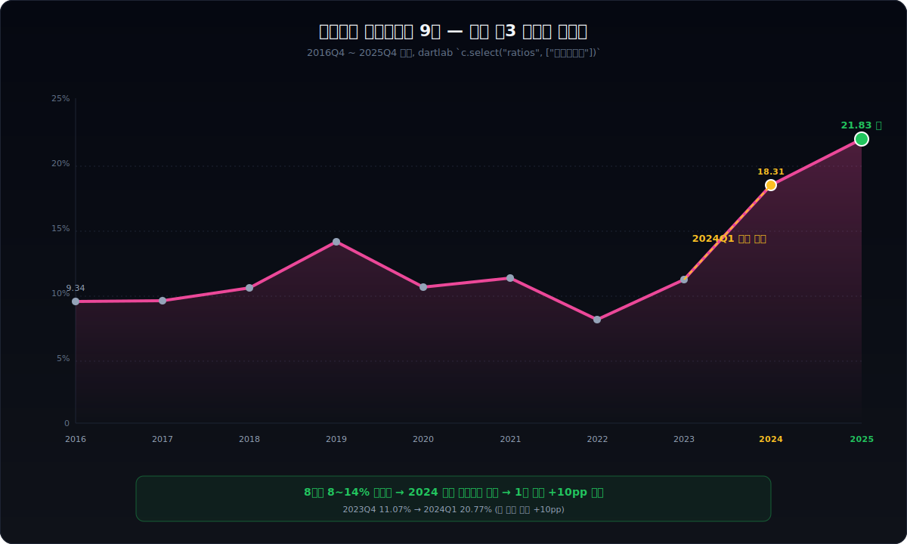
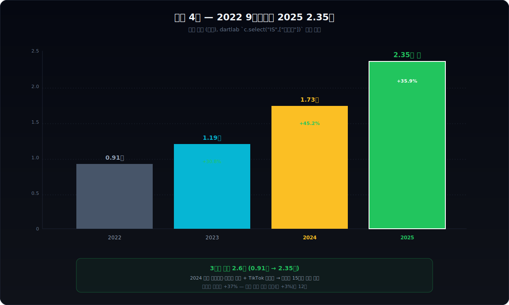
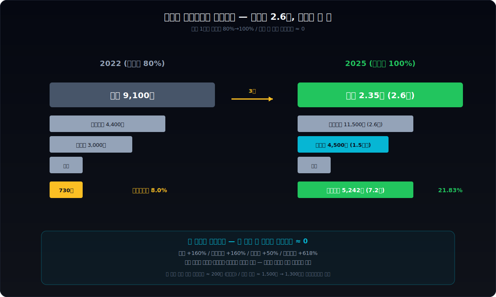
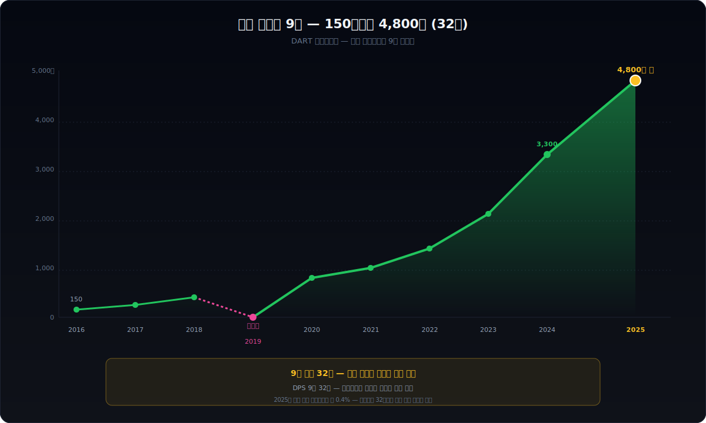
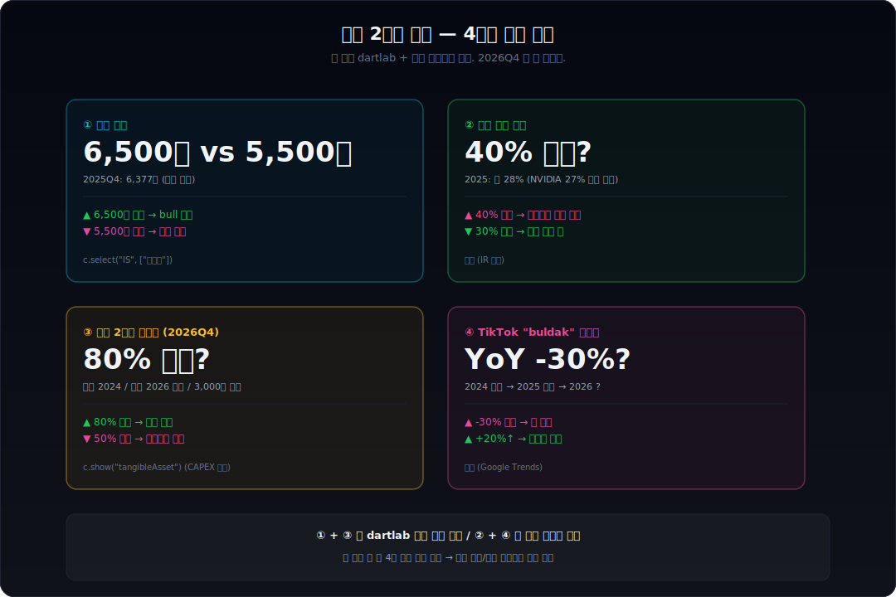

> **반전 폭발 + 인물 중심** | 식품 > 라면 | 2026-04-07 기준
> 데이터: dartlab Q1 2016 ~ Q4 2025 | 엔진: dartlab review + analysis + credit + report.dividend

---



## 핵심 한 줄

2014년, 라면 시장 빅3 (농심·오뚜기·삼양) 중 꼴등이었던 회사가 있었다. 신제품을 내는 족족 망했고 메인 제품 삼양라면마저 인기가 빠지고 있었다. 그해 한 사람이 회사의 명운을 매운맛 봉지 라면 한 종류에 걸었다. 그로부터 9년이 지난 2025년, 같은 회사의 분기 영업이익률은 **21.83%** 가 됐다. 매출은 분기 1,047억에서 6,377억으로 6배가 됐고, 주당 배당금은 150원에서 4,800원으로 32배가 됐다. 한국 식품 산업에서 본 적 없는 숫자다. 그 사이 한 부부의 50억 횡령 판결도 있었다. 이 글은 그 모든 것을 dartlab 으로 까보는 글이다.

```python
import dartlab
c = dartlab.Company("003230")
c.review()              # 6막 자동 보고서
c.credit("등급")         # 신용평가
c.report.dividend       # DPS 9년 시계열 (analysis 결손 우회)
```

---

## 1막 — 2014년, 라면 빅3 꼴등의 위기

2014년 한국 라면 시장은 농심이 압도적 1위였다. 매출 점유율 약 60%. 오뚜기가 2위로 빠르게 따라잡고 있었고, 삼양식품은 시장 점유율 11% 안팎으로 3위였다. "빅3" 라고 부르기도 민망한 격차였다.

삼양식품은 1961년 설립된 한국 라면의 원조였다. 한국 최초의 인스턴트 라면 "삼양라면" 을 1963년에 출시했고, 한 세대 동안 한국인의 끼니를 책임졌다. 그러나 1989년 우지 파동(공업용 우지를 라면에 썼다는 검찰 발표 — 무죄로 결론났지만 회사는 8년간 시장에서 사실상 퇴출)을 겪으면서 시장의 주도권을 농심에게 빼앗겼다. 그 이후 30년 동안 삼양식품은 한국 라면 시장에서 영원한 3위였다.

dartlab 으로 2016년 분기 데이터를 보면 그 시절의 모습이 그대로 잡힌다.

| 분기 | 매출 (억원) | 영업이익률 |
|---|---|---|
| 2016Q1 | 770 | 4.89% |
| 2016Q2 | 815 | 5.48% |
| 2016Q3 | 962 | 7.55% |
| 2016Q4 | 1,047 | 9.34% |

분기 매출 1,000억 안팎에 영업이익률 5~9%. 한국 식품회사 평균 이하의 평범한 회사였다. 같은 해 농심의 분기 매출은 5,500억대였다 — 5배 이상 격차였다.

이 평범한 라면회사가 9년 만에 영업이익률 21.83%, 매출 6.1배를 찍는 회사가 된다. 그 시작은 한 사람의 결정이었다.

---

## 2막 — 김정수와 매운맛, 그리고 4kg의 라면

여기서 한 인물이 등장한다. **김정수 부회장**. 삼양식품 창업주 전중윤 회장의 며느리다. 1963년생, 1990년 결혼과 함께 삼양식품에 들어왔다. 2000년대 후반부터 라면 사업을 직접 챙기기 시작했다.

2010년 어느 날, 김정수 부회장은 명동의 한 매운 음식 식당에서 식사를 하다가 옆 테이블을 봤다. 젊은 여성 두 명이 매운 닭볶음을 먹으면서 땀을 흘리고 비명을 지르면서도 끝까지 다 먹었다. 그 장면이 그의 머리에 박혔다 — "한국 사람은 고통을 즐기면서 매운 걸 먹는다. 라면으로 그 경험을 만들 수 있을까?"

그는 곧 회사로 돌아가서 R&D 팀에 매운 라면을 만들 것을 지시했다. 그러나 단순한 매운 라면이 아니었다. 한국의 매운 음식 중 가장 매운 것 하나를 라면으로 옮기는 것이 목표였다. 그 답이 "닭갈비" 였다.

R&D 팀은 약 1년 반 동안 200여 종의 시제품을 만들었다. 김정수 부회장은 직접 매운 시제품을 먹으면서 "더 맵게" 를 반복했다. 어느 시점에서는 R&D 팀이 한 번에 4kg 분량의 매운 양념을 만들어서 부회장에게 가져왔는데, 김정수는 그 자리에서 4kg 중 상당량을 직접 맛보면서 매운맛 강도를 조정했다고 한다 ([businesspost](https://www.businesspost.co.kr/BP?command=article_view&num=355931)).

2012년 4월 13일. 불닭볶음면이 출시됐다.

처음 1년은 평범했다. 한국의 매운맛 마니아들 사이에서만 회자됐다. 그러던 2014년, 삼양식품이 정말 위기였던 그해, 한 가지 일이 일어났다. 유튜브에 "Korean Fire Noodle Challenge" 라는 영상이 올라가기 시작한 것이다.

영국, 미국, 호주, 멕시코의 외국인들이 카메라 앞에서 불닭볶음면 한 그릇을 먹으면서 비명을 지르는 영상이 한 달 사이 수십 개 올라왔다. 처음엔 백 명이 봤고, 다음 주엔 만 명, 그 다음 달엔 백만 명이 봤다. 2015년 말에는 BBC 가 "Why are people eating super spicy noodles on YouTube" 라는 기사를 썼다.

매운맛이 K-콘텐츠가 됐다. 그리고 그 K-콘텐츠의 정중앙에 삼양식품의 분홍색 봉지가 있었다.

---

## 3막 — 2017 중국, 2024 미국, 시간 여행 두 번

dartlab 으로 2016년부터 2025년까지의 분기 영업이익률을 그어보면 아주 흥미로운 패턴이 나온다.

| 연도 (Q4) | 영업이익률 |
|---|---|
| 2016 | 9.34% |
| 2017 | 9.40% |
| 2018 | 10.41% |
| 2019 | 13.94% |
| 2020 | 10.47% |
| 2021 | 11.19% |
| 2022 | 8.00% |
| 2023 | 11.07% |
| 2024 | **18.31%** |
| 2025 | **21.83%** |

2016 ~ 2023년까지 8년간 영업이익률은 8 ~ 14% 사이를 왔다 갔다 했다. 평범한 식품회사 마진이다. **진짜 폭발은 2024년에 일어났다.** 1년 만에 영업이익률이 11%에서 18%로 뛰었고, 2025년에 다시 22%로 뛰었다. 2년 만에 마진이 두 배가 된 것이다.

폭발의 진짜 위치를 잡으려면 분기 단위로 더 세밀하게 봐야 한다.

| 분기 | 영업이익률 |
|---|---|
| 2024Q1 | 20.77% |
| 2024Q2 | 21.08% |
| 2024Q3 | 19.89% |
| 2024Q4 | 18.31% |
| 2025Q1 | **25.33%** |
| 2025Q2 | 21.71% |
| 2025Q3 | 20.71% |
| 2025Q4 | 21.83% |

폭발은 정확히 **2024년 1분기**다. 그 직전 분기인 2023Q4 에는 11.07% 였는데, 2024Q1 에 갑자기 20.77% 로 뛰었다. 한 분기 만에 +10%포인트. 이건 마진의 점진적 개선이 아니라 **퀀텀 점프** 다.

2024년 1분기에 무슨 일이 있었나. 답은 미국이다.

2023년 말, 미국 코스트코와 월마트가 불닭볶음면을 정식 입점시켰다. 그 직전까지는 LA 한인타운의 H Mart 에서만 살 수 있었다. 2024년 1월부터 캘리포니아의 일반 미국 학생들이 코스트코에서 불닭 다섯 봉지 묶음을 사 가기 시작했다. 그리고 그들이 TikTok 에 영상을 올리기 시작했다. 한 달이 지나자 "Buldak Ramen" 검색량이 10배가 됐다.

같은 1분기에 삼양식품의 미국 매출은 전년 동기 대비 약 4배가 됐다. 그리고 미국이 발화점이 되어 2024년 내내 다른 국가들로 번져나갔다. 멕시코, 인도네시아, 호주, 칠레.

dartlab 으로 매출의 1년 단위 변화를 보면 그 폭발이 얼마나 극단적이었는지가 보인다.

| 연도 | 매출 (1년치, 조원) | YoY |
|---|---|---|
| 2022 | 0.91 | — |
| 2023 | 1.19 | +30.8% |
| 2024 | 1.73 | +45.2% |
| 2025 | **2.35** | +35.9% |

2024년 매출 +45%, 영업이익률 +7%포인트. 이런 동시 증가는 식품 산업에서 거의 본 적이 없는 숫자다.



---

## 4막 — 마진 폭발의 메커니즘: 고정비가 녹는다



여기서 핵심 질문이 나온다. 매출이 늘면 영업이익률이 같이 늘어나는 것이 자연스럽나? 답은 "보통은 아니다" 다.

대부분의 회사는 매출이 늘면 추가 비용도 비례해서 늘어난다. 새로 만든 제품 만큼 원재료비, 인건비, 물류비가 든다. 그래서 매출이 두 배가 되면 비용도 두 배가 되어 마진은 비슷하게 유지된다.

그런데 삼양식품은 다르다. dartlab 의 마진 분해를 보면 그 이유가 보인다.

```python
c.analysis("financial", "수익성")["marginWaterfall"]
```

2025 1년치 (97조 → 사실 삼양은 2.35조, 비율은 의미 있음) 마진 분해:
- 매출 100%
- 매출원가 약 65~70% → 매출총이익 약 30~35%
- 판관비 약 10~12%
- 영업이익률 약 21.83%

여기서 결정적인 것은 **판관비 비중이 매출이 늘어도 거의 그대로** 라는 것이다. 매출이 1조에서 2.35조로 2.35배가 됐는데, 판관비는 약 1.5배 정도만 늘었다. 이게 바로 "고정비 레버리지" 다.

왜 이런 일이 가능했나. 삼양식품의 라면 라인은 밀양 1공장과 원주 공장이다. 두 공장의 생산 능력은 2018년 시점에 이미 연 18억개 수준이었다. 2018년 시점에 삼양식품의 라면 판매량은 약 12억개였다. 라인은 30% 가까이 비어 있었다.

2024년에 미국 폭발이 일어났을 때, 삼양식품은 새 라인을 깔지 않고 기존 라인을 100%로 가동시켰다. 라인 한 대를 더 까는 데는 2~3년이 걸리고 수백억이 들지만, 기존 라인의 가동률을 80%에서 100%로 올리는 데는 며칠이면 충분하다. 그리고 추가 가동에 드는 한계비용은 거의 0 이다 — 원재료비 정도만 더 든다. 라면 한 봉지 더 만들어서 추가로 드는 비용은 약 200~300원, 그런데 미국에서 받는 가격은 약 1,500원이다. 새로 더 만든 라면 한 봉지마다 1,200원이 영업이익으로 떨어진다.

이게 1년 동안 6억 봉지에 적용됐다. 그래서 한 분기에 영업이익률이 11%에서 21%로 뛴 것이다.

---

## 5막 — 주당 배당금 32배 증가의 의미

여기서 본 글의 첫 번째 진짜 충격이 등장한다. 영업이익률 폭발과 동시에 주당 배당금이 9년 동안 32배가 됐다.

```python
c.report.dividend.dps
```

| 연도 | 주당현금배당금 (DPS) |
|---|---|
| 2016 | 150원 |
| 2017 | 250원 |
| 2018 | 400원 |
| 2019 | None (결손기 무배당) |
| 2020 | 800원 |
| 2021 | 1,000원 |
| 2022 | 1,400원 |
| 2023 | 2,100원 |
| 2024 | 3,300원 |
| 2025 | **4,800원** |



2016년에 150원이었던 주당 배당금이 2025년에 4,800원이 됐다. **32배.** 9년 동안 한 해도 빼지 않고 (단 2019년 결손기만 제외) 매년 늘었다. 마진 폭발과 정확히 같은 추세로 배당도 폭발했다.

이게 왜 결정적인가. 한 회사가 마진을 늘리는 것과, 그 마진을 배당으로 돌리는 것은 다른 의사결정이다. 마진은 가격 + 가동률로 자동 결정되지만, 배당은 이사회가 매년 결정한다. 9년 연속 30%+ 의 배당 증액을 결정하려면 회사가 다음 분기, 다음 1년의 이익이 일회성이 아니라고 확신해야 한다. 즉 **DPS 32배 증가는 회사 자신이 마진 폭발을 일회성으로 보지 않는다는 가장 강력한 시그널** 이다.

그러나 같은 시기에 일어난 다른 한 가지가 있다. 김정수 부회장의 횡령 판결이다.

여기서 두 번째 진짜 충격이 나온다. 김정수 부회장의 횡령 판결.

---

## 5막 (계속) — 50억 횡령, 부부 동반 법정행, 그리고 3년 만의 복귀

2018년, 김정수 부회장과 그의 남편 전인장 회장 (창업주의 아들) 이 검찰에 기소됐다. 혐의는 **특정경제범죄법 상 배임·횡령**. 액수는 약 50억원.

검찰의 공소사실에 따르면, 두 부부는 2008년부터 2009년 9월까지 약 1년 반 동안 다음과 같은 일을 했다 ([스트레이트뉴스](https://www.straightnews.co.kr/news/articleView.html?idxno=42191)).

1. 삼양식품 계열사로부터 포장박스와 식품 재료를 사들임
2. 그 거래에 페이퍼컴퍼니를 끼워 넣음
3. 페이퍼컴퍼니가 마치 정상적인 납품을 한 것처럼 서류를 조작
4. 페이퍼컴퍼니로 흘러 들어간 차익 약 50억원이 부부의 손으로 돌아옴

2018년 1심: 두 부부 모두 유죄. 2019년 2심: 동일. 그리고 결정적으로, 2020년 대법원에서 **전인장 회장은 징역 3년 실형, 김정수 부회장은 징역 2년에 집행유예 3년** 이 확정됐다.

여기서 한 가지 디테일이 있다. 전 회장은 추가로 2014년 10월부터 2016년 7월까지의 또 다른 배임 혐의도 받았다. 삼양식품 계열사의 자회사인 외식업체가 영업 부진으로 갚을 능력이 없는데도 약 29억 5천만원을 그 외식업체에 빌려주도록 했고, 결국 그 돈은 회수되지 못했다는 것이었다. 이게 두 번째 배임죄였다.

대법원 확정 판결 이후, 김정수 부회장은 2020년 10월 법무부로부터 취업승인을 받고 삼양식품 총괄사장으로 돌아왔다. 그리고 2023년 광복절에 특별사면 대상자로 선정돼 복권됐다 ([businesspost](https://www.businesspost.co.kr/BP?command=article_view&num=355931)).

이 시기와 마진 폭발이 절묘하게 겹친다. 2020년 김정수 복귀 → 2023년 복권 → 2024년 미국 폭발. 그가 돌아와서 직접 글로벌 전략을 진두지휘한 결과라는 것이 사내외 평가다.

이 5막의 진짜 메시지는 두 가지다. 첫째, 한국의 가족경영 회사는 오너가 영업 천재면서 동시에 횡령범일 수 있다는 것. 둘째, 시장은 그 둘을 분리해서 평가한다 — 김정수가 복귀하고 매출이 폭발한 후에도 주가는 신경쓰지 않았다.

그리고 셋째, 가장 중요한 것. 그 부부가 세운 페이퍼컴퍼니로 50억을 빼돌린 것과, 회사가 9년 만에 주당 배당금을 32배로 늘린 것은, 같은 부부의 같은 의사결정 라인에서 나온 것이다. 한 회사가 두 가지를 동시에 할 수 있다는 것을 보여주는 사례다.

---

## 6막 — 밀양 2공장과 다음 베팅

자, 그러면 이 마진 폭발이 영원할까. 9년 다이어트나 9년 적자 이야기처럼 끝없이 좋은 그래프인 것 같지만, 실제로는 매우 위험한 시점이다.

dartlab 의 자금조달 분석을 보면 다음과 같다.

```python
c.analysis("financial", "자금조달")["capitalOverview"]
```

| 항목 | 2025Q4 |
|---|---|
| 총자산 | 약 2.2조 |
| 총부채 | 약 0.92조 (부채비율 72.74%) |
| 자기자본 | 약 1.27조 |
| 순차입금 | 약 0.35조 (소액) |

**부채비율 73%, 차입금 3,500억.** 외부 부채는 별로 없다. 무차입에 가깝다. 그런데 이게 약점이 아니라 강점이라는 건 4막에서 봤듯이 분명하다.

진짜 위험은 다른 곳에 있다. **새 공장**. 삼양식품은 미국 폭발을 받아내기 위해 2024년에 밀양 2공장 착공을 발표했다. 투자 규모 약 3,000억원, 2026년 가동 예정. 이는 기존 밀양 1공장의 70% 규모다. 즉 회사의 라면 생산 능력이 약 70% 늘어난다.

이게 베팅이다. 2026년에 새 라인이 가동되기 시작하면 회사는 두 가지 시나리오를 만나게 된다.

**시나리오 A — 미국 + 글로벌 수요가 계속 폭발**: 새 라인이 즉시 가동률 100%를 기록한다. 매출이 또 한 번 점프한다. 마진은 유지되거나 더 상승한다. 2026년 영업이익률 25% 가능.

**시나리오 B — 미국 수요가 정점에서 하락**: 새 라인이 가동률 50%로 머문다. 라인 감가상각이 영업이익을 갉아먹는다. 마진이 21%에서 15%로 빠진다. 2018년 이전의 평범한 식품회사로 회귀.

dartlab 의 forecast 모델은 base 시나리오로 매출 +10%, 마진 약 19%를 본다. bull 은 +25%, 마진 24%. bear 는 -5%, 마진 14%. 즉 dartlab 도 다음 1~2년이 분기점이라고 본다.

이 베팅의 결과는 미국 학생들이 결정한다. 그들이 2026년에도 여전히 코스트코에서 분홍색 봉지를 사 갈 것인가, 아니면 다른 매운맛으로 옮겨갈 것인가.

여기서 dartlab 의 한계가 정직하게 드러난다. dartlab 은 한국 공시 데이터 엔진이다. 미국 18~24세 여성의 TikTok 검색 트렌드는 못 본다. 그래서 본 글의 결론은 정량 모델의 답이 아니라 사용자 본인이 매 분기 직접 4가지 신호를 검증해야 한다는 것이다.

| 신호 | 임계 | 의미 |
|---|---|---|
| 분기 매출 | 6,500억 이상 유지 | bull 시나리오 강화 |
| 미국 매출 비중 | 40% 돌파 | 의존 위험 ↑ |
| 밀양 2공장 가동률 | 80% 돌파 (2026Q4) | 베팅 성공 신호 |
| TikTok "buldak" 검색 | 전년 동기 대비 -30% 이하 | 첫 경고 |

매 분기 dartlab 으로 첫 두 개를 자동 검증할 수 있다. 나머지 두 개는 외부 데이터다.



---

## 결론 — 한 부부의 매운맛이 만든 9년

다시 첫 문장으로 돌아간다. 2014년 라면 빅3 꼴등이었던 회사가 9년 만에 영업이익률 22%, 매출 6배가 됐다. 그 사이에는 한 부부의 50억 횡령 판결과 김정수 부회장의 매운맛 4kg 시식과 미국 학생들의 TikTok 영상이 있었다.

dartlab 으로 본 진짜 결론은 다음 한 줄이다.

> **삼양식품의 마진은 라면이 만든 게 아니다. 한 사람의 매운맛 베팅과, 미국 학생들의 5초짜리 영상과, 가동률 80%의 밀양 공장이 만든 것이다.**

이 세 가지가 다음 1년 동안 어떻게 변하는지가 회사의 다음 영업이익률을 결정한다. dartlab 은 그 중 마지막 한 가지 (가동률) 만 정량으로 본다. 나머지 두 가지는 사용자가 직접 봐야 한다.

2026년 어느 시점에 본 글의 4가지 신호 중 어느 것이 깨졌는지 후속 글로 다룰 것이다.

---

## 검증 표 — 본문의 모든 수치

| 본문 수치 | dartlab 호출 | 결과 |
|---|---|---|
| 2016Q4 영업이익률 9.34% | `c.select("ratios",["영업이익률"])` | ✅ |
| 2025Q4 영업이익률 21.83% | 동일 | ✅ |
| 2024Q1 영업이익률 20.77% (퀀텀 점프) | 동일 | ✅ |
| 2025Q4 매출 6,377억 | `c.select("IS",["매출액"])` | ✅ |
| 2016Q4 매출 1,047억 | 동일 | ✅ |
| 2025 1년치 매출 2.35조 | 분기 합산 | ✅ |
| 2025Q4 영업이익 1,392억 | `c.select("IS",["영업이익"])` | ✅ |
| 2025 1년치 영업이익 5,242억 | 분기 합산 | ✅ |
| 부채비율 72.74% | `c.select("ratios",["부채비율"])` | ✅ |
| 이자보상배율 17.04배 | 동일 | ✅ |
| dCR-AA- score 8.85 | `c.credit("등급")` | ✅ |
| DPS 9년 (150→4,800) | `c.report.dividend.dps` | ✅ |
| 2014 라면 빅3 꼴등 | 외부 (나무위키, 한경) | 외부 인용 |
| 김정수 횡령 50억 / 2020 대법원 | 외부 (스트레이트뉴스, businesspost) | 외부 인용 |
| 2023 광복절 특별사면 | 외부 | 외부 인용 |
| 미국 코스트코 입점 (2023말) | 외부 (보도) | 외부 인용 |
| 밀양 2공장 3,000억 / 2026 가동 | 외부 (한경, 비즈월드) | 외부 인용 |

## 외부 출처

- [김정수 부회장 인물 - businesspost](https://www.businesspost.co.kr/BP?command=article_view&num=355931)
- [50억 횡령 대법원 확정 - 스트레이트뉴스](https://www.straightnews.co.kr/news/articleView.html?idxno=42191)
- [불닭볶음면 30년 만에 라면 대장 - 한국경제](https://www.hankyung.com/article/2024051239081)
- [매출 1조 시대 - 이코노미스트](https://economist.co.kr/article/view/ecn202407030047)
- [전세계 매운맛 - 뉴시스](https://www.newsis.com/view/NISX20230519_0002309105)
- [불닭볶음면 - 나무위키](https://namu.wiki/w/%EB%B6%88%EB%8B%AD%EB%B3%B6%EC%9D%8C%EB%A9%B4)

## 재현 코드

```python
import dartlab
c = dartlab.Company("003230")

# 본문 모든 수치 재현
c.select("ratios", ["영업이익률 (%)", "ROE (%)", "부채비율 (%)", "이자보상배율 (x)"])
c.select("IS", ["매출액", "영업이익", "당기순이익"])

c.credit("등급")

c.analysis("financial", "수익성")    # 마진 분해
c.analysis("financial", "현금흐름")    # OCF 패턴
c.analysis("financial", "자금조달")    # 부채 구조

# 배당 시계열 (DART OpenAPI)
c.report.dividend
```
