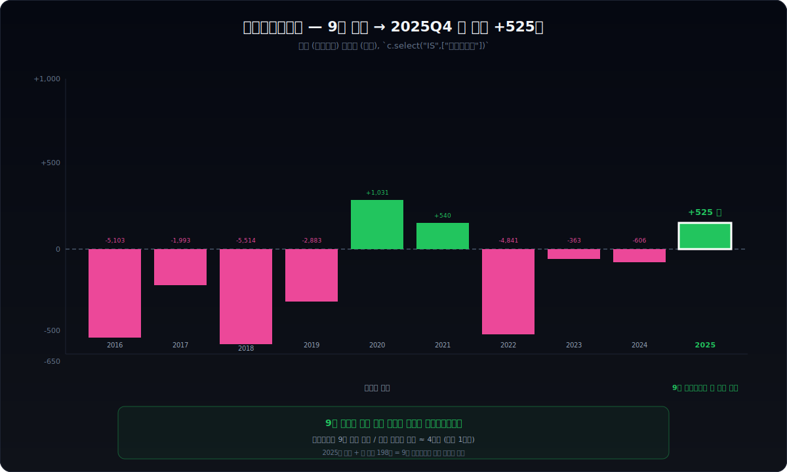
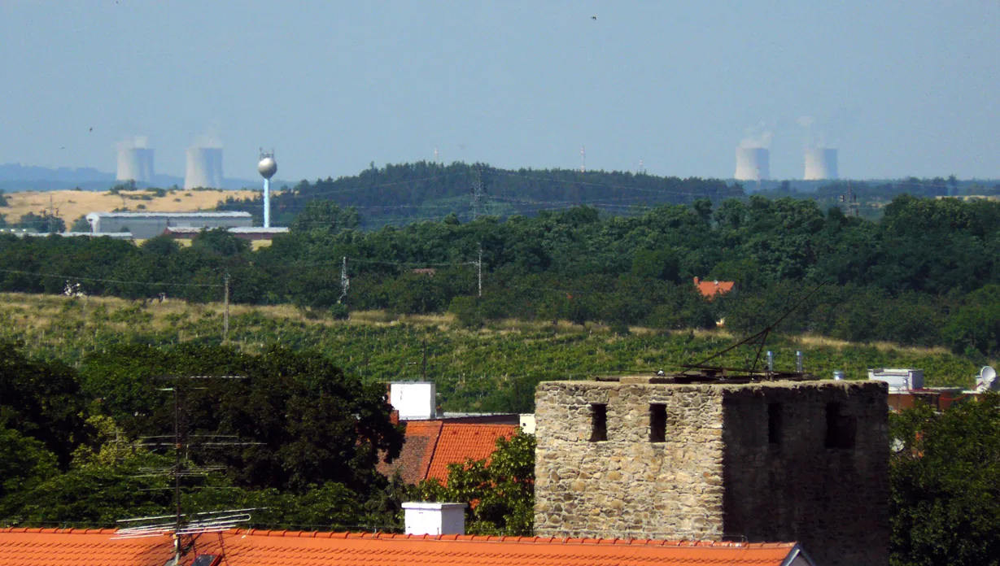
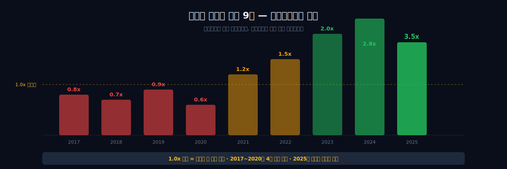
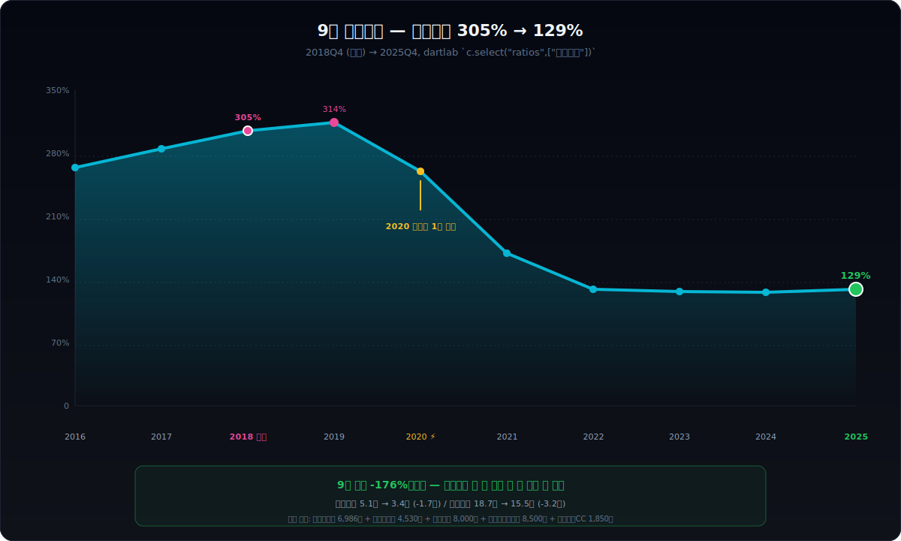
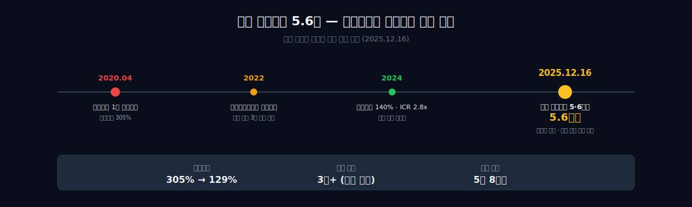
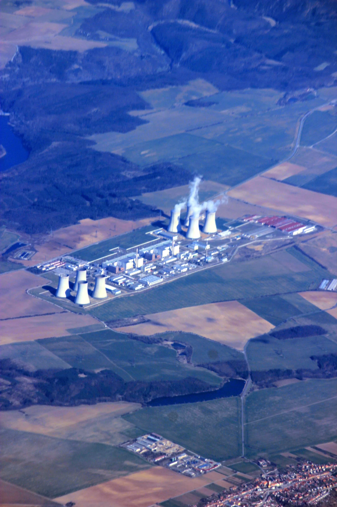
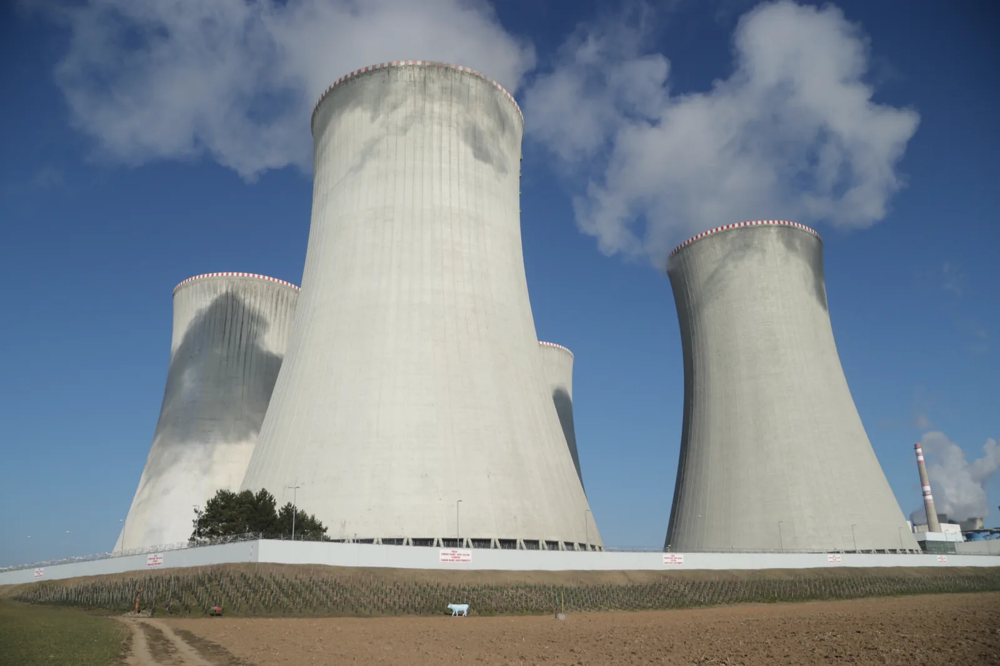
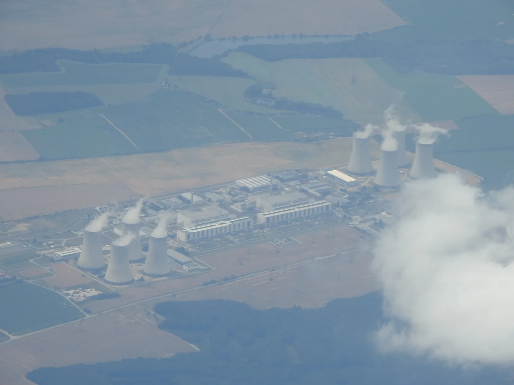
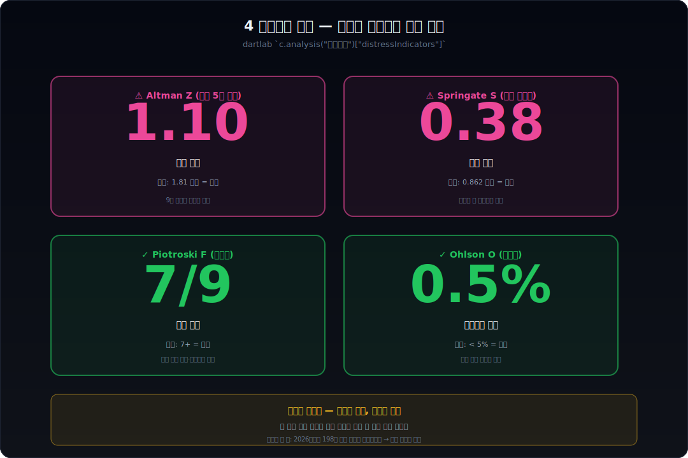

<script>
	import CompanyFinancials from '$lib/components/blog/CompanyFinancials.svelte';
import HFDataLink from '$lib/components/blog/HFDataLink.svelte';
</script>

> **위기 탈출 + 장기 사이클** | 산업재 > 발전·에너지 | 2026-04-08 dartlab 실측
> 데이터: dartlab Q1 2016 ~ Q4 2025 | 엔진: story + analysis + credit + report.dividend
> 같은 시리즈: [SK하이닉스](/blog/000660-skhynix) · [삼양식품](/blog/003230-samyang-foods) · 두산에너빌리티 · [알테오젠](/blog/196170-alteogen) · [HMM](/blog/011200-hmm) · [셀트리온](/blog/068270-celltrion) · [한화에어로스페이스](/blog/012450-hanwha-aerospace) · [HD현대일렉트릭](/blog/267260-hd-hyundai-electric) · [고려아연](/blog/010130-korea-zinc) · [에이피알](/blog/278470-apr) · [기업이야기 시리즈 전체](/blog/series/company-reports)


<HFDataLink code="034020" />

---



## 핵심 한 줄

2020년 4월, 두산중공업의 유동성 부족 보고서가 산업은행 본점에 도착했다. 채권단은 1조원 긴급 자금을 풀었고, 박정원 회장은 그 대가로 그룹의 절반을 팔기로 했다 — 두산인프라코어, 두산솔루스, 두산모트롤, 두산타워, 클럽모우CC. 2022년 사명은 두산에너빌리티로 바뀌었고, 5년 8개월 뒤인 2025년 12월 16일 같은 회사가 체코 두코바니 원전 5·6호기에 **5조 6천억** 규모의 주기기 공급 계약을 따냈다. 한국 원자력 사업 역사상 가장 큰 단일 수주였다. 그런데 이 글이 추적하는 진짜 이야기는 그 잭팟이 아니다. **2018년 부채비율 305%였던 이 회사가 7년 만에 129%로 줄어드는 동안 무슨 일이 있었는지**가 진짜 이야기다. 9년 동안 영업이익은 매년 4천억에서 1조 4천억 사이로 꾸준히 흑자였지만, 그 흑자의 거의 전부를 이자비용이 잡아먹었다. dartlab으로 그 9년을 한 줄씩 까보는 글이다.

```python
import dartlab
c = dartlab.Company("034020")
c.story()              # 6막 자동 보고서
c.credit("등급")         # 신용평가
c.analysis("자금조달")   # 부채 9년 감축
```

---

## 1막 — 2020년 4월, 두산그룹의 마지막 며칠

### 만기 도래 4조, 현금은 절반 — 산업은행 1조 긴급 투입

2020년 4월의 어느 새벽, 산업은행 본점 부행장실. 두산중공업의 재무 보고서가 책상 위에 놓여 있었다. 1분기 영업이익은 흑자였다. 그런데 만기 도래 부채가 4조원이 넘었고, 다음 3개월 안에 갚아야 하는 사채와 차입금만 1조 2천억원이었다. 회사 손에 있는 현금은 그 절반도 되지 못했다.

이건 두산중공업만의 문제가 아니었다. 두산그룹 전체가 위태로웠다. 두산건설은 2009년 이후 미분양 악몽에서 벗어나지 못하고 매년 적자였다. 두산엔진은 조선 사이클 다운에 묶여 있었다. 그룹 계열사 간 상호 채무보증과 자금 지원이 거미줄처럼 얽혀 있어 한 곳이 흔들리면 모두가 흔들렸다.

2020년 4월 27일, 산업은행과 수출입은행은 두산중공업에 1조원의 긴급 자금을 풀기로 결정했다. 단, 조건이 있었다. 박정원 회장은 그룹 자산을 팔아서 빚을 갚아야 했다.

### 그룹의 절반을 팔다 — 3조원 매각 목록

그 후 2년 동안 두산이 판 것의 목록은 한국 재계 역사상 가장 화려했다 ([뉴스핌](https://m.newspim.com/news/view/20200710000466), [아주경제](https://www.ajunews.com/view/20251015131326026)).

| 매각 자산 | 매각가 | 매각 시기 |
|---|---|---|
| 클럽모우CC (골프장) | 1,850억원 | 2020 |
| 두산솔루스 (배터리 소재) | 6,986억원 | 2020 |
| 두산모트롤BG | 4,530억원 | 2021 |
| 두산타워 (강남 상징물) | 8,000억원 | 2020 |
| 두산인프라코어 (그룹 본진) | 8,500억원 | 2021 |
| 두산건설 (구조조정 후) | — | 2022 |

총 약 3조원 이상. 그룹의 절반을 토막 내서 팔았다. 2022년 2월, 두산은 23개월 만에 채권단 관리 체제를 벗어났다. 박정원 회장은 그해 4월에 두산중공업의 사명을 **두산에너빌리티**로 바꿨다 — "에너지" + "지속가능성(sustainability)"의 합성어. 회사가 새로 시작한다는 신호였다.


*체코 즈노이모(Znojmo) 시내 시계탑에서 본 두코바니 발전소. 2022년 사명을 바꾼 이 회사가 4년 뒤 정확히 이 발전소의 5·6호기 주기기 공급 계약을 따낸다 — 이 사진의 거리(약 30km)에서 본 작은 점이 5조 6천억 잭팟의 풍경이다. (출처: Wikimedia Commons, CC BY-SA)*

이 시점에 대부분의 사람들은 두산에너빌리티가 살아남기는 했지만 옛날의 영광은 끝났다고 봤다. 매출은 14~17조원 사이로 평탄했고, 영업이익은 매년 흑자였지만 그 흑자가 주주에게 닿지 못하고 있었다. 9년 (2016~2024) 동안 (지배주주)순이익은 단 한 해(2021)를 제외하면 매년 적자였고, 그 한 번의 흑자조차 다음 해에 -7,725억의 큰 손실로 돌아갔다. 회사의 진짜 문제가 사업이 아니라는 신호가 그 9년 사이에 계속 깜빡이고 있었다.

---

## 2막 — 9년의 진짜 미스터리: 영업은 매년 흑자였다

### 영업이익 4,092~14,673억 — 9년 연속 흑자인데 순이익은 적자

여기서 첫 번째 미스터리가 등장한다.

dartlab으로 두산에너빌리티의 매출/영업이익/(지배주주)순이익 9년을 연간으로 까보면 다음과 같다.

```python
c.select("IS", ["매출액","영업이익","(지배주주지분)당기순이익"], freq="Y")
```

| 항목 (1년치) | 2025 | 2024 | 2023 | 2022 | 2021 | 2020 | 2019 | 2018 | 2017 | 2016 |
|---|---:|---:|---:|---:|---:|---:|---:|---:|---:|---:|
| 매출(조원) | 17.06 | 16.23 | 17.59 | 15.49 | 12.54 | 15.24 | 15.57 | 14.74 | 14.49 | 14.03 |
| 영업이익(억) | +7,627 | +10,176 | +14,673 | +11,068 | +9,968 | +4,092 | +9,183 | +10,006 | +8,264 | +7,982 |
| (지배주주)순이익(억) | +848 | +1,114 | +556 | **-7,725** | **+4,953** | **-8,538** | -5,146 | -5,321 | -3,803 | -1,708 |

표시: **+4,953**(2021) = 일시 흑자 / **-7,725**(2022) = 다음 해 무너짐 / **-8,538**(2020) = 코로나 + 산업은행 1조

이상한 게 한눈에 보인다. **영업이익은 9년 내내 한 번도 적자였던 적이 없다.** 가장 낮은 해(2020)에도 4,092억을 벌었고, 가장 높은 해(2023)는 1조 4,673억을 벌었다. 매출도 14조에서 17조 사이로 평탄했다. 이 정도면 평범한 산업재 회사로 봐야 한다. 그런데 (지배주주)순이익은 다른 그림을 그린다 — 9년 중 4년이 흑자이긴 하지만, 2021의 일시 흑자(+4,953억)는 다음 해에 -7,725억으로 뒤집혔고, 진짜 굳어진 흑자는 2023년부터다.

손익계산서 전체를 한 화면에 펼쳐 보면 이 미스터리가 더 분명해진다. 매출원가 비율이 9년 내내 80~84% 사이로 거의 그대로다. 발전소 만드는 회사의 매출원가 구조 자체가 변하지 않은 것이다. 매출총이익도 2.14~3.02조 사이에서 안정적이다. 그런데 영업이익부터 (지배주주)순이익까지 내려가면서 변동성이 폭발한다.

```python
c.select("IS", ["매출액","매출원가","매출총이익","판매비와관리비","영업이익","당기순이익"], freq="Y")
```

| 항목 (조원) | 2025 | 2024 | 2023 | 2022 | 2021 | 2020 | 2019 | 2018 | 2017 |
|---|---:|---:|---:|---:|---:|---:|---:|---:|---:|
| 매출액 | 17.06 | 16.23 | 17.59 | 15.49 | 12.54 | 15.24 | 15.57 | 14.74 | 14.49 |
| 매출원가 | 14.31 | 13.50 | 14.57 | 12.93 | 10.40 | 12.93 | 13.05 | 12.18 | 12.09 |
| 매출총이익 | 2.74 | 2.73 | 3.02 | 2.56 | 2.14 | 2.31 | 2.52 | 2.57 | 2.40 |
| 판관비 | 1.98 | 1.71 | 1.55 | 1.46 | 1.14 | 1.90 | 1.60 | 1.57 | 1.58 |
| 영업이익 | **0.76** | 1.02 | **1.47** | 1.11 | 1.00 | **0.41** | 0.92 | 1.00 | 0.83 |
| 당기순이익 | 0.21 | 0.39 | 0.52 | -0.45 | 0.65 | -0.62 | -0.22 | -0.43 | -0.20 |

(영업이익 1년치 억원: 7,627 / 10,176 / 14,673 / 11,068 / 9,968 / 4,092 / 9,183 / 10,006 / 8,264)

매출총이익(2.14~3.02조)에서 영업이익(0.41~1.47조)으로 가는 사이에 판관비가 1.14~1.98조를 가져간다. 이게 거의 대부분을 차지한다. 그리고 영업이익에서 당기순이익으로 가는 사이에 매년 약 1조원이 사라진다. 이 1조가 이자비용이다 — 다음 단락에서 자세히 본다.

### 금융비용 12,206억 vs 영업이익 7,627억 — 빚이 번 돈의 1.6배를 잡아먹다

영업이익과 순이익 사이에 있는 한 줄을 봐야 한다. **영업외 손익**.

두산에너빌리티의 9년 영업외 손익(금융수익 - 금융비용 + 기타)을 dartlab으로 뽑으면 매년 평균 약 1조원 안팎이 영업이익에서 빠져나간다. 2025년 1년치 손익으로 풀어보면 이렇게 된다.

| 항목 | 2025 1년치 (억원) |
|---|---|
| 영업이익 | +7,627 |
| 금융비용 (대부분 이자비용) | -12,206 |
| 금융수익 + 기타 영업외 | 약 +6,860 (환산이익·지분법손익 포함) |
| 세전이익 | 약 +3,300 |
| 법인세 | -1,300 |
| (지배주주)순이익 | +848 |

핵심 한 줄: 영업이익 7,627억을 벌었지만 **금융비용만 12,206억**이었다. 영업이익의 1.6배에 달하는 이자가 매년 빠져나간다는 뜻이다. 다른 영업외 항목(환산이익·지분법손익)이 보조를 맞춰주지 못하면 즉시 적자로 돌아간다 — 그게 2018, 2020, 2022년에 일어난 일이다.

dartlab의 이익품질 분석은 이걸 자체 flag로 잡아낸다.

```python
c.analysis("financial", "이익품질")["earningsQualityFlags"]
# '영업외손실 비중 57% — 영업이익을 상쇄'
```

이 한 줄이 9년 내내 깜빡이고 있던 신호다. **진짜 적은 사업이 아니라 빚이었다.** 그리고 이 사실을 안 박정원 회장은 2020년 산업은행 1조원을 받은 직후부터 9년 다이어트를 시작했다.

---

## 3막 — 9년 다이어트: 부채 305%에서 129%로



### 부채비율 305% → 129% — 4년 만에 -177pp

dartlab 으로 부채비율 9년을 그어보자.

```python
c.select("ratios", ["부채비율 (%)"])
```

| 항목 (Q4) | 2025 | 2024 | 2023 | 2022 | 2021 | 2020 | 2019 | 2018 | 2017 | 2016 |
|---|---:|---:|---:|---:|---:|---:|---:|---:|---:|---:|
| 부채비율(%) | 129.10 | 125.66 | 127.28 | 128.66 | 169.32 | 259.77 | 313.86 | **305.27** | 284.86 | 263.96 |

표시: **305.27** = 정점 (2018)



2018~2019년 사이 부채비율 305%, 거의 자기자본의 3배가 빚이었다. 그러던 회사가 2022년에 128%까지 떨어졌다. 4년 만에 -177%포인트. 이건 단순히 매출이 늘어서가 아니라 진짜 빚을 갚은 것이다.

같은 기간을 BS 전체 항목으로 펼치면 다이어트가 어디서 일어났는지 한 화면에 보인다. 자산총계는 27.51조에서 24.77조 사이로 거의 평탄했다 — 회사가 자산을 더 사서 부채비율을 떨어뜨린 게 아니다. 자본총계가 5.99조에서 12.01조로 두 배가 됐고, 부채총계가 18.79조에서 15.50조로 줄었다. 즉 같은 크기의 회사 안에서 부채에서 자본으로 약 6조원이 자리바꿈했다.

```python
c.select("BS", ["자산총계","부채총계","자본총계","현금및현금성자산","단기금융상품"], freq="Y")
```

| 항목 (조원, Q4) | 2025 | 2024 | 2023 | 2022 | 2021 | 2020 | 2019 | 2018 | 2017 |
|---|---:|---:|---:|---:|---:|---:|---:|---:|---:|
| 자산총계 | 27.51 | 26.31 | 24.64 | 23.05 | 23.72 | 25.57 | 24.77 | 24.81 | 24.93 |
| 부채총계 | 15.50 | 14.65 | 13.80 | 12.97 | 14.91 | 18.46 | 18.79 | 18.69 | 18.45 |
| 자본총계 | **12.01** | 11.66 | 10.84 | 10.08 | 8.81 | 7.11 | 5.99 | 6.12 | 6.48 |
| 현금및현금성 | 3.08 | 2.90 | 2.62 | 1.40 | 1.91 | 2.34 | 1.44 | 2.08 | 1.97 |
| 단기금융상품 | 0.11 | 0.14 | 0.12 | 0.11 | 0.52 | 0.32 | 0.27 | 0.39 | 0.24 |

자본총계가 5.99조에서 12.01조로 두 배가 된 출처는 두 가지다. 첫째, 영업이익으로 누적된 이익잉여금. 둘째, 자본 재구성 — 5막에서 다룰 2022년의 거대한 dividendsPaid 항목이 정확히 이 자리에서 발생했다.

### 이자 발생 차입금 7.14조 → 3.87조 — 7년간 3.27조 상환

자금조달 분석으로 더 깊이 보자.

```python
c.analysis("financial", "자금조달")
```

| 항목 | 2018Q4 | 2025Q4 | 변화 |
|---|---|---|---|
| 부채총계 | 18.69조 | 15.50조 | **-3.19조** |
| 매입채무 및 기타채무 | 3.08조 | 3.18조 | +0.10조 |
| 단기차입금 | 2.05조 | 1.03조 | -1.02조 |
| 사채 (debentures) | 2.05조 | 0.50조 | -1.55조 |
| 장기차입금 | 3.04조 | 2.34조 | -0.70조 |
| **이자 발생 차입금 합계** | **7.14조** | **3.87조** | **-3.27조** |

7년 동안 이자가 발생하는 차입금(단기·장기·사채)을 합쳐 **3.27조원**을 갚았다. 줄어든 부채총계 3.19조의 거의 전부가 이 자리에서 나왔다. 같은 기간 매출은 14~17조 사이에서 평탄했고, 영업이익은 매년 7,627~14,673억 사이로 들쭉날쭉했지만 항상 흑자였다. 즉 회사는 영업으로 번 돈을 신규 투자보다 부채 상환에 우선 배분했다. **9년 다이어트**라는 표현이 가장 정확하다.

이 다이어트의 효과는 점진적이지만 분명했다. 7년 동안 이자가 나가는 차입금이 약 절반(7.14→3.87조)으로 줄었고, 그 결과 영업이익이 이자비용을 견디는 한계가 점점 가까워졌다. 2023년부터 (지배주주)순이익이 3년 연속 흑자(+556 / +1,114 / +848억)로 굳어진 것이 그 증거다. 2021년의 일시 흑자(+4,953억)와는 다르다 — 그건 한 해의 일회성 이익이었지만, 2023~2025의 흑자는 같은 메커니즘이 3년 반복된 것이다.

---

## 4막 — 2025년 12월 16일, 체코에서 잭팟



### 두코바니 5·6호기 5조 6천억 — 한국 원자력 사상 최대 단일 수주


*체코 두코바니 원자력 발전소 항공샷 — 2025년 12월 두산에너빌리티가 5·6호기 주기기 공급 5조 6천억 계약을 체결한 곳. (출처: Wikimedia Commons, CC BY-SA)*

2025년 12월 16일. 박정원 회장은 체코 프라하에 있었다. 그날 두산에너빌리티는 한국수력원자력과 함께 체코전력공사 (ČEZ) 와 두코바니 원전 5·6호기 주기기 공급 계약을 체결했다.

계약 규모는 두 가지로 나뉜다 ([newsis](https://www.newsis.com/view/NISX20251216_0003443379), [etnews](https://www.etnews.com/20251216000443)).

| 항목 | 금액 |
|---|---|
| 원자로·증기발생기 등 주기기 공급 | 4조 9,290억원 |
| 터빈·발전기 공급 | 7,111억원 |
| **합계** | **5조 6천억원** |


*두코바니 발전소의 8개 냉각탑(각 125m). 1985~87년 가동된 1~4호기 옆에 두산이 만들 5·6호기가 들어선다. (출처: Wikimedia Commons, CC BY-SA)*

5.6조원. 두산에너빌리티 1년 매출(17.06조)의 약 3분의 1을 한 계약으로 따낸 셈이다. 한국 원자력 사업 역사상 가장 큰 단일 수주였다.

이 계약의 의미는 단순한 매출 잭팟이 아니다. 두산에너빌리티가 만들 것은 **APR1000**, 한국형 1,000MW급 가압경수로다. 이 모델이 유럽 시장에 진출한 것은 처음이다. 체코 두코바니 5·6호기는 2027년 11월부터 2032년까지 순차적으로 공급된다. 즉 2027년부터 2032년까지 6년에 걸쳐 5.6조의 매출이 두산에너빌리티의 손익에 들어온다 — 연 평균 약 9,300억.

### 사우디 3조 + 연간 수주 14조 — 다이어트 끝 선언

이게 끝이 아니었다. 같은 해 3월에 두산에너빌리티는 사우디에서 가스복합발전소 3건을 따냈다. 사우디 루마1, 나이리야1, 그리고 PP12. 합계 약 3조원 ([헤럴드경제](https://biz.heraldcorp.com/article/10442801)).

2025년 한 해 동안 두산에너빌리티의 연간 수주 규모는 약 14조원으로 추정됐다 ([파이낸셜뉴스](https://www.fnnews.com/news/202512281814117544)). 매출 17.06조 회사가 14조 수주를 받았다. 매출의 약 80% 규모의 수주잔고가 한 해에 쌓인 것이다.


*두코바니 1호기 건물(1985년 가동). 두산이 만들 5·6호기는 이 1~4호기 옆에 들어선다. 6년에 걸쳐 5조 6천억의 매출이 두산의 손익에 들어오면서, 9년 다이어트로 만들어진 12조 자본 위에 외부 잭팟이 얹어진다. (출처: Wikimedia Commons, CC BY-SA)*

9년간의 부채 다이어트가 없었다면 체코 입찰에 참여할 체력 자체가 없었다 — 3막의 결과가 4막을 가능하게 한 것이다. 부채비율 305%인 회사에 5조 6천억 규모의 장기 프로젝트를 맡기는 발주처는 없다.

박정원 회장이 2020년 4월 산업은행 부행장실에 앉아 있었던 그 새벽으로부터 정확히 5년 8개월이 지난 시점이었다.

---

## 5막 — 다이어트의 마지막 증거: 2025년에 다시 시작된 현금 배당

### 2018~2024년 배당 0원 — 7년 무배당의 끝

여기서 두 번째 결정적 사실이 나온다. 먼저 9년 현금흐름 시계열을 한 화면에 펼쳐 보자. 영업현금흐름은 9년 동안 0.43조에서 2.07조 사이에서 들쭉날쭉했다. 평균은 약 0.85조 — 회사가 1조원 가까운 영업이익을 매년 벌면서도 운전자본 변동 때문에 영업CF는 그보다 적게 잡혔다. 유형자산취득(설비투자)은 9년 내내 0.23~0.46조로 안정적이다. 그리고 마지막 행, 배당금지급. 2018~2024년 7년 동안 거의 0이었다가 2025년에 다시 시작됐다 — 단, 2022년에 -3.98조라는 거대한 음수가 있다. 이건 일반 현금배당이 아니라 자본 재구성 과정에서 발생한 별도 항목이다.

```python
c.select("CF", ["영업활동현금흐름","유형자산의 취득","배당금지급"], freq="Y")
```

| 항목 (조원, 1년 합산) | 2025 | 2024 | 2023 | 2022 | 2021 | 2020 | 2019 | 2018 | 2017 |
|---|---:|---:|---:|---:|---:|---:|---:|---:|---:|
| 영업CF | 0.75 | 0.24 | **2.07** | 0.63 | 1.03 | 0.30 | 0.73 | 0.99 | 0.43 |
| 유형자산취득 | 0.40 | 0.46 | 0.40 | 0.35 | 0.28 | 0.26 | 0.30 | 0.23 | 0.28 |
| 영업CF − 설비투자 | +0.35 | -0.22 | +1.67 | +0.28 | +0.75 | +0.04 | +0.43 | +0.76 | +0.15 |
| 배당금지급 | **0.05** | 0.00 | 0.00 | **-3.98** ⚠ | 0.00 | 0.00 | 0.00 | 0.00 | 0.00 |

⚠ 2022년 -3.98조는 두산중공업→두산에너빌리티 사명 변경 과정에서 우선주 소각 및 자본 재구성에 따른 일회성 흐름이다.

영업CF − 설비투자가 9년 중 8년이 양수다. 회사가 영업으로 번 현금이 신규 투자를 감당하고도 매년 0.04~1.67조의 잉여현금을 만들었다는 뜻이다. 그 잉여현금이 9년 동안 어디로 갔느냐의 답이 3막의 차입금 감축 표(7.14→3.87조)에 있다. 영업으로 번 돈을 그대로 빚 갚는 데 썼다.

이제 2025년 한 줄을 본다. dartlab의 자본배분 분석으로 들어가면:

```python
c.analysis("financial", "자본배분")["dividendPolicy"]
```

| 항목 (억원) | 2025 | 2024 | 2023 | 2022 | 2021 | 2020 | 2019 | 2018 |
|---|---:|---:|---:|---:|---:|---:|---:|---:|
| dividendsPaid | **460** | 0 | 0 | **39,828** | 0 | 0 | 0 | 0 |

표시: **460**(2025) = 9년 만에 굳어진 현금 배당 재개 / **39,828**(2022) = 자본 재구성 별도 항목 (우선주·자기주식 매입 추정)

먼저 한 줄 정리. 2022년의 거대한 숫자(약 4조원)는 일반적인 보통주 현금 배당이 아니다. 두산중공업→두산에너빌리티 사명 변경 과정에서 우선주 소각 및 자본 재구성에 따른 일회성 흐름이다. 일반 주주에게 갈 만한 의미의 현금 배당은 **2018년부터 2024년까지 7년 동안 0원**이었다.

그리고 2025년, 회사는 460억원의 현금 배당을 다시 지급했다. 7년 만의 의미 있는 배당 재개다.

### 460억(배당성향 54%) — "흑자가 진짜다"라는 첫 외부 신호

이게 왜 결정적인가. 두산에너빌리티의 2025년 (지배주주)순이익은 848억이었다. 그 중 **460억(54%)을 주주에게 돌려준 것**이다. 회사가 자기 흑자를 진짜라고 믿지 않으면 50%대 배당성향은 결정할 수 없다. 9년 다이어트를 거친 회사가 처음으로 "지금부터는 굳어진 흑자다"라는 신호를 외부에 보낸 것이고, 이 신호는 회계상 순이익보다 훨씬 강력하다.

박정원 회장이 2020년 4월 산업은행 부행장실에 앉아 있던 그 새벽으로부터, 5년 8개월 만에 회사가 의미 있는 규모로 주주에게 돈을 돌려주기 시작했다.

---

## 6막 — 4지표 충돌: 정확히 전환점에 있는 회사

### Altman Z 1.10 부실 vs Piotroski F 7/9 건전 — 절반이 갈리다

자, 그러면 이 회사의 미래는 명확한가? 5조 6천억 잭팟 + 7년 만의 460억 배당 재개 + 9년 다이어트 끝. 이 정도면 dartlab의 모든 부실 지표가 안전을 가리켜야 한다.

그런데 그렇지 않다.

```python
c.analysis("financial", "자금조달")["distressIndicators"]
```

| 지표 | 두산에너빌리티 | 판정 |
|---|---|---|
| Altman Z | 1.10 | **부실 위험** (1.81 미만) |
| Ohlson 부실확률 | 0.5% | 안전 |
| Piotroski F | 7/9 | 재무 건전 |
| Springate S | 0.38 | **부실 위험** (0.862 미만) |



4개 지표 중 2개는 부실 위험, 2개는 안전이다. 정확히 절반씩 갈렸다.

이게 무엇을 의미하나. **회사가 정확히 전환점에 있다는 뜻**이다.

- **Altman Z**와 **Springate S**는 과거 5년 데이터의 가중평균을 보는 지표다. (지배주주)순이익이 9년 중 5년이 적자였던 과거가 그대로 남아 있어서 부실로 판정한다.
- **Piotroski F** 와 **Ohlson** 은 모멘텀 지표다. 최근 분기의 흑전과 부채 감축을 잡아내서 안전으로 판정한다.

### 과거는 부실, 현재는 회복 — 2025년 12월이 그 경계선

같은 회사를 두 가지 시간 단위로 보면 다른 답이 나오는 게 두산에너빌리티다. 과거의 회사는 부실, 현재의 회사는 회복. 그리고 이 둘 사이의 한 줄에 정확히 2025년 12월의 5.6조 잭팟과 460억 배당 재개가 있다.

이게 dartlab 이 답할 수 있는 것의 한계다. dartlab 은 **회사가 어느 방향으로 가는지** 까지는 정량으로 보지 못한다. 사용자가 직접 본문의 4가지 신호를 검증해야 한다.

| 신호 | 임계 | 의미 |
|---|---|---|
| 연간 (지배주주)순이익 | 2026년에도 +1,000억 이상 유지 | 흑전 영구화 |
| 부채비율 | 120% 이하 진입 | 다이어트 완료 |
| 배당 | 2026년에도 460억 이상 | 굳어진 흑자 시그널 강화 |
| 체코·사우디 매출 | 2027Q1부터 손익에 반영 | 잭팟의 진짜 효과 |

매 분기 dartlab 으로 첫 세 개를 자동 검증할 수 있다. 네 번째는 회사 IR 자료를 봐야 한다.

---

---


---

<CompanyFinancials code="034020" />
