<script>
import ComboChart from '$lib/components/blog/ComboChart.svelte';
import StackBar from '$lib/components/blog/StackBar.svelte';
import HFDataLink from '$lib/components/blog/HFDataLink.svelte';
</script>

> **장기 R&D 회수 + 인물 중심** | 헬스케어 > 바이오 | 2026-04-08 dartlab 실측
> 데이터: dartlab Q1 2016 ~ Q4 2025 | 엔진: story + analysis + credit + report
> 같은 시리즈: [SK하이닉스](/blog/000660-skhynix) · [삼양식품](/blog/003230-samyang-foods) · [두산에너빌리티](/blog/034020-doosan-enerbility) · 알테오젠 · [HMM](/blog/011200-hmm) · [셀트리온](/blog/068270-celltrion) · [한화에어로스페이스](/blog/012450-hanwha-aerospace) · [HD현대일렉트릭](/blog/267260-hd-hyundai-electric) · [고려아연](/blog/010130-korea-zinc) · [에이피알](/blog/278470-apr) · [기업이야기 시리즈 전체](/blog/series/company-reports)


<HFDataLink code="196170" />

---

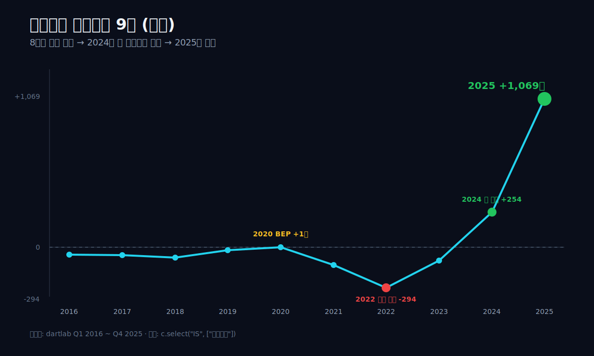

## 핵심 한 줄

2008년 5월, 한국의 50대 초반 단백질 의약품 연구자 한 명이 LG생명과학을 그만두고 작은 바이오텍을 세웠다. 박순재. 그는 그로부터 11년 동안 매년 영업적자를 봤다. 2016년 영업적자 -54억, 2017년 -58억, 2018년 -77억, 2019년 -23억. 매출은 100~300억 사이에서 들쭉날쭉했고 시장은 이 회사를 거의 모르는 채 지나갔다. 2020년 6월 17일, 그가 17년 동안 만든 효소 한 종류(ALT-B4, 인간 히알루로니다제 변종)가 머크와 라이선스 계약을 맺었다. 계약금 1,600만 달러. 시장 반응은 작았다. "이름 없는 한국 바이오텍이 머크와 했다고? 일회성이겠지." 2021년부터 2023년까지 회사는 다시 적자로 돌아갔다 — 2021년 -128억, 2022년 -294억(사상 최악), 2023년 -97억. 그러나 그 사이 박순재는 머크와 함께 전 세계에서 가장 많이 팔리는 항암제(키트루다, Pembrolizumab) 자체를 정맥주사에서 피하주사로 바꾸는 임상을 준비하고 있었다. 그로부터 5년 뒤인 2025년, 같은 회사가 1년 영업이익 +1,069억, 영업이익률 49.52%, 매출총이익률 76.73%를 찍었다. 매출은 68억(2016)에서 2,159억(2025)으로 **31.7배**가 됐다. 8년 누적 영업손실 약 -730억은 한 해 영업이익으로 모두 회수되고도 +339억이 남았다. 알테오젠 (196170), 박순재 대표가 17년을 기다린 회사다. dartlab으로 그 17년을 한 줄씩 까보는 글이다.

```python
import dartlab
c = dartlab.Company("196170")
c.story()                                  # 6막 자동 보고서
c.credit("등급")                             # 신용평가
c.analysis("financial", "수익성")             # marginWaterfall, roicTree
```

---

## 1막 — 2008년, 박순재가 LG생명과학을 그만두고 만든 회사

### FDA 신약 1호 팩티브의 1등 공신, 50대에 퇴사

박순재. 1954년 12월 22일 전북 군산 출생. 서울고등학교를 졸업하고 연세대학교 생화학과를 나왔다. 미국 퍼듀대학교 대학원에서 화학 석사·박사를 받았고, MIT에서 박사후 연구원으로 일했다. 1980년대 후반 한국으로 돌아와 럭키바이오텍연구소(이후 LG화학 연구소, 다시 LG생명과학)에 입사했다. 그곳에서 약 20년을 근무했다. 그가 LG에서 만든 가장 큰 작품은 신약 "팩티브" — 한국에서 처음으로 미국 FDA 승인을 받은 신약이었다. 그 프로젝트의 1등 공신으로 평가받았고, LG생명과학 임상개발담당 상무, 사업개발담당 상무를 거쳤다. 그 후 한화석유화학과 드림파마 임원, 바이넥스 대표를 거치며 연구개발과 해외사업개발 양쪽 경험을 쌓았다 ([businesspost](https://www.businesspost.co.kr/BP?command=article_view&num=368469)).

2008년 5월, 그는 50대 초반에 알테오젠을 세웠다. 아내 정혜신 한남대 교수와 함께. 자본금 약 5억. 2010년 그가 직접 대표이사에 올랐고, 2014년 12월 코스닥에 상장했다.

### IV를 SC로 — 하이브로자임 플랫폼이라는 한 가지 기술

회사의 핵심 기술은 한 가지였다. **하이브로자임(Hybrozyme) 플랫폼** — 인간 히알루로니다제 PH20의 변종을 만들어 항체 의약품을 정맥주사(IV)에서 피하주사(SC)로 바꾸는 효소 기술. 항체 의약품은 분자가 너무 커서 그냥 피부 아래로 주사하면 잘 흡수되지 않는다. 히알루로니다제는 피부 결합조직의 히알루론산을 일시적으로 분해해 큰 분자가 빠르게 흡수될 수 있게 해 준다. 이게 ALT-B4의 본질이다.

이 기술이 왜 중요한가. 글로벌 빅파마의 항암제 대부분은 정맥주사(IV)다. 환자가 병원에 와서 1시간 동안 IV 라인을 꽂고 누워 있어야 한다. 만약 같은 약을 피하주사(SC)로 5분 안에 끝낼 수 있다면, (1) 환자 편의가 폭발적으로 좋아지고, (2) 빅파마는 정맥주사용 특허가 만료되더라도 새 SC 제형으로 특허를 연장할 수 있고, (3) 바이오시밀러 경쟁을 방어할 수 있다. 빅파마에게는 회사 명운이 걸린 기술이다.

### 전 세계 2곳 — Halozyme vs 알테오젠

세계에서 이 기술을 만들 수 있는 회사는 두 곳이다. 미국 **Halozyme Therapeutics** (ENHANZE 플랫폼)와 한국 **알테오젠** (Hybrozyme/ALT-B4). Halozyme은 이미 로슈, 얀센, 화이자, 다케다 등 빅파마와 다수 계약을 맺고 있었다. 알테오젠은 한참 후발주자였다.

2008년부터 2019년까지 11년 동안 알테오젠은 매년 영업적자였다. 매출은 2016년 68억, 2017년 125억, 2018년 137억, 2019년 292억. 회사는 R&D 회사였고, 매출이라곤 라이선스 계약금 일부와 소규모 위탁개발 정도뿐이었다. 손익만 보면 평범한 한국 바이오텍 한 곳이었다.

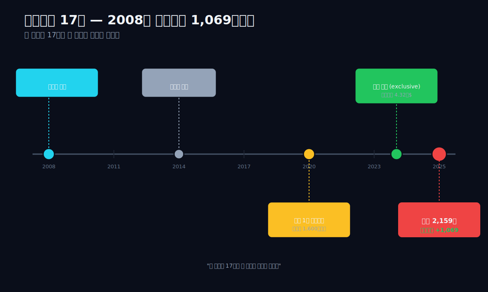

---

## 2막 — 2020년 6월 17일, 머크 1차 계약 (그러나 시장은 무관심했다)

### 계약금 1,600만 달러 — 적용 대상 비공개

2020년 6월 17일, 알테오젠은 미국 머크(MSD)와 ALT-B4 라이선스 계약을 발표했다. 당시 공시 내용은 의도적으로 모호했다 — 적용 대상 의약품이 비공개였기 때문이다. 계약금 1,600만 달러(약 194억원). 마일스톤 약 4억 달러. 라이선스 형태는 비독점(non-exclusive). 계약 기간은 비공개 ([바이오스펙테이터](https://www.biospectator.com/news/view/21147)).

시장 반응은 미적지근했다. 1,600만 달러는 글로벌 기준에서 작지 않은 계약금이지만, 한국 바이오 라이선스에서 종종 본 규모였다. 그리고 적용 대상이 비공개라는 점이 시장의 의심을 키웠다. "어떤 약에 쓰는지도 안 알려주는 계약이라면 대단한 약은 아니겠지." 알테오젠 주가는 발표 당일에 잠시 올랐다가 며칠 뒤 원래 자리로 돌아왔다.

### 매출원가율 91%→23% — 라이선스 비즈니스의 본질

dartlab으로 그 시기 알테오젠 손익을 한 화면에 펼치면 이렇다. 2020년 매출 424억, 영업이익 +1억. **9년 만에 처음으로 영업 BEP**. 그러나 영업이익이 1억밖에 안 됐고, 그것도 머크 계약금 1,600만 달러(약 194억)가 들어왔는데도 +1억이었다. 즉 R&D 비용을 빼면 거의 적자였다.

```python
c.select("IS", ["매출액","매출원가","매출총이익","판매비와관리비","영업이익","당기순이익"], freq="Y")
```

| 항목 (억원, 1년치 합산) | 2025 | 2024 | 2023 | 2022 | 2021 | 2020 | 2019 | 2018 | 2017 | 2016 |
|---|---:|---:|---:|---:|---:|---:|---:|---:|---:|---:|
| 매출액 | **2,159** | 1,029 | 965 | 288 | 411 | 424 | 292 | 137 | 125 | 68 |
| 매출원가 | 502 | 388 | 653 | 243 | 330 | 237 | 181 | 117 | 111 | 62 |
| 매출총이익 | **1,656** | 641 | 312 | 45 | 82 | 188 | 111 | 20 | 14 | 6 |
| 판관비 | 587 | 387 | 409 | 339 | 210 | 187 | 134 | 96 | 72 | 60 |
| 영업이익 | **+1,069** | +254 | -97 | **-294** | -128 | +1 | -23 | -77 | -58 | -54 |
| 당기순이익 | **+1,452** | +607 | -36 | -101 | -92 | -34 | -17 | -71 | -70 | -36 |

표시: **+1,069**(2025) = 9년 만의 의미 흑자 / **-294**(2022) = 사상 최악 / **+254**(2024) = 첫 의미 흑자 / **+1**(2020) = 9년 만의 첫 BEP

표가 보여주는 가장 결정적인 행은 매출원가다. 2016년 매출 68억에 매출원가 62억(매출원가율 91%) → 2025년 매출 2,159억에 매출원가 502억(매출원가율 23%). **9년 동안 매출은 31배 늘었는데 매출원가는 8배만 늘었다.** 이게 라이선스 비즈니스의 본질이다 — 한 번 만든 효소(ALT-B4)를 머크가 키트루다 SC에 쓸 때마다 마일스톤·로열티가 들어오고, 알테오젠 입장에서 추가 원가는 거의 0에 가깝다.

그러나 2020년 시점에서는 시장이 이 그림을 못 봤다. 머크 1차 계약은 일회성으로 받아들여졌다.

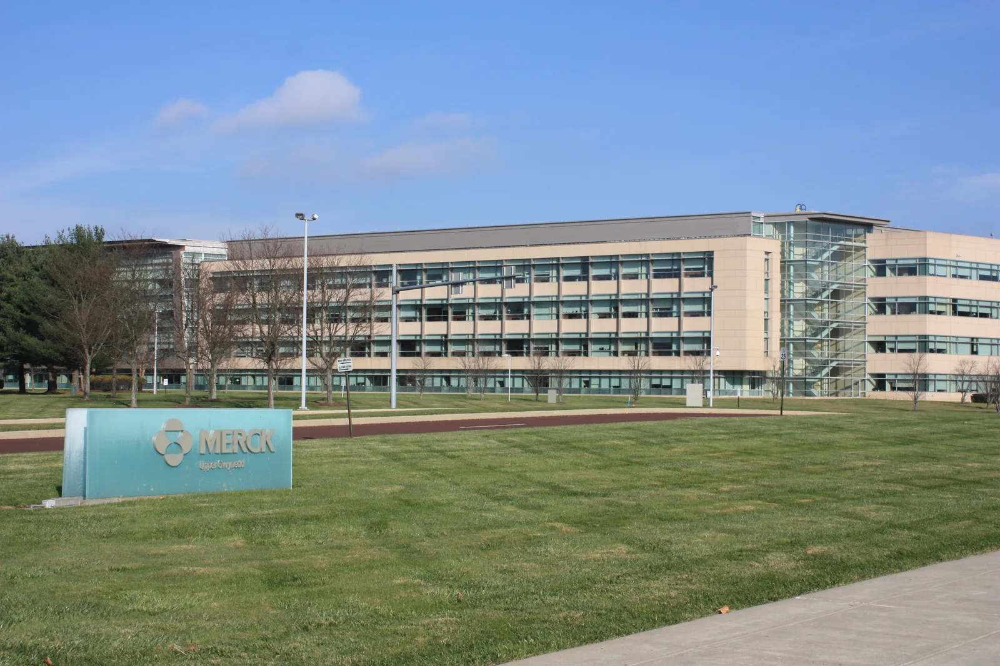
*머크(MSD) 미국 본사. 2020년 6월 17일, 머크는 알테오젠과 ALT-B4 라이선스 계약을 체결했다 — 적용 대상은 비공개였지만, 5년 뒤 그 적용 대상이 글로벌 톱5 의약품 키트루다였다는 사실이 드러난다. (출처: Wikimedia Commons, CC BY-SA)*

---

## 3막 — 2021~2023, 다시 적자로. "역시 일회성이었구나"

### 2022년 -294억 사상 최악 — 자기자본의 20% 소진

2021년, 알테오젠 영업이익 -128억. 매출 411억(2020년보다 약간 줄었다). 2022년, 영업이익 **-294억** — 사상 최악. 매출은 288억으로 추가 하락. 2023년, 영업이익 -97억, 매출 965억(매출은 다시 늘었다).

이 3년 동안 시장 평가는 분명했다. "역시 머크 1차 계약은 일회성이었다." 알테오젠 주가는 횡보했고, 한국 바이오 투자자들도 거의 잊고 지냈다. 2022년 한 해 영업적자 -294억은 회사 자기자본 1,454억 대비 약 20%였다 — 이대로 1~2년 더 가면 회사 존립이 위험할 수도 있는 수준이었다.

### 키트루다 = 머크 매출 40% — 비공개 적용 대상의 정체

그런데 그 사이 박순재와 머크는 다른 일을 하고 있었다. **키트루다(Pembrolizumab)의 SC 변환 임상**. 키트루다는 무엇인가. PD-1 면역항암제, 머크의 가장 큰 매출 의약품. 2024년 머크 전체 매출의 약 40%가 키트루다에서 나왔다. 단일 의약품으로 글로벌 톱 매출 — 2024년 약 295억 달러(약 40조원). 만약 이걸 정맥주사(IV)에서 피하주사(SC)로 바꾸면, 머크는 (1) 환자 편의를 폭발적으로 개선하고, (2) 2028년 만료 예정인 IV 특허를 SC 제형으로 연장하고, (3) 바이오시밀러 경쟁을 방어할 수 있다. **머크 입장에서는 회사 매출 40%가 걸린 사활의 프로젝트.**

이 프로젝트의 핵심 효소가 ALT-B4였다. 알테오젠이 만든 그 효소. 2020년 비공개로 계약했던 적용 대상이 사실은 키트루다였다.

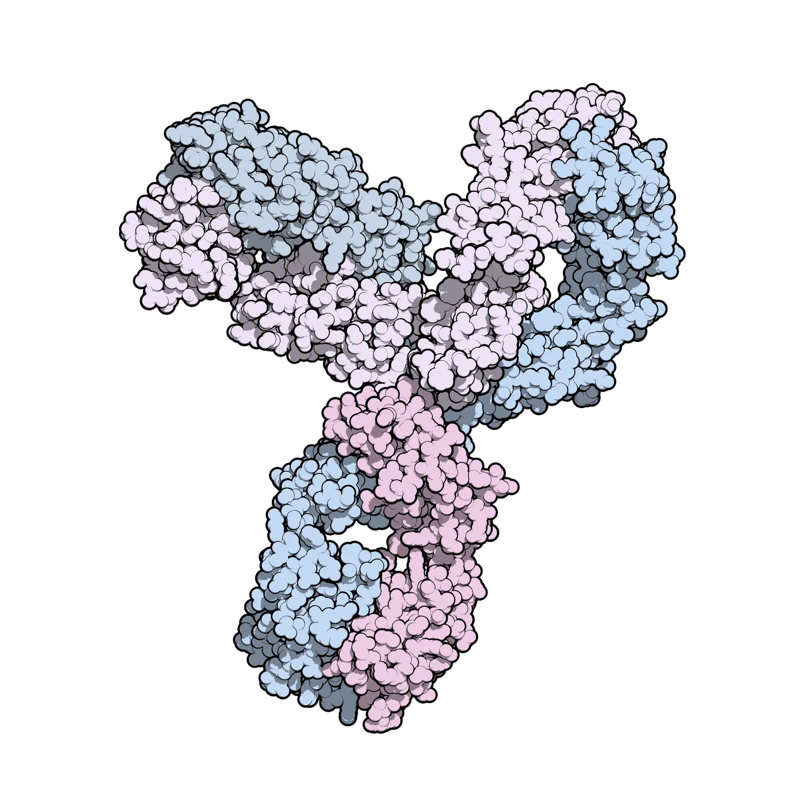
*Pembrolizumab(키트루다) 분자 구조 모델. 2024년 머크 매출의 약 40%, 글로벌 톱 매출 의약품. 2028년 IV 특허 만료를 앞두고 머크는 SC 제형 변환에 회사 매출의 40%를 걸었고, 그 핵심 효소가 알테오젠 ALT-B4였다. (출처: Wikimedia Commons, public domain)*

2022년 12월~2023년, 머크는 키트루다 SC의 글로벌 임상 3상을 본격 가동했다. 시장은 이 임상이 알테오젠 ALT-B4를 쓰고 있다는 사실을 추정만 할 수 있었다. 알테오젠도 머크도 명시적으로 인정하지 않았다. 머크가 명시적으로 발표한 건 한 줄이었다. "키트루다 SC 임상에 사용 중인 히알루로니다제는 한 회사의 기술이다."

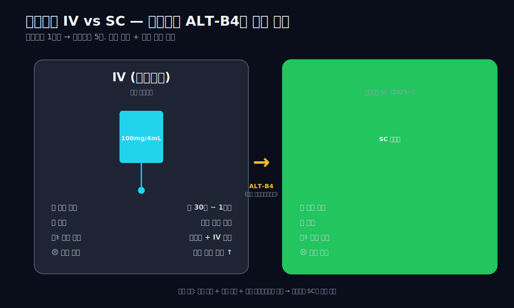

---

## 4막 — 2024년 2월, 머크 갱신. non-exclusive에서 exclusive로

### 독점 전환 + 마일스톤 10억 달러 — 시총 2배

2024년 2월, 알테오젠은 머크와의 계약 변경을 공시했다. 핵심 변경 사항 4가지 ([바이오스펙테이터](https://www.biospectator.com/news/view/21147), [businesspost](https://www.businesspost.co.kr/BP?command=article_view&num=427595)):

1. **비독점 → 독점 전환**: 머크가 키트루다 SC에 ALT-B4를 독점적으로 사용
2. **추가 계약금 2,000만 달러** (약 267억원, 2024년 매출의 약 26%)
3. **마일스톤 4억 3,200만 달러로 증액** (원계약 약 4억 → 약 8억 달러 누적)
4. **적용 품목 공개**: 키트루다(Pembrolizumab) — 즉 4년 전 비공개였던 적용 대상이 마침내 드러남

이 발표가 알테오젠 시가총액을 분기 만에 두 배 이상으로 만들었다. 시장이 처음으로 인식한 것이다. "이 회사가 머크 매출 40%의 절반(SC 변환 부분)을 받게 되는구나."

### 영업이익 +254억 — 9년 만의 의미 있는 흑자

dartlab으로 본 2024년 손익. 매출 1,029억(전년 +6.6%), 영업이익 **+254억** — 9년 만에 의미 있는 흑자. 영업이익률 24.7%. 2024년 매출의 약 26%가 머크 추가 계약금이고, 나머지가 기존 라이선스 마일스톤·기타 매출. 이 흑자는 2020년 +1억 BEP와는 차원이 다르다 — 2020년은 1,600만 달러가 들어와도 R&D 비용에 다 쓰여서 영업이익이 거의 0이었지만, 2024년은 같은 R&D 비용을 쓰고도 254억이 남는 구조가 됐다. 회사가 비용 베이스 위에 안정적인 매출 베이스를 쌓기 시작한 것이다.

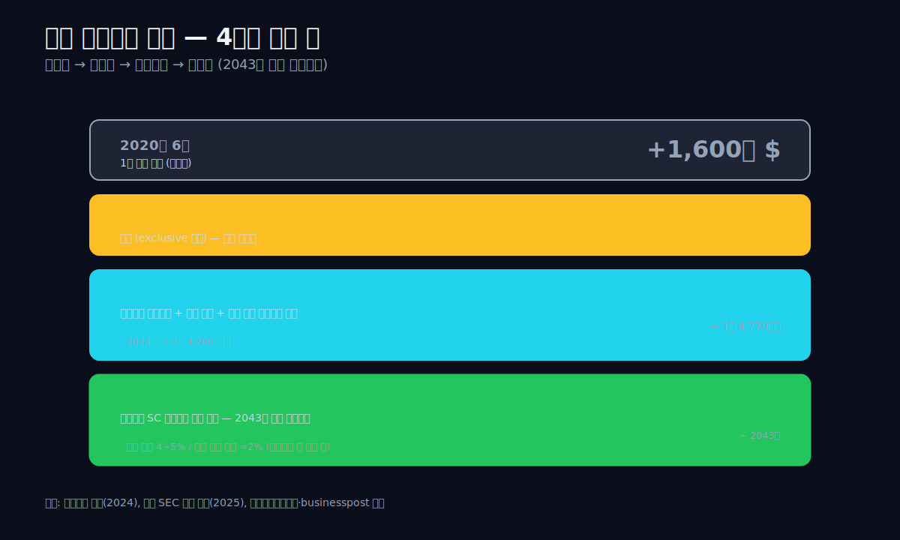

머크 갱신 후의 알테오젠 라이선스 구조는 4단으로 이루어진다.

1. **2020 1차 계약금**: 1,600만 달러 (약 194억원, 2020년 매출 인식)
2. **2024 갱신 계약금**: 2,000만 달러 (약 267억원, 2024년 매출 인식)
3. **마일스톤 누적**: 약 10억 달러 (1조 4,770억원) — 키트루다 SC 품목허가, 특허 연장, 누적 매출 단계마다 분기 인식
4. **로열티**: 마일스톤 다 받은 후 키트루다 SC 순매출의 약 2% — 2043년 특허 만료까지

### 로열티 2% 논란 — 주가 -20% 급락, 그러나 구조는 유효

마지막 행 로열티 2%가 2025년 1월 시장에서 작은 논란이 됐다. 머크가 SEC 분기 공시(10-Q)에 "all sales milestones를 달성하면 로열티 2%를 지급한다"는 문구를 올렸고, 시장은 4~5%를 기대했었다. 알테오젠 주가는 발표 당일 약 -20% 급락. 알테오젠은 즉각 입장문을 내고 "로열티율은 단계별 차등 구조이며 최종 비율은 공개 불가"라고 해명했지만 시장은 이미 당황했다. 그러나 본질은 다르지 않았다 — 로열티 2%라도 키트루다 SC 매출이 100억 달러를 넘으면 알테오젠 입장에서 연간 2,000억원이 들어온다. 그리고 마일스톤 10억 달러(1.5조원)는 그 전에 분기마다 들어온다. 시장이 잠시 패닉했을 뿐 구조 자체는 그대로였다.

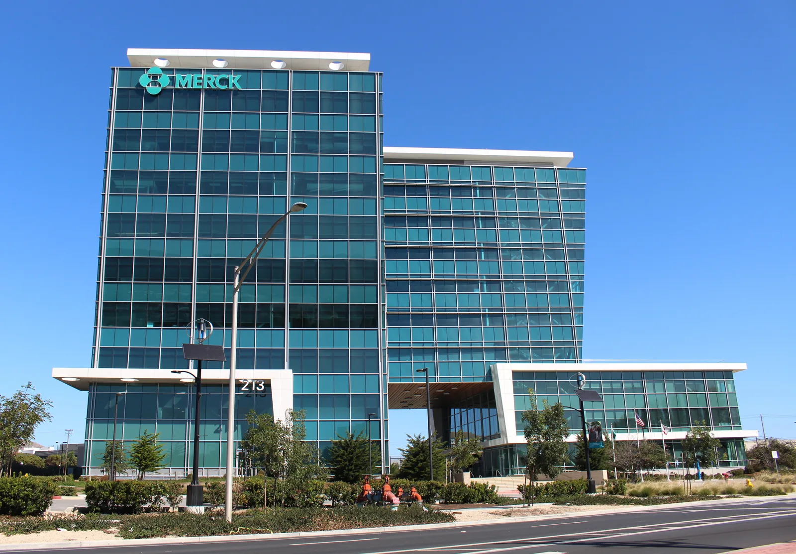
*머크 R&D 연구소. 머크가 2022년부터 2024년까지 키트루다 SC 글로벌 임상 3상을 진행한 곳. 알테오젠 ALT-B4는 그 임상의 모든 환자에게 사용됐다. (출처: Wikimedia Commons, CC BY-SA)*

---

## 5막 — 2025, 진짜 폭발. 매출 31배 / 영업이익률 49.52% / 투하자본수익률 49.27%

### 매출총이익률 76.73% — 글로벌 빅파마 기준

2025년 결산. 매출 **2,159억** (전년 대비 +110%). 영업이익 **+1,069억** (전년 대비 +321%). 당기순이익 **+1,452억** (전년 대비 +139%). 영업이익률 **49.52%**. 매출총이익률 **76.73%**. 투하자본수익률 **49.27%** (WACC 약 11%, spread +38pp). 차입금 약 50억 (사실상 무차입). 현금성자산 + 단기금융상품 합계 약 4,300억.

dartlab의 마진 분해를 보면 이 회사가 어떤 종류의 회사가 됐는지 한 화면에 들어온다.

```python
c.analysis("financial", "수익성")["marginWaterfall"]["history"][0]
```

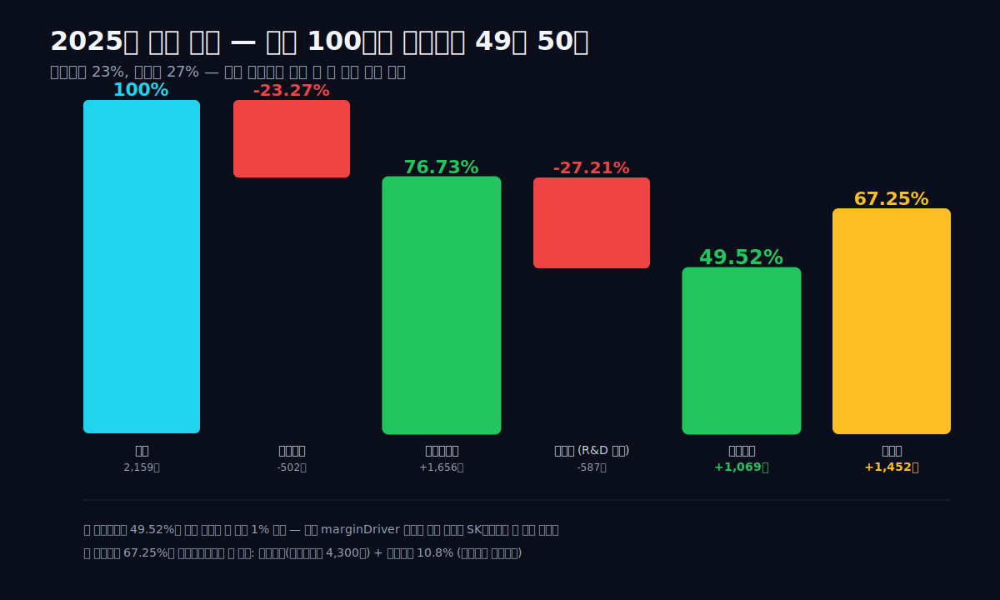

매출 100원에서 매출원가가 23원, 매출총이익이 77원. 거기서 판관비(R&D 포함)가 27원을 가져가고 영업이익이 49원 50전 남는다. 그 다음 금융수익(현금성자산 4,300억의 운용 수익)과 법인세(R&D 세제혜택으로 실효세율 약 11%)를 거쳐 순이익이 67원으로 더 늘어난다.

**한국 상장사 중 영업이익률 49%를 1년 평균으로 찍는 회사는 손에 꼽는다.** 그리고 dartlab의 투하자본수익률 Tree가 알테오젠을 자동 분류한 결과는 다음과 같다.

```python
c.analysis("financial", "수익성")["roicTree"]["history"][0]
# {'period': '2025', 'roic': 49.27, 'operatingMargin': 49.52, 'grossMargin': 76.73,
#  'sgaRatio': 27.21, 'effectiveTaxRate': 10.8, 'wcTurnover': 6.52, 'fixedTurnover': 1.35,
#  'marginDriver': '높은 가격결정력 (매출총이익률 > 40%)', 'turnoverDriver': '보통 수준'}
```

`marginDriver: '높은 가격결정력 (매출총이익률 > 40%)'` — 이 분류를 받은 한국 회사는 SK하이닉스, 셀트리온, 일부 게임사 정도다. 알테오젠이 그 카테고리에 들어왔다. **바이오텍 입장에서 매출총이익률 76%는 글로벌 빅파마 기준이다.** 한국 바이오에서는 처음 본다.

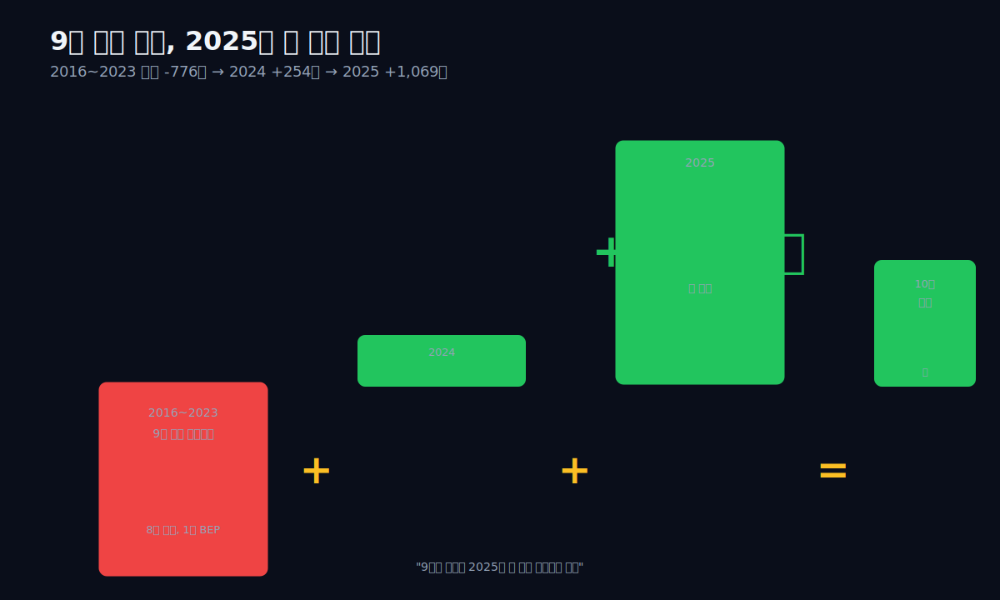

### 8년 누적 적자 -730억 → 한 해에 전부 회수

이 그래프가 알테오젠 9년 서사에서 가장 결정적인 한 화면이다. 2016년부터 2023년까지 8년 동안 알테오젠의 누적 영업이익은 약 -730억(거의 매년 적자, 2020년만 +1억). 2024년에 +254억으로 처음 의미 있는 흑자를 냈고, 2025년에 +1,069억으로 폭발했다. **2025년 한 해 영업이익이 8년 누적 영업손실보다 339억 더 크다.** 즉 9년의 R&D 적자가 한 해의 흑자에 흡수되고도 흑자가 더 남았다.

박순재의 17년이 한 해에 회수된 것이다.

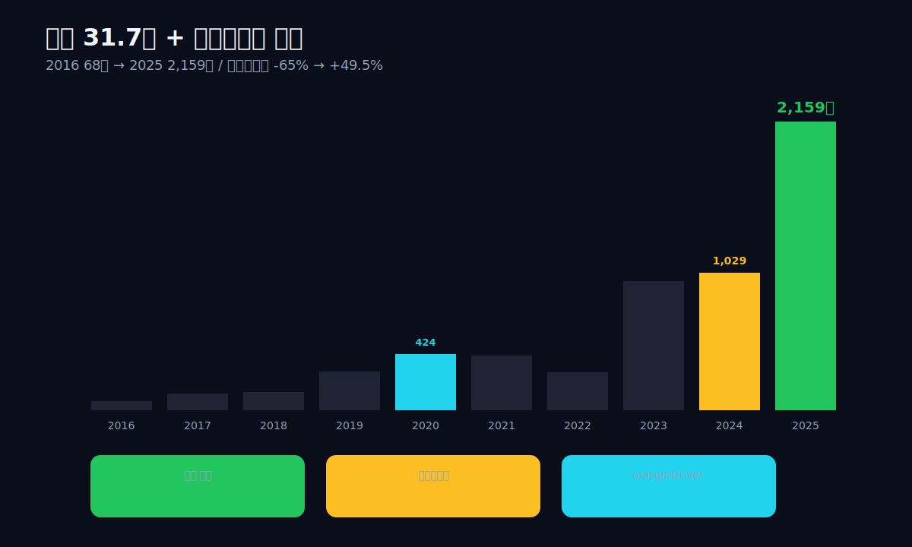

### 현금 4,300억 + 무차입 — R&D를 받치는 곳간

자금 구조도 같이 보자. 9년 BS Q4 스냅샷.

```python
c.select("BS", ["자산총계","부채총계","자본총계","현금및현금성자산","단기금융상품"], freq="Y")
```

| 항목 (억원, Q4 스냅샷) | 2025 | 2024 | 2023 | 2022 | 2021 | 2020 | 2019 | 2018 | 2017 |
|---|---:|---:|---:|---:|---:|---:|---:|---:|---:|
| 자산총계 | **6,987** | 4,090 | 2,561 | 2,455 | 2,603 | 1,592 | 860 | 714 | 430 |
| 부채총계 | 2,443 | 1,349 | 1,083 | 1,001 | 1,264 | 229 | 158 | 47 | 32 |
| 자본총계 | **4,544** | 2,741 | 1,478 | 1,454 | 1,339 | 1,363 | 702 | 667 | 398 |
| 현금및현금성 | 664 | 190 | 302 | 458 | 105 | 389 | 44 | 89 | 52 |
| 단기금융상품 | **3,636** | 1,653 | 551 | 817 | 1,925 | 948 | 576 | 426 | 272 |

자산총계가 9년 동안 430억 → 6,987억(16배). 그 중 자본총계는 398억 → 4,544억(11.4배) — 거의 전부가 영업이익 누적과 유상증자에서 왔다. 가장 결정적인 행은 마지막 두 줄 — 현금성자산 + 단기금융상품이 합쳐 약 4,300억. 차입금은 사실상 0(약 50억). **이 회사는 4,300억의 곳간 위에 +1,069억 영업이익을 얹는 회사다.** 그 곳간이 R&D 임상 비용을 안전하게 받쳐준다.

CF도 같이 본다.

```python
c.select("CF", ["영업활동현금흐름","유형자산의 취득"], freq="Y")
```

| 항목 (억원, 1년치) | 2025 | 2024 | 2023 | 2022 | 2021 | 2020 | 2019 | 2018 | 2017 |
|---|---:|---:|---:|---:|---:|---:|---:|---:|---:|
| 영업CF | **+1,241** | +530 | -78 | -179 | -94 | +17 | +105 | -91 | -43 |
| 유형자산취득 | 230 | 27 | 12 | 64 | 136 | 51 | 64 | 72 | 7 |
| 영업CF − 설비투자 | **+1,011** | +503 | -90 | -243 | -230 | -34 | +41 | -163 | -50 |

마지막 행 잉여현금이 결정적이다. 2017~2023년 7년 중 6년이 잉여현금 마이너스 — 회사가 영업으로 번 돈보다 더 많이 쓰면서 R&D를 했다. 그러다 2024년에 +503억으로 처음 의미 있는 잉여, 2025년에 +1,011억. **9년의 누적 잉여현금 적자가 2년 만에 다 메워졌다.** 지난 5막에서 본 영업이익 회수와 정확히 같은 모양이다.

dartlab의 신용등급은 **dCR-AA-, score 9.89, healthScore 90.11, 긍정적 outlook**. divergenceExplanation은 "사업안정성 축이 40점으로 등급 하방 압력" — 즉 회사가 단일 라이선스(머크 키트루다 SC)에 매출 의존도가 매우 높다는 점이 등급 상승을 누르고 있다. 이게 6막에서 봐야 할 진짜 질문이다.

```python
c.credit("등급")
# {'grade': 'dCR-AA-', 'score': 9.89, 'healthScore': 90.11, 'sector': '건강관리',
#  'outlook': '긍정적', 'divergenceExplanation': ['사업안정성 축이 40점으로 등급 하방 압력', ...]}
```

---

## 6막 — 2026년에 봐야 할 4가지

### 단일 라이선스 의존 — dCR-AA- 상승 압력을 누르는 핵심 리스크

2025년 +1,069억은 일회성인가, 새 시대의 시작인가. dartlab이 답할 수 있는 것은 한계가 있다 — dartlab은 한국 공시 데이터 엔진이고, 머크 키트루다 SC의 글로벌 매출 진행이나 다이이찌산쿄/산도즈/인타스 같은 다른 빅파마와의 추가 라이선스 가능성은 직접 보지 못한다. 그래서 여기서 내릴 수 있는 결론은 정량 모델의 답이 아니라, 투자자 본인이 매 분기 직접 4가지 신호를 검증해야 한다는 것이다.

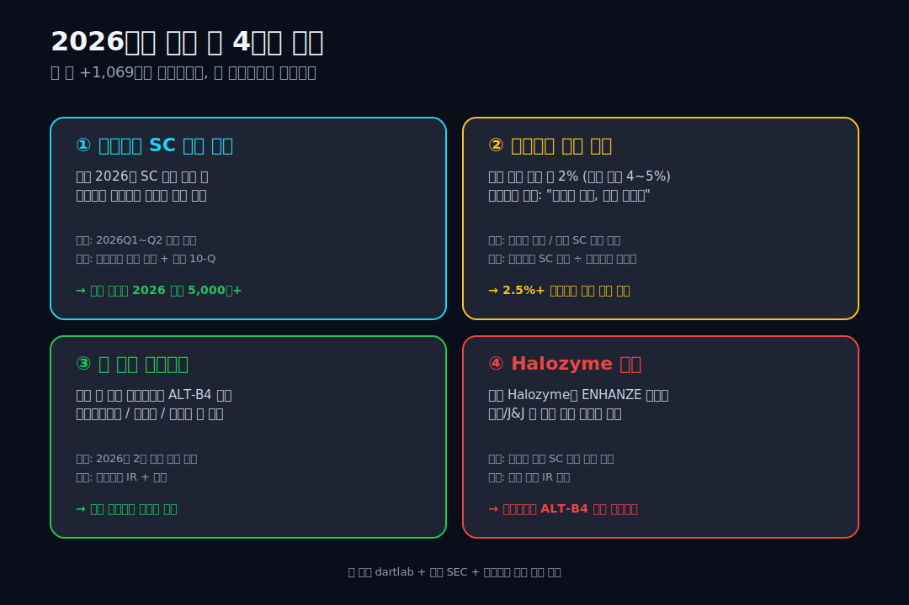

### ① 키트루다 SC 분기 매출 인식

머크는 2025년 11월 키트루다 SC 유럽 허가를 받았고, 알테오젠은 그 시점에 마일스톤 219억을 수령했다 ([파이낸셜뉴스](https://www.fnnews.com/news/202511280908399046)). 2026년 본격 출시가 시작되면 분기마다 알테오젠 매출에 마일스톤이 인식된다. 임계 조건: **2026Q1~Q2 매출이 분기당 600억 이상**(연 환산 2,400억+) 유지.

### ② 로열티율 협상 결과

머크 SEC 공시에 나온 "all sales milestones 후 로열티 2%"가 시장 우려의 주된 출처. 알테오젠은 "단계별 차등"이라고 해명했지만 정확한 비율은 비공개. 2026년 분기마다 (키트루다 SC 매출 ÷ 알테오젠 로열티)를 계산해 실효 로열티율이 2% 이상인지 확인. 임계: **실효 2.5% 이상이면 시장 우려 해소**.

### ③ 두 번째 라이선스

알테오젠이 머크 외 다른 빅파마와 ALT-B4 추가 라이선스를 발표하면 단일 의존 리스크가 해소된다. 후보: 다이이찌산쿄(ADC 항암제), 산도즈(바이오시밀러), 인타스(글로벌 제네릭), 또는 기존 SC 시장의 거인 로슈/J&J(이미 Halozyme 사용 중이지만 경쟁 가능). 임계: **2026년 2건 이상 추가 빅파마 계약 발표**.

### ④ Halozyme 경쟁

미국 Halozyme의 ENHANZE 플랫폼이 알테오젠의 직접 경쟁자. Halozyme은 이미 로슈(허셉틴 SC), 얀센(다잘렉스 SC), 화이자, 다케다 등 다수 빅파마와 계약을 맺고 있다. 알테오젠은 머크 외에는 아직 큰 빅파마 계약이 부족하다. 매 분기 양사 IR을 비교하면서, 알테오젠이 ALT-B4의 기술적 우위(가격, 특허 회피, 안정성, 환자 면역원성 등)를 입증해 가는지 확인.

---

---


---

<!-- AUTO:START — sync_financials.py가 자동 생성. 수동 편집 금지 -->


## 공시 / Filings

| 기간 | 보고서 | 링크 |
|------|--------|------|
| 2025 | 사업보고서 (2025.12) | [DART에서 보기](https://dart.fss.or.kr/dsaf001/main.do?rcpNo=20260323001596) |
| 2025 | 분기보고서 (2025.09) | [DART에서 보기](https://dart.fss.or.kr/dsaf001/main.do?rcpNo=20251114000465) |
| 2025 | 반기보고서 (2025.06) | [DART에서 보기](https://dart.fss.or.kr/dsaf001/main.do?rcpNo=20250813001141) |
| 2025 | 분기보고서 (2025.03) | [DART에서 보기](https://dart.fss.or.kr/dsaf001/main.do?rcpNo=20250513000785) |
| 2024 | 사업보고서 (2024.12) | [DART에서 보기](https://dart.fss.or.kr/dsaf001/main.do?rcpNo=20250321000557) |
| 2024 | 분기보고서 (2024.09) | [DART에서 보기](https://dart.fss.or.kr/dsaf001/main.do?rcpNo=20241114000558) |
| 2024 | 반기보고서 (2024.06) | [DART에서 보기](https://dart.fss.or.kr/dsaf001/main.do?rcpNo=20240814000309) |
| 2024 | 분기보고서 (2024.03) | [DART에서 보기](https://dart.fss.or.kr/dsaf001/main.do?rcpNo=20240516000132) |
| 2023 | 사업보고서 (2023.12) | [DART에서 보기](https://dart.fss.or.kr/dsaf001/main.do?rcpNo=20240318000392) |
| 2023 | 분기보고서 (2023.09) | [DART에서 보기](https://dart.fss.or.kr/dsaf001/main.do?rcpNo=20231114000319) |

> 전체 공시 목록은 dartlab에서 확인:
> ```python
> import dartlab
> c = dartlab.Company("196170")
> c.filings()
> ```

## 재무제표 — 최근 5개년

> 아래는 최근 5개년 요약입니다. 전체 기간·분기별 데이터는 dartlab에서 직접 확인할 수 있습니다:
> ```python
> import dartlab
> c = dartlab.Company("196170")
> c.panel("IS")              # 손익계산서 (분기)
> c.panel("IS", freq="Y")    # 손익계산서 (연간)
> c.panel("BS")              # 재무상태표
> c.panel("CF")              # 현금흐름표
> c.panel("SCE")             # 자본변동표
> c.panel("ratios")          # 재무비율
> ```

### 손익계산서 (IS) — 단위 억원

<ComboChart data={[{year:"2025",매출액:2159,영업이익:1069,당기순이익:1452},{year:"2024",매출액:1029,영업이익:254,당기순이익:607},{year:"2023",매출액:965,영업이익:-97,당기순이익:-36},{year:"2022",매출액:288,영업이익:-294,당기순이익:-101},{year:"2021",매출액:411,영업이익:-128,당기순이익:-92}]} lineKeys={["매출액"]} barKeys={["영업이익","당기순이익"]} lineColors={["#22c55e"]} barColors={["#3b82f6","#f59e0b"]} title="매출(라인) vs 영업이익·당기순이익(막대)" unit="억원" />

| 항목 | 2025 | 2024 | 2023 | 2022 | 2021 |
|---|---:|---:|---:|---:|---:|
| 매출액 | 2,159 | 1,029 | 965 | 288 | 411 |
| 매출원가 | 502 | 388 | 653 | 243 | 330 |
| 매출총이익 | 1,656 | 641 | 312 | 45 | 82 |
| 판매비와관리비 | 587 | 387 | 409 | 339 | 210 |
| 영업이익 | 1,069 | 254 | -97 | -294 | -128 |
| 금융수익 | — | — | — | — | — |
| 금융비용 | — | — | — | — | — |
| 당기순이익 | 1,452 | 607 | -36 | -101 | -92 |

### 재무상태표 (BS) — 단위 억원

<StackBar data={[{year:"2025",segments:[{label:"부채",value:2443,color:"#ef4444"},{label:"자본",value:4544,color:"#22c55e"}]},{year:"2024",segments:[{label:"부채",value:1349,color:"#ef4444"},{label:"자본",value:2741,color:"#22c55e"}]},{year:"2023",segments:[{label:"부채",value:1083,color:"#ef4444"},{label:"자본",value:1478,color:"#22c55e"}]},{year:"2022",segments:[{label:"부채",value:1001,color:"#ef4444"},{label:"자본",value:1454,color:"#22c55e"}]},{year:"2021",segments:[{label:"부채",value:1264,color:"#ef4444"},{label:"자본",value:1339,color:"#22c55e"}]}]} title="부채 vs 자본 구조" unit="억원" />

| 항목 | 2025 | 2024 | 2023 | 2022 | 2021 |
|---|---:|---:|---:|---:|---:|
| 자산총계 | 6,987 | 4,090 | 2,561 | 2,455 | 2,603 |
| 유동자산 | 4,808 | 2,118 | 1,441 | 1,451 | 2,122 |
| 비유동자산 | 2,179 | 1,972 | 1,120 | 1,004 | 481 |
| 부채총계 | 2,443 | 1,349 | 1,083 | 1,001 | 1,264 |
| 유동부채 | 2,397 | 1,292 | 1,004 | 943 | 1,232 |
| 비유동부채 | 46 | 57 | 78 | 58 | 32 |
| 자본총계 | 4,544 | 2,741 | 1,478 | 1,454 | 1,339 |

### 현금흐름표 (CF) — 단위 억원

<ComboChart data={[{year:"2025",영업CF:1241,투자CF:-2311,재무CF:0},{year:"2024",영업CF:530,투자CF:-1078,재무CF:0},{year:"2023",영업CF:-78,투자CF:-93,재무CF:0},{year:"2022",영업CF:-179,투자CF:502,재무CF:0},{year:"2021",영업CF:-94,투자CF:-1260,재무CF:0}]} barKeys={["영업CF","투자CF","재무CF"]} barColors={["#22c55e","#ef4444","#3b82f6"]} title="영업·투자·재무 현금흐름" unit="억원" />

| 항목 | 2025 | 2024 | 2023 | 2022 | 2021 |
|---|---:|---:|---:|---:|---:|
| 영업활동현금흐름 | 1,241 | 530 | -78 | -179 | -94 |
| 투자활동현금흐름 | -2,311 | -1,078 | -93 | 502 | -1,260 |
| 재무활동현금흐름 | — | — | — | — | — |

*최종 갱신: 2026-04-13 | dartlab 실측 (DART 공시 기준)*

<!-- AUTO:END -->
