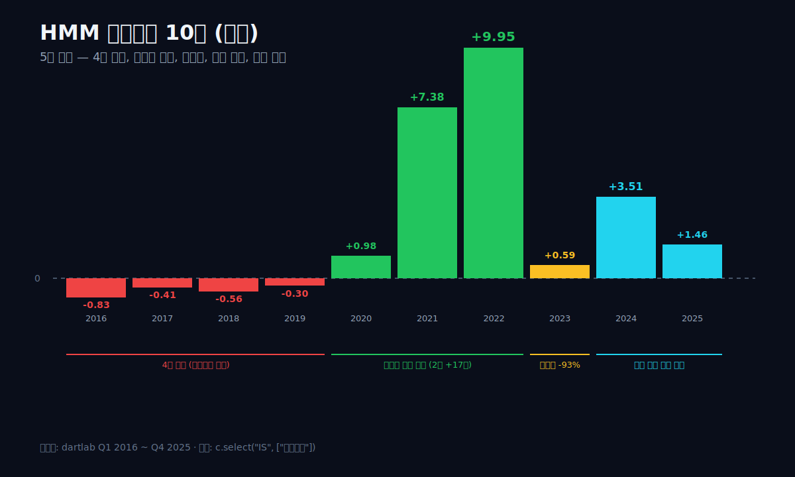
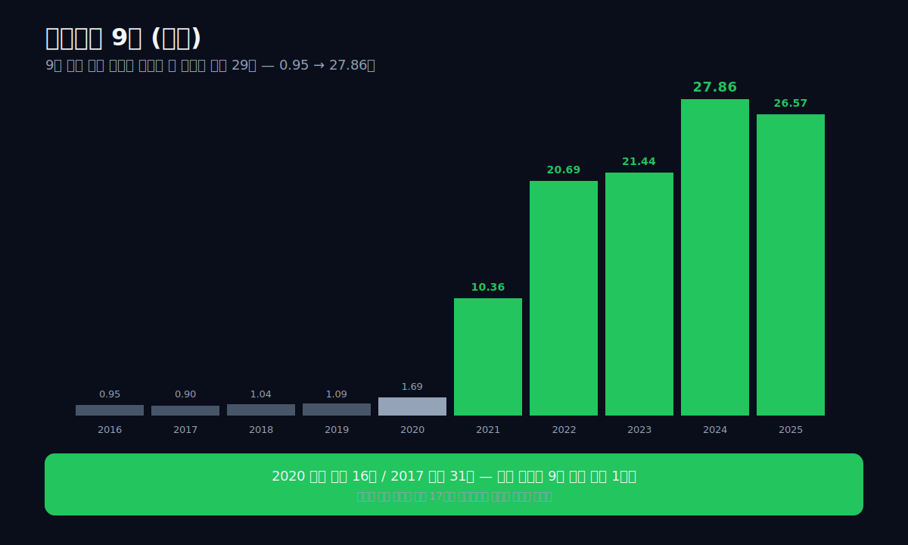
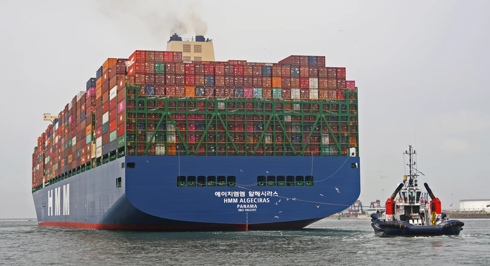
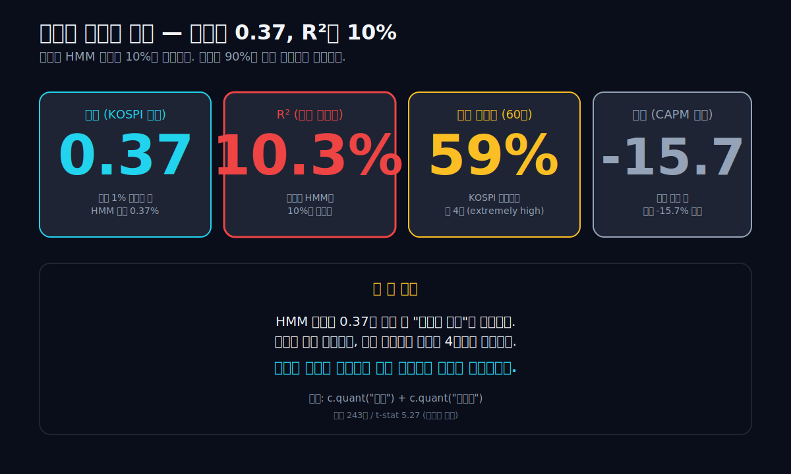
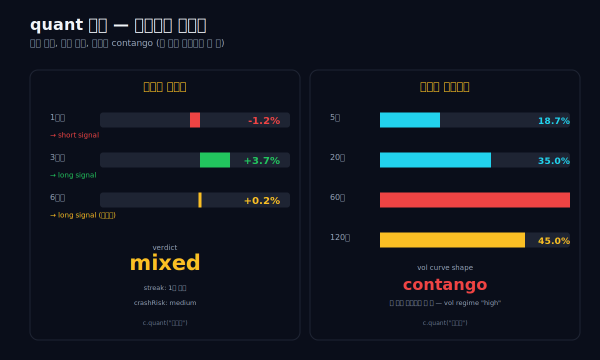
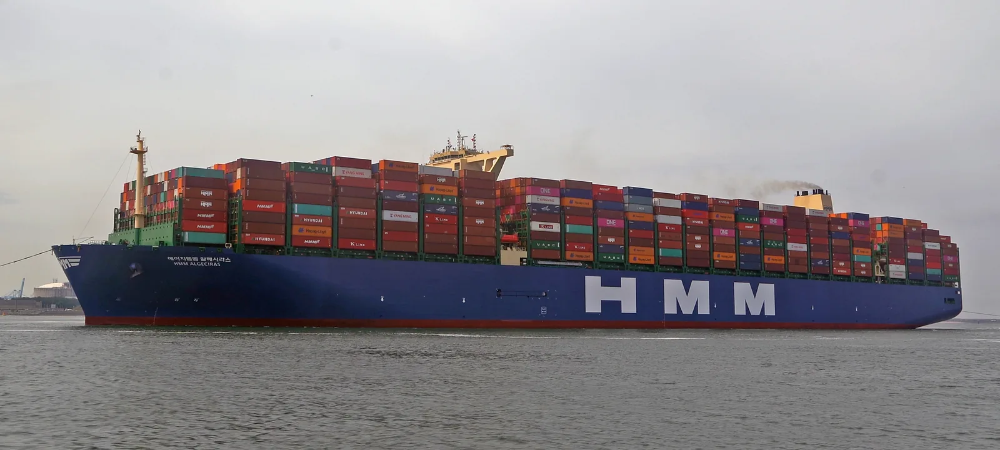
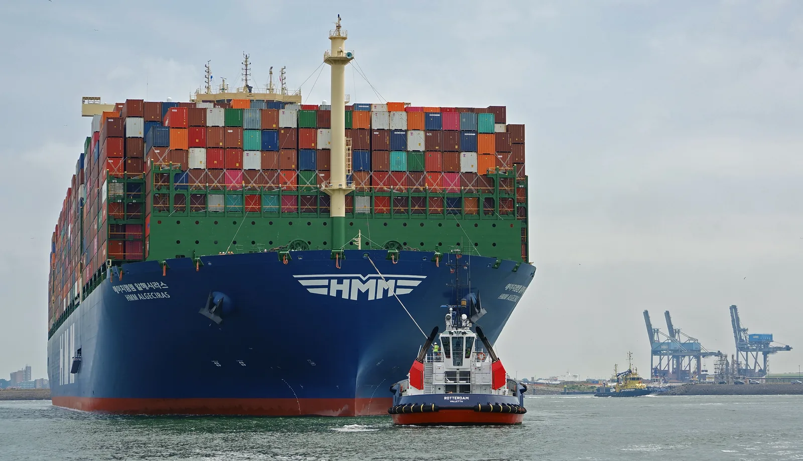
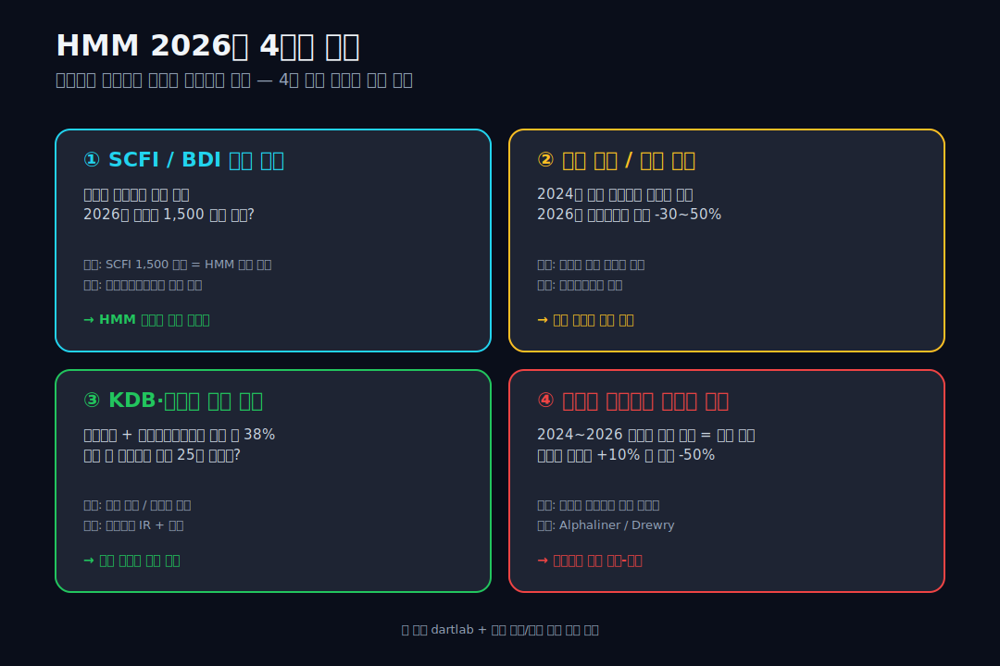

> **사이클 + 시장 분리** | 운수창고 > 해상운송 | 2026-04-08 dartlab 실측
> 데이터: dartlab Q1 2016 ~ Q4 2025 | 엔진: **analysis + quant + credit** (4개 엔진 동시 사용)
> 같은 시리즈: [SK하이닉스](/blog/000660-skhynix) · [삼양식품](/blog/003230-samyang-foods) · [두산에너빌리티](/blog/034020-doosan-enerbility) · [알테오젠](/blog/196170-alteogen) · [HMM](/blog/011200-hmm) · [셀트리온](/blog/068270-celltrion) · [한화에어로스페이스](/blog/012450-hanwha-aerospace) · [HD현대일렉트릭](/blog/267260-hd-hyundai-electric) · [고려아연](/blog/010130-korea-zinc) · [에이피알](/blog/278470-apr) · [기업이야기 시리즈 전체](/blog/series/company-reports)


---



## 핵심 한 줄

10년 동안 한 회사의 영업이익이 다음과 같이 회전했다. -8,300억 → -4,100억 → -5,600억 → -3,000억 → +9,800억 → **+7조 3,800억** → **+9조 9,500억** → +5,873억 → +3조 5,100억 → +1조 4,600억. 같은 회사다. 같은 사람이 같은 배 100여 척으로 같은 항로를 운영했다. 그런데 영업이익이 한 해에 -56%가 되거나 +496%가 되거나 -58%가 됐다. 매출 4조였다가 18조였다가 다시 8조였다가 11조였다가 10조가 됐다. 이 회사가 **HMM (011200)**, 한진해운 파산 이후 한국에 단 하나 남은 글로벌 컨테이너 선사다. 그리고 dartlab의 quant 엔진이 이 회사의 주가를 분석한 결과는 다음 두 줄이다 — **베타 0.37, R² 10.3%, 실현 변동성(60일) 59%**. 시장이 1% 움직일 때 HMM은 평균 0.37%만 움직이고, 시장이 HMM 주가를 10%만 설명하고, 나머지 90%는 자기 변동성이다. 그 자기 변동성이 KOSPI 변동성의 거의 4배다. 결론 한 줄: **HMM은 시장이 아니라 사이클이 주가를 결정하는 회사다.** 이 글은 dartlab의 analysis(재무) + quant(기술) + credit(신용) 세 엔진을 동시에 써서 그 사이클을 분해한다.

```python
import dartlab
c = dartlab.Company("011200")
c.analysis("financial", "수익성")    # 재무 — 사이클의 영업이익 흔적
c.quant("판단")                      # 기술 — 베타/RSI/SMA
c.quant("변동성")                    # 기술 — GARCH + 기간구조
c.credit("등급")                     # 신용 — 5번 사이클을 견딘 회사
```

---

## 1막 — 2016년, 한진해운 파산 옆에서 살아남은 한 회사

### 글로벌 7위 한진해운 파산 — 한국에 남은 건 하나

2016년 8월 31일, **한진해운**이 법정관리를 신청했다. 한국 최대 컨테이너 선사, 글로벌 7위, 매출 7조원의 회사가 한 번에 무너졌다. 채권단이 지원을 거부했고, 법원이 회생을 신청해 받아들였지만 결국 2017년 2월 17일 파산이 확정됐다. 한국 해운 산업 사상 최대 사건이었다.

그 직전까지 한국에는 두 개의 글로벌 컨테이너 선사가 있었다 — 한진해운과 **현대상선**. 한진이 무너진 후 한국에 남은 것은 단 한 곳, 현대상선뿐이었다. 정부는 2018년부터 현대상선을 살리기 위해 산업은행과 한국해양진흥공사를 통해 자본을 투입했고, 2020년 4월 사명을 **HMM**으로 바꿨다 — Hyundai Merchant Marine의 약자.

### 매출원가 > 매출 — 4년 연속 적자, 누적 -2.1조

dartlab으로 그 시기 HMM의 손익을 한 화면에 펼치면 이렇다.

```python
c.select("IS", ["매출액","매출원가","매출총이익","판매비와관리비","영업이익","당기순이익"], freq="Y")
```

| 항목 (조원, 1년치 합산) | 2025 | 2024 | 2023 | 2022 | 2021 | 2020 | 2019 | 2018 | 2017 | 2016 |
|---|---:|---:|---:|---:|---:|---:|---:|---:|---:|---:|
| 매출액 | 10.89 | 11.70 | 8.40 | **18.58** | 13.79 | 6.41 | 5.51 | 5.22 | 5.03 | 4.59 |
| 매출원가 | 8.86 | 7.74 | 7.43 | 8.14 | 6.04 | 5.13 | 5.52 | 5.50 | 5.13 | 5.10 |
| 매출총이익 | 2.04 | 3.96 | 0.98 | **10.45** | 7.76 | 1.28 | -0.00 | -0.28 | -0.10 | -0.52 |
| 영업이익 | +1.46 | +3.51 | +0.59 | **+9.95** | +7.38 | +0.98 | -0.30 | -0.56 | -0.41 | **-0.83** |
| 당기순이익 | +1.88 | +3.78 | +0.96 | **+10.09** | +5.34 | +0.12 | -0.59 | -0.79 | -1.19 | -0.46 |

표가 한 화면에 보여주는 것은 충격적이다. 2016년 매출 4.59조에 매출원가 5.10조 — **매출원가가 매출보다 컸다**. 같은 한 해에 매출총이익이 -5,200억. 즉 배를 운영해서 받은 운임보다 배를 운영하는 데 든 비용이 더 많았다. 영업이익은 -8,300억. 그 해 정부 구조조정 자금이 없었으면 회사는 한진해운과 같은 길을 갔을 것이다.

이 적자가 4년 이어졌다. 2016~2019. 매출은 4.59조에서 5.51조 사이를 오갔지만 영업이익은 매년 마이너스. 누적 영업손실 약 -2.1조. 시장 평가는 분명했다 — "정부가 받쳐주지 않으면 안 되는 만년 적자 회사."

그리고 2020년 4월, 사명이 HMM으로 바뀐 그달에 사상 처음 본 일이 일어났다.

---

## 2막 — 2020년 4월, 코로나가 운임 폭발의 방아쇠를 당겼다

### SCFI 800→5,000 — 수요 폭발 + 공급 정체

코로나 바이러스가 확산되기 시작한 2020년 1~2월, 글로벌 해운 시장은 패닉이었다. 중국 항구가 폐쇄되고, 글로벌 무역량이 -10~15% 빠질 거라는 예상이 지배적이었다. 컨테이너 운임 지수(SCFI)는 2020년 4월 약 800포인트 — 평년 수준.

그런데 5월부터 정반대 일이 일어났다. 중국 공장이 다시 가동되기 시작했고, 미국 가정이 록다운 보상금을 받아 가전·가구·전자제품을 폭발적으로 사기 시작했다. 그런데 글로벌 컨테이너 선복은 그대로였다 — 코로나로 신조선 발주가 멈췄고, 기존 선박들이 미국 서부 항구의 적체로 발이 묶였다. **수요는 폭발했고, 공급은 그대로였다.**

운임이 미친 듯이 올랐다. 2020년 4월 800포인트였던 SCFI가 2021년 5월 3,000포인트, 2021년 12월 5,000포인트를 넘었다. 코로나 직전 대비 6배. 같은 컨테이너 한 박스를 부산 → LA에 보내는 운임이 1,500달러에서 9,000달러로 뛰었다.

### 2년 연속 OPM 53% — 한국 상장사 역사에 없는 숫자

이게 dartlab IS에 그대로 찍혀 있다. **2020년 매출 6.41조 (2019 5.51조 대비 +16%) → 2021년 매출 13.79조 (+115%) → 2022년 18.58조 (+35%).** 2021년 한 해에만 매출이 두 배가 됐고, 영업이익률은 53.5%였다. 2022년에도 같은 53.5%. **2년 연속 영업이익률 53%대를 찍은 한국 회사를 본 적이 없다.** SK하이닉스도, 삼성전자도, 1년 정점에는 그 수준이 나오지만 2년 연속은 거의 본 적이 없다.

영업이익만 보면: 2020년 +9,800억, 2021년 **+7조 3,800억**, 2022년 **+9조 9,500억**. 2년에 영업이익 약 17.3조원을 벌었다 — 그 직전 4년 누적 영업손실(-2.1조)의 약 8배.



### 자본총계 0.9조→27.8조 — 사이클 한 번이 만든 곳간

이 17조원이 어디로 갔는지가 결정적이다. dartlab BS로 보면.

```python
c.select("BS", ["자산총계","부채총계","자본총계","현금및현금성자산"], freq="Y")
```

| 항목 (조원, Q4 스냅샷) | 2025 | 2024 | 2023 | 2022 | 2021 | 2020 | 2019 | 2018 | 2017 | 2016 |
|---|---:|---:|---:|---:|---:|---:|---:|---:|---:|---:|
| 자산총계 | 33.56 | 33.85 | 25.71 | 25.97 | 17.88 | 9.37 | 7.16 | 4.12 | 3.60 | 4.40 |
| 부채총계 | 6.99 | 5.99 | 4.27 | 5.29 | 7.52 | 7.68 | 6.07 | 3.08 | 2.71 | 3.45 |
| 자본총계 | **26.57** | **27.86** | 21.44 | 20.69 | 10.36 | 1.69 | 1.09 | 1.04 | 0.90 | 0.95 |
| 현금및현금성 | 1.76 | 1.47 | 3.25 | 4.98 | 1.72 | 1.14 | 0.65 | 0.56 | 0.68 | 0.53 |

2017년 자본총계 0.90조 → 2024년 27.86조 = **약 31배**. 9년 동안 한국 상장사 중 자본총계 절대 폭증으로 가장 큰 회사 중 하나다. 같은 기간 부채총계는 3.45조 → 6.99조로 2배만 늘었고, 그 사이 한 번도 자본총계보다 커지지 않았다 — **2020년이 마지막으로 부채(7.68) > 자본(1.69)이었던 해**, 그 후로는 자본이 부채의 4배 가까이 된다.

이 자본 폭증의 의미는 단순하다. **사이클 한 번이 회사 인생을 바꿀 수 있다는 것.** 9년 적자로 회사 직전까지 갔던 회사가 2년 호황으로 자본 27조의 곳간을 만들었다. 같은 사람, 같은 배, 같은 항로 — 외부 운임 사이클 하나 때문에.

---

## 3막 — 2023, 정상화는 -93%로 왔다

### 영업이익 9.4조 증발 — 회사가 사이클이다

2023년 1월, 운임이 다시 빠지기 시작했다. 글로벌 무역 정상화, 신조선 인도 시작, 미국 항구 적체 해소. SCFI는 2022년 1월 5,100포인트에서 2023년 1월 1,000포인트, 2023년 8월 800포인트까지 떨어졌다. 1년 만에 -84%.

dartlab IS에 그대로 찍힌 결과: 2023년 매출 8.40조 (2022 18.58조 대비 -55%), **영업이익 5,873억 (2022 9.95조 대비 -94%)**. 1년 만에 영업이익 9.4조원이 사라졌다. 같은 회사, 같은 자산 — 외부 운임이 정상화됐을 뿐이다.

여기서 본 글의 첫 번째 결정적 통찰이 나온다. **HMM은 회사가 사이클이 아니라, 사이클이 회사다.** 회사의 의사결정, 비용 관리, 인력, 영업력 — 어떤 것도 한 해 영업이익을 9.4조원 변동시키지 못한다. 외부 운임 한 가지가 모든 것을 결정한다.

### 2024년 홍해 우회 → 미니 사이클 +498%

2024년에 같은 사이클이 다시 한 번 미니 회전을 했다. 2023년 11월 후티 반군이 홍해 상선을 공격하기 시작하면서 글로벌 컨테이너선 약 30%가 수에즈 운하를 포기하고 아프리카 남단 희망봉으로 우회해야 했다. 같은 화물을 운반하는 데 평균 10~14일이 더 걸렸다. **공급이 일시적으로 -10~15% 감소.** 운임이 다시 올랐다.

2024년 매출 11.70조 (+39%), 영업이익 **+3조 5,100억** (+498%). 2025년 매출 10.89조 (-7%), 영업이익 **+1조 4,600억** (-58%). 미니 회전 한 번이 다시 일어났다가 정상화로 돌아오는 중이다.


*HMM Algeciras (2020년 4월 명명). 23,964 TEU 적재량으로 명명 당시 세계 최대 컨테이너선이었다. 이 배가 만든 운임이 2021~2022년 회사 영업이익 17조원의 절반 이상을 만들었다. (출처: Wikimedia Commons, CC BY-SA)*

---

## 4막 — quant 엔진이 본 HMM: 시장과 분리된 회사

### 베타 0.37 / R² 10% — 시장이 10%만 설명하는 회사

이제 dartlab의 두 번째 엔진인 **quant**가 등장한다. quant는 dartlab의 기술적 분석 엔진으로, 25개 기술 지표 + 9개 매매 신호 + 베타/모멘텀/변동성/리스크 지표를 한 번에 계산한다. analysis가 재무제표를 보는 엔진이라면, quant는 주가와 거래 데이터를 보는 엔진이다.

```python
c.quant("판단")      # 베타 + 신호 + 시장 연동
c.quant("변동성")    # 실현 변동성 + GARCH
c.quant("모멘텀")    # 1m/3m/6m 방향
```

dartlab quant 세 호출의 결과를 한 표로 정리하면 다음과 같다.

| 지표 | 값 | 의미 |
|---|---|---|
| 베타 | **0.374** | KOSPI 1% 움직일 때 HMM은 0.37%만 — 시장과 약한 연동 |
| R² | **10.3%** | 시장이 HMM 주가의 10%만 설명, 나머지 90%는 자기 변동 |
| 알파 | -15.66 | 시장 대비 초과수익 마이너스 — 시장과 같이 가지 않는 대가 |
| 실현 변동성 (60일) | **59%** | KOSPI 변동성(~15%)의 약 4배 |
| GARCH 장기 변동성 | 38% | 단발성이 아닌 구조적 고변동성 |
| 변동성 곡선 | contango | 미래 변동성 > 현재 — 다음 사이클을 기다리는 가격 |
| 변동성 regime | high | 고변동성 구간 |
| 모멘텀 1m / 3m / 6m | -1.2% / +3.7% / +0.24% | 단기 약세, 중기 강세, 장기 간신히 강세 |
| 모멘텀 verdict | **mixed** | 정점-바닥 사이 중간에서 방향 미결정 |
| crashRisk | medium | 급락 위험 중간 |

이 한 표가 보여주는 것은 명확하다. **베타 0.37, R² 10%** — 시장이 HMM 주가의 10%만 설명하고, 나머지 90%는 시장과 무관한 자기 변동이다. 즉 베타 0.374는 "HMM이 시장을 따라 움직이는 약한 신호"가 아니라, **"HMM은 시장과 거의 안 움직인다"**는 뜻이다. 그런데 **60일 실현 변동성이 59%** — 시장 변동성의 4배다. 시장과 무관하게 움직이면서 자기 변동성이 4배라면, 그 변동성의 원천은 하나다 — 외부 운임 사이클이다.



### GARCH 장기변동성 38% + contango — 다음 사이클을 기다리는 가격

dartlab의 GARCH 모델은 이 변동성이 단발성이 아님을 보여준다. 장기 변동성 38%, regime "high", 곡선 "contango" — 먼 미래의 변동성이 단기보다 더 크다. **시장은 HMM의 미래 변동성이 지금보다 더 클 거라고 가격에 반영하고 있다.** 다음 사이클 정점·바닥 한 번을 더 기다리는 가격이다.



모멘텀도 같은 그림이다 — 1개월 -1.2%(단기 약세), 3개월 +3.7%(중기 강세), 6개월 +0.24%(간신히 강세). verdict "mixed". **사이클 회사가 정점-바닥 사이의 중간에서 어디로 갈지 결정 못 한 상태.** 이게 quant 엔진이 본 2026년 4월 초 HMM의 정량적 모습이다.

### dCR-AA- — 자본 27조가 부채의 4배, 한진해운과의 차이

dartlab의 신용 등급은 다음과 같다.

```python
c.credit("등급")
# {'grade': 'dCR-AA-', 'score': 9.89, 'healthScore': 90.11,
#  'sector': '운수창고', 'outlook': '안정적'}
```

**dCR-AA-**, 한국 산업재 회사 중 상위권. 지난 4년의 폭락(2023)과 회복(2024)을 모두 거쳤음에도 등급이 유지되는 이유는 단순하다 — 자본 27조의 곳간이 부채 7조의 4배라서, 한 번 더 -90% 사이클이 와도 회사 자체는 안 무너진다. 한진해운과 가장 큰 차이가 여기다.


*HMM Algeciras 측면. 길이 399m, 폭 61m, 적재 23,964 TEU. 명명식이 2020년 4월 23일 — 정확히 회사가 사명을 HMM으로 바꾸고 9년 적자에서 첫 흑자전환한 그달이었다. (출처: Wikimedia Commons, CC BY-SA)*

---

## 5막 — 다음 사이클: 2027 신조선 + 매각 + 운임

### 선복 +9% vs 무역량 +3% — 공급 과잉의 산술

자, 그러면 이 회사의 미래는 어떻게 봐야 하나. 2025년 영업이익 1조 4,600억은 2024년 3.51조에서 -58%가 빠진 결과다. 다음 사이클은 어디로 가는가.

세 가지 변수가 동시에 결정하되, 위계가 있다. **신조선 공급이 가장 직접적 위협이다** — 선복 증가는 운임 하락의 필요충분조건이기 때문이다. 나머지 둘(홍해 정상화, 매각)은 신조선 공급이 만든 운임 환경 위에서 방향과 진폭을 조절하는 종속 변수다.

### 첫째, 신조선 공급 폭증

코로나 호황에서 빅3 글로벌 컨테이너 선사(MSC, Maersk, CMA-CGM)와 HMM, 에버그린 모두 신조선을 대량 발주했다. 평균 인도 시점이 2024~2027년이다. 2025년에 글로벌 컨테이너 선복이 약 +9% 증가했고, 2026년에도 +6~8% 추가 증가가 예상된다. 같은 기간 글로벌 무역량 증가율은 약 +3%. **공급이 수요보다 빨리 늘어난다 = 운임 하락 압력.**

### 둘째, 홍해 사태 정상화

2024년 미니 사이클의 핵심 트리거였던 홍해 우회가 2026~2027년에 정상화되면 공급이 추가로 +10~15% 늘어나는 효과가 있다. 우회로 묶여 있던 선복이 정상 항로로 돌아오면 SCFI는 즉시 -30~50% 빠질 수 있다.

### 셋째, KDB·해진공 매각

산업은행과 한국해양진흥공사가 합쳐서 HMM 지분 약 38%를 보유하고 있다. 이 둘은 정부가 한진해운 파산 이후 회사를 살리기 위해 자본을 투입한 결과다. 정부는 2023년부터 매각 의지를 표명했고 2024년 한 차례 매각이 진행되다 인수자 후보가 모두 철회했다. **27조의 곳간을 가진 회사를 인수하려면 인수가가 너무 높고**, 동시에 사이클의 다음 회전을 누가 견딜 수 있는지에 대한 시장 회의 때문이었다.

2026~2027년에 매각이 다시 시도될 가능성이 높다. 누가 인수하든 27조의 곳간을 어떻게 쓸 것인지가 회사의 본질을 바꿀 것이다 — 신조선 추가 발주? 자사주 매입? 배당 확대? LNG 선사 인수? 매각 결과가 다음 사이클의 모양을 결정한다.


*로테르담 항구에 입항하는 HMM Algeciras (2020년 6월). 같은 항로에서 MSC, Maersk, CMA-CGM, 에버그린과 운임을 공유한다. 운임 사이클은 한국이 아니라 글로벌 컨테이너 선복 합산이 결정한다. (출처: Wikimedia Commons, CC BY-SA)*

---

## 6막 — dartlab이 답할 수 있는 것 / 답할 수 없는 것

여기까지 dartlab의 세 엔진이 본 HMM의 그림이다.

- **analysis**: 9년 5번 사이클, 자본 31배 폭증, 부채는 작음
- **quant**: 베타 0.37 / R² 10% / 변동성 59% — 시장과 분리된 자기 사이클 회사
- **credit**: dCR-AA- 안정적 — 곳간이 부채의 4배라 다음 사이클에서도 안 무너짐

dartlab이 답할 수 있는 것: 회사 내부의 사실. 매출, 영업이익, 자본, 차입금, 변동성, 베타, 신용. 이건 매 분기 갱신해서 자동 검증할 수 있다.

dartlab이 답할 수 없는 것: 글로벌 컨테이너 운임의 다음 분기 방향. 2027년 매각 진행. 홍해 사태의 종료 시점. 신조선 인도 일정. 이 네 가지가 HMM 주가의 90%를 결정하지만 **모두 외부 변수**다.

그래서 본 글의 결론은 다음 4가지 신호를 매 분기 직접 검증해야 한다는 것이다.



| 신호 | 임계 | 검증 |
|---|---|---|
| ① SCFI / BDI 운임 지수 | 1,500 이상 유지 | 상하이항운거래소 주간 |
| ② 홍해 사태 정상화 | 수에즈 통과량 회복 | 수에즈운하청 |
| ③ KDB·해진공 매각 | 매각 발표 / 인수자 후보 | 산업은행 IR |
| ④ 글로벌 신조선 인도 | 선복 증가율 +10% 시 운임 -50% | Alphaliner / Drewry |

이 중 두 개(①, ③)는 한국에서 직접 추적 가능하고, 두 개(②, ④)는 글로벌 외부 데이터다. dartlab은 매 분기 회사 내부 수치만 자동 검증해 준다.

---

---


---

<!-- AUTO:START — sync_financials.py가 자동 생성. 수동 편집 금지 -->

## 공시 / Filings

| 기간 | 보고서 | 링크 |
|------|--------|------|
| 2025 | 사업보고서 (2025.12) | [DART에서 보기](https://dart.fss.or.kr/dsaf001/main.do?rcpNo=20260318001444) |
| 2025 | 분기보고서 (2025.09) | [DART에서 보기](https://dart.fss.or.kr/dsaf001/main.do?rcpNo=20251113000451) |
| 2025 | 반기보고서 (2025.06) | [DART에서 보기](https://dart.fss.or.kr/dsaf001/main.do?rcpNo=20250813000957) |
| 2025 | 분기보고서 (2025.03) | [DART에서 보기](https://dart.fss.or.kr/dsaf001/main.do?rcpNo=20250514000594) |
| 2024 | 사업보고서 (2024.12) | [DART에서 보기](https://dart.fss.or.kr/dsaf001/main.do?rcpNo=20250318000828) |
| 2024 | 분기보고서 (2024.09) | [DART에서 보기](https://dart.fss.or.kr/dsaf001/main.do?rcpNo=20241113000353) |
| 2024 | 반기보고서 (2024.06) | [DART에서 보기](https://dart.fss.or.kr/dsaf001/main.do?rcpNo=20240813000872) |
| 2024 | 분기보고서 (2024.03) | [DART에서 보기](https://dart.fss.or.kr/dsaf001/main.do?rcpNo=20240514000756) |
| 2024 | [기재정정]분기보고서 (2024.03) | [DART에서 보기](https://dart.fss.or.kr/dsaf001/main.do?rcpNo=20240514001580) |
| 2023 | [기재정정]사업보고서 (2023.12) | [DART에서 보기](https://dart.fss.or.kr/dsaf001/main.do?rcpNo=20240328001188) |

> 전체 공시 목록은 dartlab에서 확인:
> ```python
> import dartlab
> c = dartlab.Company("011200")
> c.filings()
> ```

## 재무제표 — 최근 5개년

> 아래는 최근 5개년 요약입니다. 전체 기간·분기별 데이터는 dartlab에서 직접 확인할 수 있습니다:
> ```python
> import dartlab
> c = dartlab.Company("011200")
> c.show("IS")              # 손익계산서 (분기)
> c.show("IS", freq="Y")    # 손익계산서 (연간)
> c.show("BS")              # 재무상태표
> c.show("CF")              # 현금흐름표
> c.show("SCE")             # 자본변동표
> c.show("ratios")          # 재무비율
> ```

### 손익계산서 (IS) — 단위 억원

| 항목 | 2025 | 2024 | 2023 | 2022 | 2021 |
|---|---:|---:|---:|---:|---:|
| 매출액 | 108,914 | 117,002 | 84,010 | 185,828 | 137,941 |
| 매출원가 | 88,564 | 77,368 | 74,256 | 81,367 | 60,364 |
| 매출총이익 | 20,351 | 39,635 | 9,754 | 104,461 | 77,577 |
| 판매비와관리비 | 5,739 | 4,506 | 3,901 | 4,945 | 3,802 |
| 영업이익 | 14,612 | 35,128 | 5,853 | 99,516 | 73,775 |
| 금융수익 | — | — | — | — | — |
| 금융비용 | — | — | — | — | — |
| 당기순이익 | 18,787 | 37,821 | 9,565 | 100,854 | 53,372 |

### 재무상태표 (BS) — 단위 억원

| 항목 | 2025 | 2024 | 2023 | 2022 | 2021 |
|---|---:|---:|---:|---:|---:|
| 자산총계 | 335,631 | 338,486 | 257,134 | 259,735 | 178,761 |
| 유동자산 | 151,175 | 179,968 | 131,797 | 142,801 | 87,680 |
| 비유동자산 | 184,456 | 158,517 | 125,337 | 116,934 | 91,081 |
| 부채총계 | 69,919 | 59,930 | 42,726 | 52,855 | 75,178 |
| 유동부채 | 26,020 | 23,572 | 20,014 | 20,518 | 25,247 |
| 비유동부채 | 43,899 | 36,358 | 22,712 | 32,338 | 49,931 |
| 자본총계 | 265,713 | 278,555 | 214,408 | 206,879 | 103,583 |

### 현금흐름표 (CF) — 단위 억원

| 항목 | 2025 | 2024 | 2023 | 2022 | 2021 |
|---|---:|---:|---:|---:|---:|
| 영업활동현금흐름 | 33,051 | 48,746 | 19,797 | 113,189 | 75,050 |
| 투자활동현금흐름 | 10,705 | -62,322 | -14,871 | -48,177 | -63,144 |
| 재무활동현금흐름 | — | — | — | — | — |

### 자본변동표 (SCE) — 단위 억원

| 항목 | 2025 | 2024 | 2023 | 2022 | 2021 |
|---|---:|---:|---:|---:|---:|
| 회계정책변경 | — | — | — | — | — |
| 수정후기초 | — | — | — | — | — |
| 지분법자본변동 | 0.0 | 258 | 85 | 0.0 | 0.0 |
| 기초자본 | 16 | 16 | 24,452 | 24,452 | 30,136 |
| 감자 | — | — | — | — | — |
| 유상증자 | — | — | — | — | — |
| 연결범위변동 | — | — | — | — | — |
| 전환사채 | -7,199 | 191 | 105 | 0.0 | 0.0 |
| 배당 | 5,287 | 1 | 0.0 | 0.0 | 0.0 |
| 기말자본 | 43,985 | 141,148 | 108,891 | 24,452 | 43,420 |
| 전기오류수정 | — | — | 0.0 | — | — |
| FVOCI평가 | 0.0 | -138 | 0.0 | -44 | 0.0 |
| 해외사업환산 | -15 | 31,487 | 0.0 | 0.0 | 0.4 |
| 신종자본증권발행 | 378 | -621 | 0.0 | 0.0 | 0.0 |
| 연결범위내거래 | — | — | 0.0 | 5 | — |

*최종 갱신: 2026-04-12 | dartlab 실측 (DART 공시 기준)*

<!-- AUTO:END -->
