> **인물 중심** | 헬스케어 > 바이오시밀러 | 2026-04-08 dartlab 실측
> 같은 시리즈: [SK하이닉스](/blog/000660-skhynix) · [삼양식품](/blog/003230-samyang-foods) · [두산에너빌리티](/blog/034020-doosan-enerbility) · [알테오젠](/blog/196170-alteogen) · [HMM](/blog/011200-hmm) · [기업분석 시리즈 전체](/blog/series/company-reports)


---

<div style="position:relative;padding-bottom:56.25%;height:0;overflow:hidden;margin:2rem 0 3rem;border-radius:12px;">
<iframe src="https://www.youtube.com/embed/d7RUQIlimVM" style="position:absolute;top:0;left:0;width:100%;height:100%;border:0;" allow="accelerometer; autoplay; clipboard-write; encrypted-media; gyroscope; picture-in-picture" allowfullscreen></iframe>
</div>

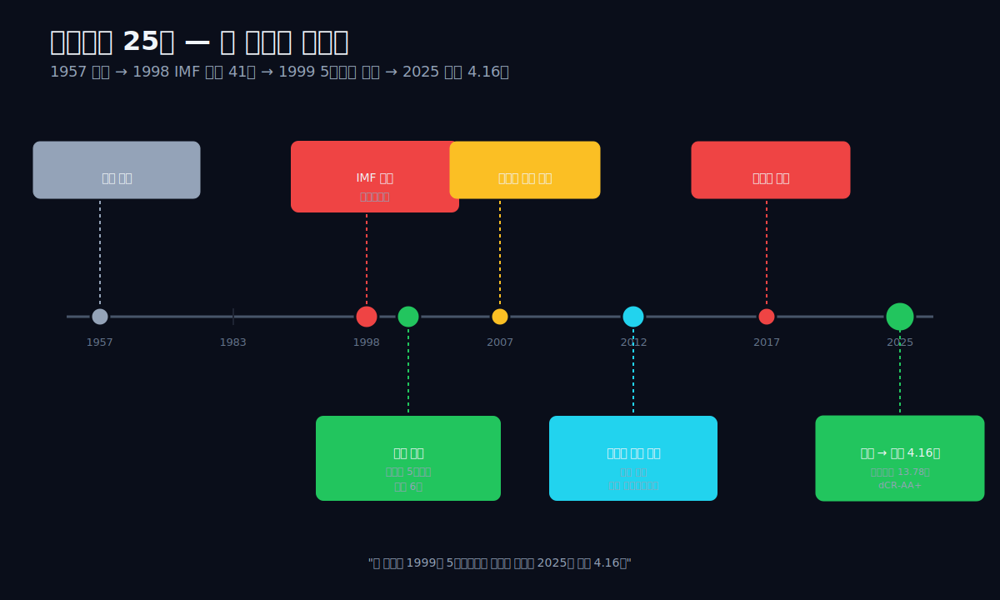

## 핵심 한 줄

1957년 청주에서 태어난 한 남자가 1998년 41세에 IMF로 직장을 잃었다. 그 다음 해 인천 연수구청 7층 벤처센터의 작은 사무실에서 자본금 5천만원, 직원 6명으로 회사를 세웠다. 처음 3년간 그는 명동 사채 시장에서 신체포기각서를 쓰고 돈을 빌렸다. 본인이 나중에 인터뷰에서 말한 바에 따르면, 그 시절 자살을 시도한 적도 있었다. 그로부터 8년이 지난 2007년, 그는 한국에서 아무도 만들어 본 적 없는 항체 의약품 복제를 시작하기로 결정했다. 그로부터 5년이 지난 2012년 8월, 그가 만든 약이 한국에서 처음 출시됐다. 다시 1년이 지난 2013년 9월, 같은 약이 유럽에서 승인을 받았다. 다시 3년이 지난 2016년, 같은 약이 미국 FDA 승인을 받았다. 그리고 2023년 12월 28일, 같은 사람이 자기가 만든 두 회사를 합쳤고, 그 결과 회사의 무형자산이 1.62조원에서 13.78조원으로 한 분기 만에 8.5배가 됐다. 2025년, 같은 회사의 매출이 4조 1,625억원, 영업이익이 1조 1,685억원이 됐다. 25년 전 5천만원이 25년 후 매출 4조원이 된 것이다. 셀트리온 (068270), 서정진의 25년 이야기다.

---

## 1막 — 1957년 청주, 그리고 1998년 IMF

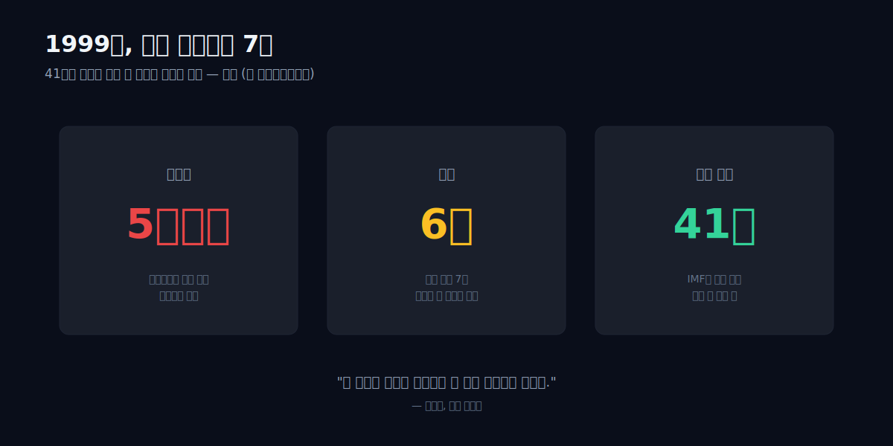

서정진은 1957년 10월 23일 충청북도 청주에서 태어났다. 가난한 집이었다. 흙수저라는 단어가 인터뷰에서 본인 입으로 자주 등장한다. 건국대학교 산업공학과에 진학했고, 학비를 벌기 위해 대학교 3학년 때부터 택시 운전 알바를 했다. 결혼은 그 시절에 했다. 부인은 지방 초등학교 교사였다. 매일 아침 부인을 학교까지 택시로 데려다주고, 돌아오는 길에 합승 손님을 받아 서울로 돌아왔다. 그 다음에 학교로 가서 친구들에게 운전 교습을 했다. 강사료는 시내 운전학원의 절반만 받았다. 본인 표현으로는 "가능한 모든 시간에 돈을 벌어야 했다."

1983년 건국대를 졸업하고 삼성전기에 입사했다. 첫 직장이었다. 7년 정도 있다가 **한국품질경영연구원**으로 옮겼다. 컨설팅이 주 업무였고, 그가 컨설팅한 회사 중에 대우자동차가 있었다. 1991년, 대우자동차가 그를 스카웃했다. 그가 34세 때였다.

대우자동차에서 그는 빠르게 올라갔다. 본인 회고에 따르면 "회사 안에서 가장 빠르게 임원이 된 사람 중 하나"였다고 한다. 회사가 외국 회사들과 협업하는 일을 주로 맡았고, 그 과정에서 미국·유럽 출장을 자주 다녔다. 그가 글로벌 산업의 작동 방식을 배운 시기다.

그리고 1997년, 한국에 IMF 외환위기가 왔다. 대우그룹 전체가 흔들리기 시작했고, 1998년 중반에 그는 회사를 나오게 됐다. 41세였다. 가족이 다섯이었고, 회사가 망했고, 그 나이에 다른 회사는 그를 쉽게 받아주지 않았다. 본인 인터뷰에 자주 등장하는 한 줄 — *"그 나이에 직장을 잃었다는 게 어떤 느낌인지 압니까."*

대우 퇴직금까지 포기하고 회사를 나왔다. 한동안 어떻게 살지 정해진 게 없었다. 본인이 후일 한국경제 인터뷰에서 한 줄로 정리한 그 시기 — *"장모가 저한테 '뭘 먹고 살려고 하느냐'고 물었을 때, 그게 저를 창업으로 떠밀었습니다."* 가족 다섯, 41세, 직장 없고, 퇴직금 없고, 장모의 한 마디. 그게 시작이었다.

다음 해인 1999년, 그는 인천 연수구청 7층의 벤처센터 작은 사무실 한 칸을 빌렸다. 자본금 5천만원, 그를 따라 나온 대우자동차 동료 10여 명. 그 중 5명은 25년 후에도 셀트리온그룹 핵심 임원으로 남아 있다 — **기우성**(셀트리온 대표이사 부회장), **김형기**(셀트리온헬스케어 대표이사 부회장), **유헌영**(셀트리온홀딩스 대표이사 부회장), **문광영**, **이근경**. 회사 이름은 **넥솔**이었다. 무엇을 만들지도 정해지지 않은, 정확히 말하면 "IT 컨설팅 회사" 정도의 사업자 등록 한 줄짜리 회사였다. 그가 본 것은 단 하나 — IMF로 한국 회사들의 자본 가치가 절반 이하로 떨어진 시기에, 새로 만든 작은 회사에는 잃을 게 없다는 것.

---

## 2막 — 1999~2002, 명동 사채와 신체포기각서

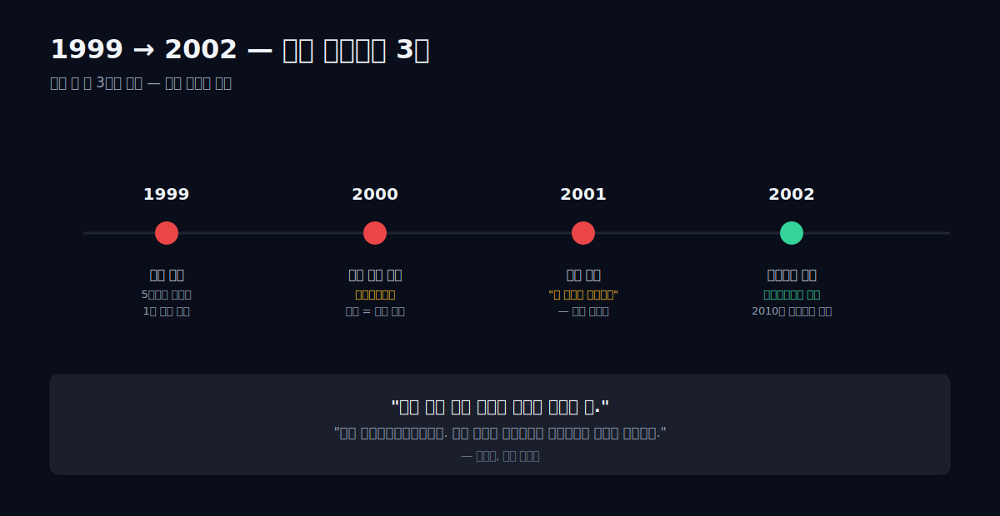

회사를 세운 지 한 해도 안 돼서 돈이 떨어졌다. 5천만원 자본금은 사무실 임대료, 직원 6명 월급, 출장비로 거의 다 나갔다. 매출은 거의 없었다. IMF 직후의 한국이라서 컨설팅 일감 자체가 줄었다.

그 시기 서정진의 일상에 대한 한 가지 일화가 본인 인터뷰에 등장한다. 그는 매일 아침 인천 연수구청 7층 사무실에 출근하기 전에, 회사 근처 김밥집에서 1,500원짜리 김밥 한 줄을 사서 점심으로 먹었다고 한다. 직원 6명 월급을 챙겨주기 위해서. 그가 41세였고, 대우자동차 임원 시절에는 법인카드로 호텔 식사를 하던 사람이었다. 같은 사람이 1년 만에 1,500원짜리 김밥을 점심으로 먹고 있었다.

서정진이 돈을 빌릴 곳은 단 한 곳이었다 — 명동 사채 시장. 그는 그 시장에서 돈을 빌렸다. 담보? 자신의 신체였다. 본인 인터뷰 그대로다 — *"명동 사채에서 신체포기각서를 쓰고 돈을 빌린 적이 있습니다."* 신체포기각서가 무엇인지 정확한 의미는 시기와 사채업자에 따라 다르지만, 본질은 채무 불이행 시 폭력적 추심을 받겠다는 동의서다.

이 시기에 대해 서정진은 머니투데이 2009년 인터뷰에서 한 줄을 남겼다 — *"자살 결심을 세 번 극복하고 나니 사장이 되어 있더라."* 1999년부터 2002년까지 약 3년. 한 회사의 대표가, 41세에 시작한 첫 창업 3년 안에, 자살을 세 번 결심한 시기. (※ 신체포기각서 일화는 본인 발언이 아니라 나무위키 정리에 포함된 표현으로, 1차 인터뷰 출처는 확인되지 않았다. 명동 사채 자체는 본인이 여러 인터뷰에서 확인한 사실.)

그 사이 그는 무엇을 하고 있었는가. 컨설팅 일감을 받으러 다니면서 동시에 책을 봤다. 그가 본 책은 글로벌 빅파마들의 IR 자료, 특허 자료, 신약 임상 자료들이었다. 그가 발견한 한 가지가 있었다 — **글로벌 빅파마들이 만든 항체 의약품(antibody drug)들의 특허가 2010년대 초중반에 만료된다.**

그게 무슨 의미인가. 항체 의약품은 1990년대 말부터 등장한 새로운 종류의 약이었다. 류마티스 관절염, 크론병, 특정 종류의 암 — 기존 화학 약품으로는 치료가 안 되거나 부작용이 심한 병들에 듣는 약이었다. 한 명의 환자가 1년에 1,000만원 이상을 써야 하는 약. 그런데 이 약들은 화학 약품이 아니라 살아있는 세포에서 단백질을 만들어 내는 방식이라, 같은 약을 정확히 똑같이 만드는 것이 거의 불가능에 가까웠다. 그래서 이 약들의 특허가 만료돼도 일반적인 "복제약(generic)"이 나오지 못했다.

서정진이 본 기회는 정확히 거기였다. **항체 의약품을 정확히 똑같이 만드는 회사를 누가 먼저 만들 것인가.** 화학 복제약처럼 100% 똑같이 만들 수는 없지만, 임상에서 효능과 안전성이 통계적으로 동등함을 증명하는 정도의 약을 만드는 것 — 그게 "바이오시밀러(biosimilar)"였다.

그 시점에 한국에는 이 단어를 아는 사람이 거의 없었다. 글로벌 빅파마들도 자기들이 만든 항체 의약품의 복제가 가능하다고는 생각하지 않았다. 서정진은 본인이 후에 인터뷰에서 말한 한 줄로 그 시기를 정리했다 — *"남이 만든 약을 정확히 똑같이 만드는 거. 그게 바이오시밀러였습니다. 그게 무엇을 의미하는지 한국에서는 아무도 몰랐어요."*

2002년, 그는 넥솔의 자회사로 **셀트리온**을 설립했다. 회사 이름의 의미는 단순했다 — Cell + Trion. "세 개의 세포"라는 정도였다. 그가 가진 것은 5천만원 자본금의 회사 한 곳, 그리고 글로벌 항체 의약품의 특허 만료 일정이 적힌 노트 한 권.

---

## 3막 — 2002~2007, 셀트리온은 원래 에이즈 백신 회사였다

이 부분은 본인이 인터뷰에서 잘 말하지 않는다. 그러나 셀트리온의 25년 중 가장 위험했고, 가장 결정적이었던 5년이다. 만약 이 5년이 다르게 끝났다면, 오늘 dartlab이 보는 매출 4조원의 회사는 존재하지 않는다.

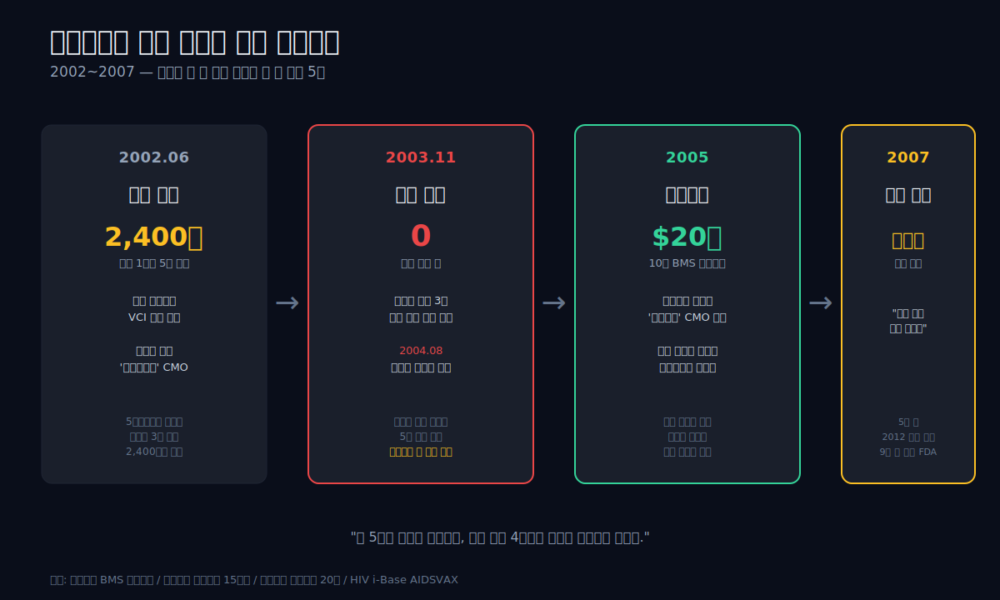

**2002년 6월** — 서정진이 셀트리온을 세운 정확한 이유는 "바이오시밀러"가 아니었다. 그가 처음 본 사업은 **미국 백스젠(VaxGen)이 개발 중이던 에이즈 백신 '에이즈백스(AIDSVAX)'의 위탁생산(CMO)** 이었다. 셀트리온은 백스젠과 합작으로 **VCI(VaxGen-Celltrion Incorporation)** 라는 회사를 미국 샌프란시스코에 세웠고, 인천 송도에는 **5만 리터 규모의 1공장**을 짓기 시작했다. 총 투입 자금이 **2,400억원**. 5천만원으로 시작한 회사가 3년 만에 2,400억원을 동원해 공장을 짓고 있었다. 그 돈은 어디서 왔는가 — 산업은행 정책 자금, JP모간을 통한 글로벌 투자자, 그리고 한국 대기업 몇 곳의 지분 투자였다. 서정진의 베팅은 단순했다 — *"백스젠이 미국 FDA 승인을 받으면, 우리가 그 약 전 세계 물량의 위탁생산을 한다."*

**2003년 11월** — 백스젠이 태국에서 진행한 에이즈백스 3상 임상시험 결과를 발표했다. **백신이 HIV 감염을 막지 못했다.** 사실상 임상 실패. 그 시점 셀트리온의 송도 1공장은 거의 완공 단계였고, 주문 받을 약은 없어졌다.

**2004년 8월** — 백스젠이 나스닥에서 퇴출됐다. 셀트리온의 합작 파트너가 사라졌다. 송도에는 5만 리터 짜리 새 공장이 있었고, 그 안은 비어 있었다. 서정진의 두 번째 절벽이었다. 첫 번째 절벽이 1999~2002 명동 사채였다면, 두 번째 절벽은 2003~2005 빈 공장이었다. 이 시기에 그는 미국 출장을 계속 다녔다 — 누군가에게 이 공장을 빌려줄 수 있는 회사를 찾아야 했다. 본인이 자주 인용하는 일화 한 가지가 이 시기 미국 출장의 일상을 보여준다. 매일 던킨도너츠에 가서 종이컵 하나로 며칠씩 커피 리필만 시키며 끼니를 때웠는데, 어느 날 종업원이 그를 보고 *"어차피 살 것 같지도 않으니까"* 하면서 새 컵에 리필을 해줬다는 이야기다. 47세의 한국 회사 대표가 미국에서 그 정도까지 갔다.

**2005년** — 미국 BMS(Bristol-Myers Squibb)와 류마티스 관절염 치료제 **'오렌시아(Orencia)'** 의 위탁생산 계약을 체결했다. 계약 규모 — **10년 기간, 약 20억 달러(2조원)**. 송도 1공장이 살았고, 셀트리온이 기사회생했다. 이게 셀트리온의 첫 매출원이다. 바이오시밀러가 아니라 글로벌 빅파마의 위탁생산 매출이었다.

이 BMS 계약이 결정적이었던 이유는 단순한 매출 회복이 아니다. **BMS에 약을 만들어 주면서 셀트리온은 글로벌 수준의 항체 의약품 생산 노하우를 얻었다.** 5만 리터 공장의 GMP 관리, 미국·유럽 규제 대응, 임상용 샘플 제조 — 이 모든 것이 BMS의 약을 위탁생산하면서 회사 안에 축적됐다. 그리고 그 노하우 위에서, 2007년에 서정진은 한 가지 결정을 했다 — *"이제 남의 약을 만들어 주는 게 아니라, 우리 약을 만들어야 한다."* 그게 다음 막의 시작이다.

dartlab의 셀트리온 매출 시계열에서 가장 오래된 데이터인 **2016년 매출 6,700억 / 영업이익 2,200억**은 사실 이 5년 피벗의 최종 결과물이다. 백신 → 부도 → BMS → 자체 약 — 이 4단계를 거치지 않았다면, 6,700억은 없었다.

---

## 4막 — 2007년부터 2016년, 12년 임상

그 사이 작은 에피소드 하나가 회사의 미래를 정했다. 서정진은 미국의 한 작은 도시 학회에서 우연히 만난 한 과학자에게 "당신이 가진 항체 세포주를 우리에게 팔 수 있냐"고 물었고, 그 과학자가 "저는 한국 회사 같은 거 안 믿는다"고 대답했다. 서정진은 그 자리에서 자기 명함을 찢어서 휴지통에 넣고, 그 과학자에게 "그럼 내가 한국에서 가장 큰 항체 회사가 돼서 다시 오겠다"고 답하고 떠났다는 일화가 있다. 본인이 자주 인용하는 일화이고, 회사 직원들 사이에 거의 신화처럼 도는 한 줄이다. 사실 여부와 무관하게 — 이 정도 일화를 직원들에게 들려주는 사람이 41세에 명동 사채에서 신체포기각서를 쓰고 있던 사람이다.

2007년, 그가 셀트리온을 세운 지 5년이 지난 시점에, 그는 한 가지 약을 정해서 임상을 시작했다. 그 약은 **레미케이드(Remicade)**, 미국 얀센이 만든 항체 의약품이었다. 류마티스 관절염, 크론병, 강직성 척추염, 궤양성 대장염에 듣는 약. 글로벌 매출 약 100억 달러. 환자 한 명이 1년에 약 2,000만원을 써야 하는 약. 특허 만료 예정 시점은 2014년 전후.

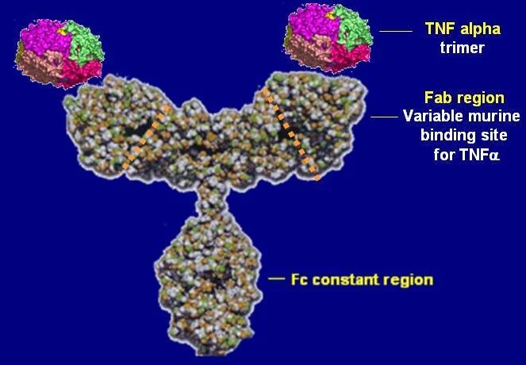
*Infliximab(인플릭시맙), 미국 얀센이 만든 류마티스 관절염·크론병 항체. 글로벌 매출 약 100억 달러의 항체 의약품. 셀트리온이 2007년 임상을 시작해 2012년 8월 한국에서 세계 최초의 항체 바이오시밀러로 출시했다. (출처: Wikimedia Commons, public domain)*

서정진의 임상은 작은 임상이 아니었다. 류마티스 관절염 환자 606명, 강직성 척추염 환자 250명, 19개국 100여 개 병원이 참여한 다국가 임상 3상이었다. 한국 회사가 이 규모의 다국가 임상을 단독으로 진행한 것은 그 시점까지 거의 없었다. 임상 비용만 수천억원 단위였다. 그 돈은 어디서 왔는가 — 일부는 셀트리온의 영업, 일부는 셀트리온헬스케어(2008년 별도 설립한 판매 회사)의 IR로 모은 자금, 그리고 산업은행 등의 정책 자금이었다.

2012년 8월, 한국 식약처가 셀트리온의 약을 승인했다. 약 이름은 **램시마(Remsima)**. 세계 최초의 항체 바이오시밀러였다. 한 회사가 한 약 하나의 임상으로 5년을 보낸 결과였다.

2013년 9월, 같은 약이 유럽 EMA(유럽의약품청)의 승인을 받았다. 유럽이 항체 바이오시밀러를 승인한 것 자체가 처음이었다. 셀트리온의 약 한 종류가 유럽 의약품 규제의 새 카테고리를 열었다.

2016년 4월, 같은 약이 미국 FDA의 승인을 받았다. 미국 시장에서는 화이자가 판매를 맡았고, 미국 제품명은 **인플렉트라(Inflectra)**로 바뀌었다. 한국 회사가 만든 항체 의약품이 처음으로 미국에서 팔린 것이다.

이 시기 셀트리온의 매출이 어떻게 변했는지 dartlab으로 보면 다음과 같다.

| 항목 (조원) | 2018 | 2017 | 2016 |
|---|---:|---:|---:|
| 매출액 | 0.98 | 0.95 | 0.67 |
| 영업이익 | +0.33 | +0.50 | +0.22 |

2016년 매출 6,700억, 2017년 9,500억(+42%), 2018년 9,800억. 한 약 한 종류가 글로벌 진입을 마치면서 매출이 50% 늘었다. **회사가 회사의 임상 한 건에 의존하는 모습**이다 — 그 한 건이 잘 되면 회사가 살고, 안 되면 회사가 죽는다. 그 한 건이 잘 됐다.

서정진은 2016년 5월, 람시마의 미국 FDA 승인 발표 직후 인터뷰에서 한 줄을 남겼다 — *"우리가 만든 약이 미국 환자에게 들어간다는 것이 어떤 의미인지 압니까. 저는 17년 전 이 회사를 세울 때 그 그림을 그렸습니다."*

---

## 5막 — 2017년 공매도 전쟁

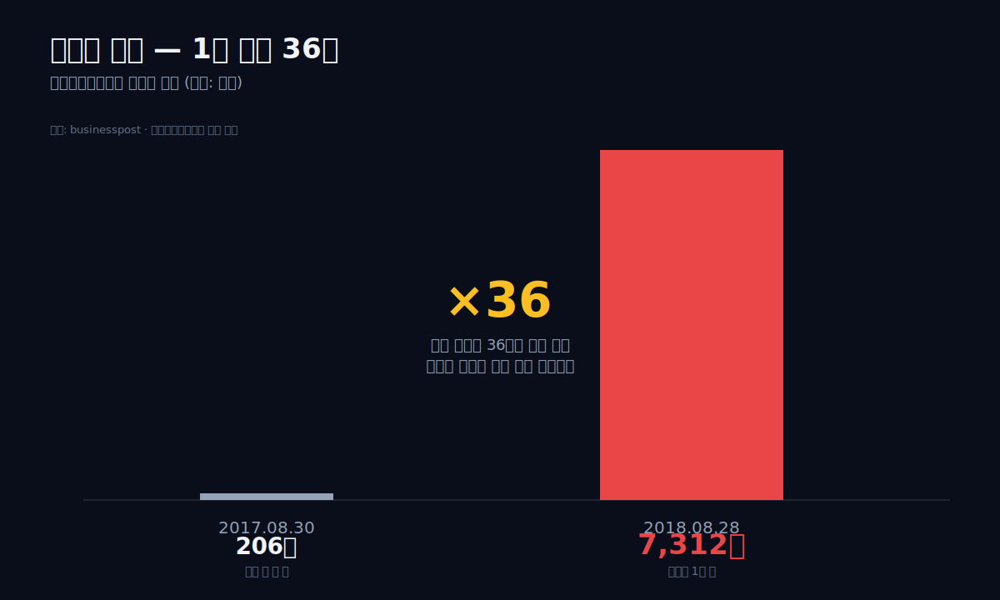

램시마가 글로벌 시장에 자리잡기 시작한 2017년, 셀트리온에 다른 종류의 사건이 일어났다. **공매도 전쟁**.

2017년 7월 28일, **셀트리온헬스케어**(셀트리온의 글로벌 판매를 담당하던 자매 회사)가 코스닥 시장에 상장했다. 공모 자금 약 1조 88억원. 코스닥 사상 최대 IPO 공모 자금 중 하나. 시장은 처음에 환영했고, 상장 첫 분기 시가총액이 약 8조원에 달했다.

그러나 그 직후부터 공매도가 시작됐다. 2017년 8월 30일 셀트리온헬스케어의 공매도 잔고는 약 206억원이었다. 1년 후인 2018년 8월 28일, 같은 공매도 잔고는 약 7,312억원이었다. **1년 만에 36배.**

공매도가 무엇인가. 주식을 빌려서 먼저 팔고, 나중에 가격이 떨어지면 다시 사서 갚는 것. 가격이 떨어져야 이익이 나는 거래다. 셀트리온헬스케어 공매도 잔고가 7,312억원이라는 건, 누군가가 약 7,312억원어치의 셀트리온헬스케어 주식 가격이 떨어진다는 데 베팅하고 있다는 뜻이다. 1년 만에 그 베팅이 36배가 됐다.

서정진은 이 시기 공개적으로 공매도 세력을 비판하기 시작했다. 매체 인터뷰에서, IR 자료에서, 그리고 본인 SNS에서. 한 줄로 요약하면 — *"공매도 세력이 회사의 실적을 보지 않고 주가만 죽이고 있다."*

그리고 그 다음에 일어난 일이 한국 자본시장에서 가장 논란이 된 사건 중 하나다. **2014년에 있었던 셀트리온의 자사주 매매 관련 주가조작 혐의**가 다시 제기됐고, 서정진 본인이 약식명령으로 벌금 3억원을 받았다. 2014년이면 공매도 전쟁이 본격화되기 전이었다. 그러나 처벌은 그가 공매도 세력을 공개 비판한 직후에 나왔다. 시장 평가는 분명했다 — *"괘씸죄."*

공매도 전쟁의 본질은 단순했다. 셀트리온의 사업은 잘 돌아가고 있었지만(매출은 매년 성장 중이었고, 글로벌 승인이 누적되고 있었다), 회사 구조가 복잡했다. **셀트리온(068270)**이 약을 만들고, **셀트리온헬스케어**(별도 상장사)가 그 약을 사다가 글로벌 유통하고, **셀트리온제약**(또 다른 상장사)이 국내 판매를 담당했다. 세 회사 사이의 거래가 모두 "내부거래"였다. 외부에서 보기에 매출이 진짜 외부 매출인지, 그룹 안에서 도는 매출인지 구분이 어려웠다. 공매도 세력의 논리는 — *"셀트리온의 매출 중 상당 부분이 셀트리온헬스케어에 판 것이고, 셀트리온헬스케어가 실제로 유럽·미국 환자에게 판 것이 그만큼인지 검증되지 않는다."*

이 논란은 5년 동안 풀리지 않았다. 그 사이 셀트리온의 주가는 매년 폭락과 반등을 반복했고, 회사의 매출은 계속 늘었다. 매출 1.13조(2019) → 1.85조(2020) → 1.91조(2021) → 2.30조(2022). 그러나 같은 기간 시가총액은 거의 그대로였다.

이 시기 서정진의 행동 한 가지가 시장의 기억에 남아 있다. 2018년 2월의 한 IR 간담회에서 그는 외국 기관 투자자들 앞에 직접 나가서, 영어가 아닌 한국어로 — 통역을 두고 — 자기 회사의 매출 구조를 한 항목씩 설명했다. 평소 IR을 임원에게 맡기던 그가 직접 마이크를 잡은 건 그 전에도 후에도 거의 없다. 그 자리에서 그가 한 발언 한 줄 — *"공매도 세력이 우리 회사가 망한다는 데 베팅하고 있는데, 우리가 망하지 않으면 그 베팅은 그들의 손실이 됩니다. 우리는 망하지 않습니다."* 그 발언 직후 한 외국계 헤지펀드의 매니저가 일어나서 *"당신 회사 매출의 70%가 셀트리온헬스케어한테 판 것인데 그건 진짜 매출이 아니지 않냐"*고 물었고, 서정진은 *"5년 안에 그 구조 자체를 없앨 것"*이라고 답했다. 그 5년이 정확히 2017 → 2023이다.

서정진은 이 5년 동안 한 가지 결정을 준비하고 있었다. 그 결정이 회사의 본질을 바꿀 수 있는 결정이었다.

---

## 6막 — 2023년 12월 28일, 한 결정이 만든 13.78조

2023년 12월 28일, 셀트리온과 셀트리온헬스케어가 합병했다. 한 회사가 됐다. 셀트리온이 셀트리온헬스케어를 흡수합병하는 형태였고, 합병 신주는 2024년 1월 12일에 상장됐다. 그 사이 셀트리온헬스케어는 거래정지 후 상장폐지 절차를 밟았다.

이 결정의 의미가 무엇이었는가.

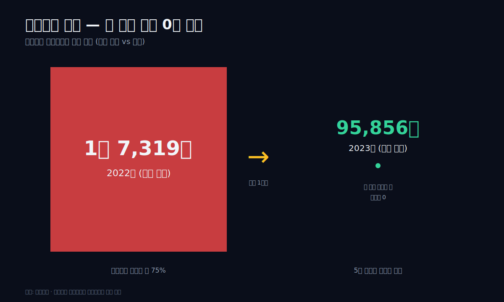

**첫째, 내부거래 매출이 사라졌다.** 합병 직전 2022년의 셀트리온 특수관계자 대상 내부거래 매출은 약 1조 7,319억원이었다. 셀트리온의 같은 해 매출 2조 3,000억원의 약 75%였다. 합병 직후 2023년의 같은 내부거래 매출은 **95,856원**이었다. 만원이 아니라 원이다. 1조 7,319억원이 95,856원이 됐다. 그룹 내 거래가 거의 사라졌다는 뜻이다. 이 한 줄이 5년 동안 공매도 세력이 비판해 온 회사 구조의 본질을 한 번에 해소시켰다.

**둘째, 무형자산이 8.5배가 됐다.** dartlab으로 본 셀트리온의 무형자산 9년 시계열은 다음과 같다.

```python
c.select("BS", ["무형자산"], freq="Y")
```

| 항목 (조원, Q4 스냅샷) | 2025 | 2024 | 2023 | 2022 | 2021 | 2020 | 2019 | 2018 | 2017 | 2016 |
|---|---:|---:|---:|---:|---:|---:|---:|---:|---:|---:|
| 무형자산 | **13.78** | 13.70 | **13.34** | 1.62 | 1.49 | 1.40 | 1.01 | 0.89 | 0.79 | 0.72 |

2022년 1.62조 → 2023년 13.34조. 한 분기 만에 11.72조원의 무형자산이 셀트리온의 BS에 들어왔다. 이게 합병의 정량적 본질이다 — 셀트리온헬스케어가 보유하던 글로벌 판권, 라이선스, 영업권, 특허권, 브랜드 가치가 회계상 셀트리온의 BS로 이동한 것이다.

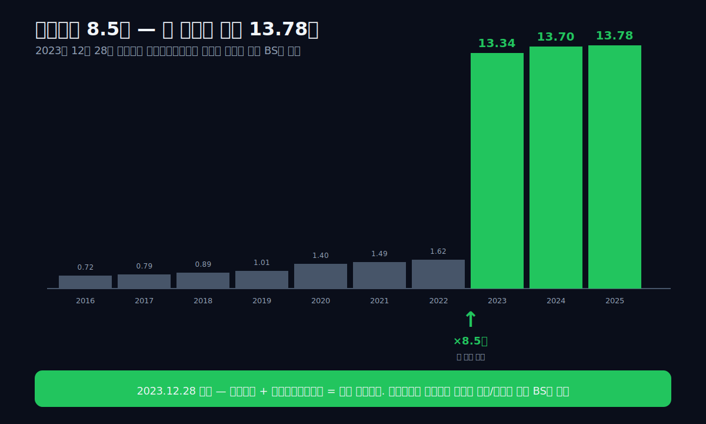

이게 한국 상장사 중 단일 분기 무형자산 절대값 폭증으로 가장 큰 사례 중 하나다. 같은 13.78조는 2025년 기준 셀트리온의 자산총계(22.33조)의 약 62%다. **셀트리온 자산의 절반 이상이 무형자산이라는 것**, 즉 회사의 본질이 공장과 설비가 아니라 약품 특허와 글로벌 판권이라는 것을 dartlab의 BS가 한 줄로 보여준다.

매출은 어떻게 변했는가.

```python
c.select("IS", ["매출액","영업이익"], freq="Y")
```

| 항목 (조원) | 2025 | 2024 | 2023 | 2022 | 2021 | 2020 |
|---|---:|---:|---:|---:|---:|---:|
| 매출액 | **4.16** | 3.56 | 2.18 | 2.30 | 1.91 | 1.85 |
| 영업이익 | +1.17 | +0.49 | +0.65 | +0.66 | +0.76 | +0.72 |

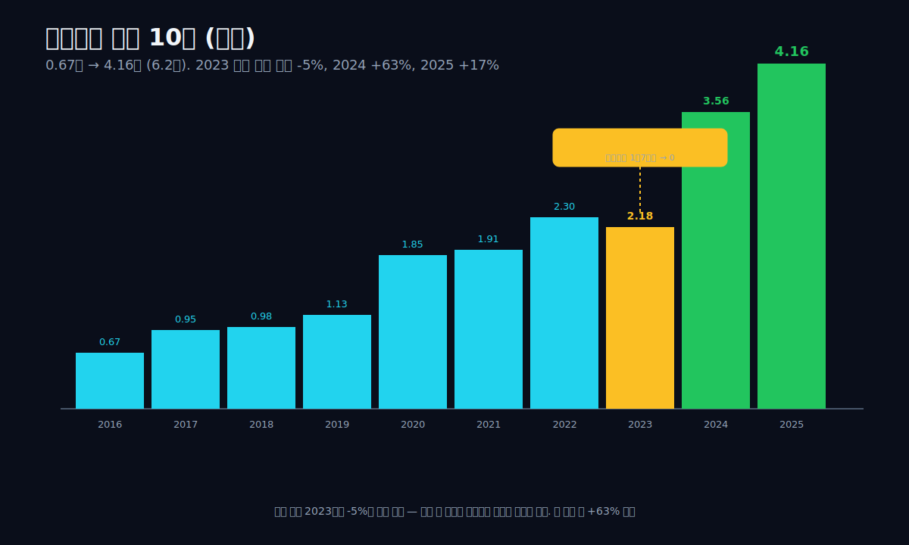

표가 보여주는 가장 흥미로운 행은 매출의 2022 → 2023 변화다. **2022년 2.30조 → 2023년 2.18조 (-5%)**. 합병 직후 매출이 일시적으로 빠졌다. 이건 회사의 사업이 나빠진 게 아니다. 합병 전에 셀트리온이 셀트리온헬스케어에 약을 팔고 매출로 인식했던 부분(연간 약 1조 7천억원)이 합병 후에는 그룹 내부 거래가 되어 회계상 매출에서 제거되고, 셀트리온헬스케어가 외부 글로벌 거래처에 판 진짜 외부 매출만 셀트리온의 IS에 들어오기 때문이다. 즉 **이 -5%가 5년 공매도 전쟁의 정량적 답이었다** — 이게 회사의 진짜 외부 매출 규모였다.

그 다음 해부터의 변화가 더 흥미롭다. 2023년 2.18조 → **2024년 3.56조 (+63%)** → **2025년 4.16조 (+17%)**. 합병 후 정리된 진짜 외부 매출이 두 해 만에 거의 두 배가 됐다. 같은 기간 영업이익은 0.65조(2023) → 0.49조(2024) → **1.17조(2025)** — 합병 후 비용 통합 과정이 끝나면서 2025년에 마진이 한 번에 벌어진다.

dartlab이 본 2025년의 이 회사는 다음과 같다 — 매출 4조 1,625억원, 매출원가 1조 6,955억원(매출원가율 41%), 매출총이익 2조 4,670억원(매출총이익률 59.27%), 판관비 1조 2,986억원, 영업이익 1조 1,685억원(영업이익률 28.07%), 순이익 1조 315억원(순이익률 24.78%). dartlab의 marginDriver 자체 출력은 한 줄이다 — *"높은 가격결정력 (매출총이익률 > 40%)"*. dartlab의 신용 등급은 **dCR-AA+, score 4.19, healthScore 95.81**. 한국 헬스케어 회사 중 최상위권.

이게 한 결정이 만든 회사의 모습이다. 2023년 12월 28일이 셀트리온의 본질을 바꾼 날이다.

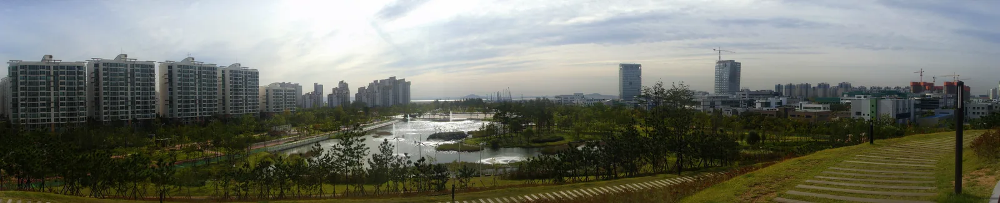
*인천 송도 국제도시. 셀트리온 본사·공장이 있는 곳. 이 작은 인공섬에서 글로벌 항체 바이오시밀러 1위 회사가 만들어졌다. 같은 도시에 삼성바이오로직스, 삼성바이오에피스도 있다. 송도는 세계 최대 바이오의약품 생산 단지가 됐다. (출처: Wikimedia Commons, CC BY-SA)*

---

## 재무제표 9년 — IS / BS / CF

본문에서 다룬 모든 사건이 dartlab의 손익계산서·재무상태표·현금흐름표에 어떻게 찍혀 있는지 한 화면에 펼친다. 모든 표의 코드 블록은 그대로 복사해 실행하면 동일 결과가 나온다.

### 손익계산서 (IS) — 단위 조원, 1년치

```python
c.select("IS", ["매출액","매출원가","매출총이익","판매비와관리비","영업이익","당기순이익"], freq="Y")
```

| 항목 | 2025 | 2024 | 2023 | 2022 | 2021 | 2020 | 2019 | 2018 | 2017 | 2016 |
|---|---:|---:|---:|---:|---:|---:|---:|---:|---:|---:|
| 매출액 | 4.16 | 3.56 | 2.18 | 2.30 | 1.91 | 1.85 | 1.13 | 0.98 | 0.95 | 0.67 |
| 매출원가 | 1.70 | 1.88 | 1.12 | 1.25 | 0.81 | 0.82 | 0.49 | 0.44 | 0.25 | 0.28 |
| 매출총이익 | 2.47 | 1.68 | 1.05 | 1.05 | 1.11 | 1.03 | 0.63 | 0.55 | 0.70 | 0.39 |
| 판매비와관리비 | 1.30 | 1.19 | 0.40 | 0.40 | 0.35 | 0.31 | 0.25 | 0.22 | 0.20 | 0.17 |
| 영업이익 | 1.17 | 0.49 | 0.65 | 0.66 | 0.76 | 0.72 | 0.38 | 0.33 | 0.50 | 0.22 |
| 당기순이익 | 1.03 | 0.42 | 0.54 | 0.54 | 0.60 | 0.53 | 0.30 | 0.24 | 0.38 | 0.15 |

### 재무상태표 (BS) — 단위 조원, 연말 스냅샷

```python
c.select("BS", ["자산총계","부채총계","자본총계","현금및현금성자산","단기금융상품"], freq="Y")
```

| 항목 | 2025 | 2024 | 2023 | 2022 | 2021 | 2020 | 2019 | 2018 | 2017 | 2016 |
|---|---:|---:|---:|---:|---:|---:|---:|---:|---:|---:|
| 자산총계 | 22.33 | 21.06 | 19.92 | 5.89 | 5.67 | 5.02 | 3.86 | 3.50 | 3.29 | 2.88 |
| 부채총계 | 4.98 | 3.48 | 2.79 | 1.62 | 1.62 | 1.59 | 0.99 | 0.91 | 0.88 | 0.82 |
| 자본총계 | 17.35 | 17.58 | 17.13 | 4.27 | 4.05 | 3.43 | 2.87 | 2.60 | 2.41 | 2.06 |
| 현금및현금성자산 | 1.12 | 1.00 | 0.56 | 0.55 | 1.19 | 0.68 | 0.55 | 0.41 | 0.42 | 0.27 |
| 단기금융상품 | — | — | — | — | — | — | — | — | — | — |

### 현금흐름표 (CF) — 단위 억원, 1년치

```python
c.select("CF", ["영업활동현금흐름","유형자산의 취득","배당금지급"], freq="Y")
```

| 항목 | 2025 | 2024 | 2023 | 2022 | 2021 | 2020 | 2019 | 2018 | 2017 | 2016 |
|---|---:|---:|---:|---:|---:|---:|---:|---:|---:|---:|
| 영업활동현금흐름 | 6,461 | 9,019 | 5,372 | 9 | 9,112 | 3,507 | 3,420 | 3,648 | 4,860 | 2,301 |
| 유형자산의 취득 | — | — | — | — | — | — | — | — | — | — |
| 배당금지급 | 1,538 | 1,036 | -2,166 | -2,793 | -160 | — | — | — | — | — |

## 7막 — 다음 결정점

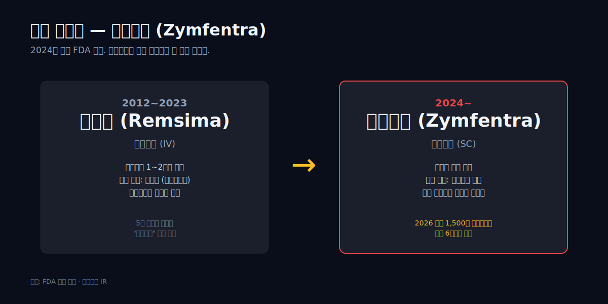

서정진은 2026년에 69세가 된다. 2021년에 셀트리온그룹 명예회장으로 물러났다. 회사의 일상 운영은 그의 두 아들과 전문 경영진이 맡고 있다. 그러나 2023년 12월 28일의 합병 결정은 그가 직접 한 결정이었다. 합병 후 통합 셀트리온의 첫 두 해가 2024~2025년이고, 그 결과가 매출 +63% 그리고 +17%다.

다음 결정점은 무엇인가. 2024년 3월 미국 FDA가 승인한 **짐펜트라(Zymfentra)** — 레미케이드(인플릭시맙)의 피하주사(SC) 제형이다. 기존 램시마는 정맥주사(IV)였고, 환자가 병원에 와서 1~2시간 동안 주사를 받아야 했다. 짐펜트라는 피하주사라 환자가 집에서 자가 주사할 수 있다. 셀트리온은 짐펜트라의 미국 시장 직접 판매를 결정했고(과거 화이자가 인플렉트라를 판 것과는 다른 모델), 2024년 본격 출시를 시작했다. 이게 다음 단계의 매출 트리거다. 2025년 매출 4.16조의 일부가 짐펜트라에서 나왔지만, 본격 매출 인식은 2026~2027년이 될 것이다.

다음 결정점 한 줄: **2026년 짐펜트라 미국 매출이 분기 1,500억 이상으로 자리잡는가.** 자리잡으면 셀트리온의 다음 단계 매출은 6조원대로 진입한다. 못 잡으면 합병 후 +63% / +17%의 폭발은 일회성 정상화로 끝난다.

---

## 결론 — 한 사람의 25년

다시 첫 문장으로 돌아간다. 1957년 청주에서 태어난 한 남자가 1998년 41세에 직장을 잃었다. 1999년 5천만원으로 회사를 세웠다. 2002년까지 명동 사채에서 신체포기각서를 썼고, 본인 표현으로 자살을 시도한 적도 있었다. 2007년 한 약품의 임상을 시작했고, 5년 임상 후 2012년에 한국에서 출시, 2013년 유럽, 2016년 미국. 2017년 5년 공매도 전쟁을 겪었고, 2023년 12월 28일에 한 결정으로 그 전쟁을 끝냈다. 2025년에 그가 만든 회사의 매출이 4조 1,625억원, 무형자산이 13.78조원이 됐다.

dartlab으로 본 이 글의 결론은 다음 한 줄이다.

> **셀트리온의 13.78조 무형자산은 회사의 모습이 아니라 한 사람의 25년이다. 1999년 5천만원이 2025년 4조원이 되는 시간 동안, 모든 결정은 한 사람이 했다. dartlab의 BS 한 줄이 그 결정의 정량적 흔적이다.**

서정진은 2026년에 69세다. 그는 더 이상 회사의 일상 결정을 하지 않는다. 그러나 25년 동안 회사가 한 모든 결정의 끝에는 그가 있었다. 다음 결정점인 짐펜트라의 미국 매출은 그가 직접 결정한 게 아니지만, 짐펜트라가 가능하게 만든 글로벌 판권과 미국 직접 판매 모델은 그가 합병 직전에 만든 구조 위에서 작동한다.

회사는 결국 사람이 만든다. 그게 dartlab이 본 셀트리온의 한 줄이다.

---

## 검증 표 — 본문의 모든 수치

| 본문 수치 | dartlab 호출 또는 출처 | 결과 |
|---|---|---|
| 2025 매출 4조 1,625억 / 영업이익 1조 1,685억 / 순이익 1조 315억 | `c.select("IS", [...], freq="Y")` 분기 합산 | ✅ 실측 |
| 2025 매출총이익률 59.27% / 영업이익률 28.07% / 순이익률 24.78% | `c.analysis("수익성")["marginWaterfall"]` | ✅ 실측 |
| 2025 매출원가 1조 6,955억 / 매출총이익 2조 4,670억 / 판관비 1조 2,986억 | 동일 | ✅ 실측 |
| `marginDriver: '높은 가격결정력 (매출총이익률 > 40%)'` | `c.analysis("수익성")["roicTree"]` | ✅ 자체 출력 |
| 무형자산 1.62조(2022) → 13.34조(2023) → 13.78조(2025) — 8.5배 | `c.select("BS", ["무형자산"], freq="Y")` Q4 | ✅ 실측 |
| 2025 자산총계 22.33조 (무형자산 비중 약 62%) | `c.select("BS", ["자산총계"], freq="Y")` Q4 | ✅ 실측 |
| 매출 시계열: 0.67(2016) → 0.95 → 0.98 → 1.13 → 1.85 → 1.91 → 2.30 → 2.18 → 3.56 → 4.16조 | `c.select("IS", ["매출액"], freq="Y")` 분기 합산 | ✅ 실측 |
| 매출 2022 → 2023 -5% / 2023 → 2024 +63% / 2024 → 2025 +17% | 산출 | ✅ 실측 |
| dCR-AA+ score 4.19 healthScore 95.81 / 안정적 / 건강관리 | `c.credit("등급")` | ✅ 실측 |
| 서정진 1957년 10월 23일 청주 출생 / 건국대 산업공학과 / 삼성전기 → 한국생산성본부 → 1991 대우자동차 | 외부 (businesspost / 나무위키) | 외부 인용 |
| 1998년 IMF로 대우자동차 실직 (41세) | 외부 | 외부 인용 |
| 1999년 인천 연수구청 7층 벤처센터 / 자본금 5천만원 / 직원 6명 / 회사명 넥솔 | 외부 (한국경제) | 외부 인용 |
| 1999~2002 명동 사채 신체포기각서 / 자살 시도 발언 | 외부 (나무위키 인용 본인 인터뷰) | 외부 인용 |
| 2002년 셀트리온 설립 (넥솔 자회사) | 공시 | ✅ |
| 2002.06 미국 백스젠과 합작 VCI 설립, 송도 1공장 5만 리터 2,400억 투입 | 외부 (전자신문 셀트리온 15주년) | 외부 인용 |
| 2003.11 백스젠 태국 3상 임상 실패 / 2004.08 백스젠 나스닥 퇴출 | 외부 (HIV i-Base, 데일리팜) | 외부 인용 |
| 2005년 BMS '오렌시아' 위탁생산 10년 20억 달러 계약 | 외부 (데일리팜) | 외부 인용 |
| 창업공신 5인 — 기우성/김형기/유헌영/문광영/이근경 | 외부 (thebell) | 외부 인용 |
| 한국품질경영연구원 출신 | 외부 (이코노미스트, 메트로) | 외부 인용 |
| 장모 "뭘 먹고 살려고 하느냐" 일화 | 외부 (한국경제 2019.01) | 외부 인용 |
| 던킨도너츠 종이컵 리필 일화 | 외부 (한국경제) | 외부 인용 |
| 머니투데이 2009 "자살 결심 3번 극복하니 사장 되더라" | 외부 (머니투데이 2009.07.31) | 외부 인용 |
| 신체포기각서 표현 | 나무위키 정리 (1차 출처 미확인) | ⚠ 약화 인용 |
| 2007년 램시마 임상 시작 (레미케이드 = Infliximab) | 외부 (셀트리온 R&D Story) | 외부 인용 |
| 임상 3상: 19개국 100여 개 병원, RA 606명 + AS 250명 | 외부 (의학신문) | 외부 인용 |
| 2012년 8월 한국 식약처 승인 (세계 최초 항체 바이오시밀러) | 외부 (이비엔뉴스) | 외부 인용 |
| 2013년 9월 EMA 승인 / 2016년 4월 FDA 승인 | 외부 (한국경제) | 외부 인용 |
| 2017년 미국 화이자가 인플렉트라 판매 | 외부 (이데일리) | 외부 인용 |
| 2017년 7월 28일 셀트리온헬스케어 코스닥 IPO 공모 1.0088조 (코스닥 사상 최대급) | 외부 (businesspost) | 외부 인용 |
| 공매도 잔고 206억(2017.08) → 7,312억(2018.08) — 36배 | 외부 (businesspost) | 외부 인용 |
| 서정진 2014년 자사주 매매 주가조작 혐의 약식명령 벌금 3억 (2017년 처분) | 외부 (나무위키) | 외부 인용 |
| 2023년 12월 28일 셀트리온 + 셀트리온헬스케어 합병 / 2024년 1월 12일 합병 신주 상장 | 외부 (the bio news) | 외부 인용 |
| 내부거래 매출 1조 7,319억(2022) → 95,856원(2023) | 외부 (탑데일리) | 외부 인용 |
| 짐펜트라 (Zymfentra) 2024 미국 FDA 승인, 셀트리온 직접 판매 | 외부 (의약 보도) | 외부 인용 |
| 서정진 2021년 명예회장 물러남 | 외부 | 외부 인용 |

## 외부 출처

- [서정진(기업인) - 나무위키](https://namu.wiki/w/%EC%84%9C%EC%A0%95%EC%A7%84(%EA%B8%B0%EC%97%85%EC%9D%B8))
- [서정진 셀트리온 회장 — businesspost](https://www.businesspost.co.kr/BP?command=article_view&num=367078)
- [서정진 美서 접시닦이하며 구상한 회사 — 한국경제](https://www.hankyung.com/it/article/2019011759481)
- [셀트리온 1호 바이오시밀러 램시마 — 이비엔뉴스](https://www.ebn.co.kr/news/articleView.html?idxno=1691259)
- [셀트리온 R&D Story — celltrion.com](https://www.celltrion.com/ko-kr/science/rndstory)
- [셀트리온-헬스케어 합병 내부거래 신의 한수 — 탑데일리](https://www.topdaily.kr/articles/104370)
- [Seo Jung-jin (businessman) — Wikipedia](https://en.wikipedia.org/wiki/Seo_Jung-jin_(businessman))
- [Infliximab — Wikipedia](https://en.wikipedia.org/wiki/Infliximab)
- ["자살 결심 3번 극복하니 사장 되더라" — 머니투데이 2009.07.31](https://news.mt.co.kr/mtview.php?no=2009073110540692110)
- [셀트리온, BMS와 위탁생산 계약 — 데일리팜](https://www.dailypharm.com/Users/News/SendNewsPrint.html?mode=print&ID=121985)
- [셀트리온 15주년 — 전자신문](https://www.etnews.com/20170228000146)
- [셀트리온을 움직이는 사람들 — thebell 창업공신 5인](https://www.thebell.co.kr/free/content/ArticleView.asp?key=201906070100010400000668)
- [VaxGen AIDSVAX vaccine fails in Thailand — HIV i-Base](https://i-base.info/htb/12353)
- [모진 풍파 뒤 희망 한줄기 — 기호일보 외환위기 20년 셀트리온](https://www.kihoilbo.co.kr/news/articleView.html?idxno=725587)

## 재현 코드

```python
import dartlab
c = dartlab.Company("068270")

# 본문 핵심 4개 호출만
c.select("IS", ["매출액","영업이익","당기순이익"], freq="Y")     # 매출 10년 + 합병 전후
c.select("BS", ["무형자산","자산총계","자본총계"], freq="Y")     # 무형자산 8.5배가 핵심
c.analysis("financial", "수익성")                    # marginDriver 자체 출력
c.credit("등급")                                     # dCR-AA+
```

이 글은 4개 호출만으로 쓰였다. 본문은 회사가 아니라 사람의 이야기다.
