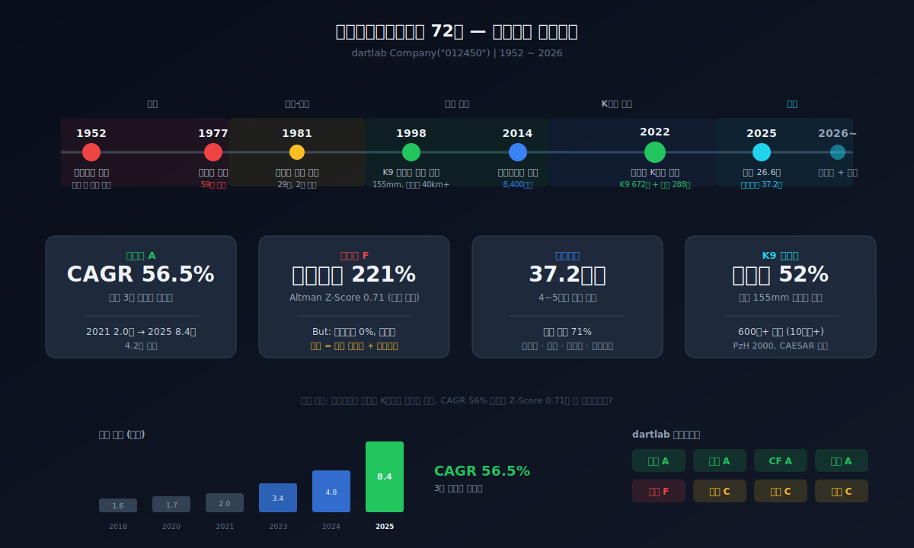
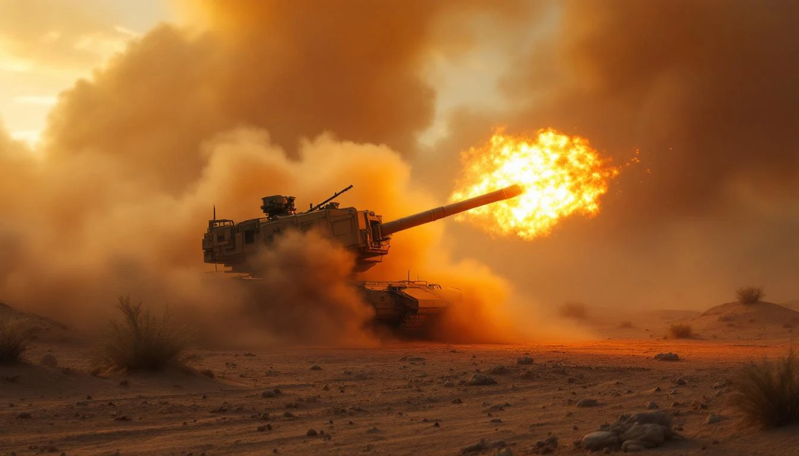
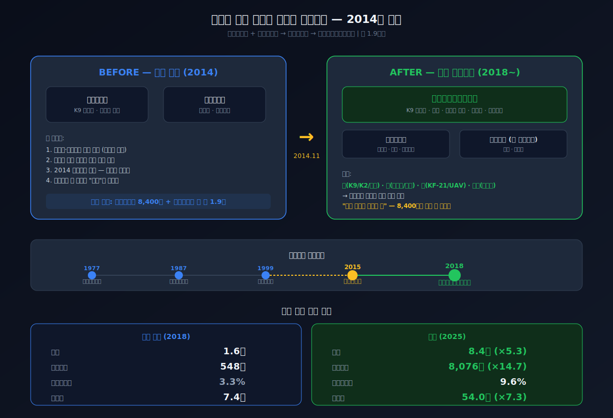
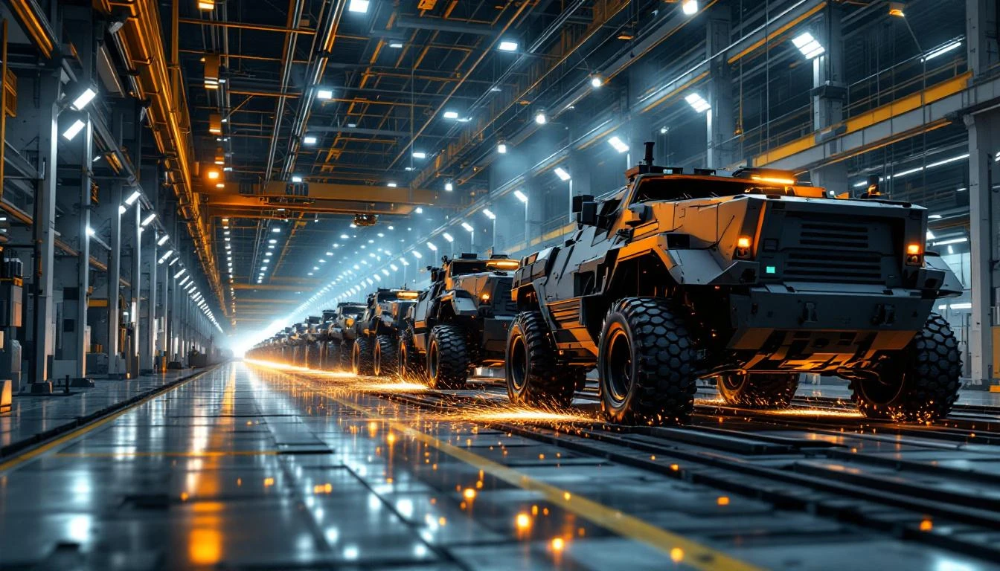
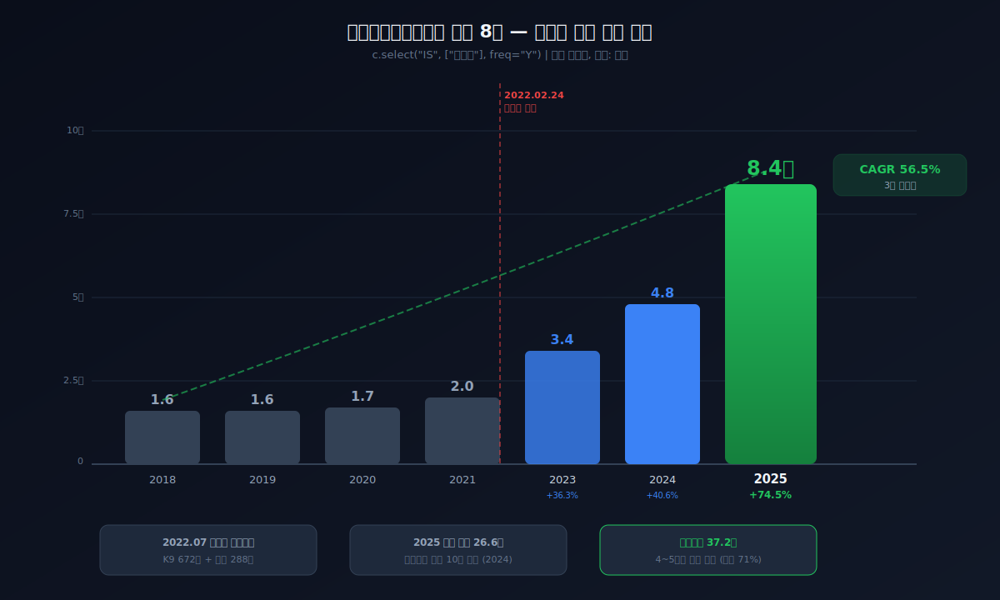
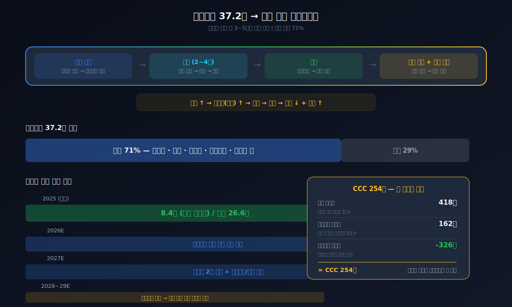
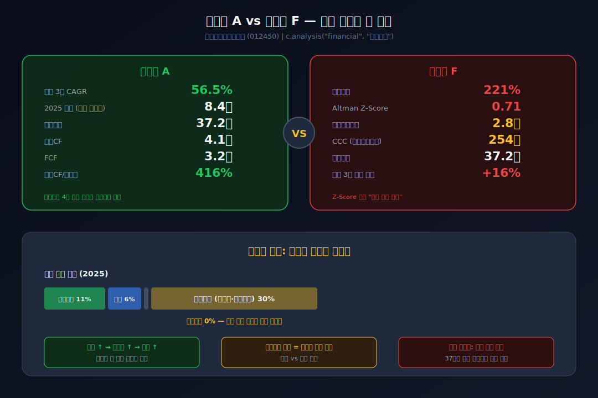
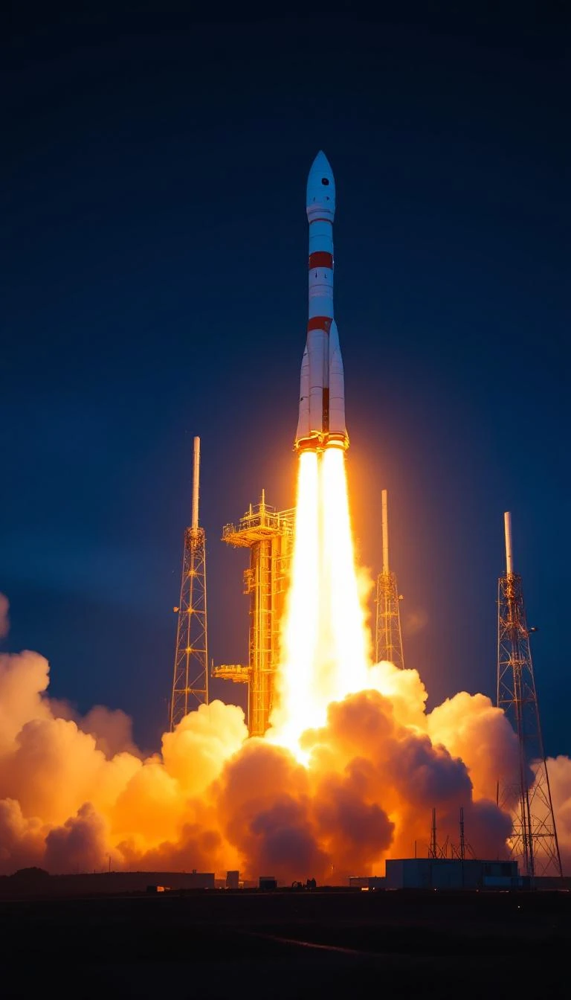
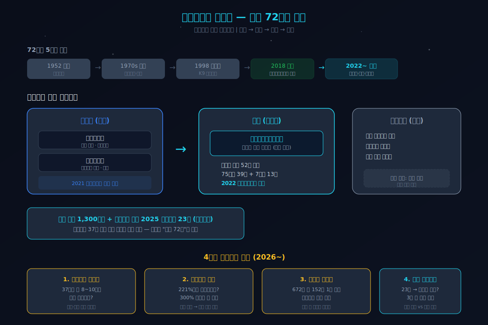

> **성장 + 사이클** | 산업재 > 항공우주와국방 | 2026-04-09 dartlab 실측
> 같은 시리즈: [SK하이닉스](/blog/000660-skhynix) · [삼양식품](/blog/003230-samyang-foods) · [두산에너빌리티](/blog/034020-doosan-enerbility) · [알테오젠](/blog/196170-alteogen) · [HMM](/blog/011200-hmm) · [셀트리온](/blog/068270-celltrion) · [기업분석 시리즈 전체](/blog/series/company-reports)

---



## 이상한 재무제표

한화에어로스페이스의 재무제표를 열면 이상한 게 보인다.

```python
import dartlab
c = dartlab.Company("012450")
c.analysis("financial", "자금조달")
```

부채비율 221%. 부채총계 37.2조. 여기까지만 보면 위험해 보인다. 그런데 바로 아래에 **금융차입 비중 0%**라고 찍혀 있다. 은행에서 빌린 돈이 없다. 부채가 37조인데 빚이 0원.

이게 말이 되나?

말이 된다. 이 회사의 부채는 **고객이 먼저 보낸 돈**이다 — 수주 선수금, 계약부채, 매입채무. 폴란드가 K9 자주포 672문을 주문하면서 먼저 대금을 넣었고, 그 돈이 회계장부에 "부채"로 잡혀 있다. 수주가 많을수록 선수금이 늘고, 선수금이 늘수록 부채비율이 올라간다.

**사업이 잘 돼서 부채가 높은 회사.**

이 한 줄을 이해하면 한화에어로스페이스의 7년이 보인다. 매출 1.6조짜리 자주포 회사가 어떻게 26.6조가 됐는지, 삼성이 왜 이 회사를 8,400억에 내놨는지, 폴란드의 전화 한 통이 왜 모든 걸 바꿨는지.

---

## 1막 — 매출 1.6조인데 세계 점유율 52%? 이게 말이 돼?

```python
c.select("IS", ["매출액", "영업이익"], freq="Y")
```

| 연도 | 매출 | 영업이익 | 영업이익률 |
|------|------|----------|-----------|
| 2018 | 1.6조 | 548억 | 3.3% |
| 2019 | 1.6조 | 351억 | 2.2% |
| 2020 | 1.7조 | 763억 | 4.4% |
| 2021 | 2.0조 | 813억 | 4.1% |

4년간 매출 1.6~2.0조. 영업이익률 2~4%. 평범한 중형 산업재처럼 보인다.

그런데 이 회사가 만드는 K9 자주포는 세계 155mm 자주포 시장의 **52%**를 차지하고 있었다. SIPRI 기준 2023년. 독일 PzH 2000이 약 120문, 프랑스 CAESAR가 약 300문 수출하는 동안 K9은 600문 이상. 세계에서 가장 많이 팔린 자주포.



시장의 절반을 먹고 있는데 왜 매출이 고작 1.6조인가?


뜯어보면 답이 나온다. K9 한 문 가격이 50~80억원이다. 터키가 350문(면허생산), 인도가 100문, 노르웨이가 28문, 핀란드가 48문을 샀다. 문제는 한 나라당 수십~100문 단위라는 것. 연간 수출 매출이 수천억에 머물렀다. **시장은 지배하는데 시장 자체가 작았다.**

재미있는 건 이 시장이 어떻게 만들어졌느냐다. 1999년 터키가 원래 사려던 건 독일 PzH 2000이었다. 독일 연방 안전보장이사회가 인권 문제로 수출을 거부했다. 한국이 K9을 들고 갔다. 2001년 계약. **독일이 거절한 무기를 한국이 팔았다.** K방산 수출의 시작이 이거다.

기술은 있는데 규모가 없었다. 수백 문 규모의 단일 대형 계약이 와야 이 회사의 재무제표가 바뀔 수 있었다. 2021년까지 그런 주문은 없었다.

그러면 질문이 하나 더 생긴다. 세계 최고의 자주포를 가지고 영업이익률 4%에 갇혀 있던 이 회사를, 삼성은 왜 8,400억에 내놨을까? 그리고 한화는 왜 그걸 주웠을까?

이 질문에 답하려면 이 회사의 뿌리를 봐야 한다. 1952년 한국전쟁 때 폭약을 만들던 한국화약. 1977년 11월 11일 밤 9시 15분, 이리역에서 화약열차가 폭발했다. 호송원 신무일이 다이너마이트 상자 위에 세운 양초가 원인이었다. 화약류 30톤. 59명 사망. 폭발 지점에 지름 30m 깊이 10m의 웅덩이가 남았다. 창업자 김종희는 전 재산 90억원을 배상에 내놓았다. 그 아들 김승연이 29세에 2대 회장이 됐고, 폭약 회사를 방산 그룹으로 키웠다. 방산은 이 가문의 DNA다 — 삼성에게 방산은 비주력이었지만, 한화에게는 뿌리였다.

2014년, 김승연이 재무제표를 완전히 바꿀 한 가지 결정을 내렸다.

---

## 2막 — 삼성이 버린 무기, 한화가 주운 무기



재무제표를 2018년과 2025년 나란히 놓으면 이상한 점이 보인다.

```python
c.select("BS", ["자산총계"], freq="Y")
```

| 연도 | 총자산 |
|------|--------|
| 2018 | 7.4조 |
| 2025 | **54.0조** |

7.3배. 7년 만에. 매출만으로는 이 점프가 설명이 안 된다. 뭔가 밖에서 들어온 게 있다.

두 가지였다.

**첫 번째 — 삼성테크윈 (2014년).** 이재용 체제의 삼성은 비주력 사업을 정리하고 있었다. 반도체와 스마트폰에 집중하기 위해 방산을 내놨다. 이재용의 판단: 무기는 삼성의 미래가 아니다. 2014년 방산비리가 연쇄로 터지면서 이미지 리스크도 있었다. 합리적 결정이었다 — 삼성은 실제로 반도체에서 세계 1위가 됐다.

김승연은 6개월을 고민했다. 결심이 서자 3개월 만에 끝냈다. 삼성테크윈 지분 32.4%를 **8,400억원**에, 삼성탈레스까지 합쳐 총 1.9조원. 인수 직후 그가 한 말 — **"한국의 록히드마틴으로 키우겠다."**

K9 자주포, 항공기 엔진, 레이더, 항공전자. 한화는 한 번의 거래로 육·해·공 종합 방산 그룹이 됐다. 2015년 한화테크윈, 2018년 한화에어로스페이스로 사명을 바꿨다. 이름에 "우주"를 넣은 건 의지의 표현이었다.

**두 번째 — 한화오션 (2023~2024년).** 총자산이 19.5조에서 43.3조로 한 해 만에 뛴 것은 한화오션(구 대우조선해양)이 연결 자회사로 들어왔기 때문이다. 한화오션만 매출 12.6조. 연결 재무제표의 덩치가 커진 거지, 한화에어로스페이스 단독의 점프가 아니다 — 이걸 구분 못하면 이 회사를 오해한다.

삼성의 기술 + 한화의 네트워크. 합쳐진 건 2015년인데, 재무제표가 반응한 건 2022년부터다. 7년간 매출 성장 연 8%, 영업이익률 2~4%. 삼성이 이걸 봤으면 "역시 버리길 잘했다"고 생각했을 시기다.

**그런데 2022년, 갑자기 모든 게 바뀐다.**

---

## 3막 — 영업이익률이 4%에서 18%로 뛴다. 공장을 새로 짓지도 않았는데. 왜?

2022년 2월 24일, 러시아 탱크가 우크라이나 국경을 넘었다.

유럽이 뒤집혔다. NATO 동쪽 최전선 폴란드가 보유한 소련제 무기를 우크라이나에 보내고, 빈자리를 채울 무기를 찾았다. 그해 5월, 브와슈차크(Blaszczak) 폴란드 부총리 겸 국방장관이 대규모 협력단을 이끌고 직접 한국에 왔다. 계약 틀이 잡힌 날 만찬에서 그가 말했다 — "이번 기회에 한국산 폭탄주도 수입하겠다." 무기 계약 자리에서 러브샷.



2022년 7월 27일, 폴란드 국방부에서 서명이 이뤄졌다:

| 무기체계 | 수량 | 제조사 |
|----------|------|--------|
| K2 전차 | 1,000대 | 현대로템 |
| **K9 자주포** | **672문** | **한화에어로스페이스** |
| **천무 다연장** | **288문** | **한화에어로스페이스** |
| FA-50 경공격기 | 48대 | 한국항공우주산업 |

K9 672문. 1막에서 봤던 "한 나라당 수십 문" 스케일이 아니다. 단일 계약 세계 최대 규모 자주포 주문. 폴란드 누적 계약액 **34조원+**. 1막의 모순 — "시장은 지배하는데 시장이 작았다" — 이 깨진 순간이다.



```python
c.analysis("financial", "성장성")
```

| 연도 | 매출 | 전년대비 | 영업이익률 |
|------|------|----------|-----------|
| 2021 | 2.0조 | +14.5% | 4.1% |
| 2023 | 3.4조 | +36.3% | 8.0% |
| 2024 | 4.8조 | +40.6% | **18.6%** |
| 2025 | 8.4조 | +74.5% | 9.6% |

*dartlab 분기 연환산 기준. 연결 연간: 2024년 11.2조, 2025년 26.6조.*

여기서 재미있는 숫자가 있다. 영업이익률이 2021년 4.1%에서 2024년 **18.6%**로 뛰었다. 4.5배. 그런데 이 기간에 공장을 새로 짓지 않았다. CAPEX를 보면:

| 연도 | CAPEX | 감가상각 |
|------|-------|---------|
| 2021 | 1,177억 | 1,898억 |
| 2023 | 1,553억 | 3,410억 |
| 2024 | 2,605억 | 8,320억 |

CAPEX가 감가상각보다 작다. 유지 투자 수준이다. 공장 증설 없이 마진이 4배 뛴 거다.

**왜?** 삼성테크윈 인수 후 7년간 쌓아둔 공장, 인력, 설비. 이게 전부 고정비였다. 수주가 적을 때는 이 고정비가 마진을 깎아먹었다 — 그래서 영업이익률이 2~4%에 갇혀 있었던 거다. 그런데 수주가 폭발하자? 같은 고정비 위에서 추가 매출이 거의 그대로 이익이 됐다. 공장을 새로 짓지 않아도 되니까 CAPEX가 안 늘고, CAPEX가 안 느니까 마진이 뛴다. **2015~2021년의 7년은 헛된 시간이 아니라 고정비를 깔아놓는 시간이었다.**

삼성이 "버리길 잘했다"고 생각했을 그 7년이, 실은 고정비 레버리지의 장전 기간이었던 셈이다.

2025년에 9.6%로 내려온 건 한화오션 연결 효과 + 생산 증설 투자가 시작됐기 때문이다.

CAGR **56.5%**. 수주잔고 **37.2조원**. 수출 비중 71%. 앞으로 4~5년치 매출이 이미 계약서에 적혀 있다.

---

## 4막 — 부채 37조인데 빚 0원, 이 구조의 정체



글 처음에 던진 질문으로 돌아온다. 부채 37조인데 은행 빚 0원. 이게 뭔가.

```python
c.analysis("financial", "자금조달")
```

| 자금 원천 | 2018 | 2025 | 변화 |
|-----------|------|------|------|
| 내부유보 | 19% | 11% | -8pp |
| 주주자본 | 9% | 6% | -3pp |
| **금융차입** | **12%** | **0%** | **-12pp** |
| **영업조달** | **2%** | **30%** | **+28pp** |

이 표 하나가 7년간의 변화를 말해준다.

2018년에는 은행에서 돈을 빌려 사업을 했다(금융차입 12%). 2025년에는 은행 빚이 **완전히 사라졌다**. 대신 영업조달이 2%에서 30%로 올라갔다. 영업조달이 뭐냐 — 매입채무, 선수금, 계약부채다. 고객이 먼저 보낸 돈과, 하청업체에 아직 안 낸 돈.

방산업의 자금 흐름을 따라가면 이렇다:
1. 폴란드가 K9 672문을 주문한다
2. 계약 시점에 선급금이 들어온다 → 장부에 **"계약부채"** (받은 돈인데 아직 납품 안 했으니 부채)
3. 한화가 부품을 사고 공장을 돌린다 → **"매입채무"** (하청업체에 아직 안 낸 돈)
4. 3~5년에 걸쳐 완성품을 납품한다 → 계약부채가 **매출로 전환**
5. 대금을 최종 수령한다 → 부채 감소, 현금 유입

**수주가 들어올수록 3~4번에 있는 시간이 길어지고, 그동안 부채비율은 높아진다.** 납품이 완료되면 부채가 줄고 현금이 들어온다. 즉 부채비율 221%는 "위험하다"가 아니라 **"납품할 게 많다"**는 뜻이다.



dartlab 스코어카드를 보면:

```python
c.analysis("financial", "종합평가")
```

| 영역 | 등급 | 왜 이 등급인가 |
|------|------|---------------|
| 성장성 | **A** | CAGR 56.5%, 수주잔고 37조 |
| 수익성 | **A** | 고정비 레버리지 발동 |
| 현금흐름 | **A** | 영업CF 4.1조, FCF 3.2조 |
| 이익품질 | **A** | 영업CF/순이익 416% |
| 안정성 | F | 부채비율 221%, Z-Score 0.71 |

4개의 A와 1개의 F. 안정성 F는 Altman Z-Score가 매기는 등급인데, 이 모형은 1968년에 **일반 제조업** 기준으로 만들어졌다. "부채가 높으면 위험하다"는 전제가 깔려 있다. 수주 선수금이 부채의 30%인 방산업에 이 모형을 적용하면 구조적으로 과대 경고가 난다.

진짜 봐야 할 숫자는 따로 있다:

```python
c.analysis("financial", "현금흐름")
```

| 연도 | 영업CF | FCF | 영업CF/순이익 |
|------|--------|-----|-------------|
| 2018 | 2,821억 | 2,284억 | 402% |
| 2024 | 2.5조 | 2.3조 | 122% |
| 2025 | **4.1조** | **3.2조** | **416%** |

이익보다 **4배** 많은 현금이 들어오고 있다. 이게 핵심이다. 부채비율이 221%든 300%든, 매년 4조씩 현금이 들어오는 회사가 은행 빚 없이 돌아가고 있다면 — 그건 위험한 회사가 아니라 **고객에게 돈을 먼저 받는 회사**다.

다만 CCC(현금전환주기)가 254일. 재고 회전일 418일 — 자주포 한 문 만드는 데 1년 이상이다. 강판 자르고, 포탑 용접하고, 사격통제장치 넣고, 시험 사격하고, 선적. 현금이 한 바퀴 도는 데 254일. 수주잔고 37조를 제때 소화할 수 있느냐가 이 회사의 진짜 질문이다.

그런데 하나 더 물어야 할 게 있다.

---

## 5막 — 수주잔고 37조는 영원하지 않다. 그 다음은?

수주잔고 37.2조. 4~5년치 매출이 확보돼 있다고 했다. 그러면 뒤집어서 생각해보자. **4~5년 뒤에는?**

폴란드 672문이 납품되고, 루마니아·호주·베트남 계약이 이어져도 방산 수출에는 사이클이 있다. 전쟁이 수주를 만들었고, 전쟁이 끝나면 수주가 줄 수 있다. 지금의 CAGR 56.5%가 5년 뒤에도 유지될 거라고 생각하면 재무제표를 읽는 게 아니라 환상을 읽는 거다.

한화에어로스페이스도 이걸 안다. 그래서 다음 판을 깔고 있다.

항공우주 부문 2025년 영업이익: **23억원.**



23억. 방산 영업이익 2조 옆에 23억. 웃길 수 있는 숫자다. 그런데 이게 뉴스가 됐다 — **흑자전환**이었기 때문이다. 이 부문이 적자를 벗어난 게 2025년이 처음이다.

뭘 하고 있는 건가.

창원1사업장, KSLV 조립동 1,818㎡. 직원들 사이에서도 일부만 출입하는 보안 구역이다. 75톤급 액체엔진 하나에 부품 2,400개, 공정 458개. 연료관과 배선이 얽힌 은빛 금속 사이에서 엔지니어들이 손으로 조립한다. 1초도 안 되는 시간에 연료와 산화제를 공급하는 밸브들이 정해진 순서대로 정확히 작동해야만 점화된다.



**누리호.** 한화에어로스페이스는 KSLV-II 엔진 총조립을 담당하는 국내 유일 기업이다. 75톤급 39기, 7톤급 13기 — 총 52기 엔진 제작. 2025년 11월 27일 새벽 1시 13분, 고흥 나로우주센터에서 4차 발사. 한화에어로스페이스가 민간 프라임으로서 참여한 첫 발사. 엔진 성능이 추정치보다 높게 나왔다.

한화그룹은 **한화에어로스페이스**(발사체 엔진) + **한화시스템**(위성 제작) + **쎄트렉아이**(위성체계 수출)로 "만들고 → 쏘는" 풀 체인을 짜고 있다. 선제 투자 1,300억원. 3세 김동관(1983년생)이 주도한다.

재무적으로 보면 이런 구조다: **방산 영업이익 2조가 우주사업 23억을 먹여 살린다.** 수주잔고 37조가 캐시카우고, 우주가 베팅이다. 방산 수출이 돈을 벌어다 주는 동안 우주사업이 성장할 시간을 버는 것 — 이게 한화의 계산이다.

이 계산이 맞는지는 아직 모른다. 23억이 3년 안에 어디까지 올라가느냐. SpaceX가 지배하는 글로벌 발사 시장에서 한국 후발주자가 자리를 잡을 수 있느냐. 1,300억 투자가 매몰 비용이 될 수도 있다.

그런데 이 회사의 역사를 보면, 비슷한 베팅을 전에도 했다. 2014년 삼성테크윈 1.9조 인수 — 당시에도 "왜 방산에 저 돈을?"이라는 반응이 있었다. 7년간 재무제표는 조용했다. 그리고 8년째에 터졌다.

---

## 이 회사를 계속 열어볼 4가지 숫자

다음에 이 회사의 재무제표를 열 때 이 네 가지를 먼저 본다:

**1. 수주잔고** — 37.2조에서 올라가고 있는가, 소화되면서 줄고 있는가. 이 숫자가 이 회사의 미래 매출이다.

**2. 영업조달 비중** — 30%가 더 올라가면 수주가 계속 들어온다는 뜻이다. 내려가기 시작하면 사이클이 꺾인다는 신호다.

**3. 폴란드 납품 진행률** — 672문 중 1차 212문. 제때 납품하고 있는가. 지연이 생기면 위약금 리스크가 있고, 그보다 중요한 건 다음 수출 계약의 레퍼런스가 흔들린다는 것이다.

**4. 항공우주 영업이익** — 23억. 이 숫자가 100억, 500억, 1000억으로 올라가는 속도가 곧 "우주 베팅이 맞았는가"의 답이다.

---

이건희는 무기를 버렸다. 반도체를 선택했다. 합리적이었다.

김승연은 무기를 주웠다. "한국의 록히드마틴"이라고 말했다. 7년간 아무 일도 안 일어났다. 그리고 전쟁이 터졌다.

10년 뒤 수주잔고 37조. 같은 거래에서 삼성에게는 선택과 집중이 나왔고, 한화에게는 인생의 거래가 나왔다.

지금 김동관이 우주에 1,300억을 넣고 있다. 영업이익 23억짜리 사업에. 아버지가 삼성테크윈에 1.9조를 넣었을 때와 같은 구도다 — 아무도 확신하지 못하는 베팅, 7년간 조용할 수 있는 인내, 그리고 언젠가 터질 수도 있는 레버리지.

다음에 재무제표에 변곡점이 찍힐 때, 그 숫자가 말해줄 것이다.

```python
# 이 글의 모든 숫자를 직접 확인하려면
c.show("IS", freq="Y")
c.show("BS", freq="Y")
c.show("CF", freq="Y")
c.analysis("financial", "성장성")
c.analysis("financial", "자금조달")
c.analysis("financial", "현금흐름")
c.analysis("financial", "종합평가")
c.review()
```

---

## 재무제표 — dartlab 실측 8년

| | 2018 | 2019 | 2020 | 2021 | 2023 | 2024 | 2025 |
|---|---:|---:|---:|---:|---:|---:|---:|
| 매출 | 1.6조 | 1.6조 | 1.7조 | 2.0조 | 3.4조 | 4.8조 | 8.4조 |
| 영업이익 | 548억 | 351억 | 763억 | 813억 | 2,758억 | 8,997억 | 8,076억 |
| 당기순이익 | 701억 | 146억 | 755억 | 410억 | 1,978억 | 2.1조 | 9,940억 |

| | 2018 | 2019 | 2020 | 2021 | 2023 | 2024 | 2025 |
|---|---:|---:|---:|---:|---:|---:|---:|
| 총자산 | 7.4조 | 8.7조 | 9.5조 | 11.0조 | 19.5조 | 43.3조 | 54.0조 |
| 부채 | 4.8조 | 5.9조 | 6.5조 | 7.1조 | 14.9조 | 32.0조 | 37.2조 |
| 자본 | 2.6조 | 2.9조 | 3.0조 | 3.9조 | 4.7조 | 11.4조 | 16.8조 |

| | 2018 | 2019 | 2020 | 2021 | 2023 | 2024 | 2025 |
|---|---:|---:|---:|---:|---:|---:|---:|
| 영업CF | 2,821억 | 4,477억 | 2,351억 | 8,880억 | 8,259억 | 2.5조 | 4.1조 |
| FCF | 2,284억 | 3,466억 | 1,381억 | 7,703억 | 6,706억 | 2.3조 | 3.2조 |

---

## 검증표

| 본문 수치 | 출처 |
|-----------|------|
| 삼성테크윈 인수 8,400억 (2014) | BusinessPost, 딜사이트 |
| 이리역 폭발 — 양초 원인, 59명 사망, 웅덩이 30m | 위키백과, 한국민족문화대백과 |
| 독일 PzH 2000 터키 수출 거부 → K9 계약 (2001) | 나무위키 T-155, 위키백과 K9 |
| K9 세계 155mm 시장 점유율 52% | EBN (2023.11) |
| 블라슈차크 방한 + 폭탄주 | 한국일보 (2026.02) |
| 폴란드 서명 2022.07.27 | 나무위키 2022 한-폴 방산계약 |
| K9 672문, 천무 288문 | 헤럴드경제 |
| 폴란드 누적 34조원+ | sentv, 더빅데이터 |
| 2025 연매출 26.6조 (연결) | 중앙이코노미뉴스 |
| 수주잔고 37.2조 | 블로터, Finance Scope |
| 누리호 엔진 52기, 부품 2,400개, 공정 458개 | 파이낸셜뉴스, Daum |
| 누리호 4차 발사 2025.11.27 01:13 | 사이언스타임즈 |
| "한국의 록히드마틴" 발언 | 뉴스임팩트, 머니투데이 |
| SIPRI 한국 방산 수출 10위 (2.2%) | 이코노미스트 (2025.04) |
| CAGR 56.5%, 금융차입 0%, 영업조달 30% | dartlab 실측 |
| 영업CF 4.1조, FCF 3.2조, CCC 254일 | dartlab 실측 |
| 스코어카드 성장성A 안정성F | dartlab 실측 |

---

**면책**: 이 글은 특정 종목의 매수·매도를 권유하지 않습니다. 모든 수치는 dartlab 실측 또는 명시된 외부 출처 기준이며, 투자 판단은 본인의 책임입니다.
