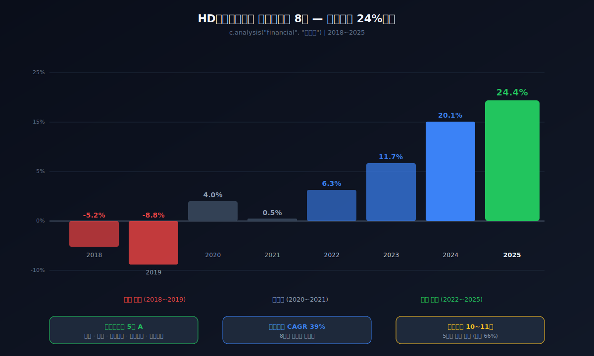
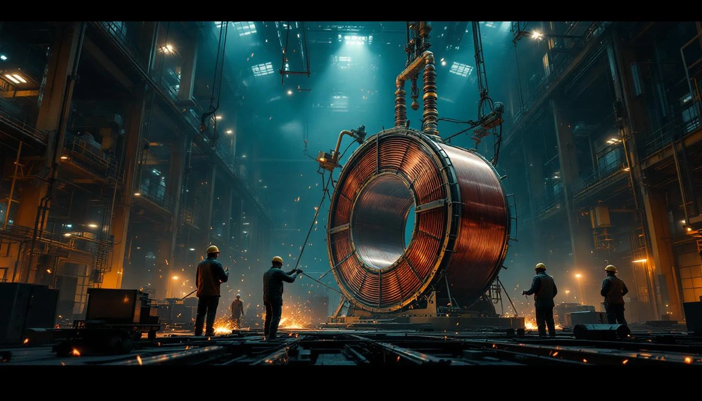
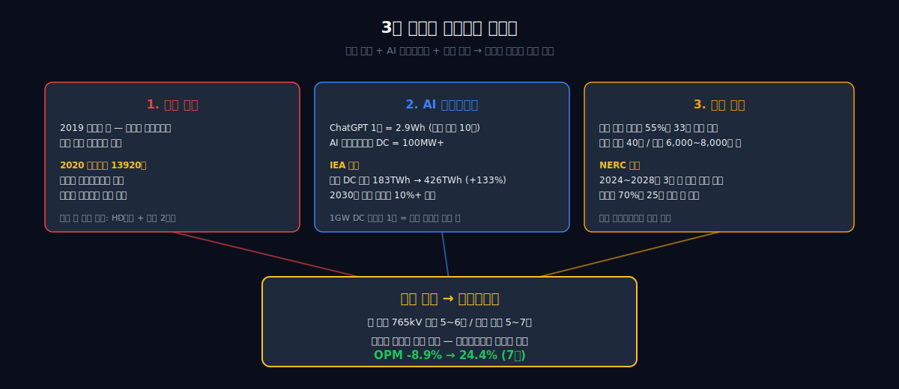
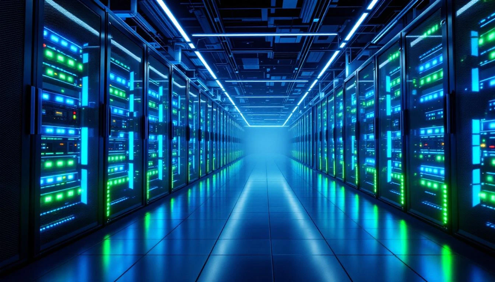
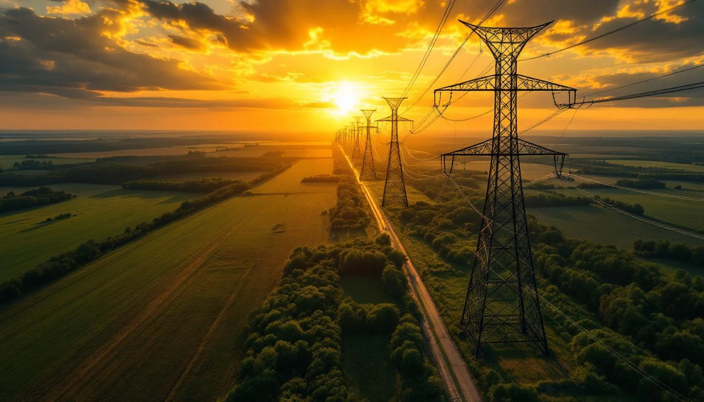
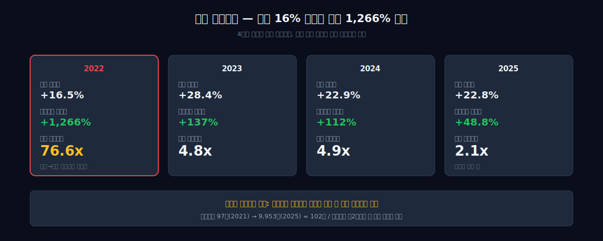
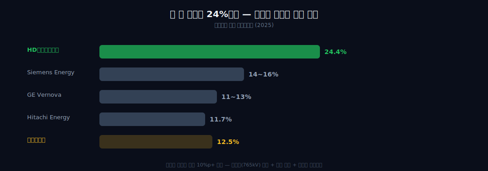
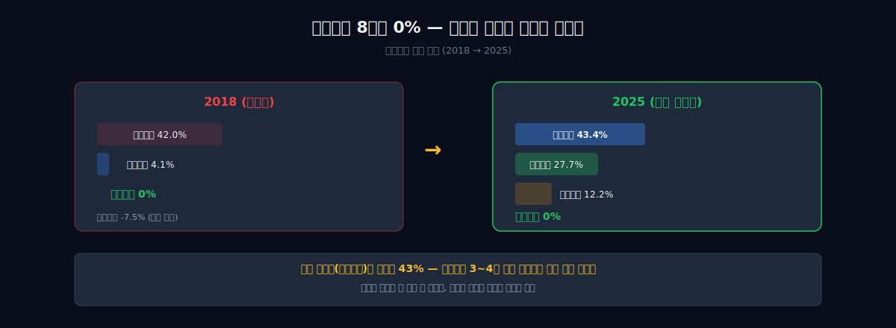

<script>
import ComboChart from '$lib/components/blog/ComboChart.svelte';
import StackBar from '$lib/components/blog/StackBar.svelte';
import YouTube from '$lib/components/YouTube.svelte';
import HFDataLink from '$lib/components/blog/HFDataLink.svelte';
</script>

<YouTube id="A0DO22IvgB0" title="HD현대일렉트릭 — 적자 1천억에서 영업이익 1조, 변압기 하나로" />

> **턴어라운드 + 성장** | 산업재 > 전력설비 | 2026-04-09 dartlab 실측
> 같은 시리즈: [SK하이닉스](/blog/000660-skhynix) · [삼양식품](/blog/003230-samyang-foods) · [두산에너빌리티](/blog/034020-doosan-enerbility) · [알테오젠](/blog/196170-alteogen) · [HMM](/blog/011200-hmm) · [셀트리온](/blog/068270-celltrion) · [한화에어로스페이스](/blog/012450-hanwha-aerospace) · HD현대일렉트릭 · [고려아연](/blog/010130-korea-zinc) · [에이피알](/blog/278470-apr) · [기업이야기 시리즈 전체](/blog/series/company-reports)


<HFDataLink code="267260" />

---



## 적자 사업부의 재무제표

2018년, 현대중공업에서 떨어져 나온 전기전자사업부가 있었다.

```python
import dartlab
c = dartlab.Company("267260")
c.analysis("financial", "성장성")
```

| 연도 | 매출 | 영업이익 | 영업이익률 | 자기자본수익률 |
|------|------|---------|-----------|-----|
| 2018 | 1.94조 | **-1,006억** | -5.2% | -21.0% |
| 2019 | 1.77조 | **-1,567억** | -8.8% | -37.8% |
| 2020 | 1.81조 | 727억 | 4.0% | -5.9% |
| 2021 | 1.81조 | 97억 | 0.5% | -5.2% |

분사 첫 해 적자 1,006억. 이듬해 적자 1,567억. 자기자본수익률 -37.8%. 조선이 핵심이던 현대중공업에서 변압기 사업부는 곁가지였다. 2017년 4개 법인으로 쪼갤 때 "쓸모없는 사업부를 떼어냈다"는 시선이 있었다.

2025년, 같은 회사의 재무제표:

| 연도 | 매출 | 영업이익 | 영업이익률 | 자기자본수익률 |
|------|------|---------|-----------|-----|
| 2022 | 2.10조 | 1,330억 | 6.3% | 19.5% |
| 2023 | 2.70조 | 3,152억 | 11.7% | 24.6% |
| 2024 | 3.32조 | 6,690억 | 20.1% | 33.1% |
| 2025 | 4.08조 | **9,953억** | **24.4%** | **36.0%** |

영업이익 -1,006억에서 +9,953억. 7년 만에. 자기자본수익률 -21%에서 36%. dartlab 스코어카드에 **A가 5개** — 성장, 수익, 이익품질, 투자효율, 재무정합성. 8년간 적자→흑자→스코어카드 최상위. 무슨 일이 있었는가.

변압기다. 정확히는, 세계에서 5~6곳만 만들 수 있는 **765kV 초고압 변압기**.

---

## 1막 — 허용 오차 2mm, 경력 20년, 자동화 불가

### 765kV — 전 세계 5~6곳만 만들 수 있는 이유



발전소에서 만든 전기를 수백 킬로미터 떨어진 도시로 보내려면 전압을 높여야 한다. 765,000볼트. 그 전압을 다루는 변압기를 만들 수 있는 기업이 전 세계에 **5~6곳**이다. Hitachi Energy(일본/스위스), Siemens Energy(독일), GE Vernova(미국, 공장은 멕시코), 효성중공업(한국), HD현대일렉트릭(한국). **미국 땅 위에서** 765kV를 생산할 수 있는 곳은 효성과 HD현대일렉트릭, **2곳뿐이다.**

왜 이렇게 적은가?

울산 공장의 제조 공정은 3단계다. **첫 번째, 철심 적층.** 방향성 규소강판을 CNC로 정밀 절단해 step-lap 방식으로 한 장씩 쌓는다. HD현대일렉트릭은 이 공정의 자동화 설비를 세계 최초로 개발했다 — 이건 자동화가 됐다.

### 권선 공정 — 숙련공 20년, 72시간 진공건조, 인공 낙뢰 시험

**두 번째, 권선.** 여기부터 기계가 멈추고 사람이 들어간다. 절연된 동선을 원통형 지지대에 감아 코일을 만든다. 허용 오차 **2mm**. 반자동 설비로 페달을 밟아 권선기를 돌리지만, 층이 바뀌는 전환점에서 도체를 옮기는 작업은 **100% 숙련공의 손기술**이다. 이 공정을 자동화할 수 없다. 권선 작업자 평균 경력 **20년 이상**.

**세 번째, 진공 건조와 시험.** 본체 조립 후 110도에서 **72시간 진공 건조** — 절연물 내부의 수분을 분자 단위로 제거한다. 절연유는 진공 상태에서 주입 — 공기 방울 하나가 수십만 볼트에서 절연 파괴를 일으키기 때문이다. 마지막에 임펄스 제너레이터가 **인공 낙뢰를 만들어** 변압기에 쏜다. 이 시험만 4~7일. 한 대의 변압기가 공장을 나가기까지 주문에서 **3~4년**.

돈으로 해결할 수 없다. 공장을 지어도, 설비를 사도, 사람이 없으면 변압기가 나오지 않는다. 숙련공을 키우는 데 **10년**. 이것이 이 회사의 해자다.

그런데 이 해자가 있었는데도 2018~2019년에 적자였다. **해자가 있어도 수요가 없으면 적자다.** 그러면 수요가 언제, 왜 폭발했는가?

---

## 2막 — 휴스턴 항의 227톤

### 중국산 변압기에서 원격 차단 하드웨어 — 첫 번째 수요 충격

2019년 여름, 텍사스 휴스턴 항. 상하이에서 출발한 50만 파운드(227톤)짜리 변압기가 도착했다. 중국 JSHP(강소화붕변압기) 제조. 콜로라도 WAPA(서부지역전력청) 변전소에 설치될 예정이었다. 가격 약 300만 달러.

이 변압기는 콜로라도에 가지 못했다. 연방 당국이 목적지를 변경해 **뉴멕시코 앨버커키의 샌디아 국립연구소**로 이송했다. DOE(에너지부)가 직접 개입.

극비 포렌식 검사 결과. NSC(국가안보회의) 정보프로그램 전 국장 래섬 새들러(Latham Saddler)의 증언: *"They found hardware that was put into the transformer that had the ability for somebody in China to switch it off."* 중국에서 원격으로 전원을 차단할 수 있는 하드웨어. ICS 보안 전문가 조셉 와이스(Joseph Weiss)가 WSJ에 확인: "electronics that should not have been part of the transformer." 같은 제조사 변압기 2대 이상에서 동일 백도어가 추가 확인됐다. 검사 결과는 **고도 기밀(highly classified)**로 분류. DOE와 WAPA 모두 공식 코멘트를 거부했다.

*(주: 의도적 백도어인지, 원격 관리 모듈의 보안 취약점인지는 논쟁이 있다. 확실한 것은 미국 정부가 이걸 보고 행정명령을 발동했다는 사실이다.)*

2020년 5월 1일, 트럼프 대통령이 행정명령 13920호를 발동한다 — **전력망 국가비상사태 선언**. 적성국 전력설비 조달 금지. 그해 12월, 에너지부가 중국산 벌크 전력설비 조달 금지령. 2021년 바이든이 취임 후 한 번 풀었다. 2025년 트럼프가 재취임하면서 다시 조였다. 정치적 시소가 있었지만, 실질적으로 미국 유틸리티들은 중국산 대형 변압기 발주를 사실상 중단했다.

중국이 빠졌다. **첫 번째 수요 충격.**

---

## 3막 — ChatGPT 한 번에 2.9Wh, 미국 변압기 55%가 수명 한계



### AI 데이터센터 100MW+ — 구글 검색의 10배 전력



**두 번째 수요 충격**은 전혀 다른 곳에서 왔다. ChatGPT 질의 한 번에 소비되는 전력: **2.9Wh**. 구글 검색 한 번(0.3Wh)의 10배. 전통 데이터센터가 10~25MW를 소비했다면, AI 하이퍼스케일 데이터센터는 **100MW 이상**. IEA 전망: 미국 데이터센터 전력 소비 2024년 183TWh → 2030년 **426TWh**(+133%). 2030년에는 미국 전체 전력의 10% 이상을 데이터 처리가 삼킨다. 1GW 데이터센터 캠퍼스 하나에 대형 변압기가 수십 대 필요하다.



### 미국 변압기 55%가 수명 33년+ — 3중 수요가 한꺼번에 터졌다

**세 번째 수요 충격**: 미국 대형 전력변압기의 **55%가 33년 이상** 가동 중이다. 설계 수명 40년. 전국에 6,000~8,000만 대. 송전선의 70%가 25년 이상 전에 설치. NERC(북미전력신뢰성기구)는 2024~2028년 3억 명의 미국인이 전력 정전 위험 상승에 직면한다고 경고했다.

중국 퇴출 + AI 수요 폭발 + 노후 교체. **3중 수요가 한꺼번에 터졌다.** 이걸 채울 수 있는 곳이 세계에 5~6곳. 그리고 미국 안에서 만들 수 있는 곳은 2곳.

---

## 4막 — 매출이 16% 늘었는데 영업이익이 1,266% 뛴다. 왜?



### 영업 레버리지 76.6배 — 4년 적자의 고정비가 이익 증폭기로

3중 수요가 재무제표에 어떻게 찍혔는지 보자.

```python
c.analysis("financial", "성장성")
```

| 연도 | 매출 성장률 | 영업이익 성장률 | 영업 레버리지 |
|------|-----------|---------------|-------------|
| 2022 | +16.5% | **+1,266%** | **76.6x** |
| 2023 | +28.4% | +137% | 4.8x |
| 2024 | +22.9% | +112% | 4.9x |
| 2025 | +22.8% | +48.8% | 2.1x |

2022년 영업 레버리지 **76.6배**. 매출이 16.5% 늘었는데 영업이익이 1,266% 뛰었다. 적자에서 흑자로 전환되는 시점의 고정비 레버리지다 — 4년간 적자를 만들며 쌓인 고정비(공장, 인력, 설비)가, 수요 폭발 시점에 이익 증폭기가 됐다.

한화에어로스페이스에서 본 것과 같은 메커니즘이다. 한화에어로는 "삼성테크윈 인수 후 7년 소화기"가 고정비 장전 기간이었고, HD현대일렉트릭은 "분사 후 4년 적자"가 고정비 장전 기간이었다.

### 영업이익률 24.4% — 글로벌 경쟁사 대비 10pp 높은 이유

그런데 마진이 이렇게 높을 수 있나? 비교해보자:



| 기업 | 부문 | 영업이익률 |
|------|------|-----------|
| **HD현대일렉트릭** | **전력설비** | **24.4%** |
| Siemens Energy | Grid Technologies | 14~16% |
| GE Vernova | Electrification | 11~13% |
| Hitachi Energy | 전체 | 11.7% |
| 효성중공업 | 중공업 | 12.5% (4Q 20.2%) |

글로벌 경쟁사 대비 **10%p 이상** 높다. 왜?

**변압기 원가의 60~70%가 원자재**다 — 전기강판(규소강판) 25~30%, 구리 15~20%, 절연유 5~8%. 나머지가 인건비 25%. 원자재가 올라도 마진이 올라가는 이유가 있다. 첫째, 수요 초과 상태라 **가격을 원가 상승분 이상으로 전가**한다. 둘째, 장기 계약에 **에스컬레이션 조항**(원자재 가격 연동 자동 조정)이 들어 있다. 셋째, 고정비 레버리지가 아직 작동 중이다. 넷째, HD현대일렉트릭은 **초고압(765kV) 비중이 높다** — 초고압일수록 기술 프리미엄이 커서 마진이 높다.

효성중공업도 4분기 영업이익률 20%를 찍었다. 한국 변압기 2사가 글로벌 마진을 주도하고 있다.

---

## 5막 — 자기자본수익률 36%인데 배당성향 11%. 나머지 89%는 어디로 가는가?



### 금융차입 8년간 0% — 고객의 돈으로 공장을 돌린다

이 회사의 자금 구조가 이례적인 이유가 있다. 매출 2조짜리 제조업인데 금융차입이 거의 없다.

```python
c.analysis("financial", "자금조달")
```

| 자금 원천 | 2018 | 2021 | 2025 | 변화 |
|-----------|------|------|------|------|
| 내부유보 | -7.5% | -19.5% | **27.7%** | +35.2pp |
| 주주자본 | 42.0% | 48.8% | 12.2% | -29.8pp |
| **금융차입** | **0%** | **0%** | **0%** | — |
| **영업조달** | **4.1%** | **9.9%** | **43.4%** | **+39.3pp** |

금융차입 **8년간 0%**. 은행 빚 한 번도 진 적 없다. 회사채도 0. 대신 영업조달이 4%에서 **43%**로 뛰었다 — 한화에어로스페이스(30%)보다 더 높다. 고객 선수금과 계약부채가 자금의 거의 절반. 변압기를 주문한 유틸리티 회사들이 **3~4년 전에 미리 돈을 보낸 것**이다. 이 회사는 은행에 이자를 한 푼도 안 내면서, 고객의 돈으로 공장을 돌린다.

그러면 번 돈은 어디로 가는가?

| 연도 | 배당금 (원/주) | 배당성향 | 비고 |
|------|-------------|---------|------|
| 2018~2022 | 0 ~ 500 | 0~6% | 적자기 무배당 |
| 2023 | 2,700 | 10.7% | 흑자 후 시작 |
| 2024 | 5,350 | 11.0% | 전년 대비 +98% |
| 2025 | — | 목표 30%+ | 밸류업 공시 |

자기자본수익률 36%인데 배당성향 11%. 나머지 89%의 행방:

| 연도 | 설비투자 | 감가상각 | 배수 |
|------|-------|---------|------|
| 2021 | 332억 | 516억 | 0.6x |
| 2023 | 891억 | 624억 | 1.4x |
| 2024 | 1,367억 | 730억 | 1.9x |
| 2025 | **2,419억** | 943억 | **2.6x** |

설비투자가 감가상각의 **2.6배**. 유지 투자가 아니라 확장 투자. 어디에?

### 앨라배마 제2공장 2억 달러 — 두 번째 고정비 장전

**앨라배마 몽고메리.** 제2공장 착공 2026년 3월 6일. **2억 달러** 투자. 31만 2,000평방피트. 2027년 중반 가동. 생산능력 100대 → 150대. 추가 고용 200명(총 600명). 기존 몽고메리 공장은 2011년부터 운영 중이었는데, 매출이 2017년 1억 달러에서 2025년 4억 달러로 4배가 됐다.

왜 앨라배마인가? **CSX 철도.** 초고압 변압기는 높이와 폭이 도로 운송 한계를 초과한다. CSX가 몽고메리에서 전용 통로(dedicated lanes)와 새 철도 인입선을 확보해줬다. 변압기는 철도로 나간다.

그리고 미국에서 만들면 **관세가 없다.** 지금은 관세를 고객이 대신 내주고 있지만, 앨라배마 공장이 가동되면 그 이슈 자체가 사라진다.

이 투자가 매출로 전환되기 전까지는 고정비가 다시 늘어난다 — 이 회사는 지금 **고정비를 두 번째로 장전하고 있다.** 2018~2021년의 첫 번째 장전이 2022년부터 폭발했듯이, 2025~2027년의 두 번째 장전이 2027년 이후 작동할 것이다.

---

## 6막 — 이익이 나는데 현금이 사라진 2년, 그리고 1조

### 영업이익 1,330억인데 영업CF -1,241억 — 재고 +4,926억 폭증

```python
c.analysis("financial", "현금흐름")
```

2022년 영업이익 1,330억. 영업CF **마이너스 1,241억.** 이익이 나는 회사에서 현금이 증발했다. 2023년도 마찬가지 — 영업이익 3,152억인데 영업CF 마이너스 224억.

| 연도 | 영업이익 | 영업CF | 잉여현금흐름 | CF 패턴 |
|------|---------|--------|-----|---------|
| 2018 | -1,006억 | -40억 | -724억 | 위기형 |
| 2020 | 727억 | 2,045억 | 1,416억 | 구조조정형 |
| 2022 | **1,330억** | **-1,241억** | **-1,654억** | **위기형** |
| 2023 | **3,152억** | **-224억** | **-1,115억** | **위기형** |
| 2024 | 6,690억 | **1.03조** | **8,970억** | 성숙형 |
| 2025 | 9,953억 | **9,596억** | **7,177억** | 성숙형 |

이 숫자만 보면 2022~2023년은 위기 기업의 전형이다. 그런데 2년 뒤 영업CF가 **1.03조**로 뛰었다. 재무제표에서 **위기와 도약은 같은 모양**을 하고 있다.

왜 현금이 사라졌는가? 수주가 밀려들면서 벌어진 일이다. 부품을 미리 대량 매입하고 생산을 시작했지만, 납품(= 매출 인식)까지 시간이 걸렸다. 재고자산: 3,571억(2021) → **8,497억**(2023) — +4,926억 폭증. 동시에 고객 선수금(계약부채)이 2,200억에서 **1.46조**로 6.6배 뛰었다 — 돈은 들어왔지만 납품 전이라 매출로 인식 못함.

2024년부터 납품이 본격화되면서 현금이 터졌다. 영업CF/순이익 비율 207%. 이익보다 2배 많은 현금이 들어온 것이다.

### 부채비율 243% → 135% — 부채가 줄어서가 아니라 자본이 더 빨리 늘어서

여기서 한 가지 더. 부채비율을 보자:

| 연도 | 부채비율 | 부채 총액 |
|------|---------|----------|
| 2021 | 243% | 1.57조 |
| 2023 | 175% | 1.85조 |
| 2025 | **135%** | **2.74조** |

부채비율은 243%에서 135%로 **내려갔다.** 재무건전성 개선? 그런데 부채 절대액은 1.57조에서 2.74조로 1.17조 **늘었다.** 부채비율이 내려간 건 부채가 줄어서가 아니라, 이익이 쌓여서 자본이 부채보다 더 빨리 늘었기 때문이다. "부채비율 개선"이라는 말을 액면 그대로 믿으면 안 된다.

---

## 7막 — 2025년 9월, 텍사스에서 온 주문

### 765kV 24대, 2,778억 — 창사 이래 단일 계약 최대

2025년 9월 22일. HD현대일렉트릭이 공시를 낸다. **765kV 초고압변압기 + 리액터 24대, 2,778억원.** 창사 이래 단일 계약 최대. 납품 2029년까지. 상대는 텍사스 최대 송전 운영사 **Oncor**로 추정된다 — Oncor은 텍사스에서 4개 765kV 송전선 프로젝트를 진행 중이다.

대당 116억원. 이후 미국 최대 송전망 운영사와 986억원 추가 계약. HD현대일렉트릭은 1999년 신서산 변전소 이후 765kV 변압기 **160대 이상** 납품 실적이 있다.

수주잔고 **11.1조원**. 북미 비중 67%. 변압기 단가가 과거 대비 **60~80% 상승**했다. 같은 대수를 팔아도 매출이 훨씬 크다.

### 관세를 고객이 대신 낸다 — 가격결정력의 극단적 형태

그리고 하나 더 — 미국 반덤핑 관세 이야기. 한국산 대형 변압기에 반덤핑 관세가 부과되고 있었는데, 미국 유틸리티 회사들이 **관세를 자기 돈으로 대신 내기 시작했다.** HD현대일렉트릭의 관세 부담이 한 분기 만에 1,360만 달러에서 680만 달러로 반토막. 고객이 흡수한 것이다. 2026년 2월, 미국 상무부는 한국산 대형 변압기에 대해 **"덤핑 아님" 예비 판정**을 내렸다.

관세를 고객이 대신 낸다. 이건 가격결정력의 극단적 형태다. 공급이 수요를 따라가지 못할 때만 벌어지는 일이다.

관세를 고객이 대신 냈다는 것은 4막에서 본 가격결정력의 실전 증거다 — 이 회사의 마진은 원가가 아니라 교섭력이 지킨다.

---

## 8막 — 숙련공이 은퇴하면 변압기 몇 대가 사라지는가

스코어카드 5개 A. 수주잔고 11조. 영업이익률 24%. 모든 숫자가 좋다. 그런데 이 회사의 해자가 "사람"이라면, 그 해자의 리스크도 "사람"이다.

권선 작업자 평균 경력 20년 이상. 이 사람들이 50대 후반~60대라면, 10년 뒤에는? 숙련공 한 명이 은퇴하면 그 자리를 채우는 데 10년이 걸린다. 울산은 그나마 기존 인력 풀이 있다. 앨라배마 몽고메리에서는? 한국에서 10년 걸리는 기술을, 앨라배마에서 누가 가르치는가?

수요는 확실하다. AI 전력, 노후 교체, 중국 배제 — 3중 수요가 구조적이다. **그런데 공급할 수 있는 사람이 줄어든다면?** 해자가 깊을수록 그 해자를 유지하는 비용도 크다. 이것은 5개 A가 영원하지 않을 수 있다는 뜻이기도 하다.

---

## 이 회사를 계속 열어볼 숫자

**1. 영업이익률** — 24.4%가 피크인가, 더 올라가는가. 글로벌 경쟁사(14~16%)와의 갭이 유지되는가. 앨라배마 가동(2027) 전 증설 비용이 마진을 누를 수 있다.

**2. 수주잔고** — 11.1조. 단가 상승분이 반영됐는가. 대수는 줄었지만 금액은 늘었다면 그건 가격결정력이다. AI 데이터센터 수요가 구조적인지, 사이클인지.

**3. 영업조달 비중** — 43%가 더 올라가면 수주가 계속 들어온다는 뜻. 내려가면 수요 둔화.

**4. 설비투자** — 2,419억. 감가상각의 2.6배. 두 번째 고정비 장전이 언제 매출로 전환되는가. 2027년 앨라배마가 관건.

**5. 관세 최종 판정** — "덤핑 아님" 예비 판정이 확정되면, 관세 부담 완전 소멸. 마진 추가 개선.

**6. 숙련공 충원률** — 울산과 앨라배마 모두. 기술 인력 수급이 생산능력의 진짜 상한선이다.

---

2017년 현대중공업에서 떨어져 나온 적자 사업부. 한경이 "8년 전 분사가 신의 한수"라고 제목을 달았다. 신의 한수가 아니었다. 이 회사가 가진 기술과 사람이 원래 있었고, 세상이 그걸 필요로 할 때까지 기다렸을 뿐이다.

숙련공 한 사람을 키우는 데 10년. 그걸 어떤 돈으로도 단축할 수 없다. 이것이 이 회사의 재무제표가 말하는 것이다.

```python
# 이 글의 모든 숫자를 직접 확인하려면
c.panel("IS", freq="Y")
c.panel("BS", freq="Y")
c.panel("CF", freq="Y")
c.analysis("financial", "성장성")
c.analysis("financial", "수익성")
c.analysis("financial", "자금조달")
c.analysis("financial", "현금흐름")
c.analysis("financial", "종합평가")
c.story()
```

---


---

<!-- AUTO:START — sync_financials.py가 자동 생성. 수동 편집 금지 -->


## 공시 / Filings

| 기간 | 보고서 | 링크 |
|------|--------|------|
| 2025 | 사업보고서 (2025.12) | [DART에서 보기](https://dart.fss.or.kr/dsaf001/main.do?rcpNo=20260316000940) |
| 2025 | 분기보고서 (2025.09) | [DART에서 보기](https://dart.fss.or.kr/dsaf001/main.do?rcpNo=20251114002465) |
| 2025 | 반기보고서 (2025.06) | [DART에서 보기](https://dart.fss.or.kr/dsaf001/main.do?rcpNo=20250814002832) |
| 2025 | 분기보고서 (2025.03) | [DART에서 보기](https://dart.fss.or.kr/dsaf001/main.do?rcpNo=20250515002651) |
| 2024 | [기재정정]사업보고서 (2024.12) | [DART에서 보기](https://dart.fss.or.kr/dsaf001/main.do?rcpNo=20250320001309) |
| 2024 | 사업보고서 (2024.12) | [DART에서 보기](https://dart.fss.or.kr/dsaf001/main.do?rcpNo=20250317000868) |
| 2024 | 분기보고서 (2024.09) | [DART에서 보기](https://dart.fss.or.kr/dsaf001/main.do?rcpNo=20241114001965) |
| 2024 | 반기보고서 (2024.06) | [DART에서 보기](https://dart.fss.or.kr/dsaf001/main.do?rcpNo=20240814003128) |
| 2024 | [첨부추가]분기보고서 (2024.03) | [DART에서 보기](https://dart.fss.or.kr/dsaf001/main.do?rcpNo=20240516001738) |
| 2023 | 사업보고서 (2023.12) | [DART에서 보기](https://dart.fss.or.kr/dsaf001/main.do?rcpNo=20240318000722) |

> 전체 공시 목록은 dartlab에서 확인:
> ```python
> import dartlab
> c = dartlab.Company("267260")
> c.filings()
> ```

## 재무제표 — 최근 5개년

> 아래는 최근 5개년 요약입니다. 전체 기간·분기별 데이터는 dartlab에서 직접 확인할 수 있습니다:
> ```python
> import dartlab
> c = dartlab.Company("267260")
> c.panel("IS")              # 손익계산서 (분기)
> c.panel("IS", freq="Y")    # 손익계산서 (연간)
> c.panel("BS")              # 재무상태표
> c.panel("CF")              # 현금흐름표
> c.panel("SCE")             # 자본변동표
> c.panel("ratios")          # 재무비율
> ```

### 손익계산서 (IS) — 단위 억원

<ComboChart data={[{year:"2025",매출액:40795,영업이익:9953,당기순이익:7318},{year:"2024",매출액:33223,영업이익:6690,당기순이익:4984},{year:"2023",매출액:27028,영업이익:3152,당기순이익:2595},{year:"2022",매출액:21045,영업이익:1330,당기순이익:1620},{year:"2021",매출액:18060,영업이익:97,당기순이익:-337}]} lineKeys={["매출액"]} barKeys={["영업이익","당기순이익"]} lineColors={["#22c55e"]} barColors={["#3b82f6","#f59e0b"]} title="매출(라인) vs 영업이익·당기순이익(막대)" unit="억원" />

| 항목 | 2025 | 2024 | 2023 | 2022 | 2021 |
|---|---:|---:|---:|---:|---:|
| 매출액 | 40,795 | 33,223 | 27,028 | 21,045 | 18,060 |
| 매출원가 | 26,867 | 22,778 | 20,924 | 17,682 | 15,709 |
| 매출총이익 | 13,928 | 10,446 | 6,104 | 3,363 | 2,351 |
| 판매비와관리비 | 3,975 | 3,756 | 5,013 | 2,033 | 2,254 |
| 영업이익 | 9,953 | 6,690 | 3,152 | 1,330 | 97 |
| 금융수익 | — | — | — | — | — |
| 금융비용 | — | — | — | — | — |
| 당기순이익 | 7,318 | 4,984 | 2,595 | 1,620 | -337 |

### 재무상태표 (BS) — 단위 억원

<StackBar data={[{year:"2025",segments:[{label:"부채",value:27369,color:"#ef4444"},{label:"자본",value:20329,color:"#22c55e"}]},{year:"2024",segments:[{label:"부채",value:22880,color:"#ef4444"},{label:"자본",value:15075,color:"#22c55e"}]},{year:"2023",segments:[{label:"부채",value:18531,color:"#ef4444"},{label:"자본",value:10570,color:"#22c55e"}]},{year:"2022",segments:[{label:"부채",value:16039,color:"#ef4444"},{label:"자본",value:8312,color:"#22c55e"}]},{year:"2021",segments:[{label:"부채",value:15687,color:"#ef4444"},{label:"자본",value:6462,color:"#22c55e"}]}]} title="부채 vs 자본 구조" unit="억원" />

| 항목 | 2025 | 2024 | 2023 | 2022 | 2021 |
|---|---:|---:|---:|---:|---:|
| 자산총계 | 47,698 | 37,955 | 29,102 | 24,350 | 22,150 |
| 유동자산 | 34,263 | 27,637 | 19,730 | 15,483 | 13,983 |
| 비유동자산 | 13,435 | 10,318 | 9,372 | 8,867 | 8,166 |
| 부채총계 | 27,369 | 22,880 | 18,531 | 16,039 | 15,687 |
| 유동부채 | 25,487 | 20,011 | 14,974 | 14,111 | 12,525 |
| 비유동부채 | 1,882 | 2,869 | 3,557 | 1,927 | 3,163 |
| 자본총계 | 20,329 | 15,075 | 10,570 | 8,312 | 6,462 |

### 현금흐름표 (CF) — 단위 억원

<ComboChart data={[{year:"2025",영업CF:9596,투자CF:-2259,재무CF:0},{year:"2024",영업CF:10337,투자CF:-1432,재무CF:0},{year:"2023",영업CF:-224,투자CF:-933,재무CF:0},{year:"2022",영업CF:-1241,투자CF:-576,재무CF:0},{year:"2021",영업CF:1098,투자CF:-424,재무CF:0}]} barKeys={["영업CF","투자CF","재무CF"]} barColors={["#22c55e","#ef4444","#3b82f6"]} title="영업·투자·재무 현금흐름" unit="억원" />

| 항목 | 2025 | 2024 | 2023 | 2022 | 2021 |
|---|---:|---:|---:|---:|---:|
| 영업활동현금흐름 | 9,596 | 10,337 | -224 | -1,241 | 1,098 |
| 투자활동현금흐름 | -2,259 | -1,432 | -933 | -576 | -424 |
| 재무활동현금흐름 | — | — | — | — | — |

*최종 갱신: 2026-04-13 | dartlab 실측 (DART 공시 기준)*

<!-- AUTO:END -->
