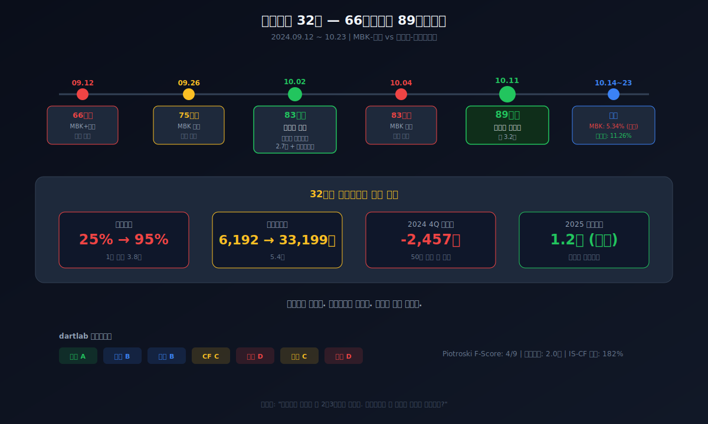
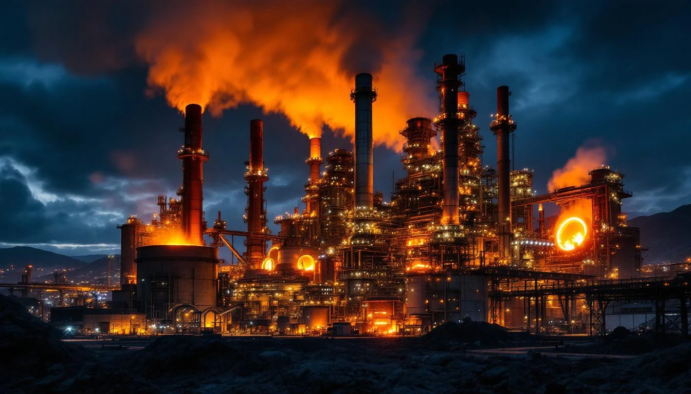
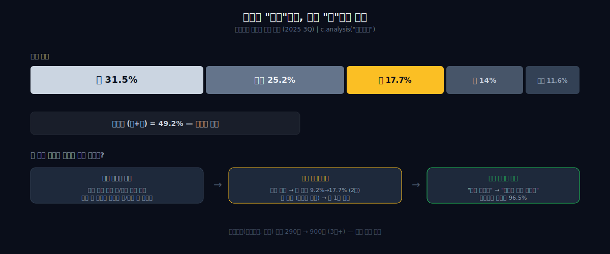
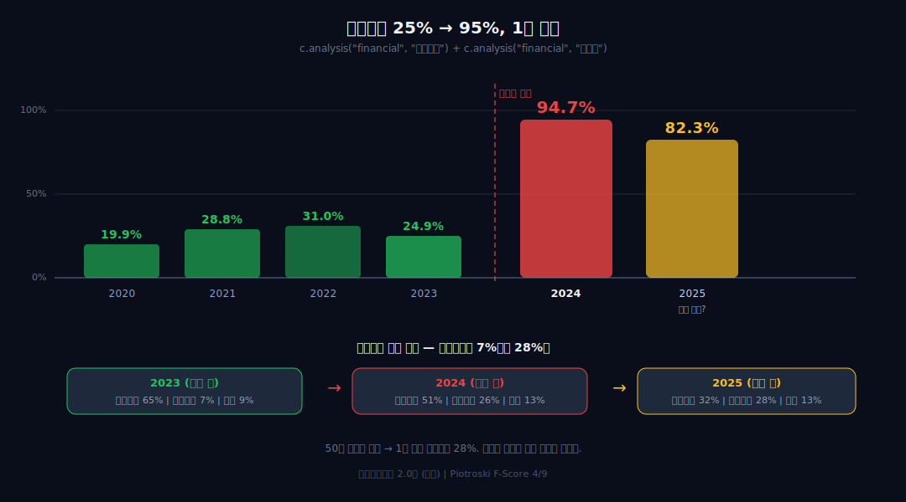

> **지배구조 + 사이클** | 소재 > 비철금속 | 2026-04-09 dartlab 실측
> 같은 시리즈: [SK하이닉스](/blog/000660-skhynix) · [삼양식품](/blog/003230-samyang-foods) · [두산에너빌리티](/blog/034020-doosan-enerbility) · [알테오젠](/blog/196170-alteogen) · [HMM](/blog/011200-hmm) · [셀트리온](/blog/068270-celltrion) · [한화에어로스페이스](/blog/012450-hanwha-aerospace) · [HD현대일렉트릭](/blog/267260-hd-hyundai-electric) · [고려아연](/blog/010130-korea-zinc) · [에이피알](/blog/278470-apr) · [기업이야기 시리즈 전체](/blog/series/company-reports)

---

<div style="position:relative;padding-bottom:56.25%;height:0;overflow:hidden;margin:2rem 0 3rem;border-radius:12px;">
<iframe src="https://www.youtube.com/embed/n9QhLmlvun8" style="position:absolute;top:0;left:0;width:100%;height:100%;border:0;" allow="accelerometer; autoplay; clipboard-write; encrypted-media; gyroscope; picture-in-picture" allowfullscreen></iframe>
</div>

## 1949년, 두 실향민이 남대문에서 만났다

```python
import dartlab
c = dartlab.Company("010130")
```

75년 전, 황해도에서 서울로 내려온 장병희와 최기호가 함께 회사를 세웠다. 영풍. 3세대까지 이어진 동업이 2024년에 깨졌다. 깨지는 비용이 재무제표에 고스란히 찍혀 있다.

2024년 4분기, 순손실 **-2,457억원**. 창사 50년 역사상 처음이다. 사업이 망해서 적자가 난 게 아니다. 경영권 방어에 2조3천억을 쏟아부었고, 부채비율 25%의 요새가 1년 만에 96%로 무너졌다.

**"경영권을 지키는 비용은 재무제표의 어디에 찍히는가?"** 이 질문으로 고려아연의 7년을 추적한다.



---

## 1막 — 돌멩이를 넣으면 22종의 금속이 나온다

### 온산 제련소 — 회수율 99%, 국가핵심기술



먼저 이 회사가 뭘 하는 회사인지부터. 고려아연은 세계 최대 **단일 비철금속 제련소**를 운영한다. 울산 온산. 연간 100만 톤 이상. 아연, 연, 동, 금, 은, 인듐, 안티모니, 비스무스, 갈륨 — **22종**의 금속을 한 공장에서 뽑아낸다.

제련 과정은 이렇다. 아연 정광(황화아연)을 900도에서 태운다(배소). 황이 날아가고 산화아연이 남는다. 이걸 황산에 녹인다(침출). 고려아연만 상용화한 **'저온-저압 헤마타이트 공법'**으로 불순물 철을 제거하고, 아연 회수율 **99%**까지 도달한다. 이 기술은 **국가핵심기술**로 지정돼 해외 매각이 법적으로 제한된다. 정제된 용액에 전류를 흘리면 음극에 순도 99.99% 아연이 석출된다.

여기서 재미있는 건 **부산물**이다. 아연 정광 안에 섞여 있던 금과 은은 황산에 녹지 않는다. 침출 잔사에 농축된 귀금속이 연(납) 제련 공정으로 넘어가고, 전해정련 과정에서 양극 슬라임에 금/은이 축적된다. **유가금속 회수율 96.5%.** 돌멩이에서 버려지는 게 거의 없다. "연금술"이라 불리는 이유다.

그런데 재무제표에서 재미있는 숫자가 보인다:

```python
c.analysis("financial", "수익구조")
```

| 금속 | 2025 3Q 매출 비중 |
|------|-----------------|
| **은** | **31.5%** |
| 아연 | 25.2% |
| 금 | 17.7% |
| 연 | 14.0% |
| 기타(인듐, 안티모니 등) | 11.6% |




### 은 31.5% > 아연 25.2% — "아연 회사"가 아니라 "귀금속 플랫폼"

**사명이 "고려아연"인데, 은 매출이 아연을 추월했다.** 귀금속(금+은) 비중이 49%. 이 회사 매출의 절반이 금과 은이다. 2024년 금 매출 비중이 전년 9.2%에서 17.7%로 2배 뛴 것은 금값 랠리 때문이다. **사업 구조가 바뀌고 있다 — "아연 제련소"가 아니라 "귀금속 회수 플랫폼"으로.**

이런 회사가 왜 경영권 전쟁을 치르게 됐는가? 그 전에, 이 회사가 왜 경쟁사가 무너지는 동안 사상 최대를 찍었는지부터.

---

## 2막 — 제련수수료 반토막인데 사상 최대. 왜?

### TC $274→$80 — 3년 만에 71% 폭락

아연 제련 업계의 수익 모델을 알아야 이 회사가 보인다. 제련소는 광산에서 정광(원석)을 받아 금속을 뽑아낸다. 그 대가로 받는 게 **TC(Treatment Charge, 제련수수료)**. 이게 제련소의 매출 기반이다.

TC 추이:

| 연도 | TC ($/톤) |
|------|----------|
| 2023 | $274 |
| 2024 | $165 |
| 2025 | **$80 (역대 최저)** |

**3년 만에 71% 폭락.** 보통 TC가 이렇게 떨어지면 제련소는 적자가 난다. 실제로 벨기에 **Nyrstar**는 파산 위기를 반복하며 2025년 호주 제련소 25% 감산, **Glencore**는 네덜란드 제련소를 가동 중단했다.

그런데 고려아연은 같은 기간 **사상 최대 실적**을 찍었다. 왜?

### 금값 +64%, 은값 +155% — 부산물이 본업을 덮었다

**부산물이다.** 1막에서 봤듯 고려아연은 아연을 뽑으면서 금, 은, 안티모니, 인듐 등 22종을 같이 회수한다. TC가 떨어져도 **귀금속 가격이 폭등**하면 부산물 수익이 TC 하락분을 덮고도 남는다. 2025년 금값 +64%, 은값 +155%. 경쟁사는 아연밖에 못 뽑는데, 고려아연은 부산물로 돈을 번다. **제련수수료가 아니라 회수율이 이 회사의 진짜 경쟁력이다.**

---

## 3막 — 안티모니 1톤에 6만 달러, 전략광물의 시대

### 중국 수출통제 → 가격 4배 — 국내 유일 생산 기업


부산물 중 하나가 터졌다. **안티모니.**

| 시기 | 안티모니 가격 ($/톤) |
|------|-------------------|
| 2024 초 | $15,000 |
| 2024.09 | 중국 수출통제 발동 |
| 2025 | **$60,000** |

**1년 만에 4배.** 중국이 세계 안티모니 공급의 50%를 차지하는데, 2024년 9월 수출통제를 걸었다. 안티모니는 방산 핵심 소재다 — 탄약 경화제, 미사일 추진체, 야간투시경 적외선 센서. 중국이 빠지자 가격이 폭등했다.

### 안티모니 영업이익 523억(전년 10배) — 전략광물 연간 5,000억 전망

고려아연은 **국내 유일 안티모니 생산 기업**이다. 온산 제련소에서 아연 정광의 부산물로 추출한다. 2025년 1분기 안티모니 생산 **971톤** (사상 최대). 안티모니로만 영업이익 **523억**(전년 10배). 전략광물 전체 매출은 290억(2024)에서 **900억**(2025 1Q)으로 3배. 연간 **5,000억** 전망.

"아연 회사"가 아니라 **"전략광물 회수 플랫폼"**으로 진화하고 있다.

---

## 4막 — 75년 동업이 왜 깨졌는가

### 영풍 5년 연속 적자 — 배당이 생존이었다

1949년 11월. 황해도 사리원에서 서울로 내려온 두 실향민이 남대문 일대에서 만났다. **장병희**(1913년생)와 **최기호**(1909년생). 한 사람은 농기계, 한 사람은 발전기를 팔며 전후 서울에서 생계를 꾸리던 사람들이었다. 동향(황해도) 출신이라는 유대로 형-동생 사이가 됐고, 함께 **영풍기업사**를 세웠다.

1974년 박정희 대통령의 중화학공업 육성 정책으로 고려아연 설립. 최기호 일가가 고려아연을, 장병희 일가가 영풍을 맡았다. 75년간 혈연보다 진한 동업. 지분은 교차 보유하며 공존했다.

3세대에 와서 깨졌다. **최윤범**(1975년생, 고려아연 회장)은 2022년 취임 후 '트로이카 드라이브'를 선언했다 — 2차전지 소재, 자원순환, 신재생에너지. 배당보다 재투자. **장형진**(1946년생, 영풍 고문)은 배당 확대와 보수 경영을 원했다. 29살 차이.

여기서 하나 알아야 할 게 있다. **영풍에게 배당은 생존이었다.** 영풍은 5년 연속 적자 — 누적 약 6,700억 영업손실. 고려아연 배당이 영풍의 유일한 현금원이었다. 장형진 일가가 연간 약 **236억**을 고려아연 배당으로 받고 있었다. 그런데 고려아연이 2023년 기말배당을 20,000원에서 **5,000원**으로 깎았다.

| 연도 | DPS (원) | 배당지급 (억) |
|------|---------|------------|
| 2020 | 14,000 | 2,599 |
| 2021 | 15,000 | 2,775 |
| 2022 | 20,000 | 3,550 |
| 2023 기말 | **5,000** | — |
| 2024 합계 | 17,500 | 3,149 |
| 2025 | 20,000 | 1,393 |

2025년 중간배당은 생략됐다 — "미국 제련소 투자 자금이 필요하다." 영풍 측은 이를 "주주 기만"이라고 불렀다. 이것이 MBK와 손잡은 직접적 트리거 중 하나다.

### 판관비 4배 — 트로이카 + 분쟁 비용이 찍힌 곳

재무제표에 이 갈등이 보이는가?

```python
c.analysis("financial", "자본배분")
```

| 연도 | 판관비 | 전년대비 |
|------|--------|---------|
| 2020 | 1,378억 | — |
| 2021 | 1,602억 | +16% |
| 2022 | 2,498억 | +56% |
| 2023 | 3,020억 | +21% |
| 2024 | **4,173억** | **+38%** |
| 2025 | **5,696억** | **+36%** |

판관비가 4년 만에 **4배**가 됐다. 2020년 1,378억 → 2025년 5,696억. 이 안에 트로이카 드라이브(2차전지, 신재생) 투자 비용 + 경영권 분쟁 비용(법률자문, 홍보, 소송수수료)이 섞여 있다. 2024년 별도 기준 지급수수료만 **905억** — 전년 449억 대비 2배.

최윤범은 돈을 쓰고 싶었고, 장형진은 나눠주고 싶었다. 재무제표에 찍힌 판관비 4배 증가가 이 갈등의 흔적이다.

그리고 2024년 9월, 장형진이 MBK파트너스 **김병주** 회장과 손을 잡았다.

---

## 5막 — 트로이카 드라이브, 돈이 되고 있는가?

### 케이잼 7,356억 투자 → 매출 0원, KPC 50억→1,783억

최윤범이 배당을 깎고 밀어붙인 재투자 — 4막에서 갈등의 원인이 된 '트로이카 드라이브'. 2차전지 소재, 자원순환, 신재생에너지. 그래서 실제로 돈이 되고 있는가?

| 자회사 | 투자 | 2025 매출 | 판정 |
|--------|------|----------|------|
| **켐코** (니켈) | 5,600억 | ~3,000억대 | 가동 중 |
| **KPC** (전구체) | — | **1,783억** (1~3Q) | 양산 시작 (2025.01). 전년 50억의 35배 |
| **케이잼** (전해동박) | **7,356억** | **0원** | **4년째 매출 0. 순손실 140억** |

**케이잼이 이 표의 핵심이다.** 7,356억을 투자했는데 4년째 매출이 0원. 건설중인 자산 2,015억. 장형진이 "최윤범이 회사 돈을 낭비한다"고 주장한 근거 중 하나가 이것이다.

반면 KPC는 양산 첫 해에 1,783억을 찍었다 — 50억에서 35배. 트로이카 드라이브가 **반은 맞고 반은 아직 모른다.** 재무제표에 이 판단이 고스란히 찍혀 있다.

---

## 6막 — 공개매수 32일, 66만원에서 89만원까지

### 66→75→83→89만원 — 32일 치킨게임

2024년 9월 12일. 추석 연휴 직전. MBK파트너스와 영풍이 고려아연 공개매수를 전격 공시한다. 주당 **66만원**. 고려아연 전일 종가 약 63만원. 프리미엄 5%뿐. 기습이었다.

9월 26일. 응모가 부진하자 MBK-영풍이 **75만원**으로 올린다.

10월 2일. 최윤범이 반격한다. 기자회견: "2조7천억 규모 자사주 공개매수를 추진한다." 주당 **83만원**. 베인캐피탈이 우군으로 참전. 자금 출처: 메리츠 1조 + SC 5천억 + 하나 4천억. **차입이다.**

10월 4일. MBK-영풍이 같은 날 **83만원**으로 맞불. 양측 동률. 치킨게임.

10월 11일. 최윤범의 마지막 승부수. 자사주 공개매수가를 **89만원**으로 올린다. 총 투입 자금 3조2,245억원. 영풍정밀 매수가도 3만원에서 3만5천원.

10월 14일. MBK-영풍 공개매수 종료. 결과: 지분 **5.34%** 확보. 목표(14.61%) 대폭 미달. 고려아연 측은 "실패"라 선언.

10월 23일. 고려아연 자사주 공개매수 종료. 204만30주(9.85%) + 베인캐피탈 1.41% = 총 **11.26%** 매입 성공.

**32일간의 전쟁.** 66→75→83→89만원. 이 32일이 재무제표에 어떤 흔적을 남겼는가?

---

## 7막 — 경영권의 가격표: 부채비율 25%에서 96%로

### 단기차입금 5.4배 — 50년 무차입 전통 1년 만에 붕괴



```python
c.analysis("financial", "자금조달")
```

| 자금 원천 | 2023 | 2024 | 변화 |
|-----------|------|------|------|
| 내부유보 | 65.1% | 51.4% | -13.7pp |
| 주주자본 | 14.3% | 11.7% | -2.6pp |
| **금융차입** | **7.1%** | **25.8%** | **+18.7pp** |
| 영업조달 | 8.9% | 12.6% | +3.7pp |

1년 만에 금융차입이 7%에서 **26%**로 뛰었다. 이유는 하나 — **자사주 공개매수 차입금.**

| 항목 | 2023 | 2024 | 변화 |
|------|------|------|------|
| 단기차입금 | 6,192억 | **33,199억** | **5.4배** |
| 장기차입금 | 1,651억 | 4,803억 | 2.9배 |
| **부채총계** | **24,041억** | **71,969억** | **3배** |
| 부채비율 | 24.9% | **94.7%** | **3.8배** |

부채비율 **25%에서 95%**. 1년 만에. 50년간 쌓아온 무차입 경영의 전통이 1번의 공개매수로 무너졌다.

### 영업이익 +10%인데 순이익 -63% — 이자·수수료가 잡아먹은 것

**IS에 찍힌 흔적:**

```python
c.analysis("financial", "이익품질")
```

| 항목 | 2023 | 2024 |
|------|------|------|
| 영업이익 | 6,599억 | 7,235억 |
| 이자비용 | ~500억 | **~1,500억+** |
| 지급수수료 | 449억 | **905억** |
| 당기순이익 | 5,334억 | **1,948억** |

영업이익은 10% 올랐는데 순이익은 **63% 줄었다.** 이자비용 3배 + 수수료 2배. 경영권을 지키는 비용이 영업에서 번 돈을 잡아먹은 것이다. 2024년 4분기에는 **순손실 -2,457억** — 50년 만에 첫 적자.

**CF에 찍힌 흔적:**

dartlab 스코어카드 플래그: *"IS-CF 괴리 182% — 순이익 대비 현금흐름 극심한 차이."*

Piotroski F-Score **4/9**. ROA 개선 X, CF>순이익 X, 장기부채 감소 X, 자산회전율 개선 X. 4개 항목이 불통과. 재무 건전성 신호가 **절반 이상 빨간불**이다.

교과서에서 자사주 매입은 "주주환원"이다. 이 회사에서 자사주 매입은 **무기**다. 그 무기의 가격이 재무제표 전체에 찍혀 있다.

**소각해도 빚은 남는다.** 204만30주(발행주식 9.85%)를 3차에 걸쳐 소각한다. 소각하면 적 측 지분 희석 + EPS 상승. 그런데 주식은 사라져도 차입금은 그대로다. 2025년 4월 공모채 **7,000억원** 발행 — 단기 차입을 장기로 바꾸는 것. 경영권은 지켰지만 이자비용은 수년간 이익을 갉아먹는다.

```python
c.analysis("financial", "안정성")
```

| 연도 | 부채비율 | 이자보상배율 |
|------|---------|------------|
| 2021 | 28.8% | 높음 |
| 2022 | 31.0% | 높음 |
| 2023 | 24.9% | 높음 |
| 2024 | **94.7%** | **2.0배** |
| 2025 | **82.3%** | 개선 중 |

이자보상배율 **2.0배**. dartlab 플래그: *"이자 부담 과다."* 영업이익으로 이자를 겨우 2번 갚을 수 있는 수준. 2023년까지 이 회사는 이자 걱정을 해본 적이 없었다.

---

## 8막 — 2025년 사상 최대 실적, 그런데 왜?

### 매출 16.5조(+37.6%), 영업이익 1.2조(+70%) — 금은이 밀어올렸다

전쟁이 재무제표를 깨뜨리는 동안, 사업은 사상 최대를 찍었다.

```python
c.select("IS", ["매출액", "영업이익", "당기순이익"], freq="Y")
```

| 연도 | 매출 | 영업이익 | 순이익 |
|------|------|---------|--------|
| 2020 | 75,819억 | 8,974억 | 5,748억 |
| 2021 | 99,768억 | **10,961억** | 8,111억 |
| 2022 | 112,194억 | 9,192억 | 7,983억 |
| 2023 | 97,045억 | 6,599억 | 5,334억 |
| 2024 | 120,529억 | 7,235억 | **1,948억** |
| 2025 | **165,879억** | **12,319억** | 7,702억 |

2025년 매출 165,879억(+37.6%), 영업이익 12,319억(+70.4%). 사상 최대. 이유는 2막에서 봤다 — 은과 금이다. 금값 랠리 + 은 수요 폭발(태양광 패널)이 귀금속 부산물 매출을 밀어올렸다. 전략광물(안티모니, 인듐) 매출도 290억에서 900억으로 3배.

그런데 2024년 순이익 1,948억은 전년 5,334억의 **37%**. 영업이익은 올랐는데 순이익은 급감. 경영권 분쟁 비용(이자+수수료)이 영업 성과를 잡아먹은 것이다. 2025년에 순이익이 7,702억으로 회복된 건 분쟁 비용이 줄었기 때문.

**"사업은 역대 최고인데, 주인 싸움이 돈을 태웠다."** 이것이 재무제표가 말하는 2024년이다.

---

## 9막 — 미국 10조 제련소, 경영권 방어의 마지막 수

### 크루서블 유증 2.8조 — 미 정부 지분 10.59%가 CFIUS 방패

2025년 12월. 고려아연 이사회가 의결한다. 미국 테네시주 클락스빌에 **10조9,500억원** 규모 비철금속 제련소 건설. 아연 30만톤/년, 연 20만톤, 희소금속 5,100톤. 2027~2029년 건설.

동시에 **크루서블(Crucible JV LLC)** 대상 제3자 배정 유상증자 **2조8,508억원**. 신주 220만9,716주, 주당 129만133원. 크루서블은 미 정부 측 투자 파트너. 유증 완료 시 미 정부 측이 고려아연 지분 **10.59%**를 확보하고, 최윤범 측 우호 지분은 최대 **45.5%**까지 확대된다.

이게 뭘 의미하는가. 트럼프 행정부의 전략광물 정책 + 탈중국 공급망 재편. 미국 IRA(인플레이션감축법)는 배터리 핵심광물의 미국·FTA국 가공을 요구하고, CFIUS(외국인투자심의위)는 전략광물 관련 M&A를 국가안보 차원에서 심사한다. 고려아연은 이 제도적 틀을 **경영권 방어 수단으로도 활용**한 것이다. 미 정부가 주주가 되면, MBK-영풍이 적대적 M&A를 재시도할 때 CFIUS 심사를 피할 수 없다. **국가 안보가 경영권 방어의 변수가 되는** 전례 없는 전략.

영풍-MBK는 신주발행금지 가처분을 신청했다. 서울중앙지법이 **기각**. 유증 진행이 허용됐다.

재무제표에 이 10조가 어떻게 찍히는가. 크루서블 유증 2.8조가 완료되면 자본이 커진다 — 부채비율이 내려갈 수 있다. 동시에 테네시 건설 CAPEX가 2027~2029년에 걸쳐 찍힌다 — 차입이 더 늘어날 수 있다. **경영권 전쟁의 비용은 끝나지 않았다. 전쟁 후유증이 미국 제련소라는 형태로 재무제표에 계속 찍힌다.** 이 투자가 매출로 돌아오는 건 2030년 이후다.

---

## 10막 — 7막의 빚이 현금흐름에 찍혔다

### FCF 2년 연속 대규모 마이너스 — 자사주 상환 + 테네시 CAPEX

7막에서 부채가 뛰는 걸 봤다. 이제 그 빚이 **현금흐름**에서 어떻게 보이는지.

```python
c.analysis("financial", "현금흐름")
```

| 연도 | 영업CF (억) | FCF (억) |
|------|-----------|---------|
| 2022 | 3,655 | 4,054 |
| 2023 | 2,855 | 3,821 |
| 2024 | **-8,019** | **-6,142** |
| 2025 | **-4,025** | **-15,712** |

**FCF가 2년 연속 대규모 마이너스.** 영업이익은 사상 최대인데 현금이 나가고 있다. 2024년 -6,142억, 2025년 -15,712억.

왜? 두 가지가 겹쳤다. **첫째 — 자사주 매입 차입금 상환.** 2조3천억을 빌려서 자사주를 샀고, 그 빚을 갚고 있다. **둘째 — 테네시 제련소 투자.** CAPEX가 대규모로 나가기 시작했다. 사업에서 번 돈이 경영권 방어 빚 상환 + 미래 투자에 전부 빨려 들어가는 구조.

경영권을 지키는 비용이 BS(부채)뿐 아니라 **CF(현금흐름)**에도 찍히고 있다. 그리고 이건 아직 끝나지 않았다.

---

## 11막 — 현재가 148만원, 적정가 28만원. 5배 괴리의 정체

### DCF 28만원 vs 시장 148만원 — 경영권+귀금속+전략광물 프리미엄

dartlab이 산출한 고려아연 적정가: **약 28만원**. 시장가: **148만원**. **5배.**

```python
c.analysis("valuation", "가치평가")
```

dartlab DCF 가정: WACC 9.2%, 영구성장률 2%, 직전 5년 평균 FCF 기준. 경영권 프리미엄·전략광물 프리미엄은 DCF에 반영되지 않는다 — 이것이 괴리의 핵심이다. 28만원은 "아연 제련소"로서의 가치이고, 148만원은 시장이 보는 "전략광물 플랫폼 + 경영권"의 가치다.

이 괴리는 뭔가? 크게 세 가지가 섞여 있다:

1. **경영권 프리미엄** — 공개매수 치킨게임에서 83~89만원이 "경영권의 가격"으로 찍혔다. 시장은 이 가격을 기억한다.

2. **귀금속 사이클** — 금은 가격이 구조적으로 올라가는 중. 은 매출이 아연을 추월한 시점부터, 이 회사의 밸류에이션 기준이 "아연 제련소"에서 "귀금속 플랫폼"으로 바뀌고 있다.

3. **전략광물 프리미엄** — 미국 제련소 + 크루서블 유증. 탈중국 공급망에서 고려아연의 위치가 "비철금속 제련"에서 "전략광물 공급자"로 격상.

dartlab 스코어카드:

| 영역 | 등급 |
|------|------|
| 성장성 | A |
| 수익성 | B |
| 안정성 | B |
| 이익품질 | C |
| 재무정합성 | D |
| 효율성 | D |
| 현금흐름 | C |

성장A이지만 재무정합D, 효율D. **"성장은 하는데 재무가 따라가지 못하는"** 상태. 경영권 분쟁이 재무 지표를 오염시킨 것이다. 분쟁이 정리되면 이 등급이 회복되는지가 다음 질문이다.

---

## 12막 — 대법원, 2026년 4월 2일

2026년 4월 2일. 대법원 1부.

MBK-영풍의 '의결권 행사 허용 가처분 기각' 불복 재항고를 **최종 기각**. 1심-2심-대법원 **3심 전패**. 고려아연의 호주 자회사 SMH를 통한 영풍 상호주 의결권 제한이 **적법**하다는 결론. "고려아연 경영진이 배임행위를 했다거나 자본시장법을 위반했다고 보기 어렵다."

최윤범이 경영권을 지켰다. 2025년 3월 주총 이사회 11대4, 2026년 3월 주총 이사회 9대5. MBK-영풍은 수세.

전쟁이 끝났다. 그런데 전쟁의 비용은 재무제표에 남아 있다.

---

## 이 회사를 계속 열어볼 숫자

**1. 부채비율 회복 속도** — 95%에서 어디까지 내려오는가. 공모채 7,000억 발행으로 단기→장기 전환 시작. 3~5년 내 50% 이하 회복이 목표일 것.

**2. 이자보상배율** — 2.0배에서 올라가는가. 영업이익 1.2조가 유지되면 차입 축소와 함께 개선. 3배 이하면 여전히 경고.

**3. 귀금속 매출 비중** — 금+은 49%. 금값이 빠지면? 아연만으로 이 실적을 유지할 수 있는가. 귀금속 사이클 의존도.

**4. 테네시 제련소 착공/진행** — 10.9조 투자의 타임라인. CAPEX가 언제 어떤 규모로 찍히는가. 차입이 더 늘어나는가.

**5. 크루서블 유증 후 지분 구조** — 최윤범 우호 45.5% 확보 시 경영권 완전 안정. 그때 재무제표가 "전쟁 전"으로 돌아갈 수 있는가.

---

사명에 '아연'이 박혀 있지만 이 회사를 먹여 살리는 건 이미 은이다. 75년 동업을 끝내는 데 2조3천억이 들었다. 부채비율 25%에서 96%. 50년 만에 첫 순손실. 모든 숫자가 전쟁 전과 다르다.

전쟁은 끝났다. 이제 남은 질문은 하나다 — **이 회사가 전쟁 전의 재무제표로 돌아갈 수 있는가.**

```python
# 이 글의 모든 숫자를 직접 확인하려면
c.show("IS", freq="Y")
c.show("BS", freq="Y")
c.show("CF", freq="Y")
c.analysis("financial", "자금조달")
c.analysis("financial", "안정성")
c.analysis("financial", "이익품질")
c.analysis("financial", "자본배분")
c.analysis("financial", "종합평가")
c.review()
```

---

### 재무제표 8년 — IS / BS / CF

### 손익계산서 (IS)

| 항목 (억원) | 2025 | 2024 | 2023 | 2022 | 2021 | 2020 | 2019 | 2018 |
|---|---:|---:|---:|---:|---:|---:|---:|---:|
| 매출 | 165,879 | 120,529 | 97,045 | 112,194 | 99,768 | 75,819 | 66,948 | 68,833 |
| 매출총이익률 | 10.9% | 9.5% | 9.9% | 10.4% | 12.6% | 13.7% | 14.2% | 13.1% |
| 영업이익 | 12,319 | 7,235 | 6,599 | 9,192 | 10,961 | 8,974 | 8,053 | 7,647 |
| 영업이익률 | 7.4% | 6.0% | 6.8% | 8.2% | 11.0% | 11.8% | 12.0% | 11.1% |
| 순이익 | 7,702 | 1,948 | 5,334 | 7,983 | 8,111 | 5,748 | 4,971 | 5,348 |
| 판관비 | 5,696 | 4,173 | 3,020 | 2,498 | 1,602 | 1,378 | 1,459 | 1,393 |

### 재무상태표 (BS)

| 항목 (억원) | 2025 | 2024 | 2023 | 2022 | 2021 | 2020 |
|---|---:|---:|---:|---:|---:|---:|
| 총자산 | 203,957 | 147,923 | 120,461 | 120,979 | 99,640 | 84,996 |
| 부채 | 92,115 | 71,969 | 24,041 | 28,662 | 22,298 | 14,126 |
| 자본 | 111,842 | 75,954 | 96,420 | 92,317 | 77,342 | 70,870 |
| 단기차입금 (억) | 30,473 | 33,199 | 6,192 | 7,916 | 2,955 | 1,154 |
| 장기차입금 (억) | 10,728 | 4,803 | 1,651 | 2,055 | 1,261 | 47 |
| 현금 (억) | 34,511 | 8,938 | 6,768 | 7,810 | 4,665 | 4,256 |
| 부채비율 | 82.3% | 94.7% | 24.9% | 31.0% | 28.8% | 19.9% |

### 자금조달 비중

| 원천 | 2025 | 2024 | 2023 | 2021 |
|------|------|------|------|------|
| 내부유보 | 32.1% | 51.4% | 65.1% | 75.5% |
| 금융차입 | 28.1% | 25.8% | 7.1% | 4.3% |
| 영업조달 | 12.9% | 12.6% | 8.9% | 11.7% |

---


### 외부 출처

- [경영권 분쟁 전체 타임라인](https://namu.wiki/w/%EA%B3%A0%EB%A0%A4%EC%95%84%EC%97%B0%20%EA%B2%BD%EC%98%81%EA%B6%8C%20%EB%B6%84%EC%9F%81)
- [대법원 최종 판결](https://heraldk.com/2026/04/02/%EB%8C%80%EB%B2%95%EC%9B%90-%EA%B3%A0%EB%A0%A4%EC%95%84%EC%97%B0-%E2%80%98%EC%83%81%ED%98%B8%EC%A3%BC-%EC%9D%98%EA%B2%B0%EA%B6%8C-%EC%A0%9C%ED%95%9C%E2%80%99-%EC%A0%81%EB%B2%95-%ED%8C%90%EA%B2%B0/)
- [세계 최대 단일 제련소](https://www.sedaily.com/article/20016663)
- [전략광물 매출 3배](https://www.ferrotimes.com/news/articleView.html?idxno=44217)
- [TC 역대 최저에도 사상 최대](https://www.creditnews.kr/news/articleView.html?idxno=2575)

### 검증표

| 본문 수치 | 출처 |
|-----------|------|
| 2024 4Q 순손실 -2,457억 (50년 만에 첫 적자) | 서울신문 (2025.03) |
| 2025 매출 16.6조, 영업이익 1.2조 (사상 최대) | 중앙이코노미뉴스 |
| 은 매출 31.5%, 아연 25.2%, 금 17.7% | 페로타임즈, 더퍼블릭 |
| 유가금속 회수율 96.5% | 이투데이, 파이낸셜뉴스 |
| 헤마타이트 공법 국가핵심기술 | 한경 비즈니스 |
| 1949년 장병희+최기호 영풍기업사 | 한국경제, 한국민족문화대백과 |
| MBK 공개매수 66→75→83만원 | 한국경제, 한국일보, 뉴스투데이 |
| 최윤범 자사주 83→89만원 | 뉴스핌, 파이낸셜뉴스 |
| MBK 결과 5.34%, 고려아연 11.26% | 디지털투데이 |
| 유상증자 2.5조 → 하한가, 시총 9.6조 증발 | 뉴스1, 글로벌이코노믹, 경향신문 |
| 별도 지급수수료 905억 (전년 2배) | 서울신문 |
| 자사주 204만주 3차 소각 | 서울신문 (2025.05) |
| 테네시 제련소 10.9조 | 한국경제 (2025.12) |
| 크루서블 유증 2.8조, 미 정부 10.59% | EBN뉴스 |
| 대법원 3심 기각 (2026.04.02) | 헤럴드경제, 더퍼블릭 |
| 부채비율 25%→95%, 단기차입 5.4배 | dartlab 실측 |
| 판관비 1,378→5,696억 (4배) | dartlab 실측 |
| 스코어카드 성장A, 재무정합D, 효율D | dartlab 실측 |
| Piotroski F-Score 4/9 | dartlab 실측 |

---

<!-- AUTO:START — sync_financials.py가 자동 생성. 수동 편집 금지 -->

## 공시 / Filings

| 기간 | 보고서 | 링크 |
|------|--------|------|
| 2025 | [기재정정]사업보고서 (2025.12) | [DART에서 보기](https://dart.fss.or.kr/dsaf001/main.do?rcpNo=20260325000008) |
| 2025 | 사업보고서 (2025.12) | [DART에서 보기](https://dart.fss.or.kr/dsaf001/main.do?rcpNo=20260316000929) |
| 2025 | 분기보고서 (2025.09) | [DART에서 보기](https://dart.fss.or.kr/dsaf001/main.do?rcpNo=20251113000491) |
| 2025 | 반기보고서 (2025.06) | [DART에서 보기](https://dart.fss.or.kr/dsaf001/main.do?rcpNo=20250814002321) |
| 2025 | 분기보고서 (2025.03) | [DART에서 보기](https://dart.fss.or.kr/dsaf001/main.do?rcpNo=20250515001780) |
| 2024 | [기재정정]사업보고서 (2024.12) | [DART에서 보기](https://dart.fss.or.kr/dsaf001/main.do?rcpNo=20250331003521) |
| 2024 | 사업보고서 (2024.12) | [DART에서 보기](https://dart.fss.or.kr/dsaf001/main.do?rcpNo=20250320001542) |
| 2024 | 분기보고서 (2024.09) | [DART에서 보기](https://dart.fss.or.kr/dsaf001/main.do?rcpNo=20241113000731) |
| 2024 | 반기보고서 (2024.06) | [DART에서 보기](https://dart.fss.or.kr/dsaf001/main.do?rcpNo=20240814000817) |
| 2024 | 분기보고서 (2024.03) | [DART에서 보기](https://dart.fss.or.kr/dsaf001/main.do?rcpNo=20240514001401) |

> 전체 공시 목록은 dartlab에서 확인:
> ```python
> import dartlab
> c = dartlab.Company("010130")
> c.filings()
> ```

## 재무제표 — 최근 5개년

> 아래는 최근 5개년 요약입니다. 전체 기간·분기별 데이터는 dartlab에서 직접 확인할 수 있습니다:
> ```python
> import dartlab
> c = dartlab.Company("010130")
> c.show("IS")              # 손익계산서 (분기)
> c.show("IS", freq="Y")    # 손익계산서 (연간)
> c.show("BS")              # 재무상태표
> c.show("CF")              # 현금흐름표
> c.show("SCE")             # 자본변동표
> c.show("ratios")          # 재무비율
> ```

### 손익계산서 (IS) — 단위 억원

| 항목 | 2025 | 2024 | 2023 | 2022 | 2021 |
|---|---:|---:|---:|---:|---:|
| 매출액 | 165,879 | 120,529 | 97,045 | 112,194 | 99,768 |
| 매출원가 | 147,863 | 109,121 | 87,426 | 100,504 | 87,205 |
| 매출총이익 | 18,015 | 11,408 | 9,619 | 11,690 | 12,563 |
| 판매비와관리비 | 5,696 | 4,173 | 3,020 | 2,498 | 1,602 |
| 영업이익 | 12,319 | 7,235 | 6,599 | 9,192 | 10,961 |
| 금융수익 | — | — | — | — | — |
| 금융비용 | — | — | — | — | — |
| 당기순이익 | 7,702 | 1,948 | 5,334 | 7,983 | 8,111 |

### 재무상태표 (BS) — 단위 억원

| 항목 | 2025 | 2024 | 2023 | 2022 | 2021 |
|---|---:|---:|---:|---:|---:|
| 자산총계 | 203,957 | 147,923 | 120,461 | 120,979 | 99,640 |
| 유동자산 | 120,693 | 75,671 | 55,717 | 60,711 | 56,890 |
| 비유동자산 | 83,264 | 72,252 | 64,744 | 60,268 | 42,750 |
| 부채총계 | 92,115 | 71,969 | 24,041 | 28,662 | 22,298 |
| 유동부채 | 61,275 | 63,663 | 19,028 | 23,191 | 17,705 |
| 비유동부채 | 30,840 | 8,306 | 5,012 | 5,471 | 4,593 |
| 자본총계 | 111,842 | 75,954 | 96,420 | 92,317 | 77,342 |

### 현금흐름표 (CF) — 단위 억원

| 항목 | 2025 | 2024 | 2023 | 2022 | 2021 |
|---|---:|---:|---:|---:|---:|
| 영업활동현금흐름 | -6,282 | 5,158 | 8,209 | 7,847 | 6,069 |
| 투자활동현금흐름 | -4,411 | -13,550 | -6,225 | -17,968 | -5,777 |
| 재무활동현금흐름 | — | — | — | — | — |

### 자본변동표 (SCE) — 단위 억원

| 항목 | 2025 | 2024 | 2023 | 2022 | 2021 |
|---|---:|---:|---:|---:|---:|
| 회계정책변경 | — | — | — | — | — |
| 지분법자본변동 | 0.0 | 0.0 | 0.0 | -14 | -2 |
| 기초자본 | 75,954 | 16,217 | 10,859 | -89 | -535 |
| 유상증자 | 3 | 0.0 | 5,272 | 4,717 | 10 |
| 현금흐름위험회피 | 0.0 | — | 0.0 | -69 | -6 |
| 연결범위변동 | 0.0 | 0.0 | 0.0 | 1,439 | — |
| 전환사채 | — | 0.0 | 0.0 | -5 | — |
| 배당 | 31 | 3,096 | 0.0 | 3,535 | 2,651 |
| 기말자본 | 2,465 | 16,190 | -669 | 90,427 | 76,077 |
| 자본변동합계 | — | — | — | 14,350 | 93 |
| FVOCI평가 | 974 | 0.0 | -357 | 6 | 342 |
| 해외사업환산 | 0.0 | 2,826 | 0.0 | 526 | 878 |
| 연결범위내거래 | 0.0 | 0.0 | 0.0 | -66 | — |
| 비지배지분변동 | 0.0 | 0.0 | 72 | — | — |
| 당기순이익 | 0.0 | 1,948 | 61 | — | — |

*최종 갱신: 2026-04-12 | dartlab 실측 (DART 공시 기준)*

<!-- AUTO:END -->
