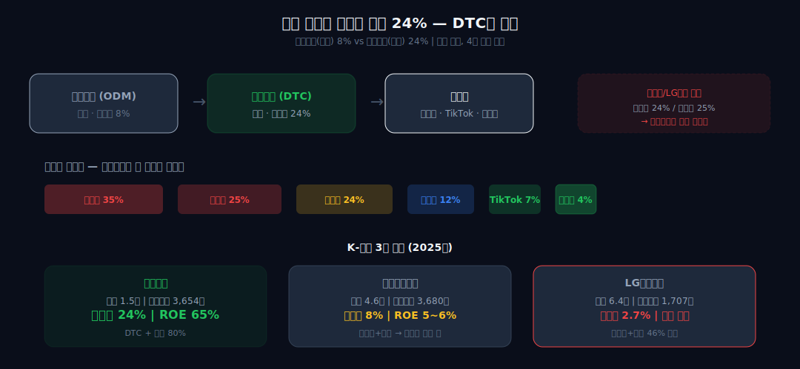
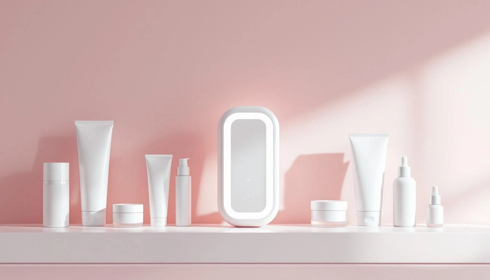
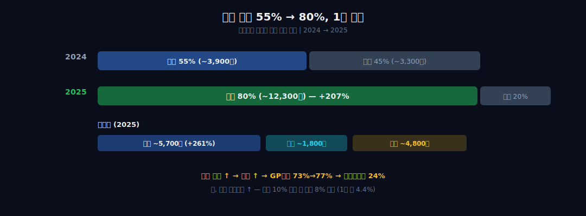

<script>
import ComboChart from '$lib/components/blog/ComboChart.svelte';
import StackBar from '$lib/components/blog/StackBar.svelte';
</script>

> **성장** | 소비재 > 화장품 | 2026-04-09 dartlab 실측
> 같은 시리즈: [SK하이닉스](/blog/000660-skhynix) · [삼양식품](/blog/003230-samyang-foods) · [두산에너빌리티](/blog/034020-doosan-enerbility) · [알테오젠](/blog/196170-alteogen) · [HMM](/blog/011200-hmm) · [셀트리온](/blog/068270-celltrion) · [한화에어로스페이스](/blog/012450-hanwha-aerospace) · [HD현대일렉트릭](/blog/267260-hd-hyundai-electric) · [고려아연](/blog/010130-korea-zinc) · [에이피알](/blog/278470-apr) · [기업이야기 시리즈 전체](/blog/series/company-reports)

---

## 코스맥스가 만들고, 에이피알이 판다. 마진은 누가 가져가는가?

```python
import dartlab
c = dartlab.Company("278470")
```

코스맥스의 영업이익률은 8%. 에이피알의 영업이익률은 **24%**. 같은 화장품인데 만드는 사람보다 파는 사람이 **3배**를 번다. 직접 만들지도 않으면서.

그런데 이 회사는 화장품만 파는 게 아니다. 매출의 27%가 **가전**이다. 에이지알 뷰티 디바이스 — 4,070억원. 해외 매출 비중이 1년 만에 55%에서 **80%**로 뛰었다. 미국 +261%.

가전이 화장품의 마진을 올리고, DTC가 유통 마진을 가져오고, 해외가 판가를 높인다 — 세 가지가 같은 방향으로 **마진 24%**를 만든다. dartlab 스코어카드에 **A가 6개**. ROE **65%**. K-뷰티에서 이런 재무제표를 본 적이 없다.

**"왜 이 회사만 마진 24%인가?"** 이 질문 하나로 에이피알의 재무제표를 추적한다.

---

## 1막 — 화장품 회사의 재무제표에 "가전" 4,070억이 찍혀 있다

### 매출 5년 만에 7배, 영업이익률 6.6% → 23.9%


```python
c.select("IS", ["매출액", "영업이익"], freq="Y")
```

| 연도 | 매출 | 영업이익 | 영업이익률 | 매총이익률 |
|------|------|---------|-----------|----------|
| 2020 | 2,199억 | 145억 | 6.6% | 73.4% |
| 2021 | 2,591억 | 143억 | 5.5% | 72.4% |
| 2022 | 3,977억 | 392억 | 9.9% | 73.3% |
| 2023 | 5,238억 | 1,042억 | 19.9% | 75.5% |
| 2024 | 7,228억 | 1,227억 | 17.0% | 75.2% |
| 2025 | **15,273억** | **3,655억** | **23.9%** | **76.6%** |

매출 5년 만에 **7배**. 2,199억에서 1조5,273억. 영업이익률은 6.6%에서 23.9%로 뛰었다. 매출총이익률 **76.6%** — 화장품이라 원가가 낮다. 매출의 4분의 3이 그대로 이익이다.

그런데 이 매출의 구성이 이상하다. 에이피알은 화장품 회사다. 메디큐브(medicube)라는 스킨케어 브랜드를 판다. 그런데 2021년부터 **에이지알(AGE-R)**이라는 뷰티 디바이스를 팔기 시작했다. 중주파+미세전류+EMS+LED를 결합한 홈케어 기기. 가전이다. 누적 **600만대** 판매.

| 카테고리 | 2023 | 2024 | 2025 |
|----------|------|------|------|
| 화장품 (메디큐브) | 3,076억 | 4,102억 | ~11,200억 |
| **디바이스 (에이지알)** | 2,162억 | 3,126억 | **4,070억** |

매출의 **27%가 가전**. 화장품 회사의 재무제표에 가전 4,070억이 찍혀 있다.

### 디바이스 1대 + 세럼 3~4개 = 객단가 50만원 — 화장품 단독의 15배

**왜 화장품 회사가 가전을 파는가?** 디바이스가 화장품의 흡수력을 높인다. 사용자가 디바이스를 쓰면 전용 세럼을 같이 사야 한다 — 디바이스가 화장품 리텐션을 만들고, 화장품이 디바이스의 소모품이 된다. **병용 효과**. 이것이 단일 브랜드 1.4조의 구조다.

최신 모델 **에이지알 부스터 프로**: 중주파(RF)+미세전류(EMS)+LED+초음파+냉각+이온도입, **6-in-1**. 가격 54만원(국내) / $499(미국). 의료기기가 아니라 "뷰티 디바이스"로 분류되기 때문에 FDA 인허가 없이 판매 가능 — 진입 장벽이 낮은 대신 경쟁도 빠르다.

디바이스+세럼 병용 구매가 객단가를 올리고, 그것이 **마진 24%의 첫 번째 기둥**이다. 디바이스 한 대 팔면 세럼 3~4개가 같이 팔린다. 디바이스 객단가 40만원 + 세럼 12만원 = 1인당 결제 50만원+. 화장품만 팔면 2~3만원인 객단가가 **15배**가 되는 구조.

---

## 2막 — 직접 만들지 않는데 마진 24%. 어떻게?

### 백화점 수수료 24% vs 자사몰 3~5% — 그 차이가 마진에 쌓인다



이 회사의 화장품은 **코스맥스**가 만든다. ODM(위탁개발생산). 에이피알은 기획과 마케팅과 판매를 한다. 제조는 안 한다.

여기서 이상한 숫자가 나온다.

| 회사 | 역할 | 영업이익률 |
|------|------|-----------|
| 코스맥스 | 제조 (ODM) | 5~7% |
| **에이피알** | **판매 (DTC)** | **24%** |

같은 제품의 공급 체인에서 만드는 쪽이 5%, 파는 쪽이 24%. **4배 차이.** 왜?

답은 **DTC(Direct-to-Consumer)**에 있다. 에이피알은 중간 유통을 거치지 않는다. 아마존, TikTok Shop, 자사몰로 소비자에게 직접 판다. 이게 얼마나 큰 차이인지, 채널별 수수료를 보면 바로 안다:

| 채널 | 수수료/마진 | 브랜드 수취 |
|------|----------|----------|
| 백화점 | 판매수수료 **24%** + 인테리어/판촉 | ~70% |
| 면세점 | 수수료 **15~25%** + 다이궁 마진 | ~65% |
| 홈쇼핑 | 수수료 **30~40%** | ~60% |
| 아마존/쿠팡 | 수수료 **10~15%** | ~85% |
| **TikTok Shop** | 수수료 **5~8%** + 크리에이터 커미션 | **~85%** |
| **자사몰 DTC** | PG수수료 **3~5%**만 | **~95%** |

아모레퍼시픽이 백화점에서 24% 수수료를 내는 동안, 에이피알은 자사몰에서 3~5%만 낸다. **그 차이 20%가 에이피알의 마진에 쌓인다.** 에이피알은 이 절약분을 TikTok 인플루언서 마케팅에 재투자한다 — 고정비가 아니라 **변동비**(커미션 기반)로 쓰니까 매출이 줄면 비용도 줄어드는 구조다.

```python
c.analysis("financial", "비용구조")
```

| 항목 | 2023 | 2024 | 2025 |
|------|------|------|------|
| 원가율 | 24.5% | 24.8% | 23.3% |
| 판관비율 | 55.6% | 58.2% | 52.7% |
| 영업이익률 | 19.9% | 17.0% | **23.9%** |

원가율이 **23~25%**. 매출 100원 중 원가가 23원. 나머지 77원 중 판관비(마케팅+물류+인건비)로 53원 쓰고, 영업이익 24원. 판관비가 줄어드는 추세다 — 2024년 58.2%에서 2025년 52.7%로 5.5%p 감소. 매출이 2배 뛰면서 고정비가 희석된 것이다.

### 판관비율 66.8% → 52.7% — 매출이 2배 뛰면 고정비가 희석된다

**또 하나 — 해외 판가가 국내보다 높다.** 같은 제품을 해외에서 더 비싸게 팔 수 있으니, 해외 비중이 올라갈수록 GP 마진이 올라간다. 매출총이익률이 73%에서 76.6%로 오른 이유 중 하나.

---

## 3막 — 해외 80%가 마진을 더 올린다

### 미국 +261%, 일본 +262% — 국내는 오히려 -9%





마진 24%의 세 번째 엔진: **해외 판가가 국내보다 높다.**

2024년 해외 매출 비중 55%. 2025년 **80%**. 1년 만에 25%p 점프.

| 지역 | 2024 | 2025 | 성장률 |
|------|------|------|--------|
| 미국 | ~1,600억 | ~5,700억 | **+261%** |
| 일본 | ~600억 | ~1,800억 | **+262%** |
| 기타 해외 | | ~4,800억 | |
| **해외 합계** | ~3,900억 | **~12,300억** | **+207%** |
| 국내 | ~3,300억 | ~3,000억 | -9% |

국내는 오히려 줄었다. 해외가 **3배**가 된 것이다. 

그런데 미국·일본만 터진 게 아니다. **인도**와 **유럽**도 열리고 있다.

미국·일본 다음의 세 번째 엔진이 열리고 있다. 인도(뷰티 디바이스 공백), 유럽(성분 중심→디바이스 진입), 의료기기(FDA 진입 장벽으로 해자 구축) — 방향은 같다: DTC 채널 확대 + 디바이스 해자 강화.

**인도 — Nykaa 입점.** 인도 최대 뷰티 이커머스 Nykaa(온라인 MAU 2억+, 오프라인 200개 매장). 에이피알은 2025년 Nykaa에 입점하며 인도 시장에 진출했다. 인도 뷰티 시장 규모 약 200억 달러(2025년), 연 15%+ 성장. K-뷰티에 대한 인식이 이미 K-드라마/K-팝으로 형성돼 있다. 달바글로벌이 러시아에서 '서방 브랜드 철수'라는 진공을 잡았듯, 에이피알은 인도에서 '프리미엄 뷰티 디바이스 공백'을 노린다.

**유럽 — 20개국 유통 계약.** 2025년 하반기 유럽 20개국 오프라인 유통 계약 체결. 세포라 유럽, 더글라스(독일 뷰티 리테일 1위) 등. 디바이스가 유럽에서도 통하는가가 관건 — 유럽은 '기기'보다 '성분' 중심 뷰티 문화.

**의료기기 R&D 120억.** 에이피알이 2025년 R&D에 120억을 투입하며 의료기기 진출을 발표했다. 뷰티 디바이스(FDA 불필요)에서 의료기기(FDA 510(k) 필요)로 올라가면 진입 장벽이 높아지고, 가격도 올라간다. 성공하면 디바이스 매출의 다음 단계.

### 재고자산 4.4배, 환율 민감도 8% — 해외 폭발기의 비용

이 해외 확장이 재무제표에 구조적 변화를 만든다:

**첫째 — 환율 민감도.** 매출의 80%가 달러/엔/유로. 원화가 강해지면 매출이 줄어든다. 달러가 10% 떨어지면 매출이 약 8% 깎이는 구조. 이건 1년 전에는 4.4%였다.

**둘째 — 마진 개선.** 해외 판가가 높으니 해외 비중이 올라갈수록 매출총이익률이 올라간다. 2020년 73.4% → 2025년 76.6%. 3.2%p는 해외 믹스 개선의 효과.

**셋째 — 재고 폭증.** dartlab 플래그: *"재고자산 +51% 급증."* 해외 물류 리드타임이 길어지면서 재고를 미리 쌓아야 한다.

```python
c.select("BS", ["재고자산"], freq="Y")
```

| 연도 | 재고자산 |
|------|---------|
| 2021 | 378억 |
| 2022 | 505억 |
| 2023 | 565억 |
| 2024 | 1,097억 |
| 2025 | **1,655억** |

4년 만에 **4.4배**. 2024→2025 +51%. HD현대일렉트릭의 수주 폭발기 재고 패턴과 같은 구조다 — 수요가 터지면 재고가 먼저 늘어난다. 울타뷰티 1,400개 매장 입점 직후 30% SKU가 품절이었으니, 이건 팔리지 않은 재고가 아니라 **부족해서 더 쌓은 것**이다.

**넷째 — 현금 흐름.**

```python
c.select("CF", ["영업활동현금흐름"], freq="Y")
```

| 연도 | 영업CF | 영업이익 | OCF/OI |
|------|--------|---------|--------|
| 2021 | 46억 | 143억 | 32% |
| 2022 | 316억 | 392억 | 81% |
| 2023 | 1,078억 | 1,042억 | 103% |
| 2024 | 791억 | 1,227억 | 64% |
| 2025 | **3,410억** | **3,655억** | **93%** |

2024년 OCF/OI가 64%로 낮았다 — 이익이 현금으로 안 따라왔다. 재고 비축 + 해외 매출채권 증가 때문. 2025년에 93%로 회복. **해외 폭발기에는 현금이 한 박자 늦게 따라온다.**

---

## 4막 — 8,051억을 쓰고도 마진 24%인 이유

### 34,000명 어필리에이트 — 매출에 비례하는 변동비 마케팅

TikTok Shop 뷰티 1위(GMV 1,900억원), 울타뷰티 1,500개 매장 입점. 이 결과를 만든 비용이 재무제표에 찍혀 있다.

8,051억은 어디에 쓰이는가? 에이피알의 마케팅 구조는 **'리액션 라이츠'**라고 부르는 모델이다. 셀럽 1명이 영상을 올리면(카일리 제너 6,000만 뷰), **34,000명의 어필리에이트 크리에이터**가 리액션 영상을 대량 제작한다. 커미션 기반이라 **매출에 비례하는 변동비**. 매출이 줄면 마케팅비도 줄어드는 구조 — 그래서 판관비율이 매출 성장보다 느리게 올라간다.

```python
c.analysis("financial", "비용구조")
```

| 항목 | 2020 | 2022 | 2024 | 2025 |
|------|------|------|------|------|
| 판관비 (억원) | 1,469 | 2,522 | 4,209 | **8,051** |
| 판관비율 | 66.8% | 63.4% | 58.2% | **52.7%** |

판관비가 5년 만에 **5.5배**(1,469→8,051억). 그런데 판관비율은 66.8%에서 52.7%로 **14%p 내려갔다.** 절대액은 폭증했지만 매출이 더 빠르게 늘어서 비율은 떨어진 것이다. 이것이 DTC의 구조 — 매출이 늘면 고정비가 희석되고, 변동비(크리에이터 커미션)는 매출에 비례하니까 비율이 안정된다.

**재무제표에서 보면:** 판관비율이 50% 이하로 떨어지는 시점이 영업이익률 25%+의 분기점이다. 2025년 52.7%에서 2~3%p만 더 내려가면 된다.

---

## 5막 — 아모레의 1/3 매출로 동일 영업이익. 왜?

### ROE 65% — 코스피 평균의 8배, 외부 차입 0원의 결과

2025년 K-뷰티 3사 재무제표를 나란히 놓으면:

| 지표 (억원) | 에이피알 | 아모레퍼시픽 | LG생활건강 |
|------|---------|------------|----------|
| 매출 | 15,273 | 46,232 | 63,555 |
| **영업이익** | **3,655** | **3,680** | 1,707 |
| **영업이익률** | **23.9%** | 8% | 2.7% |
| 매출 성장률 | **+111%** | +8.5% | **-6.7%** |
| 해외 비중 | **80%** | ~40% | — |
| ROE | **65%** | 5~6% | ~2.3% |

ROE 65%. 코스피 평균 8%, 화장품 업종 10% 대비 **6배**. 자본(4,458억)이 적은데 이익(2,897억)이 크면 ROE가 높아진다 — 외부 차입 없이 이익만으로 자본을 쌓는 구조라서 분모가 작다. **에이피알은 아모레의 1/3 매출로 거의 동일한 영업이익(3,655억 vs 3,680억)을 냈다.** LG생활건강은 뷰티 부문이 영업적자 -976억으로 전환. 면세점+중국 의존 구조가 무너진 것이다.

왜 이렇게 다른가? 2막에서 본 DTC 마진 구조의 결과다. 아모레는 백화점 수수료 24%, 면세점 25%를 내고 팔았다. 에이피알은 자사몰 4%, TikTok 7%만 낸다. **채널이 재무제표를 결정한다.**

### 자본 517억 → 4,458억 — 5년 8.6배, 순수 이익으로만 쌓은 자본

이 구조를 만든 사람. **김병훈**, 1988년생. 연세대 경영학과. 2014년 자본금 5천만원으로 강남 지하방에서 시작. 첫 히트 제품 '매직스톤' 세안비누 — 3주 만에 월매출 1억. 그때부터 **"제품을 만들지 않고 브랜드를 만든다"**는 원칙을 세웠다. 제조는 코스맥스, 판매는 DTC.

김병훈이 반복해서 말하는 것: *"우리는 화장품 회사가 아니라 뷰티 테크 회사다."* 디바이스를 도입한 것도 이 맥락 — 화장품의 원가율 23%를 디바이스의 고객 락인(lock-in)으로 지키는 구조. 2024년 코스피 상장(공모가 25만원), 2025년 블룸버그 억만장자 등재(지분 31%, 1.8조원).

자본 추이가 이 전략의 결과를 보여준다:

| 연도 | 자본 | 배율 |
|------|------|------|
| 2020 | 517억 | 1x |
| 2022 | 1,003억 | 1.9x |
| 2024 | 3,235억 | 6.3x |
| 2025 | **4,458억** | **8.6x** |

5년 만에 **8.6배** — 외부 차입이나 유상증자 없이, 순수하게 이익만으로 쌓았다. 금융차입 0%. 달바글로벌과 같은 에셋라이트 구조다.

---

## 6막 — 마진 24%를 위협하는 건 뭔가? 관세 25%인데 영향 1%

### 화장품 원가 23% — 관세 25%가 부과돼도 영향 5.75%뿐


마진을 만드는 구조를 봤으니, 이제 **마진을 깎는 요인**을 봐야 한다.

트럼프 행정부 상호관세 25%. 에이피알 미국 매출 5,700억. 관세 영향? 영업이익률 **약 1%p**.

이게 말이 되나? 25% 관세인데 영향이 1%뿐?

말이 된다. **화장품 원가가 워낙 낮기 때문이다.** 관세는 수입 물품의 **원가(CIF 가격)**에 부과된다. 에이피알의 원가율이 23%. 100달러짜리 화장품의 원가가 23달러. 23달러 × 25% = **5.75달러**. 100달러 매출 대비 5.75%. 여기에 화장품만 해당하고 디바이스는 다른 규정.

**디바이스는 다르다.** 가전은 원가가 화장품보다 높다. 디바이스 매출 4,070억 중 미국 비중이 어느 정도인지에 따라 영향이 커진다. 화장품은 관세에 강하지만 디바이스는 취약 — 같은 회사 안에서 **두 사업의 관세 민감도가 다르다.**

---

## 7막 — 마진 24%는 지속 가능한가?

### 스코어카드 A 6개, Piotroski 8/9 — 단일 브랜드 올인의 리스크

```python
c.analysis("financial", "종합평가")
```

| 영역 | 등급 |
|------|------|
| 성장성 | **A** |
| 수익성 | **A** |
| 현금흐름 | **A** |
| 효율성 | **A** |
| 투자효율 | **A** |
| 재무정합성 | **A** |
| 안정성 | B |
| 이익품질 | B |

6개 A. Piotroski **8/9**. 숫자만 보면 완벽한 회사다. 그러면 진짜 리스크는 뭔가.

```python
c.analysis("financial", "이익품질")
```

dartlab 플래그: *"이익 변동계수 1.11 — 이익 변동성 높음."* 마진 24%가 안정적인 게 아니라, 성장이 빠르기 때문에 나오는 숫자다. 성장이 멈추면 마진도 바뀐다.

### 메디큐브 매출 90%+ — 하나가 흔들리면 대안이 없다

메디큐브가 에이피알 매출의 **90%+**. 단일 브랜드 올인.

경쟁사 구다이글로벌은 다른 전략을 택했다 — 조선미녀, 티르티르, 스킨1004 **멀티 브랜드**. 하나가 실패해도 다른 것이 받쳐준다. 에이피알은 메디큐브 하나에 모든 걸 걸었다.

이것은 **강점이자 리스크**다. 강점: 마케팅 자원 집중, 브랜드 인지도 극대화, TikTok/울타 채널에서 하나의 이름으로 올인. 리스크: 메디큐브가 흔들리면 대안이 없다. 디바이스 후속 제품이 히트하지 못하면 4,070억이 정체될 수 있다.

재무제표에서 이걸 어떻게 판단하는가? 두 가지를 본다.

**첫째 — 재고.** dartlab 플래그: *"재고자산 +51% 급증."* 재고가 1,097억(2024)에서 1,655억(2025)으로 558억 늘었다. 이것이 팔리지 않은 재고인가?

답은 아니다. 울타뷰티 1,400개 매장 입점 직후 **30% 이상 SKU가 품절**이었다 — 재고가 부족해서 더 쌓은 것이다. 디바이스는 분기에 200만 대가 팔리는 속도. 재고 적체가 아니라 **수요를 따라잡기 위한 선제 비축**이다. HD현대일렉트릭의 수주 폭발기 재고 패턴과 같은 구조.

**둘째 — 현금흐름.** 2025년 영업CF **3,410억원**(dartlab 실측). 영업이익 3,655억의 93%가 현금으로 전환됐다. OCF/NI 비율 118% — 이익보다 현금이 더 들어온다. 이익잉여금이 매년 2배씩 쌓이는 구조. Piotroski 8/9(CF>순이익 통과)이 이걸 확인해준다.

다만 **경쟁은 시작됐다.** 구다이글로벌(조선미녀/티르티르/스킨1004)은 멀티 브랜드로 리스크를 분산한다. 메디큐브 하나에 올인한 에이피알의 전략이 맞으려면, 디바이스 후속 제품(의료기기 진출 발표)과 브랜드 충성도가 지속돼야 한다. 틱톡 알고리즘이 바뀌거나, 울타 매대에서 밀려나는 순간 이 구조가 흔들린다.

---

### 경쟁은 시작됐다 — 구다이글로벌 멀티 vs 에이피알 올인

## 이 회사를 계속 열어볼 숫자

**1. 해외 매출 비중** — 80%가 더 올라가는가. 85%를 넘으면 사실상 해외 기업. 환율이 이 회사의 이익을 결정한다.

**2. 디바이스 vs 화장품 믹스** — 디바이스 4,070억이 계속 성장하는가. 후속 제품(의료기기 진출 발표)이 매출로 찍히는 시점.

**3. 판관비율** — 52.7%가 더 내려가면 마진이 올라간다. 매출 2조에서 판관비율이 50% 이하로 떨어지면 영업이익률 25%+.

**4. 재고 회전일** — +51% 급증이 선제 비축인지, 적체인지. 다음 분기가 분수령.

**5. 경쟁 구도** — 구다이글로벌(조선미녀) 멀티 vs 에이피알 올인. K-뷰티 글로벌 1위 싸움이 시작됐다.

---

왜 이 회사만 마진 24%인가. 가전(디바이스)이 화장품 리텐션을 만들고, DTC가 유통 마진을 가져오고, 해외 판가가 GP를 높이고, 변동비 마케팅이 고정비를 희석한다. 네 가지가 같은 방향으로 마진을 밀어올리는 구조. 아모레의 1/3 매출로 동일 이익을 내는 이유가 여기에 있다.

K-뷰티의 공식은 항상 OEM/ODM + 면세점이었다. 에이피알은 그 공식 바깥에서 1.5조를 만들었다. 이 구조가 2조에서도 마진 24%를 유지할 수 있는가 — 그것이 다음 재무제표가 답할 질문이다.

```python
# 이 글의 모든 숫자를 직접 확인하려면
c.show("IS", freq="Y")
c.show("BS", freq="Y")
c.analysis("financial", "성장성")
c.analysis("financial", "수익성")
c.analysis("financial", "비용구조")
c.analysis("financial", "종합평가")
c.review()
```

---


---

<!-- AUTO:START — sync_financials.py가 자동 생성. 수동 편집 금지 -->


## 공시 / Filings

| 기간 | 보고서 | 링크 |
|------|--------|------|
| 2025 | 사업보고서 (2025.12) | [DART에서 보기](https://dart.fss.or.kr/dsaf001/main.do?rcpNo=20260323001257) |
| 2025 | 분기보고서 (2025.09) | [DART에서 보기](https://dart.fss.or.kr/dsaf001/main.do?rcpNo=20251114002319) |
| 2025 | 반기보고서 (2025.06) | [DART에서 보기](https://dart.fss.or.kr/dsaf001/main.do?rcpNo=20250814001828) |
| 2025 | 분기보고서 (2025.03) | [DART에서 보기](https://dart.fss.or.kr/dsaf001/main.do?rcpNo=20250515001164) |
| 2024 | 사업보고서 (2024.12) | [DART에서 보기](https://dart.fss.or.kr/dsaf001/main.do?rcpNo=20250321001576) |
| 2024 | 분기보고서 (2024.09) | [DART에서 보기](https://dart.fss.or.kr/dsaf001/main.do?rcpNo=20241114002863) |
| 2024 | 반기보고서 (2024.06) | [DART에서 보기](https://dart.fss.or.kr/dsaf001/main.do?rcpNo=20240814001778) |
| 2024 | 분기보고서 (2024.03) | [DART에서 보기](https://dart.fss.or.kr/dsaf001/main.do?rcpNo=20240514001525) |
| 2023 | 사업보고서 (2023.12) | [DART에서 보기](https://dart.fss.or.kr/dsaf001/main.do?rcpNo=20240321000964) |
| 2023 | 분기보고서 (2023.09) | [DART에서 보기](https://dart.fss.or.kr/dsaf001/main.do?rcpNo=20231114001221) |

> 전체 공시 목록은 dartlab에서 확인:
> ```python
> import dartlab
> c = dartlab.Company("278470")
> c.filings()
> ```

## 재무제표 — 최근 5개년

> 아래는 최근 5개년 요약입니다. 전체 기간·분기별 데이터는 dartlab에서 직접 확인할 수 있습니다:
> ```python
> import dartlab
> c = dartlab.Company("278470")
> c.show("IS")              # 손익계산서 (분기)
> c.show("IS", freq="Y")    # 손익계산서 (연간)
> c.show("BS")              # 재무상태표
> c.show("CF")              # 현금흐름표
> c.show("SCE")             # 자본변동표
> c.show("ratios")          # 재무비율
> ```

### 손익계산서 (IS) — 단위 억원

<ComboChart data={[{year:"2025",매출액:15273,영업이익:3655,당기순이익:2897},{year:"2024",매출액:7228,영업이익:1227,당기순이익:1076},{year:"2023",매출액:5238,영업이익:1042,당기순이익:815},{year:"2022",매출액:3977,영업이익:392,당기순이익:300},{year:"2021",매출액:2591,영업이익:143,당기순이익:114}]} lineKeys={["매출액"]} barKeys={["영업이익","당기순이익"]} lineColors={["#22c55e"]} barColors={["#3b82f6","#f59e0b"]} title="매출(라인) vs 영업이익·당기순이익(막대)" unit="억원" />

| 항목 | 2025 | 2024 | 2023 | 2022 | 2021 |
|---|---:|---:|---:|---:|---:|
| 매출액 | 15,273 | 7,228 | 5,238 | 3,977 | 2,591 |
| 매출원가 | 3,567 | 1,792 | 1,284 | 1,062 | 716 |
| 매출총이익 | 11,706 | 5,436 | 3,954 | 2,915 | 1,875 |
| 판매비와관리비 | 8,051 | 4,209 | 2,913 | 2,522 | 1,732 |
| 영업이익 | 3,655 | 1,227 | 1,042 | 392 | 143 |
| 금융수익 | — | — | — | — | — |
| 금융비용 | — | — | — | — | — |
| 당기순이익 | 2,897 | 1,076 | 815 | 300 | 114 |

### 재무상태표 (BS) — 단위 억원

<StackBar data={[{year:"2025",segments:[{label:"부채",value:3259,color:"#ef4444"},{label:"자본",value:4458,color:"#22c55e"}]},{year:"2024",segments:[{label:"부채",value:2416,color:"#ef4444"},{label:"자본",value:3235,color:"#22c55e"}]},{year:"2023",segments:[{label:"부채",value:904,color:"#ef4444"},{label:"자본",value:1969,color:"#22c55e"}]},{year:"2022",segments:[{label:"부채",value:839,color:"#ef4444"},{label:"자본",value:1003,color:"#22c55e"}]},{year:"2021",segments:[{label:"부채",value:604,color:"#ef4444"},{label:"자본",value:660,color:"#22c55e"}]}]} title="부채 vs 자본 구조" unit="억원" />

| 항목 | 2025 | 2024 | 2023 | 2022 | 2021 |
|---|---:|---:|---:|---:|---:|
| 자산총계 | 7,717 | 5,651 | 2,873 | 1,841 | 1,264 |
| 유동자산 | 5,458 | 2,860 | 2,193 | 1,370 | 903 |
| 비유동자산 | 2,259 | 2,791 | 680 | 471 | 361 |
| 부채총계 | 3,259 | 2,416 | 904 | 839 | 604 |
| 유동부채 | 2,384 | 1,451 | 823 | 763 | 501 |
| 비유동부채 | 876 | 965 | 81 | 76 | 104 |
| 자본총계 | 4,458 | 3,235 | 1,969 | 1,003 | 660 |

### 현금흐름표 (CF) — 단위 억원

<ComboChart data={[{year:"2025",영업CF:3410,투자CF:-945,재무CF:0},{year:"2024",영업CF:791,투자CF:-1097,재무CF:0},{year:"2023",영업CF:1078,투자CF:-283,재무CF:0},{year:"2022",영업CF:316,투자CF:-91,재무CF:0},{year:"2021",영업CF:46,투자CF:-72,재무CF:0}]} barKeys={["영업CF","투자CF","재무CF"]} barColors={["#22c55e","#ef4444","#3b82f6"]} title="영업·투자·재무 현금흐름" unit="억원" />

| 항목 | 2025 | 2024 | 2023 | 2022 | 2021 |
|---|---:|---:|---:|---:|---:|
| 영업활동현금흐름 | 3,410 | 791 | 1,078 | 316 | 46 |
| 투자활동현금흐름 | -945 | -1,097 | -283 | -91 | -72 |
| 재무활동현금흐름 | — | — | — | — | — |

### 자본변동표 (SCE) — 단위 억원

| 항목 | 2025 | 2024 | 2023 | 2022 | 2021 |
|---|---:|---:|---:|---:|---:|
| 기초자본 | 11 | 6 | 993 | 660 | 517 |
| 유상증자 | 0.0 | 743 | 90 | — | — |
| 전환사채 | — | — | — | — | 0.0 |
| 배당 | 0.0 | — | — | — | — |
| 기말자본 | 0.0 | 38 | 79 | 36 | 35 |
| 자본변동합계 | -1,644 | — | — | — | — |
| 해외사업환산 | 0.0 | 5 | 0.9 | 6 | 0.0 |
| 연결범위내거래 | — | — | — | — | 0.0 |
| 합병 | — | — | — | — | 0.0 |
| 당기순이익 | 0.0 | 1,076 | 815 | 300 | 114 |
| 기타(종업원 주식보상 제도) | -122 | — | — | — | — |
| 확정급여재측정 | -16 | -22 | -2 | -6 | 0.0 |
| 이익잉여금처분 | 1,344 | — | — | — | — |
| 주식보상 | — | — | — | — | — |
| 주식선택권 | 0.8 | 48 | 72 | -12 | 23 |

*최종 갱신: 2026-04-13 | dartlab 실측 (DART 공시 기준)*

<!-- AUTO:END -->
