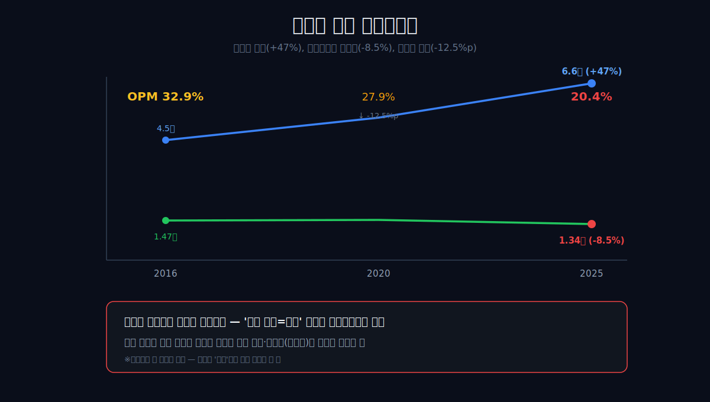
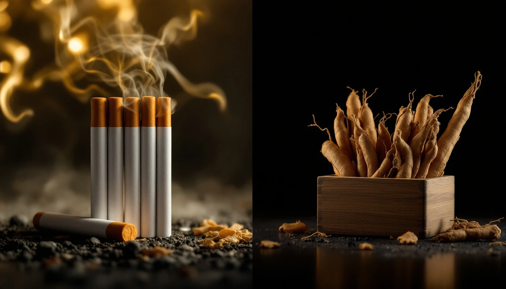
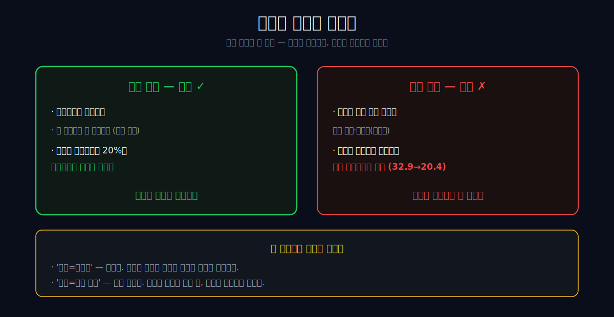
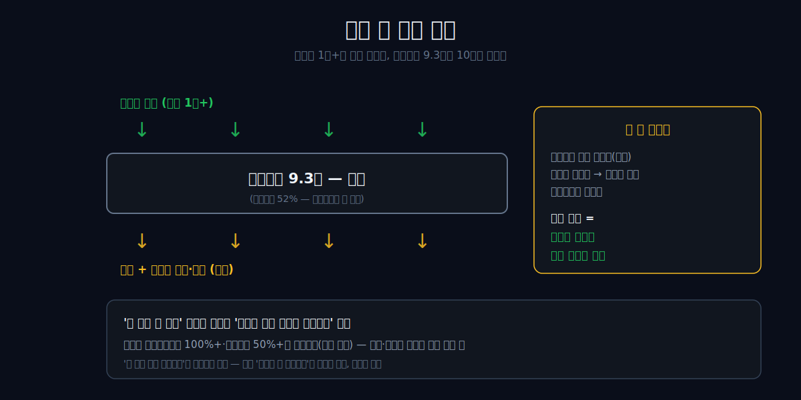
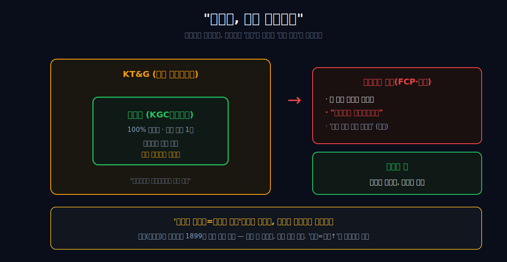
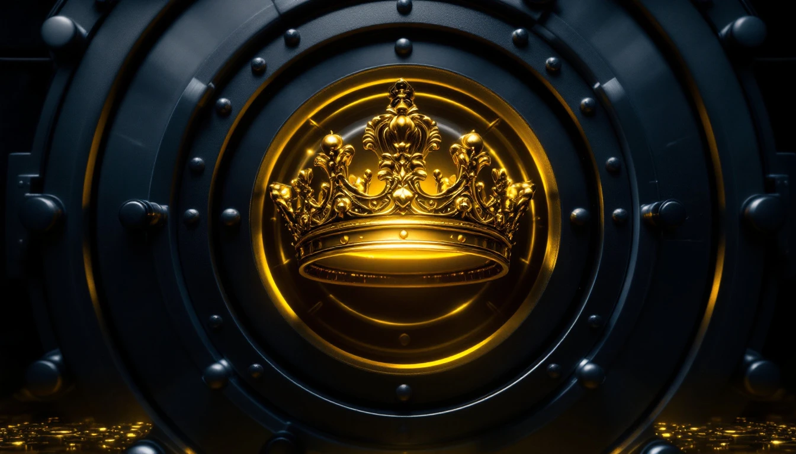
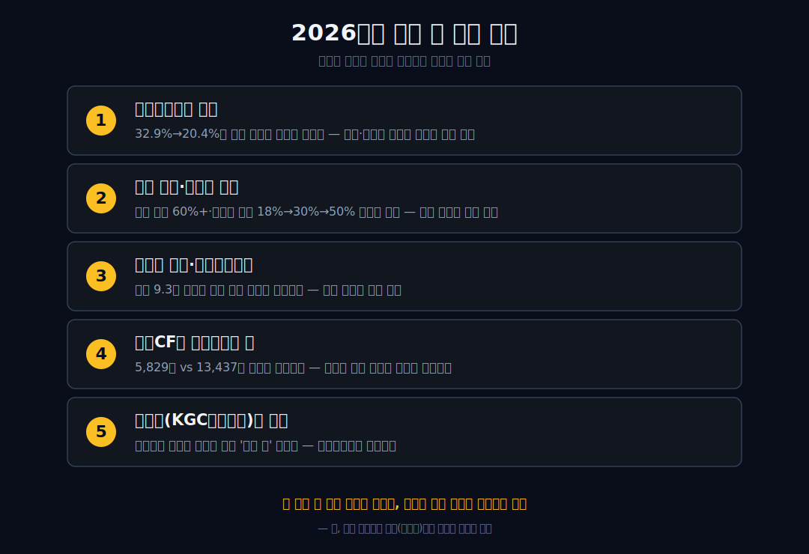

<script>
	import CompanyFinancials from '$lib/components/blog/CompanyFinancials.svelte';
</script>

> **데이터 기준**: 2026-06-19 dartlab 실측 — KT&G(033780) **연결 재무제표(CFS)** 기준. 해외 비중·정관장·주주환원율·행동주의·자산매각 계획은 회사 공시·IR·언론 교차확인. ※담뱃값의 큰 부분이 세금이라 매출 해석에 주의.
>
> **핵심 숫자**: 매출 **6조5,797억** · 영업이익 **1조3,437억** (영업이익률 **20.4%**, 2016년 32.9%) · 당기순이익 **1조1,023억** · 자본총계 **9.3조** (10년 횡보) · 부채비율 **52%** · 영업현금흐름 **5,829억**
>
> **이 글의 용어**: 과점 = 소수 기업이 시장을 나눠 갖는 구조 · 진입장벽(해자) = 새 경쟁자가 못 들어오게 막는 것 · 영업이익률(OPM) = 영업이익÷매출 · 자사주 소각 = 자기 주식을 사들여 없애는 것(주주 몫이 커짐) · 총주주환원율 = 배당+자사주 매입이 순이익에서 차지하는 비율 · 분리상장 = 자회사를 따로 증시에 올려 별도로 평가받게 하는 것.

---

## 프롤로그 — 가장 잘 버는데 살이 안 찌는 회사

KT&G에는 이상한 점이 셋이다.

첫째, 매출은 9년간 **47%** 늘었는데 영업이익은 오히려 **8% 줄었다.** 4조4,689억이 6조5,797억이 되는 동안, 영업이익은 1조4,688억에서 1조3,437억으로 내려앉았다. 영업이익률은 32.9%에서 20.4%로 12.5%p 깎였다. 보통 '매출 성장'은 박수받을 그림인데 여기선 정반대다.

둘째, 이렇게 두껍게 버는데도 자본총계 **9.3조 원이 10년째 제자리다.** 돈을 잘 버는 회사는 보통 살이 찐다. 이 회사는 안 찐다.

셋째, 가장 자랑하는 자산을 두고 행동주의 펀드가 외친 한마디 — **"정관장, 그거 떼어내라."**



관통선은 하나다. **"규제가 지켜주는 두꺼운 이익을 내면서, 왜 살은 안 찌고, 왜 가장 값진 자회사를 떼어내라는 말을 듣는가?"** 답을 먼저 쓴다. KT&G는 *더 벌어 더 쌓는* 회사가 아니라, *두껍게 벌어 그대로 토해내되 왕관(정관장)만은 금고에 가둔* 회사다. 성장으로 읽으면 영원히 틀린다.

---

## 1막 — 거꾸로 가는 손익계산서

**왜 매출이 47% 느는데 영업이익은 줄었나.** 손익계산서 한 줄로 못박자.

```python
import dartlab
c = dartlab.Company("033780")
c.select("IS", ["매출액", "영업이익"], freq="Y")
```

| 항목 (1년치, 억원) | 2025 | 2020 | 2016 |
|---|---:|---:|---:|
| 매출액 | **65,797** | 53,016 | 44,689 |
| 영업이익 | 13,437 | 14,811 | **14,688** |
| 영업이익률 | 20.4% | 27.9% | **32.9%** |

매출은 분명히 커졌다(+47%). 그런데 영업이익은 14,688억→13,437억으로 줄었고(-8.5%), 영업이익률은 32.9%에서 20.4%로 12.5%p 빠졌다. 외형이 커질수록 *마진은 얇아진* 것이다.

여기서 한 가지 주의. 담뱃값의 큰 부분은 세금이라, 담배회사의 매출은 '실력'으로 곧장 읽으면 안 된다. 그러니 매출 +47%를 성공으로 박수칠 일이 아니다. 진짜 질문은 따로 있다 — *무엇이 마진을 깎았나?*



---

## 2막 — 해자는 마진을 못 지킨다, 진입만 막는다

**규제 산업인데 왜 마진이 빠졌나.** 흔히 '규제=리스크'라고 한다. 거꾸로다. 담배사업법의 진입장벽이 새 경쟁자를 막아 과점을 봉인하고, 그래서 영업이익률 20%는 제조업에서 여전히 *두껍다.* 규제는 이 회사의 해자다.

그런데 그 해자에는 한계가 있다. **해자는 진입을 막을 뿐, 마진을 지켜주지는 않는다.**



마진이 빠진 건 외형을 키운 성장 동력 때문이다. KT&G의 성장은 내수 고마진 담배가 아니라 *해외 궐련 수출과 비담배(정관장 등)*에서 나왔다 — 궐련 매출 중 해외 비중은 이미 60%를 넘고, 글로벌 생산 비중도 2023년 18%에서 2025년 30%로, 향후 50%까지 늘릴 계획이다(외부 인용). 해외·비담배는 내수 독점 담배보다 마진이 얇아, 외형이 그쪽으로 커질수록 전체 영업이익률이 희석된다.

그러니 두 클리셰가 동시에 틀렸다. '규제=리스크'도 틀렸고(해자가 과점을 봉인한다), '규제=만능 해자'도 틀렸다(해자가 마진까지 지켜주진 않는다). (마진 희석의 원인을 '해외·비담배 믹스'로 보는 건 관찰에 기반한 가설이며, 부문별 마진·비중은 사업보고서로 별도 확인할 사항이다.) 그렇다면 두껍게 남은 이익은 어디로 갔나?

---

## 해외 궐련이 키운 것은 매출인가, 마진 희석인가

**성장한 쪽이 가장 두꺼운 쪽은 아니다.** KT&G의 2025년 연간 보도자료는 한 줄을 강하게 적었다. 연 매출이 6조 원대를 처음 넘었고, 글로벌 궐련 매출이 국내 궐련 매출을 처음 넘어섰다는 사실이다. 회사가 공식 보도자료에서 제시한 2025년 연결 매출은 **6.5796조 원**, 영업이익은 **1.3496조 원**이다. dartlab AUTO의 DART 실측도 매출 **65,797억**, 영업이익 **13,437억**으로 같은 방향을 가리킨다.

여기서 조심해야 한다. 해외 매출이 국내를 넘었다는 말은 성장의 증거이지만, 곧바로 "좋은 성장"의 증거는 아니다. 담배회사의 가장 두꺼운 이익은 보통 국내 과점, 강한 브랜드, 세금·가격 구조가 안정된 시장에서 나온다. 해외는 물량을 키울 수 있지만, 현지 유통·판촉·환율·생산기지·규제 비용이 붙는다. 그러니 해외 궐련은 매출을 키우는 엔진이면서 동시에 연결 마진을 낮추는 압력일 수 있다.

2026년 1분기는 이 긴장을 더 선명하게 만든다. [KT&G 2026년 1분기 IR 자료](https://en.ktng.com/attach/download/ee6e0478-ab44-434c-b7df-3e0ec41f2345)는 연결 매출 **1.7036조 원**, 영업이익 **3,645억 원**, 영업이익률 **21.4%**를 제시한다. 전년 동기보다 매출과 이익이 모두 늘었다. 그런데 이익률은 2016년 32.9%와는 완전히 다른 체급에 있다.

이 문장을 세게 쓰면 이렇게 된다. KT&G는 성장하지 못한 회사가 아니다. 오히려 성장한 회사다. 문제는 성장한 곳이 예전의 30%대 영업이익률을 그대로 보존하는 곳이 아니라는 데 있다.

이것이 1막의 이상 신호와 연결된다. 2016년의 매출 4.47조는 영업이익률 32.9%를 만들었다. 2025년의 매출 6.58조는 영업이익률 20.4%를 만들었다. 회사는 커졌지만, 회사가 가장 많이 버는 방식은 예전보다 덜 두꺼워졌다.

그래서 이 글은 매출 증가를 승리로 끝내지 않는다. "해외 궐련이 국내 궐련을 넘어섰다"는 공식 문구는 두 방향으로 읽어야 한다. 하나는 글로벌화의 성공이다. 다른 하나는 연결 마진 희석의 영수증이다.

```python
import dartlab
c = dartlab.Company("033780")
c.select("IS", ["매출액", "영업이익", "당기순이익"], freq="Y")
c.select("IS", ["매출액", "영업이익", "당기순이익"], freq="Q")
```

이 코드가 하는 일은 단순하다. 연간 매출이 커졌는지와 분기 이익률이 회복되는지를 나눠 본다. KT&G를 볼 때는 "글로벌 매출이 커진다"와 "예전 같은 이익률이 돌아온다"를 같은 말로 쓰면 안 된다. 앞 문장은 공시로 확인된다. 뒤 문장은 아직 확인해야 할 조건이다.

---

## 담뱃값 매출을 그대로 읽으면 왜 위험한가

**담배회사의 매출은 제조업 매출과 다르게 읽어야 한다.** 같은 1조 매출이어도 담배의 1조와 일반 소비재의 1조는 다르다. 담뱃값에는 세금이 크고, 가격 인상은 소비자 수요와 규제 환경을 동시에 건드린다. 그래서 담배회사의 매출 증가는 "더 많이 팔았다"와 "가격·세금 구조가 변했다"와 "해외 믹스가 바뀌었다"가 섞인다.

KT&G의 글에서 매출을 오래 붙잡는 이유가 여기 있다. 매출 4.47조에서 6.58조로 간 것은 큰 변화다. 하지만 그 변화가 곧바로 경쟁력 강화라고 말하기 어렵다. 영업이익이 줄었고, 영업이익률은 12.5%p 빠졌기 때문이다.

담배회사를 읽는 순서는 그래서 바뀐다.

1. 매출이 늘었는가.
2. 같은 기간 영업이익이 같이 늘었는가.
3. 영업이익률이 어느 수준에서 멈췄는가.
4. 국내 궐련, 해외 궐련, NGP, 건강기능식품 중 어느 쪽이 성장했는가.
5. 성장한 쪽의 이익률이 전체 마진을 올렸는가, 낮췄는가.

현재 공개 자료만으로 5번을 완전히 닫을 수는 없다. 세그먼트별 매출과 일부 영업이익은 IR 자료에 있지만, 제품·지역별 가격·세금·유통비를 모두 분해할 만큼 열려 있지는 않다. 그래서 이 글은 "해외가 마진을 깎았다"고 확정하지 않는다. 대신 더 좁고 강한 문장으로 쓴다. **외형 성장과 마진 방어가 분리됐다.**

그 문장만으로도 충분히 강하다. 매출 성장주처럼 보이는 숫자 아래에, 과점 이익률의 희석이 숨어 있기 때문이다.

이제 질문은 자연스럽게 넘어간다. 회사가 이렇게 벌었다면, 이익은 왜 자본에 쌓이지 않았나.

---

## 3막 — 살 안 찌는 회사: 자본 9.3조의 10년 횡보

**이익을 내는데 왜 자본이 안 불어나나.** 2025년 순이익 1조1,023억. 그런데 자본총계는 9.3조에서 횡보한다. 부채비율도 52%로 레버리지를 키우지 않았다.

```python
c.select("BS", ["자본총계", "부채총계"], freq="Y")
```

보통 마진 두꺼운 회사는 번 돈이 자본에 쌓여 살이 찐다. KT&G는 안 찐다. 이유는 무능이 아니라 *정책*이다 — 번 돈을 사내에 쌓지 않고 배당과 자사주 매입·소각(buyback-and-cancel)으로 토해낸다. 자사주를 사서 없애면 자본이 깎여, 이익을 내도 자본총계가 제자리에 머문다. 자본의 횡보는 위기가 아니라 *환원 정책의 지문*이다.



범위를 한정한다. 배당과 자사주 매입의 총액, 총주주환원율 같은 숫자는 dartlab 검증 재무에 없다. 그러니 '번 즉시 전액 토해낸다'고 단정하진 않는다. 다만 회사는 총주주환원율 100% 이상, 배당성향 50% 이상을 내세우고, 발행주식의 상당 비중을 소각하는 계획을 밝혀 왔다(외부 인용). *자본이 안 불어난다*는 관찰은 확실하고, 그 방향은 환원이다. 그렇다면 그 환원 재원은 정말 영업에서 다 나오나?

---

## 자본을 줄이는 환원과 자본을 쌓는 이익은 동시에 일어난다

**자본이 제자리라는 사실은 부진의 증거가 아니다.** 여기서 많은 독자가 헷갈린다. 자본총계가 10년째 9조 원대라면 회사가 돈을 못 번 것처럼 보인다. 하지만 KT&G의 손익계산서는 그 반대다. 2025년 순이익만 **1조1,023억 원**이다. 문제는 번 돈이 어디로 가는가다.

KT&G의 [Corporate Value Enhancement Plan](https://en.ktng.com/ir/value)은 2027년까지의 목표를 매우 직접적으로 적는다. 핵심은 세 가지다. 첫째, ROE 목표를 **15%** 수준으로 제시한다. 둘째, 2027년까지 약 **3.7조 원** 규모의 주주환원을 말한다. 셋째, 비핵심 자산 약 **1조 원**을 현금화해 자본 효율성을 높이겠다고 밝힌다.

이 세 문장은 자본총계 9.3조 횡보를 읽는 열쇠다. 회사가 돈을 못 벌어서 자본이 안 늘어난 게 아니다. 돈을 벌지만, 자본을 크게 쌓지 않는 방향으로 설계하고 있다. 자사주를 사서 소각하면 자기자본이 줄고, 남은 주주의 지분율은 커진다. 배당은 현금이 빠져나간다. 비핵심 자산 매각은 장부를 가볍게 만든다. 셋이 동시에 오면 재무제표의 "살"은 잘 찌지 않는다.

여기서 KT&G와 [메리츠금융](/blog/138040-meritz-financial)의 차이가 드러난다. 메리츠금융은 금융지주 체제 재편 뒤 "쌓인 이익을 어떻게 환원할 것인가"가 질문이었다. KT&G는 조금 다르다. 질문은 "두꺼운 과점 이익을 얼마나 쌓지 않고 토해낼 것인가, 그리고 그 과정에서 정관장을 끝까지 안에 둘 것인가"다.

그러니 자본총계 9.3조 횡보를 위기처럼 쓰면 틀린다. 이건 환원 정책의 결과에 가깝다. 다만 환원 정책이 좋다는 말도 아니다. 환원은 주주에게 현금을 돌려주는 강점이지만, 자산을 매각해 보태는 부분이 커지면 반복 가능성은 낮아진다. 자본 효율성을 높이는 계획과, 장기 사업 체력을 깎는 계획은 숫자상 한 줄 차이다.

이 글의 판정은 여기서 갈린다. KT&G는 벌지 못해서 마른 회사가 아니다. 벌지만, 자본을 살찌우는 대신 자사주 소각과 배당, 자산매각으로 몸을 가볍게 만드는 회사다.

---

## 자사주 소각은 왜 배당보다 더 강한 문장인가

**배당은 돈을 주는 일이고, 소각은 주식 수를 줄이는 일이다.** 둘 다 주주환원이지만 재무제표에 남는 흔적은 다르다. 배당은 현금이 나가고, 주주는 현금을 받는다. 자사주 소각은 회사가 산 주식을 없애 주당 몫을 키운다. 특히 이익이 안정적인 회사에서는 소각이 ROE와 EPS를 동시에 건드린다.

KT&G가 2024년 11월 Value-up 계획에서 제시한 자사주 소각 방향은 그래서 중요하다. 공식 페이지는 2024년에 약 **5,467억 원**을 매입하고 **8,617억 원**을 소각했으며, 2025년에 약 **5,600억 원**을 매입하고 **9,263억 원**을 소각했다고 밝힌다. 여기에 2027년까지 추가 환원 계획이 붙는다. 이 숫자는 "배당 많이 주는 담배회사"보다 더 강한 문장이다. 회사가 장부 안의 자본을 줄여 주주 몫을 다시 배분하겠다는 뜻이기 때문이다.

다만 여기에도 함정이 있다. 소각은 사업의 질을 좋게 만들지 않는다. 주당 지표를 좋게 보이게 할 수는 있지만, 매출총이익률과 영업이익률의 방향을 바꾸지는 못한다. 해외 궐련이 마진을 계속 낮추고, 영업현금흐름이 영업이익을 계속 따라가지 못한다면, 소각은 좋은 숫자를 더 보기 좋게 만드는 도구일 뿐이다.

그래서 KT&G를 보는 순서는 "소각했다, 좋다"가 아니다.

```python
import dartlab
c = dartlab.Company("033780")
c.select("IS", ["영업이익", "당기순이익"], freq="Y")
c.select("BS", ["자본총계"], freq="Y")
c.select("CF", ["영업활동현금흐름"], freq="Y")
```

이 세 줄을 같이 봐야 한다. 영업이익이 유지되는가. 순이익이 유지되는가. 자본이 줄거나 정체되는가. 영업현금흐름이 환원의 속도를 버틸 만큼 나오는가. KT&G의 숫자는 아직 첫 두 줄은 강하고, 세 번째 줄은 정책적으로 가볍고, 네 번째 줄은 2025년에 약했다.

자사주 소각은 좋은 회사의 결과일 수 있다. 하지만 좋은 회사의 원인은 아니다. 이 구분을 놓치면 KT&G를 환원율 하나로만 읽게 된다.

---

## 4막 — 현금기계의 균열: 영업현금이 영업이익에 못 미친다

**'현금기계'라면서 왜 영업현금흐름이 영업이익보다 적나.** 여기 불편한 숫자가 있다.

```python
c.select("CF", ["영업활동현금흐름"], freq="Y")
```

| 항목 (2025, 억원) | 값 |
|---|---:|
| 영업이익 | 13,437 |
| 영업활동현금흐름 | **5,829** |

영업현금흐름 5,829억은 영업이익 1조3,437억의 절반에도 못 미친다. 1차적으로는 운전자본·세금의 타이밍 차이로 설명된다(재고·매출채권 변동, 세금 납부 시점 등) — 이것만으로 '부실'이라 단정하진 않는다.


다만 여기에 외부에서 확인되는 사실 하나를 더한다. 회사는 두꺼운 환원을 떠받치기 위해 비핵심 부동산·금융자산을 2027년까지 1조 원 규모로 매각하는 계획을 밝혀 왔다(외부 인용). 즉 두꺼운 환원의 재원이 *순수 영업현금만이 아니라* 대차대조표를 천천히 비우는 데서도 일부 나온다. '현금기계'라는 말을 무비판적으로 쓰지 않는 이유다 — 환원의 동력 일부는 자산 매각이라는 *일회성*에 기대고 있어, 영구 동력은 아니다. 그렇게 짜낸 돈으로 회사는 왕관(정관장)을 지킬 수 있나?

---

## 2025년 현금 갭은 경고인가, 타이밍인가

**영업이익 1.34조와 영업현금흐름 0.58조의 차이는 그냥 지나갈 수 없다.** 하지만 이것 하나로 "현금이 나쁜 회사"라고 쓰면 또 틀린다. 2023년 영업현금흐름은 **1조2,660억 원**, 2024년은 **8,223억 원**이었다. 2025년 **5,829억 원**이 약해진 것은 맞지만, 1년 숫자만 떼어 구조 부실로 단정할 정도는 아니다.

그래서 이 막의 판단은 회색이다. 2025년 OCF 갭은 환원 정책을 볼 때 반드시 확인해야 할 경고등이다. 그러나 단독으로 부실이라고 부르기에는 약하다. 운전자본, 법인세 납부, 재고·채권, 투자자산 처분 등이 한 해 현금흐름을 크게 흔들 수 있기 때문이다.

2026년 1분기 숫자가 이 회색 판단을 보완한다. AUTO 블록은 2026Q1 영업활동현금흐름 **3,862억 원**을 보여준다. 같은 분기 영업이익은 **3,645억 원**이다. 2025년 연간처럼 영업이익보다 현금흐름이 크게 낮은 그림은 아니다. 즉 2025년 갭을 구조적 붕괴로 확정하기엔 이르다.

그래도 체크포인트는 남는다. KT&G가 2027년까지 주주환원과 자산매각을 동시에 말하는 회사라면, 현금흐름은 단순 보조지표가 아니다. 환원이 영업에서 나오는지, 자산 매각에서 나오는지, 차입에서 나오는지 구분해야 한다.

정리하면 이렇다.

| 질문 | 2025년 숫자 | 읽는 법 |
|---|---:|---|
| 영업은 두꺼운가 | 영업이익 13,437억 | 여전히 두껍다 |
| 현금도 같은 속도로 들어왔나 | 영업CF 5,829억 | 약했다 |
| 2026Q1은 계속 약했나 | 영업CF 3,862억 vs 영업이익 3,645억 | 단기 회복 |
| 환원이 반복 가능한가 | Value-up 3.7조 + 자산매각 1조 | 영업CF와 자산매각을 분리해야 함 |

이 표가 KT&G를 보는 현실적인 방법이다. 환원 정책은 강하고, 본업 이익도 강하다. 그러나 현금흐름이 매년 본업 이익을 충분히 따라와야 환원이 "기계"가 된다. 따라오지 못하면 환원은 기계가 아니라 자산 매각 이벤트가 된다.

---

## 비핵심 자산 1조 매각은 효율화인가, 연료 보충인가

**자산 매각은 두 얼굴이다.** 한쪽에서는 효율화다. 사업과 무관한 부동산·금융자산을 팔아 자본을 가볍게 만들면 ROE는 올라간다. 자산을 줄이고 같은 이익을 내면 자본 효율성은 좋아진다. KT&G가 Value-up에서 말한 방향이 바로 이것이다.

다른 쪽에서는 연료 보충이다. 영업현금흐름이 충분하지 않은 해에도 배당과 자사주 매입을 이어가려면, 팔 수 있는 자산이 환원 재원으로 들어온다. 이 경우 환원은 반복 이익이 아니라 일회성 처분에서 보강된다.

어느 쪽인지 단정할 수는 없다. 현재 공식 계획만으로는 "비핵심 자산을 팔아 효율성을 높인다"는 회사의 설명이 먼저다. 하지만 독자가 투자자라면 질문은 바뀐다. 팔 수 있는 자산은 계속 나오지 않는다. 1조 매각은 한 번의 탄약이다. 그 이후에도 영업현금흐름이 충분히 나오느냐가 진짜다.

이 대목에서 [CJ제일제당](/blog/097950-cj-cheiljedang)의 손상·영업외 구조와 비교할 수 있다. CJ제일제당은 본업과 비본업 사이의 손상·처분이 순이익을 흔들었다. KT&G는 반대로 본업 이익은 안정적이지만, 환원 정책의 재원 쪽에서 영업현금과 자산매각을 분리해야 한다. 둘 다 손익계산서 한 장만 보면 놓친다.

KT&G의 결론은 아직 긍정과 부정 사이에 있다. 자산을 팔아 ROE를 높이는 것은 나쁜 전략이 아니다. 다만 그것이 환원 정책의 상시 연료가 되는 순간, "현금기계"라는 말은 약해진다.

그렇다면 회사가 끝까지 안 팔고, 안 떼어내고, 안 내보내려는 진짜 자산은 무엇인가. 정관장이다.

---

## 5막 — 떼어내라던 왕관: 정관장은 강점이 아니라 '갇힌 가치'였나

**시장은 왜 이 회사의 자랑(정관장)을 디스카운트 요인으로 봤나.** 여기서 진짜 돈줄 가설이 *뒤집힌다.* 보통 '비담배 다각화=안정적 강점'이라 본다. 그런데 행동주의 펀드들은 더 많은 배당이 아니라 **정관장(KGC인삼공사) 분리상장**을 요구했다 — 100% 자회사인 정관장이 담배회사 안에 묶여 따로 평가받지 못한다며, '인삼을 떼면 가치가 오른다'는 논리를 폈다(외부 인용·행동주의 *주장*이지 사실 단정 아님).

즉 시장 일부는 다각화를 시너지가 아니라 *'담배 컨글로머릿 디스카운트에 갇힌 보석'*으로 읽었다. 회사는 환원은 대폭 키웠지만, 분리는 거부했다.



역사 한 줄이 깊이를 더한다. 정관장(인삼)도 담배처럼 **1899년부터 국가 전매품**이었다 — 대한제국이 홍삼과 담배를 함께 전매했다. 산업적으로 무관해 보이는 둘이 '국가 독점에서 흘러나왔다'는 한 줄로 묶인다. (단, 여기서 '국가가 보증하던 신뢰를 물려받았다' 같은 인과 비약은 하지 않는다 — 전매라는 사실 한 줄까지다.) 같은 소비재라도 [농심](/blog/004370-nongshim)이 라면이라는 단일 본업으로 읽히는 것과 달리, KT&G는 *담배+인삼*이라는 두 전매 유산을 한 몸에 안고 있다.

---

## 정관장은 왕관인가, 할인 요인인가

**정관장은 세 가지 얼굴을 가진다.** 첫째, 비담배 다각화의 상징이다. 담배 규제가 강해질수록 건강기능식품·홍삼 브랜드는 회사의 다른 축처럼 보인다. 둘째, 국가 전매 유산이라는 브랜드 신뢰의 역사다. 담배와 홍삼은 산업적으로 다르지만, 둘 다 국가 전매의 긴 그림자에서 출발했다. 셋째, 행동주의가 본 "갇힌 가치"다. 이 세 얼굴은 서로 충돌한다.

회사가 보는 정관장은 방어 자산이다. 담배가 규제산업이고 궐련 소비량이 장기적으로 줄 수 있다면, 건강기능식품은 포트폴리오를 넓히는 축이다. 같은 회사 안에서 담배·NGP·건기식·부동산·해외 법인이 함께 있으면 그룹 전체 이익 변동을 완화할 수 있다. 이 관점에서는 정관장을 떼어내는 것이 오히려 방어력을 낮춘다.

행동주의가 보는 정관장은 다르다. [FCP가 공개적으로 제시한 KGC 인수·분리 관련 주장](https://www.asiae.co.kr/en/article/2024101516281357515)의 핵심은 "담배회사 안에 묶여 있어 정관장이 따로 평가받지 못한다"는 문제의식이다. 이것은 사실 판정이 아니라 투자자 측 주장이다. 다만 이 주장이 등장했다는 사실 자체가 중요하다. 시장 일부가 KT&G의 다각화를 시너지보다 할인 요인으로 읽었다는 뜻이기 때문이다.

그럼 어느 쪽이 맞나. 현재 재무제표만으로는 결론을 확정할 수 없다. 정관장 독립기업의 가치, 별도 상장 시 멀티플, KT&G 연결 안정성 상실분, 담배 본업 할인율 변화까지 모두 추정이 필요하다. 그래서 이 글은 "정관장을 떼어내야 한다"고 쓰지 않는다. 대신 더 좁은 결론을 쓴다. **KT&G의 가장 자랑스러운 비담배 자산이, 동시에 주주가치를 잠그는 자산으로 공격받았다.**

이 문장이 강한 이유는 숫자 하나 때문이 아니다. 회사의 정체성을 건드리기 때문이다. KT&G가 단순 담배회사라면 질문은 영업이익률과 배당으로 끝난다. 하지만 KT&G가 담배와 인삼, 해외 궐련, NGP, 부동산·금융자산을 같이 들고 있는 회사라면 질문은 바뀐다. "무엇을 갖고 있느냐"보다 "무엇을 안 내보내느냐"가 주주가치 논쟁의 중심이 된다.

---

## 행동주의가 요구한 것은 더 많은 배당만이 아니었다

**KT&G 논쟁을 단순 고배당주 논쟁으로 줄이면 틀린다.** 행동주의가 배당과 자사주를 요구한 것은 맞다. 하지만 가장 날카로운 요구는 정관장 분리였다. 더 많은 현금을 달라는 요구와, 회사를 다시 쪼개라는 요구는 전혀 다르다.

더 많은 현금 요구는 현재 구조를 전제로 한다. 회사가 계속 담배·인삼을 함께 들고 있고, 그 안에서 남는 돈을 주주에게 돌리라는 뜻이다. 반면 정관장 분리 요구는 구조 자체를 문제 삼는다. "이 회사가 담배회사인지, 건강기능식품 브랜드를 품은 컨글로머릿인지, 아니면 둘을 따로 평가해야 하는지"를 묻는다.

KT&G는 환원은 받아들이되 구조 분리는 거부한 쪽에 가깝다. 이 선택은 일관적이다. 회사가 정관장을 장기 축으로 본다면, 분리 요구를 받을 이유가 없다. 하지만 주주가 정관장을 따로 평가받아야 할 자산으로 본다면, 회사의 거부는 가치 잠금으로 보인다. 같은 행동이 관점에 따라 방어와 잠금으로 갈린다.

여기서 중요한 것은 누가 옳으냐가 아니다. **KT&G의 투자 논쟁은 이익률 논쟁을 넘어 자산 배치 논쟁으로 넘어갔다**는 사실이다. 영업이익률 20%가 아무리 두꺼워도, 시장이 "그 이익과 자산을 어떻게 배치할 것인가"를 묻기 시작하면 회사는 단순 고배당주가 아니다.

그래서 2026년에 볼 것은 배당률만이 아니다. 정관장과 KGC인삼공사를 계속 100% 자회사로 둘 것인지, 해외 궐련과 NGP 투자가 어느 정도 자본을 요구하는지, 비핵심 자산 매각이 어디까지 진행되는지, 자사주 소각이 실제 발행주식 수를 얼마나 줄이는지까지 봐야 한다.

이 회사의 논쟁은 이미 손익계산서 밖으로 나갔다. 담배를 얼마나 팔았느냐가 아니라, 번 돈과 가진 자산을 어떻게 쪼개고 잠그고 토해낼 것인가의 문제다.

---

## 2026년 1분기 — 왕관과 담배가 동시에 빨라진 순간

**2026년 1분기는 이 글의 결론을 흔들 수 있는 첫 시험지다.** 회사가 발표한 IR 자료 기준으로 2026년 1분기 연결 매출은 **1조7,036억 원**, 영업이익은 **3,645억 원**이다. AUTO 블록의 DART 실측도 같은 숫자를 담고 있다. 2025년 연간 마진 20.4%와 비교하면 1분기 영업이익률은 **21.4%**로 소폭 높다.

이 숫자를 너무 좋게 읽으면 안 된다. 한 분기는 계절성·환율·세금·판촉 타이밍이 크다. 하지만 무시할 수도 없다. 2025년 OCF 갭이 약했고, 마진은 장기 하락했으며, Value-up은 환원을 크게 약속했다. 이런 상황에서 2026년 1분기가 매출·영업이익·현금흐름을 동시에 회복했다면, 적어도 "현금기계가 바로 망가졌다"는 식의 판정은 틀린다.

따라서 2026년 1분기는 결론이 아니라 기준선이다. 이 기준선이 2분기, 3분기, 연간으로 이어져야 한다. 한 분기 회복은 환원 정책을 지탱하는 증거가 될 수 있지만, 장기 마진 하락을 지우지는 못한다.

KT&G의 강점은 아직 분명하다. 영업이익 3,645억을 한 분기에 낸다. 순이익도 3,782억이다. 부채비율도 낮다. 약점도 동시에 분명하다. 장기 영업이익률은 낮아졌고, 자본 효율성 개선은 사업 성장만으로가 아니라 소각·자산매각과 함께 설계되고 있다.

그래서 2026년 1분기 숫자는 "좋다"가 아니라 "확인 순서가 생겼다"로 읽는다. 1분기 OPM 21%대가 연간으로 이어지는가. 영업CF가 영업이익을 따라오는가. 비핵심 자산 매각 없이도 환원 재원이 나오는가. 정관장은 여전히 안에 묶이는가. 이 네 가지가 다음 공시의 순서다.

---

## 6막 — 토해내되 왕관은 가둔 회사

**그래서 KT&G는 무엇인가.** 1~4막(과점이익·마진 희석·자본 비축적·현금 균열)과 5막(다각화 디스카운트·분리 거부)을 하나로 모으면 그림이 분명해진다. 이 회사는 *성장*으로 평가받을 회사가 아니라 *분배와 보존*으로 평가받을 회사다 — 규제가 봉인한 과점에서 두꺼운 절대이익을 내되, 그 이익을 쌓지 않고 환원으로 토해내면서도 가장 값나가는 자회사는 끝까지 안에 묶어둔, 환원기계이자 왕관 금고다.

진짜 위험은 사양 산업 그 자체가 아니다. 둘이다. ① 외형 성장이 계속 마진을 희석하면 '두꺼운 절대이익'이라는 전제가 흔들린다. ② 환원 재원을 자산 매각으로 메우는 구조는 일회성이라 영구 동력이 아니다. (둘 다 조건부 시나리오이지 예측이 아니다.)

같은 '간판과 진짜 돈줄이 다른' 계열이지만, 결은 제각각이다. 규제가 강제한 의무 길목을 쥐고 정점에서 회사를 통째로 판 [더존비즈온](/blog/012510-douzone), 렌탈 현금엔진의 소유권이 세 번 바뀐 [코웨이](/blog/021240-coway), 안 보이는 발효 엔진을 6조 매각설 끝에 끌어안은 [CJ제일제당](/blog/097950-cj-cheiljedang) — KT&G는 그중에서도 *분리를 거부하고 왕관을 안에 가둔* 쪽이다. 코웨이가 현금엔진의 소유권을 떼어냈다면, KT&G는 정반대로 떼라는 요구를 거부했다. 주주환원으로는 [메리츠금융](/blog/138040-meritz-financial)과 한 계열이되, 그쪽이 '쌓은 뒤 환원'이라면 KT&G는 '안 쌓고 토해내는' 쪽이다.



이 회사를 볼 사람은 매출이 아니라 — 영업이익률의 바닥, 영업현금흐름과 영업이익의 갭, 그리고 정관장을 계속 안에 둘 것인가를 봐야 한다.

---

## 과거~현재 패턴 — 해자는 남고, 이익률은 낮아졌다

**KT&G의 10년 패턴은 단순하다. 방어력은 유지됐고, 이익률은 낮아졌다.** 이 회사는 위기 기업처럼 흔들리지 않았다. 적자가 난 것도 아니고, 차입이 폭발한 것도 아니며, 자본잠식은 더더욱 아니다. 2025년에도 영업이익 1.34조를 냈고, 자본총계는 9.3조다. 재무 안전성만 보면 여전히 강하다.

그런데 좋은 회사라는 말과 좋은 변화라는 말은 다르다. 2016년 영업이익률 **32.9%**는 담배 과점이 얼마나 두꺼운지 보여줬다. 2025년 **20.4%**는 그 두께가 상당 부분 얇아졌음을 보여준다. 20%대 마진도 훌륭하지만, 이 회사의 과거 기준으로는 큰 하락이다.

패턴을 시간순으로 쓰면 이렇게 된다.

1. 국내 담배 과점이 높은 영업이익률을 만든다.
2. 해외 궐련과 비담배 사업이 매출을 키운다.
3. 매출은 커지지만 연결 이익률은 내려간다.
4. 회사는 쌓이는 자본을 배당·자사주·소각으로 낮춘다.
5. 행동주의는 환원 확대를 넘어 정관장 분리까지 요구한다.
6. 회사는 환원은 확대하되 왕관은 안에 둔다.

이 여섯 줄이 KT&G의 과거~현재다. 회사를 "담배 사양산업" 한 줄로 읽으면 1번과 2번을 놓친다. "고배당 가치주" 한 줄로 읽으면 3번과 4번을 놓친다. "정관장 보유 회사" 한 줄로 읽으면 5번과 6번을 놓친다.

그래서 이 회사는 단일 라벨이 잘 안 붙는다. 담배 과점주이면서 글로벌 궐련 성장주이고, 환원주이면서 정관장 지주 성격을 갖고 있고, 규제 방어주이면서 마진 희석 압력을 받는다. 강함과 약함이 같은 곳에서 나온다.

---

## 산업 패턴 — 담배 산업의 해자는 왜 두 방향으로 작동하나

**담배 산업의 규제는 경쟁자를 막는 동시에 성장을 제한한다.** 이것이 다른 소비재와 가장 다르다. [코카콜라](/blog/KO-coca-cola)나 [펩시코](/blog/PEP-pepsico)는 브랜드와 유통망이 해자다. 규제가 있더라도 담배처럼 제품 자체의 광고·판매·가격·소비 행태를 직접 묶는 산업은 아니다. 담배는 브랜드력만으로 설명되지 않는다.

국내 담배 시장에서는 규제가 진입장벽이 된다. 아무 회사나 담배를 만들어 팔 수 없고, 광고·판매 채널도 제한된다. 이 구조는 기존 사업자에게 방어막을 준다. 그래서 KT&G는 장기간 두꺼운 이익을 냈다.

하지만 같은 규제가 성장의 발목도 잡는다. 흡연율 하락, 경고그림, 광고 제한, 가격·세금 구조, 니코틴 제품 규제는 모두 수요와 제품 믹스를 제한한다. 회사는 해외 궐련과 NGP, 건강기능식품으로 확장해야 한다. 그런데 그 확장은 국내 과점 담배만큼 두꺼운 이익률을 보장하지 않는다.

이게 담배 산업의 역설이다. 규제가 없으면 해자가 약해진다. 규제가 강하면 성장 옵션이 좁아진다. 규제는 방패이면서 족쇄다.

KT&G가 Altria와 NGP·니코틴/비니코틴 시장 협력 MOU를 맺은 것도 이 맥락에서 읽어야 한다. 전자담배·NGP는 단순 신사업이 아니라 규제 산업의 다음 제품 포트폴리오다. 문제는 이것이 담배 본업의 마진을 대체할 만큼 두꺼운가다. 현재 글의 검증 범위에서는 아직 "대체했다"고 쓸 수 없다. 그래서 체크포인트로 남긴다.

산업 패턴을 한 문장으로 닫으면 이렇다. 담배 산업은 진입장벽이 높아 망하기 어렵지만, 바로 그 규제 때문에 더 커질 때 예전 같은 마진을 지키기도 어렵다. KT&G의 10년 숫자는 그 양면성을 그대로 보여준다.

---

## 투자 포인트 — 매출이 아니라 세 줄을 먼저 본다

**KT&G를 보는 순서는 매출이 아니다.** 매출은 가장 먼저 보이지만 가장 늦게 판단해야 하는 숫자다. 담배 매출에는 세금과 가격, 해외 믹스와 물량, NGP 전환이 섞인다. 그래서 매출 증가만 보고 "성장했다"고 쓰면 약하다.

먼저 볼 세 줄은 따로 있다. 첫째, 영업이익률이다. 20%대 초반에서 멈추는지, 25%대로 다시 올라가는지, 2016년 같은 30%대가 영영 사라졌는지를 봐야 한다. 둘째, 영업현금흐름이다. 2025년처럼 영업이익의 절반에도 못 미치면 환원 지속성에 물음표가 붙고, 2026Q1처럼 따라오면 방어력이 살아난다. 셋째, 자본총계와 자기주식 소각이다. 자본이 안 느는 것이 부진인지, 의도적 환원인지, 혹은 자산매각에 기댄 효율화인지 구분해야 한다.

그 다음에 정관장을 본다. 정관장은 "좋은 자회사"라는 말로는 충분하지 않다. 담배회사 안에 있어야 방어력이 생기는지, 따로 평가받아야 가치가 풀리는지, 이 질문이 KT&G의 멀티플을 결정한다.

따라서 이 종목을 추적하는 사람에게 필요한 표는 복잡하지 않다. 연간 OPM, 연간 OCF, 자사주 소각액, 비핵심 자산 매각액, KGC 관련 이사회·주주총회 이벤트. 이 다섯 줄이면 회사의 핵심 논쟁을 거의 다 볼 수 있다.

---

## 이 이야기가 틀리는 조건

**강한 결론은 깨지는 조건을 가져야 한다.** 이 글의 결론은 "KT&G는 성장주가 아니라 환원기계이자 왕관 금고다"다. 이 결론이 틀리는 경우는 다섯 가지다.

첫째, 해외 궐련과 NGP가 매출만 키우는 것이 아니라 영업이익률까지 끌어올리는 경우다. 지금까지의 장기 숫자는 매출 성장과 마진 희석이 같이 왔다. 그런데 2026년 이후 해외 궐련·NGP가 고마진으로 전환되어 연결 OPM을 25% 이상으로 되돌린다면, 이 글의 "마진 희석" 축은 약해진다.

둘째, 영업현금흐름이 영업이익을 꾸준히 따라오는 경우다. 2025년 OCF 5,829억은 약했다. 하지만 2026Q1처럼 영업CF가 영업이익을 넘는 분기가 반복되고, 연간으로도 1조 원대 중반 현금흐름이 회복된다면 "환원의 일부가 자산매각에 기대는가"라는 의심은 낮아진다.

셋째, 정관장 분리 요구가 시장에서 힘을 잃는 경우다. KGC인삼공사가 연결 안에서 더 높은 성장과 이익률을 보여주고, 담배 본업과 묶여 있을 때의 안정성이 더 크게 평가받는다면 "갇힌 가치" 주장은 약해진다. 반대로 정관장의 이익이 둔화되고 독립 가치 논쟁이 커지면 이 글의 왕관 금고 프레임은 더 강해진다.

넷째, 자사주 소각이 주당 지표만이 아니라 사업 투자 여력을 훼손하는 경우다. 지금은 부채비율이 낮고 현금창출력이 있어 환원이 가능한 회사다. 하지만 환원 속도가 영업현금흐름보다 빠르고, 그 차이를 자산매각이나 차입으로 메우는 흐름이 반복되면 Value-up은 효율화가 아니라 체력 소모가 된다.

다섯째, 담배 규제의 성격이 변하는 경우다. 규제는 현재 진입장벽이지만, 가격·광고·제품 포트폴리오·NGP 전환을 직접 압박하는 방향으로 더 강해지면 해자가 족쇄로 바뀔 수 있다. 규제는 늘 양면이다. 경쟁자를 막는 동시에 회사의 손발도 묶는다.

이 다섯 가지 때문에 이 글은 "KT&G는 무조건 좋은 환원주"라고 닫지 않는다. 반대로 "담배 사양산업이라 끝났다"로도 닫지 않는다. KT&G는 두꺼운 과점이익과 약해진 마진, 강한 환원과 현금흐름 갭, 왕관 자산과 분리 요구가 한 장부 안에서 충돌하는 회사다.

---

## 2026년에 봐야 할 다섯 가지

1. **연간 영업이익률 21%대 유지 여부** — 2016년 32.9%에서 2025년 20.4%까지 내려온 마진이 2026Q1의 21.4%를 연간으로 지키는지. 마진 바닥이 확인돼야 한다.
2. **해외 궐련·NGP의 질** — 해외 궐련이 국내를 넘어섰다는 사실보다, 그 성장이 전체 OPM을 더 낮추는지 올리는지가 중요하다. 매출 성장과 마진 질을 분리한다.
3. **영업CF와 영업이익의 갭** — 2025년 5,829억 vs 13,437억의 격차가 좁혀지는지. 2026Q1처럼 영업CF가 영업이익을 따라오면 환원 방어력이 높아진다.
4. **자사주 소각과 3.7조 환원 실행 속도** — 보유 자기주식 전량 소각, 2027년까지 주주환원 계획, 비핵심 자산 1조 현금화가 실제로 어떤 순서로 실행되는지 본다.
5. **정관장(KGC인삼공사)의 향방** — 분리상장 압박에 회사가 계속 '안에 둘' 것인지. 정관장이 방어 자산인지, 갇힌 가치인지가 다시 시험대에 오른다.
6. **자산매각 이후의 반복성** — 비핵심 자산을 팔고 난 뒤에도 같은 환원을 영업현금만으로 유지하는지. 한 번 팔 수 있는 자산은 영구 엔진이 아니다.



---

## 공시 / 외부 검증

이 글에서 DART 실측으로 닫히는 숫자는 AUTO 재무제표와 검증표에 묶었다. 외부 사실은 아래 원문 또는 보도자료로 분리해 확인했다.

- [KT&G 2026년 1분기 IR 자료](https://en.ktng.com/attach/download/ee6e0478-ab44-434c-b7df-3e0ec41f2345) — 2026Q1 매출·영업이익·사업부별 흐름.
- [KT&G 2025년 연간 실적 보도자료](https://en.ktng.com/media/news/press-release/detail/304362) — 2025년 사상 최대 매출, 글로벌 궐련·NGP·건기식 공식 설명.
- [KT&G Corporate Value Enhancement Plan](https://en.ktng.com/ir/value) — 2027년까지 주주환원, ROE 목표, 비핵심 자산 현금화 계획.
- [FCP의 KGC 관련 제안 보도](https://www.asiae.co.kr/en/article/2024101516281357515) — 정관장·KGC 분리 또는 인수 제안은 행동주의 측 주장으로 분리.
- [KT&G-Altria NGP 글로벌 협력 MOU 보도자료](https://en.ktng.com/media/news/press-release/detail/300631) — NGP 글로벌 확장 맥락.

외부 출처의 주장은 본문에서 사실과 주장으로 나눠 썼다. 특히 행동주의의 정관장 분리 논리는 "그들이 본 가치"이지, 재무제표로 확정된 정답이 아니다.

---

## 검증표

본문의 모든 인용 수치를 dartlab 호출과 결과로 검증한다. 외부 출처는 분리 표기. 📅 dartlab 실측 2026-06-19 · KT&G(033780) 연결(CFS) 기준.

| 본문 수치 | 출처 / dartlab 호출 | 결과 |
|---|---|---|
| 매출 16년 44,689억 → 25년 65,797억 (+47%) | `c.select("IS",["매출액"],freq="Y")` | ✓ 실측 |
| 영업이익 16년 14,688억 → 25년 13,437억 (-8.5%) | `c.select("IS",["영업이익"],freq="Y")` | ✓ 실측 |
| 영업이익률 32.9%(2016) → 20.4%(2025), -12.5%p | 영업이익÷매출 | ✓ 실측 |
| 당기순이익 2025 11,023억 | `c.select("IS",["당기순이익"],freq="Y")` | ✓ 실측 |
| 자본총계 약 9.3조 10년 횡보 | `c.select("BS",["자본총계"],freq="Y")` | ✓ 실측 |
| 부채비율 약 52%(2025, 부채 48,530억/자본 93,362억) | `c.select("BS",["부채총계","자본총계"],freq="Y")` | ✓ 실측 |
| 영업활동현금흐름 2025 5,829억 (&lt; 영업이익 13,437억) | `c.select("CF",["영업활동현금흐름"],freq="Y")` | ✓ 실측 |
| 2026Q1 매출 17,036억·영업이익 3,645억·당기순이익 3,782억 | `c.select("IS",["매출액","영업이익","당기순이익"],freq="Q")` + KT&G 2026Q1 IR | ✓ 실측/외부 교차 |
| 2026Q1 영업활동현금흐름 3,862억(영업이익 3,645억 상회) | `c.select("CF",["영업활동현금흐름"],freq="Q")` | ✓ 실측 |
| 2025 공식 보도자료: 연결 매출 6.5796조·영업이익 1.3496조, 글로벌 궐련 매출 국내 궐련 초과 | KT&G 2025 실적 보도자료 | 외부 인용 |
| 궐련 해외 매출 비중 60%+ · 글로벌 생산 18%(23)→30%(25)→50%(목표) | 회사 IR·언론 | 외부 인용 |
| 2024~2027 주주환원 3.7조+a, 총주주환원율 100%+, 2025 배당 6,274억·자사주 매입 5,600억·소각 9,263억 | KT&G Value-up 공식 페이지 | 외부 인용 |
| ROE 15% 목표·비핵심 자산 2027년까지 약 1조 현금화 계획 | KT&G Corporate Value Enhancement Plan | 외부 인용 |
| 행동주의(FCP)의 KGC인삼공사 1.9조 인수·분리상장 압박 주장, 회사 거부 | Asiae 보도·회사 입장 | 외부 인용 |
| Altria와 NGP·니코틴/비니코틴 시장 협력 MOU | KT&G 2025-09-23 보도자료 | 외부 인용 |
| 1899 인삼·담배 국가 전매 → 1987 담배인삼공사 → 2002 민영화 | 연혁 | 외부 인용 |

본문의 숫자 중 이 표에 없는 것은 발행 차단 대상이다.

---

<CompanyFinancials code="033780" />
