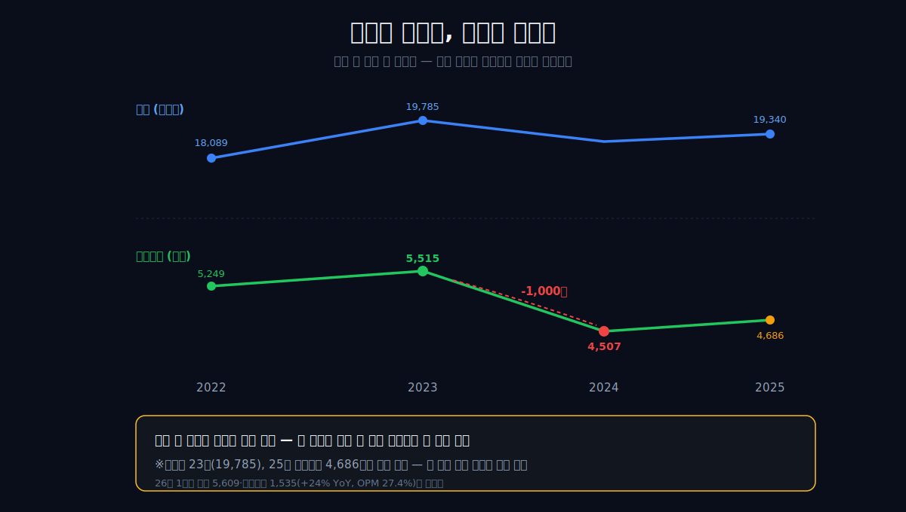
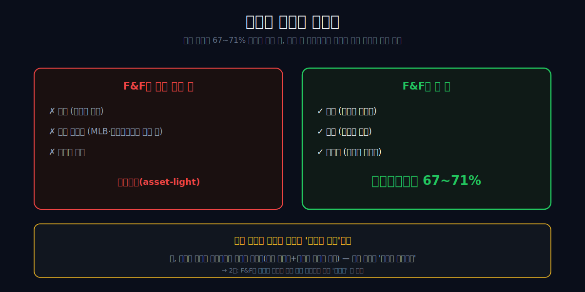
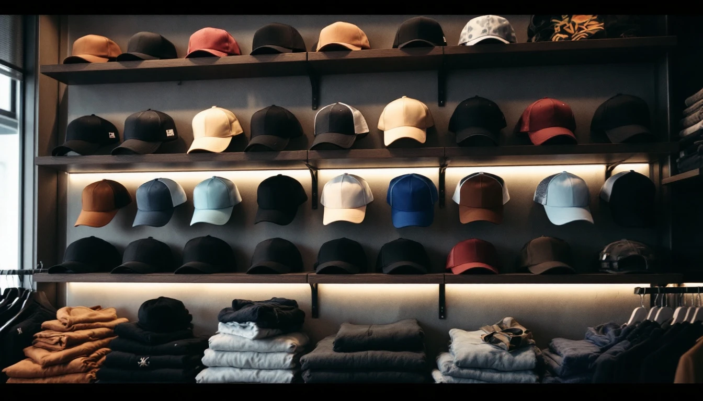
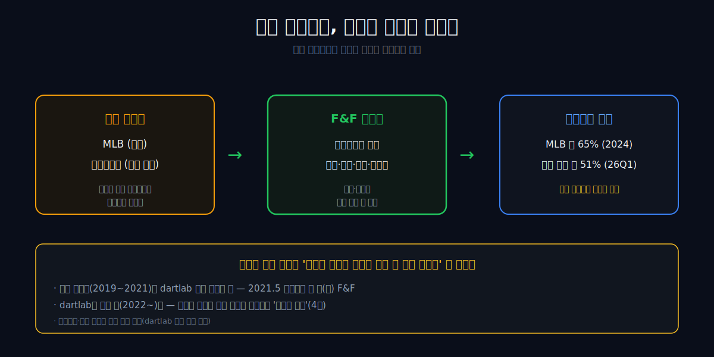
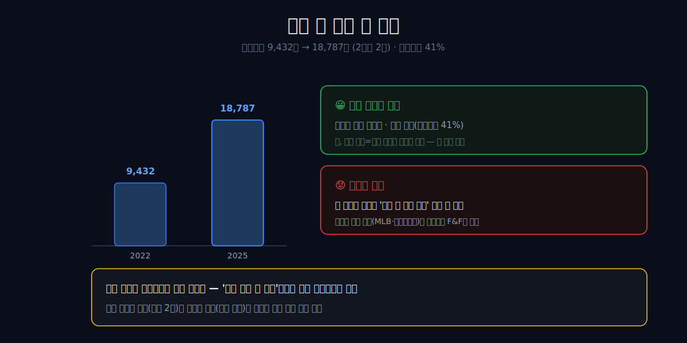

<script>
	import CompanyFinancials from '$lib/components/blog/CompanyFinancials.svelte';
</script>

> **데이터 기준**: 2026-06-19 dartlab 실측 — F&F(383220) **연결 재무제표(CFS)** 기준. ※F&F는 2021년 5월 1일을 분할기일로 패션사업부문을 인적분할해 설립됐고 2021년 5월 21일 유가증권시장 매매가 시작됐다. 이 글의 재무 spine은 2022~2025 연간과 2026년 1분기로 제한한다.
>
> **핵심 숫자**: 2025년 매출 **1조9,340억** · 영업이익 **4,686억** (영업이익률 **24.2%**) · 매출총이익률 **66.8%** · 중국법인 매출 **9,603억** · 자본총계 **1조8,787억** · 부채비율 **41.1%**
>
> **이 글의 용어**: 라이선스(license) = 일정 지역·기간에 브랜드를 전개할 권리 · IP = 브랜드 지식재산권 자체 · 외주가공 = 생산공정을 외부 업체에 맡기고 회사는 기획·디자인·유통을 맡는 구조 · 매출총이익률 = (매출-매출원가)÷매출 · 단일 영업부문 = 공시상 브랜드별 손익이 분리되지 않는다는 뜻.

---

## 프롤로그 — 매출은 남았고, 마진이 빠졌다

F&F를 그냥 패션 회사로 보면 첫 줄부터 이상하다. 2022년 매출은 1조8,089억이었다. 2025년 매출은 1조9,340억이다. 4년 동안 매출은 1,251억 늘었다. 그런데 영업이익률은 29.0%에서 24.2%로 낮아졌다.

```python
import dartlab
c = dartlab.Company("383220")
c.select("IS", ["sales", "gross_profit", "operating_profit"], freq="Y")
```

| 항목 (1년치, 억원) | 2022 | 2023 | 2024 | 2025 | 2026Q1 |
|---|---:|---:|---:|---:|---:|
| 매출액 | 18,089 | **19,785** | 18,960 | 19,340 | 5,609 |
| 매출총이익률 | **70.6%** | 68.0% | 65.8% | 66.8% | 65.6% |
| 영업이익 | 5,249 | **5,515** | 4,507 | 4,686 | 1,535 |
| 영업이익률 | **29.0%** | 27.9% | 23.8% | 24.2% | 27.4% |

숫자는 두 번 멈춰 세운다. 첫째, 매출이 무너진 회사가 아니다. 2024년에 매출이 한 번 쉬었지만 2025년에 다시 1조9천억대로 올라왔다. 둘째, 이익률은 2022년 29.0%에서 2024년 23.8%로 내려왔고, 2025년에도 24.2%에 그쳤다. 2026년 1분기 27.4%는 반가운 반등이지만, 한 분기만으로 구조가 복구됐다고 쓰기에는 이르다.



이 글의 질문은 그래서 단순하다. **왜 매출은 버텼는데 마진은 5%p 가까이 낮아졌나.** 답은 "옷이 안 팔렸다"가 아니다. F&F는 옷을 직접 만드는 제조사라기보다, 라이선스 브랜드와 자체 IP를 섞어 기획·디자인·생산관리·유통·마케팅을 굴리는 운영 회사에 가깝다. 2025년 사업보고서는 이 회사가 DISCOVERY EXPEDITION, MLB, MLB KIDS, DUVETICA, SUPRA, SERGIO TACCHINI를 판매한다고 설명한다. 같은 문서에서 위탁판매와 사입판매, 유통망 수수료도 함께 언급한다. 즉 손익계산서의 마진은 "의류 원가"만으로 풀리지 않는다. 브랜드 권리, 외주가공비, 광고선전비, 지급수수료, 중국 법인 매출을 같이 봐야 한다.

그래서 제목을 조금 고쳐야 한다. "영업이익 1,000억이 사라졌다"는 2023년과 2024년 두 점을 비교하면 맞다. 그러나 2025년에 영업이익은 178억 늘었고 2026년 1분기도 강했다. 더 정확한 문장은 이것이다. **F&F는 매출이 망가진 회사가 아니라, 한때 29%였던 영업이익률이 24%대로 내려온 회사다.** 이 차이를 놓치면 라이선스 사업의 강점도, 리스크도 다르게 보인다.

---

## 1막 — 옷장사 마진만으로는 설명이 안 된다

**패션 회사가 매출총이익률 66.8%를 낸다.** 이 숫자는 제조업처럼 읽으면 어긋난다. 제품을 팔아 매출을 잡지만, 공시가 보여주는 비용의 얼굴은 단순한 원단비와 봉제비가 아니다.

2025년 연결 매출 1조9,340억 가운데 매출원가는 6,422억이었다. 매출총이익은 1조2,918억이다. 매출총이익률은 66.8%다. 2022년에는 70.6%였고, 2023년 68.0%, 2024년 65.8%까지 내려온 뒤 2025년 66.8%로 조금 회복했다. 높은 수준이지만 방향은 분명하다. 총마진이 예전만큼 높지는 않다.



사업보고서의 비용 성격별 분류를 보면 더 선명해진다. 2025년 별도 기준 비용에는 외주가공비 5,896억, 지급수수료 3,819억, 감가상각비 및 무형자산상각비 539억, 광고선전비 365억이 잡힌다. 연결 기준도 같은 방향이다. F&F는 원재료를 대량으로 사서 공장을 돌리는 회사처럼 보이지 않는다. 기획과 디자인, 브랜드 전개, 판매망, 마케팅, 외주 생산관리가 손익의 중심이다.

여기서 "공장이 없다"거나 "옷을 만들지 않는다"고 쓰면 과하다. 회사는 스스로 제품을 기획·디자인·생산·유통한다고 말한다. 다만 그 생산의 상당 부분은 외주가공비로 드러난다. 그러니 정확한 표현은 이렇다. **F&F는 생산설비를 무겁게 쥐는 의류 제조사라기보다, 외주 생산 기반의 브랜드 운영 회사다.** 높은 매출총이익률은 이 운영 구조에서 나온다.

이 구조는 강하다. 재고와 매장, 광고, 수수료를 잘 통제하면 적은 유형자산으로 큰 매출총이익을 남긴다. 하지만 같은 이유로 약하다. 유행이 바뀌거나 브랜드 권리의 힘이 줄거나 신규 지역에 마케팅비가 먼저 들어가면, 매출이 크게 빠지지 않아도 영업이익률이 먼저 내려간다. 바로 이 장면이 2022~2025년에 나타났다.

---

## 2막 — F&F가 실제로 쥔 것: 권리, 유통, 데이터

**F&F가 실제로 쥔 것은 무엇인가.** 기존 문장처럼 "브랜드도 없다"고 쓰면 틀린다. 2025년 사업보고서는 라이선스 브랜드와 자체 브랜드를 함께 적고 있다. DISCOVERY, MLB, MLB KIDS는 라이선스 축이고, DUVETICA, SUPRA, SERGIO TACCHINI는 자체 브랜드 또는 IP 확보 축으로 봐야 한다.

공식 연혁도 바로잡아야 한다. 사업보고서는 분할 전 패션사업부문이 1997년 6월 라이선스 브랜드 MLB를 런칭했고, 2010년 2월 MLB KIDS를 런칭했으며, 2012년 8월 DISCOVERY를 런칭했다고 설명한다. 기존 초안의 "2011년 MLB 라이선스"는 이 공식 문서와 맞지 않는다. 2019년부터는 MLB 글로벌 비즈니스가 중국까지 확장됐다.



이 차이가 중요하다. MLB와 DISCOVERY는 F&F가 처음부터 만든 상표가 아니다. 그러나 F&F는 그 브랜드를 한국과 아시아 시장의 의류 사업으로 번역했다. 모자, 신발, 의류, 키즈 라인, 온라인·오프라인 유통망, 면세점·백화점·대리점·직영점·자사몰을 묶어 하나의 사업으로 굴렸다. 브랜드 원천과 운영 능력은 다르다. F&F의 강점은 전자보다 후자다.

그러나 2022년 이후에는 다른 움직임도 있다. SERGIO TACCHINI는 2022년 7월 자체 브랜드 확보를 통한 지속 성장을 위해 100% 지분을 취득한 IP 보유 법인과 운영 법인이다. DUVETICA와 SUPRA도 공시에 자체 브랜드로 등장한다. 즉 F&F를 "남의 브랜드만 빌리는 회사"로 고정하면 최신 공시를 놓친다. 더 정확한 문장은 이것이다. **F&F는 라이선스 브랜드로 큰 현금창출력을 만들었고, 그 의존을 낮추기 위해 자체 IP를 붙이는 중이다.**

이 문장은 투자 판단에도 더 유용하다. 라이선스 사업은 권리 갱신과 지역 확장에 민감하다. 자체 IP 사업은 초기 비용과 브랜드 인지도에 민감하다. 두 축은 같은 패션 사업이지만 위험의 종류가 다르다. F&F의 다음 3년은 이 두 축의 비중 변화로 읽어야 한다.

---

## 3막 — 중국은 둔화가 아니라 집중 리스크로 읽는다

**중국을 어떻게 써야 정확한가.** 기존 초안은 "MLB 중국 성장 급둔화"를 중심에 놓았다. 하지만 2025년 사업보고서는 다르게 말한다. 에프앤에프 차이나는 MLB 중국 비즈니스 전개를 위해 100% 출자한 현지법인이고, 2019년 6월 T몰을 시작으로 온·오프라인 시장에 확장했다. 2025년 중국법인 매출은 9,603억, 전기 대비 11.9% 성장이다.



그러니 중국 서사는 "성장 급둔화"가 아니라 "집중 리스크"로 바꾸는 게 맞다. 연결 매출 1조9,340억에 중국법인 매출 9,603억을 단순 비교하면 49.7% 규모다. 내부거래와 연결조정이 있어 정확한 지역 비중이라고 단정할 수는 없지만, 사업의 절반 가까운 크기가 중국 법인에서 나온다는 감각은 충분히 강하다. 이 정도면 중국 소비, 온라인 플랫폼, 오프라인 매장 확장, 환율, 현지 마케팅 비용이 전사 실적에 직접 닿는다.

2025년의 중국 숫자는 양면적이다. 좋은 쪽은 매출이다. 중국법인 매출은 1,025억 증가했고 회사는 MLB의 견고한 성장을 원인으로 적었다. 나쁜 쪽은 비용이다. 2024년 11월 중국 장춘에 DISCOVERY 1호점을 내며 아웃도어 브랜드를 전개했고, 2025년에는 중국 내 DISCOVERY 인지도 제고를 위해 마케팅 집행 비용이 늘었다. 사업보고서는 판매비와관리비 증가 항목으로 광고선전비, 지급수수료, 무형자산상각비를 든다.

이 장면이 F&F의 핵심이다. 중국은 성장이 멈춘 곳이 아니다. 오히려 2025년에는 공식적으로 성장했다. 그런데 새 브랜드를 심는 과정에서는 비용이 먼저 나온다. MLB는 이미 작동하는 엔진이고, DISCOVERY 중국은 초기 전개 비용이 필요한 엔진이다. 같은 중국 안에서도 브랜드의 성숙도가 다르다. 따라서 "중국이 좋다/나쁘다"가 아니라 **MLB 중국의 현금창출력으로 DISCOVERY 중국의 초기 비용을 감당하는 구조가 얼마나 오래 유지될지**를 봐야 한다.

---

## 4막 — 매출보다 먼저 움직인 것은 비용의 모양이었다

**매출이 유지됐는데 왜 영업이익률이 낮아졌나.** 이 질문은 손익계산서의 두 줄로 시작한다. 매출총이익률과 판매비와관리비다.

```python
c.select(
    "IS",
    ["sales", "cost_of_sales", "gross_profit", "selling_and_administrative_expenses", "operating_profit"],
    freq="Y",
)
```

| 항목 (억원) | 2022 | 2023 | 2024 | 2025 |
|---|---:|---:|---:|---:|
| 매출액 | 18,089 | 19,785 | 18,960 | 19,340 |
| 매출원가 | 5,327 | 6,323 | 6,490 | 6,422 |
| 매출총이익 | 12,762 | 13,462 | 12,470 | 12,918 |
| 판매비와관리비 | 7,513 | 7,947 | 7,963 | 8,232 |
| 영업이익 | 5,249 | 5,515 | 4,507 | 4,686 |


2023년에서 2024년으로 넘어갈 때 매출총이익은 992억 줄고, 판매비와관리비는 15억 늘었다. 그러면 영업이익은 1,008억 줄어든다. 이 숫자는 기존 제목의 "1,000억"과 정확히 만난다. 하지만 그 원인을 중국 둔화 하나로 쓰면 과하다. dartlab 재무제표는 브랜드별·지역별 이익률을 분해해주지 않는다. F&F 공시도 단일 영업부문이라 브랜드별 손익을 직접 보여주지 않는다.

대신 2025년 사업보고서가 말해주는 것은 있다. 2025년에는 매출이 전년 대비 380억 늘고, 영업이익도 178억 늘었다. 매출원가는 68억 줄었지만 판매비와관리비는 270억 늘었다. 회사는 판매비와관리비 증가의 주요 항목으로 광고선전비, 지급수수료, 무형자산상각비를 제시한다. 특히 중국 DISCOVERY 인지도 제고를 위한 마케팅 집행 비용이 광고선전비 증가에 영향을 줬다고 설명한다.

즉 2025년의 장면은 "옷이 덜 팔려서 망가졌다"가 아니다. **신규 브랜드와 지역 확장에 비용이 붙었고, 기존 고마진 구조가 예전만큼 가볍지 않아졌다**에 가깝다. 매출총이익률은 2024년 65.8%에서 2025년 66.8%로 조금 회복했지만, 2022년 70.6%에는 못 미친다. 판매비와관리비는 2022년 7,513억에서 2025년 8,232억으로 늘었다. 매출이 1,251억 늘 동안 판관비는 719억 늘었다. 이 차이가 이익률을 눌렀다.

2026년 1분기는 그래서 중요하다. 매출 5,609억, 영업이익 1,535억, 영업이익률 27.4%다. 2025년 연간 24.2%보다 높다. 이 반등이 일시적인 계절성인지, 중국 DISCOVERY 비용이 안정화되는 신호인지, 국내 경기 회복과 중국 MLB가 동시에 붙은 결과인지는 다음 분기 공시를 더 봐야 한다. 한 분기 회복으로 구조 복구를 선언하지 않는 것이 옳다.

---

## 4.5막 — 1,000억 감소의 정확한 산식

2023년에서 2024년으로 영업이익이 1,008억 줄었다. 이 숫자는 자극적이지만, 자극적으로 쓰면 오히려 흐려진다. 분해하면 아주 차갑다.

첫 줄은 매출이다. 매출은 1조9,785억에서 1조8,960억으로 825억 줄었다. 매출 감소만으로도 영업이익은 줄 수 있다. 그러나 매출 감소율은 4.2%다. 영업이익 감소율 18.3%보다 훨씬 작다. 그래서 문제는 매출 감소 하나가 아니다.

둘째 줄은 매출원가다. 2023년 매출원가는 6,323억, 2024년 매출원가는 6,490억이다. 매출은 줄었는데 매출원가는 167억 늘었다. 이 조합 때문에 매출총이익은 1조3,462억에서 1조2,470억으로 992억 줄었다. 2024년 영업이익 감소의 대부분은 이 줄에서 나온다.

셋째 줄은 판매비와관리비다. 2023년 7,947억에서 2024년 7,963억으로 15억 늘었다. 금액만 보면 크지 않다. 하지만 매출총이익이 이미 992억 줄어든 상태에서 판관비가 줄지 않으면 영업이익률은 더 세게 내려간다. 고정비가 아주 큰 제조업은 아니더라도, 광고·매장·수수료·인력·사용권자산 비용은 매출이 흔들릴 때 바로 줄지 않는다.

이 산식을 쓰면 결론이 달라진다. "중국이 꺾였다"보다 먼저 봐야 할 것은 **매출총이익률의 하락**이다. 2023년 68.0%였던 매출총이익률이 2024년 65.8%로 내려갔다. F&F가 높은 마진을 유지하는 회사라는 전제가 흔들린 지점은 이 2.2%p다. 2025년에 66.8%로 일부 회복했지만, 2022년 70.6%와는 거리가 있다.

넷째 줄은 2025년이다. 2025년에는 매출이 380억 늘고 매출원가가 68억 줄었다. 매출총이익은 448억 늘었다. 정상적으로라면 영업이익도 그만큼 좋아져야 한다. 그런데 판관비가 270억 늘어 영업이익 증가는 178억에 그쳤다. 이것이 2025년의 핵심이다. 매출총이익은 회복했지만, 그 회복을 판관비가 일부 흡수했다.

따라서 다음 공시에서 볼 순서는 정해져 있다. 매출 성장률보다 먼저 매출총이익률을 본다. 그 다음 판매비와관리비가 매출보다 빠르게 늘었는지 본다. 그 다음 광고선전비·지급수수료·무형자산상각비가 어느 항목에서 늘었는지 본다. 마지막으로 중국법인 매출과 DISCOVERY 전개 비용을 연결한다. 이 순서를 지켜야 "좋은 성장"과 "비싼 성장"을 구분할 수 있다.

---

## 5막 — 현금흐름은 나쁘지 않다, 그래서 더 냉정해야 한다

**이 회사는 현금이 약한가.** 아니다. 오히려 재무상태와 현금흐름은 이 글의 공포를 낮춘다. 2025년 영업활동현금흐름은 3,552억이다. 투자활동현금흐름은 -323억이다. 둘을 단순 합산하면 3,229억의 현금 여력이 남는다. 이 숫자는 엄밀한 잉여현금흐름 정의가 아니지만, 사업이 현금을 만들고 있다는 감각은 충분히 준다.

```python
c.select("CF", ["operating_cashflow", "investing_cashflow", "financing_cashflow"], freq="Y")
```

| 항목 (억원) | 2022 | 2023 | 2024 | 2025 | 2026Q1 |
|---|---:|---:|---:|---:|---:|
| 영업활동현금흐름 | 3,441 | 4,770 | 3,988 | 3,552 | 1,206 |
| 투자활동현금흐름 | -1,458 | -1,003 | -4,529 | -323 | 1,342 |
| 영업CF+투자CF | 1,983 | 3,767 | -541 | 3,229 | 2,548 |

2024년만 보면 투자활동현금흐름 -4,529억이 눈에 걸린다. 이 해에는 투자현금이 크게 빠졌다. 하지만 2025년에는 -323억으로 축소됐고, 2026년 1분기에는 +1,342억이다. 이것만으로 "투자가 끝났다"고 쓰면 과하지만, 2024년의 투자 부담이 2025년에는 완화됐다는 사실은 분명하다.



재무상태표도 튼튼하다. 자본총계는 2022년 9,432억에서 2025년 1조8,787억으로 늘었다. 부채총계는 7,728억이고 부채비율은 41.1%다. 회사는 2025년 연결기준 지배기업소유주 귀속 자본이 이익잉여금 증가로 전년 대비 3,165억 늘었다고 설명한다. 차입금 의존도도 7.0%로 낮은 편이라고 적었다.

하지만 여기서도 함정이 있다. 재무가 튼튼하다는 사실과 사업모델의 질이 영구적이라는 주장은 다르다. 자본이 두꺼우면 신규 브랜드 진출, 마케팅, 재고, M&A를 버틸 수 있다. 그러나 두꺼운 자본이 라이선스 갱신 리스크나 브랜드 선호 변화 자체를 없애주지는 않는다. 이 회사의 안정성은 "부채가 적다"에서 끝나지 않는다. **무엇에 돈을 더 써도 마진이 돌아오는가**까지 확인해야 한다.

그래서 2025년 재고자산 4,032억도 같이 봐야 한다. 전년 3,250억에서 782억 늘었다. 회사는 자산 증가 요인으로 현금및현금성자산 증가와 재고자산 증가를 함께 적었다. 재고 증가는 성장 준비일 수도 있고, 수요 둔화의 신호일 수도 있다. F&F처럼 브랜드와 시즌성이 강한 회사에서는 다음 분기 매출총이익률과 재고 회전이 같은 방향으로 움직이는지가 중요하다.

---

## 5.5막 — 재고는 성장 준비이자 할인 압력이다

패션 회사의 재고는 숫자 하나로 좋고 나쁨을 말하기 어렵다. 새 매장을 열고 새 브랜드를 전개하려면 재고가 먼저 필요하다. 중국 DISCOVERY를 키우려면 상품을 깔아야 하고, 채널을 늘리면 물량도 필요하다. 그래서 재고 증가가 항상 위험은 아니다.

하지만 재고는 가장 빨리 마진으로 돌아온다. 팔리지 않는 재고는 할인으로 빠지고, 할인은 매출총이익률을 낮춘다. F&F의 2025년 재고자산은 4,032억으로 전년 대비 24.1% 늘었다. 같은 해 연결 매출 증가율은 2.0%다. 재고 증가율이 매출 증가율보다 훨씬 높다. 이것을 곧바로 악재로 쓰면 안 되지만, 다음 분기부터는 할인과 총마진을 같이 봐야 한다.

재고가 좋은 재고인지 나쁜 재고인지는 세 줄로 확인한다. 첫째, 매출이 따라오는가. 둘째, 매출총이익률이 유지되는가. 셋째, 영업활동현금흐름이 따라오는가. 2026년 1분기 매출과 영업이익률은 좋아 보인다. 그래서 지금은 "재고가 위험하다"가 아니라 "재고가 어떤 가격으로 팔리는지 확인할 시점"이다.

이 지점은 재고자산과 평가손실 읽는 법과 같은 원리다. 재고는 자산이지만, 팔릴 가격이 흔들리면 비용이 된다. F&F처럼 브랜드 이미지와 시즌성이 중요한 회사는 재고를 싸게 털어내는 순간 매출은 유지돼도 매출총이익률이 먼저 내려간다. 그래서 이 글은 매출 성장률만 보지 말고 총마진을 먼저 보자고 계속 말한다.

현금도 같은 방식으로 읽는다. 2025년 영업활동현금흐름 3,552억은 약하지 않다. 하지만 현금이 좋다고 해서 재고 리스크가 사라지는 것은 아니다. 좋은 현금흐름은 시간을 벌어준다. 할인 압력, 브랜드 전개 비용, 라이선스 갱신 리스크를 버틸 시간을 준다. 그러나 시간이 생겼다는 것과 마진이 회복됐다는 것은 다르다.

---

## 6막 — 강함의 원천은 라이선스만이 아니다

**그래서 이 회사는 남의 브랜드 하나에 서 있나.** 절반만 맞다. MLB와 DISCOVERY가 핵심인 것은 맞다. 그러나 2025년 공시는 DUVETICA, SUPRA, SERGIO TACCHINI까지 같은 브랜드 목록에 올린다. 특히 SERGIO TACCHINI는 IP 보유 법인과 운영 법인을 100% 취득한 케이스다. F&F가 라이선스 의존을 낮추려는 움직임을 이미 하고 있다는 뜻이다.


SERGIO TACCHINI는 아직 전사 규모를 바꿀 만큼 크지 않다. 2025년 IP HOLDINGS 매출은 1.2억 원이고, OPERATIONS 매출은 486억 원이다. 연결 매출 1조9,340억에 비하면 작다. 그렇지만 의미는 있다. 이 회사가 "라이선스 운영만 잘하는 회사"에서 "라이선스와 자체 IP를 같이 굴리는 회사"로 이동하려는 시도이기 때문이다.

여기서 가장 큰 검증 한계가 나온다. 사업보고서는 공시상 단일 영업부문이다. 브랜드별 매출 일부와 법인별 설명은 나오지만, MLB 중국의 영업이익률, DISCOVERY 중국의 손실 규모, SERGIO TACCHINI의 마진을 독립적으로 보여주지는 않는다. 그러니 "MLB가 벌고 DISCOVERY가 까먹는다" 같은 문장은 쓰면 안 된다. 쓸 수 있는 것은 더 좁다. **중국 MLB는 2025년 성장했고, DISCOVERY 중국 전개로 마케팅 비용이 늘었으며, 브랜드별 수익성은 공시만으로 분리 검증되지 않는다.**

비교하면 더 쉽다. [나이키](/blog/NKE-nike)는 자기 브랜드와 글로벌 도매·직판 구조를 가진 회사다. [언더아머](/blog/UAA-under-armour)는 브랜드는 소유하지만 성장 둔화와 재고·할인 압력에 흔들린다. F&F는 이 둘과 다르다. 브랜드 원천을 전부 소유한 회사도 아니고, 단순 유통상도 아니다. 라이선스 권리와 자체 IP를 섞어 아시아 시장에 맞게 상품화하고 유통하는 운영자다.

같은 중국 시장을 읽어도 [아모레퍼시픽](/blog/090430-amorepacific)은 면세·중국 소비 채널 변화에 흔들린 케이스이고, F&F는 중국법인으로 MLB를 키우고 DISCOVERY를 심는 케이스다. [실리콘투](/blog/257720-silicon2)는 여러 K-뷰티 브랜드를 플랫폼처럼 유통하는 회사라 브랜드 포트폴리오 분산이 핵심이다. F&F는 더 집중적이다. 한두 브랜드의 성공이 전사 수익성에 크게 닿는다. 이것이 매력이고, 동시에 리스크다.

그러므로 F&F를 볼 때 "자기 브랜드가 없으니 위험"이라고 단정할 필요는 없다. 더 좋은 질문은 이렇다. **라이선스 브랜드가 만든 현금으로 자체 IP와 신규 지역 확장을 키우고 있는가, 아니면 신규 비용이 기존 마진을 계속 갉아먹는가.** 이 질문 하나가 다음 공시를 읽는 기준이 된다.

---

## 7막 — 과거~현재 패턴과 산업 패턴

F&F의 분할 후 4년은 짧지만 패턴은 보인다. 2022년은 고마진의 출발점이었다. 매출총이익률 70.6%, 영업이익률 29.0%다. 2023년은 매출 피크다. 매출 1조9,785억, 영업이익 5,515억이다. 2024년은 리셋이다. 매출은 1조8,960억으로 낮아졌고 영업이익률은 23.8%까지 내려왔다. 2025년은 회복이지만 완전 복구는 아니다. 매출 1조9,340억, 영업이익률 24.2%다. 2026년 1분기는 다시 높은 수익성을 보여준다.

이 패턴은 패션 산업의 일반 패턴과 닿아 있다. 패션 회사는 재고, 유행, 채널, 광고가 같이 움직인다. 브랜드가 뜰 때는 매출총이익률이 높고, 판관비도 매출에 흡수된다. 하지만 신규 지역과 신규 브랜드를 열 때는 광고비와 수수료가 먼저 붙는다. 재고가 늘면 다음 시즌 가격 정책도 중요해진다. 매출이 유지돼도 마진이 먼저 움직이는 이유가 여기 있다.

F&F는 이 산업 패턴을 조금 특이하게 탄다. 제조설비보다 브랜드 운영과 유통망이 중요하고, 지역 확장에서는 중국 법인의 성과가 크다. 2025년 중국법인 매출 9,603억은 강한 숫자다. 동시에 DISCOVERY 중국 전개로 마케팅 비용이 늘었다는 공시 문장은 다음 장면을 예고한다. 이미 성공한 MLB와 새로 심는 DISCOVERY가 같은 중국 법인과 같은 판관비 안에서 만난다. 이때 전사 영업이익률만 보면 섞여 보인다. 그래서 브랜드별 수익성을 추정하지 말고, 공식적으로 확인 가능한 비용 항목과 법인별 매출을 나란히 봐야 한다.

투자 포인트도 여기서 나온다. 첫째, 영업이익률이 2026년 1분기 수준을 얼마나 유지하는가. 둘째, 중국법인 매출 성장률이 2025년의 11.9%에서 유지되는가. 셋째, 광고선전비와 지급수수료가 매출보다 빨리 늘지 않는가. 넷째, 재고자산 증가가 다음 분기 매출총이익률을 누르지 않는가. 다섯째, SERGIO TACCHINI 같은 자체 IP가 매출만 늘리는지, 실제 이익률 개선에도 기여하는지다.

이 기준으로 보면 F&F는 "이미 끝난 성장주"도 아니고 "무조건 고마진 프랜차이즈"도 아니다. 분할 이후 짧은 기간에 높은 수익성과 중국 성장을 보여줬지만, 2024년 마진 리셋을 겪었고 2025년에는 회복과 비용 증가가 동시에 있었다. 그래서 지금 이 회사를 읽는 핵심은 성장률보다 **마진의 회복 방식**이다.

---

## 8막 — 이 이야기가 틀리는 조건

이 글의 결론은 F&F가 망가졌다는 말이 아니다. 오히려 반대다. F&F는 현금흐름과 재무상태가 괜찮고, 2026년 1분기 수익성도 강하다. 다만 2022년식 고마진을 그대로 미래에 연장하면 위험하다는 말이다. 이 이야기는 다음 조건에서 틀린다.

첫째, 영업이익률이 27% 안팎으로 빠르게 복귀하고 2~3개 분기 유지되면, 2024년의 마진 하락은 구조가 아니라 일시적 조정이 된다. 2026년 1분기 27.4%는 이 가능성을 열어둔다.

둘째, 중국 DISCOVERY 전개 비용이 매출 성장으로 흡수되면, 2025년 광고선전비 증가는 초기 투자였다고 볼 수 있다. 이 경우 비용 증가는 마진 훼손이 아니라 신규 브랜드 런칭 비용이다.

셋째, 재고자산 증가가 할인으로 이어지지 않고 정상 판매로 회수되면, 2025년 재고 증가는 위험 신호가 아니라 성장 준비가 된다. 다음 공시에서는 재고와 매출총이익률을 같이 봐야 한다.

넷째, SERGIO TACCHINI와 DUVETICA, SUPRA가 유의미한 매출과 이익을 만들면, F&F는 라이선스 의존 회사에서 자체 IP 포트폴리오 회사로 넘어간다. 아직 전사 규모를 바꿀 정도는 아니지만 방향은 중요하다.

다섯째, 중국법인 매출이 2025년처럼 두 자릿수 성장하고 국내 매출도 같이 회복되면, 2024년 영업이익률 하락은 "성장 엔진이 꺼졌다"가 아니라 "새 확장 비용이 먼저 반영됐다"로 다시 읽힌다.

---

## 비교해야 할 대상 — 나이키가 아니라 세 가지 질문이다

F&F를 비교할 때 흔한 실수는 "패션 회사니까 나이키와 비교"에서 멈추는 것이다. [나이키](/blog/NKE-nike)는 좋은 비교 대상이지만, 하나의 답은 아니다. 나이키는 글로벌 브랜드 소유자이고, F&F는 라이선스 브랜드 운영과 자체 IP 확보가 섞인 회사다. 같은 운동화와 의류를 팔아도 손익의 출처가 다르다.

첫 번째 비교 질문은 **브랜드를 소유하는가, 운영하는가**다. 나이키와 [언더아머](/blog/UAA-under-armour)는 브랜드 소유의 문제를 보여준다. 브랜드를 소유하면 장기 권리는 강하지만, 제품 혁신과 글로벌 수요 둔화도 직접 맞는다. F&F는 MLB와 DISCOVERY에서 브랜드 원천을 빌려 운영했고, SERGIO TACCHINI에서는 IP를 확보했다. 두 모델을 동시에 들고 있다. 그래서 단일 비교 대상보다 권리의 종류를 먼저 봐야 한다.

두 번째 비교 질문은 **수수료형인가, 재고형인가**다. [코스트코](/blog/COST-costco)는 낮은 상품 마진과 멤버십 수익이 결합된 회사다. 상품을 팔지만 진짜 이익의 일부는 회비에서 나온다. F&F는 그 반대에 가깝다. 상품 매출에서 높은 총마진을 만들지만, 재고와 브랜드 비용을 직접 안는다. 매출총이익률은 높아도 재고 할인과 광고비가 손익을 흔든다. 코스트코와 비교하면 "낮은 마진이 약함이 아니듯, 높은 마진도 영구 강점이 아니다"라는 점이 보인다.

세 번째 비교 질문은 **지역 집중이 어느 정도인가**다. [아모레퍼시픽](/blog/090430-amorepacific)은 중국 소비와 면세 채널 변화가 실적을 어떻게 흔드는지 보여준다. F&F도 중국이 중요하지만 구조는 다르다. 아모레퍼시픽은 자체 화장품 브랜드와 채널의 문제였고, F&F는 중국법인에서 MLB를 키우고 DISCOVERY를 새로 심는 문제다. 지역은 같아도 리스크의 모양이 다르다.

네 번째 비교 질문은 **유통 플랫폼인가, 브랜드 운영자인가**다. [실리콘투](/blog/257720-silicon2)는 여러 K-뷰티 브랜드를 글로벌 채널에 태우는 구조다. 특정 브랜드 하나에 대한 의존이 상대적으로 분산된다. F&F는 브랜드 수가 많아지고 있지만, 전사 손익은 여전히 MLB와 DISCOVERY의 무게가 크다. 실리콘투와 비교하면 F&F의 집중성이 더 잘 보인다.

다섯 번째 비교 질문은 **생산을 얼마나 직접 안는가**다. [코스맥스](/blog/192820-cosmax)는 브랜드를 대신해 제품을 만드는 ODM 회사다. 제조 역량과 고객사 주문, 생산능력, 원가 관리가 핵심이다. F&F는 외주가공비가 크지만 코스맥스처럼 제조 자체가 본업인 회사는 아니다. F&F의 핵심은 생산능력보다 브랜드를 어떤 시장에 어떤 가격으로 놓는가다. 그래서 유형자산 회전율보다 매출총이익률, 판관비, 재고, 브랜드 권리의 조합이 더 중요하다.

이 다섯 질문을 통과하면 F&F를 더 정확히 읽을 수 있다. 나이키처럼 브랜드를 소유한 회사도 아니고, 코스트코처럼 회비가 핵심인 유통사도 아니며, 코스맥스처럼 제조능력이 핵심인 회사도 아니다. F&F는 권리를 빌리고 일부는 사들이며, 외주 생산과 유통망을 묶어 아시아 소비시장에 맞게 굴리는 회사다. 그래서 이 회사의 핵심 지표는 매출 성장률 하나가 아니다. **매출총이익률, 판매비와관리비, 중국법인 매출, 재고, 자체 IP 매출**을 한 세트로 읽어야 한다.

---

## 공시를 읽는 순서 — 다섯 줄만 따라가면 된다

다음 분기 F&F 공시를 열면 맨 먼저 매출액을 보지 말고, 매출총이익률을 계산한다. 매출이 늘어도 매출원가가 더 빨리 늘면 이 회사의 좋은 점이 약해지는 것이다. 2024년에 벌어진 일이 바로 그것이다.

둘째, 판매비와관리비를 본다. 총마진이 회복됐는데 판관비가 더 빨리 늘면 영업이익률은 돌아오지 않는다. 2025년에 벌어진 일이 이것이다. 특히 광고선전비, 지급수수료, 감가상각비 및 무형자산상각비를 본다. 이 항목들은 신규 지역과 브랜드 전개 비용을 보여준다.

셋째, 중국법인 매출을 본다. 2025년 중국법인 매출 9,603억은 강하다. 그러나 이 숫자는 연결 매출과 내부거래 제거가 섞인 뒤 전사 손익으로 들어온다. 중국법인 매출이 늘어도 전사 영업이익률이 같이 오르지 않으면, 성장의 비용을 다시 봐야 한다.

넷째, 재고자산을 본다. 재고가 늘고 매출총이익률도 유지되면 성장 준비일 수 있다. 재고가 늘고 매출총이익률이 내려가면 할인 압력을 의심해야 한다. 2025년 재고자산 4,032억은 다음 공시에서 반드시 다시 볼 숫자다.

다섯째, SERGIO TACCHINI와 기타 자체 IP의 기여를 본다. 아직 규모는 작다. 그러나 라이선스 중심 구조에서 자체 IP를 붙이는 전환이 실제 매출과 이익으로 이어지는지 확인해야 한다. 이 축이 커지면 F&F의 리스크 설명도 달라진다.

이 순서를 지키면 결론이 과격해지지 않는다. F&F는 위험하다고 단정할 회사가 아니다. 동시에 2022년의 29% 영업이익률을 당연하게 연장할 회사도 아니다. 지금 필요한 것은 성장 서사가 아니라, 성장에 붙는 비용이 매출총이익률과 영업이익률에 어떻게 남는지 확인하는 일이다.

---

## 마지막 판단 — 매출 성장보다 마진의 질이다

F&F 글을 처음 쓸 때 가장 쉬운 결론은 "라이선스 회사라 위험하다"였다. 하지만 공시를 다시 읽으면 그 결론은 너무 거칠다. 라이선스 브랜드가 큰 축인 것은 맞지만, 회사는 자체 IP도 붙이고 있다. 중국 리스크가 큰 것도 맞지만, 2025년 중국법인 매출은 줄지 않고 11.9% 성장했다. 영업이익률이 낮아진 것도 맞지만, 2026년 1분기는 27.4%로 반등했다. 한 문장으로 끝낼 수 없는 회사다.

그래서 이 글의 결론은 더 좁다. **F&F는 매출이 아니라 마진의 질로 읽어야 한다.** 매출 1조9천억이 유지된다는 사실만으로는 충분하지 않다. 그 매출을 만들기 위해 매출원가가 얼마나 들었는지, 광고와 수수료가 얼마나 붙었는지, 재고가 다음 시즌에 어떤 가격으로 팔리는지, 중국법인 성장이 신규 브랜드 비용을 흡수하는지까지 봐야 한다.

좋은 시나리오는 분명하다. 중국 MLB가 계속 현금을 만들고, DISCOVERY 중국 마케팅비가 초기 비용으로 끝나며, SERGIO TACCHINI 같은 자체 IP가 작지만 꾸준히 커진다. 그러면 2024년의 영업이익률 하락은 구조 악화가 아니라 확장 비용의 한 구간으로 남는다. 이 경우 2026년 1분기 반등은 꽤 중요한 신호가 된다.

나쁜 시나리오도 분명하다. 매출은 유지되는데 매출총이익률이 65% 안팎에 머물고, 판관비가 계속 매출보다 빨리 늘며, 재고가 할인으로 풀린다. 그러면 F&F는 "고마진 라이선스 운영 회사"가 아니라 "성장 비용을 더 많이 내야 하는 패션 회사"로 다시 가격이 매겨질 수 있다. 같은 매출 1조9천억이라도 이익의 질은 완전히 달라진다.

따라서 다음 공시에서 첫 질문은 "매출이 몇 퍼센트 늘었나"가 아니다. 첫 질문은 "매출총이익률이 어디에 있는가"다. 두 번째 질문은 "판관비 증가가 신규 브랜드 투자로 설명되는가"다. 세 번째 질문은 "중국법인과 자체 IP가 전사 마진에 도움이 되는가"다. 이 세 질문에 답이 붙을 때 F&F의 높은 마진이 다시 구조인지, 아니면 과거의 최고치였는지 판단할 수 있다.

이 글을 한 줄로 요약하면 "라이선스가 위험하다"가 아니다. 그 문장은 너무 쉽고, 그래서 틀리기 쉽다. 라이선스는 F&F가 높은 마진을 만든 방법이기도 하고, 중국에서 빠르게 커진 이유이기도 하다. 위험은 라이선스 그 자체가 아니라, 라이선스와 지역 확장과 마케팅비가 같은 손익계산서 안에서 한꺼번에 움직인다는 데 있다.

반대로 "중국이 성장하니 괜찮다"도 충분하지 않다. 2025년 중국법인 매출은 성장했다. 그러나 성장한 매출이 전사 영업이익률을 2022년 수준으로 돌려놓지는 못했다. 성장률과 마진 복구는 다른 질문이다. 이 둘을 분리해서 볼 때 F&F의 숫자가 덜 과장된다.

마지막으로 "자체 IP를 확보했으니 리스크가 줄었다"도 아직 이르다. SERGIO TACCHINI는 방향을 보여주지만 규모는 작다. 자체 IP가 전사 구조를 바꾸려면 매출만이 아니라 이익 기여까지 보여줘야 한다. 그래서 다음 몇 개 분기는 F&F가 라이선스 운영 회사에서 브랜드 포트폴리오 회사로 넘어가는지, 아니면 기존 엔진 위에 새 비용을 더하는지 확인하는 기간이다.

결국 F&F의 좋은 점은 여전히 강하다. 높은 총마진, 낮은 부채비율, 중국법인 성장, 2026년 1분기 수익성 반등이 있다. 동시에 확인할 점도 명확하다. 2024년 이후 낮아진 영업이익률, 재고 증가, 판관비 증가, 브랜드별 손익 비공개다. 좋은 점과 확인할 점을 같은 표 위에 올려놓을 때 이 회사가 제대로 보인다.

그래서 다음 공시에서 숫자가 하나만 좋아졌다고 결론을 바꾸지 않는다. 매출, 매출총이익률, 판관비, 재고, 중국법인 매출이 같은 방향으로 움직일 때만 "마진의 질이 돌아왔다"고 쓸 수 있다.

반대로 이 다섯 줄 중 두세 줄이 엇갈리면 성장 서사는 잠시 멈춰야 한다. F&F는 매출보다 마진의 질이 먼저 말하는 회사다. 다음 보고서에서 이 순서가 유지되면 강한 회사이고, 깨지면 좋은 브랜드를 비싸게 키우는 회사가 된다.

그래서 이 글의 결론은 숫자를 기다리는 결론이다. 다음 분기 표가 이 글의 판정을 바꾼다. 그게 재무제표 읽기의 장점이자 판단 기준이다.

---

## 2026년에 봐야 할 다섯 가지

1. **영업이익률의 지속성** — 2026년 1분기 27.4%가 한 분기 반등인지, 2024~2025년의 24%대에서 벗어나는 신호인지 확인해야 한다.
2. **중국법인 매출과 DISCOVERY 비용** — 2025년 중국법인 매출 9,603억, 전년 대비 11.9% 성장. 여기에 DISCOVERY 중국 마케팅비가 어떻게 붙는지 봐야 한다.
3. **재고자산과 매출총이익률** — 2025년 재고자산은 4,032억으로 전년 대비 24.1% 증가했다. 재고가 할인으로 풀리면 매출총이익률이 먼저 반응한다.
4. **광고선전비·지급수수료·무형자산상각비** — 2025년 판관비 증가의 핵심 항목이다. 신규 브랜드 투자라면 시간이 지나며 매출로 흡수돼야 한다.
5. **라이선스와 자체 IP의 균형** — MLB·DISCOVERY가 계속 현금을 만들고, SERGIO TACCHINI·DUVETICA·SUPRA가 작은 보조축에서 실제 성장축으로 커지는지 확인해야 한다.


---

## 검증표

본문의 모든 인용 수치를 dartlab 호출과 결과로 검증한다. 외부 출처는 분리 표기. 📅 dartlab 실측 2026-06-19 · F&F(383220) 연결(CFS)·분할 후(2022~) 기준.

| 본문 수치 | 출처 / dartlab 호출 | 결과 |
|---|---|---|
| 매출 2022년 18,089억 → 2025년 19,340억, 피크 2023년 19,785억 | `c.select("IS",["sales"],freq="Y")` | ✓ 실측 |
| 영업이익 2023년 5,515억 → 2024년 4,507억 → 2025년 4,686억 | `c.select("IS",["operating_profit"],freq="Y")` | ✓ 실측 |
| 매출총이익률 2022년 70.6% → 2025년 66.8%, 2026Q1 65.6% | `gross_profit / sales` | ✓ 실측 |
| 영업이익률 2022년 29.0% → 2025년 24.2%, 2026Q1 27.4% | `operating_profit / sales` | ✓ 실측 |
| 2025년 영업활동현금흐름 3,552억, 투자활동현금흐름 -323억, 단순합산 3,229억 | `c.select("CF",["operating_cashflow","investing_cashflow"],freq="Y")` | ✓ 실측 |
| 자본총계 2022년 9,432억 → 2025년 18,787억, 부채비율 41.1% | `c.select("BS",["total_equity","total_liabilities"],freq="Y")` 및 2025 사업보고서 | ✓ 실측 |
| 2026Q1 매출 5,609억·영업이익 1,535억·영업이익률 27.4% | `c.select("IS",[...],freq="Q")` 및 [DART 2026년 1분기보고서](https://dart.fss.or.kr/dsaf001/main.do?rcpNo=20260515002764) | ✓ 실측 |
| F&F는 2021년 5월 1일 분할, 2021년 5월 21일 유가증권시장 매매 개시 | [F&F 2025 사업보고서 PDF](https://homepage-static.fnf.co.kr/file_69c232387be077.14583242.pdf), I. 회사의 개요 | 공식 공시 |
| MLB 1997년 6월 런칭, MLB KIDS 2010년 2월 런칭, DISCOVERY 2012년 8월 런칭 | F&F 2025 사업보고서, 주요사업의 내용 | 공식 공시 |
| 2025년 주요 브랜드: DISCOVERY EXPEDITION, MLB, MLB KIDS, DUVETICA, SUPRA, SERGIO TACCHINI | F&F 2025 사업보고서, MD&A 개요 | 공식 공시 |
| 중국법인 2025년 매출 9,603억, 전년 대비 11.9% 성장 | F&F 2025 사업보고서, 이사의 경영진단 및 분석의견 | 공식 공시 |
| SERGIO TACCHINI IP HOLDINGS 2025년 매출 1.2억, OPERATIONS 486억 | F&F 2025 사업보고서, 이사의 경영진단 및 분석의견 | 공식 공시 |
| 2025년 판매비와관리비 증가 요인: 광고선전비, 지급수수료, 무형자산상각비. DISCOVERY 중국 인지도 제고 마케팅 비용 증가 | F&F 2025 사업보고서, 매출액 및 영업이익 발생 요인 | 공식 공시 |
| 2025년 비용 성격별 분류: 외주가공비 5,896억, 지급수수료 3,819억, 광고선전비 365억, 감가상각비 및 무형자산상각비 539억 | F&F 2025 사업보고서, 비용의 성격별 분류 | 공식 공시 |
| 2025년 재고자산 4,032억, 전년 대비 24.1% 증가 | F&F 2025 사업보고서, 재무상태 및 영업실적 | 공식 공시 |

본문의 숫자 중 이 표에 없는 것은 발행 차단 대상이다.

---

<CompanyFinancials code="383220" />
