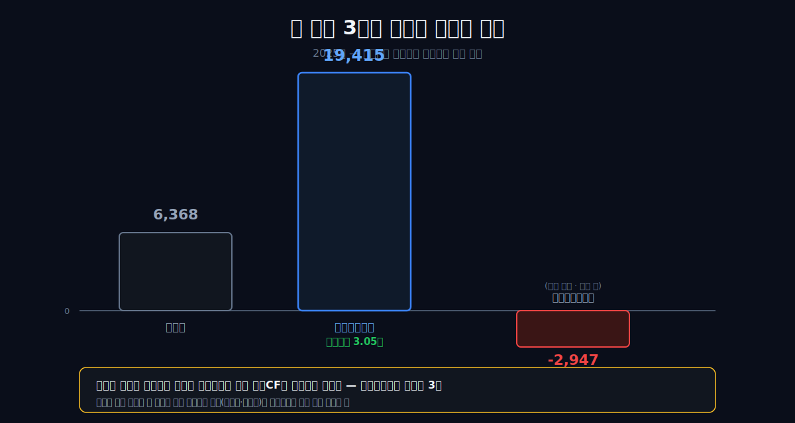
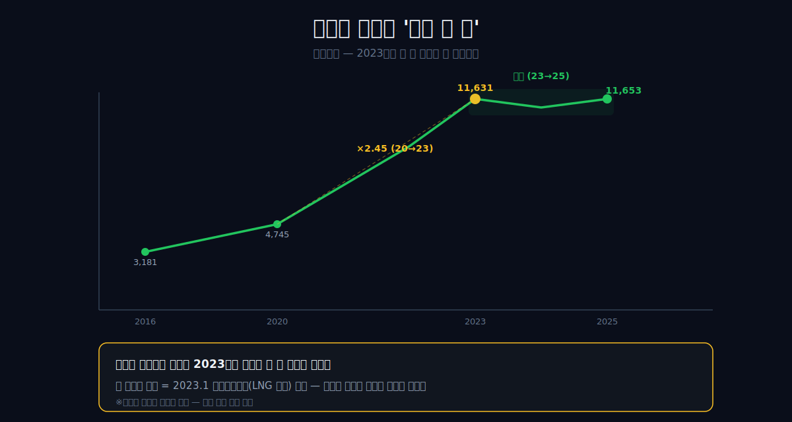
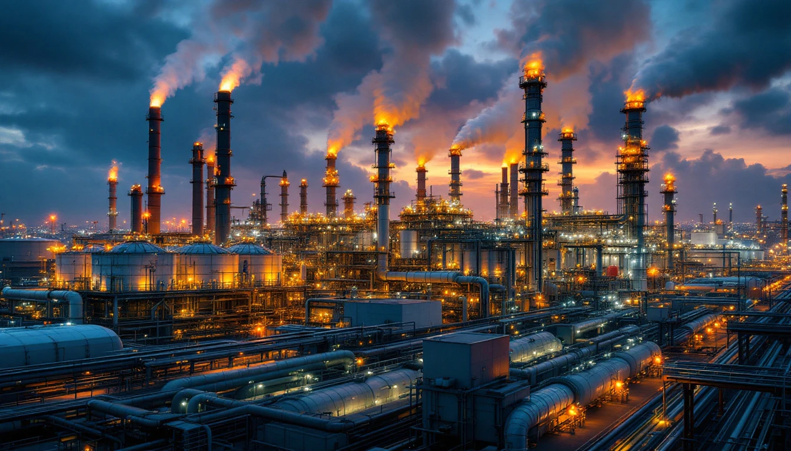
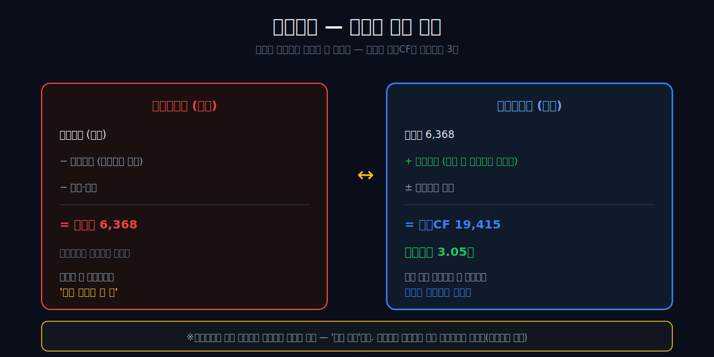
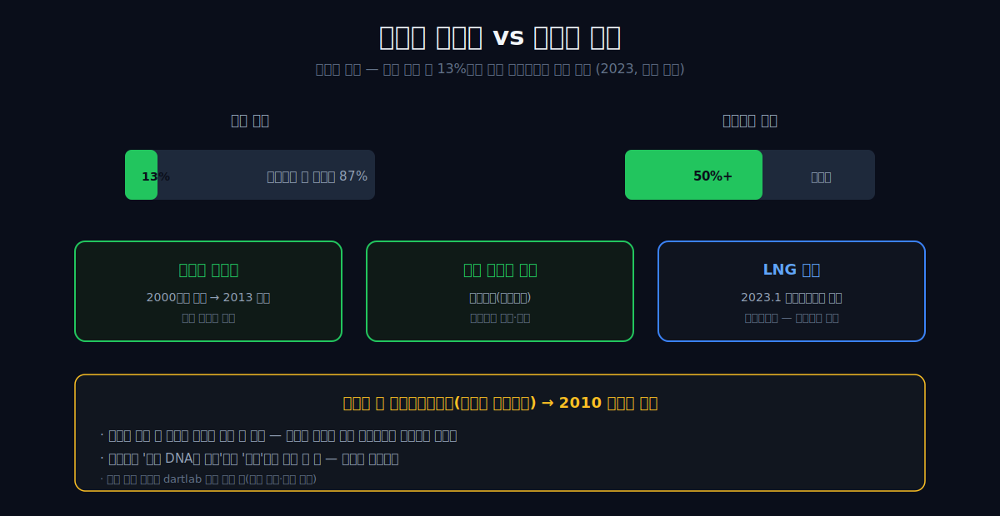
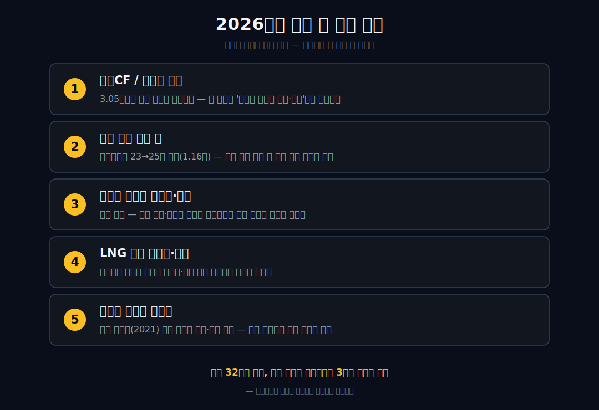

<script>
	import CompanyFinancials from '$lib/components/blog/CompanyFinancials.svelte';
</script>

> **데이터 기준**: 2026-06-19 dartlab 실측 — 포스코인터내셔널(047050) **연결 재무제표(CFS)** 기준. 미얀마 가스전·포스코에너지 합병·부문 이익 비중은 회사 공시·IR·감사보고서 교차확인. ※판관비 일부 연도는 추출이 불안정해 인용하지 않고, 현금흐름 논증은 'OCF/순이익 배율'과 회사 감사보고서의 비현금흐름조정·운전자본조정으로만 전개한다.
>
> **핵심 숫자**: 매출 **32조3,736억** · 영업이익 **1조1,653억** (영업이익률 **3.6%**) · 당기순이익 **6,368억** · 영업현금흐름 **1조9,415억** (순이익의 **3.05배**) · 비현금흐름조정 **1조1,539억** · 운전자본조정 **5,056억** · 자산총계 2023년 **+4.1조** (포스코에너지 합병)
>
> **이 글의 용어**: 종합상사 = 원자재·제품을 사고파는 무역회사(박리다매) · 매출총이익률 = (매출-매출원가)÷매출 · 감가상각 = 이미 산 설비·자산을 장부에서 여러 해에 걸쳐 나눠 비용으로 깎는 것(현금 유출 없음) · 영업현금흐름(OCF) = 영업으로 실제 들어온 현금 · 운전자본 = 재고·매출채권 등에 묶이는 돈 · 업스트림/미드/다운스트림 = 가스 탐사·생산 / 터미널·저장 / 발전·판매.

---

## 프롤로그 — 번 돈의 3배가 통장에 들어온 상사

2025년 포스코인터내셔널은 순이익 **6,368억**을 벌었다고 적었다. 그런데 같은 해 영업으로 들어온 현금은 **1조9,415억** — 번 돈의 *3배*가 통장에 꽂혔다.

박리다매로 사고파는 종합상사라면 이 숫자는 불가능하다. 상사는 매출이 커질수록 재고와 미수금에 현금이 묶여, 보통 영업현금흐름이 순이익을 *밑돈다.* 실제로 같은 업종 [현대코퍼레이션](/blog/011760-hyundai-corp)은 2025년 영업CF가 마이너스 2,947억이었다(발간 글 기준). 그런데 포스코인터는 거꾸로 3배가 남았다.



이건 회계장부가 절반쯤 거짓말을 하고 있다는 뜻이다 — 손익계산서는 무언가를 매년 1조 넘게 깎아내고 있는데, 그 깎인 돈은 실제로 회사 밖으로 나가지 않는다. 그 '깎이지만 안 나가는 돈'의 정체가 이 회사의 진짜 얼굴이다.

관통선은 하나다. **"종합상사의 영업현금흐름이 왜 순이익의 3배인가?"** 답을 먼저 쓴다. 매출 32조라는 간판 뒤에서, 종합상사가 아니라 *가스전과 발전소*가 돌아가고 있기 때문이다.

---

## 1막 — 매출 32조의 함정: 크기는 노이즈다

**왜 매출 크기로 이 회사를 읽으면 안 되나.** 매출 곡선부터 보자.

```python
import dartlab
c = dartlab.Company("047050")
c.select("IS", ["매출액", "영업이익"], freq="Y")
```

| 항목 (1년치, 억원) | 2025 | 2023 | 2022 | 2016 |
|---|---:|---:|---:|---:|
| 매출액 | 323,736 | 331,328 | **379,896** | 164,921 |
| 영업이익 | 11,653 | 11,631 | 9,025 | 3,181 |
| 매출총이익률 | 약 6% | — | — | — |

매출은 시황에 따라 출렁인다 — 16년 16.5조에서 22년 38조로 급증했다가 25년 32.4조로 내려왔다. 매출총이익률이 약 6%에 불과한 트레이딩(박리다매) 물동량이라, 매출의 크기는 *원자재 가격과 거래량의 그림자*일 뿐 실체와 거의 무관하다.

다만 거짓 프레임은 피한다. '매출 정체(38조→32조)'라고 쓰면 안 된다 — 그건 기준연도를 바꿔치기한 착시다(2016년 기준으로 보면 매출은 25년까지 *2배 가까이* 늘었다). 제대로 된 그림은 *매출은 늘었지만 노이즈가 크다*는 것이다. 진짜 신호는 매출이 아니라 이익에 있다.


---

## 2막 — 진짜 신호는 이익률 더블링과 '계단'

**매출이 2배 느는 동안 영업이익은 왜 더 빨리 늘었나, 그리고 왜 그 점프는 '계단'인가.** 매출이 16→25년 약 2배(1.96배) 느는 동안, 영업이익은 3,181억에서 1조1,653억으로 **3.66배** 늘었다. 영업이익률도 1.9%에서 3.6%로 두 배가 됐다. 박리다매라면 이렇게 이익이 매출보다 빨리 늘 수 없다 — 마진 구조 자체가 바뀐 것이다.

그런데 그 변화가 *꾸준한 성장*이 아니다. 여기 결정적인 '어?'가 있다.

```python
c.select("IS", ["영업이익"], freq="Y")
```

영업이익은 2020년 4,745억에서 2023년 1조1,631억으로 **2.45배** 뛴 뒤, 23→25년엔 1조1,631억→1조1,653억으로 *사실상 한 푼도 안 늘었다.* 꾸준한 우상향이 아니라, 2023년에 *계단을 한 칸* 올라가 멈춘 것이다.



이 '계단'의 정체는 무엇인가? 3막에서 그 한 칸이 어디서 왔는지 보자.

---

## 3막 — 계단의 정체: 2023년 자산 4조가 한 해에 붙다

**왜 2023년에 이익이 계단식으로 올라갔나.** 답은 대차대조표에 있다.

```python
c.select("BS", ["자산총계"], freq="Y")
```

| 항목 (억원) | 2025 | 2023 | 2022 |
|---|---:|---:|---:|
| 자산총계 | 187,530 | **166,177** | 125,163 |

자산총계가 2022년 12.5조에서 2023년 16.6조로, 한 해에 **+4.1조**가 통째로 붙었다. 트레이딩 회사의 자산은 이렇게 한 번에 붙지 않는다 — 매출채권·재고는 점진적으로 늘 뿐이다. 한 해에 4조가 붙었다는 건 *고정 설비*가 통째로 들어왔다는 흔적이다.



그 흔적의 이름은 **2023년 1월 포스코에너지(LNG 발전) 흡수합병**이다. 발전소라는 자본집약 설비가 연결로 들어오면서, 그 사업의 이익이 *본업 영업이익*으로 합산됐다 — 그게 2막에서 본 '계단 한 칸'이다. 이익이 성장 모멘텀으로 오른 게 아니라, *자산을 통째로 사 와서(볼트온)* 구조적으로 재평가된 것이다.

(다만 4.1조 중 발전 설비와 기타의 정확한 구성은 합병 회계라 정밀 배분이 어렵고, 영업이익 점프에는 같은 시기 가스전 호황도 겹쳤다 — 합병 단일 귀인은 하지 않는다.) 이 설비가 매년 만드는 것이 바로 프롤로그의 현금 지문을 설명한다.

---

## 4막 — 현금 지문의 해부: 손익과 통장 사이의 세 줄

**왜 손익은 6,368억인데 통장에는 1조9,415억이 들어왔나.** 처음 초안에서는 이 차이를 감가상각으로만 설명했다. 그렇게 쓰면 절반은 맞고 절반은 위험하다. 발전소와 가스전 같은 자본집약 자산이 감가상각과 상각을 만든다는 방향은 맞다. 하지만 2025년 회사 감사보고서의 연결 현금흐름표는 더 정교한 세 줄을 보여준다.

```python
c.select("CF", ["영업활동현금흐름"], freq="Y")
```

| 항목 (2025, 억원) | 값 |
|---|---:|
| 순이익 | 6,368 |
| 비현금흐름조정 | **11,539** |
| 운전자본조정 | **5,056** |
| 영업활동에서 창출된 현금흐름 | **22,963** |
| 영업활동현금흐름 | **19,415** |
| 영업CF / 순이익 | **3.05배** |

이 표는 포스코인터를 읽는 가장 좋은 단서다. 순이익 6,368억 위에 비현금흐름조정 1조1,539억이 붙었다. 여기에 운전자본조정 5,056억이 추가됐다. 그래서 영업활동에서 창출된 현금흐름은 2조2,963억이 됐다. 이후 이자 수취·배당 수취·이자 지급·법인세 납부를 거쳐 최종 영업현금흐름 1조9,415억이 남는다.

그러니 정확한 문장은 이렇다. **포스코인터의 2025년 영업CF 3배는 감가상각 하나가 아니라, 비현금 손익조정과 운전자본 회수가 동시에 만든 현금 지문이다.** 이 둘이 동시에 크게 플러스라는 점이 중요하다. 손익계산서에는 비용과 평가가 들어가지만 현금이 나가지 않는 항목이 있고, 동시에 장사 과정에서 묶였던 돈이 풀려 들어온다. 두 힘이 같은 방향으로 움직인 해에는 순이익보다 현금흐름이 훨씬 커진다.



범위를 한정한다. 이 글은 감가상각비 절대액을 dartlab 표준 연간표에서 직접 뽑아 주장하지 않는다. 2025년 표준 CF row에서 감가상각 세부 행은 비어 있어, 단일 계정으로 못 박으면 검증표가 약해진다. 대신 회사 감사보고서가 직접 제시한 큰 분류를 사용한다. 비현금흐름조정 1조1,539억, 운전자본조정 5,056억, 영업활동에서 창출된 현금흐름 2조2,963억. 이 세 줄이면 충분하다.

여기서 독자가 봐야 할 것은 회계 용어가 아니라 회사의 몸이다. 순이익보다 현금이 훨씬 많이 들어오는 회사는 둘 중 하나다. 과거에 이미 돈을 써서 깔아둔 자산이 지금 비용으로만 깎이고 있거나, 장사 과정에서 묶였던 현금이 풀려 나오고 있거나. 포스코인터는 2025년에 두 가지가 함께 나타난다. 이건 단순 상사가 아니라 자산과 운전자본이 큰 회사라는 뜻이다.

## 4.5막 — 그래서 2026년 1분기 마이너스 현금흐름은 왜 중요하지 않은가

자동 재무표를 보면 2026년 1분기 영업현금흐름은 **-194억**이다. 여기서 독자가 바로 멈출 수 있다. "방금 전에는 현금 지문이 강하다고 했는데, 최신 분기는 마이너스 아닌가?" 좋은 질문이다. 이 질문을 건너뛰면 글이 약해진다.

분기 현금흐름은 연간 현금흐름보다 훨씬 거칠다. 상사는 분기 말 매출채권과 재고, 선수금, 매입채무가 조금만 밀려도 영업CF가 크게 흔들린다. 특히 포스코인터처럼 매출이 32조 규모인 회사는 분기 한 번의 운전자본 이동이 수천억 단위로 흔들릴 수 있다. 그래서 2026Q1 -194억을 두고 "현금 지문이 사라졌다"고 말하면 너무 빠르다. 반대로 무시해도 안 된다.

실측 범위를 이렇게 좁힌다. 2025년 연간 영업CF 1조9,415억은 강한 실측이다. 2026Q1 -194억은 그 현금 지문이 분기 운전자본에 민감하다는 경고다. 이 둘은 모순이 아니다. 오히려 같은 사실의 양면이다. 자산과 운전자본이 큰 회사는 연간으로 보면 현금이 잘 들어오지만, 분기별로는 운전자본의 방향에 따라 갑자기 꺾여 보일 수 있다.

그래서 2026년에 봐야 할 첫 번째 지표는 단순한 영업이익이 아니다. **상반기 누적 영업CF가 순이익을 다시 앞서는가**다. 1분기 마이너스가 일시적 운전자본 이동이면 2분기 이후 풀린다. 반대로 매출채권·재고가 계속 늘고 영업CF가 순이익 아래로 내려가면, 이 글의 현금 지문 논리는 약해진다. 좋은 글은 자기 결론이 깨지는 지점을 숫자로 말해야 한다. 포스코인터의 깨지는 지점은 바로 여기다.

---

## 5막 — 자산의 이름: 미얀마 가스전과 호주 세넥스

**그 감가상각을 만드는 실물 자산은 무엇인가.** 여기서 처음으로 회사의 역사를 실물에 붙인다.

포스코인터내셔널의 뿌리는 옛 **대우인터내셔널**, 김우중 대우그룹의 종합상사다. 2010년 포스코그룹에 인수된 뒤, 이 회사의 운명을 바꾼 건 무역이 아니라 *바다 밑 가스*였다 — 2000년대에 탐사한 **미얀마 가스전**이 2013년 상업 생산을 시작하며 현금 창출의 핵심이 됐다. 여기에 호주 세넥스(Senex) 가스 같은 자원개발이 더해졌고, 2023년 포스코에너지 합병으로 LNG 발전(다운스트림)까지 이어지는 'LNG 전 밸류체인'이 완성됐다.



부문별 이익 비중은 dartlab 검증 재무 밖이라 외부로 인용한다 — 회사 발표상 2023년 에너지 부문은 매출 약 5.3조, 영업이익 약 6,400억으로, *매출 비중은 13% 안팎인데 전사 영업이익의 절반 이상*을 냈다(외부 인용). 매출의 그림자(트레이딩)와 이익의 실체(에너지)가 이렇게 어긋난다. 다만 가스전을 '상사 DNA의 필연'이나 '행운'으로 단정하진 않는다 — *오래전 투자가 지금 감가상각과 현금으로 흐른다*는 회계적 사실로만 다룬다.

---

## 5.5막 — 미얀마 가스전은 매출보다 긴 시간표다

미얀마 가스전은 "자원개발도 한다"는 설명으로 끝낼 수 없는 자산이다. 회사 공식 자료는 이 프로젝트가 2013년 6월 첫 가스 생산에 이르기까지 약 13년이 걸렸다고 설명한다. 생산된 가스는 미얀마에서 중국 국경까지 793km 육상 가스관을 통해 공급된다. 이 문장은 포스코인터의 손익계산서를 읽는 데 중요하다. 매출 32조는 매년 사고파는 물동량처럼 보이지만, 그 안쪽에는 13년 동안 탐사·개발·투자를 거친 자산이 깔려 있다.

종합상사와 가스전의 시간감각은 다르다. 상사는 오늘 계약하고, 물건을 싣고, 환율과 원자재 가격에 맞춰 거래한다. 가스전은 탐사권을 따고, 시추하고, 매장량을 확인하고, 생산설비와 파이프라인을 깔고, 판매계약을 맺은 뒤 오랫동안 뽑아낸다. 그래서 손익계산서의 한 해 숫자만 보면 이 회사가 왜 현금을 이렇게 만드는지 놓친다. 현금은 올해 갑자기 생긴 게 아니라, 과거의 긴 투자 결정이 올해 장부로 내려온 것이다.

이 관점에서 보면 2023년 포스코에너지 합병도 같은 계열의 사건이다. 미얀마 가스전은 업스트림, 세넥스는 호주 가스 생산, 광양·인천 LNG와 발전은 미드·다운스트림 쪽에 가깝다. 회사는 스스로 LNG 수입터미널에서 발전까지 이어지는 밸류체인 확보를 말한다. 그 표현을 그대로 믿고 성장주 서사를 만들 필요는 없다. 대신 장부에 찍힌 변화를 보면 된다. 2023년에 비유동자산이 확 커졌고, 이후 영업이익은 1조1천억대 계단 위에서 유지됐다.

다만 가스전은 무한한 자산이 아니다. 원유·가스 개발의 장점은 생산이 시작되면 장기간 현금을 만든다는 점이고, 약점은 매장량과 생산량이 결국 줄어든다는 점이다. 그래서 미얀마 가스전은 현금의 원천이면서 동시에 이 글이 틀릴 수 있는 가장 큰 조건이다. 생산량, 판매가격, 정치 리스크, 추가 탐사 성공 여부가 현금 지문을 좌우한다. 좋은 상사는 계약을 바꾸면 살아남지만, 좋은 가스전은 매장량이 줄면 시간이 줄어든다.

## 5.6막 — 세넥스와 LNG 발전: 포스코인터는 왜 밸류체인을 말하나

호주 세넥스는 이 글에서 작은 부록이 아니다. 회사 공식 가스전 사업 페이지는 2022년 포스코인터내셔널이 호주 헨콕에너지와 공동으로 세넥스에너지를 인수했고, 지분 50.1%와 경영권을 확보했다고 설명한다. 세넥스는 호주 동부 퀸즐랜드의 육상 가스전과 탐사·평가 광구를 보유한다. 이 숫자는 매출 32조보다 작아 보이지만, 의미는 크다. 미얀마 하나에만 의존하던 자원개발 축을 호주로 넓히려는 시도이기 때문이다.

여기서도 과장하면 안 된다. 세넥스가 당장 포스코인터의 영업현금흐름 1조9,415억을 만들었다고 단정하지 않는다. 글의 주장은 더 좁다. 포스코인터가 단순 트레이딩 회사라면 세넥스 인수, LNG 터미널, 발전소 합병은 설명력이 약하다. 하지만 회사가 가스 조달·생산·터미널·발전으로 이어지는 체인을 만들려 한다면, 이 자산들은 같은 지도 위에 놓인다. 이 지도는 재무제표의 비유동자산 증가와도 맞물린다.

LNG 발전 쪽은 더 직접적이다. 회사 공식 발전사업 페이지는 포스코에너지가 국내 최초 민간발전사로 인천 LNG 복합발전소를 운영해왔고, 포스코인터내셔널은 2023년 1월 합병으로 국내외 발전사업을 확대한다고 설명한다. 이 말의 회계적 의미는 단순하다. 발전소는 한 번 깔면 매년 감가상각과 정비비, 연료비, 전력 판매 수익이 반복되는 자산이다. 트레이딩 물동량과 달리, 장부에 무거운 자산이 붙는다.

이 지점에서 포스코인터의 정체성이 조금 더 또렷해진다. 포스코인터는 완전히 유틸리티 회사도 아니고, 완전히 상사도 아니다. 앞에는 종합상사의 매출이 있고, 뒤에는 가스전과 발전소의 현금 지문이 있다. 투자자가 이 회사를 볼 때 헷갈리는 이유도 여기에 있다. 매출만 보면 박리다매, 영업CF를 보면 인프라, 합병 이력을 보면 에너지 밸류체인, 그룹 내 위치를 보면 철강·LNG·배터리 소재의 조달 플랫폼이다. 이 네 얼굴을 한 문장으로 줄이면 거짓이 된다. 그래서 이 글은 매출보다 현금흐름표를 먼저 잡는다.

---

## 6막 — 거울편: 같은 간판, 반대 현금

**같은 '상사 간판 / 자원 실체' 회사인데, 왜 포스코인터는 현금이 넘치고 현대코퍼레이션은 마르나.** 이미 발간된 [현대코퍼레이션](/blog/011760-hyundai-corp) 편과 나란히 놓으면 칼처럼 갈린다.

| 2025년 | 포스코인터내셔널 | 현대코퍼레이션 |
|---|---:|---:|
| 영업현금흐름 | **+19,415억** | **-2,947억** |
| 순이익 | 6,368억 | 868억 |
| 영업CF / 순이익 | +3.05배 | -3.40배 |
| 영업이익률 | 3.6% | 1.85% |


같은 종합상사 간판인데, 한쪽은 현금이 *넘치고*(순이익의 3배) 다른 쪽은 *마른다*(마이너스). 차이는 *자산을 들고 있느냐*다. 포스코인터는 발전소·가스전이라는 고정 설비가 연결돼 감가상각이 현금으로 환류하고, 현대코퍼레이션은 매출만 키워 운전자본이 현금을 삼킨다. (단년 비교이고 단일 연도 OCF는 변동이 크다 — 두 회사의 우열을 가리는 게 아니라, '상사라고 다 같은 게 아니다'를 보여주는 거울이다.)

이 거울이 남기는 렌즈는 분명하다 — 상사를 볼 땐 매출이 아니라 *현금 지문*을 봐야 한다. 같은 '간판과 진짜 돈줄이 다른' 계열이라도, 안 보이는 발효 엔진을 쥔 [CJ제일제당](/blog/097950-cj-cheiljedang), 물류 장부 위에 자원·지주를 얹은 [현대글로비스](/blog/086280-hyundai-glovis), 포스코그룹의 배터리 소재를 만드는 [포스코퓨처엠](/blog/003670-posco-future-m), 규제 에너지의 [한국전력](/blog/015760-kepco)과 견주면 — 포스코인터의 고유함은 *상사 매출 껍데기 속에서 가스전·발전이 감가상각으로 현금을 토해낸다*는 데 있다.

---

## 과거~현재 패턴 — 포스코인터는 한 번씩 계단을 오른다

포스코인터의 과거를 일직선 성장으로 그리면 틀린다. 이 회사는 매출이 매년 곱게 커지는 기업이 아니다. 오히려 한동안 상사 매출이 출렁이다가, 특정 자산이 붙는 순간 계단을 오른다. 2010년 포스코그룹 편입, 2013년 미얀마 가스전 생산 개시, 2017년 포스코P&S 합병, 2022년 세넥스 인수, 2023년 포스코에너지 합병이 그런 계단이다.

이 패턴은 손익계산서에서도 보인다. 2016년 매출 16.5조, 영업이익 3,181억이던 회사가 2022년 매출 38조, 영업이익 9,025억까지 커졌다. 그러나 2022년 매출 38조는 원자재 가격과 트레이딩 물량의 영향이 크다. 더 중요한 계단은 2023년이다. 매출은 37.99조에서 33.13조로 줄었는데 영업이익은 9,025억에서 1조1,631억으로 늘었다. 매출이 줄었는데 이익이 늘었다. 이 장면이 포스코인터의 정체를 가장 잘 드러낸다.

매출이 줄고 이익이 늘어난다는 건, 팔린 물건의 양보다 남는 구조가 바뀌었다는 뜻이다. 포스코에너지 합병으로 발전사업이 들어오고, 가스전·LNG·발전의 에너지 축이 더 굵어지면서 매출의 질이 바뀌었다. 이후 2024년과 2025년 영업이익은 1조1천억대에서 크게 벗어나지 않는다. 이건 폭발 성장이라기보다 합병 계단의 안정화다.

그래서 포스코인터를 볼 때 질문은 "내년 매출이 몇 퍼센트 늘까"가 아니다. 질문은 "다음 계단은 무엇인가"다. 세넥스 증산인가, LNG 터미널과 발전 확장인가, 포스코그룹 내부 LNG 수요와 철강 원료 조달의 결합인가, 배터리 소재·구동모터코아 같은 신사업인가. 다음 계단이 없으면 이 회사는 1조1천억대 영업이익을 지키는 가치주에 가깝다. 다음 계단이 있으면 현금 지문은 다시 커질 수 있다.

## 산업 패턴 — 종합상사는 매출로 경쟁하고, 자원·발전은 시간으로 경쟁한다

종합상사의 전통적 경쟁력은 네트워크다. 어디서 싸게 사고, 어디에 비싸게 팔고, 물류와 신용을 어떻게 붙이는가. 이 경쟁력은 매출을 크게 만든다. 하지만 마진은 얇다. 원자재 가격이 뛰면 매출이 커지고, 가격이 빠지면 매출이 작아진다. 그래서 종합상사 매출은 회사의 본질이라기보다 거래 가격의 그림자일 때가 많다.

자원·발전은 다르다. 탐사권, 매장량, 장기 판매계약, 발전소, 터미널, 규제, 연료비, 전력 판매 구조가 돈을 만든다. 매출은 작아도 이익률과 현금흐름이 두꺼울 수 있다. 하지만 한 번 들어가면 빠져나오기 어렵다. 가스전은 매장량 리스크, 발전소는 규제와 연료비 리스크, LNG 터미널은 수요와 이용률 리스크를 안는다. 장점은 시간이 현금으로 바뀐다는 것이고, 단점은 시간이 리스크도 키운다는 것이다.

포스코인터는 이 두 산업 패턴이 한 회사 안에 들어와 있다. 매출 32조는 상사 패턴이고, 영업CF 1조9,415억은 자원·발전 패턴이다. 그래서 포스코인터의 재무제표를 볼 때 일반 제조업의 매출 성장률이나 단순 OPM만으로 판단하면 어긋난다. 매출총이익률 6%를 보고 "박리다매라 별것 없다"고 보면 가스전과 발전소를 놓친다. 영업CF만 보고 "완전한 인프라 회사"라고 보면 트레이딩 운전자본 변동을 놓친다.

산업적으로 더 흥미로운 것은 포스코그룹 안에서의 위치다. 포스코인터는 철강 원료, LNG, 발전, 식량, 친환경 소재를 한꺼번에 만진다. 이건 독립 상사의 네트워크라기보다 그룹 공급망의 외부 팔이다. 포스코홀딩스와 포스코의 철강 수요, 포스코퓨처엠의 소재 축, 그룹 LNG 수요가 커질수록 포스코인터가 단순 중개상이 아니라 조달·에너지 플랫폼처럼 움직일 여지가 생긴다. 그러나 이 또한 아직 숫자로 다 증명된 서사는 아니다. 현재 숫자로 확인되는 것은 2025년 영업CF와 2023년 합병 계단이다.

## 낮은 마진과 강한 현금은 모순이 아니다

여기서 마지막으로 풀어야 할 오해가 있다. 포스코인터의 매출총이익률은 약 6%다. 숫자만 보면 아주 얇다. 그런데 같은 글에서 영업CF가 순이익의 3배라고 말한다. 낮은 마진과 강한 현금이 동시에 나올 수 있나. 가능하다. 둘은 서로 다른 질문에 답하기 때문이다.

매출총이익률은 "매출 100원에서 원가를 빼고 얼마가 남는가"를 묻는다. 종합상사 트레이딩 매출은 이 비율이 낮을 수밖에 없다. 원자재와 철강재, 에너지, 식량 같은 물건은 매출 단가 자체가 크고, 중개·조달 마진은 얇다. 그래서 포스코인터의 32조 매출은 크게 보이지만, 매출총이익률은 낮다. 이것은 상사 간판의 숫자다.

영업현금흐름은 다른 질문이다. "올해 장사가 실제로 현금을 얼마나 만들었는가"를 묻는다. 여기에는 순이익, 비현금 조정, 운전자본 조정, 이자와 세금 지급이 모두 섞인다. 2025년에는 비현금흐름조정과 운전자본조정이 모두 플러스 방향으로 붙었다. 그래서 낮은 매출총이익률에도 불구하고 영업CF가 크게 나왔다. 이것은 에너지·자산·운전자본의 숫자다.

이 둘을 한 줄로 섞으면 오해가 생긴다. "마진이 낮으니 별로다"라고 쓰면 현금흐름표를 놓친다. "현금이 크니 마진도 좋다"라고 쓰면 손익계산서를 놓친다. 포스코인터는 두 표가 서로 다른 얼굴을 보여주는 회사다. 손익계산서는 상사 매출의 얇은 마진을 보여주고, 현금흐름표는 자산과 운전자본이 만든 두꺼운 현금을 보여준다.

그래서 이 글의 핵심 문장은 더 정확히 이렇게 닫힌다. 포스코인터는 마진이 높은 회사가 아니다. **현금 전환이 특이한 회사다.** 이 차이가 중요하다. 마진 높은 회사는 가격 결정력으로 버틴다. 현금 전환이 특이한 회사는 자산 구조와 운전자본 방향이 맞을 때 강해진다. 포스코인터를 다음 공시에서 볼 때는 둘을 분리해야 한다. 매출총이익률은 상사 사업의 얇음을, 영업CF/순이익은 에너지 자산의 두께를 말한다.

## 비교해야 할 대상 — 현대코퍼레이션보다 한국전력에 가까운 순간

포스코인터를 현대코퍼레이션과 비교하면 상사 간판의 차이가 보인다. 현대코퍼레이션은 매출을 크게 굴리지만 2025년 영업CF가 마이너스였다. 포스코인터는 같은 해 영업CF가 순이익의 3배였다. 이 비교는 "누가 더 좋은 회사인가"보다 "같은 상사라는 라벨이 얼마나 거친가"를 보여준다.

그런데 현금흐름만 놓고 보면 포스코인터는 순간적으로 [한국전력](/blog/015760-kepco) 쪽에 더 가까워진다. 발전소, 연료, 규제, 장기 설비, 감가상각, 운전자본. 물론 한국전력은 규제 요금과 공기업 부채의 문제이고, 포스코인터는 민간 상사·에너지 복합 회사다. 둘을 같은 회사로 묶을 수는 없다. 하지만 손익과 현금이 갈라지는 이유를 볼 때, 제조·상사보다 에너지 인프라의 언어가 더 잘 먹히는 구간이 있다.

이 비교가 중요한 이유는 투자자의 실수를 줄이기 때문이다. 상사로만 보면 포스코인터의 영업이익률 3.6%는 낮아 보인다. 유틸리티로만 보면 매출 32조와 운전자본 변동이 너무 거칠다. 둘 사이에 있는 회사라면, 평가 기준도 둘 사이에 있어야 한다. 매출 성장률보다 영업CF/순이익, 순차입금과 투자CF, 가스전 생산, 발전 가동률, 비유동자산 회전이 더 중요해진다.

## 이 이야기가 틀리는 조건

첫째, **영업CF/순이익 배율이 내려가는 경우**다. 2025년 3.05배는 강하다. 그러나 2026년 상반기 누적 또는 연간 기준에서 영업CF가 순이익을 밑돌면, 이 글의 핵심인 "현금 지문"은 약해진다. 특히 2026Q1 영업CF가 -194억이라는 점 때문에, 이후 분기 회복 여부가 중요하다.

둘째, **비현금흐름조정과 운전자본조정의 방향이 바뀌는 경우**다. 2025년 감사보고서 기준 비현금흐름조정은 1조1,539억, 운전자본조정은 +5,056억이었다. 운전자본이 다시 큰 폭으로 마이너스가 되면, 순이익과 영업CF의 괴리는 줄거나 반대로 뒤집힌다. 포스코인터처럼 트레이딩 매출이 큰 회사에서는 이 항목이 생각보다 빨리 흔들린다.

셋째, **미얀마 가스전 생산과 정치 리스크가 현금으로 번지는 경우**다. 미얀마 가스전은 회사가 직접 공식 페이지로 사업 현황을 공개할 만큼 민감한 자산이다. 2021년 이후 정치 리스크는 단순 뉴스가 아니라 현금 원천에 붙은 변수다. 생산 차질, 판매 조건 변화, 제재 환경 변화가 생기면 에너지 현금 지문은 약해진다.

넷째, **포스코에너지 합병 계단 이후 다음 계단이 없는 경우**다. 2023년 영업이익이 한 칸 올라간 뒤 2025년까지 거의 평평했다. 안정적이라고 볼 수도 있지만, 성장주 서사는 약하다. 시장이 다음 성장 계단을 기대하는데 실제로는 1조1천억대 이익이 유지되는 정도라면, 이 회사는 성장주가 아니라 현금흐름 가치주로 다시 가격이 매겨질 수 있다.

다섯째, **투자CF가 현금 지문을 계속 먹어버리는 경우**다. 2025년 영업CF 1조9,415억은 강하지만 투자CF도 -1조3,297억이다. 자원·발전 회사는 현금을 만들면서 동시에 설비와 지분투자에 돈을 쓴다. 영업CF가 커도 투자CF가 계속 커지면 주주에게 남는 현금은 줄어든다. 그래서 FCF를 별도로 봐야 한다.

## 현금이 많다는 말의 함정 — 1.94조가 전부 남는 것은 아니다

영업현금흐름 1조9,415억은 강하다. 하지만 이 숫자를 그대로 "남는 돈"으로 읽으면 안 된다. 자원·발전 회사는 현금을 만드는 동시에 현금을 계속 다시 넣어야 한다. 2025년 포스코인터의 투자활동현금흐름은 **-1조3,297억**이다. 단순 계산으로 영업CF에서 투자CF를 빼면 약 **6,118억**이 남는다.

```python
operating_cf = 19415
investing_cf = -13297
free_cash_after_investing = operating_cf + investing_cf
free_cash_after_investing
```

| 2025년 현금흐름 (억원) | 값 |
|---|---:|
| 영업활동현금흐름 | 19,415 |
| 투자활동현금흐름 | -13,297 |
| 영업CF + 투자CF | **6,118** |

이 6,118억은 포스코인터를 보는 데 중요한 완충지대다. 순이익 6,368억과 비슷한 규모다. 다시 말해 2025년 포스코인터는 손익계산서상 순이익 정도의 현금을 투자 이후에도 남겼다. 이건 좋은 신호다. 하지만 영업CF 1.94조만 보고 "현금이 넘친다"고 쓰는 것보다는 훨씬 조심스럽다.

왜냐하면 투자CF의 성격이 중요하기 때문이다. 투자CF가 단순 금융상품 이동이면 해석이 가볍고, 유형자산·무형자산 취득이나 연결범위 변동이면 다음 수년의 사업 구조와 연결된다. 포스코인터 2025년 감사보고서의 연결 현금흐름표에는 유형자산 취득, 무형자산 취득, 연결범위 변동으로 인한 현금감소가 모두 보인다. 이건 회사가 단순히 현금을 쌓아두는 게 아니라 자산을 다시 사거나 깔고 있다는 뜻이다.

따라서 이 회사의 현금흐름은 두 줄로 읽어야 한다. 첫째, 영업이 현금을 만들 수 있는가. 2025년 답은 예다. 둘째, 그 현금이 투자 뒤에도 남는가. 2025년 답도 예지만, 폭은 영업CF만큼 크지 않다. 이 두 번째 줄을 빼면 포스코인터는 실제보다 더 쉬운 회사처럼 보인다. 자원·발전 회사는 현금을 만들지만, 그 현금을 유지하기 위해 다시 자본을 먹는다.

이 지점에서 포스코인터는 완전한 자산경량 상사와 갈라진다. 자산경량 상사는 큰 설비 투자 없이 운전자본만 잘 돌리면 된다. 포스코인터는 가스전, LNG, 발전, 지분투자, 신사업이 붙는다. 현금흐름표의 강함은 분명하지만, 투자CF의 음수도 같이 봐야 한다. 그래서 이 글의 결론은 "현금이 많으니 끝"이 아니라 "현금이 많지만, 그 현금이 다시 어디로 들어가는지까지 봐야 한다"다.

## 배당보다 먼저 봐야 할 것 — 현금의 우선순위

영업CF가 좋으면 투자자는 자연스럽게 배당과 주주환원을 묻는다. 하지만 포스코인터에서는 순서를 바꿔야 한다. 첫 질문은 "얼마나 나눠줄까"가 아니라 "다음 계단을 위해 얼마나 다시 넣어야 하나"다. 2025년 투자CF -1조3,297억은 이 회사가 현금을 계속 사업 안으로 되돌려 넣고 있음을 보여준다.

이런 회사에서 배당 확대만 보면 장부의 절반을 놓친다. 가스전은 보수와 추가개발이 필요하고, 세넥스는 증산과 탐사·평가 광구가 붙어 있으며, LNG 터미널과 발전은 장기 설비다. 회사가 투자CF를 줄이면 단기 FCF는 좋아질 수 있다. 그러나 다음 계단이 약해질 수도 있다. 반대로 투자CF가 커지면 단기 주주환원 여력은 줄지만, 다음 현금 원천을 키울 수도 있다. 어느 쪽이 좋은지는 투자 대상의 질로 갈린다.

그래서 2026년부터는 투자CF의 항목을 더 구체적으로 봐야 한다. 유형자산 취득인지, 무형자산 취득인지, 지분투자인지, 연결범위 변동인지. 같은 마이너스 투자CF라도 의미가 다르다. 유지보수성 CAPEX라면 현금 지문을 지키는 비용이고, 확장 투자라면 다음 계단의 씨앗이다. 반대로 낮은 수익률의 지분투자라면 영업CF의 가치를 갉아먹는다.

이 문단이 중요한 이유는 포스코인터를 단순 고배당 가치주로 소비하지 않기 위해서다. 포스코인터는 현금을 만든다. 하지만 그 현금은 가스전과 발전, 그룹 공급망, 해외 자원개발이라는 긴 사이클 안에서 다시 움직인다. 현금흐름표를 끝까지 읽어야 회사가 보인다. 영업CF만 보고 박수치면 절반이고, 투자CF까지 보고도 남는 돈이 있는지 확인해야 판단이 된다.

## 2026년에 봐야 할 다섯 가지

1. **영업CF / 순이익 배율** — 3.05배라는 현금 지문이 유지되는지. 이 배율이 이 회사가 '상사가 아니라 자원·발전'임을 계속 증명한다.
2. **계단 후의 다음 칸** — 영업이익이 23→25년 평탄(1.16조)했다. 합병 효과가 소진된 뒤 다음 성장 동력이 있는지.
3. **미얀마 가스전 매장량·생산** — 유한 자원이다. 생산 감소·매장량 고갈은 감가상각과 현금 지문을 동시에 줄인다.
4. **LNG 발전 가동률·규제** — 합병으로 들어온 발전이 연료비·전력 규제 사이클에 어떻게 묶이는지.
5. **미얀마 지정학 리스크** — 군부 쿠데타(2021) 이후 가스전 운영·송출 환경. 외부 변수지만 현금의 원천에 직결된다.



이 다섯 가지를 순서대로 봐야 한다. 첫째와 둘째는 재무제표 안에서 바로 확인된다. 셋째와 넷째는 회사 공시와 IR, 사업보고서의 사업 내용에서 확인된다. 다섯째는 재무제표 밖의 리스크지만, 현금의 원천과 붙어 있으므로 무시할 수 없다. 포스코인터는 뉴스 제목보다 표의 순서가 중요하다. 매출, 영업이익, 순이익, 영업CF, 투자CF, 비유동자산, 가스전 생산. 이 순서로 보면 회사가 갑자기 선명해진다.

마지막 판단은 이렇다. 포스코인터내셔널은 "매출 32조 종합상사"가 아니다. 그 말은 너무 크고 너무 비어 있다. 이 회사는 종합상사 매출을 앞에 세우고, 그 뒤에서 가스전과 LNG 발전이 현금을 만드는 복합체다. 그래서 이 회사를 읽는 첫 문장은 매출이 아니라 현금흐름표여야 한다. 순이익 6,368억, 영업CF 1조9,415억. 번 돈의 3배가 통장에 들어온 순간, 포스코인터는 상사라는 간판을 벗고 자기 진짜 얼굴을 보여준다.

다음 공시를 열 때의 순서도 이 결론과 같아야 한다. 첫째, 손익계산서에서 매출이 아니라 영업이익이 1조1천억대 계단을 지키는지 본다. 둘째, 현금흐름표에서 영업CF가 순이익을 다시 앞서는지 본다. 셋째, 영업CF가 좋다면 투자CF를 빼서 실제 남는 현금을 본다. 넷째, 사업보고서의 에너지 사업 설명에서 미얀마 가스전·세넥스·LNG 발전의 변화가 있는지 본다. 다섯째, 이 모든 변화가 매출총이익률 6% 안쪽에 숨어 있는지, 아니면 별도 성장 계단으로 드러나는지 본다. 이 순서를 지키면 포스코인터는 더 이상 "매출 큰 상사"로 보이지 않는다. 현금흐름표가 먼저 말하고, 손익계산서가 뒤따라 확인하는 회사가 된다.

이 글이 굳이 길어져야 하는 이유도 여기에 있다. 포스코인터를 짧게 요약하면 늘 틀린다. "상사"라고 쓰면 에너지 현금흐름이 사라지고, "에너지 회사"라고 쓰면 32조 트레이딩 매출과 운전자본 변동이 사라진다. "현금흐름이 좋다"라고 쓰면 투자CF가 빠지고, "투자가 많다"라고 쓰면 비현금 조정과 운전자본 회수가 만든 힘이 빠진다. 이 회사는 한 표로 결론을 내리는 종목이 아니라, 손익계산서·재무상태표·현금흐름표를 순서대로 넘겨야 비로소 같은 모양이 맞춰지는 종목이다.

따라서 포스코인터의 다음 한 해는 "매출이 늘었나"보다 "현금 지문이 유지됐나"로 판정해야 한다. 매출이 줄어도 영업CF와 투자 후 현금이 버티면 이 글의 논리는 살아 있다. 매출이 늘어도 영업CF가 순이익 아래로 내려가고 투자CF가 더 커지면 논리는 깨진다. 이 단순한 순서가 포스코인터를 상사 뉴스가 아니라 재무제표로 읽는 방법이다.

그리고 이 순서는 다른 종합상사에도 그대로 옮겨갈 수 있다. 매출 규모를 먼저 보지 않는다. 매출총이익률을 보고, 영업이익이 어느 사업에서 나왔는지 보고, 마지막으로 영업CF와 투자CF를 나란히 놓는다. 그때 현금이 남으면 자산의 질을 묻고, 현금이 마르면 운전자본의 압박을 묻는다. 포스코인터는 이 훈련에 좋은 사례다. 매출은 시끄럽고, 현금흐름표는 조용하지만 더 정확하다.

그래서 이 글의 마지막 단어는 성장률이 아니라 순서다. 포스코인터는 매출표에서 시작하면 흐리고, 현금흐름표에서 시작하면 선명하다. 재무제표는 같은 회사라도 어디부터 읽느냐에 따라 전혀 다른 얼굴을 보여준다.

그 얼굴을 놓치지 않는 것이 이 글의 목적이다. 큰 매출보다 이상한 현금, 낮은 마진보다 남는 현금, 합병 발표보다 자산과 현금의 이동을 먼저 본다.

이 순서가 포스코인터를 읽는 가장 짧은 길이다.

그래서 첫 표는 늘 현금흐름표다.

거기서 회사의 진짜 무게가 시작된다.

---

## 검증표

본문의 모든 인용 수치를 dartlab 호출과 결과로 검증한다. 외부 출처는 분리 표기. 📅 dartlab 실측 2026-06-19 · 포스코인터내셔널(047050) 연결(CFS) 기준.

| 본문 수치 | 출처 / dartlab 호출 | 결과 |
|---|---|---|
| 영업현금흐름 2025 19,415억 = 순이익 6,368억의 3.05배 | `c.select("CF",["영업활동현금흐름"])` + `c.select("IS",["당기순이익"])` | ✓ 실측 |
| 2025 연결 현금흐름표: 당기순이익 6,368억 + 비현금흐름조정 11,539억 + 운전자본조정 5,056억 = 영업활동에서 창출된 현금흐름 22,963억 | [포스코인터내셔널 2025 감사보고서](https://www.poscointl.com/upload/file/202602/202602Hvv4u8BTMQ.pdf) 연결 현금흐름표 | ✓ 회사 공식 감사보고서 |
| 2026Q1 영업활동현금흐름 -194억 | AUTO 재무 블록 `c.select("CF",["operating_cashflow"],freq="Y")` 최신 분기 | ✓ 실측 |
| 2025 투자활동현금흐름 -13,297억 | AUTO 재무 블록 `c.select("CF",["investing_cashflow"],freq="Y")` | ✓ 실측 |
| 2025 영업CF + 투자CF = 19,415억 - 13,297억 = 6,118억 | `operating_cashflow + investing_cashflow` 단순 계산 | ✓ 계산 |
| 매출 16년 164,921억 → 22년 379,896억 → 25년 323,736억 | `c.select("IS",["매출액"],freq="Y")` | ✓ 실측 |
| 매출총이익률 약 6%(트레이딩 박리) | `c.select("IS",["매출액","매출총이익"],freq="Y")` | ✓ 실측 |
| 영업이익 16년 3,181억(OPM 1.9%) → 25년 11,653억(OPM 3.6%), 16→25 3.66배 | `c.select("IS",["영업이익","매출액"],freq="Y")` | ✓ 실측 |
| 영업이익 20년 4,745억 → 23년 11,631억 → 25년 11,653억(계단 후 평탄) | `c.select("IS",["영업이익"],freq="Y")` | ✓ 실측 |
| 자산총계 22년 125,163억 → 23년 166,177억 (+4.1조) | `c.select("BS",["자산총계"],freq="Y")` | ✓ 실측 |
| 비유동자산 22년 51,969억 → 23년 85,405억 → 25년 111,970억 | `c.select("BS",["noncurrent_assets"],freq="Y")` | ✓ 실측 |
| 부채비율 약 140%(2025) | `c.select("BS",["부채총계","자본총계"],freq="Y")` | ✓ 실측 |
| 현대코퍼레이션 2025 영업CF -2,947억·순이익 868억·OPM 1.85% | 발간 [현대코퍼레이션](/blog/011760-hyundai-corp) 편 | 발간 글 인용 |
| 옛 대우인터내셔널 → 2010 포스코그룹 편입 · 2013.6 미얀마 가스전 생산 개시 · 2023.1 포스코에너지 합병 | [포스코인터내셔널 연혁](https://www.poscointl.com/history) | 회사 공식 |
| 미얀마 가스전: 2013년 6월 첫 가스생산, 약 13년 노력, 793km 육상 가스관, 일평균 5억 입방피트 공급 | [포스코인터내셔널 미얀마 가스전 사업](https://www.poscointl.com/controversies02) | 회사 공식 |
| 세넥스: 2022년 호주 헨콕에너지와 공동 인수, 지분 50.1% 및 경영권 확보 | [포스코인터내셔널 가스전사업](https://www.poscointl.com/gasBusiness) | 회사 공식 |
| 2023.1 포스코에너지 합병, LNG수입터미널에서 발전까지 LNG사업 밸류체인 확보 | [포스코인터내셔널 LNG 발전사업](https://www.poscointl.com/lngPower) · [에너지 합병 PT 스크립트](https://www.poscointl.com/upload/upimg/board_table/6150/%ED%8F%AC%EC%8A%A4%EC%BD%94%EC%9D%B8%ED%84%B0%EB%82%B4%EC%85%94%EB%84%90_%EC%97%90%EB%84%88%EC%A7%80%20%ED%95%A9%EB%B3%91%20%ED%94%84%EB%A6%AC%EC%A0%A0%ED%85%8C%EC%9D%B4%EC%85%98%20%EC%8A%A4%ED%81%AC%EB%A6%BD%ED%8A%B8.pdf) | 회사 공식 |
| 2023 에너지부문 매출 약 5.3조·영업이익 약 6,400억(전사 영익의 절반 이상) | [포스코인터내셔널 매거진](https://newsmagazine.poscointl.com/?p=4073) | 회사 매거진 인용 |
| 2025년 감가상각비 절대액은 dartlab 표준 연간 CF 행에서 직접 인용하지 않음 | `c.select("CF",["depreciation","amortization_of_intangible_assets"],freq="Y")` 2025 row null 확인 | 주의/제외 |

본문의 숫자 중 이 표에 없는 것은 발행 차단 대상이다.

---

<CompanyFinancials code="047050" />
