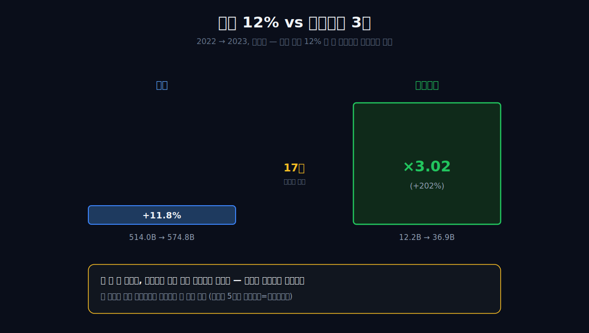
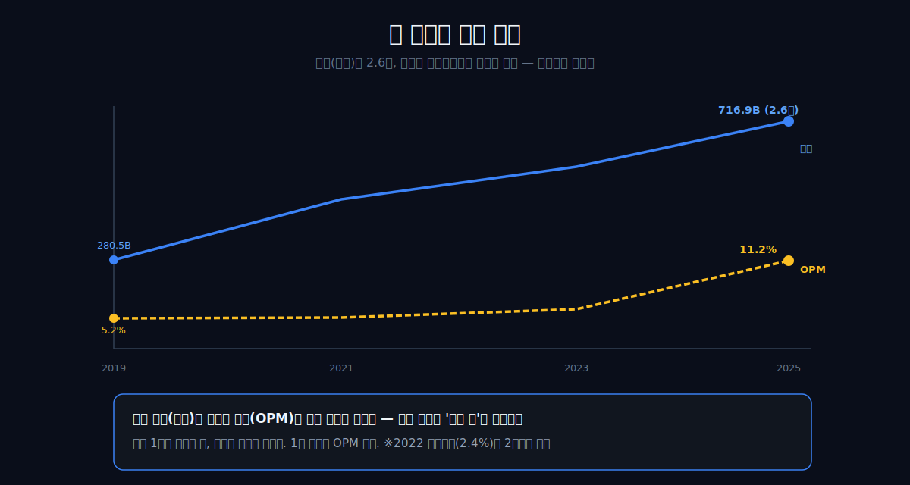
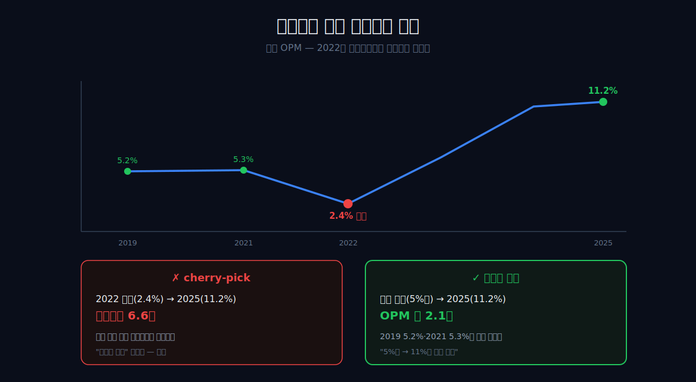
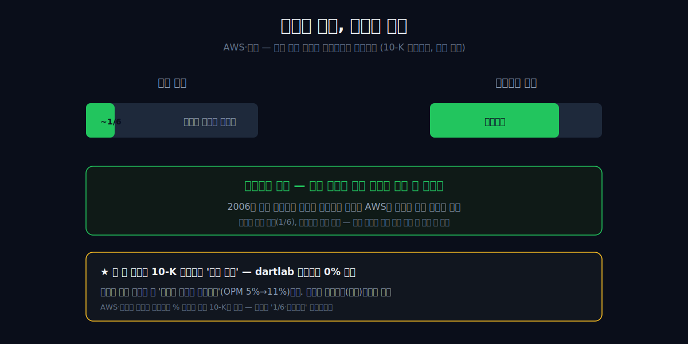
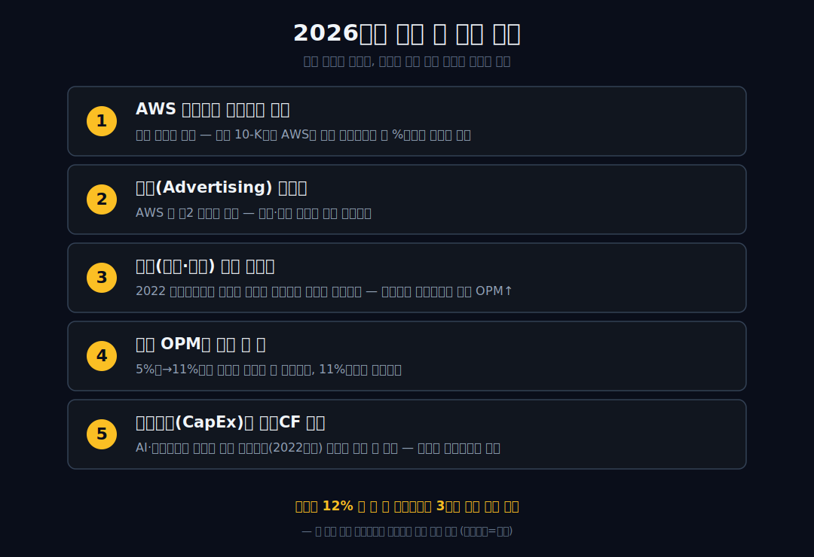

<script>
import ComboChart from '$lib/components/blog/ComboChart.svelte';
import StackBar from '$lib/components/blog/StackBar.svelte';
</script>

> **데이터 기준**: 2026-06-20 dartlab 실측 — Amazon(AMZN) **미국 연결(USD)** 기준, 분기 데이터를 연간으로 합산. AWS 세그먼트 영업이익, 광고 서비스 매출, AI 인프라 투자와 FCF는 연결 손익에 한 줄로 안 나오므로 **2025 Form 10-K·IR(외부 인용)**로 표기. 2026년 1분기 IR 웹페이지는 접근 제한(403)이라 본문 근거에서 제외하고, 재무표의 닻은 2025년 연간이다. ※대차대조표 항목은 매핑이 불안정해 인용에 주의.
>
> **핵심 숫자**: 매출 **$716.9B** · 영업이익 **$80.0B** (영업이익률 **11.2%**) · 당기순이익 **$77.7B** · 영업현금흐름 **$139.5B** · 연결 OPM 2019 **5.2%** → 2025 **11.2%** (약 2.1배)
>
> **이 글의 용어**: 연결 OPM(영업이익률) = 영업이익÷매출 · 세그먼트 = 사업 부문(아마존은 북미 소매·해외 소매·AWS 클라우드로 보고) · AWS = 아마존 웹서비스(클라우드 인프라 임대) · 영업현금흐름(OCF) = 영업으로 실제 들어온 현금 · FCF = 영업현금흐름에서 설비투자 등을 뺀 회사 제시 자유현금흐름 · cherry-pick = 유리한 시점만 골라 과장하는 것.

---

## 프롤로그 — 손익계산서에 안 적힌 이익

간판은 물건 파는 회사다. 매출 **$716.9B**(약 980조 원), 세계 최대 소매. 그런데 연결 재무제표를 열면 이상한 게 보인다.

2022년 이 회사는 영업이익률 **2.4%**, 순이익 **-$2.7B 적자**였다. 거의 break-even. 2025년엔 OPM **11.2%**, 순이익 **$77.7B**. 같은 회사, 3년 사이의 일이다.

더 멈칫하는 건 한 칸 옆 숫자다. 2022년에서 2023년, 매출은 514.0에서 574.8로 **11.8%**밖에 안 늘었는데 영업이익은 12.2에서 36.9로 **정확히 3배** 뛰었다.



물건을 12% 더 판 게 영업이익을 3배로 만들 수는 없다. 그렇다면 이익은 어디서 왔나. **연결 손익계산서 어디를 봐도 그 답은 안 적혀 있다.** 안 보이는 곳에서 누군가 이익을 떠받치고 있다는 뜻이다.


관통선은 하나다. **"세계 최대 소매라는 간판의 회사에서, 왜 이익이 매출과 따로 움직이고, 그 엔진은 왜 연결 재무에 안 보이는가?"** 답을 먼저 쓴다. 진짜 이익 엔진(AWS·광고)이 매출 비중은 작아 소매 간판에 가려지고, 연결 손익 한 줄에는 안 나온다 — *세그먼트 은닉*이다.

---

## 1막 — 간판은 소매, 연결 재무는 다른 회사를 그린다

**왜 세계 1위 소매의 연결 재무를 '소매 회사 재무'로 읽으면 안 되나.** 두 곡선이 따로 논다.

```python
import dartlab
c = dartlab.Company("AMZN")
c.select("IS", ["매출액", "영업이익"], freq="Q")  # 분기→연간 합산
```

| 항목 ($B, 연간) | 2019 | 2021 | 2023 | 2024 | 2025 |
|---|---:|---:|---:|---:|---:|
| 매출 | 280.5 | 469.8 | 574.8 | 638.0 | **716.9** |
| 영업이익 | 14.5 | 24.9 | 36.9 | 68.6 | **80.0** |
| 연결 OPM | 5.2% | 5.3% | 6.4% | 10.8% | **11.2%** |

매출은 9년간 280.5에서 716.9로 **2.6배** 커졌다. 그런데 같은 기간 OPM은 5.2%에서 11.2%로 *따로* 움직였다 — 규모 성장과 이익률 점프가 다른 곡선을 그린다. 소매(박리)는 OPM이 이렇게 두 배로 점프할 수 없다. 연결 숫자 자신이 *간판 밖*을 가리키는 것이다.

비교해 보면 더 분명하다. 일반적인 대형 유통업체는 매출이 두 배가 돼도 영업이익률은 한 자릿수 그대로다 — 물건을 두 배 팔면 매입·물류 비용도 두 배 들기 때문이다. 마진은 규모로 끌어올려지지 않는다. 그런데 아마존은 매출이 2.6배 되는 동안 마진율 자체가 두 배가 됐다. 이건 '같은 사업을 더 크게'가 아니라 '다른 이익 구조가 섞여 들어왔다'는 뜻이다. 매출 곡선만 보면 거대한 소매 회사의 성장 스토리지만, 이익률 곡선을 겹쳐 보는 순간 *두 개의 회사가 한 장부 안에 있다*는 게 드러난다.

여기서는 규모(매출 1위)를 *이익의 증명*으로 읽지 않는다. 매출 크기는 간판일 뿐이다. 1차 증거는 OPM 곡선이고, 그 곡선이 "이 회사는 소매로만 설명되지 않는다"고 말한다.



그렇다면 정직한 기준점은 어디인가?

---

## 2막 — 정직한 기준선: 2022는 붕괴저점이지 출발선이 아니다

**왜 '2.4%→11.2%, 영업이익 6.6배'라고 쓰면 안 되나.** 흔한 극적 서사는 함정이다.

2022년 OPM 2.4%는 데이터 자신이 *붕괴*라 부른 비정상 저점이다. 거기서 2025년 80.0을 비교하면 영업이익 6.6배라는 화려한 곡선이 나온다. 하지만 그건 *cherry-pick*이다 — 가장 낮은 골을 출발선으로 삼은 것이다.

정직한 기저는 2019년 5.2%, 2021년 5.3%다. 거기서 2025년 11.2%는 약 **2.1배**다. 이 회사는 '망했다가 부활'한 게 아니라, *정상 5%대 마진에서 11%대로 구조를 한 단계 올린* 것이다.



이 구분이 중요하다. 6.6배는 드라마를 위해 골을 출발선으로 바꿔치기한 숫자이고, 2.1배는 정상 마진 대비 진짜 상향폭이다. 그렇다면 그 '2.4% 붕괴'는 왜 일어났나?

---

## 3막 — 2022, 소매 껍데기가 이익을 못 내던 해

**왜 매출 $514B의 거대 회사가 거의 적자였나.** 소매를 더 굴릴수록 이익이 안 남았기 때문이다.

```python
c.select("IS", ["매출액", "영업이익", "당기순이익"], freq="Q")
```

2022년 아마존은 영업이익 12.2B(OPM 2.4%), 순이익 **-2.7B 적자**였다. 그런데 그해 매출은 469.8(2021)에서 514.0으로 **9.4% 늘었다.** 매출이 느는데 영업이익은 24.9에서 12.2로 *반토막* 났다.


매출이 줄어서가 아니라, *소매·물류 과잉투자* 비용이 마진을 거의 0까지 깎은 것이다. 코로나 기간(2020~2021) 아마존은 폭증한 주문을 감당하려 2년 만에 물류망과 인력을 거의 두 배로 늘렸다. 그런데 2022년 수요가 정상으로 돌아오자, 그렇게 깔아 둔 창고·배송 *고정비*는 그대로 남았다. 절반쯤 비어 가는 창고의 임차료와 인건비가 마진을 짓눌렀고, 여기에 인플레이션과 연료비까지 겹쳤다. 같은 해 취임한 CEO 앤디 재시가 곧장 비용 구조조정에 들어간 배경이다.

핵심은 이거다 — 소매를 더 굴릴수록 이익이 안 남는 *박리 구조*가 그해 민낯으로 드러났다. 매출 $514B를 일으키고도 영업이익은 $12B(2.4%), 순이익은 적자. 물건을 사고팔아 배송하는 일은, 아무리 규모가 커도 한 자릿수 마진의 고된 사업이다. (단, 소매가 본질적으로 적자 사업이라는 뜻은 아니다. 과잉투자 국면의 박리 노출로 한정한다.) 그런데 바로 이 박리 껍데기를 단 회사가, 이듬해 영업이익을 3배로 불린다.

이 껍데기가 이익을 못 내는데, 바로 이듬해 영업이익이 3배 뛴다.

---

## 4막 — 어? 매출 12% 느는데 영업이익 3배

**무엇이 적자 직전을 3배 이익으로 뒤집었나.** 이게 글의 '어?' 정점이다.

| 항목 ($B) | 2022 | 2023 | 변화 |
|---|---:|---:|---:|
| 매출 | 514.0 | 574.8 | **+11.8%** |
| 영업이익 | 12.2 | 36.9 | **×3.02** |

2022→2023년 매출은 11.8% 늘었는데 영업이익은 정확히 3배가 됐다. 매출 증가율(+11.8%)과 영업이익 증가율(+202%)이 *17배 차이*로 벌어졌다. 같은 일(소매)을 12% 더 한 결과로는 절대 나올 수 없는 격차다.

물론 이 3배의 일부는 3막에서 본 *2022 과잉투자 비용이 빠진 기저효과*다 — 비정상으로 눌렸던 마진이 정상으로 돌아온 몫이 있다. 하지만 그것만으로 3배는 설명되지 않는다. 비용이 정상화돼 2021년 수준(OPM 5.3%)으로만 돌아왔다면 영업이익은 30B 안팎에 머물렀을 텐데, 실제로는 36.9B을 지나 2025년 80.0B까지 갔다. 정상 마진을 *넘어서* 11%대로 올라간 부분 — 그게 진짜 질문이다.

이건 더 판 게 아니라, *이익률이 구조적으로 높은 다른 매출이 그 사이 커졌다*는 신호다. 연결 숫자가 정직하게 말할 수 있는 건 정확히 여기까지다 — **이익이 매출에서 분리됐다.** '무엇이 분리를 만들었나'는 연결 손익계산서에 한 줄도 안 적혀 있다. 그 안 적힌 엔진을 어디서 확인하나?

---

## 5막 — 안 보이는 엔진: AWS는 매출 18%로 이익 57%를 낸다

**왜 연결 재무만으로는 그 엔진을 못 짚나.** dartlab은 미국 연결(USD)만 추출하고, 세그먼트별 영업이익은 연결 손익에 통합돼 한 줄로 안 나온다.

그 엔진의 정체는 2025 Form 10-K 세그먼트(외부 인용)에 있다. 2025년 AWS 매출은 **$128.7B**로 전사 매출 **$716.9B**의 **18%**다. 그런데 AWS 영업이익은 **$45.6B**로 전사 영업이익 **$80.0B**의 **57%**다. 매출 표만 보면 AWS는 조연처럼 보이지만, 이익으로 보면 주연이다.

| 2025 세그먼트 (공식 10-K, $B) | 매출 | 매출 비중 | 영업이익 | 전사 영업이익 기여 |
|---|---:|---:|---:|---:|
| 북미 | 426.3 | 59% | 29.6 | 37% |
| 해외 | 161.9 | 23% | 4.8 | 6% |
| AWS | **128.7** | **18%** | **45.6** | **57%** |
| 연결 합계 | **716.9** | **100%** | **80.0** | **100%** |

이 표가 이 글의 공시상 핵심이다. 매출 82%를 차지하는 북미+해외 소매·마켓플레이스·구독·광고 묶음이 전사 영업이익의 43%를 만들고, 매출 18%짜리 AWS가 57%를 만든다. "아마존은 소매 회사인가 클라우드 회사인가"라는 질문에 답하려면 매출 비중이 아니라 이익 비중을 봐야 한다.




**왜 매출 비중이 작은데 이익은 대부분인가.** 클라우드의 마진 구조가 소매와 정반대이기 때문이다. AWS의 2025년 영업이익률은 **35.4%**($45.6B ÷ $128.7B)다. 연결 OPM 11.2%의 세 배가 넘는다. 반대로 북미는 약 **6.9%**, 해외는 약 **2.9%** 수준이다. 같은 1달러 매출이라도 클라우드 1달러와 소매 1달러가 손익에 남기는 무게가 전혀 다르다.

데이터센터는 한 번 지어 놓으면, 그 위에 고객 사용량이 늘수록 매출이 붙고 가동률이 올라간다. 물론 서버·전력·네트워크·칩·토지·감가상각은 무겁다. 그래서 AWS를 "공짜로 마진이 붙는 소프트웨어"처럼 쓰면 틀린다. 정확한 표현은 **자본은 무겁지만, 사용량이 쌓일 때 단위경제가 빠르게 두꺼워지는 인프라 사업**이다. 소매는 한 건 더 팔 때마다 상품 원가와 배송비가 따라붙지만, 클라우드는 고객 사용량이 증가할 때 이미 깔아 둔 인프라의 효율이 함께 올라간다. 이 차이가 매출 18%가 이익 57%가 되는 이유다.

**왜 그게 '안 보이나'.** 세그먼트별 영업이익은 10-K의 주석(세그먼트 보고)에만 따로 적히고, 연결 손익계산서 본문에는 한 줄로 통합돼 들어온다. 그래서 연결 재무만 읽으면 "영업이익 $80B"라는 합계는 보여도, 그 안에서 AWS가 얼마, 소매가 얼마인지는 안 나온다.

이게 이 회사의 메커니즘이다 — *세그먼트 은닉*. 진짜 엔진이 매출 규모에 묻혀 연결에선 안 보이고, 소매라는 간판에 가려진다. 더 흥미로운 건 그 엔진의 *기원*이다. AWS는 2006년, 아마존이 자기 쇼핑몰을 돌리려 만든 서버·인프라 역량을 외부 개발자에게 빌려주며 시작됐다 — 소매를 굴리려던 부산물이 회사 이익의 척추가 된 것이다. 같은 클라우드·플랫폼 결로는 광고가 엔진인 [메타](/blog/META-meta-platforms), AI 가속기의 [엔비디아](/blog/NVDA-nvidia)가 있고, 한국 이커머스의 거울로는 [쿠팡](/blog/CPNG-coupang)이 있다.

---

## 6막 — 광고는 제2 엔진이지만, 마진은 공시되지 않는다

**왜 광고를 AWS처럼 숫자로 단정하면 안 되나.** 아마존은 광고 서비스 매출을 공시하지만, 광고만의 영업이익률은 별도 세그먼트로 공개하지 않기 때문이다.

2025년 광고 서비스 매출은 **$68.6B**다. 2023년 $46.9B, 2024년 $56.2B에서 계속 커졌다. 2025년 증가율은 **22%**다. 이 규모는 이미 독립 대형 광고 플랫폼이다. 아마존 광고는 검색 결과, 상품 상세 페이지, 동영상, 디스플레이 광고처럼 구매 의도가 살아 있는 위치에 붙는다. 그래서 질적으로는 고마진 제2 엔진으로 볼 이유가 충분하다.

하지만 여기서 멈춰야 한다. 공식 10-K는 광고 서비스 매출을 "유사 제품·서비스별 순매출"로 보여주지만, 광고 서비스의 영업이익이나 마진을 독립 세그먼트로 보여주지 않는다. 그러므로 "광고가 전사 영업이익 몇 %를 냈다"는 문장은 이 글에서 쓰지 않는다. 추정할 수는 있지만, 검증표에 넣을 수 없다. 검증표에 넣을 수 없는 숫자는 본문에서 단정하지 않는다.

이 경계가 중요한 이유는 단순하다. 아마존의 투자 논리는 자주 "AWS + 광고 = 고마진 엔진"으로 요약된다. 방향은 맞다. 하지만 두 엔진의 증거 수준은 다르다. **AWS는 매출과 영업이익을 모두 공시한다. 광고는 매출만 공시한다.** 그래서 AWS는 숫자로 말하고, 광고는 경계가 붙은 정성 판단으로 말해야 한다.

광고를 이렇게 제한해서 쓰면 오히려 글이 강해진다. 독자는 "무슨 말이 공시로 확인됐고, 무슨 말이 사업 구조 해석인가"를 구분할 수 있다. 아마존 광고는 분명히 중요하다. 2025년 $68.6B 매출, 22% 성장, 구매 의도 데이터 위에 붙은 광고라는 점에서 제2 엔진이다. 그러나 이 글의 공식 이익 엔진은 **AWS $45.6B 영업이익**이다. 광고는 그 옆의 두 번째 가속 페달이지, 검증된 영업이익 표의 주인공은 아니다.

---

## 7막 — 이익은 현금으로 찍히지만, FCF는 AI 투자에 눌렸다

**그 이익은 장부뿐 아니라 현금으로도 도는가.** 그렇다. 하지만 2025년의 반전은 여기서 끝나지 않는다.

```python
c.select("CF", ["영업활동현금흐름"], freq="Q")
```

2025년 영업현금흐름은 **$139.5B**로 순이익 $77.7B의 **1.8배**다. 자본이 무거운 사업(데이터센터)은 감가상각이 커서 현금흐름이 회계이익보다 두껍게 나오는 경향이 있다 — 5막의 세그먼트 그림(AWS=설비집약)과 어긋나지 않는다.

실제로 영업현금흐름은 2019년 38.5B에서 2025년 139.5B로 *3.6배*가 됐다 — 같은 기간 매출(2.6배)보다 빠르다. 현금 창출력이 매출 규모보다 빨리 큰 것 역시, 단순한 '물건 더 팔기'로는 설명되지 않는 구조 변화의 또 다른 그림자다.

다만 이 갭을 *'감가상각=AWS 설비' 하나로* 단정하면 틀린다. 영업CF가 순이익을 웃도는 데는 데이터센터 감가상각뿐 아니라 운전자본 변동(아마존은 공급업체에 늦게 지불하고 고객에게 빨리 받는 구조라 현금이 먼저 들어온다), 주식보상비용, 이연법인세도 함께 작용한다. 연결만으로는 이 항목들을 분해할 수 없으므로 단일귀인은 거부한다 — 현금의 두께는 '구조가 바뀌었다'는 방향까지만 보강한다.

그런데 주주가 바로 쓸 수 있는 현금으로 내려오면 그림이 달라진다. 2025년 회사가 제시한 FCF는 **$11.2B**로, 2024년 **$38.2B**에서 크게 줄었다. 이유는 공식 Exhibit 99.1에 적힌다 — 설비·장비 구매 증가분 **$50.7B**가 주로 **AI 투자**를 반영했기 때문이다. 즉 아마존은 2025년에 더 많은 영업현금을 만들었지만, 그 현금을 AI·데이터센터 투자에 다시 집어넣었다.

이 반전은 AMZN을 읽는 데 매우 중요하다. "AWS가 전사 영업이익 57%를 낸다"는 말만 보면 현금이 곧장 주주에게 쌓일 것 같다. 하지만 2025년의 실제 자본배분은 다르다. 이익 엔진은 커졌고, 동시에 그 엔진을 더 키우기 위한 CapEx도 커졌다. 그래서 AMZN의 2026년 질문은 "AWS가 돈을 버는가"가 아니다. 이미 번다. 진짜 질문은 **AI 인프라 투자 강도가 영업현금흐름의 성장을 얼마나 먹어치우는가**다.

이 대목은 [마이크로소프트](/blog/MSFT-microsoft)와도 이어진다. MSFT도 클라우드·AI CapEx가 커지며 현금흐름의 질을 다시 읽어야 한다. 차이는 AMZN은 소매·광고·클라우드가 한 장부에 묶여 있어, 연결 손익만 보면 어떤 엔진이 투자와 이익을 동시에 만들고 있는지 더 잘 숨겨진다는 점이다.

정리하면 — 간판은 소매, 연결이 증명하는 건 *이익이 매출과 분리됐다*(OPM 약 5%→11%)는 것까지다. 그 정체는 세그먼트(외부)에서만 AWS로 확정된다. 광고는 매출 규모와 성장률이 확인되는 제2 엔진이지만, 영업이익률은 미공시라 숫자 단정에서 제외한다. 매출의 크기가 아니라, *매출과 따로 노는 이익률 곡선*을 봐야 이 회사가 보인다. 물건을 12% 더 판 게 영업이익을 3배로 만들 수는 없다 — 그 한 문장이 이 회사가 소매가 아니라는 가장 짧은 증명이고, 답은 연결 손익계산서가 아니라 그 뒤에 숨은 세그먼트에 있다. 같은 '간판 ≠ 진짜 돈줄' 계열로, 안 보이는 발효 엔진을 쥔 [CJ제일제당](/blog/097950-cj-cheiljedang), 의무 길목을 쥔 [더존비즈온](/blog/012510-douzone)이 있다 — 셋 다 *간판 뒤의 엔진*이 이익을 떠받친다.

---

## 8막 — 그래도 소매는 껍데기만은 아니다

**왜 "아마존은 그냥 AWS 회사"라고 쓰면 또 틀리나.** 소매가 이익률은 낮아도, AWS·광고·프라임·마켓플레이스가 자라는 토양이기 때문이다.

이 글은 계속 "간판은 소매, 엔진은 AWS"라고 말해 왔다. 하지만 여기서 소매를 허수아비처럼 취급하면 글이 약해진다. 아마존의 소매는 단순히 낮은 마진을 끌고 다니는 짐이 아니다. 소매는 고객 트래픽, 구매 의도 데이터, 셀러 생태계, 물류 밀도, 프라임 구독, 광고 지면을 만든다. 이 중 몇 개는 손익계산서에서 낮은 마진으로 보이고, 몇 개는 AWS·광고·서드파티 수수료 같은 더 두꺼운 수익원으로 바뀐다.

2025년 서비스 매출 구성을 보면 이 점이 분명하다. 서드파티 셀러 서비스 매출은 **$172.2B**, 광고 서비스 매출은 **$68.6B**, 구독 서비스 매출은 **$49.6B**다. 이들은 모두 "물건을 직접 매입해 팔았다"는 온라인 스토어 매출과 다르다. 마켓플레이스 판매자가 아마존 물류와 고객 접점을 쓰며 수수료를 내고, 광고주는 구매 의도가 살아 있는 검색·상세 페이지에 돈을 내고, 고객은 프라임으로 배송·콘텐츠·편의를 묶어 산다. 즉 소매 간판은 낮은 마진 상품 판매만 뜻하지 않는다. 소매 간판은 **수수료·광고·구독을 낳는 트래픽 장치**이기도 하다.

이 관점이 없으면 AMZN을 둘로 잘못 쪼갠다. "소매는 나쁘고 AWS는 좋다"는 식이다. 실제로는 더 복잡하다. AWS는 공식 영업이익 엔진이고, 광고는 매출 성장으로 확인되는 제2 엔진이며, 그 광고가 붙는 가장 강한 지면은 아마존 쇼핑 경험이다. 고객이 상품을 검색하고, 비교하고, 장바구니에 담는 순간 광고의 가치가 생긴다. 그 순간을 만드는 것은 소매다. 그래서 소매는 낮은 OPM 때문에 가려지는 짐이면서 동시에 광고와 셀러 수수료를 만드는 원천이다.

북미 세그먼트도 이 맥락에서 봐야 한다. 2025년 북미 매출은 **$426.3B**, 영업이익은 **$29.6B**다. 영업이익률은 약 6.9%로 AWS보다 훨씬 낮지만, 전사 영업이익의 37%를 낸다. "소매는 돈을 못 번다"는 문장도 이제는 너무 낡았다. 2022년에는 과잉투자와 비용 압박 때문에 소매 껍데기가 거의 이익을 못 냈지만, 2025년 북미는 분명히 이익을 낸다. 다만 그 이익률이 AWS와 비교하면 얇을 뿐이다.

해외 세그먼트는 또 다른 신호다. 2023년 해외는 영업손실 **-$2.7B**였지만, 2024년 **$3.8B**, 2025년 **$4.8B** 흑자로 돌아섰다. 이 변화는 전사 OPM 상승의 보조 엔진이다. AWS가 큰 축이라면, 해외 적자 축소와 북미 마진 정상화는 바닥을 들어 올리는 축이다. 즉 2022→2025의 이익 개선은 하나의 원인이 아니라 세 가지가 겹친다. 첫째 AWS 고마진. 둘째 북미 소매/마켓플레이스 정상화. 셋째 해외 적자 축소. 광고는 그 위에 붙은 성장 레이어다.

이렇게 읽으면 제목의 문장이 더 정확해진다. "물건을 12% 더 판 게 영업이익을 3배로 만들 수는 없다"는 말은 소매가 아무 가치 없다는 뜻이 아니다. 같은 소매 매출 증가만으로는 설명되지 않는다는 뜻이다. 실제 설명은 세그먼트 조합이다. AWS가 이익의 절반 이상을 만들고, 북미가 정상화되고, 해외가 흑자로 돌아서고, 광고 서비스가 빠르게 커졌다. 연결 손익 한 줄은 이 네 가지를 모두 섞어 "영업이익 $80.0B"라고만 보여준다. 그래서 세그먼트를 봐야 한다.

여기서 AMZN의 아름다움과 위험이 동시에 나온다. 아름다움은 한 고객 접점에서 여러 수익원이 생긴다는 점이다. 고객이 아마존에서 물건을 찾으면, 셀러 수수료·광고·배송·구독·결제·데이터가 동시에 움직인다. 위험은 그 모든 것이 거대한 인프라 투자를 요구한다는 점이다. 물류센터와 데이터센터는 서로 다른 자산이지만, 둘 다 돈을 먼저 깔아야 한다. 2022년에는 물류 과잉투자가 마진을 눌렀고, 2025년에는 AI 데이터센터 투자가 FCF를 눌렀다. 아마존은 늘 "먼저 깔고 나중에 회수"하는 회사다. 그 회수 속도가 빨라질 때는 마진이 폭발하고, 투자가 앞설 때는 현금흐름이 눌린다.

이 막이 이 글의 균형추다. AMZN을 소매 회사로만 읽으면 AWS를 놓친다. AMZN을 AWS 회사로만 읽으면 소매가 만드는 광고·마켓플레이스·구독의 기반을 놓친다. 정확한 문장은 이렇다. **아마존은 소매 간판으로 고객을 모으고, AWS로 이익의 절반 이상을 만들며, 광고·마켓플레이스·구독으로 소매 트래픽을 다시 수익화하는 회사다.** 연결 손익계산서 한 장에는 이 문장이 숨어 있다.

---

## 9막 — 투자자가 틀리려면 무엇이 바뀌어야 하나

좋은 AMZN 글은 "AWS가 좋다"에서 끝나면 안 된다. 무엇이 바뀌면 이 글의 논리가 깨지는지까지 써야 한다. 이 회사는 여러 엔진이 한 장부에 묶여 있어, 한 숫자만 봐서는 반박 조건을 잡기 어렵다.

첫째, **AWS 영업이익률이 구조적으로 내려가면** 이 글의 핵심이 흔들린다. 2025년 AWS OPM은 35.4%다. 이 숫자가 30% 아래로 내려가고 회복하지 못한다면, AI 인프라 경쟁·가격 인하·칩 비용·고객 장기계약 조건이 AWS의 단위경제를 바꾸고 있다는 뜻일 수 있다. AWS 매출 성장률만 보면 안 된다. 매출이 20% 늘어도 마진이 10%포인트 빠지면 전사 이익 엔진의 질은 약해진다.

둘째, **광고 서비스 매출 성장률이 꺾이면** 소매 트래픽의 수익화 논리가 약해진다. 광고는 영업이익률이 공시되지 않기 때문에 이익 기여를 숫자로 단정할 수 없다. 하지만 매출 성장률 자체는 볼 수 있다. 2025년 광고 서비스 매출은 $68.6B, 전년 대비 22% 성장이다. 이 성장률이 한 자릿수로 내려가면, 구매 의도 광고 지면의 성장 여지가 줄었거나 경쟁이 강해졌거나 셀러 광고비 부담이 한계에 닿았다는 신호일 수 있다.

셋째, **북미 마진 정상화가 다시 꺾이면** 2022의 기억이 되살아난다. 2022년 아마존은 매출이 커졌는데도 영업이익률이 2.4%까지 내려갔다. 물류 과잉투자와 비용 압박이 소매 체질을 그대로 눌렀다. 2025년 북미 OPM은 6.9%로 회복됐지만, 물류비·임금·배송 속도 경쟁·반품 비용이 다시 올라가면 이익률은 쉽게 얇아질 수 있다. 북미는 AWS만큼 두꺼운 사업이 아니므로 비용 압박에 민감하다.

넷째, **해외가 다시 적자로 돌아서면** 전사 OPM의 바닥이 낮아진다. 2025년 해외 영업이익은 $4.8B다. 규모는 AWS보다 작지만, 2023년 손실에서 2025년 흑자로 돌아선 변화가 전사 마진 개선에 기여했다. 해외는 환율, 지역별 규제, 물류 밀도, 소비자 가격 민감도에 노출돼 있다. 이 축이 흔들리면 "소매 껍데기가 정상화됐다"는 보조 논리가 약해진다.

다섯째, **FCF가 장기간 낮게 묶이면** 이익 엔진이 주주 현금으로 번역되지 않는다. 2025년 OCF는 $139.5B였지만 FCF는 $11.2B였다. AI 투자 때문에 돈이 다시 들어갔다. 한 해의 CapEx 증가는 성장 투자로 볼 수 있다. 하지만 여러 해 동안 FCF가 낮게 묶이고, AWS·광고 성장률이 그 투자를 충분히 보상하지 못하면, 시장은 "이익은 늘었지만 현금 회수는 멀어졌다"로 재평가할 수 있다.

여섯째, **연결 OPM이 11%대에서 더 올라가지 못하고 CapEx만 커지면** AMZN의 서사는 바뀐다. 2019~2021년 정상 기저 5%대에서 2025년 11.2%까지 올라온 것은 분명한 구조 개선이다. 하지만 다음 단계가 중요하다. AI 투자로 AWS 매출은 커지는데 감가상각·전력·칩 비용이 더 빨리 늘고, 소매 마진은 제자리라면 전사 OPM은 11%대에서 막힐 수 있다. 그때는 "마진 확장 스토리"가 아니라 "성장 유지를 위한 고강도 투자 스토리"가 된다.

일곱째, **규제와 반독점 압력이 마켓플레이스 수수료·광고 결합을 건드리면** 소매 트래픽 수익화 모델이 약해질 수 있다. 아마존은 판매자, 광고주, 고객, 물류를 한 플랫폼에 묶는다. 이 결합이 강점이지만, 동시에 규제의 표적이 된다. 셀러 수수료, 검색 광고 노출, 자체 브랜드, 프라임 결합, 데이터 사용 방식이 제한되면 소매 간판에서 파생되는 수익원의 질이 달라진다.

이 일곱 조건을 한 문장으로 묶으면 이렇다. **AMZN의 핵심은 AWS가 벌고, 소매가 트래픽을 만들고, 광고가 그 트래픽을 수익화하며, AI CapEx가 그 현금을 다시 흡수하는 균형이다.** 어느 한 축이 무너지면 글의 결론도 바뀐다. 그래서 2026년에 볼 숫자는 매출 성장률 하나가 아니다. AWS OPM, 광고 매출 성장률, 북미·해외 세그먼트 OPM, OCF와 FCF의 간격, CapEx 증가율을 같이 봐야 한다.

---

## 10막 — AMZN 10-K를 읽는 실제 순서

아마존은 10-K를 처음부터 순서대로 읽으면 오히려 헷갈린다. 앞부분에는 소비자, 셀러, 개발자, 광고주, 콘텐츠 창작자, AWS 고객이 모두 등장한다. 이걸 사업 소개로만 읽으면 "아마존은 이것저것 다 하는 회사"가 된다. 그렇게 읽으면 손익의 핵심을 놓친다. AMZN은 10-K의 **세그먼트 표 → 서비스별 매출 표 → 현금흐름표 → MD&A 비용 설명** 순서로 읽어야 한다. 이 순서가 연결 손익에 숨은 엔진을 드러낸다.

첫 번째로 볼 표는 세그먼트 표다. 북미, 해외, AWS 세 칸을 나란히 놓고 매출과 영업이익을 같이 본다. 여기서 바로 결론이 나온다. 2025년 AWS는 매출 18%인데 영업이익 57%다. 북미는 매출 59%인데 영업이익 37%다. 해외는 매출 23%인데 영업이익 6%다. 이 세 줄을 보지 않으면 AMZN을 읽을 수 없다. 연결 손익계산서의 영업이익 $80.0B는 이 세 줄의 합계일 뿐이다. 투자자는 합계가 아니라 합계의 내부 구성을 봐야 한다.

두 번째로 볼 표는 서비스별 매출 표다. 여기에는 온라인 스토어, 오프라인 스토어, 서드파티 셀러 서비스, 광고 서비스, 구독 서비스, AWS, 기타가 나온다. 이 표는 세그먼트 표와 다른 질문에 답한다. 세그먼트 표가 "어디서 이익이 나는가"를 보여준다면, 서비스별 매출 표는 "소매 간판이 어떤 수익원으로 쪼개졌는가"를 보여준다. 온라인 스토어 매출은 $269.3B이고, 서드파티 셀러 서비스는 $172.2B이며, 광고 서비스는 $68.6B다. 이 숫자들을 보면 아마존 소매가 단순 재판매 사업이 아니라는 점이 보인다. 소매는 상품 판매, 판매자 수수료, 광고, 구독을 동시에 만든다.

세 번째로 볼 것은 현금흐름표다. 손익계산서에서 영업이익이 좋아졌다고 바로 좋은 현금흐름이라고 결론 내리면 안 된다. 2025년 OCF는 $139.5B로 매우 크다. 하지만 FCF는 $11.2B다. 왜 이렇게 차이가 나는가. 회사는 PPE 구매 증가분 $50.7B가 주로 AI 투자를 반영한다고 설명한다. 여기서 AMZN의 다음 질문이 나온다. "이 회사는 벌어서 남기는 회사인가, 벌어서 다시 까는 회사인가?" 2025년 답은 둘 다다. 엄청나게 벌고, 엄청나게 다시 깐다.

네 번째로 볼 것은 비용 설명이다. 2025년 기술·인프라 비용은 $108.5B로 전년 $88.5B에서 크게 늘었다. 이 비용 증가는 AWS와 AI, 인프라 투자의 방향과 이어진다. 동시에 물류·배송 비용은 소매의 마진을 결정한다. 그래서 아마존 비용 설명은 일반 판관비 주석이 아니다. 이 회사의 비용은 사업별 엔진의 연료다. 기술·인프라 비용은 AWS·AI의 연료이고, fulfillment 비용은 소매·마켓플레이스의 연료이며, sales and marketing 비용은 광고·구독·고객 획득과 연결된다. 비용을 단순히 "늘었다/줄었다"로 읽으면 구조를 놓친다.

이 네 순서를 따라 읽으면, AMZN의 2025년 재무제표는 하나의 문장으로 바뀐다. **소매 트래픽은 여전히 거대하고, AWS는 그보다 훨씬 두꺼운 이익률로 전사 이익의 절반 이상을 만들며, 광고는 빠르게 커지는 수익화 레이어이고, AI 인프라는 그 현금을 다시 빨아들이는 투자 축이다.** 이 문장을 만들기 위해 필요한 숫자는 모두 10-K와 Exhibit 99.1에 있다. 연결 손익만 보면 이 문장이 안 나온다.

이 읽기 순서는 2026년에도 그대로 쓸 수 있다. 다음 10-K나 분기 실적이 나오면 먼저 세그먼트 표에서 AWS OPM과 북미·해외 OPM을 확인한다. 그 다음 서비스별 매출 표에서 광고와 서드파티 셀러 서비스 성장률을 본다. 그 다음 현금흐름표에서 OCF와 FCF의 간격을 본다. 마지막으로 비용 설명에서 AI·데이터센터·물류 투자가 어느 비용 라인에 남았는지 본다. 이 순서를 지키면 "매출이 몇 % 늘었다"는 헤드라인에 끌려가지 않는다.

AMZN을 틀리게 읽는 가장 흔한 방식은 매출 크기 순서로 중요도를 매기는 것이다. 매출이 가장 큰 온라인 스토어를 핵심으로 보고, AWS는 18%짜리 부업처럼 읽는 식이다. 하지만 이익은 매출 크기 순서로 움직이지 않는다. AWS는 매출 18%로 이익 57%를 낸다. 광고는 매출 표에는 나오지만 마진은 숨겨져 있다. 북미 소매는 낮은 마진이지만 트래픽·광고·셀러 수수료의 기반이다. 해외는 작아 보이지만 적자에서 흑자로 바뀌며 전사 마진을 들어 올렸다. 중요도는 매출액이 아니라 **마진·성장·현금회수·자본투자**의 조합으로 매겨야 한다.

실제로 2025년 표를 머릿속에 세로로 세워 보면 다른 회사가 보인다. 온라인 스토어 매출 $269.3B는 거대하지만, 이 항목만으로는 아마존의 전사 OPM 11.2%를 설명할 수 없다. 서드파티 셀러 서비스 $172.2B는 판매자 생태계의 수수료 구조를 보여준다. 광고 서비스 $68.6B는 그 생태계 위에서 구매 의도 데이터를 수익화하는 층이다. AWS $128.7B는 별도의 클라우드 인프라 사업이고, 그 영업이익 $45.6B가 전사 이익의 중심이다. 같은 매출 표에 있지만 경제성이 모두 다르다. 그래서 AMZN은 "매출 항목을 같은 색으로 칠하면 안 되는 회사"다.

독자가 직접 10-K를 열 때 가장 먼저 해야 할 일은 숫자를 다시 묶는 것이다. 온라인 스토어와 오프라인 스토어는 직접 판매의 색이 강하다. 서드파티 셀러 서비스와 광고 서비스는 플랫폼 수수료·수익화의 색이 강하다. 구독 서비스는 고객 락인과 반복 매출의 색이 강하다. AWS는 인프라 임대의 색이 강하다. 이 네 색을 한꺼번에 "아마존 매출"이라고 부르면 아무것도 보이지 않는다. 색을 나누면 왜 연결 OPM이 5%대에서 11%대로 올라왔는지 보이기 시작한다.

두 번째 실전 체크는 "어느 숫자가 미공시인가"를 표시하는 것이다. AWS 매출과 AWS 영업이익은 공시된다. 북미·해외 매출과 영업이익도 공시된다. 광고 서비스 매출은 공시된다. 하지만 광고 서비스 영업이익은 공시되지 않는다. 이 차이를 글 위에 표시해 두면 과장이 줄어든다. 숫자가 보이는 곳에서는 숫자로 말하고, 숫자가 보이지 않는 곳에서는 경계 문장을 붙인다. 이 원칙 하나만 지켜도 AMZN 글의 절반은 더 정직해진다.

세 번째 실전 체크는 "성장률과 마진률을 따로 보는 것"이다. AWS 매출이 20% 성장했다는 말은 좋다. 하지만 AWS OPM이 동시에 유지되는지가 더 중요하다. 광고 서비스가 22% 성장했다는 말도 좋다. 하지만 마진이 미공시라서 전사 이익 기여를 계산할 수 없다는 사실을 잊으면 안 된다. 북미 매출이 10% 성장했다는 말도 좋다. 하지만 북미 OPM이 6.9%에서 더 올라가는지, 물류 비용 때문에 다시 눌리는지가 더 중요하다. AMZN에서는 성장률 하나만 보면 늘 반쪽짜리다.

네 번째 실전 체크는 "OCF와 FCF를 한 줄에 놓는 것"이다. OCF $139.5B만 보면 현금이 넘치는 회사다. FCF $11.2B만 보면 투자 부담이 큰 회사다. 둘 다 맞다. 아마존은 영업으로 거대한 현금을 만들고, 동시에 그 현금을 AI·물류·데이터센터에 다시 집어넣는다. 그래서 OCF와 FCF 사이의 간격은 아마존의 전략 강도를 보여준다. 간격이 넓을수록 회사는 미래를 위해 더 많이 깔고 있다는 뜻이고, 동시에 주주에게 당장 남는 현금은 줄어든다는 뜻이다.

다섯 번째 실전 체크는 "2022를 출발선으로 쓰지 않는 것"이다. 2022는 과잉투자와 비용 압박이 겹친 붕괴저점이다. 2022 OPM 2.4%에서 2025 OPM 11.2%를 비교하면 이야기가 너무 극적으로 보인다. 하지만 정직한 기준선은 2019~2021년 5%대다. 여기서 11%대로 올라온 것이 진짜 구조 변화다. 이 차이를 지키면 글이 덜 자극적이지만 더 강해진다. 과장된 숫자는 클릭을 만들 수 있지만, 검증표 앞에서 버티지 못한다.

여섯 번째 실전 체크는 "소매를 버리지 않는 것"이다. AMZN의 공식 이익 엔진은 AWS지만, 소매는 광고와 셀러 수수료의 기반이다. 고객이 아마존에서 검색하고 구매하지 않으면 광고 지면의 가치도 약해진다. 판매자가 아마존에 모이지 않으면 서드파티 셀러 서비스도 약해진다. 물류망이 빠르고 믿을 만하지 않으면 프라임의 락인도 약해진다. 그래서 소매는 낮은 마진의 부담이면서 동시에 고마진 수익원의 토양이다. 이 양면성을 놓치면 "AWS만 보면 된다"는 또 다른 단순화에 빠진다.

일곱 번째 실전 체크는 "AI 투자 문장을 손익이 아니라 현금흐름에 붙이는 것"이다. AI는 매출 성장 기대를 만들지만, 2025년 공식 숫자에서 가장 선명하게 드러난 위치는 FCF다. PPE 구매 증가와 FCF 감소가 AI 투자 설명과 연결된다. 그러므로 AI 이야기는 "미래 성장"으로만 쓰면 약하다. "영업현금흐름은 커졌지만, AI 투자 때문에 FCF가 줄었다"로 써야 재무제표에 붙는다. AMZN에서 AI는 기대이자 현금 유출이다.

이 일곱 체크를 모두 적용하면 AMZN은 더 이상 추상적인 빅테크가 아니다. 읽는 순서가 있는 회사가 된다. 먼저 세그먼트 표로 이익 엔진을 찾고, 서비스별 매출 표로 소매 트래픽의 수익화 층을 나누고, 현금흐름표로 투자 강도를 확인하고, 비용 설명으로 그 투자가 어디에 남았는지 추적한다. 이 순서가 AMZN 글을 강하게 만드는 이유다. 감탄이 아니라 절차가 생긴다.

이 절차로 2025년을 다시 읽으면, 2022년과의 차이가 더 선명해진다. 2022년의 질문은 "왜 이렇게 큰 소매 회사가 거의 돈을 못 벌었나"였다. 2025년의 질문은 "왜 이렇게 많은 이익을 내는데 FCF는 생각보다 작나"다. 질문이 바뀌었다는 것 자체가 회사가 바뀌었다는 증거다. 2022년에는 물류 과잉투자가 손익을 눌렀고, 2025년에는 AI 인프라 투자가 현금흐름을 눌렀다. 둘 다 "투자 과잉"처럼 보이지만 위치가 다르다. 하나는 소매 비용 구조의 문제였고, 다른 하나는 클라우드·AI 성장 투자의 문제다.

그래서 AMZN에서 "CapEx가 늘었다"는 문장도 조심해서 써야 한다. 물류센터 CapEx와 데이터센터 CapEx는 같은 설비투자라도 의미가 다르다. 물류 투자는 배송 속도와 소매 편의성을 높여 고객 접점을 지키는 투자다. 데이터센터 투자는 AWS·AI 수요를 받기 위한 투자다. 둘 다 선투자지만 회수 방식이 다르다. 물류는 주문 밀도와 배송비 절감으로 회수되고, 데이터센터는 고객 사용량과 장기 계약, AI 수요로 회수된다. FCF 한 줄만 보면 둘이 섞인다. 그래서 비용 설명과 사업 설명을 같이 읽어야 한다.

또 하나의 함정은 "AWS가 좋으니 소매를 빼고 보면 된다"는 생각이다. 실제 투자자는 그렇게 볼 수 없다. 북미와 해외 세그먼트는 매출의 82%를 차지하고, 광고와 셀러 서비스는 그 소매 생태계 위에서 나온다. 소매 경험이 망가지면 광고 지면의 질도 낮아지고, 셀러의 지불 의사도 약해지고, 프라임 구독의 이유도 약해진다. AWS가 전사 이익의 중심인 것은 맞지만, 소매는 여전히 아마존이라는 이름의 고객 접점을 지킨다. AMZN은 분리해서 볼 수 있지만, 완전히 떼어낼 수는 없는 회사다.

마지막 함정은 "광고를 메타처럼 독립 광고회사로 비교하는 것"이다. 메타의 광고는 소셜 그래프와 관심 데이터 위에 붙고, 아마존의 광고는 구매 의도와 상품 검색 위에 붙는다. 둘 다 광고지만 매체의 성격이 다르다. 아마존 광고의 강점은 구매 직전의 의도다. 약점은 셀러 생태계와 쇼핑 경험에 더 묶여 있다는 점이다. 그래서 AMZN 광고는 단독 광고 플랫폼이라기보다 **소매 트래픽의 수익화 레이어**로 읽는 게 더 정확하다. 이 문장도 마진 숫자 없이 쓴다. 공시가 매출까지만 열어주기 때문이다.

이런 이유로 AMZN의 10-K는 "큰 숫자"보다 "숫자 사이의 위치"가 중요하다. 매출 $716.9B는 첫인상을 만들지만, 투자 판단은 그 다음 줄에서 시작된다. $128.7B의 AWS가 어디에 있고, $68.6B의 광고가 어디에 있고, $11.2B의 FCF가 왜 OCF $139.5B와 이렇게 벌어졌는지를 순서대로 붙여야 한다. 큰 숫자는 독자를 놀라게 하지만, 위치를 붙인 숫자가 회사를 설명한다.

그래서 이 글은 AMZN을 "소매에서 클라우드로 변한 회사"라고 쓰지 않는다. 더 정확히는 **소매가 만든 고객 접점 위에 클라우드·광고·셀러 수수료·구독이 겹친 회사**다. 그리고 2025년에는 그 겹 위에 AI CapEx가 다시 올라탔다. 이 문장이 번거로워 보여도, 이 번거로움이 아마존의 실제 구조다. 단순한 문장은 대개 틀리고, 조금 긴 문장이 재무제표와 더 잘 맞는다.

다음 분기 실적을 볼 때도 같은 원칙을 적용하면 된다. 헤드라인 매출 증가율을 먼저 보지 말고, AWS OPM과 FCF를 먼저 본다. 그 다음 광고 서비스 매출 성장률과 북미·해외 OPM을 붙인다. 마지막으로 기술·인프라 비용과 CapEx 설명을 읽는다. 이 네 단계를 거치면 "잘 나왔다/못 나왔다"가 아니라 "어느 엔진이 좋아졌고 어느 엔진이 현금을 먹었는가"로 판단이 바뀐다.

이 순서가 유지되는 한, AMZN 글은 분기마다 새로 써도 같은 중심을 잃지 않는다. 매출 헤드라인은 바뀌어도 판단의 뼈대는 세그먼트 이익, 광고 매출, 현금흐름, CapEx 네 칸이다.

이 네 칸을 한 번에 보는 습관이 생기면, 아마존은 더 이상 복잡한 회사가 아니라 복잡함을 관리해야 하는 회사로 보인다.

그때부터 AMZN의 실적 발표는 뉴스가 아니라 네 엔진의 상태 점검표가 된다.

그 점검표를 놓치면, 큰 매출 숫자만 보고 진짜 변화는 놓친다. 이 차이가 전부다.

그래서 이 글의 마지막 답은 단순한 종목평이 아니다. AMZN은 "세계 최대 소매"라는 간판으로 시작하지만, 투자자가 읽어야 할 회사는 네 겹이다. 첫 겹은 고객 접점과 물류망이다. 둘째 겹은 셀러 수수료와 광고다. 셋째 겹은 AWS 영업이익이다. 넷째 겹은 AI CapEx와 FCF다. 이 네 겹이 같은 방향으로 움직이면 AMZN의 연결 OPM은 더 올라갈 수 있다. 네 겹 중 하나가 반대로 움직이면, 매출이 커져도 주주가 보는 가치는 덜 좋아질 수 있다.

이게 이 글의 결론이다. 아마존은 물건을 더 팔아서 영업이익을 3배로 만든 회사가 아니다. 소매 트래픽 위에 광고와 셀러 수수료를 얹고, 별도의 클라우드 엔진으로 전사 이익의 절반 이상을 만들며, 그 현금을 다시 AI 인프라에 까는 회사다. 그래서 AMZN을 볼 때 첫 질문은 "매출이 얼마나 늘었나"가 아니다. 첫 질문은 **"이번 매출 증가가 어느 엔진에서 왔고, 그 엔진은 얼마의 이익과 얼마의 현금 회수를 남겼나"**다.

---

## 2026년에 봐야 할 다섯 가지

1. **AWS 영업이익률과 전사 영업이익 기여율** — 2025년 35.4% OPM·57% 기여가 유지되는지.
2. **광고 서비스 매출 성장률** — 2025년 $68.6B·+22%. 단 광고 마진은 미공시라 매출 성장과 질적 신호로만 본다.
3. **북미·해외 세그먼트 OPM** — 2022 과잉투자 이후 정상화가 유지되는지. 북미 6.9%, 해외 2.9%가 다음 기준선이다.
4. **OCF와 FCF의 간격** — 2025년 OCF $139.5B vs FCF $11.2B. AI CapEx가 현금 회수를 얼마나 늦추는지.
5. **연결 OPM의 다음 한 칸** — 5%대→11%대로 올라온 마진이 더 오르는지, 11%대에서 CapEx 부담에 막히는지.



---

## 공시 / Filings

이 글에서 dartlab 연결 숫자만으로 증명한 항목과, 공식 공시·IR로만 확인 가능한 항목을 분리한다. AMZN은 연결 손익만 보면 "매출 $716.9B, 영업이익 $80.0B" 한 줄로 끝나지만, 투자 판단은 세그먼트 주석과 서비스별 매출 표를 읽어야 가능하다.

| 구분 | 공식 자료 | 이 글에서 사용한 이유 |
|---|---|---|
| 2025 Form 10-K | [Amazon 2025 Form 10-K](https://www.sec.gov/Archives/edgar/data/1018724/000101872426000004/amzn-20251231.htm) | 북미·해외·AWS 세그먼트 매출/영업이익, 광고 서비스 매출, 서비스별 매출 구분, free cash flow 정의 확인 |
| 2025 연간 실적 Exhibit 99.1 | [Amazon 2025 Results Exhibit 99.1](https://www.sec.gov/Archives/edgar/data/1018724/000101872426000002/amzn-20251231xex991.htm) | 2025년 OCF $139.5B, FCF $11.2B, PPE 구매 증가 $50.7B, AI 투자 설명 확인 |
| Amazon IR | [Amazon Investor Relations](https://ir.aboutamazon.com/) | 분기 실적·연간 실적 원문 접근 경로. 2026년 1분기 개별 페이지는 이 세션에서 403이라 본문 근거로 쓰지 않음 |

공시 해석의 경계는 분명하다. AWS는 세그먼트 매출과 영업이익이 모두 공시되므로 "AWS가 전사 영업이익 57%"라고 쓸 수 있다. 광고 서비스는 매출이 공시되지만 영업이익률은 별도 공시되지 않으므로, "제2 고마진 엔진"이라는 질적 해석은 가능해도 "광고가 영업이익 몇 %를 냈다"는 식의 숫자 단정은 금지한다. FCF도 마찬가지다. 회사가 제시한 non-GAAP FCF는 유용하지만, OCF와 CapEx의 간격을 같이 봐야 한다.

---

## 재무제표 — 최근 6개년 (dartlab 연결, $B)

> 미국 연결(USD)·분기 합산 기준. dartlab에서 직접 확인:
> ```python
> import dartlab
> c = dartlab.Company("AMZN")
> c.select("IS", ["매출액","영업이익","당기순이익"], freq="Q")
> c.select("CF", ["영업활동현금흐름"], freq="Q")
> ```

<ComboChart data={[{year:"2020",매출:386,영업이익:23,당기순이익:21},{year:"2021",매출:470,영업이익:25,당기순이익:33},{year:"2022",매출:514,영업이익:12,당기순이익:-3},{year:"2023",매출:575,영업이익:37,당기순이익:30},{year:"2024",매출:638,영업이익:69,당기순이익:59},{year:"2025",매출:717,영업이익:80,당기순이익:78}]} lineKeys={["매출"]} barKeys={["영업이익","당기순이익"]} lineColors={["#22c55e"]} barColors={["#3b82f6","#f59e0b"]} title="매출(라인) vs 영업이익·당기순이익(막대) — $B" unit="$B" />

| 항목 ($B) | 2020 | 2021 | 2022 | 2023 | 2024 | 2025 |
|---|---:|---:|---:|---:|---:|---:|
| 매출 | 386.1 | 469.8 | 514.0 | 574.8 | 638.0 | 716.9 |
| 영업이익 | 22.9 | 24.9 | 12.2 | 36.9 | 68.6 | 80.0 |
| 당기순이익 | 21.3 | 33.4 | -2.7 | 30.4 | 59.2 | 77.7 |
| 연결 OPM | 5.9% | 5.3% | 2.4% | 6.4% | 10.8% | 11.2% |
| 영업현금흐름 | 66.1 | 46.3 | 46.8 | 84.9 | 115.9 | 139.5 |

이 표를 한 줄로 읽으면 이렇다 — 매출은 6년간 꾸준히 우상향하지만, 진짜 이야기는 **OPM 행과 영업CF 행**에 있다. OPM은 2022년 2.4%로 푹 꺼졌다(과잉투자 골) 2025년 11.2%로 올라섰고, 영업현금흐름은 2022년 46.8B에서 2025년 139.5B로 *3배 가까이* 뛰었다. 매출 행만 따라 읽으면 평범한 소매 성장이지만, 아래 두 행을 겹쳐 보면 이익과 현금이 매출과 다른 속도로 움직인 흔적이 남는다. 그 속도 차이의 정체가 이 글 전체의 주제다(세그먼트=외부).

---

## 검증표

본문 인용 수치를 dartlab 호출과 결과로 검증한다. 외부 출처(10-K 세그먼트·광고 매출·FCF)는 분리 표기. 📅 dartlab 실측 2026-06-20 · Amazon(AMZN) 미국 연결(USD)·분기 합산 기준.

| 본문 수치 | 출처 / 호출 | 결과 |
|---|---|---|
| 매출 2019 280.5B → 2025 716.9B (2.6배) | `c.select("IS",["매출액"],freq="Q")` 합산 | ✓ 실측 |
| 영업이익 2022 12.2B → 2023 36.9B (×3.02), 매출 +11.8% | `c.select("IS",["매출액","영업이익"])` | ✓ 실측 |
| 연결 OPM 2019 5.2% · 2021 5.3% → 2025 11.2% (약 2.1배) | 영업이익÷매출 | ✓ 실측 |
| 2022 OPM 2.4% · 순이익 -2.7B(적자), 2021→22 매출 +9.4%/영익 반토막 | `c.select("IS",[...])` | ✓ 실측 |
| 영업현금흐름 2025 139.5B = 순이익 77.7B의 1.8배 | `c.select("CF",["영업활동현금흐름"])` | ✓ 실측 |
| '6.6배'(2022 저점 기준)는 cherry-pick — 정직 기저 대비 약 2.1배 | 기준연도 구분 | 정정/주의 |
| 2025 AWS 매출 $128.7B = 전사 매출 18%, AWS 영업이익 $45.6B = 전사 영업이익 57% | [2025 Form 10-K](https://www.sec.gov/Archives/edgar/data/1018724/000101872426000004/amzn-20251231.htm) | 외부 인용 |
| 2025 세그먼트: 북미 매출 $426.3B/영업이익 $29.6B, 해외 매출 $161.9B/영업이익 $4.8B | [2025 Form 10-K](https://www.sec.gov/Archives/edgar/data/1018724/000101872426000004/amzn-20251231.htm) | 외부 인용 |
| 2025 광고 서비스 매출 $68.6B, 전년 대비 +22% / 광고 영업이익률은 미공시 | [2025 Form 10-K](https://www.sec.gov/Archives/edgar/data/1018724/000101872426000004/amzn-20251231.htm) · [2025 Exhibit 99.1](https://www.sec.gov/Archives/edgar/data/1018724/000101872426000002/amzn-20251231xex991.htm) | 외부 인용·주의 |
| 2025 FCF $11.2B vs 2024 $38.2B, PPE 구매 증가 $50.7B는 주로 AI 투자 반영 | [2025 Exhibit 99.1](https://www.sec.gov/Archives/edgar/data/1018724/000101872426000002/amzn-20251231xex991.htm) | 외부 인용 |
| 세그먼트별 영업이익은 연결 손익 한 줄에 안 나옴 — 10-K 세그먼트 주석 필요 | [2025 Form 10-K](https://www.sec.gov/Archives/edgar/data/1018724/000101872426000004/amzn-20251231.htm) | 방법론 |
| BS(대차대조표) 매핑 불안정 — 인용 주의 | dartlab 데이터 한계 | 주의/제외 |

본문의 숫자 중 이 표에 없는 것은 발행 차단 대상이다. AWS 영업이익은 10-K 세그먼트로 검증하고, 광고는 매출만 검증한다. 광고 영업이익률·전사 이익 기여율은 공시되지 않았으므로 본문에서 숫자로 단정하지 않는다.
