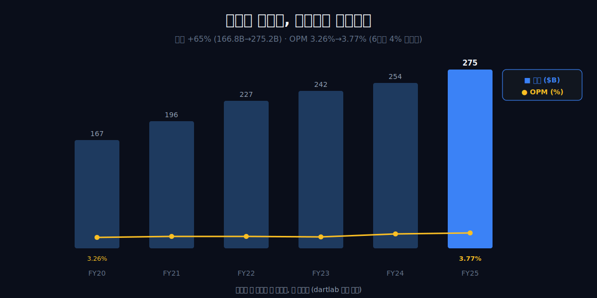
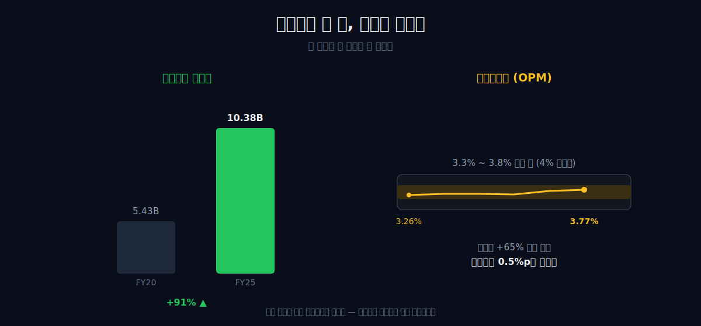
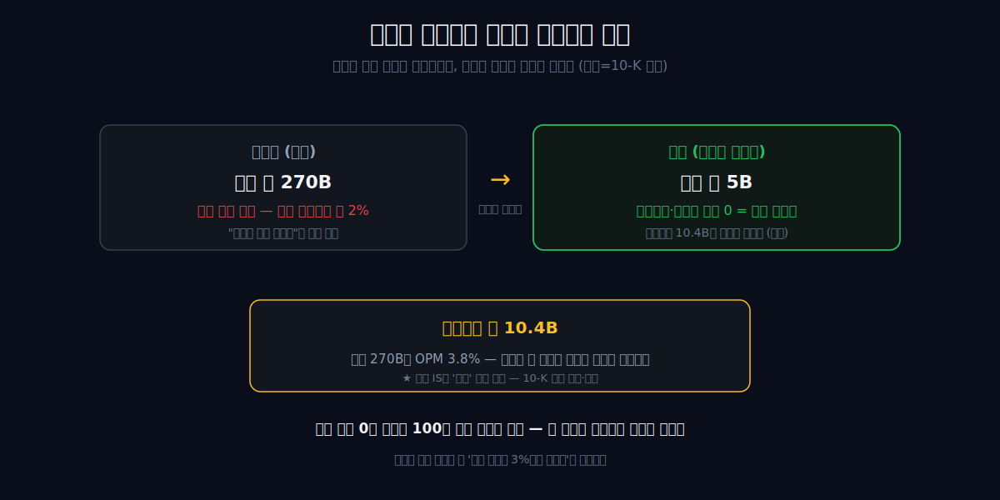
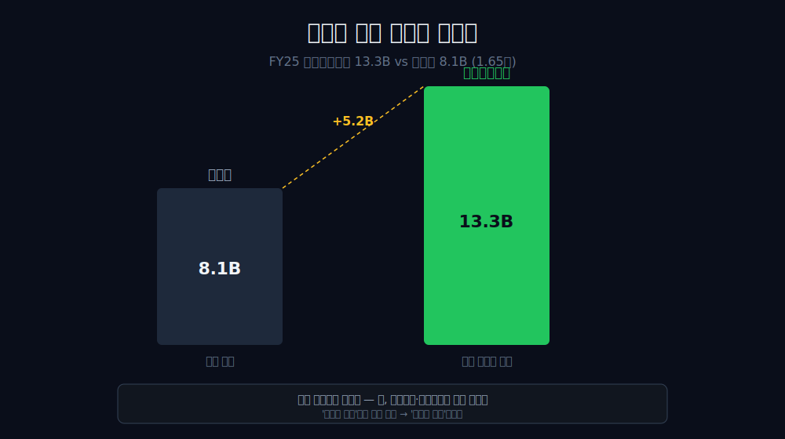
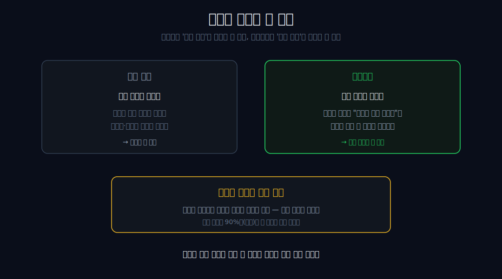
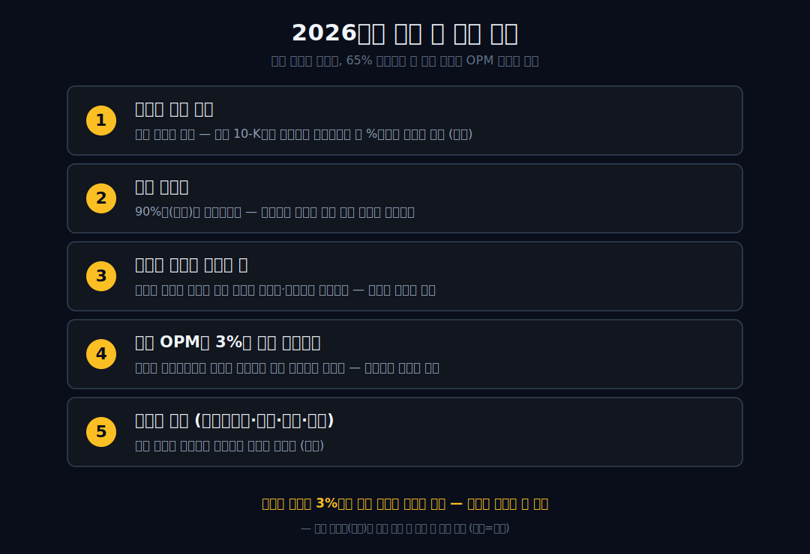

<script>
import ComboChart from '$lib/components/blog/ComboChart.svelte';
import StackBar from '$lib/components/blog/StackBar.svelte';
</script>

> **데이터 기준**: 2026-06-20 dartlab 실측 + SEC 2026Q3 10-Q 확인 — Costco(COST) **미국 연결(USD)** 기준, 분기 데이터를 회계연도(8~9월 결산)로 합산. 멤버십 회비·창고 수·갱신율은 연결 손익에 별도 라인으로 안 나오므로 SEC 10-Q/10-K 공식 공시로 분리 표기. ※대차대조표 항목은 매핑이 불안정해 인용에 주의.
>
> **핵심 숫자**: 매출 **$275.2B** · 영업이익 **$10.4B** (영업이익률 **3.8%**) · 당기순이익 **$8.1B** · 영업현금흐름 **$13.3B** · 연결 OPM FY20 **3.26%** → FY25 **3.77%** (6년간 4% 미돌파)
>
> **이 글의 용어**: 연결 OPM(영업이익률) = 영업이익÷매출 · 멤버십 회비 = 연 단위로 미리 받는 회원 입장료(연회비) · 선수령 = 현금을 먼저 받고 매출은 기간에 걸쳐 인식하는 것 · 해자(moat) = 경쟁자가 넘기 힘든 구조적 방벽 · 박리다매 = 마진을 얇게 깔고 물량으로 버는 방식.

---

## 프롤로그 — 평평한 곡선이라는 이상신호

간판은 물건 파는 회사다. 매출 **$275.2B**(약 380조 원), 미국을 대표하는 창고형 마트. 그런데 연결 재무제표를 열면 이상한 게 보인다.


매출은 FY20 **166.8**에서 FY25 **275.2**로 **65%** 불었다. 100B 넘는 매출이 더 들어왔다. 그런데 같은 기간 영업이익률은 FY20 3.26%, FY25 3.77% — **6년 내내 3%대를 못 벗어났고, 단 한 번도 4%를 넘지 않았다.**



어? 규모를 키우면 마진이 좋아진다는 유통의 상식이 여기서 정면으로 깨진다. 매출이 100B 넘게 늘어도 마진율 곡선이 한 번도 위로 꺾이지 않는다면, 이 회사는 *마진을 못 키우는 게 아니라 안 키우는 것*이다.

관통선은 하나다. **"세계적인 마트라는 간판의 회사가, 왜 매출을 65% 키우면서도 마진율을 3%대에 묶어 두는가 — 그리고 그렇게 상품 마진을 0 근처로 깎은 회사가 어떻게 영업이익 $10.4B을 내는가?"** 답을 먼저 쓴다. 코스트코는 마진을 키워 이기는 회사가 아니라, 마진을 일부러 3%대에 묶어 회원을 가두는 회사다 — 그리고 진짜 이익의 큰 줄기는 진열대가 아니라 *입구의 멤버십 연회비*에 있다(10-K 외부·가설).

---

## 1막 — 간판은 마트, 연결 재무는 '안 움직이는 마진'을 그린다

**왜 세계적인 마트의 연결 재무를 '평범한 유통 재무'로 읽으면 안 되나.** 마진율이 비정상적으로 움직이지 않기 때문이다.

```python
import dartlab
c = dartlab.Company("COST")
c.select("IS", ["매출액", "영업이익"], freq="Q")  # 분기→회계연도 합산
```

| 항목 ($B, 회계연도) | FY20 | FY21 | FY22 | FY23 | FY24 | FY25 |
|---|---:|---:|---:|---:|---:|---:|
| 매출 | 166.8 | 195.9 | 227.0 | 242.3 | 254.5 | **275.2** |
| 영업이익 | 5.43 | 6.71 | 7.79 | 8.11 | 9.29 | **10.38** |
| 연결 OPM | 3.26% | 3.42% | 3.43% | 3.35% | 3.65% | **3.77%** |

매출은 6년간 166.8에서 275.2로 **65%** 커졌다. 그런데 같은 기간 OPM은 3.26%에서 3.77%로 *0.5%p* 올랐을 뿐이다. 곡선이 거의 수평이다. 일반적인 대형 유통업체라면 매출이 이만큼 늘 때 구매력·물류 효율이 붙어 마진율이 함께 올라가는 게 보통이다. 그런데 코스트코는 마진율을 그 자리에 *고정*해 둔다.

여기서 규모(매출 1위급)를 *이익률의 증명*으로 읽지 않는다. 1차 증거는 OPM 곡선 자체이고, 그 곡선이 "이 회사는 마진을 끌어올리는 게 목적이 아니다"라고 말한다. (FY 결산이 8~9월이라 dartlab의 분기 합산을 회계연도로 라벨했다. '평평하다'는 여기까지는 *관찰*이지, 아직 '의도'는 아니다 — 그 단정은 다음 막에서 가설로만 단다.) 한국의 대형마트가 어떻게 다른 길을 갔는지는 [이마트](/blog/139480-emart)와 나란히 놓으면 더 분명해진다.

그렇다면 이 평평함은 무능인가, 설계인가?

---

## 2막 — 왜 3%대밖에 안 되나: 무능이 아니라 묶음

**왜 영업이익 절대액은 두 배가 되는데 마진율은 제자리인가.** 매출이 커진 만큼만 이익을 비례해 따라오게 두고, 상품 마진을 위로 끌어올리지 않기 때문이다.

```python
c.select("IS", ["매출액", "영업이익", "당기순이익"], freq="Q")
```

영업이익은 FY20 **5.43B**에서 FY25 **10.38B**로 **+91%**가 됐다. 절대액으로는 거의 두 배다. 그런데 같은 기간 매출은 +65% 늘었으니, 이익이 매출보다 *조금 더 빨리* 컸을 뿐 마진율 자체는 3%대 띠를 벗어나지 않았다.



이게 '못 키운다'가 아니라 '안 키운다'로 뒤집히는 멈칫 지점이다. 마진을 끌어올리는 건 사실 간단하다 — 물건값에 몇 %만 더 붙이면 된다. 코스트코는 그걸 *안 한다*. 취급 품목 수를 의도적으로 좁혀(SKU를 일반 마트의 수십분의 일로) 대량 매입 단가를 극단까지 낮추고, 그 절감분을 마진으로 챙기는 대신 *가격으로 도로 내려보낸다.* 그래서 같은 물건이 다른 곳보다 싸고, 그 '싸다'가 다음 막의 진짜 수익원을 정당화한다.

실제로 이 구조는 *플라이휠*처럼 돈다. 마진을 깎아 가격을 낮추면 → 회원이 더 많이, 더 자주 사고 → 매입 물량이 커져 단가가 더 낮아지고 → 그 절감분을 다시 가격으로 내려보낸다. 이 바퀴는 한 번 크게 돌기 시작하면 경쟁자가 쉽게 따라붙기 어렵다 — 같은 마진을 포기하려면 먼저 비슷한 매입 규모(협상력)부터 갖춰야 하는데, 그 규모는 다시 낮은 가격에서만 나오기 때문이다. 즉 '마진을 안 키운다'는 선택이 시간이 지날수록 *구조적 우위*로 굳는다. 마진율 곡선이 6년 내내 평평했다는 건, 이 바퀴가 흔들림 없이 같은 속도로 돌았다는 뜻이기도 하다.

여기서 한 가지를 분명히 해야 한다 — '상품에 14~15% 이상 안 붙인다'는 식의 구체적 가격 상한 룰은 외부 경영 일화로 널리 알려져 있지만, dartlab 연결 숫자로 증명되는 건 *비율이 안 움직인다*는 사실까지다. '일부러 안 키운다'는 의도는 가설로만 단다. 그렇다면 마진을 0 근처로 깎은 회사가 어떻게 $10.4B을 버나?

---

## 3막 — 그럼 이익 $10.4B은 어디서 오나: 입구의 회원 카드

**왜 마진이 거의 0인 회사가 100억 달러 영업이익을 내나.** 답은 진열대가 아니라 입구에 있다.

상품을 거의 원가에 흘려보내는 회사가 영업이익 **$10.4B**을 찍는다. 산수로 풀어 보면 모순이 더 또렷해진다 — 매출 $275B에 OPM 3.8%면, 그 이익의 상당 부분은 *물건을 팔아 남긴 마진*이 아니라 다른 줄기에서 와야 한다.



그 다른 줄기가 멤버십 연회비다. 회비는 매입원가도, 물류비도, 재고 부담도 거의 없는 *거의 순수익에 가까운* 줄기다. 2025 10-K 기준 코스트코의 연회비 수입은 **$5.323B**이고, 같은 해 영업이익 $10.4B의 *절반에 가깝다.* 즉 진열대에서 $270B어치 물건을 거의 원가에 팔아 회원을 모으고, 그렇게 모은 회원이 매년 내는 입장료가 이익의 큰 절반을 만든다.

산수를 한 발 더 밀어 보자. 영업이익 $10.4B에서 SEC가 공시한 회비 $5.323B를 빼면, $270B어치 상품을 팔아 남긴 영업이익은 대략 $5B 안팎이다 — 상품 사업의 영업마진이 약 **2%**라는 뜻이다(회비를 영업이익에서 단순 차감한 거친 역산이므로 정밀한 세그먼트 마진은 아니다). 일반 대형마트의 절반에도 못 미치는 이 초박리가 우연이 아니라 *설계*라는 게 이 글의 핵심 가설이다. 상품에서 거의 안 남기고, 그 '거의 안 남김'을 입장료로 정산받는 구조 — 그래서 코스트코의 손익을 '마트 손익'으로 읽으면 절반을 놓친다. 절반은 진열대(2% 박리), 절반은 입구(거의 순수익 회비)다.


★여기가 이 글의 핵심 가드다 — **dartlab 연결 손익계산서에는 '회비'라는 별도 라인이 없다.** '회비 = 영업이익 절반에 가까움'은 10-K/10-Q의 membership fee revenue를 연결 영업이익과 나란히 놓은 해석이고, 연결만으로 단정할 수 있는 건 '상품 마진을 3%대에 묶은 회사가 그래도 $10.4B을 번다'는 모순까지다. 회비가 정확히 얼마인지, 영업이익의 몇 %인지는 SEC 공시로 따로 확인해야 한다. 그래도 이 모순 자체가 화살표를 입구 쪽으로 분명히 돌린다. '길목에서 통행료를 걷는' 같은 결의 회사로는 국세청 의무 장부의 [더존비즈온](/blog/012510-douzone)이 있다 — 둘 다 *본업의 마진이 아니라 길목의 입장료*가 이익을 떠받친다.

---

## 4막 — 회비가 진짜 줄기라는 연결 단서: 현금이 이익을 앞선다

**왜 들어온 현금이 장부 순이익보다 크게 많은가.** 회비를 미리 받는 선수령 구조라면 나타날 흔적이다.

```python
c.select("CF", ["영업활동현금흐름"], freq="Q")
```

FY25 영업현금흐름은 **$13.3B**로 순이익 $8.1B를 **$5.2B**나 웃돈다(1.65배). 회비는 1년치를 *미리* 현금으로 받고, 매출은 그 1년에 걸쳐 나눠 인식한다. 그래서 현금이 장부 이익보다 먼저, 더 두껍게 들어오는 흔적이 남는다 — 회비 가설과 정합적인 그림이다.



다만 이 갭을 *'회비의 흔적'이라고 단정하면 틀린다.* 영업CF가 순이익을 웃도는 데는 선수금(회비)뿐 아니라 감가상각(코스트코는 매장·물류센터를 직접 짓고 보유한다)과 운전자본 변동도 함께 작용한다. 코스트코는 물건을 빨리 팔아치우고 공급업체에는 늦게 결제하는 구조라, 재고를 파는 현금이 매입 대금보다 먼저 들어온다. 연결만으로는 이 항목들을 분해할 수 없으므로 단일귀인은 거부한다 — 현금이 이익을 앞선다는 사실은 '회비 가설과 어긋나지 않는 단서'까지만이다. 현금 두께가 이익을 앞서는 구조를 더 본 사례로는 [포스코인터내셔널](/blog/047050-posco-international)이 있다(그쪽은 감가상각 지문).

---

## 5막 — 왜 회원이 안 떠나나: 마진을 묶은 족쇄가 곧 해자

**왜 사람들은 물건값에 더해 입장료까지 내고도 매년 갱신하나.** 마진을 스스로 0으로 묶는 행위가 손해가 아니라, 회비라는 통행료를 정당화하는 미끼이기 때문이다.

2막에서 본 '마진을 안 키운다'와 3막의 '회비가 이익'은 사실 같은 동전의 양면이다. 마진을 3%대로 묶어 *"여기서 사면 남는다"*를 매번 증명하니까, 회원은 입장료를 내고도 떠나지 않는다. 2025 10-K의 갱신율은 미국·캐나다 **92.3%**, 전세계 **89.8%**다. 낮은 마진 자체가 이탈을 막는 *해자*가 되는 구조다.




이건 보통의 해자와 방향이 반대다. 대부분의 회사는 *높은 마진*을 지키는 게 해자다. 코스트코는 *낮은 마진*을 지키는 게 해자다 — 가격이 오르는 순간 "여기서 사면 남는다"가 깨지고, 회원이 입장료를 낼 이유가 사라지기 때문이다. 그래서 이 회사는 마진을 끌어올릴 여지가 보여도 *일부러 봉인*한다. 규제나 브랜드로 진입을 막는 [KT&G](/blog/033780-ktng)식 해자와도, 간판 뒤에 다른 엔진을 숨긴 [아마존](/blog/AMZN-amazon)·[CJ제일제당](/blog/097950-cj-cheiljedang)과도 다른, *자기 마진을 인질로 잡는* 해자다.

(인물·연혁 일화 — 창업자, '14~15% 상한 룰' 같은 서사 — 는 연결 숫자로 뒷받침되지 않으므로 본문은 10-K의 갱신율과 membership fee 라인만 쓰고 즉시 3.8%로 돌아온다.)

---

## 6막 — 칼은 한 자루, 회비는 그 칼이 가리키는 각주

**그래서 있는 그대로 휘두를 수 있는 칼은 무엇인가.** '수평에 가까운 3%대 OPM' 한 자루다.

정리하면 — 간판은 거대 마트, 연결이 증명하는 건 *마진을 일부러 3%대에 묶었다*는 것까지다(매출 +65%에도 OPM 3.3%→3.8%, 4% 미돌파). '그럼 이익은 어디서 오나(=입구의 회비)', '회비가 진짜 줄기인가(=CF가 이익을 앞섬)', '왜 안 떠나나(=낮은 마진이 해자)'는 모두 이 한 숫자가 *가리키는* 가설이고 외부 각주다 — 단정이 아니라 방향이다.

이 모델의 그림자도 분명하다. OPM 3%대는 *실수가 거의 용납되지 않는* 구조다 — 매출의 1%만 비용이 더 새도 이익의 4분의 1 가까이가 날아간다. 임대료·인건비·물류비가 조금만 어긋나도, 회비가 떠받치던 이익이 흔들린다. 그래서 이 회사의 진짜 리스크는 매출 둔화보다 *운영 규율의 이완*이고, 강점(낮은 마진으로 회원을 가두는 것)과 약점(완충이 얇다는 것)이 정확히 같은 동전의 양면이다. 평평한 3%대를 6년이나 유지했다는 건, 거꾸로 말하면 그 좁은 띠를 한 번도 놓치지 않을 만큼 운영을 조였다는 뜻이다.

코스트코는 마진을 키워 이기는 회사가 아니라, 마진을 일부러 3%대에 묶어 회원을 가두는 회사다. 매출의 크기가 아니라, *매출이 65% 느는 동안 한 번도 안 꺾인 평평한 OPM 곡선*을 봐야 이 회사가 보인다. 물건을 거의 원가에 파는 게 약점이 아니라 가장 강한 무기라는 것 — 그 역설이 이 회사의 전부다. 같은 '간판 ≠ 진짜 돈줄' 계열의 거울편으로, 햄버거 간판 뒤에서 임대료를 걷는 [맥도날드](/blog/MCD-mcdonalds)를 나란히 읽으면 메커니즘의 차이가 또렷하다.

---

## 2026 Q3 업데이트 — 마진은 여전히 얇고, 회비는 더 두꺼워졌다

FY2026 3분기 12주만 떼어도 같은 구조가 반복된다. 총매출은 **$70.527B**로 전년 동기 $63.205B보다 **+11.6%** 늘었다. 이 안에는 순매출 **$69.154B**와 멤버십 회비 **$1.373B**가 같이 들어 있다. 영업이익은 **$2.815B**, 순이익은 **$2.192B**다. 총매출 기준 OPM은 **3.99%**로, 코스트코가 6년 연간 표에서 보여준 3%대 띠를 그대로 지킨다.

36주 누계로 보면 현금의 두께가 더 분명하다. 총매출은 **$207.431B**, 영업이익은 **$7.884B**, 순이익은 **$6.228B**다. 같은 기간 영업현금흐름은 **$11.133B**로 순이익의 **1.79배**이고, 설비투자는 **$4.228B**다. 매장을 계속 열고도 현금이 장부 이익을 앞서는 구조가 유지된다.

운영 면에서도 이야기는 바뀌지 않았다. 2026년 5월 10일 기준 창고 수는 **928개**이고, 회사는 3분기 중 4개를 새로 열었다. 2025 10-K의 멤버십 갱신율은 미국·캐나다 **92.3%**, 전세계 **89.8%**다. 따라서 2026년 업데이트의 결론은 단순하다. 코스트코는 아직도 매장 쪽 마진을 두껍게 만들지 않고, 낮은 가격으로 회원을 붙잡은 뒤 회비와 현금흐름으로 이익을 정산한다.

---

## 2026년에 봐야 할 다섯 가지

1. **멤버십 회비 절대액과 영업이익 대비 비중** — 진짜 엔진의 크기. 2025 회비 $5.323B, FY2026 Q3 회비 $1.373B가 다음 10-K에서 어떻게 이어지는지가 핵심이다.
2. **회원 갱신율** — 미국·캐나다 92.3%, 전세계 89.8%가 유지되는지. 갱신율이 깨지면 회비 줄기 자체가 흔들린다.
3. **연회비 인상의 빈도와 폭** — 회비를 올리면 이익이 바로 늘지만 갱신율·트래픽을 건드릴 수 있다. 인상과 이탈의 균형.
4. **연결 OPM이 3%대 띠를 지키는지** — 마진을 끌어올리려는 유혹에 굴복하는 순간 이 회사의 정체성이 바뀐다. 평평함의 유지 자체가 신호다.
5. **비상품 수익(전자상거래·주유·약국·여행 등)** — 회비 모델을 보강하는 곁가지가 어떻게 크는지(외부).



---

## 공시 / Filings

| 문서 | 기준일 | 이 글에서 확인한 항목 | 링크 |
|---|---|---|---|
| FY2026 Q3 Form 10-Q | 2026-05-10 | 12주 순매출 $69.154B, membership fee revenue $1.373B, 영업이익 $2.815B, 창고 928개 | [SEC 10-Q](https://www.sec.gov/Archives/edgar/data/909832/000090983226000051/cost-20260510.htm) |
| FY2025 Form 10-K | 2025-08-31 | membership fee revenue $5.323B, 갱신율 미국·캐나다 92.3%·전세계 89.8% | [SEC 10-K](https://www.sec.gov/Archives/edgar/data/909832/000090983225000101/cost-20250831.htm) |

---

## 재무제표 — 최근 6개 회계연도 (dartlab 연결, $B)

> 미국 연결(USD)·분기 합산(회계연도 8~9월 결산) 기준. dartlab에서 직접 확인:
> ```python
> import dartlab
> c = dartlab.Company("COST")
> c.select("IS", ["매출액","영업이익","당기순이익"], freq="Q")
> c.select("CF", ["영업활동현금흐름"], freq="Q")
> ```

<ComboChart data={[{year:"FY20",매출:167,영업이익:5.4,당기순이익:4.1},{year:"FY21",매출:196,영업이익:6.7,당기순이익:5.1},{year:"FY22",매출:227,영업이익:7.8,당기순이익:5.9},{year:"FY23",매출:242,영업이익:8.1,당기순이익:6.3},{year:"FY24",매출:254,영업이익:9.3,당기순이익:7.4},{year:"FY25",매출:275,영업이익:10.4,당기순이익:8.1}]} lineKeys={["매출"]} barKeys={["영업이익","당기순이익"]} lineColors={["#22c55e"]} barColors={["#3b82f6","#f59e0b"]} title="매출(라인) vs 영업이익·당기순이익(막대) — $B" unit="$B" />

| 항목 ($B) | FY20 | FY21 | FY22 | FY23 | FY24 | FY25 |
|---|---:|---:|---:|---:|---:|---:|
| 매출 | 166.8 | 195.9 | 227.0 | 242.3 | 254.5 | 275.2 |
| 영업이익 | 5.43 | 6.71 | 7.79 | 8.11 | 9.29 | 10.38 |
| 당기순이익 | 4.06 | 5.08 | 5.92 | 6.29 | 7.37 | 8.10 |
| 연결 OPM | 3.26% | 3.42% | 3.43% | 3.35% | 3.65% | 3.77% |
| 영업현금흐름 | 8.86 | 8.96 | 7.39 | 11.07 | 11.34 | 13.34 |

이 표를 한 줄로 읽으면 이렇다 — 매출 행은 6년간 멈춤 없이 우상향(166.8→275.2)하는데, **OPM 행은 거의 일직선**이다(3.26→3.77, 4% 미돌파). 보통 회사의 재무제표는 매출이 크면 마진율도 따라 움직이는데, 코스트코는 매출이 65% 느는 동안 마진율을 *고정*시켜 두었다. 그리고 맨 아래 영업현금흐름 행은 순이익 행보다 늘 두껍다(FY25 13.3 vs 8.1). 이 세 행의 관계 — 우상향 매출, 일직선 마진, 그보다 두꺼운 현금 — 이 곧 '마진을 묶고 입구에서 회비를 걷는' 이 글의 주제다(회비 비중은 외부).

---

## 검증표

본문 인용 수치를 dartlab 호출과 SEC 공시로 검증한다. 회비·갱신율·창고 수는 연결 손익이 아니라 SEC 10-Q/10-K에서 분리 확인한다. 📅 dartlab 실측 2026-06-20 · Costco(COST) 미국 연결(USD)·회계연도 합산 기준.

| 본문 수치 | 출처 / 호출 | 결과 |
|---|---|---|
| 매출 FY20 166.8B → FY25 275.2B (+65%) | `c.select("IS",["매출액"],freq="Q")` 합산 | ✓ 실측 |
| 영업이익 FY20 5.43B → FY25 10.38B (+91%) | `c.select("IS",["영업이익"])` | ✓ 실측 |
| 연결 OPM FY20 3.26% → FY25 3.77% (4% 미돌파) | 영업이익÷매출 | ✓ 실측 |
| 당기순이익 FY20 4.06B → FY25 8.10B | `c.select("IS",["당기순이익"])` | ✓ 실측 |
| 영업현금흐름 FY25 13.34B = 순이익 8.10B의 1.65배 | `c.select("CF",["영업활동현금흐름"])` | ✓ 실측 |
| FY2026 Q3 12주 총매출 $70.527B = 순매출 $69.154B + 회비 $1.373B | [FY2026 Q3 10-Q](https://www.sec.gov/Archives/edgar/data/909832/000090983226000051/cost-20260510.htm) | ✓ SEC |
| FY2026 Q3 영업이익 $2.815B, 순이익 $2.192B, OPM 3.99% | [FY2026 Q3 10-Q](https://www.sec.gov/Archives/edgar/data/909832/000090983226000051/cost-20260510.htm) | ✓ SEC |
| FY2026 36주 영업현금흐름 $11.133B, 설비투자 $4.228B | [FY2026 Q3 10-Q](https://www.sec.gov/Archives/edgar/data/909832/000090983226000051/cost-20260510.htm) | ✓ SEC |
| 2026-05-10 기준 창고 928개 | [FY2026 Q3 10-Q](https://www.sec.gov/Archives/edgar/data/909832/000090983226000051/cost-20260510.htm) | ✓ SEC |
| FY2025 회비 $5.323B, 갱신율 미국·캐나다 92.3%·전세계 89.8% | [FY2025 10-K](https://www.sec.gov/Archives/edgar/data/909832/000090983225000101/cost-20250831.htm) | ✓ SEC |
| 회비는 dartlab 연결 손익에 별도 라인 없음 | dartlab 연결 IS 한계 | 방법론 |
| BS(대차대조표) 매핑 불안정 — 인용 주의 | dartlab 데이터 한계 | 주의/제외 |

본문의 숫자 중 이 표에 없는 것은 발행 차단 대상이다. 멤버십 회비의 절대액·비중·갱신율은 dartlab 연결로 증명되지 않으며 SEC 공시 라인과 연결 영업이익을 분리해 읽는다.
