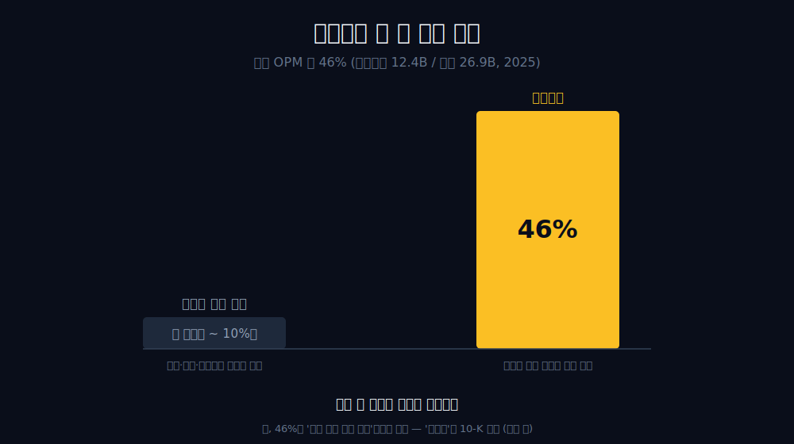
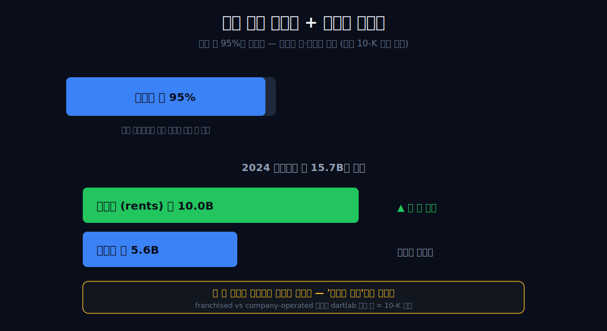
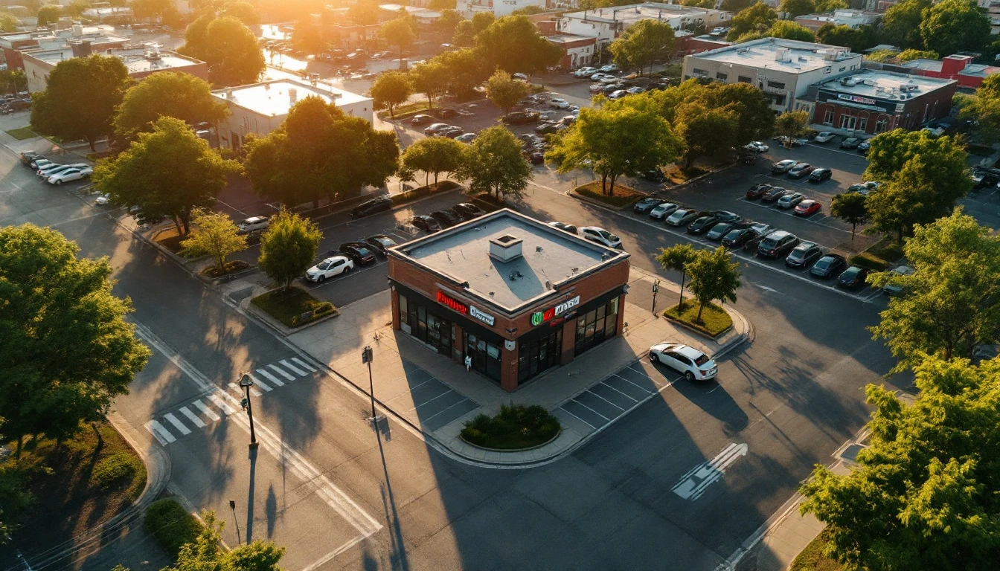
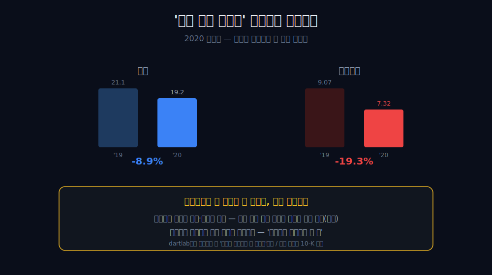
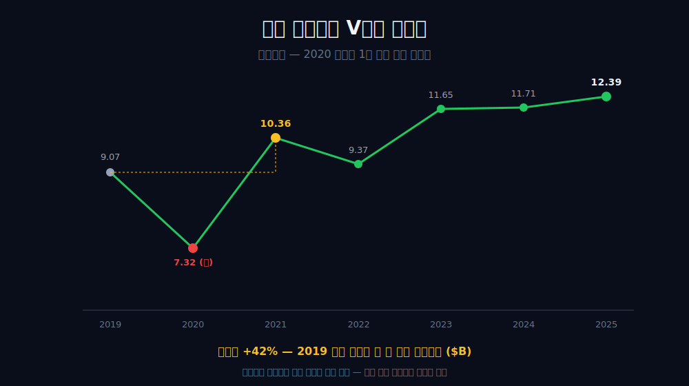
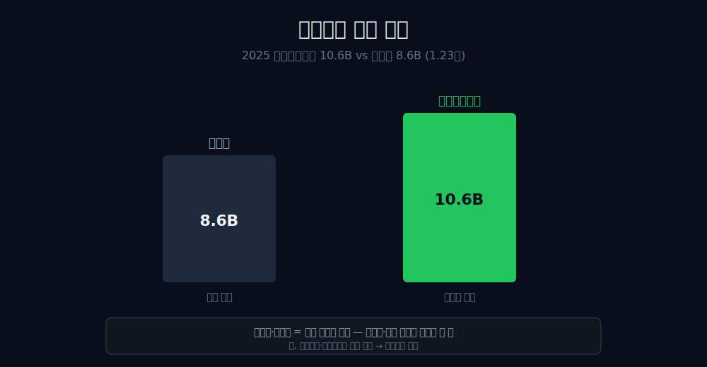
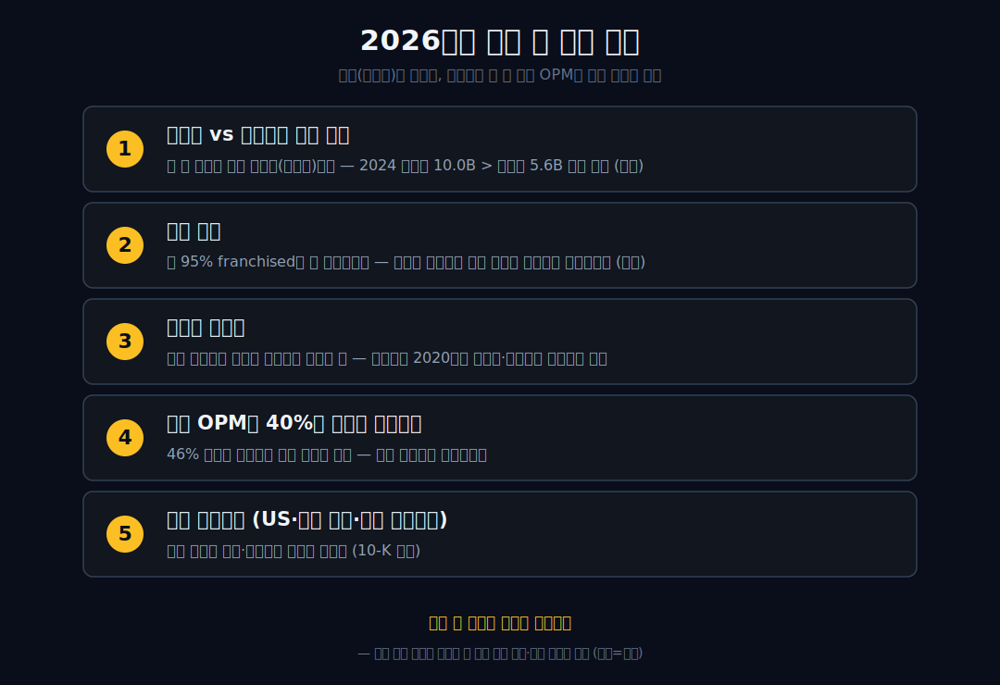

<script>
import ComboChart from '$lib/components/blog/ComboChart.svelte';
import StackBar from '$lib/components/blog/StackBar.svelte';
</script>

> **데이터 기준**: 2026-06-20 dartlab 실측 + McDonald's FY2025 Form 10-K + Q1 2026 Form 10-Q — McDonald's(MCD) **미국 연결(USD)** 기준, 분기 데이터를 연간으로 합산. 가맹 비중·임대료/로열티 분해·부동산 포트폴리오는 연결 손익에 별도로 안 나오므로 **10-K·10-Q 공식 공시 보강**으로 표기. ※대차대조표 항목은 매핑이 불안정해 인용에 주의.
>
> **핵심 숫자**: 매출 **$26.9B** · 영업이익 **$12.4B** (영업이익률 **약 46%**) · 당기순이익 **$8.6B** · 영업현금흐름 **$10.6B** · 연결 OPM 2019 **43.0%** → 2025 **46.1%** (2020 코로나 38.1% 골)
>
> **이 글의 용어**: 연결 OPM(영업이익률) = 영업이익÷매출 · 가맹(franchised) = 본사가 아닌 점주가 운영하는 매장 · 직영(company-operated) = 본사가 직접 운영하는 매장 · 로열티 = 브랜드·시스템 사용료(매출의 일정 %) · 임대료(rents) = 본사가 소유·임차한 점포를 가맹점에 빌려주고 받는 돈.

---

## 프롤로그 — 메뉴판엔 빅맥, 손익엔 식당이 없다

간판은 햄버거다. 빅맥, 감자튀김, 드라이브스루. 그런데 연결 손익계산서를 열면 식당이 보이지 않는다.


2025년 이 회사의 매출은 **$26.9B**, 영업이익은 **$12.4B**. 영업이익률 **약 46%**다. 패티를 굽고 감자를 튀겨 파는 회사가 낼 수 있는 숫자가 아니다. 외식업의 영업이익률은 잘해야 한 자릿수, 아주 잘 굴러가도 10%대다. 46%는 다른 종류의 사업에서 나오는 숫자다.



어? 햄버거 회사 손익이 왜 식당처럼 안 생겼나. 관통선은 하나다. **"간판은 햄버거인데, 진짜 업(業)은 무엇이고, 왜 그 정체는 연결 손익 한 줄에 안 보이는가?"** 답을 먼저 쓴다 — 맥도날드의 진짜 업은 가맹점 자리의 땅·건물을 쥐고 임대료와 매출 일정 %를 걷는 *임대인 겸 로열티 징수자*다. 높은 건 음식이 아니라 임대료다(가맹·임대 분해는 10-K 외부). 단, 연결 숫자가 단독으로 증명하는 건 '식당 직영 마진이 아니다'까지이고, '부동산 회사'로 좁히는 건 그다음 막의 외부 인용이 와야 한다.

---

## 1막 — 간판과 손익의 배반

**왜 햄버거 회사의 연결 재무를 '외식 회사 재무'로 읽으면 안 되나.** 마진율이 외식업의 범위를 한참 벗어나기 때문이다.

```python
import dartlab
c = dartlab.Company("MCD")
c.select("IS", ["매출액", "영업이익"], freq="Q")  # 분기→연간 합산
```

| 항목 ($B, 연간) | 2019 | 2021 | 2023 | 2024 | 2025 |
|---|---:|---:|---:|---:|---:|
| 매출 | 21.08 | 23.22 | 25.49 | 25.92 | **26.89** |
| 영업이익 | 9.07 | 10.36 | 11.65 | 11.71 | **12.39** |
| 연결 OPM | 43.0% | 44.6% | 45.7% | 45.2% | **46.1%** |

영업이익률이 6년 내내 40%대다. 패티를 굽는 한 자릿수 마진 사업이 어떻게 이 자리에 있나. 답은 간단하다 — 본사 손익에 잡히는 큰 덩어리가 햄버거 매출이 아니기 때문이다. 직영 식당의 매출원가(고기·기름·인건비)는 본사 연결 손익에 거의 안 잡히고, 들어오는 건 주로 가맹점에서 걷는 임대료와 로열티다.

왜 이 구조가 손익의 *모양*을 바꾸나. 직영 식당이라면 햄버거 매출 전액이 본사 매출로 잡히고 그만큼 고기·기름·인건비가 원가로 빠져 마진이 한 자릿수가 된다. 그런데 가맹점이 깐 자리에서는 본사 손익에 매출의 *전액*이 아니라 임대료·로열티라는 *얇고 마진 높은 일부*만 들어온다. 그래서 같은 햄버거 제국이라도 본사 손익은 식당이 아니라 임대 장부의 모양을 띤다 — 매출은 작아 보여도 그 작은 매출의 대부분이 이익으로 떨어진다(분해는 외부).

여기서 범위를 명시해야 한다 — 이 46%는 dartlab 연결 실측이지만, *그 자체*는 '부동산 회사'를 증명하지 않는다. '식당 직영 마진이 아니다'까지만 증명한다. 직영 매출원가가 본사 장부에 거의 안 잡히는 *가맹 모델*만으로도 이 숫자는 설명된다. '임대인'으로 좁히려면 가맹·임대료 분해가 필요하고, 그건 다음 막의 10-K(외부)다. 마진을 일부러 3%대에 *묶는* [코스트코](/blog/COST-costco)와는 정반대 방향의 회사다 — 코스트코는 마진을 봉인하고, 맥도날드는 마진이 외식업을 한참 벗어난다.

---

## 2막 — 진짜 업의 정체: 임대인과 로열티 징수자

**그 46%는 어디서 오나.** 본사가 음식을 팔아 번 게 아니라, 가맹점이 깐 자리 위에서 임대료와 로열티로 걷힌 돈이다.

본사 매장의 약 **95%가 가맹점**이다(10-K 외부). 본사는 그 점포의 땅·건물을 직접 쥐고, 가맹점에 (ㄱ) 임대료와 (ㄴ) 매출 일정 %의 로열티를 걷는다. 결정적인 건 둘의 크기 순서다 — 2024년 가맹수익 약 **$15.7B** 중 임대료(rents)가 약 **$10.0B**으로 로열티(royalties) 약 **$5.6B**을 앞선다(10-K 외부). 즉 더 큰 다리가 브랜드 수수료가 아니라 *부동산*이다.





이 분해는 전부 dartlab 검증 재무 *밖*이다 — 연결 IS는 'franchised vs company-operated'를 직접 보여주지 못한다. 그래서 가맹 비중도, 임대료/로열티 분해도 10-K 외부 인용으로만 표기한다.

여기서 한 가지 함정을 짚자 — 가맹점 카운터에서 팔리는 전체 매출(시스템와이드 매출)은 본사 연결 매출($26.9B)보다 훨씬 크다. 손님이 빅맥을 사며 내는 돈의 대부분은 가맹점 장부에 잡히고, 본사 손익에 들어오는 건 그 거대한 시스템 매출이 아니라 거기서 걷는 임대료·로열티뿐이다. 그래서 '맥도날드 매출이 26.9B밖에 안 되네'라고 읽으면 절반만 본 것이다 — 본사는 일부러 *작은 매출에 높은 마진*을 취하는 자리에 서 있다. 식당의 매출원가·인건비·재고 리스크는 가맹점이 지고, 본사는 그 위에서 가장 마진 높은 층(임대료·로열티)만 떼어 간다(시스템와이드 수치는 외부). '부동산 회사'는 유명한 프레이밍이되 회사 공식 표현은 아니므로, 사실(가맹 비중·임대료가 로열티보다 큼)까지만 쓰고 별칭으로 단정하지 않는다. 본업의 마진이 아니라 *길목의 통행료*로 버는 결이라는 점에서, 국세청 의무 장부를 쥔 [더존비즈온](/blog/012510-douzone), 입구의 회비를 걷는 [코스트코](/blog/COST-costco)와 같은 계열이다 — 다만 맥도날드의 통행료는 *땅*이다.

---

## 3막 — 2020, 자연실험이 알려준 진짜 교훈

**왜 매출이 9% 빠질 때 영업이익은 *더* 빠졌나.** 흔한 '임대인은 불황에 안 흔들린다'는 클리셰를 데이터가 거부한다.

```python
c.select("IS", ["매출액", "영업이익", "당기순이익"], freq="Q")
```

| 항목 ($B) | 2019 | 2020 | 변화 |
|---|---:|---:|---:|
| 매출 | 21.08 | 19.21 | **-8.9%** |
| 영업이익 | 9.07 | 7.32 | **-19.3%** |
| 당기순이익 | 6.03 | 4.73 | **-21.6%** |

2019→2020년 매장이 멈추자 매출은 -8.9% 빠졌는데, 영업이익은 -19.3%로 *두 배 넘게* 빠졌다. 순이익은 -21.6%. '임대료 계약이 살아있어 이익이 버텼다'는 서사는 여기서 깨진다 — 적어도 연결 숫자로는, 2020년의 맥도날드는 *이익이 매출보다 더 크게* 출렁였다.



왜 그랬나? 임대인이라서 *덜* 흔들린 게 아니라, 임대인이라서 세입자를 살리려 *먼저* 양보했기 때문이다(외부/10-K). 팬데믹 동안 본사는 가맹점에 임대료 납부를 유예하고 로열티를 감면했다. 가장 마진 높은 수익(임대료·로열티)이 바로 본사가 의도적으로 깎아 준 부분이다 — 가맹점이 무너지면 임대 수입 줄기 자체가 끊기니까. 길목을 지키려 단기 이익을 내준 셈이다. (이 감면 해석은 10-K·외부이고, dartlab 연결로 증명되는 건 '2020년 이익이 매출보다 더 빠졌다'는 사실까지다.)

그래서 2020년은 '임대인은 안 흔들린다'가 아니라 *'임대인과 세입자는 한 배'*라는 걸 보여주는 자연실험이다. 진짜 회복력은 그 다음 해에 나온다.

---

## 4막 — V자 회복: 한 해 만에 사상 최고 이익

**무엇이 2020 골을 1년 만에 사상 최고로 되돌렸나.** 세입자가 살아남자 임대 줄기가 즉시 복원됐기 때문이다.

2021년 영업이익은 **$10.36B** — 코로나 직전 2019년의 $9.07B을 넘어선 *사상 최고*다. 매출은 2019 대비 +10%(21.08→23.22)에 그쳤는데 영업이익은 +14%로 더 컸다. 2020년 골($7.32B)에서 보면 1년 만에 **+42%** 튀어 오른 것이다.




세입자(가맹점)가 살아남자 임대료·로열티 줄기가 즉시 복원됐고, 본사는 직영 식당의 변동비·재고 부담을 지지 않으니 매출이 정상으로 돌아오는 속도보다 이익이 빠르게 회복됐다. 진짜 회복력은 '안 빠지는 것'이 아니라 *'빠진 뒤 빠르게, 더 높이 돌아오는 것'*이었고, 그건 마진 구조(임대인) 위에서만 가능하다. 이후 OPM은 2023년 45.7%, 2025년 46.1%로 다시 40%대 중반에 안착했다 — 같은 +27% 매출 성장이라도, 한 자릿수 마진 식당의 성장과 임대인의 성장은 떨어지는 이익의 무게가 다르다. 간판 뒤에 다른 엔진을 숨긴 [아마존](/blog/AMZN-amazon)·[CJ제일제당](/blog/097950-cj-cheiljedang)처럼, 맥도날드도 *간판(햄버거)과 엔진(임대)이 따로* 움직인다.

---

## 5막 — 임대인의 현금 기계

**왜 이익만큼 현금이 또박또박 들어오나.** 임대료·로열티는 회수가 안정적인 계약성 현금이기 때문이다.

```python
c.select("CF", ["영업활동현금흐름"], freq="Q")
```

2025년 영업현금흐름은 **$10.6B**로 순이익 $8.6B를 웃돈다(1.23배). 임대료와 로열티는 매달 계약에 따라 들어오는 *예측 가능한* 현금이라, 식당 운영의 변동 비용·재고 부담을 본사가 지지 않는 만큼 현금흐름이 두텁고 안정적이다.



다만 이 갭을 한 가지 원인으로 단정하진 않는다 — 영업CF가 순이익을 웃도는 데는 계약성 현금의 안정성뿐 아니라 감가상각(본사가 보유한 부동산·건물), 운전자본 변동도 함께 작용한다. 연결만으로는 이 항목들을 분해할 수 없으므로, '계약성 현금'이라는 성격 규정은 사업 모델 설명(외부)이고 dartlab CF가 직접 라벨하는 건 '현금이 이익을 안정적으로 앞선다'는 사실까지다. (영업CF 수치는 dartlab 2025 SSOT만 쓰고, 연도·정의가 다른 외부 집계와 섞지 않는다.)

---

## 6막 — 거부할 클리셰, 그리고 한 줄의 컬러

**'글로벌 외식 1위라 마진이 높다'가 왜 틀렸나.** 규모는 마진을 한 자릿수에서 46%로 끌어올리지 못하기 때문이다.

1위 외식 체인이라도 직영이면 마진은 한 자릿수다. 규모가 마진을 만드는 게 아니라, *업의 종류*(임대)가 다른 것이다.

이 모델의 그림자도 분명하다 — 본사 고마진의 전제는 *가맹점이 버티는 것*이다. 2020년이 보여줬듯, 세입자가 흔들리면 임대인은 임대료·로열티를 깎아 줄 수밖에 없다(외부). 즉 이 회사의 진짜 리스크는 본사 손익 한 줄이 아니라, 그 한 줄을 떠받치는 *수만 개 가맹점의 수익성*에 분산돼 있다. 강점(식당 운영의 비용·리스크를 가맹점에 떠넘긴 구조)과 약점(그 가맹의 건강에 이익이 매여 있다는 것)이 정확히 같은 동전의 양면이다. 본사가 46%를 누리는 동안 그 46%를 떠받치는 건 카운터에서 패티를 굽는 점주들이라는 사실은, 이 모델을 읽을 때 늘 같이 봐야 한다. 정리하면 — 간판은 햄버거, 연결이 증명하는 건 '식당 직영 마진이 아니다'(OPM 약 46%)까지다. 그 정체가 '가맹 95% + 임대료>로열티의 임대인'이라는 건 10-K(외부)에서 확정되고, 2020년은 그 임대인조차 세입자와 한 배라는 걸, 2021년의 V자 회복은 그래도 마진 구조 위에서 더 높이 돌아온다는 걸 보여준다.

높은 건 음식이 아니라 임대료다 — 그 한 문장이 이 회사가 외식 회사가 아니라는 가장 짧은 증명이고, 답은 연결 손익계산서가 아니라 그 뒤에 숨은 가맹·임대 구조에 있다. (컬러: 1955년 창업기에 '부동산이 수익이기 전에 가맹점을 묶는 *목줄*이었다'는 유명한 해석이 있지만, 그 동기는 제시 재무로 관찰할 수 없으므로 일화로만 곁들인다 — 상관(높은 OPM)을 의도(통제 설계)의 증거로 봉합하지 않는다.) 규제로 길목을 막는 [KT&G](/blog/033780-ktng)식 해자와도 결이 다른, *땅으로 길목을 쥔* 해자다.

---

## 2026년에 봐야 할 다섯 가지

1. **임대료 vs 로열티의 크기 순서** — 더 큰 다리가 계속 부동산(임대료)인지. 2024년 임대료 10.0B > 로열티 5.6B의 격차가 유지·확대되는지(10-K 외부).
2. **가맹 비중** — 약 95% franchised가 더 올라가는지. 직영을 줄일수록 본사 손익은 임대인에 가까워진다(외부).
3. **가맹점 수익성** — 본사 고마진의 전제는 가맹점이 버티는 것. 가맹점이 어려우면 2020처럼 본사가 임대료·로열티를 양보해야 한다.
4. **연결 OPM이 40%대 중반을 지키는지** — 46% 안착이 흔들리면 모델 자체의 신호다.
5. **지역 세그먼트(US/국제 운영시장/국제 라이선스)** — 어느 지역의 임대·로열티가 성장을 끄는지(10-K 외부).



---

## 재무제표 — 최근 7개년 (dartlab 연결, $B)

> 미국 연결(USD)·분기 합산 기준. dartlab에서 직접 확인:
> ```python
> import dartlab
> c = dartlab.Company("MCD")
> c.select("IS", ["매출액","영업이익","당기순이익"], freq="Q")
> c.select("CF", ["영업활동현금흐름"], freq="Q")
> ```

<ComboChart data={[{year:"2019",매출:21.1,영업이익:9.1,당기순이익:6.0},{year:"2020",매출:19.2,영업이익:7.3,당기순이익:4.7},{year:"2021",매출:23.2,영업이익:10.4,당기순이익:7.5},{year:"2022",매출:23.2,영업이익:9.4,당기순이익:6.2},{year:"2023",매출:25.5,영업이익:11.7,당기순이익:8.5},{year:"2024",매출:25.9,영업이익:11.7,당기순이익:8.2},{year:"2025",매출:26.9,영업이익:12.4,당기순이익:8.6}]} lineKeys={["매출"]} barKeys={["영업이익","당기순이익"]} lineColors={["#22c55e"]} barColors={["#3b82f6","#f59e0b"]} title="매출(라인) vs 영업이익·당기순이익(막대) — $B" unit="$B" />

| 항목 ($B) | 2019 | 2020 | 2021 | 2022 | 2023 | 2024 | 2025 |
|---|---:|---:|---:|---:|---:|---:|---:|
| 매출 | 21.08 | 19.21 | 23.22 | 23.18 | 25.49 | 25.92 | 26.89 |
| 영업이익 | 9.07 | 7.32 | 10.36 | 9.37 | 11.65 | 11.71 | 12.39 |
| 당기순이익 | 6.03 | 4.73 | 7.55 | 6.18 | 8.47 | 8.22 | 8.56 |
| 연결 OPM | 43.0% | 38.1% | 44.6% | 40.4% | 45.7% | 45.2% | 46.1% |
| 영업현금흐름 | 8.12 | 6.27 | 9.14 | 7.39 | 9.61 | 9.45 | 10.55 |

이 표를 한 줄로 읽으면 이렇다 — 매출 행은 2020년 골을 빼면 완만한 우상향이지만, 진짜 이야기는 **OPM 행**에 있다. 외식업이라면 불가능한 40%대가 6년 내내 유지된다(2020 코로나 38.1% 골은 예외). 그리고 2020→2021 영업이익 행을 보면 7.32에서 10.36으로 *골에서 사상 최고로* 한 해 만에 튀어 오른다. 매출 행만 따라 읽으면 평범한 외식 성장이지만, OPM 행과 2020~2021 영업이익의 V자를 겹쳐 보면 이건 식당이 아니라 임대인의 손익이라는 게 드러난다(가맹·임대 분해는 외부).

---

## 검증표

본문 인용 수치를 dartlab 호출과 결과로 검증한다. 공시 보강 항목(10-K·10-Q 가맹·임대료/로열티)은 분리 표기. 📅 dartlab 실측 2026-06-20 · McDonald's(MCD) 미국 연결(USD)·분기 합산 기준.

| 본문 수치 | 출처 / 호출 | 결과 |
|---|---|---|
| 매출 26.9B · 영업이익 12.4B · OPM 약 46% (2025) | `c.select("IS",["매출액","영업이익"],freq="Q")` | ✓ 실측 |
| 연결 OPM 2019 43.0% → 2025 46.1% (40%대 유지) | 영업이익÷매출 | ✓ 실측 |
| 2020 매출 -8.9% vs 영업이익 -19.3% (이익이 더 빠짐) | `c.select("IS",[...])` 2019→2020 | ✓ 실측 |
| 2021 영업이익 10.36B = 사상 최고(2019 9.07B 상회), 골 대비 +42% | `c.select("IS",["영업이익"])` | ✓ 실측 |
| 영업현금흐름 2025 10.55B = 순이익 8.56B의 1.23배 | `c.select("CF",["영업활동현금흐름"])` | ✓ 실측 |
| 매장 약 95% franchised: 2025년 43,317 / 45,356개 = 95.5% | [McDonald's FY2025 Form 10-K](https://www.sec.gov/Archives/edgar/data/63908/000006390826000035/mcd-20251231.htm) | 공식 공시 |
| 2025 가맹수익 16.548B 중 임대료 10.442B > 로열티 6.018B | [McDonald's FY2025 Form 10-K](https://www.sec.gov/Archives/edgar/data/63908/000006390826000035/mcd-20251231.htm) | 공식 공시 |
| Q1 2026 가맹수익 4.007B 중 임대료 2.505B > 로열티 1.483B | [McDonald's 2026 Q1 Form 10-Q](https://www.sec.gov/Archives/edgar/data/63908/000006390826000051/mcd-20260331.htm) | 공식 공시 |
| Q1 2026 총매출 6.517B / 영업이익 2.953B / 순이익 1.983B | [McDonald's 2026 Q1 Form 10-Q](https://www.sec.gov/Archives/edgar/data/63908/000006390826000051/mcd-20260331.htm) | 공식 공시 |
| Q1 2026 매장 45,699개 중 franchised 43,672개 = 95.6% | [McDonald's 2026 Q1 Form 10-Q](https://www.sec.gov/Archives/edgar/data/63908/000006390826000051/mcd-20260331.htm) | 공식 공시 |
| 2020 가맹점 임대료 유예·로열티 감면 | [McDonald's FY2020 Form 10-K](https://www.sec.gov/Archives/edgar/data/63908/000006390821000013/mcd-20201231.htm) | 공식 공시 |
| 가맹 모델 구조(franchising): rent and royalties based on sales, minimum rent payments | [McDonald's FY2025 Form 10-K](https://www.sec.gov/Archives/edgar/data/63908/000006390826000035/mcd-20251231.htm) | 공식 공시 |
| 1955 '부동산=목줄' 통제 가설 | 일화/해석 (관찰 불가 동기) | 컬러/주의 |
| BS(대차대조표) 매핑 불안정 — 인용 주의 | dartlab 데이터 한계 | 주의/제외 |

본문의 숫자 중 이 표에 없는 것은 발행 차단 대상이다. 가맹 비중·임대료/로열티 분해·부동산 포트폴리오는 dartlab 연결로 증명되지 않으며 10-K·10-Q 공식 공시 보강 항목임을 명시한다.
