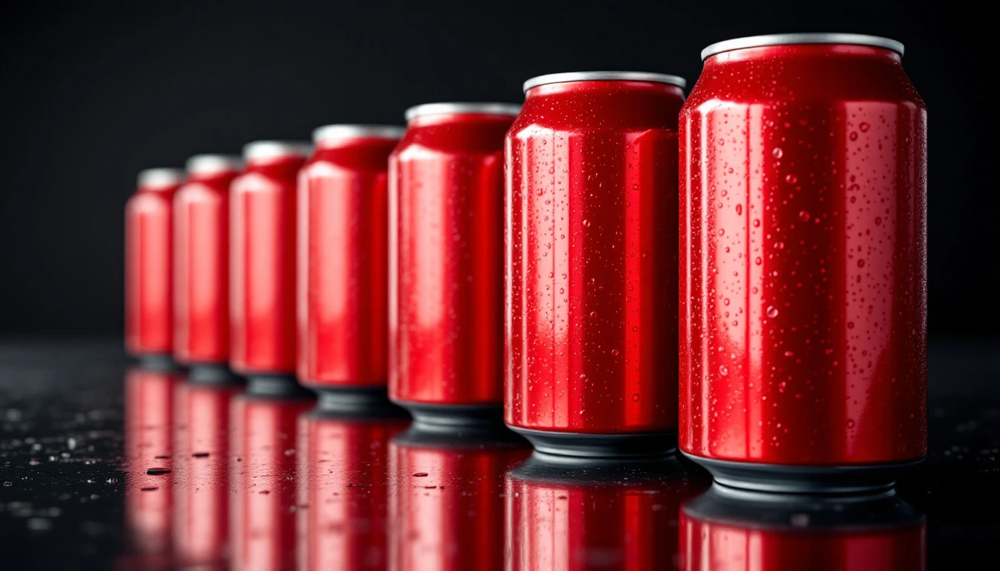
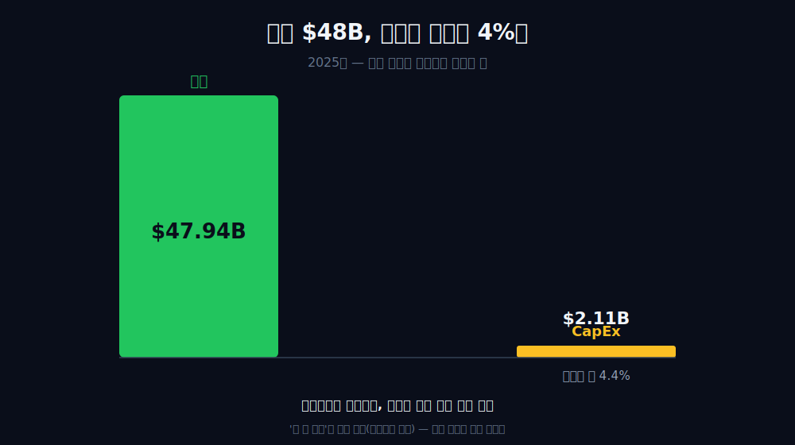
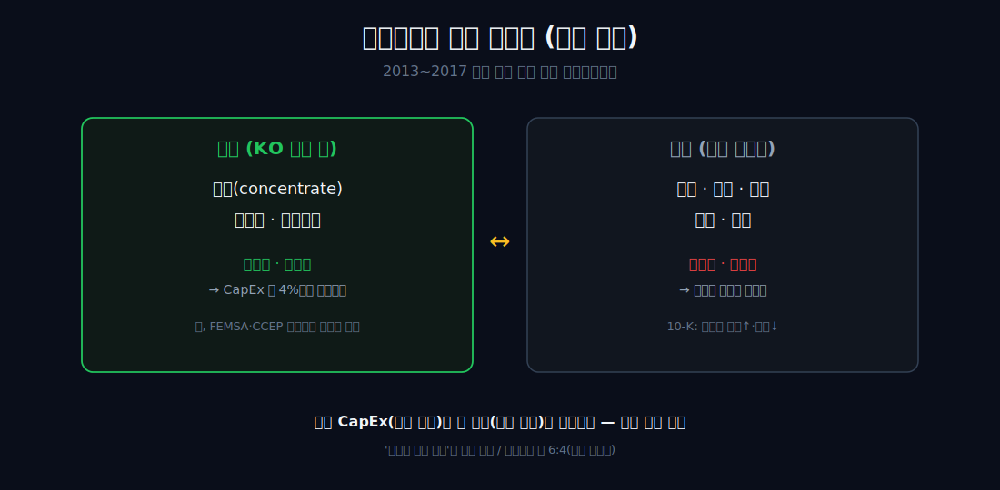
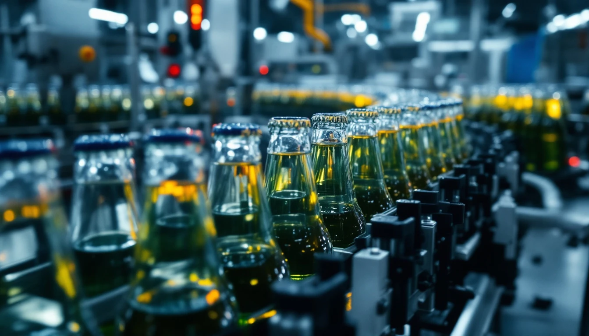
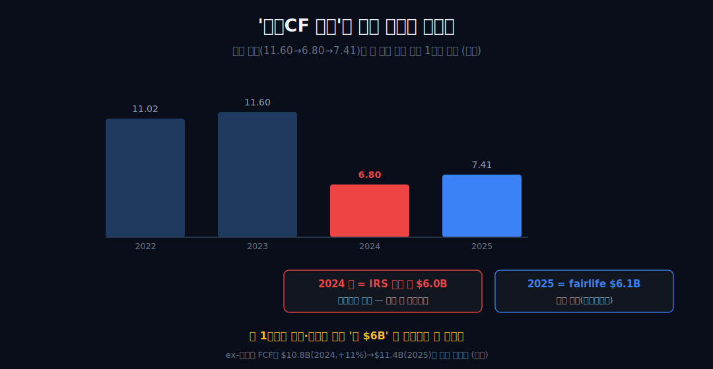
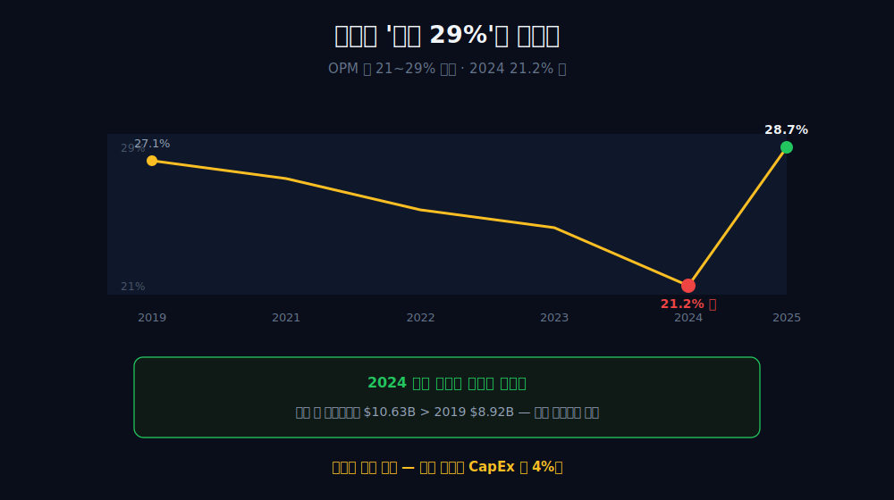
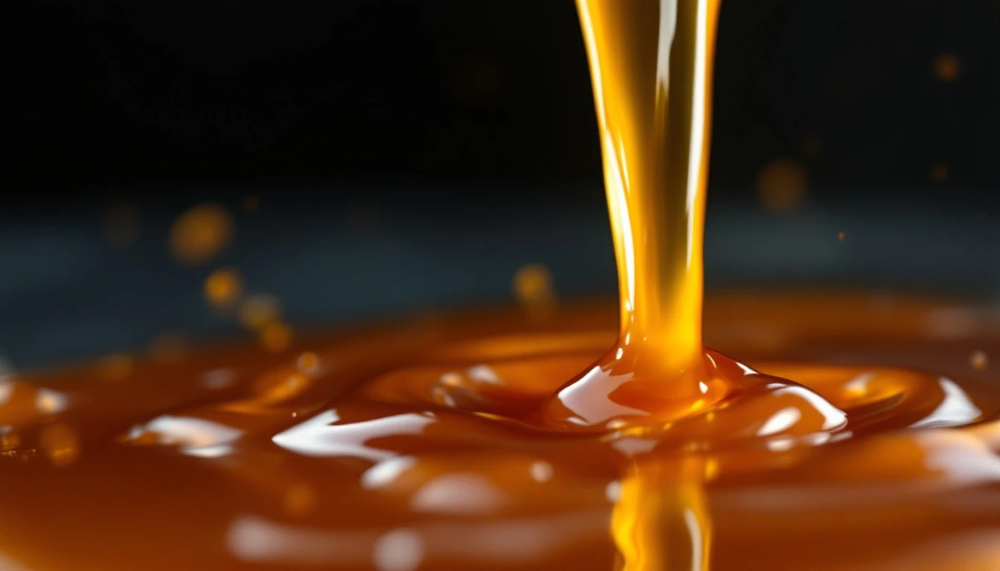
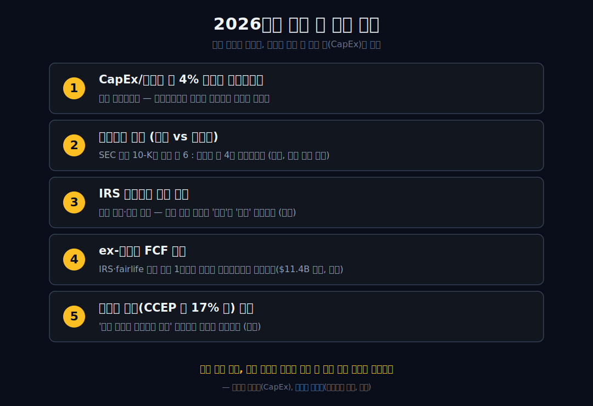

<script>
import ComboChart from '$lib/components/blog/ComboChart.svelte';
import StackBar from '$lib/components/blog/StackBar.svelte';
</script>

> **데이터 기준**: 2026-06-19 dartlab 실측 — Coca-Cola(KO) **미국 연결(USD)** 기준, 분기 데이터를 연간으로 합산. 원액 vs 완제품 비중·재프랜차이즈 역사·병입사 지분·IRS/fairlife 현금 항목은 연결 손익에 안 나오므로 **2025 Form 10-K·IR(외부 인용)**로 표기. 최신 분기(2026년 1분기)는 방향 확인용으로만 사용하고, 본문 재무표는 2025년 연간을 닻으로 둔다. ※대차대조표 항목은 매핑이 불안정해 인용에 주의.
>
> **핵심 숫자**: 매출 **$47.94B** · 영업이익 **$13.76B** (OPM **28.7%**) · 당기순이익 **$13.11B** · **CapEx $2.11B (매출의 약 4.4%)** · 영업현금흐름 **$7.41B**
>
> **이 글의 용어**: CapEx(유형자산 취득) = 공장·설비·트럭에 쓴 투자 · 자본집약도 = CapEx÷매출 · 원액(concentrate) = 음료의 농축 원액(고마진) · 완제품(finished product) = 병입·완성된 음료(저마진) · 재프랜차이즈(refranchising) = 본사가 직영하던 병입사업을 독립 파트너에 넘기는 것 · 닻 = 외부 자료 없이 연결 숫자가 단독으로 입증하는 사실.

---

## 프롤로그 — 공장이 안 보이는 음료 회사

코카콜라를 떠올리면 빨간 캔과 거대한 공장, 전 세계를 도는 배송 트럭이 그려진다. 그런데 KO의 연결 재무제표를 펼치면 정반대 그림이 나온다.



2025년 매출 **$47.94B**(약 660조 원)를 벌면서, 유형자산 취득(CapEx)에 쓴 돈은 **$2.11B** — 매출의 약 **4.4%**다. 매출 $48B짜리 제조업처럼 보이는 회사가, 자본은 거의 깔지 않고 번다.



어? 음료를 대량으로 만들고, 냉장하고, 트럭으로 실어 나르는 회사라면 공장·설비에 돈이 훨씬 더 들어가야 정상이다. 이 한 줄이 이 회사의 진짜 정체로 가는 입구다.

관통선은 하나다. **"세계 1위 음료 브랜드라는 간판의 회사가, 왜 매출 $48B를 벌면서 공장에는 매출의 4%만 까는가 — 그 적은 자본으로 어떻게 버는가?"** 답을 먼저, 그리고 *위계를 지켜* 쓴다. 연결 숫자가 단독으로 말하는 *사실*은 '자본집약도가 매우 낮다'는 것까지(=닻). 그 *이유*('원액만 남기고 공장·트럭은 외부화했다')는 10-K 외부 인용으로만 보강한다 — 둘은 층이 다르다.

---

## 1막 — 닻: 매출 $48B인데 CapEx는 매출의 약 4%

**왜 이 한 숫자에서 출발하나.** 외부 자료에 기대지 않고 KO가 스스로 토해낸 사실이기 때문이다.

```python
import dartlab
c = dartlab.Company("KO")
c.select("IS", ["매출액"], freq="Q")       # 분기→연간 합산
c.select("CF", ["유형자산의취득"], freq="Q")  # CapEx
```

| 항목 ($B, 연간) | 2020 | 2022 | 2023 | 2024 | 2025 |
|---|---:|---:|---:|---:|---:|
| 매출 | 33.01 | 43.00 | 45.75 | 47.06 | **47.94** |
| CapEx(유형자산 취득) | 1.18 | 1.48 | 1.85 | 2.06 | **2.11** |
| CapEx/매출 | 3.6% | 3.4% | 4.0% | 4.4% | **4.4%** |

CapEx/매출 비율은 6년 내내 **약 4% 안팎**(3%대 중반~4%대)에 머문다. 정직하게 짚자 — 절대액은 2020년 $1.18B에서 2025년 $2.11B로 약 1.8배 *늘었다*. 그러니 '안 변했다'가 아니라 *'매출 대비 비율이 4% 안팎으로 유지됐다'*가 정확하다.

여기까지 연결 숫자가 단독으로 말하는 것은 딱 하나 — **자본집약도가 낮다**는 사실 진술뿐이다. 이걸 '자산경량 라이선서 구조'라고 *명명*하는 순간 외부 사실이 필요해진다.

왜 하필 CapEx에 닻을 내리나. 마진은 가격·믹스·일회성에 흔들리고 매출은 환율에 출렁이지만, *'공장에 얼마를 깔았나'*는 회사가 실제로 무엇을 소유하고 운영하는지를 가장 적게 가공된 형태로 보여주기 때문이다. 매출 대비 약 4%라는 숫자는 '이 회사가 무거운 설비를 본체에 두지 않는다'는 사실을, 어떤 해석을 끼우기도 전에 못박는다. 그래서 이게 닻이다 — 흔들리는 마진(5막)이 아니라. 그래서 다음 질문은 이렇다 — 매출 $48B짜리 음료회사가 어떻게 공장에 이만큼만 쓰고 버티나?

---

## 2막 — 왜 안 까나: 공장·트럭을 외부로 넘긴 가치사슬 (외부 인용)

**왜 KO는 자본을 안 깔아도 되나.** 무겁고 자본 먹는 부분을 본체가 안 갖고 있기 때문이다.

공식 공시와 회사 설명을 겹치면 구조는 더 선명하다. KO는 북미의 자사 보유 병입사업을 단계적으로 재프랜차이즈해 공장·트럭·창고를 독립 병입 파트너 쪽으로 넘겼고, 본체에는 고마진 **원액(concentrate)**, 브랜드, 마케팅, 포뮬러, 글로벌 고객 관계가 남았다. 그래서 연결 재무제표의 CapEx 행은 제조업처럼 뛰지 않는다. 본체가 세계 모든 캔을 직접 찍어내는 회사가 아니라, 세계 병입망이 사용할 원액·브랜드·레시피·수요를 설계하는 회사에 가깝기 때문이다.



이 구조는 최신 2025 Form 10-K와도 정합한다. 회사는 원액 사업에서 농축액·시럽·베이스를 병입 파트너에게 팔고, 병입 파트너는 물·감미료·포장재를 더해 완제품을 만들어 유통한다. 반대로 완제품 사업은 회사가 병입된 제품을 직접 판매하는 영역이다. 10-K는 원액 사업이 완제품 사업보다 매출총이익률이 높고, 완제품 사업은 순매출은 더 크게 인식되지만 마진은 낮다고 설명한다. 회계적으로는 같은 '코카콜라 한 병'이라도, 본체가 어디까지 맡느냐에 따라 매출과 마진이 완전히 달라진다는 뜻이다.

숫자로 보면 더 좋다. 2025년 순영업수익 기준 원액 사업은 **59%**, 완제품 사업은 **41%**다. 그런데 전 세계 유닛 케이스 물량 기준으로는 원액 사업이 **85%**, 완제품 사업이 **15%**다. 이 조합이 중요하다. 원액은 케이스 하나당 본체가 인식하는 매출액이 병입 완제품보다 작지만, 물량 대부분의 경제권을 건드린다. 그래서 단순히 "원액 매출이 59%"라고 쓰면 약하다. 더 강한 문장은 이렇다 — **본체는 매출 59%짜리 원액 사업으로 전 세계 물량 85%에 닿는다.** 병·캔·트럭의 무게는 파트너 쪽에 더 많이 놓이고, KO 본체는 원액·브랜드·시스템 통제권에 더 많이 기대는 구조다.

여기서 멈출 선이 있다 — 재프랜차이즈가 *'마진을 노린 의도였다'*고 인과로 점프하지 않는다. 외부 문서도 그렇게 말하지 않는다. 연결의 낮은 CapEx와 이 가치사슬 구조가 서로 *양립·정합한다*고만 할 수 있다.

대조해 보면 분명하다 — 병입·물류를 *직접 소유한* 통합형 음료회사는 충전 라인·냉장고·배송 차량을 모두 장부에 안고 가므로 유형자산과 CapEx 부담이 훨씬 무겁다. KO 본체가 그 무거운 단계를 장부 밖에 둔 덕에 매출의 약 4%만으로 굴러간다는 게 이 구조의 회계적 귀결이다. (구체 경쟁사와의 CapEx 배수 비교는 외부 비교라 본문에서 단정하지 않는다 — 방향만 말한다.) 본업의 무거운 단계를 떼어내고 길목의 고마진만 쥔다는 점에서, 입구의 회비를 걷는 [코스트코](/blog/COST-costco), 의무 길목을 쥔 [더존비즈온](/blog/012510-douzone)과 같은 계열이다 — 다만 KO가 쥔 건 *원액과 브랜드*다.

여기서 투자자가 자주 하는 실수가 하나 있다. 원액 사업을 "그냥 라이선스만 받고 끝나는 소프트웨어 같은 사업"으로 과장하는 것이다. 그렇게 쓰면 KO를 너무 가볍게 만든다. KO의 원액 모델은 소프트웨어 구독처럼 완전히 무형의 비용 구조가 아니다. 원액 제조, 품질 관리, 글로벌 마케팅, 쿨러·판매장비 투자, 병입 파트너 지원, 지분법 투자, 세금 분쟁이 모두 붙는다. 그래서 좋은 해석은 "자본을 거의 안 쓰는 회사"가 아니라 **"최종 제품의 물리적 자본집약도를 병입 파트너와 나눠 가진 회사"**다. 이 표현이 더 정확하다. KO 본체가 병입 자산을 덜 들고 있을 뿐, 코카콜라 시스템 전체가 자본을 안 쓰는 것은 아니다.

그렇다면 KO는 위험을 100% 떠넘긴 무위험 라이선서인가?

---

## 3막 — 59:41보다 중요한 85:15: 원액은 매출보다 물량이 크다

**왜 원액 59%만 보면 약한가.** 매출 비중만 보면 KO가 여전히 완제품을 꽤 많이 직접 파는 회사처럼 보이기 때문이다.

원액 사업의 진짜 힘은 매출 비중이 아니라 물량 비중에서 드러난다. 2025년 회사 공시에 따르면 원액 사업은 순영업수익 59%를 차지하지만, 전 세계 유닛 케이스 물량은 85%를 차지한다. 완제품 사업은 순영업수익 41%지만 물량은 15%다. 즉 완제품 사업은 병입된 상품을 직접 팔기 때문에 회계상 매출이 크게 잡히고, 원액 사업은 병입 전 단계의 농축액·시럽을 팔기 때문에 케이스 하나당 본체 매출이 작게 잡힌다. 하지만 경제적 길목은 원액 쪽이 훨씬 넓다.

이 차이를 놓치면 KO를 엉뚱하게 읽는다. 매출만 보면 "완제품도 41%나 되네, 생각보다 무겁네"라고 말할 수 있다. 하지만 물량을 같이 보면 "전 세계 코카콜라 시스템의 대부분은 원액 모델로 움직이고, 본체는 그 물량에서 브랜드·포뮬러·원액 경제권을 가져간다"가 된다. 매출 59%와 물량 85%를 동시에 잡아야 한다. 하나는 회계의 숫자이고, 다른 하나는 사업의 지렛대다.

여기서 CapEx 4.4%가 다시 의미를 갖는다. 원액 사업이 물량 85%에 닿는데도 본체 CapEx가 매출의 4.4%라면, 코카콜라 시스템의 물리적 확장 비용 상당 부분은 KO 본체 밖에서 흡수되고 있다는 뜻이다. 이게 '자산경량'이라는 단어의 실제 내용이다. "공장 없는 음료회사"라는 과장은 틀리지만, "물량 대부분에 닿으면서도 본체 장부의 공장 투자 부담은 낮게 유지하는 회사"라는 문장은 10-K 숫자와 연결 재무가 함께 지지한다.

이 구조는 가격결정력 설명에도 도움을 준다. KO가 가격을 올릴 때 모든 지역에서 같은 속도로, 같은 마진으로, 같은 유통비용으로 가격을 올리는 것은 아니다. 지역별 병입사, 원재료, 환율, 세금, 소매 채널이 다르다. 그런데 원액·브랜드 중심 구조에서는 본체가 소비자 접점의 모든 비용을 떠안는 대신, 병입 파트너와 수익·위험을 나눠 갖는다. 그래서 KO의 가격결정력은 "빨간 캔이 유명해서 가격을 올린다"가 아니라, **브랜드 수요를 병입 네트워크 전체에 배분하고, 본체는 그중 원액·상표·시스템 경제권을 회수한다**에 가깝다.

이 막의 결론은 단순하다. KO를 볼 때 매출만 보면 무겁고, 물량만 보면 가볍다. 둘을 같이 봐야 한다. 매출 59%짜리 원액 사업이 물량 85%에 닿고, 그 상태에서 본체 CapEx가 매출의 4.4%라면, 이 회사의 진짜 엔진은 병 자체가 아니라 **병이 만들어지기 전 단계의 원액·브랜드 권리**다.

---

## 4막 — 무위험 라이선서가 아니다: 병입사 지분 노출 (외부 인용)

**왜 '완전 외부화'라는 깔끔한 그림을 경계해야 하나.** 본체가 병입에서 손을 완전히 뗀 게 아니기 때문이다.

2025 Form 10-K는 KO가 여러 지분법 피투자회사에 노출돼 있음을 보여준다. 대표적으로 **Coca-Cola Europacific Partners(CCEP) 18%**, **Monster Beverage 21%**, **Coca-Cola FEMSA 28%**, **Coca-Cola HBC 22%**, **BODYARMOR 24%** 지분을 보유한다. 즉 KO는 병입·유통·브랜드 생태계를 완전히 장부 밖으로 밀어낸 순수 라이선서가 아니다. 핵심 자산을 가볍게 들고 가되, 시스템의 중요한 파트너에는 지분으로 연결돼 있다.

즉 KO의 자산경량은 '모든 위험을 0으로 만든 마법'이 아니라, *'본체는 원액에 두고, 병입에는 선택적 지분으로 노출을 남긴'* 형태다.

이 차이는 투자 판단에서 꽤 크다. 순수 라이선서라면 병입사의 원재료 부담, 임금, 물류비, 지역 경기, 환율, 소매 채널 교섭력은 멀리 있는 변수처럼 보인다. 하지만 KO는 병입 파트너의 상태를 완전히 무시할 수 없다. 병입 파트너가 가격을 올리지 못하거나, 설비투자를 미루거나, 유통 채널에서 밀리면 KO 본체의 원액 물량과 브랜드 가시성도 영향을 받는다. 본체 장부의 CapEx가 낮다는 말은 "위험이 없다"가 아니라 **"위험이 병입 시스템 전체로 분산돼 있다"**는 뜻에 가깝다.

그래서 KO를 읽는 문장은 두 겹이어야 한다. 첫 겹은 좋다 — 본체가 공장·트럭 대부분을 들고 있지 않기 때문에 CapEx가 낮고, 원액 사업은 높은 마진을 만든다. 둘째 겹은 냉정해야 한다 — 그 원액이 팔리려면 병입사가 계속 투자하고, 소매점에서 진열을 확보하고, 지역별 가격을 방어해야 한다. KO는 병입사의 위에 떠 있는 상표권자가 아니라, 병입 시스템을 설계하고 조율하며 일부 지분으로 같이 묶인 중앙 노드다.

 이 뉘앙스가 중요한 이유 — 2막의 깔끔한 외부화 서사를 과장하면, 바로 다음 막에서 만나는 현금흐름 숫자를 또 오독하게 된다. 그래서 다음 막은 이 회사 숫자에서 가장 함정인 구간으로 간다.

---

## 5막 — 함정: 영업CF가 급감한 것처럼 보인다 (즉시 해소)

**왜 이 급감을 단독 미스터리로 던지면 안 되나.** 그 순간 '영업이 약해졌다'는 틀린 결론이 점화되기 때문이다.

```python
c.select("CF", ["영업활동현금흐름"], freq="Q")
```

| 항목 ($B) | 2022 | 2023 | 2024 | 2025 |
|---|---:|---:|---:|---:|
| 영업현금흐름 | 11.02 | 11.60 | **6.80** | 7.41 |

연결 표면만 보면 영업CF가 2023년 $11.60B에서 2024년 **$6.80B**로 반토막 난 것처럼 보인다. 하지만 연결 검증 숫자(6.80→7.41) *만으로는* 이 착시를 풀 수 없다 — 외부 사실이 있어야 해소된다. 이것이 연결 숫자 단독의 한계다.

*여기서부터는 전부 외부 인용이다.* (1) **2024년**의 급감 핵심은 IRS 이전가격 소송 관련 약 **$6.0B 예치금(deposit)** 지급이다 — 이는 회사가 항소 절차와 관련해 지급한 현금 유출로, 일반적인 원액 판매 부진과는 성격이 다르다. (2) **2025년**의 압박은 그와 *별개*인 **fairlife 인수 조건부대가(earnout) 약 $6.1B** 정산으로, 2024년 IRS 건과는 연도·성격이 다른 사건이다. 즉 *2024년 딥은 IRS 단일 1회성*에, *2025년은 fairlife라는 또 다른 1회성*에 각각 귀속된다 — 둘을 '약 $6B 일회성' 한 덩어리로 묶으면 안 된다.



회사가 제시한 일회성 제외 FCF는 $7.6B(2024 3분기)→$10.8B(2024 연간, +11%)→$11.4B(2025)로, '영업 약화' 가설과 정합하지 않는다(외부 인용). 표면의 급감은 영업의 힘이 빠진 게 아니라, 두 해에 걸친 *서로 다른 일회성 현금 유출*이 만든 착시다. 그렇다고 해서 이 조정을 무비판적으로 받아들이라는 말도 아니다. 투자자는 두 숫자를 모두 봐야 한다. GAAP 현금흐름은 실제로 돈이 나간 사실을 보여주고, 조정 FCF는 본업의 반복성을 따로 보여준다. KO 같은 회사에서는 둘 중 하나만 보면 틀린다.

이 대목은 글의 톤에도 중요하다. "영업CF가 반토막 났으니 망했다"는 틀리고, "일회성이니 아무 의미 없다"도 틀리다. IRS 예치와 fairlife earnout은 반복 영업비용은 아니지만, 주주에게 돌아갈 수 있었던 현금이 실제로 빠져나간 사건이다. 특히 KO처럼 배당주로 읽히는 회사에서는 일회성 현금 유출도 자본배분의 시간표를 흔든다. 그래서 여기서의 정답은 흑백이 아니라 **표면 CF와 조정 CF를 분리해서 동시에 들고 가는 것**이다.

그렇다면 마진은 안정적인가? 다음 막이 그 단정도 깬다.

---

## 6막 — 마진도 '안정 29%'가 아니다: 21~29% 밴드와 2024 딥

**왜 마진을 닻이 아니라 보조 증거로만 두나.** 변동이 있어 단독으로 기댈 수 없기 때문이다.

```python
c.select("IS", ["매출액", "영업이익", "당기순이익"], freq="Q")
```

OPM은 2019년 27.1%, 2024년 **21.2%(딥)**, 2025년 **28.7%**로 약 **21~29% 밴드**를 그린다('안정 29%'가 아니다). 그런데 2024 딥을 '수익성 붕괴'로 읽으면 또 오독이다 — *같은 해 당기순이익은 $10.63B로 2019년 $8.92B보다 오히려 높다.* OPM 딥은 마진 밴드의 변동일 뿐, 이익 창출력이 무너진 게 아니다.



이 막의 역할은 분명하다 — 높은 마진은 1막의 자산경량 구조와 *정합하는 보조 증거*이지, 그 자체가 닻은 아니다. 닻은 여전히 *CapEx 약 4%*다. 높은 마진을 '의도/구조의 증거'로 봉합하지 않는다. 그래서 마지막 막은 흩어진 증거를 위계대로 다시 묶는다.

---

## 7막 — 위계로 다시 묶기: 사실은 안에서, 이유는 밖에서

**왜 결말에서 위계를 명시하나.** 연결 숫자는 *사실*을, 외부 공시는 *이유*를 보여주기 때문이다 — 그 둘을 섞으면 외부 의존을 숨기게 된다.

**닻(연결 검증)**: KO는 매출 $48B를 벌며 CapEx에 매출의 약 4%만 쓴다. **이유(외부 인용)**: 2025 10-K의 원액 59%·완제품 41%, 원액 물량 85%·완제품 물량 15%, 그리고 병입 재프랜차이즈 구조가 그 낮은 자본집약도와 정합한다. 그리고 정확한 그림 — 매출은 '6년 제자리'가 아니라 2019→2025 **+28.6%**의 느린 성장이고, 영업CF 급감은 IRS 예치·fairlife earnout이라는 별개 1회성이며, OPM은 안정 29%가 아니라 21~29% 밴드다. 폄하도 미화도 아니다.



시리즈의 결('간판 ≠ 진짜 돈줄')에 대한 KO의 답 — 간판은 빨간 캔이지만, 진짜 돈줄은 *자본을 거의 안 깔고 도는 원액과 브랜드 라이선스*다. 단 이것은 'KO가 그러려고 의도했다'가 아니라, *'연결 숫자와 외부 구조가 그렇게 정합한다'*는 진술이다. 같은 '간판 뒤의 엔진' 계열로 안 보이는 클라우드를 쥔 [아마존](/blog/AMZN-amazon), 햄버거 간판 뒤 임대료를 걷는 [맥도날드](/blog/MCD-mcdonalds)가 있고, 같은 음료 진열대의 [몬스터 베버리지](/blog/MNST-monster-beverage)는 전혀 다른 길(고성장 브랜드)을 간다. 그리고 다음 편의 [비자](/blog/V-visa)는 '무엇을 안 지는가'로 마진을 만든다 — KO와 또 다른 거울이다.

이 글의 가장 중요한 문장을 하나만 남기면 이렇다. **KO는 음료를 파는 회사처럼 보이지만, 본체의 경제성은 '음료가 만들어지기 전 단계'에서 더 강하다.** 빨간 캔은 소비자가 보는 표면이고, 투자자가 봐야 할 것은 그 캔이 만들어지기 전 원액·상표·병입 네트워크의 권리 배분이다. 2025년 원액 물량 85%, CapEx/매출 4.4%, CCEP 18% 같은 숫자는 같은 방향을 가리킨다. KO는 가볍지만 공중에 떠 있지 않고, 강하지만 무위험은 아니다.

---

## 8막 — 투자자가 틀리려면 무엇이 바뀌어야 하나

좋은 투자 글은 회사가 좋아 보이는 이유만 쓰면 약하다. 무엇이 바뀌면 내 논리가 틀리는지까지 써야 한다. KO의 경우 반박 조건은 비교적 명확하다.

첫째, **CapEx/매출이 구조적으로 올라가면** 이 글의 닻이 흔들린다. 한 해 5%로 튀는 것은 환율·타이밍·설비투자 사이클일 수 있다. 하지만 여러 해에 걸쳐 6~8%대로 올라가면 본체가 더 많은 물리적 자산을 들고 가는 방향으로 바뀌었다는 신호다. 그때는 "원액 중심 자산경량"이라는 문장을 다시 써야 한다. 특히 신흥시장 병입 자산을 더 직접 들고 가거나, 완제품 사업 비중이 커지는 경우라면 이 변화가 숫자에 먼저 나타날 수 있다.

둘째, **원액 물량 85%가 낮아지고 완제품 물량 비중이 올라가면** 본체의 역할이 무거워진다. 완제품 사업은 회계상 매출을 크게 만들 수 있지만, 마진과 CapEx 측면에서는 원액보다 덜 매력적이다. 매출이 커졌는데 CapEx와 운전자본 부담이 같이 커지는 그림이 나오면, 겉으로는 성장처럼 보여도 질은 낮아질 수 있다. KO에서 매출 성장률만 보면 안 되는 이유가 여기 있다. 매출의 출처가 원액인지 완제품인지가 더 중요하다.

셋째, **병입 파트너의 투자 여력이 훼손되면** 본체의 낮은 CapEx가 장점에서 위험으로 바뀐다. KO는 본체가 모든 트럭을 소유하지 않기 때문에 자본이 가볍지만, 그 말은 병입 파트너가 계속 투자해야 시스템이 돈다는 뜻이기도 하다. 병입사가 원가 상승, 금리, 유통 채널 압박으로 투자를 줄이면 냉장고·진열·지역 마케팅·배송 품질이 약해진다. 이 경우 본체의 원액 판매도 결국 영향을 받는다.

넷째, **세금·소송·조건부대가 같은 비영업 현금 유출이 반복되면** 조정 FCF만 믿을 수 없다. 2024년 IRS 예치와 2025년 fairlife earnout은 각각 다른 사건이다. 하지만 서로 다른 일회성이 매년 반복되면, 투자자는 그것을 '반복되지 않는 비용'이 아니라 '큰 회사가 자주 겪는 현금 유출의 일부'로 봐야 한다. 배당과 자사주 매입을 중시하는 KO 투자에서는 이 차이가 크다.

다섯째, **브랜드 가격결정력이 물량을 갉아먹는 방식으로 약해지면** 원액 모델의 지렛대도 약해진다. KO는 브랜드가 강해서 가격을 올릴 수 있지만, 가격 인상은 무한하지 않다. 소비자가 더 싼 PB·지역 브랜드·에너지 음료·커피·생수로 이동하면 원액 물량의 힘이 줄어든다. KO의 장기 가치는 높은 가격 자체보다, 높은 가격을 올려도 병입 시스템 전체의 물량과 진열을 유지하는 능력에 있다.

그래서 2026년에 볼 것은 단순한 EPS가 아니다. CapEx/매출, 원액/완제품 믹스, 유닛 케이스 물량, 병입 파트너 지분과 투자 여력, 조정 전후 현금흐름의 차이를 같이 봐야 한다. 이 다섯 줄이 유지되면 KO는 여전히 '빨간 캔 회사'가 아니라 '원액·브랜드 네트워크 회사'로 읽을 수 있다. 하나라도 구조적으로 바뀌면, 이 글의 결론도 바뀌어야 한다.

---

## 2026년에 봐야 할 다섯 가지

1. **CapEx/매출이 약 4% 안팎을 유지하는지** — 닻이 흔들리는지. 자본집약도가 오르면 자산경량 진술을 재검토해야 한다.
2. **원액 59%·완제품 41%, 원액 물량 85%·완제품 물량 15%가 유지되는지** — 매출 믹스와 물량 믹스를 같이 봐야 한다.
3. **IRS 이전가격 소송 결말** — 항소·예치금·세금비용 인식이 현금흐름과 자본배분에 어떤 영향을 주는지.
4. **ex-일회성 FCF 추이** — IRS·fairlife 같은 신규 1회성을 걷어낸 현금창출력이 계속 견고한지($11.4B 다음, 외부).
5. **병입사 지분(CCEP 18% 등)과 파트너 투자 여력** — '완전 무위험 라이선서 아님' 뉘앙스의 근거가 바뀌는지.



---

## 공시 / Filings

이 글에서 dartlab 연결 숫자만으로 증명한 항목과, 공식 공시·IR로만 확인 가능한 항목을 분리한다. KO는 연결 손익계산서만 보면 평범한 음료 대기업으로 보이지만, Form 10-K의 사업 설명·현금흐름 조정·지분법 투자 주석을 같이 읽어야 구조가 드러난다.

| 구분 | 공식 자료 | 이 글에서 사용한 이유 |
|---|---|---|
| 2025 Form 10-K | [The Coca-Cola Company 2025 Form 10-K](https://investors.coca-colacompany.com/filings-reports/all-sec-filings/content/0001628280-26-010047/ko-20251231.htm) | 원액·완제품 사업 설명, 59%/41% 순영업수익 믹스, 85%/15% 유닛 케이스 물량, 지분법 투자, IRS·fairlife 현금흐름 항목 확인 |
| 2025 연간 실적자료 | [Coca-Cola Reports Fourth Quarter and Full-Year 2025 Results](https://investors.coca-colacompany.com/news-events/press-releases/detail/1151/coca-cola-reports-fourth-quarter-and-full-year-2025-results) | 2025년 조정 FCF, 실적 브리지, full-year guidance 대비 실제 결과 확인 |
| 2026년 1분기 실적자료 | [Coca-Cola Reports First Quarter 2026 Results and Updates Full-Year Guidance](https://investors.coca-colacompany.com/news-events/press-releases/detail/1158/coca-cola-reports-first-quarter-2026-results-and-updates-full-year-guidance) | 2026년 최신 방향성 확인. 단 본문 표와 닻은 2025년 연간 연결 숫자를 기준으로 유지 |

해석 우선순위도 이 순서다. 숫자의 닻은 dartlab 연결 재무, 구조의 설명은 10-K, 최신 방향성은 IR 실적자료다. 서로 충돌하면 먼저 정의를 본다. 예를 들어 원액 사업의 "매출 59%"와 "물량 85%"는 같은 것을 말하는 숫자가 아니다. 하나는 본체가 인식한 순영업수익이고, 다른 하나는 유닛 케이스 물량이다. 이 둘을 섞으면 "왜 매출 59% 사업이 진짜 엔진인가"를 놓친다.

---

## 재무제표 — 최근 6개년 (dartlab 연결, $B)

> 미국 연결(USD)·분기 합산 기준. dartlab에서 직접 확인:
> ```python
> import dartlab
> c = dartlab.Company("KO")
> c.select("IS", ["매출액","영업이익","당기순이익"], freq="Q")
> c.select("CF", ["영업활동현금흐름","유형자산의취득"], freq="Q")
> ```

<ComboChart data={[{year:"2020",매출:33.0,영업이익:9.0,당기순이익:7.8},{year:"2021",매출:38.7,영업이익:10.3,당기순이익:9.8},{year:"2022",매출:43.0,영업이익:10.9,당기순이익:9.5},{year:"2023",매출:45.8,영업이익:11.3,당기순이익:10.7},{year:"2024",매출:47.1,영업이익:10.0,당기순이익:10.6},{year:"2025",매출:47.9,영업이익:13.8,당기순이익:13.1}]} lineKeys={["매출"]} barKeys={["영업이익","당기순이익"]} lineColors={["#22c55e"]} barColors={["#3b82f6","#f59e0b"]} title="매출(라인) vs 영업이익·당기순이익(막대) — $B" unit="$B" />

| 항목 ($B) | 2020 | 2021 | 2022 | 2023 | 2024 | 2025 |
|---|---:|---:|---:|---:|---:|---:|
| 매출 | 33.01 | 38.66 | 43.00 | 45.75 | 47.06 | 47.94 |
| 영업이익 | 9.00 | 10.31 | 10.91 | 11.31 | 9.99 | 13.76 |
| 당기순이익 | 7.75 | 9.77 | 9.54 | 10.71 | 10.63 | 13.11 |
| 연결 OPM | 27.3% | 26.7% | 25.4% | 24.7% | 21.2% | 28.7% |
| CapEx(유형자산) | 1.18 | 1.37 | 1.48 | 1.85 | 2.06 | 2.11 |
| 영업현금흐름 | 9.84 | 12.62 | 11.02 | 11.60 | 6.80 | 7.41 |

이 표를 한 줄로 읽으면 이렇다 — 매출은 6년간 +28.6% 우상향하지만, 진짜 이야기는 **CapEx 행**에 있다. 매출이 $33B에서 $48B로 커지는 내내 CapEx는 $1~2B대, 매출의 약 4%를 못 넘는다. 그 아래 OPM 행은 21~29%를 오가고(2024 딥), 영업CF 행은 2024년 IRS 예치로 푹 꺼졌다 회복한다. 매출·이익 행만 따라 읽으면 평범한 음료 대기업이지만, CapEx 행을 겹쳐 보면 이건 공장을 가진 제조업이 아니라 *자본을 거의 안 깔고 도는 원액 라이선서*라는 게 드러난다(이유=외부). 매출이 커질수록 공장이 따라 커지지 않는다는 것 — 그게 이 회사가 보통의 제조업과 갈라지는 지점이고, 적은 자본으로 높은 이익을 현금으로 거두는 힘의 출발점이다.

---

## 검증표

본문 인용 수치를 dartlab 호출과 결과로 검증한다. 외부 출처(원액/완제품 믹스·재프랜차이즈·IRS·fairlife·지분)는 분리 표기. 📅 dartlab 실측 2026-06-19 · Coca-Cola(KO) 미국 연결(USD)·분기 합산 기준.

| 본문 수치 | 출처 / 호출 | 결과 |
|---|---|---|
| CapEx 2025 $2.11B = 매출 $47.94B의 약 4.4% (6년 약 4% 안팎) | `c.select("CF",["유형자산의취득"])`·`select("IS",["매출액"])` | ✓ 실측 |
| 매출 2019 $37.27B → 2025 $47.94B (+28.6%, 정체 아님) | `c.select("IS",["매출액"],freq="Q")` 합산 | ✓ 실측 |
| OPM 약 21~29% 밴드 (2024 21.2% 딥 → 2025 28.7%) | 영업이익÷매출 | ✓ 실측 |
| 당기순이익 2024 $10.63B > 2019 $8.92B (딥에도 이익 유지) | `c.select("IS",["당기순이익"])` | ✓ 실측 |
| 영업현금흐름 2023 11.60 → 2024 6.80 → 2025 7.41 | `c.select("CF",["영업활동현금흐름"])` | ✓ 실측 |
| 2025 순영업수익 믹스: 원액 59%·완제품 41% | [2025 Form 10-K](https://investors.coca-colacompany.com/filings-reports/all-sec-filings/content/0001628280-26-010047/ko-20251231.htm) | 외부 인용 |
| 2025 유닛 케이스 물량: 원액 85%·완제품 15% | [2025 Form 10-K](https://investors.coca-colacompany.com/filings-reports/all-sec-filings/content/0001628280-26-010047/ko-20251231.htm) | 외부 인용 |
| 완제품 매출↑·마진↓, 원액 고마진 | [2025 Form 10-K](https://investors.coca-colacompany.com/filings-reports/all-sec-filings/content/0001628280-26-010047/ko-20251231.htm) | 외부 인용 |
| CCEP 18%, Monster 21%, Coca-Cola FEMSA 28%, Coca-Cola HBC 22%, BODYARMOR 24% 보유 | [2025 Form 10-K](https://investors.coca-colacompany.com/filings-reports/all-sec-filings/content/0001628280-26-010047/ko-20251231.htm) | 외부 인용 |
| 2024 IRS 이전가격 관련 현금 유출 약 $6.0B·2025 fairlife earnout 약 $6.1B | [2025 Form 10-K](https://investors.coca-colacompany.com/filings-reports/all-sec-filings/content/0001628280-26-010047/ko-20251231.htm) | 외부 인용 |
| ex-일회성 FCF $10.8B(2024,+11%)→$11.4B(2025) | [2025 연간 실적자료](https://investors.coca-colacompany.com/news-events/press-releases/detail/1151/coca-cola-reports-fourth-quarter-and-full-year-2025-results) | 외부 인용 |
| BS(대차대조표) 매핑 불안정 — 인용 주의 | dartlab 데이터 한계 | 주의/제외 |

본문의 숫자 중 이 표에 없는 것은 발행 차단 대상이다. 가치사슬 분리·지분·IRS/fairlife·세그먼트 비중은 dartlab 연결로 증명되지 않으며 10-K·IR 외부 인용임을 명시한다.
