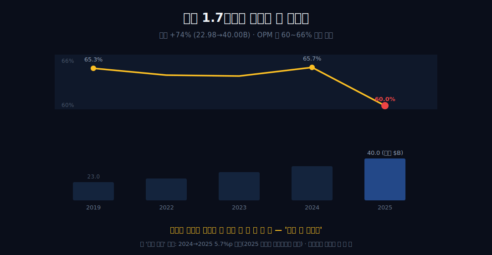
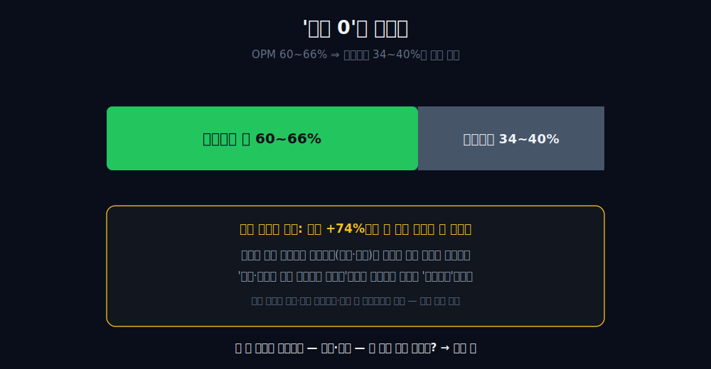
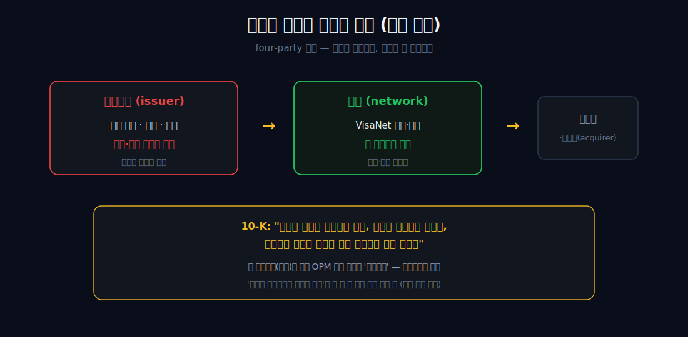
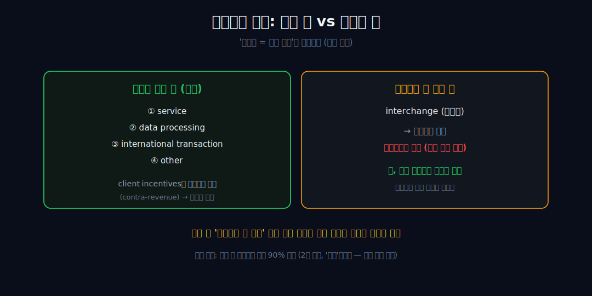
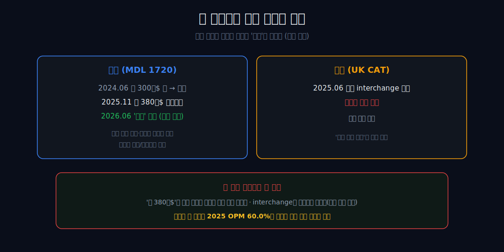
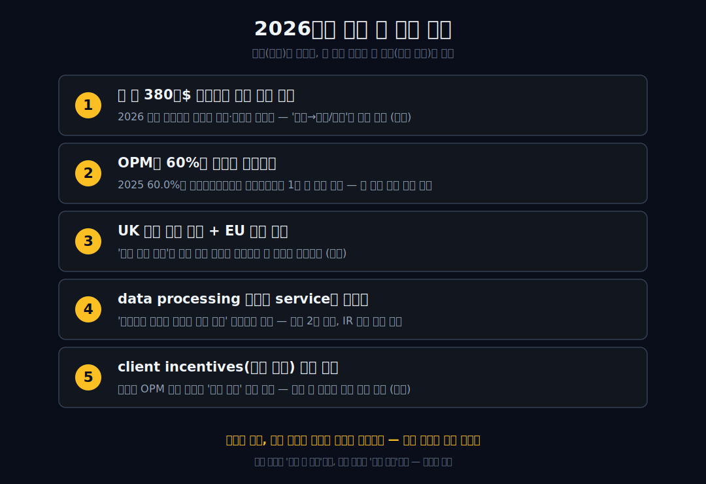

<script>
import ComboChart from '$lib/components/blog/ComboChart.svelte';
import StackBar from '$lib/components/blog/StackBar.svelte';
</script>

> **데이터 기준**: 2026-06-13 dartlab 실측 — Visa(V) **미국 연결(USD)** 기준, 분기 데이터를 연간으로 합산(회계연도 9월말 결산이라 2025 일부 비율은 경계노이즈로 밴드 표기, 2020은 분기 누락으로 제외). four-party 모델·10-K 자기기술·매출 구성·소송/합의·점유율은 연결 손익에 안 나오므로 **10-K·IR·언론(외부 인용)**으로 표기. ※대차대조표 항목은 매핑이 불안정해 인용에 주의.
>
> **핵심 숫자**: 매출 **$40.00B** · 영업이익 **$23.99B** (OPM **약 60%**, 밴드 60~66%) · 당기순이익 **$20.06B** (NPM 약 50%) · 영업현금흐름 **$23.06B** · 매출 2019→2025 **+74%** 동안 OPM 60%대 밴드 유지
>
> **이 글의 용어**: OPM(영업이익률)·NPM(순이익률) = 각각 영업이익·순이익÷매출(별개 비율) · 발급은행(issuer) = 카드를 찍어주고 신용·대손을 지는 은행 · interchange(스왑피) = 가맹점이 무는 수수료로 발급은행이 수취 · VisaNet = 비자의 결제 처리망 · four-party 모델 = 발급은행·매입사·네트워크·가맹점 4자 구조.

---

## 프롤로그 — 만들지 않는 카드 회사

비자카드는 비자(Visa)가 만들지 않는다. 카드를 찍어 당신 손에 쥐여준 건 발급은행이고, 못 갚으면 떼이는 손실도 그 은행 몫이다. 비자는 'Visa'라는 간판을 빌려주고, 거래가 그 망(VisaNet)을 통과할 때 통행료를 받는다.


그래서 비자의 손익계산서를 보면 이상한 일이 벌어진다. 6년 동안 매출이 **$22.98B에서 $40.00B로 +74%** 불었는데, 영업이익률은 **60%대를 단 한 번도 벗어나지 않았다.** 외형이 1.7배가 되는 동안 마진이 안 깎인 것이다.



우리는 딱 이 한 줄까지만 숫자로 증명할 수 있다. 그 '이상함'의 *원인*은 숫자가 말하지 못한다 — 회사가 스스로 적어둔 문장과, 지금 법정에서 벌어지는 일이 그 빈칸 옆에 나란히 놓일 뿐이다.

관통선은 하나다. **"카드 회사를 자처하면서 카드 대금도 연체 위험도 안 떠안는 이 회사는 무엇으로 돈을 벌고, 그 마진은 왜 안 깎이며 — 그 답을 어디까지 말할 수 있는가?"** 답을 *경계까지만* 정직하게 쓴다.

---

## 1막 — 안 깎인 마진 한 줄

**왜 손익계산서부터 보나.** '간판과 진짜 돈줄이 다른 회사'라는 의심은 결국 숫자에서 검증되거나 죽기 때문이다.

```python
import dartlab
c = dartlab.Company("V")
c.select("IS", ["매출액", "영업이익"], freq="Q")  # 분기→연간 합산
```

| 항목 ($B, 연간) | 2019 | 2022 | 2023 | 2024 | 2025 |
|---|---:|---:|---:|---:|---:|
| 매출 | 22.98 | 29.31 | 32.65 | 35.93 | **40.00** |
| 영업이익 | 15.00 | 18.81 | 21.00 | 23.59 | **23.99** |
| 연결 OPM | 65.3% | 64.2% | 64.3% | 65.7% | **60.0%** |

매출은 +74% 커졌는데 OPM은 줄곧 **약 60~66% 밴드** 안이다. 핵심은 방향이 아니라 *벗어나지 않았다*는 사실이다. 정직하게 짚자 — '계속 상승'이 아니다. 2024→2025엔 65.7%에서 60.0%로 6년 중 가장 큰 한 칸(**5.7%p**)을 내려왔다. (2025 OPM 점값은 회계연도 9월말 vs 달력 합산의 경계노이즈로 정확값이 불확실해, 점이 아니라 밴드로 읽는다.)

이 한 줄이 말하는 건 '아직 안 깎였다'(과거형)까지다 — *왜* 안 깎였는지는 한 글자도 말하지 않는다. 그래서 다음 막은 묻는다 — 외형이 1.7배가 됐는데 마진이 안 깎이려면, 매출과 함께 늘어났어야 할 무엇이 안 늘어났다는 뜻 아닌가?

---

## 2막 — 비용 0이 아니라, 변동원가가 안 따라온다

**왜 '비용 0' 클리셰부터 죽이나.** 1막의 '안 깎인 마진'이 곧장 'zero-marginal-cost 마법'으로 미끄러지기 때문이다.

OPM이 60~66%라는 건 역으로 **영업비용이 매출의 약 34~40% 실재한다**는 뜻이다 — 비용 0이 아니다. 그런데도 매출이 +74% 커지는 동안 그 비용 비율이 마진을 끌어올리지 못했다(밴드 유지). 이건 매출을 따라 늘어나는 *변동원가*(원가·대손 같은)의 비중이 작은 사업과 *정합한다*.



비교하자면, 매출이 늘 때 원가나 대손이 같이 늘어 갉아먹는 사업이라면 외형 1.7배에서 60%대 밴드를 지키기 어렵다. 단 이건 '불가능'이라는 절대 단정이 아니라, *'희석되지 않았다는 사실 자체가 변동원가 비중이 작은 사업과 정합한다'*는 격하된 진술이다(밴드 유지는 환율·고객 인센티브·믹스 등 다요인과도 양립한다). 그렇다면 자연히 다음 질문 — 매출과 함께 늘어났어야 할 그 변동원가, 원가·대손은 대체 누가 지고 있는가?

---

## 3막 — 회사가 스스로 적어둔 문장 (외부 인용)

**왜 이제 내부 숫자를 떠나 공시 문장으로 가나.** 변동원가의 행방은 연결 손익 *안*에 답이 없고, 회사가 *밖*에 적어둔 자기기술에만 있기 때문이다 — 그것도 인과가 아니라 정합으로만 읽어야 한다.

외부 인용에 따르면 비자는 10-K에 반복해서 이렇게 적는다 — *"Visa is not a financial institution, does not issue cards, extend credit or set rates and fees for consumers… nor does it earn revenue from or bear credit risk with respect to any of these activities."* (비자는 금융기관이 아니며, 카드를 발급하거나 신용을 제공하거나 소비자 요율을 정하지 않고, 그로부터 매출을 얻거나 신용 리스크를 지지 않는다.)



구조로는 **four-party(open-loop) 모델**이다(외부 인용) — 발급은행(issuer)이 카드 발급과 신용·대손 리스크를 지고, 비자는 그 위에서 망(VisaNet)이 승인·정산을 처리해 거래·네트워크 수수료를 번다. 즉 2막에서 '안 늘어난 변동원가'의 자리에, 회사는 *'우리는 대손·여신을 안 진다'*는 문장을 놓는다. 이 자기기술(외부)과 내부의 OPM 밴드 유지가 *서로 정합한다* — 여기까지가 한계다. '리스크를 안 져서 마진이 높다'로 한 발만 더 가면 검증 범위 밖이다(상관을 인과로 봉합). 그래서 다음 막 — 비자가 진짜로 파는 '통행료'의 정체는 무엇인가?

---

## 4막 — 통행료의 정체: 누가 받고, 비자는 무엇을 버나 (외부 인용)

**왜 '통행료'를 한 단어로 뭉치면 안 되나.** '스왑피 = 비자 매출'이라는 흔한 오독이 다음 막(소송)의 의미를 통째로 왜곡하기 때문이다.

외부 인용에 따르면 비자의 매출은 네 종류 — service / data processing / international transaction / other — 이고, 금융기관·가맹점에 주는 **client incentives**는 매출에서 *차감*(contra-revenue)해 순매출로 보고된다.

 결정적인 분리 하나 — 가맹점이 무는 **interchange(스왑피)는 카드 *발급은행*이 수취**하고 비자가 직접 매출로 잡지 않는다. 그러나 그 *기본 interchange 요율표는 비자가 설정*하며, 가맹점엔 협상 불가한 고정값이다.



시장 색채로만 덧붙이면 — 비자·마스터카드가 중국 외 결제처리의 *대략* 90%를 차지하는 복점이고, 비자 단독 글로벌 구매거래 점유는 *대략* 39%(2022, UnionPay 포함)로 알려져 있다(외부 인용, 2차 자료라 '대략'으로만). 정리하면 비자가 *버는 돈*(네트워크 수수료)과 비자가 *정하지만 안 받는 돈*(interchange)은 다른 층이다. 그런데 바로 이 '정하지만 안 받는' 요율 설정 권한이 — 다음 막에서 — 법정의 표적이 된다. 거래가 반드시 지나야 하는 길목을 쥐고 통행료를 매긴다는 점에서, 땅으로 길목을 쥔 [맥도날드](/blog/MCD-mcdonalds), 의무 장부의 길목을 쥔 [더존비즈온](/blog/012510-douzone)과 같은 계열이다.

---

## 5막 — 그 요율표가 지금 법정에 있다 (현재 사실 / 조건부 미래)

**왜 소송을 4막의 '요율 설정 권한'에 바로 잇나.** 비자가 *안 받지만 정하는* 그 요율표가 정확히 표적이기 때문이다 — 비자 매출이 아니라 비자의 *권한*이 걸렸다.

외부 인용에 따르면, 미국 interchange 집단소송(MDL 1720)에서 2024년 6월의 약 **300억 달러** 안은 인하 폭이 미미하다는 이유로 기각됐고, 2025년 11월의 약 **380억 달러** 수정합의가 2026년 6월 *잠정* 승인됐다 — 게시 신용 interchange율 인하·표준 소비자 카드율 상한·가맹점의 고비용 카드 거절/추가요금(surcharge) 권한 등을 담았으나, 가맹점 단체 반대·항소 여지로 *종결이 아니다.* 또 영국 경쟁항소심판소(UK CAT)는 2025년 6월 비자·마스터카드의 기본 interchange 구조를 경쟁법 위반으로 판결했고, 비자는 항소 의사를 밝혔다(외부 인용).




이 사실들은 1막에서 본 '안 깎인 밴드'의 *원천*(요율 설정 권한·카드 수용 규칙)을 직접 겨눈다. 두 가지를 헷갈리면 안 된다 — '약 380억 달러'는 *일시 현금 합의금이 아니라* 수년에 걸친 인하 추정치이고, interchange는 *발급은행 수취분*이라 '380억 = 비자 매출 타격'이 아니다. 그리고 결정적으로 — 이 소송을 2025년 OPM 60.0%와 *인과로 잇는 순간 거짓이 된다.* 그래서 마지막 막이 필요하다.

---

## 6막 — 두 렌즈가 같은 밴드를 정반대로 읽는다, 경계가 결론

**왜 결말에서 한쪽 손을 들어주지 않나.** 한쪽을 고르는 순간 그 선택이 곧 봉합(검증 위반)이기 때문이다.

같은 '60%대 밴드'를 두 렌즈가 정반대로 읽는다. *재무 렌즈*는 '+74% 외형을 변동원가 부담 없이 통과시킨 견고함'으로, *산업 렌즈*는 '그 밴드의 원천(요율 설정 권한)이 미국·UK 소송의 정조준 대상'으로. 충돌의 정점은 2025년 65.7%→60.0% 흐름이다 — 재무 렌즈는 경계노이즈·환율·고객 인센티브·믹스로 처리하고, 산업 렌즈는 '규제의 그림자'로 읽고 싶어 한다. 그러나 검증 수치만으로는 어느 쪽도 인과를 확정할 수 없다(전부 양립).

정직하고 강한 결론은 빈손이 아니다 — *내부 실측은 마진이 '아직' 안 깎였다까지만, 외부 사실은 그 원천이 '지금' 표적이 됐다까지만 말한다. 둘 사이의 다리는 아직 아무도 못 놓았다* — 그 경계 자체가 이 회사의 현재다. 간판(비자카드)과 진짜 돈줄(요율을 정하는 네트워크)이 다른 회사를 정확히 본다는 건, 그 둘을 성급히 잇지 않는 것이다.

```python
c.select("IS", ["당기순이익"], freq="Q")      # 순이익 → NPM 계산
c.select("CF", ["영업활동현금흐름"], freq="Q")  # 영업CF
```

(숫자 규율 한 가지 — OPM과 NPM은 별개다. NPM은 계산 가능한 연도 기준 약 **50~55%**(2019 52.6% / 2024 54.9% / 2025 50.2%)이고, OPM과의 간극은 약 **10%p**(계산 가능 3개 연도 9.8~12.7%p)다. 그 간극이 어디서 생기는지는 영업단 아래라는 것까지만 — 세부 항목은 데이터 밖이다.) 같은 '간판 ≠ 진짜 돈줄' 계열로 안 보이는 클라우드의 [아마존](/blog/AMZN-amazon), 입구의 회비를 걷는 [코스트코](/blog/COST-costco), 자본을 거의 안 깔고 도는 [코카콜라](/blog/KO-coca-cola)가 있다 — 비자는 그중 *무엇을 안 지는가로* 마진을 만드는 유일한 거울이다.

---

## 2026년에 봐야 할 다섯 가지

1. **미 interchange 약 380억$ 수정합의(MDL 1720)의 최종 승인 여부** — 2026년 잠정 단계에서 가맹점 반대·항소가 어디로 가는가. '잠정 → 최종/번복'이 핵심 분기다(현금 아닌 인하 추정치임을 계속 분리).
2. **OPM이 60%대 밴드를 지키는지** — 2025년 60.0%가 경계노이즈였는지 추세 시작이었는지는 1년 더 봐야 판별된다. 깨지면 그제서야 원인(규제·환율·인센티브·믹스)을 분해한다(그 전엔 인과 봉합 금지).
3. **UK CAT 위반 판결 항소 결과 + EU 추가 규제** — '요율 설정 권한'이 실제 강제 인하로 이어지는 첫 사례가 나오는지(외부).
4. **data processing 매출이 service 매출을 넘는지** — '간판보다 결제망 처리가 진짜 돈줄' 프레이밍의 근거(현재 2차 자료라 보류, IR 원문 확인 대상).
5. **client incentives(매출 차감) 비중 추이** — 이 항목이 커지면 OPM 밴드 하락의 '규제 아닌' 대안 설명이 된다 — 규제 탓 봉합을 막는 대조 변수(외부).



---

## 재무제표 — 최근 6개년 (dartlab 연결, $B)

> 미국 연결(USD)·분기 합산 기준(회계연도 9월말, 2020은 분기 누락으로 제외). dartlab에서 직접 확인:
> ```python
> import dartlab
> c = dartlab.Company("V")
> c.select("IS", ["매출액","영업이익","당기순이익"], freq="Q")
> c.select("CF", ["영업활동현금흐름"], freq="Q")
> ```

<ComboChart data={[{year:"2019",매출:23.0,영업이익:15.0,당기순이익:12.1},{year:"2021",매출:24.1,영업이익:15.8,당기순이익:12.3},{year:"2022",매출:29.3,영업이익:18.8,당기순이익:15.0},{year:"2023",매출:32.7,영업이익:21.0,당기순이익:17.3},{year:"2024",매출:35.9,영업이익:23.6,당기순이익:19.7},{year:"2025",매출:40.0,영업이익:24.0,당기순이익:20.1}]} lineKeys={["매출"]} barKeys={["영업이익","당기순이익"]} lineColors={["#22c55e"]} barColors={["#3b82f6","#f59e0b"]} title="매출(라인) vs 영업이익·당기순이익(막대) — $B" unit="$B" />

| 항목 ($B) | 2019 | 2021 | 2022 | 2023 | 2024 | 2025 |
|---|---:|---:|---:|---:|---:|---:|
| 매출 | 22.98 | 24.11 | 29.31 | 32.65 | 35.93 | 40.00 |
| 영업이익 | 15.00 | 15.80 | 18.81 | 21.00 | 23.59 | 23.99 |
| 당기순이익 | 12.08 | 12.31 | 14.96 | 17.27 | 19.74 | 20.06 |
| 연결 OPM | 65.3% | 65.5% | 64.2% | 64.3% | 65.7% | 60.0% |
| 영업현금흐름 | 12.78 | 15.23 | 18.85 | 20.75 | 19.95 | 23.06 |

이 표를 한 줄로 읽으면 이렇다 — 매출 행이 +74% 솟는 내내 **OPM 행이 60%대 밴드**를 지킨다(2025 60.0%로 5.7%p 하락은 경계노이즈 가능성과 함께 본다). 영업현금흐름은 영업이익에 *대체로 근접하되 연도 편차*가 있다 — 2025년 OCF $23.06B는 영업이익 $23.99B에 바짝 붙지만, 2024년 OCF $19.95B는 영업이익 $23.59B보다 약 15% 낮다(체리피킹 없이 둘 다 본다). 매출·이익 행만 보면 평범한 고성장이지만, OPM 행의 *안 깎임*과 원가·대손이 안 보이는 비용 구조를 겹쳐 보면 이건 카드 회사가 아니라 통행료 네트워크의 손익이라는 게 드러난다(이유=외부 자기기술).

---

## 검증표

본문 인용 수치를 dartlab 호출과 결과로 검증한다. 외부 출처(10-K 자기기술·소송·점유율)는 분리 표기. 📅 dartlab 실측 2026-06-13 · Visa(V) 미국 연결(USD)·분기 합산 기준.

| 본문 수치 | 출처 / 호출 | 결과 |
|---|---|---|
| 매출 2019 $22.98B → 2025 $40.00B (+74%) | `c.select("IS",["매출액"],freq="Q")` 합산 | ✓ 실측 |
| OPM 약 60~66% 밴드, 2024→2025 65.7%→60.0% (5.7%p 하락) | 영업이익÷매출 | ✓ 실측 |
| NPM 약 50~55% (2019 52.6% / 2024 54.9% / 2025 50.2%), OPM-NPM 간극 약 10%p (9.8~12.7%p) | 순이익÷매출 | ✓ 실측 |
| 영업현금흐름 2025 23.06(OP 23.99 근접) / 2024 19.95(OP 대비 약 15% 낮음) | `c.select("CF",["영업활동현금흐름"])` | ✓ 실측 |
| 10-K 자기기술: 카드 발급·여신·요율 수취·대손 리스크 미보유 | [V 10-K (SEC)](https://www.sec.gov/cgi-bin/browse-edgar?action=getcompany&CIK=0001403161&type=10-K) | 외부 인용 |
| four-party 모델 / 매출 4종 / client incentives 매출 차감 | [Visa 소개](https://usa.visa.com/about-visa.html) · [Visa IR](https://investor.visa.com/) | 외부 인용 |
| interchange는 발급은행 수취 → 비자 매출 아님(기본 요율표는 비자 설정) | [V 10-K (SEC)](https://www.sec.gov/cgi-bin/browse-edgar?action=getcompany&CIK=0001403161&type=10-K) | 외부 인용 |
| 미 MDL 1720: 옛 약 300억$ 기각 → 신 약 380억$ 잠정 승인 / UK CAT 2025 위반 판결 | [Reuters](https://www.reuters.com/) · [CNBC](https://www.cnbc.com/) | 외부 인용 |
| 중국 외 결제처리 대략 90% 복점·비자 단독 대략 39%(2022) | 시장 2차 자료 (Nilson 요약) | 외부 인용·대략 |
| 2020년은 분기 누락으로 분석 제외 / 2025 OPM 점값 경계노이즈 | dartlab 회계연도 합산 한계 | 방법론 |
| BS(대차대조표) 매핑 불안정 — 인용 주의 | dartlab 데이터 한계 | 주의/제외 |

본문의 숫자 중 이 표에 없는 것은 발행 차단 대상이다. four-party·리스크 비보유·소송/합의·점유율은 dartlab 연결로 증명되지 않으며 10-K·IR·언론 외부 인용임을 명시한다. 마진(내부)과 그 원인(외부)을 인과로 잇지 않는 것이 이 글의 원칙이다.
