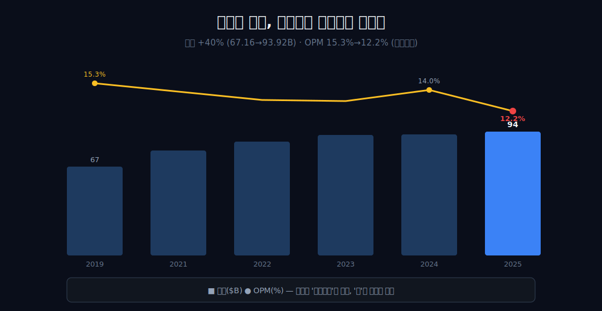
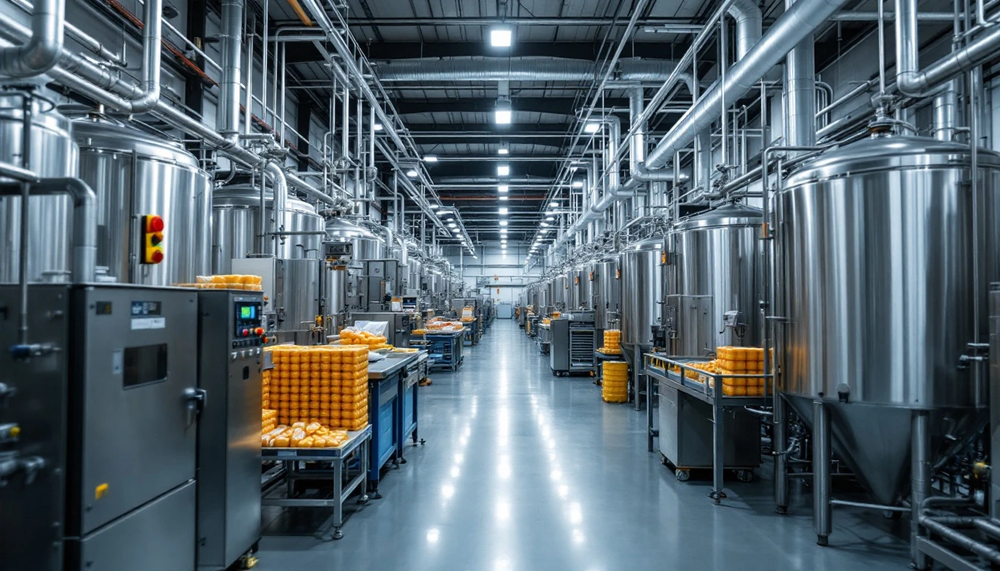
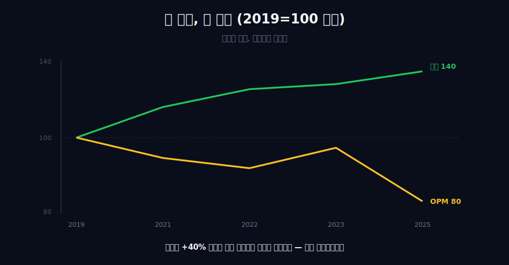
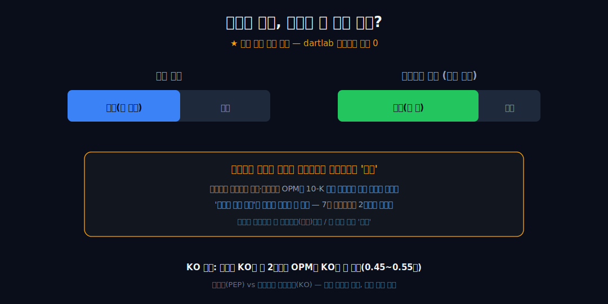
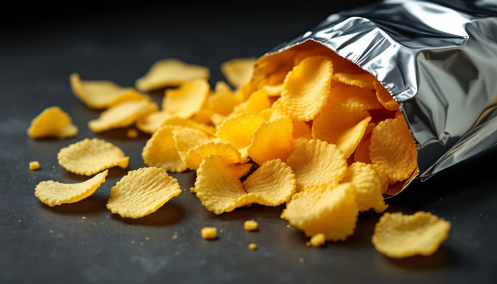
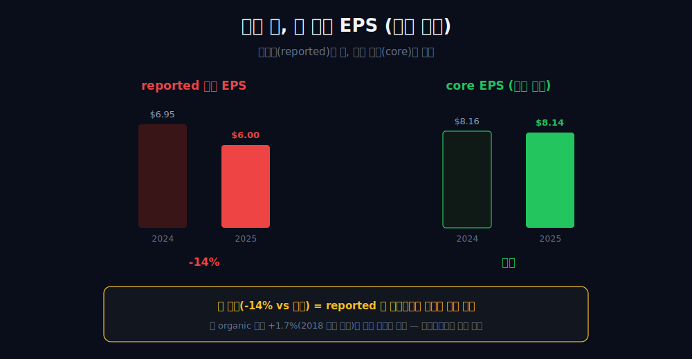
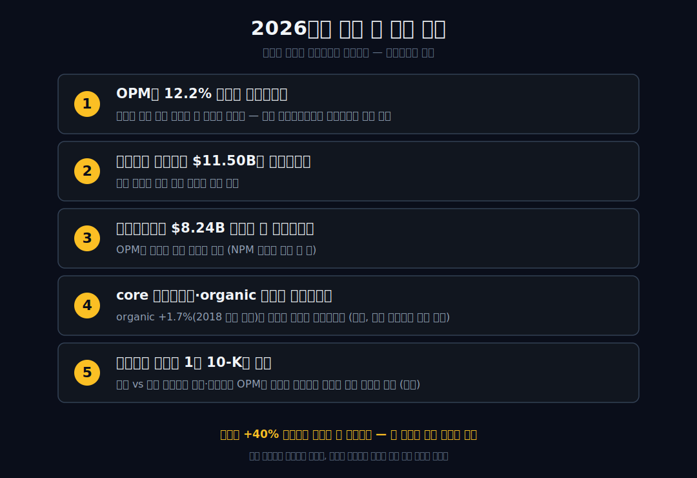

<script>
import ComboChart from '$lib/components/blog/ComboChart.svelte';
import StackBar from '$lib/components/blog/StackBar.svelte';
</script>

> **데이터 기준**: 2026-06-20 dartlab 실측 + PepsiCo FY2025 Form 10-K + Q1 2026 Form 10-Q — PepsiCo(PEP) **미국 연결(USD)** 기준, 분기 데이터를 연간으로 합산. 세그먼트(스낵 Frito-Lay vs 음료)별 비중, KO 절대치, 2025 딥의 일회성/추세 분해는 연결 손익에 안 나오므로 **10-K·10-Q·실적보도(외부 인용)**로 표기하며 일부는 미확정 가설이다. ※대차대조표 항목은 매핑이 불안정해 인용에 주의.
>
> **핵심 숫자**: 매출 **$93.92B** (2019→2025 **+40%**) · 영업이익 **$11.50B** (OPM **12.2%**) · 당기순이익 **$8.24B** · 영업현금흐름 **$12.09B** · OPM 2019 **15.3%** → 2024 **14.0%**(반등) → 2025 **12.2%**(재하락)
>
> **이 글의 용어**: OPM(영업이익률)·NPM(순이익률) = 각각 영업이익·순이익÷매출(별개 비율) · 디커플링 = 외형(매출)과 수익성(이익률)이 따로 움직이는 것 · 통합형 = 원액·병입·유통·스낵을 본체가 직접 소유하는 구조 · reported(회계상) EPS vs core(회사 조정 비-GAAP) EPS = 일회성 포함 여부가 다른 두 정의.

---

## 프롤로그 — 외형은 커졌는데, 수익으로 번역되지 않았다

매출이 6년 만에 40% 불어 **$93.92B**(약 1,290조 원)가 됐다. 보통 이쯤이면 '잘나가는 회사'로 글을 시작한다. 그런데 같은 표의 다음 줄을 보면 영업이익률은 15.3%(2019)에서 **12.2%(2025)**로 내려앉았고, 2025년엔 영업이익 *절대 금액*마저 $12.89B에서 $11.50B로 꺾였다.



단조 하락은 아니다 — 2024년엔 OPM이 14.0%로 잠깐 반등했다가 2025년 다시 12.2%로 꺾였다. 그래도 큰 그림은 분명하다. 외형은 분명히 커졌는데 그 외형이 수익으로 *번역되지 않는다.* 이건 연결 손익 한 장이 단독으로 증명하는 사실이다.

다만 이 표는 거기서 정확히 멈춘다. **'왜 안 번역되는가'는 한 줄도 말해주지 않는다.** 그래서 이 글은 펩시코에 대한 글이 아니라, 연결 숫자가 어디까지 증명하고 어디서부터 입을 닫는지 — *그 경계선*에 대한 글이다. 관통선을 먼저 쓴다: 연결은 *결과*(디커플링)를 못 박고, *원인*엔 침묵한다.


---

## 1막 — 외형은 커졌다 (연결이 단독으로 세우는 첫 절반)

**왜 '잘나가는 회사' 서사부터 깨야 하나.** 매출 성장 자체는 진짜이고, 그래서 '매출이 작아서 문제'가 아니기 때문이다.

```python
import dartlab
c = dartlab.Company("PEP")
c.select("IS", ["매출액", "영업이익"], freq="Q")  # 분기→연간 합산
```

매출은 2019년 $67.16B에서 2025년 $93.92B로 6년간 **+40%** 성장했다. 2021년 79.47, 2022년 86.39, 2023년 91.47, 2024년 91.85로 꾸준히 우상향이다. 영업현금흐름도 2019년 $9.65B에서 2023년 $13.44B까지 늘어, 외형 성장이 *현금 측면에서도* 실재했음을 같은 표가 받친다.



그러니 분명히 하자 — '매출이 작아서 문제'는 아니다. 여기서 규모를 *이익의 증명*으로 읽지 않는다. 매출이 크다고 더 좋은 회사인 것도 아니다. +40%는 외형이 커졌다는 사실까지만 증명하고, 그게 좋은 일인지 나쁜 일인지는 다음 줄을 봐야 안다.

---

## 2막 — 그런데 수익성은 따라오지 않았다 (이 글의 척추)

**외형이 커졌는데 왜 잘나간다고 못 하나.** 이익률이 외형과 따로 놀기 때문이다.

| 항목 ($B, 연간) | 2019 | 2022 | 2023 | 2024 | 2025 |
|---|---:|---:|---:|---:|---:|
| 매출 | 67.16 | 86.39 | 91.47 | 91.85 | **93.92** |
| 영업이익 | 10.29 | 11.51 | 11.99 | 12.89 | **11.50** |
| 연결 OPM | 15.3% | 13.3% | 13.1% | 14.0% | **12.2%** |

OPM은 2019년 15.3%에서 2025년 12.2%로, 외형 +40%와 *무관하게* 오히려 내려왔다(비단조 — 2024 14.0% 반등 포함). 결정적인 건 2025년이다. 이건 비율 착시가 아니다 — *영업이익 절대액*이 같은 표 안에서 $12.89B에서 $11.50B로 줄었다.



이게 이 글의 척추다 — **디커플링.** 외형 성장과 수익성이 분리돼 따로 움직인다는 사실이 연결 숫자만으로 증명된다. 여기까지가 연결의 증명 한계다. 이 딥이 *일시적인지 추세인지*는 이 표 밖이다 — 그건 다음 막에서 경계를 넘어야 만난다. 그렇다면 자연히 묻게 된다 — 왜 안 번역되는가?

---

## 3막 — 하단(순익)도 같은 방향, 단 별개의 줄로

**OPM만 꺾인 게 아니라 회사 하단도 같이 둔화했나.** 그렇다, 단 별개 비율의 별개 관찰로.

```python
c.select("IS", ["당기순이익"], freq="Q")
c.select("CF", ["영업활동현금흐름"], freq="Q")
```

당기순이익은 2024년 $9.58B에서 2025년 $8.24B로 줄었다. 손익 하단에서도 둔화가 점값으로 관찰된다. 영업현금흐름은 2023년 $13.44B → 2024년 $12.51B → 2025년 $12.09B로, 영업이익보다 *완만하게* 둔화했다.

여기서 범위를 명시해야 한다 — NPM을 '~9~11% 밴드'로 묶지 않는다. 2025년 순이익률은 8.24/93.92 ≈ **8.8%**로 그런 밴드의 하단을 이미 벗어난다. 그래서 순익 둔화는 *점값*(9.58→8.24)으로만 말하고, OPM 둔화와 같은 줄에 묶어 한 강도로 합치지 않는다. 영업CF가 영업이익보다 완만히 준 것은 감가상각 같은 비현금 성분의 존재 가능성과 *양립할* 뿐, 인과로 단정하지 않는다. 둔화가 영업단과 순익단 양쪽에서 보인다는 사실까지만 확정한다. 그러면 이제 진짜 질문 — 이 모든 둔화의 원인은 어디서 말할 수 있나?

---

## 4막 — 경계선을 넘는다: 여기서부터는 전부 외부 인용 (가설)

**연결이 입을 닫은 자리는 무엇으로 메우나.** 회사 바깥의 자료다 — 그리고 그건 '증거'가 아니라 '가설'이다.

'왜 OPM이 낮고 둔화하는가'에 대한 모든 설명은 dartlab 연결로는 증명이 **0**이다. 외부 인용에 따르면, 최근 회계연도 기준 북미 매출 간판은 음료지만 *전사 영업이익 비중*은 스낵(Frito-Lay)이 음료를 크게 앞서고(스낵이 음료의 약 3배 수준), 세그먼트 영업이익률도 스낵이 음료보다 훨씬 높은 것으로 알려져 있다(10-K 세그먼트, 외부 인용·정밀 자릿수 미확정).





그러나 이건 연결이 못 본 사각을 메우는 *가설*이지 검증된 결론이 아니다. 두 가지 절제가 필요하다. 첫째, '스낵이 진짜 돈줄'을 dartlab 연결로 증명한 척하지 않는다 — 펩시코는 7개 세그먼트로 보고하므로 '스낵 vs 음료' 2분할 자체가 단순화다. 둘째, [코카콜라](/blog/KO-coca-cola)와의 거울은 *비율 대비*로만 정당하다 — PEP는 매출이 KO의 약 2배인데 OPM은 KO의 약 절반 수준(최근 ~13% 기준 약 0.45~0.55배)이다. KO는 공장·병입을 외부에 넘긴 자산경량 라이선서, PEP는 병입·유통·스낵을 *직접 소유한* 통합형 — 이 구조 차이와 'OPM 격차'는 서로 *양립*하지만, '통합형이라서 OPM이 절반'이라고 인과로 봉합하지 않는다(KO 절대치 25~29%는 외부 라벨). 그러면 시리즈 결('간판과 진짜 돈줄')에 끼우고 싶은 유혹이 오는데, 다음 막에서 그 유혹과 회사 고유의 결을 구분해야 한다.

---

## 5막 — 2025 딥을 두 렌즈가 다르게 읽는다 (분해는 100% 외부)

**2025 딥은 일시적인가 추세인가.** 연결은 '실재한다'까지만, 분해는 전적으로 외부다.

연결 표는 '딥이 실재한다($12.89B→$11.50B)'까지만 답하고 성격엔 침묵한다. 외부 인용에 따르면 — 2025년 *회계상(reported) 희석 EPS*는 $6.00로 전년 $6.95 대비 −14%였지만, 같은 해 *회사 조정(core) 영업이익*은 약 +1.5%, *core EPS*는 $8.14로 전년 $8.16과 사실상 보합이었다.



여기서 두 EPS 정의를 못박자 — *reported(회계상)*는 일회성 비용을 모두 반영한 GAAP 숫자이고, *core*는 회사가 일회성을 걷어낸 비-GAAP 자체 정의다. 둘의 큰 괴리(−14% vs 보합)는 2025 reported 딥의 *상당 부분이 일회성 비용*(브랜드 감액·공장 폐쇄 등)에서 비롯됐음을 *시사한다*(외부 인용). 동시에, 그게 전부는 아니다 — organic(유기적) 매출 성장은 +1.7%로 2018년 현 CEO 취임 이래 최저였다(외부 인용). 즉 일회성만으로도, 추세 둔화만으로도 환원되지 않는다. (한 행동주의 펀드가 약 40억 달러 지분을 들고 등장했다는 보도도 있으나, 펀드 포지션은 시장 해석이지 '그러므로 추세가 나쁘다'의 증거가 아니다.) 그래서 마지막 막은 회사 고유의 결을 시리즈 틀과 분리해야 한다.

---

## 6막 — 회사 고유의 결, 그리고 글의 결론

**그래서 결국 무슨 회사인가.** 연결이 남기는 결론은 겸손하다.

외부 인용에 따르면 펩시코의 진짜 결은 시리즈 틀('간판 뒤 진짜 돈줄')보다 *'음료 회복 vs 스낵 추세 약세'의 사업부 비대칭*에 더 가깝다 — 음료는 회복 신호가, 북미 스낵은 분기 연속 물량 감소와 가격 인하 대응이 보고된다. 하지만 이 비대칭 서사는 미확정 외부에서만 살아 있어 연결로는 닿지 못한다.

그러니 이 글은 가치판단('좋은 회사/나쁜 회사')으로 끝나지 않는다. 연결이 *증명한 것*(디커플링 — 외형 +40%인데 OPM 12~15% 밴드에 갇혀 2025년 절대액마저 꺾임)과, 외부가 *메운 가설*(스낵 엔진·KO 거울·사업부 비대칭)의 경계를 독자에게 그대로 넘긴다. 그게 이 글의 결론이다 — *연결 손익은 펩시코가 '외형은 +40% 커졌는데 수익성은 따라오지 않았다'는 결과를 못 박이게 보여주지만, 그 원인이 음료인지 스낵인지 일회성인지 추세인지는 단 한 줄도 말하지 못한다.* 진짜 주인공은 펩시코가 아니라, 숫자가 증명하는 자리와 입을 닫는 자리 사이의 경계선이다. 같은 음료 진열대의 [코카콜라](/blog/KO-coca-cola)(자산경량 라이선서)·[몬스터 베버리지](/blog/MNST-monster-beverage)(고성장 브랜드)와, 간판 뒤 다른 엔진을 둔 [맥도날드](/blog/MCD-mcdonalds)·[코스트코](/blog/COST-costco)를 나란히 놓으면 이 경계가 더 또렷해진다.

---

## 공시 / Filings — GAAP와 core를 한 문장에 섞지 않는다

펩시코 글의 가장 큰 위험은 숫자가 부족한 게 아니라 숫자가 너무 많다는 점이다. 회사는 GAAP net revenue와 operating profit을 공시하고, 동시에 organic revenue, core operating profit, core constant currency operating profit 같은 조정 지표를 제공한다. 모두 유용하지만 같은 층이 아니다. 이 글은 먼저 GAAP 연결로 "외형은 커졌는데 영업이익률은 낮아졌다"는 결론을 세우고, 조정 지표는 그 딥의 성격을 보조 설명하는 데만 쓴다.

| 공식 자료 | 기간 | 이 글에서 쓰는 역할 | 숫자 사용 원칙 |
|---|---|---|---|
| [FY2025 Form 10-K](https://www.sec.gov/Archives/edgar/data/77476/000007747626000007/pep-20251227.htm) | 2025-12-27 종료 회계연도 | 연간 GAAP 기준선과 세그먼트 분해 | net revenue, operating profit, segment operating profit |
| [Q1 2026 Form 10-Q](https://www.sec.gov/Archives/edgar/data/77476/000007747626000017/pep-20260321.htm) | 2026-03-21 종료 12주 | 최신 분기 반등 확인 | GAAP 먼저, core/constant currency는 별도 |
| [Q1 2026 earnings release](https://investors.pepsico.com/docs/pepsico-5v9wci20/media/Files/investors/q1-2026-earnings-release.pdf) | 2026년 1분기 발표 | 회사가 강조한 경영 해석 확인 | volume·pricing·productivity 문장은 회사 해석으로 표기 |
| [PepsiCo annual reports page](https://www.pepsico.com/en/investors/annual-reports-proxy-information) | 원문 색인 | 보고서 접근 경로 | 최신 연차 자료 확인 |

FY2025 10-K의 연결 표는 단순하다. net revenue는 **$93.925B**, operating profit은 **$11.498B**, operating margin은 **12.2%**다. 전년 FY2024 net revenue $91.854B보다 매출은 늘었지만, operating profit은 $12.887B에서 $11.498B로 줄었고 operating margin은 14.0%에서 12.2%로 낮아졌다. 이 문장은 GAAP로 닫힌다. 어떤 조정 지표를 가져오더라도, 연결 손익계산서의 첫 관찰은 바뀌지 않는다. 2025년의 펩시코는 매출이 증가한 해에 영업이익이 감소한 회사다.

다음으로 세그먼트 표를 보면 "스낵이 돈줄이고 음료가 짐"이라는 쉬운 말이 반쯤만 맞다는 걸 알 수 있다. FY2025 segment operating profit은 PFNA **$6.173B**, PBNA **$1.089B**, IB Franchise **$1.769B**, EMEA **$2.106B**, LatAm Foods **$2.010B**, Asia Pacific Foods **$0.369B**다. PFNA가 가장 큰 것은 사실이다. 그러나 세그먼트 operating profit 합계는 $13.516B이고, corporate unallocated expenses **-$2.018B**를 거쳐 연결 operating profit $11.498B로 내려온다. 즉 "Frito-Lay가 회사를 다 벌어준다"라고 쓰면 세그먼트와 연결 사이의 corporate cost를 지워버리는 문장이 된다.

PBNA의 2025 operating profit 감소도 단순히 "음료가 무너졌다"로 끝낼 수 없다. 10-K는 operating profit 감소의 원인으로 Rockstar brand impairment, organic volume decline, commodity costs, acquisition and divestiture-related charges 등을 나열한다. 이 중 일부는 일회성 성격이고 일부는 운영 추세다. 그래서 본문에서는 "음료가 구조적으로 망가졌다"가 아니라, **"2025년 PBNA 손익에는 브랜드 감액·물량·원가·거래 관련 비용이 겹쳤다"**고 쓴다. 숫자가 주는 결론은 방향이고, 원인 분해는 회사 설명을 붙인 외부 층이다.

Q1 2026 Form 10-Q는 다시 다른 그림을 보여준다. 12주 기준 net revenue는 **$19.443B**, operating profit은 **$3.213B**, operating margin은 **16.5%**다. 전년 동기 $17.919B, $2.583B, 14.4%보다 모두 개선됐다. 단 이 분기는 연간 2025 딥을 곧바로 지워버리는 증거가 아니다. 12주 한 점이고, 해외 사업은 월별 반영 기준이 섞이며, commodity mark-to-market gains와 acquisition/divestiture 관련 credits 같은 비교 가능성 항목이 있다. 그래서 Q1은 "반등의 증거"가 아니라 **"2025 딥 이후 첫 회복 신호"**로 둔다.

Q1 2026에서 회사가 함께 제시한 core operating profit increase 9%, core operating margin expansion 10bp, core constant currency operating profit performance 5%는 모두 non-GAAP다. 이 숫자들이 나쁜 게 아니다. 오히려 회사가 실제 운영 추세를 설명하려 할 때 필요한 보조 지표다. 그러나 투자 글에서 이 숫자를 GAAP operating profit 24% 증가와 같은 문장에 섞으면 독자는 어떤 이익이 어떤 기준인지 잃어버린다. 그래서 검증표에는 GAAP와 non-GAAP를 분리하고, 본문 결론의 중심은 GAAP 연결과 세그먼트 operating profit에 둔다.

펩시코의 공시를 있는 그대로 읽으면 결론은 단순해지지만 더 강해진다. 2025년 연간으로는 매출 증가와 영업이익 감소가 동시에 발생했다. 2026년 1분기에는 GAAP 이익률이 반등했지만, 회사가 강조한 core·constant currency·organic은 모두 조정 지표다. 세그먼트 표는 PFNA의 중요성을 보여주지만, corporate unallocated expenses와 PBNA의 감액/원가/물량 이슈도 함께 보여준다. 그러니 이 글의 주제는 "펩시코가 안 좋다"가 아니라, **"펩시코는 좋은 브랜드 묶음이어도 외형이 자동으로 이익으로 번역되지 않는다는 것을 공시로 보여준다"**다.

## 세그먼트 독해 — 스낵 엔진은 맞지만, 전부는 아니다

펩시코를 스낵 회사로 읽고 싶은 유혹은 이해된다. FY2025 PFNA net revenue는 **$27.528B**이고 segment operating profit은 **$6.173B**다. 단순 계산한 segment operating margin은 약 **22.4%**다. PBNA는 net revenue **$28.197B**, segment operating profit **$1.089B**로, segment operating margin이 약 **3.9%**다. 숫자만 놓고 보면 스낵과 북미 음료의 수익성 격차는 매우 크다. 이 관찰은 공시로 닫힌다.

하지만 여기서 한 발만 더 나가면 위험하다. PFNA는 "스낵"의 대표지만 펩시코 전체의 스낵이 아니다. LatAm Foods와 Asia Pacific Foods도 food 사업이고, EMEA에는 food와 beverage가 섞여 있다. IB Franchise는 음료 franchise 성격이 강하지만 PBNA와도 다르다. 그러므로 "스낵 vs 음료" 2분법은 투자 글의 설명 도구일 뿐, 공시 세그먼트 그 자체가 아니다. 이 차이를 지우면 글은 읽기 쉬워지지만, 검증 가능성은 낮아진다.

PFNA의 2025 operating profit 감소도 중요한 신호다. PFNA segment operating profit은 2024년 **$6.619B**에서 2025년 **$6.173B**로 줄었다. 여전히 가장 큰 이익 엔진이지만, 엔진 자체도 흔들렸다. PBNA의 감소가 훨씬 눈에 띄지만 PFNA가 무조건 방어했다는 문장도 정확하지 않다. 2025년 펩시코의 핵심은 "음료만 문제"가 아니라, **북미 food와 beverage 양쪽에서 가격·물량·원가·일회성 비용이 서로 다른 방식으로 압박을 만들었다**는 데 있다.

International 쪽은 또 다른 그림이다. FY2025 EMEA operating profit은 **$2.106B**, LatAm Foods는 **$2.010B**, IB Franchise는 **$1.769B**다. 이 세 줄을 합치면 북미 바깥의 이익 기여가 작지 않다. Q1 2026에서도 EMEA, LatAm Foods, Asia Pacific Foods는 높은 reported revenue growth를 보였고, operating profit도 각각 증가했다. 그러나 여기에는 foreign exchange translation 효과가 들어간다. 따라서 "해외가 다 해결했다"라고도 쓰지 않는다. 환율은 사업의 품질과 별개로 숫자를 키우거나 줄일 수 있다.

이 세그먼트 독해에서 가장 중요한 건 corporate unallocated expenses다. FY2025 segment operating profit 합계는 $13.516B인데 연결 operating profit은 $11.498B다. 차이 **$2.018B**는 corporate unallocated expenses다. segment story만 읽으면 펩시코가 더 좋아 보인다. 연결로 내려오면 본사 비용, 헤지, pension, mark-to-market, acquisition/divestiture 관련 항목이 다시 들어온다. 좋은 기업 분석은 세그먼트 표에서 멈추지 않고 연결 손익으로 돌아온다.

이 점이 [코카콜라](/blog/KO-coca-cola)와의 차이를 만든다. 코카콜라는 자산경량 franchise 구조라 연결 OPM이 더 높게 보이는 회사다. 펩시코는 스낵 제조·음료·유통·해외 food·franchise가 한 장부에 섞인다. 그래서 매출은 코카콜라보다 훨씬 크지만, 영업마진은 낮다. 이 비교는 가치판단이 아니라 구조의 차이다. 펩시코의 장점은 더 넓은 소비 접점이고, 비용은 더 무거운 장부다. 그 비용이 2025년에 뚜렷하게 보였다.

## 최신 분기 — Q1 2026 반등을 과대해석하지 않는 법

Q1 2026 숫자만 보면 펩시코는 꽤 강하게 돌아왔다. net revenue는 전년 동기 대비 9% 증가한 **$19.443B**, operating profit은 24% 증가한 **$3.213B**, operating margin은 14.4%에서 **16.5%**로 210bp 개선됐다. EPS도 27% 증가했다. 이 숫자만 보면 2025년 딥은 끝났다고 쓰고 싶어진다.

하지만 공시는 동시에 브레이크도 건다. Q1 2026의 core operating profit increase는 **9%**이고, core operating margin expansion은 **10bp**다. GAAP operating profit 24% 증가와 core 9% 증가는 같은 말이 아니다. GAAP 쪽에는 commodity derivatives mark-to-market gains, acquisition/divestiture-related charges/credits, foreign exchange translation 같은 항목이 영향을 준다. 그래서 이 분기의 핵심은 "수익성이 폭발했다"가 아니라, **GAAP 반등은 강하지만 조정 기준의 운영 개선은 더 완만하다**는 것이다.

부문별로 보면 더 섬세하다. PFNA는 Q1 2026 reported operating profit이 전년 동기 대비 **7% 감소**했다. core 기준으로도 **4% 감소**다. 반면 PBNA는 reported operating profit **60% 증가**, core **7% 증가**다. 이 조합은 2025년 연간 서사를 그대로 뒤집지 않는다. 오히려 펩시코의 장부가 부문별로 서로 다른 속도를 갖고 있음을 보여준다. 한 분기에 북미 음료가 반등하고 북미 food가 약해질 수 있다. 이 회사는 한 개의 브랜드가 아니라 여러 리듬의 묶음이다.

volume과 pricing도 같은 방식으로 읽어야 한다. Q1 2026에서 PFNA organic volume은 +2였고 effective net pricing은 -1이었다. PBNA organic volume은 -4, effective net pricing은 +6이었다. 즉 북미 food는 가격을 낮추거나 믹스가 불리해지는 대신 물량이 회복됐고, 북미 beverage는 물량이 줄었지만 가격/믹스가 받쳤다. 둘 다 "매출 성장"으로 묶을 수 있지만 질은 다르다. 성장률 하나로 소비자 반응을 단정하면 숫자의 내용이 사라진다.

해외 부문도 마찬가지다. EMEA reported revenue growth는 18%지만 foreign exchange translation 영향이 12%p였다. LatAm Foods reported revenue growth 16%에도 FX 13%p가 들어갔다. Asia Pacific Foods는 organic volume +10과 effective net pricing -2가 함께 있었다. 각각의 성장률은 좋은 headline이지만, 그 아래에는 환율·가격·물량·믹스가 섞인다. 이 글이 계속 "연결은 결과를 증명하고 원인엔 침묵한다"고 말하는 이유가 여기 있다. 연결 표는 방향을 보여주고, 세부 원인은 보조 표를 읽어야 겨우 분리된다.

Q1 2026은 그래서 투자자에게 두 가지 체크포인트를 준다. 첫째, 2025년 reported 딥이 전부 구조적 붕괴였다는 주장은 약해졌다. GAAP operating margin이 16.5%까지 올라왔기 때문이다. 둘째, 2025년 딥이 완전히 사라졌다는 주장도 아직 이르다. PFNA는 여전히 이익 감소가 보이고, PBNA 반등에는 비교 기저와 조정 항목이 섞여 있으며, 해외 성장에는 FX가 크게 들어간다. Q1은 결론이 아니라 다음 검증의 시작점이다.

## 읽기 규칙 — 펩시코를 브랜드 모음이 아니라 회계 묶음으로 읽는다

펩시코는 소비자에게는 익숙한 브랜드의 모음이지만, 투자자에게는 회계 묶음이다. Lay's, Doritos, Pepsi, Gatorade, Quaker, SodaStream을 떠올리면 품질 좋은 포트폴리오처럼 보인다. 그러나 손익계산서는 브랜드 호감도가 아니라 매출·원가·물량·가격·감액·본사 비용을 기록한다. 브랜드가 강해도 commodity cost가 오르고 물량이 줄고 감액이 생기면 영업이익은 꺾인다. 2025년의 펩시코가 그 증거다.

첫 번째 규칙은 GAAP를 중심축으로 두는 것이다. adjusted EPS, core EPS, organic revenue는 모두 useful하지만, 먼저 봐야 할 것은 net revenue와 operating profit이다. 2025년 net revenue는 증가했고 operating profit은 감소했다. 이 한 줄이 글의 척추다. 조정 지표는 그 감소가 얼마나 일회성인지, 운영 추세가 얼마나 나쁜지, 환율이 얼마를 더했는지 설명하는 도구다. 도구가 척추를 대신하면 글은 회사 자료의 프레젠테이션이 된다.

두 번째 규칙은 segment operating profit을 연결 operating profit으로 착각하지 않는 것이다. PFNA의 margin이 높고 PBNA의 margin이 낮다는 관찰은 중요하다. 그러나 segment operating profit에는 corporate unallocated expenses가 빠져 있다. FY2025 기준 그 비용은 $2.018B다. 투자자는 결국 연결 주주에게 귀속되는 손익을 산다. 세그먼트 서사는 원인 후보를 찾는 지도이고, 연결 손익은 최종 성적표다.

세 번째 규칙은 "가격 인상=좋은 성장"이라는 단정을 피하는 것이다. 가격 인상은 매출을 키울 수 있지만 물량 감소를 동반하면 장기 브랜드 건강을 압박할 수 있다. 반대로 가격을 낮춰 물량이 돌아오는 것은 단기 마진을 압박할 수 있다. Q1 2026 PFNA와 PBNA의 volume/pricing 조합은 이 두 방향이 동시에 존재함을 보여준다. 펩시코 같은 필수소비재 회사에서 가장 중요한 건 가격과 물량의 균형이지, 매출 성장률 하나가 아니다.

네 번째 규칙은 해외 성장률에 환율을 분리해서 보는 것이다. EMEA와 LatAm Foods의 reported growth는 강하지만 FX 기여가 크다. constant currency는 그 영향을 걷어내려는 조정 지표다. 다만 constant currency 역시 non-GAAP다. 따라서 "해외가 강하다"는 문장은 가능하지만, "해외 사업이 구조적으로 이익률을 끌어올렸다"는 문장은 세그먼트 이익률과 환율 효과를 함께 확인한 뒤에야 가능하다.

다섯 번째 규칙은 [몬스터 베버리지](/blog/MNST-monster-beverage)나 [코카콜라](/blog/KO-coca-cola)와 비교할 때 포트폴리오의 무게를 함께 보는 것이다. 몬스터는 고마진 브랜드 집중, 코카콜라는 franchise 중심, 펩시코는 food와 beverage를 직접 굴리는 통합형에 가깝다. 같은 음료 진열대에 있어도 장부 구조가 다르다. 그래서 펩시코의 낮아진 OPM은 단순한 실행 실패가 아니라 구조의 비용일 수 있다. 다만 "구조 때문"이라는 말도 공시로 완전히 닫히지는 않는다. 연결은 결과를 보여주고, 구조 해석은 가설을 만든다.

이 다섯 규칙을 적용하면 펩시코는 훨씬 읽기 쉬워진다. 좋은 브랜드를 가진 나쁜 회사가 아니다. 매출이 커졌는데 이익률이 따라오지 못한 성숙 소비재 복합체다. 2026년 1분기 반등은 중요하지만, 그 반등 안에도 GAAP와 core, 물량과 가격, 환율과 운영 개선이 섞여 있다. 그러니 펩시코의 다음 한 해는 "성장률 회복"보다 "성장률이 어떤 비용을 치르고 회복되는가"를 봐야 한다.

## 반론과 재반론 — Q1 반등을 어디까지 인정할 것인가

펩시코 글의 가장 강한 반론은 Q1 2026이다. "2025년 딥을 길게 썼지만, 다음 분기에 operating margin이 16.5%까지 올라왔고 operating profit도 24% 늘었다. 그렇다면 2025년은 일회성이었고 문제는 이미 끝난 것 아닌가"라는 반론이다. 이 반론은 무시하면 안 된다. 2026년 1분기 GAAP 숫자는 실제로 강하다. 순수하게 연결 손익계산서만 보면 Q1은 2025년의 우울한 결론을 완화한다.

다만 좋은 반론은 결론을 지우는 게 아니라 조건을 세운다. Q1 2026의 GAAP operating margin 16.5%가 연간으로 이어지면, 2025년 12.2%는 일회성 충격이 컸던 해로 재분류될 수 있다. 반대로 Q1의 개선이 commodity mark-to-market, acquisition/divestiture-related credits, FX translation, 비교 기저에 크게 기대고 2~4분기에 약해지면, 2025년 딥은 아직 완전히 끝난 게 아니다. 따라서 Q1은 반박 증거가 아니라 **검증해야 할 첫 데이터 포인트**다.

첫 번째로 봐야 할 것은 PFNA다. 펩시코의 스낵 엔진이라고 불리는 PFNA는 Q1 2026에 reported operating profit이 7% 감소했고 core 기준으로도 4% 감소했다. 연간 2025에서도 PFNA operating profit은 2024년보다 줄었다. 그러면 "스낵이 모든 문제를 해결한다"는 문장은 아직 위험하다. PFNA는 여전히 가장 큰 이익 엔진이지만, 그 엔진도 가격·물량·원가·프로모션의 압박을 받는다. 핵심 엔진이 안정적으로 다시 증가하는지 확인해야 2025년 딥의 성격을 더 자신 있게 말할 수 있다.

두 번째는 PBNA다. Q1 2026에서 PBNA reported operating profit은 60% 증가했다. 이 숫자는 강하지만, core 기준으로는 7% 증가다. 전년의 restructuring/impairment charges와 acquisition/divestiture-related 항목 때문에 reported 회복률이 커 보일 수 있다. PBNA는 2025년에 Rockstar impairment와 organic volume decline, commodity cost 영향이 얽힌 사업부였다. 따라서 Q1 반등은 긍정적이지만, 음료 사업이 구조적으로 회복됐다는 결론은 volume이 돌아오는지와 가격/믹스가 소비자 저항 없이 유지되는지까지 봐야 한다.

세 번째는 가격과 물량의 교환이다. Q1 2026 PFNA는 organic volume +2, effective net pricing -1이었다. 이는 소비자 반응을 되살리기 위해 가격이나 믹스 측면에서 양보했을 가능성을 보여준다. PBNA는 organic volume -4, effective net pricing +6이었다. 이는 반대로 가격/믹스가 매출을 받쳤지만 물량은 약했다는 뜻이다. 둘 다 매출 성장으로 합쳐지지만, 경제적 의미는 다르다. 성장의 질은 "얼마나 팔렸나"와 "얼마에 팔았나"를 분리해야 보인다.

네 번째는 international이다. EMEA와 LatAm Foods의 reported growth는 강했지만 FX translation 기여가 컸다. 환율은 사업 경쟁력을 보여주는 지표가 아니다. 물론 환율이 손익에 실제 영향을 주므로 무시할 수도 없다. 하지만 환율로 커진 성장률을 제품 수요나 가격 결정력으로 읽으면 안 된다. constant currency 지표가 필요한 이유가 여기 있다. 동시에 constant currency는 non-GAAP이므로, 본문에서는 GAAP 결과와 조정 결과를 나란히 두고 어느 쪽도 단독 결론으로 쓰지 않는다.

다섯 번째는 corporate unallocated expenses다. 좋은 세그먼트 뉴스가 많아도 연결 operating profit은 corporate cost를 지나야 한다. FY2025 corporate unallocated expenses는 $2.018B였고, Q1 2026에도 corporate unallocated expenses는 reported 기준 **-$196M**이었다. 전년 동기 -$414M보다 좋아졌지만, 여전히 연결로 내려오는 과정에서 중요한 줄이다. 펩시코 같은 복합체는 세그먼트 각각의 승리보다, 그 승리가 본사 비용과 조정 항목을 지나 연결 이익으로 얼마나 남는지가 더 중요하다.

여섯 번째는 core 지표의 역할이다. 회사가 core operating profit과 core EPS를 제시하는 이유는 운영 추세를 더 잘 보이게 하려는 것이다. 투자자는 이를 봐야 한다. 하지만 core 지표는 회사가 정한 조정 항목을 제외한 숫자다. 그것이 항상 나쁘다는 뜻은 아니다. 다만 조정 항목이 매년 반복되거나 금액이 크면, "일회성"이라는 단어의 의미가 약해진다. 펩시코의 경우 restructuring, impairment, acquisition/divestiture, mark-to-market 항목이 계속 등장한다. 그러면 GAAP와 core를 함께 봐야 한다.

일곱 번째는 [스타벅스](/blog/SBUX-starbucks)와의 차이다. 스타벅스는 간판 사업의 트래픽과 마진이 직접 흔들리는 이야기라면, 펩시코는 여러 사업부의 가격·물량·원가가 엇갈리는 이야기다. 둘 다 소비재지만 해석 방식이 다르다. 스타벅스에서 매장 트래픽이 핵심이라면, 펩시코에서는 PFNA volume, PBNA pricing, international FX, corporate unallocated expenses가 동시에 필요하다. 그래서 펩시코 글은 더 느리게 읽어야 한다.

여덟 번째는 좋은 브랜드와 좋은 장부를 구분하는 일이다. 펩시코 브랜드는 여전히 강하다. 그러나 좋은 브랜드도 commodity cost, 물류비, 마케팅비, 감액, 소비자 가격 민감도를 피해가지 못한다. 2025년의 딥은 바로 그 비용들이 브랜드의 표면을 뚫고 손익계산서에 나타난 해다. Q1 2026의 반등은 그 비용이 일부 완화됐거나 비교 기저가 좋아졌음을 보여준다. 하지만 브랜드가 강하다는 사실 하나로 비용 구조가 해결됐다고 볼 수는 없다.

아홉 번째는 2026년 남은 분기다. Q1은 12주 기준이고 북미와 해외 반영 방식도 다르다. 연간으로 갈수록 계절성, 광고비, 원재료, 환율, 판촉, 신제품, 인수 효과가 더 섞인다. Q1의 16.5% margin이 2026년 전체 margin의 새 기준선인지, 아니면 강한 출발점인지 아직 알 수 없다. 투자 글이 해야 할 일은 지금 답을 내는 것이 아니라 답이 필요한 질문을 정확히 남기는 것이다.

따라서 이 글의 최종 입장은 균형이다. 2025년 펩시코는 매출 증가에도 operating profit이 줄어든 해였다. 이 결론은 GAAP 10-K로 닫힌다. 2026년 1분기는 강한 반등을 보였다. 이 결론도 GAAP 10-Q로 닫힌다. 그러나 Q1 반등 안에는 non-GAAP 조정, FX, mark-to-market, 부문별 상반된 volume/pricing이 섞여 있다. 그러니 펩시코는 "끝난 문제"도 아니고 "무너진 회사"도 아니다. **2026년 남은 분기에서 외형이 이익으로 다시 번역되는지 검증받는 소비재 복합체**다.

이 균형은 독자에게 불편할 수 있다. 소비재 대형주는 보통 단순한 결론을 기대하게 만든다. 브랜드가 강하니 방어적이다, 가격 결정력이 있으니 인플레이션을 넘긴다, 스낵은 반복 구매라 안정적이다. 모두 어느 정도 맞는 말이다. 그러나 2025년 펩시코의 GAAP 손익은 그 단순함을 허락하지 않는다. 매출은 늘었고, 영업이익은 줄었고, 핵심 세그먼트 일부도 둔화했다. 좋은 브랜드가 항상 좋은 손익으로 곧장 번역되지는 않는다는 점이 이 글의 중심이다.

반대로 2026년 1분기 반등을 너무 작게 보는 것도 오류다. Q1 operating profit $3.213B와 operating margin 16.5%는 확실히 강하다. PBNA의 reported 반등과 해외 부문의 성장도 무시할 수 없다. 만약 2026년 남은 분기에서 PFNA operating profit이 다시 증가하고, PBNA volume decline이 완화되고, international growth가 FX 없이도 유지된다면 이 글의 톤은 더 긍정적으로 바뀌어야 한다. 좋은 분석은 최초 결론을 고집하지 않고, 다음 공시가 충분히 강하면 문장을 바꾼다.

그래서 펩시코의 검증 루틴은 세 줄이면 된다. 첫째, GAAP operating margin이 2025년 12.2%에서 얼마나 회복되는지 본다. 둘째, core와 GAAP의 괴리가 줄어드는지 본다. 셋째, PFNA와 PBNA의 volume/pricing 조합이 동시에 좋아지는지 본다. 이 세 줄이 좋아지면 2025년 딥은 일회성 비용과 짧은 수요 둔화가 겹친 해로 재분류된다. 이 세 줄이 엇갈리면 외형과 수익성의 디커플링은 아직 진행 중이다.

마지막으로 펩시코를 [월마트](/blog/WMT-walmart)와 비교하면 차이가 분명해진다. 월마트는 낮은 마진을 압도적 회전으로 굴리는 회사이고, 펩시코는 훨씬 높은 브랜드 마진을 기대받는 소비재 복합체다. 월마트의 4%대 OPM은 사업 모델상 자연스럽지만, 펩시코의 12.2% OPM은 과거 기대치 대비 실망으로 읽힌다. 같은 "외형과 이익률" 문제라도 기준선이 다르다. 그래서 펩시코의 질문은 "낮은 마진을 견딜 수 있나"가 아니라, "높아야 할 마진이 왜 낮아졌고 다시 올라오는가"다.

이 질문을 다음 공시에서 확인하는 방법은 어렵지 않다. 연간 2026이 닫히기 전까지는 분기마다 net revenue growth, operating profit growth, operating margin, PFNA operating profit, PBNA operating profit, organic volume, effective net pricing을 같은 표에 넣는다. 그 표에서 가장 좋은 그림은 PFNA volume이 유지되고, PBNA volume 감소가 완화되고, operating margin이 core 기준과 GAAP 기준에서 동시에 올라가는 것이다. 반대로 매출은 오르는데 volume은 약하고 pricing만 버티며, core와 GAAP 괴리가 커지면 2025년의 문제는 아직 끝나지 않은 것이다.

펩시코의 장점은 이 검증이 공시로 가능하다는 데 있다. 회사는 세그먼트별 net revenue, operating profit, volume, pricing, FX, organic growth를 꽤 자세히 제공한다. 숫자가 많아 해석은 어렵지만, 적어도 검증할 재료는 있다. 따라서 이 글은 "원인을 모른다"에서 멈추지 않는다. 연결 손익은 원인에 침묵하지만, 10-K와 10-Q의 세그먼트 표는 원인 후보를 좁혀준다. 다만 후보를 결론으로 바꾸려면 몇 분기 반복이 필요하다.

결국 펩시코는 방어주라는 이름 뒤에 숨어 있던 운영 난도가 드러난 회사다. 소비자는 매일 제품을 사지만, 회사는 원재료·환율·물류·광고·가격저항·브랜드 감액·인수 효과를 동시에 관리해야 한다. 2025년은 그 난도가 손익에 나타난 해였고, 2026년 1분기는 관리가 다시 작동하는지 확인한 첫 장면이다. 남은 질문은 브랜드의 힘이 아니라 번역의 힘이다. 매출이 이익으로 번역되는가, 그리고 그 번역이 GAAP로도 확인되는가.

이 질문은 장기 투자자에게도 실용적이다. 펩시코가 다시 좋은 회사로 보이려면 매출 성장률이 높을 필요만 있는 게 아니다. PFNA와 PBNA의 volume이 동시에 안정되고, 가격 인상이 물량을 계속 깎지 않으며, core와 GAAP 사이의 조정 항목이 줄어야 한다. 그렇게 되면 2025년의 낮아진 OPM은 일회성 비용과 짧은 수요 둔화의 결과로 정리된다. 그렇지 않으면 2025년은 구조적 마진 압박의 시작점이 된다. 같은 숫자라도 다음 몇 분기가 붙으면 의미가 달라진다.

그래서 펩시코의 결론은 보류가 아니라 조건부다. 2025년에는 외형이 이익으로 잘 번역되지 않았다. 2026년 1분기에는 번역이 다시 좋아지는 신호가 나왔다. 남은 일은 그 신호가 GAAP·core·volume·pricing·segment profit에서 동시에 반복되는지 확인하는 것이다. 펩시코는 단순히 "스낵이 강한 회사"가 아니라, 강한 스낵과 무거운 음료, 해외 성장과 본사 비용을 한 장부에 담은 회사다. 그 복합성이 바로 이 글의 주제다.

이 조건부 결론은 투자자에게 더 까다롭지만 더 쓸모 있다. 펩시코를 방어주라는 한 단어로 묶으면 2025년의 손익 둔화가 설명되지 않는다. 반대로 2025년만 보고 구조적 훼손으로 단정하면 2026년 1분기의 반등을 무시하게 된다. 이 회사는 둘 다 품고 있다. 브랜드는 강하고, 장부는 무겁고, 일부 사업부는 둔화했고, 일부 사업부는 반등했다. 그래서 펩시코의 다음 공시는 단순 확인이 아니라 분기별 재분류 작업이다.

재분류의 기준은 명확하다. PFNA가 다시 이익 성장으로 돌아오면 스낵 엔진 서사는 살아난다. PBNA volume이 회복되면 음료 둔화 우려는 낮아진다. core와 GAAP가 가까워지면 조정 항목 리스크가 줄어든다. 해외 성장이 FX 없이도 유지되면 international의 질이 올라간다. 이 네 가지가 동시에 맞아야 "매출이 다시 이익으로 번역된다"는 문장이 강해진다. 아직은 그 가능성이 열린 상태다.

## 2026년에 봐야 할 다섯 가지

1. **OPM이 12.2% 딥에서 회복하는가** — 연결로 직접 검증 가능한 단 하나의 추적점. 딥이 일회성이었는지 추세였는지를 사후에 가른다.
2. **영업이익 절대액이 2025년 $11.50B를 회복하는가** — 비율 착시가 아닌 절대 둔화의 반전 여부.
3. **당기순이익이 2025년 $8.24B 아래로 더 내려가는지** — OPM과 분리한 별개 라인의 점값(NPM 밴드로 묶지 말 것).
4. **core와 GAAP의 괴리가 줄어드는가** — Q1 2026은 GAAP operating profit +24%와 core +9%가 다르다. 조정 항목이 줄어야 운영 개선의 가독성이 높아진다.
5. **세그먼트 비중을 1차 10-K로 계속 확정** — PFNA·PBNA·International·corporate unallocated expenses를 한 표로 묶어, 스낵 vs 음료 단순화가 과해지지 않게 한다.



---

## 재무제표 — 최근 6개년 (dartlab 연결, $B)

> 미국 연결(USD)·분기 합산 기준. dartlab에서 직접 확인:
> ```python
> import dartlab
> c = dartlab.Company("PEP")
> c.select("IS", ["매출액","영업이익","당기순이익"], freq="Q")
> c.select("CF", ["영업활동현금흐름"], freq="Q")
> ```

<ComboChart data={[{year:"2020",매출:70.37,영업이익:10.08,당기순이익:7.12},{year:"2021",매출:79.47,영업이익:11.16,당기순이익:7.62},{year:"2022",매출:86.39,영업이익:11.51,당기순이익:8.91},{year:"2023",매출:91.47,영업이익:11.99,당기순이익:9.07},{year:"2024",매출:91.85,영업이익:12.89,당기순이익:9.58},{year:"2025",매출:93.92,영업이익:11.50,당기순이익:8.24}]} lineKeys={["매출"]} barKeys={["영업이익","당기순이익"]} lineColors={["#22c55e"]} barColors={["#3b82f6","#f59e0b"]} title="매출(라인) vs 영업이익·당기순이익(막대) — $B" unit="$B" />

| 항목 ($B) | 2020 | 2021 | 2022 | 2023 | 2024 | 2025 |
|---|---:|---:|---:|---:|---:|---:|
| 매출 | 70.37 | 79.47 | 86.39 | 91.47 | 91.85 | 93.92 |
| 영업이익 | 10.08 | 11.16 | 11.51 | 11.99 | 12.89 | 11.50 |
| 당기순이익 | 7.12 | 7.62 | 8.91 | 9.07 | 9.58 | 8.24 |
| 연결 OPM | 14.3% | 14.0% | 13.3% | 13.1% | 14.0% | 12.2% |
| 영업현금흐름 | 10.61 | 11.62 | 10.81 | 13.44 | 12.51 | 12.09 |

이 표를 한 줄로 읽으면 이렇다 — 매출 행은 6년간 멈춤 없이 우상향($70B→$94B)하지만, **OPM 행은 13~14%를 오가다 2025년 12.2%로 떨어진다.** 그리고 그 위 영업이익 행은 2024년 $12.89B로 정점을 찍고 2025년 $11.50B로 *절대액이 줄었다.* 매출 행만 따라 읽으면 꾸준한 성장 기업이지만, OPM·영업이익 행을 겹쳐 보면 외형과 수익성이 따로 움직인 흔적이 남는다. 그 흔적의 *원인*이 무엇인지는 이 표 어디에도 안 적혀 있다(세그먼트=외부).

---

## 검증표

본문 인용 수치를 dartlab 호출과 결과로 검증한다. 외부 출처(세그먼트·core·KO 절대치)는 분리 표기. 📅 dartlab 실측 2026-06-20 · PepsiCo(PEP) 미국 연결(USD)·분기 합산 기준.

| 본문 수치 | 출처 / 호출 | 결과 |
|---|---|---|
| 매출 2019 67.16B → 2025 93.92B (+40%) | `c.select("IS",["매출액"],freq="Q")` 합산 | ✓ 실측 |
| 영업이익 2024 12.89B → 2025 11.50B (절대액 꺾임) | `c.select("IS",["영업이익"])` | ✓ 실측 |
| OPM 2019 15.3% → 2024 14.0%(반등) → 2025 12.2% (비단조) | 영업이익÷매출 | ✓ 실측 |
| 당기순이익 2024 9.58B → 2025 8.24B (NPM 2025 ≈8.8%) | `c.select("IS",["당기순이익"])` | ✓ 실측 |
| 영업현금흐름 2023 13.44 → 2024 12.51 → 2025 12.09 | `c.select("CF",["영업활동현금흐름"])` | ✓ 실측 |
| FY2025 10-K: net revenue 93.925B / operating profit 11.498B / operating margin 12.2% | [FY2025 Form 10-K](https://www.sec.gov/Archives/edgar/data/77476/000007747626000007/pep-20251227.htm) | 공식 공시 |
| FY2024 10-K 비교: net revenue 91.854B / operating profit 12.887B / operating margin 14.0% | FY2025 Form 10-K comparative table | 공식 공시 |
| FY2025 segment operating profit: PFNA 6.173B, PBNA 1.089B, IB Franchise 1.769B, EMEA 2.106B, LatAm Foods 2.010B, Asia Pacific Foods 0.369B | FY2025 Form 10-K segment table | 공식 공시 |
| FY2025 corporate unallocated expenses -2.018B, segment OP 합계 13.516B → 연결 OP 11.498B | FY2025 Form 10-K segment reconciliation | 공식 공시 |
| Q1 2026 10-Q: net revenue 19.443B / operating profit 3.213B / operating margin 16.5% | [Q1 2026 Form 10-Q](https://www.sec.gov/Archives/edgar/data/77476/000007747626000017/pep-20260321.htm) | 공식 공시 |
| Q1 2026 core operating profit +9%, core operating margin +10bp, core constant currency operating profit +5% | Q1 2026 Form 10-Q / earnings release | non-GAAP |
| Q1 2026 PFNA reported OP -7%·core -4%, PBNA reported OP +60%·core +7% | Q1 2026 Form 10-Q segment table | GAAP/non-GAAP 분리 |
| Q1 2026 volume/pricing: PFNA organic volume +2·pricing -1, PBNA organic volume -4·pricing +6 | Q1 2026 Form 10-Q organic revenue table | non-GAAP 보조지표 |
| 스낵(Frito-Lay)이 전사 영업이익 비중에서 음료 크게 상회·세그먼트 OPM도 우위 | [PEP 10-K (SEC)](https://www.sec.gov/cgi-bin/browse-edgar?action=getcompany&CIK=0000077476&type=10-K) | 외부 인용·정밀치 미확정 |
| 통합형(자기 병입+스낵 직접 소유) / KO 거울=매출 약 2배·OPM 약 절반 | [PEP IR](https://www.pepsico.com/investors) · KO 비교 | 외부 인용 |
| 2025 reported 희석 EPS $6.00(-14%) vs core EPS $8.14(보합)·core 영업이익 +1.5% | [Reuters](https://www.reuters.com/) · [CNBC](https://www.cnbc.com/) · IR | 외부 인용 |
| organic 매출 +1.7%(2018 이래 최저) | PEP 실적보도 | 외부 인용 |
| BS(대차대조표) 매핑 불안정 — 인용 주의 | dartlab 데이터 한계 | 주의/제외 |

본문의 숫자 중 이 표에 없는 것은 발행 차단 대상이다. 세그먼트 비중·core 수치·KO 절대치·딥의 일회성/추세 분해는 dartlab 연결로 증명되지 않으며 외부 인용·가설임을 명시한다 — 연결이 증명하는 것은 디커플링(결과)까지이고, 원인은 연결 밖에 있다.
