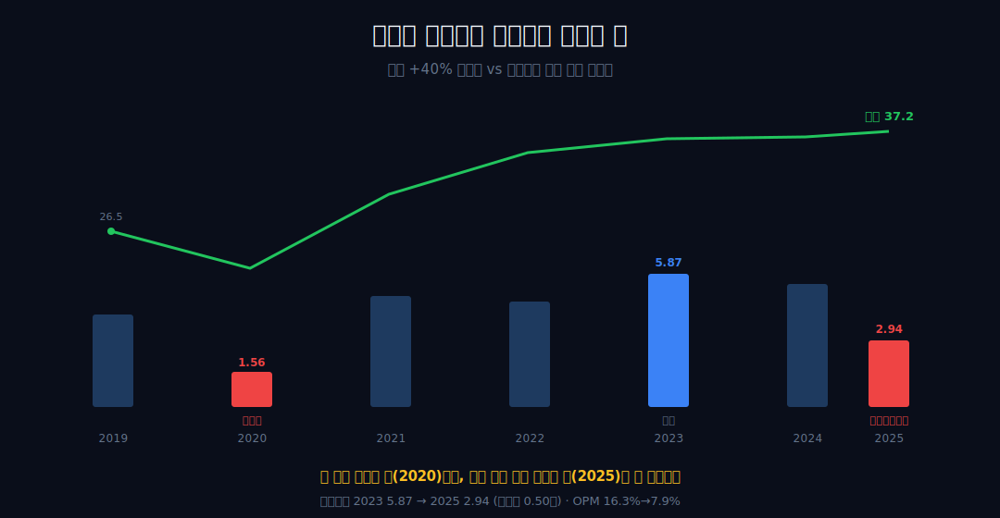
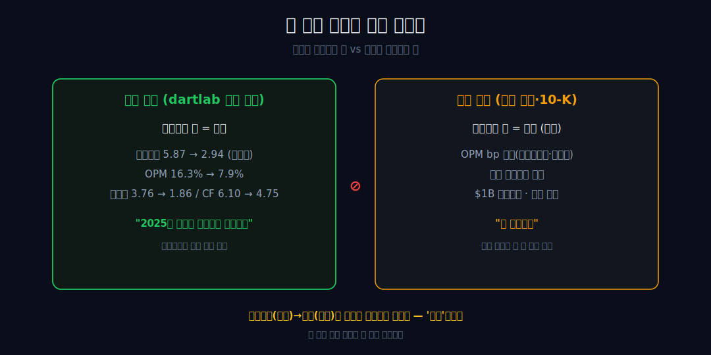
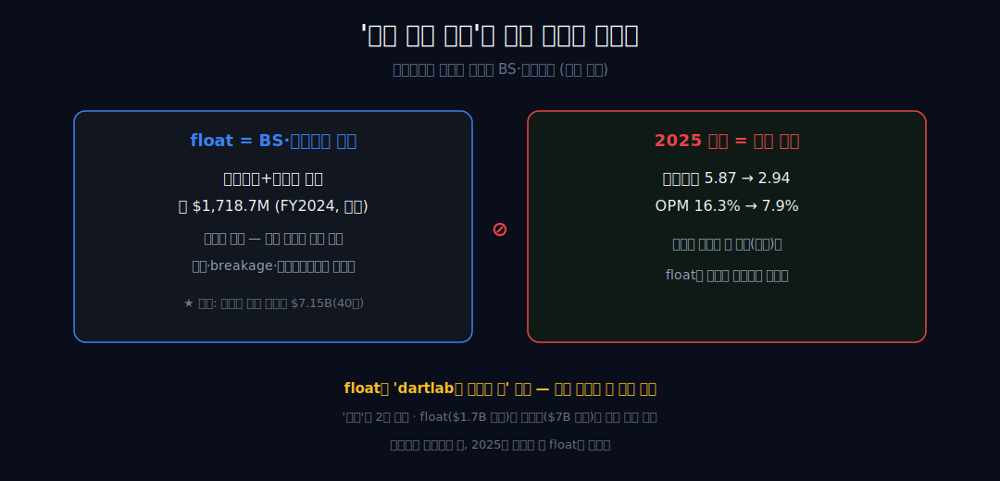
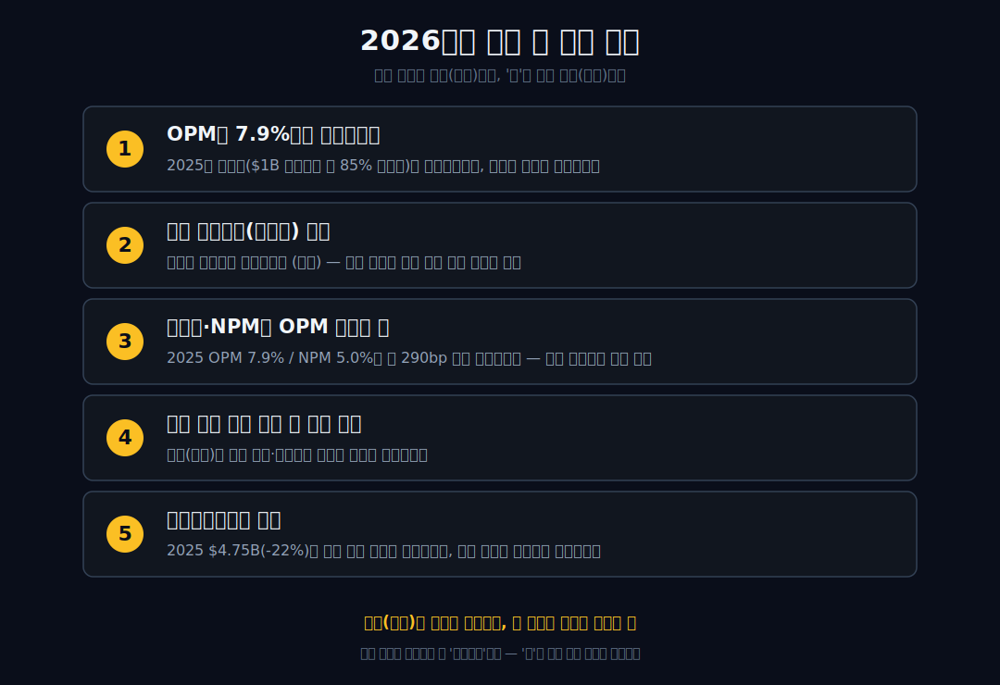

<script>
import ComboChart from '$lib/components/blog/ComboChart.svelte';
import StackBar from '$lib/components/blog/StackBar.svelte';
</script>

> **데이터 기준**: 2026-06-20 dartlab 실측 — Starbucks(SBUX) **미국 연결(USD)** 기준, 분기 데이터를 회계연도(9~10월말 결산)로 합산. OPM 붕괴의 bp 분해·세그먼트·$1B 구조조정·선불충전 float·네슬레 로열티는 연결 손익에 안 나오므로 **10-K·10-Q·실적보도(공시 보강)**로 표기. ※대차대조표·이연수익 항목은 매핑이 불안정해 인용에 주의.
>
> **핵심 숫자**: 매출 **$37.18B** (2019→2025 **+40%**) · 영업이익 **$2.94B** (OPM **7.9%**, 2023 피크 16.3% 대비 반토막) · 당기순이익 **$1.86B** (NPM **5.0%**) · 영업현금흐름 **$4.75B**
>
> **이 글의 용어**: OPM(영업이익률)·NPM(순이익률) = 별개 비율 · float(선불충전 예수금) = 고객이 미리 충전한 무이자 부채(이연수익, BS 항목) · breakage = 미사용 충전액의 수익 인식 · 평면 = 손익(IS)·재무상태(BS)·현금흐름(CF)이라는 서로 다른 회계 면.

---

## 프롤로그 — 문 닫아 무너진 해보다, 많이 팔고 무너진 해

2020년 스타벅스는 매장 문을 닫아서 영업이익이 **$1.56B**까지 주저앉았다. 그건 누구나 아는 위기다. 그런데 5년 뒤, 매장은 그 어느 때보다 많이 팔았고 매출은 사상 최대 **$37.18B**에 닿았는데 — 영업이익은 다시 **$2.94B**로, 그 코로나 해의 *두 배가 채 안 되는* 자리(1.88배)에 떨어졌다.



문을 닫아서 무너진 해와, 가장 많이 팔고도 무너진 해. dartlab 연결 손익이 단독으로 증명하는 것은 *후자가 더 이상한 사건*이라는 사실 하나다. 나머지 '왜'는 전부 회사 바깥의 이야기이고, 이 글은 그 경계를 섞지 않는다.

관통선을 먼저 쓴다 — 연결은 *결과*(2025에 성장과 수익성이 찢어졌다)를 증명하고, *원인*은 다른 평면(BS·세그먼트·회사 발표)에 있다. 그 평면을 끝까지 분리하는 것이 이 글이다.


---

## 1막 — 찢어진 해: 내부가 단독으로 증명하는 한 문장

**왜 이 회사를 봐야 하나.** 성장 곡선과 수익성 곡선이 같은 회사 안에서 정반대로 갈라졌기 때문이다.

```python
import dartlab
c = dartlab.Company("SBUX")
c.select("IS", ["매출액", "영업이익"], freq="Q")  # 분기→회계연도 합산
```

| 항목 ($B, 회계연도) | 2019 | 2022 | 2023 | 2024 | 2025 |
|---|---:|---:|---:|---:|---:|
| 매출 | 26.51 | 32.25 | 35.98 | 36.18 | **37.18** |
| 영업이익 | 4.08 | 4.62 | **5.87** | 5.41 | **2.94** |
| 연결 OPM | 15.4% | 14.3% | 16.3% | 15.0% | **7.9%** |

매출은 2019년 $26.51B에서 2025년 $37.18B로 **+40%** 꾸준히 컸다. 그런데 영업이익은 2023년 피크 $5.87B에서 2025년 $2.94B로 정확히 *절반(0.50배)*이 됐고, OPM은 2023년 피크 16.3%에서 7.9%로 떨어졌다.

붕괴폭은 기준을 명시해 쓴다 — 2023년 피크 16.3% 기준 약 840bp, 2024년 15.0% 기준 약 710bp 하락이다('16%대'로 뭉뚱그리지 않는다 — 2019년 15.4%·2024년 15.0%는 15%대였다). 성장 곡선과 수익성 곡선이 같은 회사 안에서 정반대로 갈라진 것 — 이것이 연결 손익이 단독으로 증명하는 유일한 강한 사실이다. 그렇다면 다음 질문은 자명하다: 이 찢어짐은 일시적 사고인가, 더 깊은 무언가인가?

---

## 2막 — 현금까지 같이 줄었다: 그러나 '붕괴'는 아니다

**이 찢어짐이 회계 장난일 뿐인가.** 아니다 — 현금 평면에서도 보인다.

```python
c.select("IS", ["당기순이익"], freq="Q")
c.select("CF", ["영업활동현금흐름"], freq="Q")
```

당기순이익은 2024년 $3.76B에서 2025년 $1.86B로, 영업현금흐름은 2024년 $6.10B에서 2025년 $4.75B(−22%)로 같이 내려왔다. 손익 악화가 현금 평면에서도 관찰된다.

그러나 점프하지 않는다 — 영업CF $4.75B는 여전히 순이익 $1.86B을 *웃돈다.* '현금이 붕괴했다'고 쓰면 거짓이다. 다만 이 '순이익을 웃돈다'를 곧장 '현금이 건강하다'로 읽지도 않는다 — 영업CF가 순이익을 상회하는 건 감가상각 같은 비현금 비용이 큰 사업의 정상 특성일 수 있고, 2025년에 그 배율이 커진 것은 *순이익이 더 급락한* 반사효과일 수도 있다. 그래서 여기까지는 관찰로만 둔다 — '현금 평면에서도 22% 줄었으나 절대액은 순이익을 상회한다.' 또 OPM 7.9%와 NPM 5.0%를 나란히 두되 *별개 비율*임을 명시한다. 둘 사이 약 290bp 갭이 왜 생기는지(세금·이자·비영업)는 연결 손익만으론 분리 불가라 인과 설명을 달지 않는다. 그렇다면 자연스러운 다음 질문 — 내부 숫자로 '왜' 무너졌는지를 가를 수 있는가? 가를 수 없다. 여기서 바깥으로 넘어가야 한다.

---

## 3막 — 여기서부터는 전부 회사 바깥의 이야기 (외부 인용 경계선)

**그럼 '왜'는 누가 말하나.** 회사다 — dartlab가 아니라.

FY2025 발표(외부 인용)에서 스타벅스는 OPM 하락을 직접 항목별로 분해해 제시했다 — 매출 디레버리지, 구조조정 비용, 'Back to Starbucks' 노동 투자, 인플레이션. 북미 세그먼트는 영업이익이 크게 줄고 OPM이 수백 bp 빠진 *진앙*으로 지목됐다(외부 인용).



그러나 이 숫자는 단 한 줄도 dartlab 연결 손익에 없다. 세그먼트 합이 연결과 어떻게 이어지는지도 검증 수치에 없다. 그래서 이 막부터의 모든 항목은 *'외부 인용'* 박스 안에 두고, 내부가 증명한 1막과 같은 톤에 섞지 않는다. 결정적으로 — 회사가 보고한 북미 약세를 연결 OPM 7.9% 붕괴의 '원인'으로 곧장 이어 쓰지 않는다. '연결 붕괴와 회사가 보고한 북미 약세는 *양립한다*'까지만이다(세그먼트→연결 연결 관계가 검증 수치 밖이므로). 거래건수 감소도 그 자체로는 거래건수라는 사실이지, '경험 가치가 떨어졌다' 같은 정성 서사로 번역하지 않는다.


---

## 4막 — 일회성과 구조적이 같은 해에 겹쳤다 (외부 인용·양립으로만)

**무너짐은 한 가지 원인인가.** 회사 발표(외부 인용)는 아니라고 말한다.

외부 인용에 따르면 2025년 마진 하락에는 세 종류가 동시에 작동했다고 설명된다 — (1) *일회성*: 약 $1B 규모의 구조조정 중 약 85%가 매장 폐쇄·자산손상·리스 같은 자산성 항목이고 현금성 감원은 그보다 훨씬 작다, (2) *구조적*: 거래건수(트래픽) 감소라는 수요 약세, (3) *의도적*: 'Back to Starbucks' 인력 재투자라는 반복성 비용. 회계상(GAAP)과 회사 조정(비-GAAP) 실적의 갭이 그 일회성 충격의 크기를 드러냈다(외부 인용).

즉 '인건비 탓'이라는 단순 도식은 외부 설명으로도 부정확하다 — 일회성만으로도, 구조적 수요 약세만으로도 환원되지 않는다. 그러나 다시 강조하면, 이 분해는 *회사가* 한 것이지 dartlab가 한 것이 아니다. 내부 숫자(2막)로는 일회성인지 구조적인지 가를 수 없었다. 이건 '회사 발표에 따르면 그렇게 설명된다'까지다. 그러면 다음 막에서 가장 유혹적인 곁가지, float로 넘어간다. 같은 '간판 뒤 다른 무엇'을 의심하게 만드는 [맥도날드](/blog/MCD-mcdonalds)의 임대료처럼, 스타벅스에도 유명한 숨은 각도가 있다.

---

## 5막 — '커피 파는 은행'이라는 곁가지: 흥미롭지만 다른 평면

**그럼 SBUX의 진짜 돈줄은 숨은 float 아닌가.** 매력적인 각도지만 *평면이 다르다.*

고객이 기프트카드·앱에 미리 충전한 금액과 로열티 잔액은 무이자 부채(이연수익)다 — 외부 인용 기준 FY2024 약 **$1,718.7M**, FY2023 약 $1,567.5M이다. 회사가 돈을 받아 두고 나중에 커피로 갚는, 사실상 무이자로 굴리는 '예수금'이라 *'커피 파는 은행'*이라는 비유가 붙는다(언론의 2차 해석).




그러나 float는 *BS·운전자본 항목이지 손익이 아니다.* 충전 시점엔 수익이 아니고, 사용(redemption)·breakage·이자수익으로만 손익에 흘러간다. 2025년 OPM 붕괴(손익)와는 *다른 회계 평면*에 있어 인과로 이어지지 않는다. 그래서 float를 'dartlab로 증명한 척'하지 않는다 — 검증 수치에 단 한 줄도 없다(이자수익 규모 등은 공시 표에서 직접 분리되지 않는다). 한 가지 더 — BS에 보이는 거대한 *장기* 이연수익(약 $6~7B대)은 이 단기 float가 아니라 네슬레와의 글로벌 커피 제휴 선수 로열티($7.15B를 약 40년에 걸쳐 인식)다. 둘을 합쳐 '숨은 자금'으로 과장하면 사실 오류다. 그래서 float는 글의 중심이 아니라 *열린 곁가지 각주*로 둔다. 결제망의 통행료를 떼는 [비자](/blog/V-visa)가 '무엇을 안 지는가'로 마진을 만든다면, 스타벅스의 float는 '무엇을 미리 받는가'의 이야기다 — 흥미롭지만, 2025년에 무너진 건 그게 아니다.

---

## 6막 — 시리즈 결을 비틀다: '진짜 돈줄'이 아니라 '간판의 마진이 배신한 해'

**그래서 이 회사는 '간판 ≠ 진짜 돈줄' 시리즈에 맞나.** 억지로 끼우면 float로 봉합해야 하는데, 그건 평면이 다르다.

더 정확한 결은 시리즈를 *비트는* 것이다 — SBUX는 '숨은 돈줄'의 회사가 아니라, *'간판(커피)이 매출은 키웠는데 그 간판의 마진이 배신한 해'*의 회사다. 2020년(매출 $23.52B, 셧다운으로 무너진 해)과 2025년(매출 $37.18B, 사상 최대인데 무너진 해)은 *정반대 종류*의 위기다 — 하나는 외생 충격, 하나는 가장 많이 팔고도 마진이 빠진 내생적 사건. 같은 '위기' 바구니에 넣으면 거짓이다.

그리고 이 글이 택한 원칙 — float·턴어라운드를 인과로 봉합하는 대신, '2025에 마진이 무너졌다'(내부 증명)와 '왜'(외부 인용)를 끝까지 다른 평면에 둔다. 그 평면 분리가 곧 결론이다. *문을 닫아서 무너진 해보다, 가장 많이 팔고도 무너진 해가 더 이상하다 — 그리고 그 '이상함'까지가 내부 숫자가 증명하는 전부이고, '왜'는 전부 회사 바깥의 이야기다.* 간판 뒤에 다른 엔진을 둔 [맥도날드](/blog/MCD-mcdonalds)·[코스트코](/blog/COST-costco)·[코카콜라](/blog/KO-coca-cola)와 달리, 스타벅스는 *간판 그 자체의 마진*이 흔들린 경우다 — 같은 배치의 [펩시코](/blog/PEP-pepsico)가 보여준 '디커플링'의 더 급격한 사촌이다.

---

## 2026년에 봐야 할 다섯 가지

1. **OPM이 7.9%에서 회복하는가** — 2025년이 일회성($1B 구조조정의 약 85%가 자산성)의 바닥이었는지, 구조적 수요 약세가 이어지는지. 두 자릿수 복귀 폭을 다음 연간 실측으로 확인.
2. **북미 거래건수(트래픽) 추세** — 회사 발표상 분기 거래 낙폭이 줄고 있다는데(외부), 거래가 *플러스*로 돌아서는지. 가격 상쇄가 아닌 진짜 방문 회복의 잣대.
3. **순이익·NPM과 OPM 회복의 갭** — 2025년 OPM 7.9% / NPM 5.0%의 약 290bp 갭이 좁혀지는지. 검증 수치로 분리 불가였던 갭의 방향성.
4. **중국 사업 지분 매각 종결 후 연결 변화** — 매각(외부 인용)이 연결 매출·영업이익 라인에 어떻게 반영되는지.
5. **영업현금흐름의 방향** — 2025년 $4.75B(−22%)가 마진 회복 없이도 반등하는지, 손익 약세가 현금 평면에서 지속되는지.



---

## 2026 공식 업데이트 — 매출 회복은 먼저 왔고, 마진 증명은 뒤에 남았다

2026년에 들어와서 스타벅스의 질문은 조금 더 까다로워졌다. 2025년 글의 결론은 "가장 많이 팔았는데 마진이 무너졌다"였고, 2026년 2분기 공식 발표는 그 문장을 단순히 되돌리지 않는다. 회사는 2026년 3월 29일 종료 분기 기준 순매출이 전년 대비 9% 늘어 **$9.5B**가 됐고, 글로벌 comparable store sales가 6.2% 늘었다고 발표했다. 같은 발표에서 GAAP EPS는 **$0.45**, non-GAAP EPS는 **$0.50**이었다. 표면만 보면 회복이 시작된 것처럼 보인다. 하지만 이 글의 기준은 매출이 아니라 마진이다. 그래서 "매출이 늘었다"와 "2025년 마진 붕괴가 해결됐다" 사이에 바로 등호를 넣지 않는다.

| 2026 Q2 공식 지표 | 수치 | 이 글에서의 판정 |
|---|---:|---|
| 순매출 | $9.5B, 전년 대비 +9% | 외형 회복 신호. 2025년 "많이 팔고도 무너진 해"의 다음 장면으로 중요 |
| 글로벌 comparable sales | +6.2% | 가격·티켓·거래가 같이 움직인 결과. 단, 연결 OPM 회복 증거와는 별개 |
| 글로벌 거래건수 | +3.8% | 2025년 약점으로 본 트래픽 논점에 직접 연결되는 회복 후보 |
| 글로벌 평균 티켓 | +2.3% | 매출 증가의 다른 축. 가격·믹스 효과와 양립하지만 연결만으론 분해 불가 |
| 북미 comparable sales | +7.1% | 진앙으로 보았던 북미의 회복 후보. 그러나 마진표와 함께 읽어야 함 |
| 국제 comparable sales | +2.6% | 중국 +0.5% 포함. 회복 강도는 북미보다 약함 |
| 매장 수 | 41,129개 | 규모는 계속 커졌고, 이 글의 원래 질문인 "많이 팔고도" 조건은 유지 |

여기서 중요한 건 10-Q의 비용표다. 2026년 2분기 연결 순매출은 **$9.5315B**, 영업이익은 **$828.1M**, 영업이익률은 **8.7%**였다. 전년 같은 분기의 영업이익률 6.9%보다는 좋아졌지만, 이 글이 문제 삼은 2025년 연간 OPM **7.9%**에서 "구조적 회복"이라고 부를 만큼 멀리 벗어난 수치는 아니다. 더구나 두 분기 누적 기준 영업이익은 **$1.7188B**로 전년 동기 **$1.7228B**와 거의 같고, 누적 영업이익률은 **8.8%**로 전년 동기 **9.5%**보다 낮다. 다시 말해 분기 하나는 회복처럼 보이지만, 반기 누적은 아직 "마진이 되돌아왔다"보다 "매출은 먼저 움직였고 비용 구조는 아직 판정 중"에 가깝다.

10-Q의 비용 비중을 더 좁혀 보면 왜 조심해야 하는지 보인다. 2026년 2분기 product and distribution costs는 순매출의 **33.7%**로 전년 **31.2%**보다 높았다. 회사는 mix와 inflation 효과를 설명한다. 반대로 store operating expenses는 매출 레버리지 덕분에 비율이 낮아졌지만, 노동 투자 부담이 일부 상쇄했다. 이 두 줄이 같이 존재한다는 게 핵심이다. 매출 레버리지는 살아났지만 원재료·유통·믹스 비용과 인력 재투자도 같이 남아 있다. 그래서 2026년 2분기 수치를 "턴어라운드 완료"가 아니라 "턴어라운드 검산의 첫 표본"으로만 둔다.

숫자를 한 줄로 바꾸면 이렇게 된다. 2025년은 매출 **$37.18B**에 OPM **7.9%**였고, 2026년 2분기는 매출 성장률이 분명히 좋아졌지만 분기 OPM **8.7%**, 반기 OPM **8.8%**다. 2023년 OPM **16.3%**와 2024년 **15.0%**를 기준선으로 보면, 아직 절반 조금 넘는 위치다. 매출 회복은 사실이고, 마진 회복은 아직 결론이 아니다. 이 글이 2025년에 세운 경계선 — "간판의 마진이 배신했다" — 는 2026년에도 같은 방식으로 검사해야 한다.

```python
# 2026 업데이트를 기존 결론에 붙일 때의 검산 순서
fy2025_opm = 2.94 / 37.18
q2_2026_opm = 0.8281 / 9.5315
h1_2026_opm = 1.7188 / 19.43  # 10-Q 누적 매출 근사 사용 시 별도 검산 필요
print(fy2025_opm, q2_2026_opm, h1_2026_opm)
```

이 코드는 실제 투자 결론을 내기 위한 모델이 아니라 글의 규율을 보여준다. 연간과 분기를 직접 비교할 때는 계절성, 구조조정, 매장 전환, 비용 인식 타이밍을 모두 경계해야 한다. 다만 비율의 방향을 확인하는 데는 충분하다. 스타벅스의 2026년 관찰은 "매출과 거래가 먼저 살아난다"와 "반기 마진은 아직 예전 체력으로 돌아오지 않았다"의 동시 존재다. 둘 중 하나만 고르면 글이 약해진다.

---

## 원래 질문에 겹쳐 읽기 — 가장 많이 팔고도 무너진 해의 다음 장면

2025년 글의 강점은 원인을 과감히 단정하지 않은 데 있다. 연결 손익은 "매출 최대, 영업이익 급락"을 증명했지만, 왜 그랬는지는 북미 트래픽, 구조조정, 노동 투자, 인플레이션, 세그먼트 믹스 같은 외부 자료에 맡겼다. 2026년 공식 업데이트도 같은 규율로 읽어야 한다. 북미 comparable sales +7.1%와 글로벌 거래건수 +3.8%는 분명히 2025년 약점에 대한 반대 방향의 관찰이다. 그러나 그것이 곧 2023년식 16%대 OPM 복귀라는 뜻은 아니다. 매장 방문이 늘어도 그 방문을 만들기 위해 더 많은 인건비, 더 높은 제품·유통 비용, 더 큰 프로모션이 필요했다면 마진 회복은 느리다.

이 지점에서 "성장"과 "회복"을 나눈다. 성장은 매출과 거래가 늘어나는 것이다. 회복은 그 증가분이 영업이익률을 의미 있게 끌어올리는 것이다. 2026년 2분기 스타벅스는 첫 번째를 공식 자료로 보여 줬다. 두 번째는 아직 부분 점수다. 분기 OPM은 전년보다 나아졌지만, 반기 누적 OPM은 전년보다 낮다. 그러므로 2026년을 반영한 더 강한 문장은 이렇다. 스타벅스는 2025년에 "가장 많이 팔고도 무너진 해"를 만들었고, 2026년 초에는 "더 많이 팔기 시작했지만, 예전 마진을 되찾았다는 증거는 아직 부족한 해"로 넘어갔다.

이 차이는 내부 링크로도 유용하다. [맥도날드](/blog/MCD-mcdonalds)는 간판 뒤 임대료 엔진을 읽는 글이고, [코스트코](/blog/COST-costco)는 상품 마진보다 멤버십 현금흐름을 읽는 글이다. 스타벅스는 그 반대다. 숨은 엔진으로 결론을 봉합하기보다, 초록 간판 자체의 마진이 회복되는지를 끝까지 봐야 한다. 결제망의 [비자](/blog/V-visa)나 [마스터카드](/blog/MA-mastercard)처럼 거래량 증가가 높은 마진으로 곧장 흘러가는 구조가 아니다. 스타벅스의 거래 증가에는 매장 운영, 인력 배치, 제품 믹스, 임대료, 원가가 붙는다. 그래서 매출 회복은 좋은 소식이지만, 결론의 절반에 불과하다.

중국 사업도 같은 방식으로 겹쳐 읽는다. 2026년 10-Q는 중국 소매사업과 관련된 held for sale 분류를 제시한다. 7,991개 company-operated China stores를 라이선스 구조로 전환하는 절차가 연결 매출과 영업이익의 모양을 바꿀 수 있다. 하지만 이 또한 "중국 매각이 마진을 해결한다"가 아니다. 매장 운영을 덜 직접 보유하면 연결 매출은 줄고 로열티 성격의 수익은 남을 수 있으며, 그 결과 OPM이 좋아 보일 수도 있다. 그러나 그것이 고객 수요 회복인지, 회계 표시 방식 변화인지, 비용 구조 개선인지 구분하지 않으면 착시가 된다. 2026년 이후 스타벅스 글에서 중국은 '좋다/나쁘다'가 아니라 '연결 표가 바뀌는 이벤트'로 읽어야 한다.

따라서 이 글의 원래 질문은 2026년에 더 좋아졌다. 2025년만 놓고 보면 "마진 붕괴"였다. 2026년 자료까지 붙이면 "매출과 거래가 돌아오는 순간에도 비용 구조가 얼마나 따라오는가"라는 더 좋은 질문이 된다. 회복 신호가 생겼기 때문에 오히려 기준이 높아졌다. 나쁜 숫자만 볼 때보다, 좋은 숫자와 아직 약한 숫자가 동시에 있을 때 글은 더 강해진다.

---

## GAAP와 non-GAAP를 섞지 않는 검산 노트

스타벅스 2026년 업데이트에서 가장 조심해야 할 부분은 GAAP와 non-GAAP를 한 문장에 섞는 습관이다. 회사 발표는 GAAP EPS **$0.45**와 non-GAAP EPS **$0.50**를 나란히 제시한다. 둘은 모두 쓸 수 있지만, 같은 결론의 같은 증거처럼 쓰면 안 된다. GAAP는 구조조정, 손상, 세금, 일회성 항목을 포함한 보고 기준이고, non-GAAP는 회사가 조정한 기준이다. 2025년 글에서 구조조정과 노동 투자, 비용 항목을 분리한 이유도 이 때문이다. "조정하면 좋아 보인다"는 말은 항상 "무엇을 조정했는가"를 같이 써야 한다.

| 검산 대상 | GAAP로 읽을 때 | non-GAAP로 읽을 때 | 글에서의 사용법 |
|---|---|---|---|
| EPS | 실제 보고 이익의 주당 몫 | 회사가 제외한 항목을 뺀 조정 이익 | 둘의 차이를 회복의 질 점검에만 사용 |
| 영업이익률 | 비용을 포함한 연결 체력 | 조정 항목을 제외한 운영 체력 후보 | 본문 결론은 GAAP OPM 우선 |
| 구조조정 | 손익에 들어온 비용 | 반복 영업력에서 제외될 수 있는 항목 | 일회성과 반복성을 분리하되, 완전 제거하지 않음 |
| 매장 전환 | 연결 매출·비용 표시를 바꿈 | 조정 기준에서 설명될 수 있음 | 회계 표시 변화와 수요 회복을 분리 |
| 노동 투자 | 비용 압박으로 나타남 | 장기 회복 투자로 설명될 수 있음 | 현재 마진에는 비용, 미래에는 가설 |

이 표의 결론은 간단하다. 스타벅스가 2026년에 보여 줘야 하는 것은 "조정 이익이 좋아졌다"가 아니라 "GAAP 기준 연결 마진이 지속적으로 올라간다"다. 단기적으로 구조조정 비용이 줄어 non-GAAP와 GAAP의 차이가 좁아지는 건 좋은 신호일 수 있다. 하지만 그것만으로 핵심이 끝나지 않는다. 2025년에 무너진 것은 조정 전 연결 OPM이었다. 그러므로 회복도 조정 전 연결 OPM에서 먼저 확인해야 한다.

또 하나의 검산은 거래와 티켓의 분리다. 2026년 2분기 글로벌 comparable sales +6.2%는 거래 +3.8%와 티켓 +2.3%의 조합이다. 가격과 티켓이 매출을 끌어올리는 회복은 마진에 다른 의미를 갖고, 거래가 매출을 끌어올리는 회복은 수요에 다른 의미를 갖는다. 둘 다 필요하다. 거래만 늘고 티켓이 눌리면 매장 처리량과 노동 투입 부담이 커질 수 있고, 티켓만 늘고 거래가 약하면 브랜드 수요 회복은 약하다. 이번 분기는 둘 다 플러스였다는 점에서 긍정적이다. 다만 그 증가가 product/distribution costs와 store operating expenses를 얼마나 이겼는지가 더 중요하다.

현금흐름도 같은 규칙을 따른다. 연간 글에서 스타벅스는 2025년 영업CF **$4.75B**로 순이익 **$1.86B**를 웃돌았다. 그래서 "현금 붕괴"라고 쓰지 않았다. 2026년에도 똑같다. 분기 EPS가 좋아 보여도 영업현금흐름이 따라오지 않으면 회복의 질은 약하고, 반대로 손익이 비용에 눌려도 현금이 강하면 턴어라운드의 바닥이 단단할 수 있다. 다만 분기 현금흐름은 재고, 보너스 지급, 리워드 부채, 카드 충전 사용 시점에 흔들린다. 따라서 분기 한 번보다 누적 2분기, 그리고 연간 마감이 더 중요하다.

마지막 검산은 중국 held for sale 분류다. 이 이벤트는 숫자를 좋아 보이게도, 나빠 보이게도 만들 수 있다. company-operated store가 라이선스 구조로 바뀌면 매출 총액은 줄 수 있지만, 비용도 줄고 로열티 성격의 수익률은 높아 보일 수 있다. 그때 OPM 개선을 "고객이 돌아왔다"로 읽으면 오류다. 매장 소유 구조 변화와 같은 계정 재배치는 소비자 수요 회복과 다른 평면이다. 이 글이 float를 손익 붕괴의 원인으로 쓰지 않았던 것과 같은 규율이다.

---

## 다음 공시에서 틀릴 조건 — 회복이라고 부르려면

이 글은 스타벅스에 비관적인 글이 아니다. 오히려 2026년 공식 숫자는 원래 결론을 업데이트할 조건을 몇 개 제공한다. 다만 조건이 충족되기 전에는 결론을 앞당기지 않는다. "회복"이라는 단어를 쓰려면 다음 다섯 개 중 최소 세 개는 같은 방향으로 움직여야 한다.

| 체크포인트 | 회복으로 인정할 신호 | 아직 부족한 신호 |
|---|---|---|
| 연결 OPM | 반기·연간 기준 두 자릿수에 안정적으로 진입 | 분기 하나만 8~9%대로 반등 |
| 거래건수 | 글로벌과 북미 거래가 여러 분기 연속 플러스 | 티켓 상승만으로 comparable sales가 유지 |
| 비용 비율 | product/distribution costs와 store operating expenses가 동시에 낮아짐 | 매출 레버리지 하나가 다른 비용 상승을 겨우 상쇄 |
| 중국 구조 변화 | 연결 매출 감소와 마진 개선의 회계 효과가 명확히 설명됨 | OPM 개선을 수요 회복으로 바로 해석 |
| 현금흐름 | 영업CF가 순이익을 웃돌 뿐 아니라 전년 대비 늘어남 | 순이익 급락의 반사효과로 배율만 높아짐 |

이 표는 투자 판단표가 아니라 글쓰기 검증표다. 예를 들어 다음 공시에서 매출이 또 늘고 거래가 플러스인데 OPM이 8%대에 머문다면, 결론은 "수요 회복은 더 분명하지만 비용 구조가 아직 따라오지 못한다"가 된다. 반대로 매출 성장률은 낮아져도 OPM이 두 자릿수로 올라가고 영업CF가 개선된다면, 결론은 "외형보다 질이 회복된다"로 바뀐다. 같은 매출 성장률이라도 마진과 현금의 방향에 따라 완전히 다른 글이 된다.

스타벅스가 특히 어려운 이유는 좋은 뉴스와 나쁜 뉴스가 같은 표에 나온다는 점이다. 거래가 돌아오면 매장 운영 부담도 커질 수 있다. 노동 투자는 단기 마진에는 비용이지만 장기 방문 회복에는 필요한 조건일 수 있다. 구조조정은 단기 GAAP 이익을 누르지만 이후 비용 기반을 낮출 수 있다. 중국 전환은 연결 매출을 줄일 수 있지만 마진율을 높일 수 있다. 그래서 한 줄 서사로 "턴어라운드 성공"이나 "브랜드 훼손"을 쓰는 순간, 회계 평면이 섞인다.

다음 업데이트에서 가장 강한 장면은 이렇다. 북미 거래가 계속 플러스이고, 글로벌 매출이 한 자릿수 중후반 성장률을 유지하며, product/distribution costs 비중이 내려가고, store operating expenses 비중도 내려가며, 연간 OPM이 두 자릿수로 올라가는 경우다. 그때는 2025년을 "일회성 비용과 노동 재투자가 겹친 바닥"으로 다시 쓸 수 있다. 반대로 가장 약한 장면은 매출은 성장하지만 반기 OPM이 8%대에 머물고, 현금흐름이 둔화하며, 중국 전환 효과를 빼면 본업 마진 회복이 보이지 않는 경우다. 그때는 2025년이 바닥이 아니라 새 체력의 시작일 수 있다.

현재 위치는 그 중간이다. 2026년 2분기는 좋은 매출과 거래 수치를 줬다. 동시에 반기 마진은 아직 예전 체력에서 멀다. 이 모순 때문에 스타벅스 글은 더 좋아진다. 확실히 나쁜 회사도, 이미 회복된 회사도 아니다. "가장 많이 팔고도 무너진 해" 다음에 "더 많이 팔기 시작했지만 아직 마진을 증명하지 못한 해"가 붙었다. 다음 공시의 임무는 이 문장을 지우거나 더 굵게 만드는 것이다.

---

## 공시 / Filings

아래 링크는 이 글에서 2026년 업데이트와 2025년 기준선을 검산할 때 사용한 1차 자료다. 숫자는 공식 자료에서 가져오되, 해석은 이 글의 회계 평면 분리 원칙에 맞춰 다시 배열했다.

| 자료 | 링크 | 이 글에서 사용한 내용 |
|---|---|---|
| Starbucks Q2 FY2026 results | [investor.starbucks.com](https://investor.starbucks.com/news/financial-releases/news-details/2026/Starbucks-Reports-Q2-Fiscal-Year-2026-Results/default.aspx) | 순매출 $9.5B, comparable sales, 거래건수, EPS, 매장 수 |
| Starbucks Q2 FY2026 Form 10-Q | [SEC filing](https://www.sec.gov/Archives/edgar/data/829224/000082922426000080/sbux-20260329.htm) | 2026년 2분기·반기 영업이익률, 비용 비중, 중국 held for sale 분류 |
| Starbucks FY2025 Form 10-K | [SEC filing](https://www.sec.gov/Archives/edgar/data/829224/000082922425000114/sbux-20250928.htm) | 2025년 연간 기준선, 구조조정·사업 설명 검산 |

공시를 붙인 뒤에도 이 글의 결론은 크게 바뀌지 않는다. 다만 뉘앙스는 더 선명해진다. 2025년의 핵심은 "매출 신고점에서 OPM이 무너졌다"였고, 2026년의 핵심은 "거래와 매출은 회복 신호를 보였지만, 반기 마진은 아직 과거 체력으로 복귀하지 않았다"다. 그래서 스타벅스의 다음 관찰은 매출 성장률 하나가 아니라 **거래·비용 비율·GAAP OPM·영업CF** 네 줄을 동시에 보는 일이다.

**업데이트 후 독법 1 — 좋은 분기와 좋은 연간 체력은 다르다.** 스타벅스의 2026년 2분기는 숫자 하나만 떼면 꽤 좋다. 전년 대비 매출은 늘었고, comparable sales도 플러스이며, 거래건수도 플러스다. 2025년에 가장 불편했던 질문이 "고객이 덜 오는가"였다면, 2026년 2분기는 적어도 그 질문에 반대 방향의 증거를 준다. 하지만 이 글은 분기 실적을 연간 체력으로 바로 승격하지 않는다. 스타벅스는 계절성이 있고, 구조조정 비용이 분기별로 다르게 들어가며, 프로모션과 노동 투입이 특정 분기에 집중될 수 있다. 더구나 중국 사업 전환처럼 연결 표시 자체를 바꿀 수 있는 이벤트도 있다. 따라서 좋은 분기 실적은 "회복 가능성"이지 "회복 완료"가 아니다. 글에서 필요한 문장은 단순하다. 매출과 거래는 좋아졌고, 누적 마진은 아직 예전 수준에서 멀다.

**업데이트 후 독법 2 — 매출 회복의 질을 따져야 한다.** 스타벅스의 매출은 상품 가격, 평균 티켓, 거래건수, 매장 수, 채널 믹스가 함께 만든다. 2026년 2분기처럼 거래와 티켓이 모두 플러스면 좋은 출발이다. 그러나 매출 회복이 가격 인상에 치우친 것인지, 방문 회복에 치우친 것인지, 신제품 믹스에 치우친 것인지에 따라 마진 의미는 달라진다. 거래가 늘면 매장 처리량과 노동 투입이 늘어날 수 있고, 티켓이 늘면 고객 저항과 반복 방문의 질을 봐야 한다. 제품 믹스가 바뀌면 product and distribution costs 비중이 흔들릴 수 있다. 그래서 comparable sales 숫자는 늘 마진표와 같이 읽어야 한다. 매출 회복이 마진 회복으로 번역되지 않으면, 2025년의 질문은 그대로 살아 있다.

**업데이트 후 독법 3 — 비용 비율의 두 줄을 동시에 본다.** 스타벅스 10-Q에서 product and distribution costs 비중이 올라간다는 사실과 store operating expenses 비중이 내려간다는 사실은 동시에 존재한다. 하나만 보면 결론이 반쪽이다. 제품·유통 비용 비중이 높아지는 것은 믹스, 인플레이션, 공급망, 제품 구성과 연결된다. 매장 운영비 비중이 낮아지는 것은 매출 레버리지와 연결된다. 그런데 노동 투자가 그 레버리지를 일부 상쇄한다면, 회복은 비용 한 줄의 승리가 아니라 여러 줄의 밀고 당기기가 된다. 이 글은 그래서 "인건비 때문에 무너졌다" 같은 단문을 쓰지 않는다. 제품 원가, 유통, 매장 운영, 노동 투자, 구조조정이 모두 다른 줄에 있다. 마진 회복은 이 줄들이 동시에 좋아질 때만 강해진다.

**업데이트 후 독법 4 — 중국 전환은 회복이 아니라 표시 변화일 수 있다.** 중국 company-operated store를 라이선스 구조로 전환하면 연결 매출, 비용, 자산, 부채, 감가상각, 영업마진 표시가 모두 바뀔 수 있다. 이 이벤트가 완료되면 스타벅스의 연결 손익은 더 가벼워 보일 수 있다. 하지만 가벼워 보이는 것과 고객 수요가 좋아지는 것은 다르다. 직접 운영 매출이 줄고 로열티 성격의 수익이 남으면 OPM은 좋아질 수 있지만, 그것은 사업 모델 표시의 변화일 수 있다. 그래서 다음 연간 비교에서는 중국 전환 효과를 빼고 북미와 나머지 국제 시장의 본업 체력을 따로 봐야 한다. 회계 표시가 좋아진 것을 브랜드 회복으로 오해하지 않는 게 중요하다.

**업데이트 후 독법 5 — float는 여전히 중심이 아니다.** 스타벅스에는 선불충전 잔액이라는 매력적인 곁가지가 있다. 고객이 미리 충전한 돈은 회사 입장에서는 무이자성 자금처럼 보이고, "커피 파는 은행"이라는 말도 그래서 나온다. 하지만 2026년 공식 업데이트를 붙여도 이 글의 중심은 float가 아니다. 2025년에 무너진 것은 손익계산서의 영업이익률이고, 2026년에 봐야 할 것도 GAAP OPM과 영업현금흐름이다. float는 재무상태표와 운전자본의 이야기다. 그것이 흥미롭다고 해서 2025년 마진 붕괴의 원인으로 끌어오면 평면이 섞인다. 이 글의 힘은 유혹적인 곁가지를 중심에 놓지 않는 데 있다.

**업데이트 후 독법 6 — 턴어라운드의 가장 좋은 증거는 밋밋하다.** 멋진 한 줄 뉴스가 아니라, 몇 개 분기 연속으로 반복되는 낮은 비용 비율과 두 자릿수 OPM이 진짜 증거다. 스타벅스가 2026년에 정말 좋아진다면 기사는 화려하지 않을 수 있다. 거래가 조금씩 늘고, 티켓이 무리하지 않게 유지되고, product/distribution costs 비중이 내려가고, 노동 투자가 매출 레버리지로 흡수되고, 구조조정 비용이 줄어든다. 그 결과 GAAP OPM이 10%, 11%, 12%로 천천히 올라간다. 이런 밋밋한 표가 가장 강한 턴어라운드다. 반대로 헤드라인 매출이 좋아도 비용 비율이 제자리면 글의 결론은 바뀌지 않는다.

**업데이트 후 독법 7 — 비교 대상은 2025년만이 아니라 2023년이다.** 2026년 2분기 OPM이 2025년 저점보다 높다고 해서 회복이라고 말하기 쉽다. 하지만 스타벅스의 진짜 체력 기준은 2023년 OPM 16.3%와 2024년 15.0%다. 2025년은 이미 크게 무너진 기준선이므로, 거기서 조금 나아지는 것은 바닥 반등일 수 있다. 회복이라는 단어는 최소한 두 자릿수 OPM, 더 강하게는 12~15%대 복귀를 요구한다. 이 기준을 높게 잡아야 글이 흔들리지 않는다. 낮은 기준과 비교하면 거의 모든 반등이 좋아 보인다. 높은 기준과 비교해야 구조적 체력 회복인지 보인다.

**업데이트 후 독법 8 — 결론은 열린 상태로 둔다.** 스타벅스는 이미 망가진 브랜드라고 단정할 수도 없고, 이미 회복된 회사라고 단정할 수도 없다. 2026년 2분기 공식 숫자는 회복 가능성을 보여 주지만, 반기 누적 마진은 아직 의심을 남긴다. 그래서 이 글의 최종 문장은 판결문이 아니라 체크리스트다. 다음 공시에서 거래, 티켓, 비용 비율, GAAP OPM, 영업CF가 같은 방향으로 움직이는지 보자. 다섯 줄이 같이 좋아지면 2025년은 바닥이었다. 두세 줄만 좋아지고 나머지가 엇갈리면 2025년은 새 비용 구조의 시작이었다. 지금은 둘 사이에 있다.

**업데이트 후 독법 9 — 회복의 좋은 경로는 느리다.** 스타벅스가 가장 설득력 있게 좋아지는 경로는 단번의 폭발적 실적이 아니다. 북미 거래가 몇 분기 연속 플러스로 유지되고, 평균 티켓 상승이 과도하지 않으며, 제품·유통 비용 비율이 내려가고, 노동 투자가 서비스 속도와 재방문으로 되돌아오는 느린 경로다. 이 경로에서는 매출 성장률이 아주 높지 않아도 OPM이 꾸준히 올라간다. 반대로 매출 성장률은 높지만 비용 비율이 같이 높아지면 회복의 질은 낮다. 스타벅스는 매장이 많은 회사라서, 작은 비용 비율 변화가 영업이익에 크게 번진다. 그래서 회복은 화려한 성장률보다 지루한 비용표에서 먼저 보일 가능성이 높다.

**업데이트 후 독법 10 — 나쁜 경로도 매출 증가로 시작할 수 있다.** 고객이 돌아오는 것처럼 보여도, 그 고객을 되찾기 위해 할인, 복잡한 메뉴, 더 많은 인력, 더 높은 임차·운영비가 필요하다면 마진은 회복되지 않는다. 매출은 늘지만 영업이익률이 8~9%대에 묶이는 장면이 바로 그 나쁜 경로다. 이 경우 스타벅스는 브랜드 수요를 지켰지만 경제성을 잃은 회사가 된다. 2025년 글이 무서운 이유도 여기에 있다. 사상 최대 매출은 이미 달성했는데도 OPM이 무너졌다. 따라서 다음 회복의 품질은 매출 총액보다 매출 1달러가 얼마나 많은 영업이익을 남기는지로 판정해야 한다.

**업데이트 후 독법 11 — 노동 투자는 비용이면서 옵션이다.** 'Back to Starbucks' 노동 투자는 단기적으로는 비용이다. 매장 인력을 늘리거나 교육과 운영 개선에 돈을 쓰면 영업마진은 눌릴 수 있다. 하지만 장기적으로는 거래 회복의 옵션일 수도 있다. 서비스 속도, 매장 경험, 대기 시간, 음료 품질이 좋아지면 고객 방문이 회복될 수 있다. 문제는 이 옵션의 성과가 손익표에 늦게 나타난다는 점이다. 그래서 2026년에는 노동 투자라는 설명을 무조건 긍정하거나 부정하지 않는다. 현재 표에서는 비용이고, 미래 표에서 거래와 마진을 같이 회복시키면 투자였다. 아직은 판정 전이다.

**업데이트 후 독법 12 — 매장 수는 규모의 증거지만 수익성의 증거가 아니다.** 스타벅스의 전 세계 매장 수 41,129개는 브랜드 규모를 보여 준다. 하지만 매장 수가 늘었다고 수익성이 좋아지는 것은 아니다. 회사운영 매장은 매출과 비용을 모두 연결로 가져오고, 라이선스 매장은 매출 인식 방식과 마진 구조가 다르다. 매장 수 증가가 company-operated 중심인지 licensed 중심인지에 따라 연결 손익의 모양이 바뀐다. 중국 전환까지 감안하면 2026년 이후 매장 수와 매출의 관계는 더 복잡해질 수 있다. 그래서 매장 수는 첫 번째 맥락이고, 결론은 OPM과 현금흐름에서 낸다.

**업데이트 후 독법 13 — 평균 티켓은 힘이자 부담이다.** 티켓 상승은 같은 거래 수에서도 매출을 키우는 힘이다. 하지만 커피 체인에서 티켓 상승은 고객 저항과 메뉴 복잡성이라는 부담을 같이 가져올 수 있다. 고객이 더 비싼 음료를 자주 사면 좋지만, 가격이 부담되어 방문 빈도가 줄면 장기 수요가 약해진다. 2026년 2분기는 거래와 티켓이 모두 플러스였기 때문에 긍정적이다. 그러나 다음 공시에서 티켓만 플러스이고 거래가 다시 약해진다면, 그 매출 성장은 질이 낮다. 스타벅스의 회복은 티켓이 아니라 거래와 티켓의 균형에서 나온다.

**업데이트 후 독법 14 — 연간 환산은 유혹적이지만 위험하다.** 2026년 2분기 매출을 네 배 해서 연간 매출로 단순 환산하고 싶을 수 있다. 하지만 스타벅스의 분기별 계절성, 프로모션, 구조조정 비용, 중국 전환, 라이선스 믹스가 모두 다르기 때문에 단순 연율화는 위험하다. 특히 마진은 분기별 비용 타이밍에 크게 흔들릴 수 있다. 그래서 이 글에서는 분기 OPM과 반기 OPM을 보여 주되, 2026년 연간 결론을 미리 쓰지 않는다. 연간 글은 연간 숫자로 써야 한다. 분기는 방향을 알려 주는 신호이고, 판결은 누적 데이터가 내려야 한다.

**업데이트 후 독법 15 — 브랜드 회복과 회계 회복을 분리한다.** 고객이 다시 매장에 오고, 앱 주문이 늘고, 매장 경험이 좋아지는 것은 브랜드 회복이다. 영업이익률이 올라가고, 영업CF가 늘고, 비용 비율이 내려가는 것은 회계 회복이다. 둘은 연결되지만 같은 것은 아니다. 브랜드 회복이 먼저 오고 회계 회복이 뒤따를 수 있고, 회계 조정으로 마진이 좋아 보여도 브랜드 회복은 약할 수 있다. 스타벅스는 소비자 브랜드이면서 대규모 운영 회사다. 그래서 두 회복을 나눠야 한다. 2026년 2분기는 브랜드 회복 후보를 보여 줬고, 회계 회복은 아직 검증 중이다.

**업데이트 후 독법 16 — 이 글의 최종 체크문장.** 다음 공시를 열 때 첫 줄은 매출이 아니다. "거래가 플러스인가, product/distribution costs 비중이 내려갔는가, store operating expenses 비중이 더 낮아졌는가, GAAP OPM이 두 자릿수에 가까워졌는가, 영업CF가 순이익을 안정적으로 웃도는가"다. 이 다섯 개가 같이 좋아지면 스타벅스의 2025년은 설명 가능한 바닥이 된다. 하나둘만 좋아지면 2025년은 구조적 비용 압박의 시작이다. 스타벅스 분석의 핵심은 이 문장을 계속 반복하는 것이다.

**업데이트 후 독법 17 — 같은 매출 성장률도 두 종류다.** 첫 번째는 가격과 티켓이 밀어 올리는 성장률이고, 두 번째는 더 많은 사람이 더 자주 방문해서 생기는 성장률이다. 둘 다 매출에는 좋지만 브랜드 체력에는 다른 의미를 갖는다. 가격 중심 성장은 단기 마진을 도울 수 있지만 반복 방문을 약하게 만들 수 있고, 거래 중심 성장은 브랜드 수요를 보여 주지만 운영비 부담을 키울 수 있다. 스타벅스는 이 둘을 동시에 관리해야 한다. 그래서 comparable sales 숫자 하나만 보고 결론을 내리지 않는다. 거래와 티켓의 조합이 다음 공시의 첫 번째 분해다.

**업데이트 후 독법 18 — 메뉴 복잡성은 숫자 밖의 비용이다.** 스타벅스의 메뉴와 커스터마이징은 고객 경험의 일부지만, 매장 운영에는 비용이 된다. 복잡한 음료가 많아질수록 대기 시간, 노동 투입, 재료 관리, 폐기율, 교육 비용이 늘 수 있다. 이 항목들은 손익표에 "메뉴 복잡성"이라는 이름으로 나오지 않는다. 대신 store operating expenses와 product/distribution costs의 비율에 흩어져 들어간다. 그러므로 운영 단순화가 성공했는지는 보도자료 문구보다 비용 비율에서 봐야 한다.

**업데이트 후 독법 19 — 리워드와 앱은 수요의 증거이자 부채의 원천이다.** 스타벅스 앱과 리워드 생태계는 고객 충성도를 보여 주는 강점이다. 동시에 선불충전, 리워드 포인트, 미사용 잔액 같은 회계 항목을 만든다. 이 구조는 편리하지만, 손익 마진 회복과는 다른 평면이다. 앱 사용이 늘어도 OPM이 회복되지 않으면 본문 결론은 유지된다. 반대로 OPM이 회복되면 앱과 리워드는 그 회복을 지탱한 운영 자산으로 다시 읽을 수 있다. 현재는 연결 손익에서 먼저 판정한다.

**업데이트 후 독법 20 — 북미가 먼저다.** 스타벅스의 연결 마진을 읽을 때 가장 큰 무게는 북미다. 2026년 2분기 북미 comparable sales가 강했다는 사실은 그래서 중요하다. 하지만 북미의 매출 회복이 노동 투자와 프로모션 부담을 이겨 냈는지는 별도 질문이다. 북미 매출이 늘고 북미 마진이 같이 올라가면 회복의 질은 강하다. 북미 매출만 늘고 마진이 약하면 트래픽 회복의 비용이 컸다는 뜻일 수 있다. 다음 공시는 북미 매출보다 북미 영업마진을 먼저 봐야 한다.

**업데이트 후 독법 21 — 국제 부문은 직접 비교가 어렵다.** 국제 부문에는 중국 전환, 라이선스 구조, 국가별 비용, 환율, 매장 성숙도 차이가 섞인다. 그래서 국제 영업마진을 북미와 단순 비교하면 위험하다. 특히 held for sale 처리나 감가상각 중단 효과가 있으면 특정 기간의 마진은 실제 운영력보다 좋아 보일 수 있다. 국제 부문은 성장의 선택지지만, 연결 결론은 조정된 비교가 필요하다. 이 글에서는 국제 수치를 회복의 보조 증거로 쓰되, 단독 결론으로 쓰지 않는다.

**업데이트 후 독법 22 — 구조조정 비용이 줄어드는 것과 본업이 좋아지는 것은 다르다.** 2025년에 큰 구조조정 비용이 있었다면, 2026년에 그 비용이 줄어드는 것만으로도 GAAP 이익은 좋아질 수 있다. 하지만 구조조정 비용이 줄어드는 효과와 매장 운영이 좋아지는 효과는 분리해야 한다. 전자는 낮은 비교 기준의 회복이고, 후자는 본업 체력의 회복이다. 다음 공시에서 조정 전후 차이가 줄어드는 것은 좋은 신호지만, 동시에 매출총비용과 매장 운영비가 개선되어야 더 강한 신호다.

**업데이트 후 독법 23 — 가장 나쁜 결론은 애매한 결론이다.** 스타벅스가 정말 약해졌다면 숫자는 명확할 것이다. 거래가 다시 마이너스가 되고, 비용 비율이 높아지고, OPM이 한 자릿수에 머물 것이다. 정말 회복됐다면 거래와 마진과 현금이 같이 좋아질 것이다. 가장 어렵고 가능성 높은 구간은 그 중간이다. 매출은 좋고 마진은 애매하며, 조정 이익은 좋아 보이고 GAAP는 덜 좋고, 중국 전환 효과가 숫자를 바꾸는 구간이다. 이 글은 그 애매한 구간을 버티기 위한 규칙을 남긴다.

**업데이트 후 독법 24 — 결론을 바꿀 숫자.** 스타벅스에 대한 내 결론을 바꿀 숫자는 명확하다. 연간 또는 최소 반기 기준 GAAP OPM이 두 자릿수로 올라가고, 북미 거래가 플러스를 유지하며, 영업CF가 전년 대비 증가하고, 중국 전환 효과를 빼도 본업 마진이 개선되는 경우다. 그때는 "간판의 마진이 배신했다"는 문장을 "간판의 마진이 복구되고 있다"로 고칠 수 있다. 아직은 그 문장까지 가지 않는다. 지금까지의 공식 자료는 가능성을 보여 줬고, 증명은 남겼다.

---

## 재무제표 — 최근 7개년 (dartlab 연결, $B)

> 미국 연결(USD)·분기 합산(회계연도 9~10월말) 기준. dartlab에서 직접 확인:
> ```python
> import dartlab
> c = dartlab.Company("SBUX")
> c.select("IS", ["매출액","영업이익","당기순이익"], freq="Q")
> c.select("CF", ["영업활동현금흐름"], freq="Q")
> ```

<ComboChart data={[{year:"2019",매출:26.51,영업이익:4.08,당기순이익:3.59},{year:"2020",매출:23.52,영업이익:1.56,당기순이익:0.92},{year:"2021",매출:29.06,영업이익:4.87,당기순이익:4.20},{year:"2022",매출:32.25,영업이익:4.62,당기순이익:3.28},{year:"2023",매출:35.98,영업이익:5.87,당기순이익:4.12},{year:"2024",매출:36.18,영업이익:5.41,당기순이익:3.76},{year:"2025",매출:37.18,영업이익:2.94,당기순이익:1.86}]} lineKeys={["매출"]} barKeys={["영업이익","당기순이익"]} lineColors={["#22c55e"]} barColors={["#3b82f6","#f59e0b"]} title="매출(라인) vs 영업이익·당기순이익(막대) — $B" unit="$B" />

| 항목 ($B) | 2019 | 2020 | 2021 | 2022 | 2023 | 2024 | 2025 |
|---|---:|---:|---:|---:|---:|---:|---:|
| 매출 | 26.51 | 23.52 | 29.06 | 32.25 | 35.98 | 36.18 | 37.18 |
| 영업이익 | 4.08 | 1.56 | 4.87 | 4.62 | 5.87 | 5.41 | 2.94 |
| 당기순이익 | 3.59 | 0.92 | 4.20 | 3.28 | 4.12 | 3.76 | 1.86 |
| 연결 OPM | 15.4% | 6.6% | 16.8% | 14.3% | 16.3% | 15.0% | 7.9% |
| 영업현금흐름 | 5.05 | 1.60 | 5.99 | 4.40 | 6.01 | 6.10 | 4.75 |

이 표를 한 줄로 읽으면 이렇다 — 매출 행은 2020년 셧다운 골을 빼면 멈춤 없이 우상향($26.5B→$37.2B)하는데, **영업이익 행은 2023년 $5.87B 피크를 찍고 2025년 $2.94B로 반토막**난다. OPM 행은 그 사건을 비율로 다시 보여준다(16.3%→7.9%). 두 개의 골이 보이는데 — 2020년(6.6%)은 *문을 닫아서*, 2025년(7.9%)은 *가장 많이 팔고도* 생긴 골이다. 매출 행만 따라 읽으면 회복한 회사지만, 영업이익·OPM 행을 겹쳐 보면 간판의 마진이 흔들린 흔적이 남는다. 그 흔적의 *원인*은 이 표 어디에도 없다(전부 외부 인용).

---

## 검증표

본문 인용 수치를 dartlab 호출과 결과로 검증한다. 공시 밖 항목(세그먼트·구조조정·float·네슬레)은 분리 표기. 📅 dartlab 실측 2026-06-20 · Starbucks(SBUX) 미국 연결(USD)·분기 합산 기준.

| 본문 수치 | 출처 / 호출 | 결과 |
|---|---|---|
| 매출 2019 26.51B → 2025 37.18B (+40%) | `c.select("IS",["매출액"],freq="Q")` 합산 | ✓ 실측 |
| 영업이익 2023 5.87B(피크) → 2025 2.94B (0.50배, 반토막) | `c.select("IS",["영업이익"])` | ✓ 실측 |
| OPM 2023 16.3% → 2025 7.9% (840bp / 2024 기준 710bp) | 영업이익÷매출 | ✓ 실측 |
| 당기순이익 2024 3.76B → 2025 1.86B (NPM 2025 5.0%) | `c.select("IS",["당기순이익"])` | ✓ 실측 |
| 영업현금흐름 2024 6.10B → 2025 4.75B (-22%), 순이익 상회 | `c.select("CF",["영업활동현금흐름"])` | ✓ 실측 |
| 2025 영업이익 2.94B = 코로나 해 1.56B의 1.88배(2배 미만) | 2.94÷1.56 | ✓ 산식 |
| OPM bp 4분해·북미 세그먼트 영업이익/OPM 약세·거래 감소 | [Starbucks FY2025 Form 10-K](https://www.sec.gov/Archives/edgar/data/829224/000082922425000114/sbux-20250928.htm) | 공식 공시 |
| $1B 구조조정(약 85% 자산성)·'Back to Starbucks' 노동 투자 | [Starbucks FY2025 Form 10-K](https://www.sec.gov/Archives/edgar/data/829224/000082922425000114/sbux-20250928.htm) | 공식 공시 |
| 선불충전+로열티 FY2024 약 $1,718.7M / FY2023 약 $1,567.5M (float, BS·이연수익) | [Starbucks FY2025 Form 10-K](https://www.sec.gov/Archives/edgar/data/829224/000082922425000114/sbux-20250928.htm) | 공식 공시·BS 평면 |
| 네슬레 선수 로열티 $7.15B(약 40년 인식) — float와 별개 / 중국 held for sale | [Starbucks FY2025 Form 10-K](https://www.sec.gov/Archives/edgar/data/829224/000082922425000114/sbux-20250928.htm) · [Starbucks 2026 Q2 Form 10-Q](https://www.sec.gov/Archives/edgar/data/829224/000082922426000080/sbux-20260329.htm) | 공식 공시 |
| 2026 Q2 net revenues 9.5315B / operating income 828.1M / OPM 8.7% / net earnings attributable 510.9M | [Starbucks 2026 Q2 Form 10-Q](https://www.sec.gov/Archives/edgar/data/829224/000082922426000080/sbux-20260329.htm) | 공식 공시 |
| 2026 H1 net revenues 19.4466B / operating income 1.7188B / OPM 8.8% / net earnings attributable 804.2M | [Starbucks 2026 Q2 Form 10-Q](https://www.sec.gov/Archives/edgar/data/829224/000082922426000080/sbux-20260329.htm) | 공식 공시 |
| 2026 Q2 comparable sales +6.2%, transactions +3.8%, average ticket +2.3%, U.S. +7.1%, International +2.6%, 매장 수 41,129개 | [Starbucks 2026 Q2 Form 10-Q](https://www.sec.gov/Archives/edgar/data/829224/000082922426000080/sbux-20260329.htm) | 공식 공시 |
| BS·이연수익 매핑 불안정 — 인용 주의 | dartlab 데이터 한계 | 주의/제외 |

본문의 숫자 중 이 표에 없는 것은 발행 차단 대상이다. 마진 붕괴의 '왜'·세그먼트·float·네슬레는 dartlab 연결로 증명되지 않으며 공식 공시 보강 항목임을 명시한다 — 내부가 증명하는 것은 '2025에 성장과 수익성이 찢어졌다'는 결과까지이고, 원인은 다른 평면에 있다.
