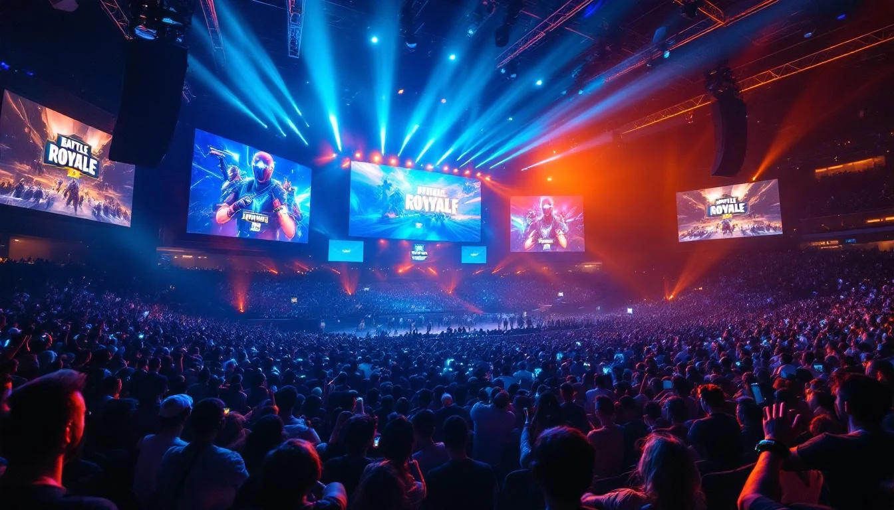

> **성장 + 자본배분** | IT > 게임 | 2026-04-09 dartlab 실측
> 같은 시리즈: [SK하이닉스](/blog/000660-skhynix) · [삼양식품](/blog/003230-samyang-foods) · [두산에너빌리티](/blog/034020-doosan-enerbility) · [알테오젠](/blog/196170-alteogen) · [HMM](/blog/011200-hmm) · [셀트리온](/blog/068270-celltrion) · [한화에어로스페이스](/blog/012450-hanwha-aerospace) · [HD현대일렉트릭](/blog/267260-hd-hyundai-electric) · [고려아연](/blog/010130-korea-zinc) · [에이피알](/blog/278470-apr) · [기업이야기 시리즈 전체](/blog/series/company-reports)

---

## 30,193억과 5,967억

```python
import dartlab
c = dartlab.Company("259960")
```

30,193억과 5,967억. 크래프톤의 현금성 자산이 2021년과 2025년에 찍은 숫자다. 4년 사이에 **24,000억이 사라졌다.**

같은 기간 PUBG는 매 분기 수천억을 벌어다 줬다. 5년 누적 잉여현금흐름(FCF) **29,352억**. 주주에게 돌아간 배당은 **0원**. 상환한 부채도 **0원**.

계산이 안 맞는다. 3조를 벌었는데 3조가 사라졌다.

그 돈으로 크래프톤이 사들인 것: 서브노티카의 개발사(5,858억), 인도 결제 플랫폼(776억), 스웨덴 게임 스튜디오, 일본 3대 광고회사(7,103억). 그리고 무형자산 장부에 **1조 8,042억**이라는 숫자가 남았다.

여기서 멈추고 재무상태표를 한 줄 더 내려보면 — 반전이 있다.

**단기당기손익공정가치금융자산.** 2021년 0원. 2022년 **24,506억.** 현금이 사라진 게 아니었다. **금융자산으로 옮겨간 것이다.** 2025년에도 **25,839억**이 여기 있다. 현금 계좌에서는 빠졌지만 회사 밖으로 나간 건 아니다.

그러면 진짜로 "나간 돈"은 얼마인가? 현금 3조의 행선지:

| 항목 | 2021 | 2025 | 변화 |
|------|------|------|------|
| 현금성 자산 | 30,193억 | 5,967억 | -24,226억 |
| **단기 금융자산** | 0 | **25,839억** | **+25,839억** |
| 무형자산 (인수) | 8,287억 | 18,042억 | +9,755억 |
| 투자부동산 | 1,833억 | 4,863억 | +3,030억 |

**현금이 사라진 게 아니다.** 금융자산에 2.6조, 인수에 1조, 부동산에 3천억. 그런데 이건 "안전하다"는 뜻이 아니다 — 금융자산은 시장가 변동에 노출되고, 무형자산에는 손상 리스크가 있다.

**"PUBG가 번 돈은 어디로 갔는가?"** — 현금 추적이 이 글의 이야기다.

---

## 1막 — 이메일 한 통, 13주 만에 1억 달러



2016년 2월, **김창한**이 아일랜드의 **브렌던 그린**에게 이메일을 보냈다. 10년간 정리한 배틀로얄 기획서를 첨부. 장병규 의장이 "브렌던을 영입해라"를 승인 조건으로 걸었다. 2017년 3월 스팀 출시. **13주 만에 누적매출 1억 달러.** 역대 최다 판매 PC게임.

```python
c.select("IS", ["매출액", "영업이익"], freq="Y")
```

| 연도 | 매출 | 영업이익 | 영업이익률 |
|------|------|---------|-----------|
| 2021 | 14,253억 | 4,125억 | 28.9% |
| 2022 | 32,495억 | 7,516억 | 23.1% |
| 2023 | 19,106억 | 7,680억 | 40.2% |
| 2024 | 27,098억 | 11,825억 | 43.6% |
| 2025 | **33,266억** | **10,544억** | **31.7%** |

5년간 매출 누적 **12.6조원**. PUBG가 그 중 **80%+**를 벌어다 줬다. 모바일 52%, PC 36%. 텐센트가 중국·글로벌 모바일을 운영하고, 크래프톤이 IP 로열티를 받는 구조.

영업이익률이 29~44%를 오간다. 게임 산업에서 이 정도 마진은 비정상적으로 높다. PUBG라는 단일 IP가 한 번 만들어진 뒤 추가 개발 비용 없이 계속 돈을 벌기 때문이다.

그런데 이 돈이 **회사에 안 남았다.** 어디로 갔는가?

---

## 2막 — 현금 3조를 손에 쥔 날, 그리고 쇼핑이 시작됐다

2021년 8월 10일. 크래프톤 코스피 상장. 공모가 498,000원. 역대 IPO 2위 규모(4.3조). 시초가는 **448,500원** — 공모가 아래에서 출발. "따상" 기대는 참패했지만, 통장에는 **현금 30,193억**이 쌓였다.

```python
c.select("BS", ["현금및현금성자산"], freq="Y")
```

| 연도 | 현금성 자산 |
|------|-----------|
| 2021 | **30,193억** |
| 2022 | 6,747억 |
| 2023 | 7,210억 |
| 2024 | 5,817억 |
| 2025 | **5,967억** |

2021년 3조 → 2022년 6,747억. **1년 만에 23,000억이 빠졌다.** 투자CF를 보면:

| 연도 | 투자CF |
|------|--------|
| 2021 | -10,044억 |
| 2022 | **-28,630억** |
| 2023 | -3,942억 |
| 2024 | -8,316억 |
| 2025 | -5,796억 |

2022년 투자CF **-28,630억**. 이 해에 크래프톤이 사들인 것:

| 시기 | 대상 | 금액 | 정체 |
|------|------|------|------|
| 2021.10 | 언노운 월즈 (미국) | 5,858억 + 언아웃 2,929억 | 서브노티카 개발사 |
| 2022 | 노틸러스 모바일 (인도) | ~165억 | 리얼 크리켓 게임 |
| 2022 | 캐시프리 (인도) | ~776억 | 결제 서비스 |
| 2022.11 | 네온 자이언트 (스웨덴) | 비공개 | 디 어센트 개발사 |

**게임회사가 인도 결제 앱을 샀다.** PUBG Mobile 인도(BGMI) 결제 인프라 확보 목적. 그리고 현금의 나머지는 **단기·장기 금융상품**으로 옮겨졌다 — 현금성 자산에서는 빠졌지만 회사 밖으로 나간 건 아니다. 다만 이 구분이 현금 항목만 보면 안 보인다.

---

## 3막 — 무형자산이 1년에 11,000억 뛰었다. 뭘 산 거지?

```python
c.select("BS", ["무형자산"], freq="Y")
```

| 연도 | 무형자산 |
|------|---------|
| 2021 | 8,287억 |
| 2022 | 8,605억 |
| 2023 | 6,078억 |
| 2024 | 6,562억 |
| 2025 | **18,042억** |

2024년 6,562억 → 2025년 **18,042억**. 1년에 **+11,480억**. dartlab 플래그: *"무형자산비율 +11%p 급등 — 대규모 인수 또는 영업권 증가."*

이 11,480억의 정체: **ADK**.

2025년 6월 24일. 크래프톤이 일본 3대 종합광고회사 **ADK**를 **7,103억원**(750억엔)에 인수한다. 덴쓰, 하쿠호도 다음 규모. 광고회사인데 왜 게임회사가 사나?

김창한 대표의 말: *"게임과 애니메이션 간 다양한 접점을 발굴하겠다."* ADK의 진짜 자산은 광고가 아니라 **애니메이션 IP 300편+**의 제작위원회 참여 역량. 게임 스튜디오 쇼핑(언노운 월즈, 네온 자이언트)에서 **IP 생태계 확장**으로 전략이 바뀐 신호다.

그런데 게임 스튜디오 쇼핑의 결과는 어땠는가.

---

## 4막 — 5,858억에 산 회사에서 2,445억이 증발했다

2021년 10월, 크래프톤이 서브노티카 개발사 **언노운 월즈**를 5,858억원(5억 달러)에 인수했다. 언아웃(추가 대금) 최대 2,929억 포함.

2024년, 크래프톤이 언노운 월즈에 대해 **손상차손 2,445억원**을 인식했다. 인수가의 42%가 날아갔다.

그런데 이야기가 더 있다. 2026년, 미국 법원 판결문에 이런 내용이 적시됐다 — 김창한 대표가 **ChatGPT를 활용해 언노운 월즈 CEO 해임 시나리오를 작성**했다. 법원은 CEO 복직을 명령했고, 언아웃 3,300억 관련 2단계 소송이 진행 중이다.

5,858억 + 잠재적 언아웃 2,929억 + 손상 2,445억 + 소송. 현금 추적의 가장 어두운 장이다.

dartlab에서 이 숫자의 흔적을 찾으면:

| 연도 | 당기순이익 | 영업이익 | 차이 |
|------|-----------|---------|------|
| 2024 | **13,026억** | 11,825억 | +1,201억 |
| 2025 | **7,337억** | 10,544억 | **-3,207억** |

2024년은 순이익이 영업이익보다 크다 — 영업 외에서 돈이 들어왔다. 2025년은 반대 — 영업 외에서 **3,207억이 빠졌다.** 이 안에 언노운 월즈 손상차손과 ADK 관련 비용이 섞여 있다.

---

## 5막 — 인수한 회사들이 비용으로 돌아왔다

3막에서 7,103억에 산 ADK. 4분기부터 연결 재무제표에 편입됐다. 그 순간 영업비용에 **분기 2,922억**이 추가됐다. 매분기 반복이다. 인수에 쓴 현금이 이제 **비용으로 돌아오고 있다.**

```python
c.analysis("financial", "비용구조")
```

| 연도 | 매출 | 영업비용 | 영업이익 | 영업이익률 |
|------|------|---------|---------|-----------|
| 2021 | 14,253억 | 10,129억 | 4,125억 | 28.9% |
| 2022 | 32,495억 | 11,024억 | 7,516억 | — |
| 2023 | 19,106억 | 11,425억 | 7,680억 | 40.2% |
| 2024 | 27,098억 | 15,273억 | 11,825억 | 43.6% |
| 2025 | 33,266억 | **22,722억** | 10,544억 | 31.7% |

영업비용 5년 만에 **2.2배**. ADK 편입 전(2024)까지는 15,273억이었는데, ADK가 들어온 2025년에 22,722억으로 **7,449억 뛴다.** 이 중 ADK 영업비용이 약 2,922억×분기 수.

여기에 **4분기의 비밀**이 있다.

| 분기 | 영업이익 |
|------|---------|
| 2025 1Q | 4,573억 |
| 2025 2Q | 2,461억 |
| 2025 3Q | 3,486억 |
| 2025 4Q | **24억** |

1~3분기 합계 10,520억. 4분기 24억. **99.3% 증발.**

4분기에 무슨 일이 있었는가:
- **ADK 연결 편입**: 영업비용 2,922억 추가 (4분기부터 반영)
- **공동근로복지기금**: 816억 일시 반영 (향후 4년치 선반영)
- **기타 일회성**: 소송비용 등 약 252억

ADK 2,922억은 **매분기 반복**. 복지기금 816억은 **일회성**. 둘을 분리하면 구조적 영업비용은 전분기 대비 오히려 소폭 감소했다.

---

## 6막 — FCF 29,352억, 배당 0원. 그리고 드디어

```python
c.analysis("financial", "자본배분")
```

| 연도 | FCF | 배당 | 잔여 |
|------|-----|------|------|
| 2021 | 0 | 0 | 0 |
| 2022 | 4,841억 | 0 | 4,841억 |
| 2023 | 6,268억 | 0 | 6,268억 |
| 2024 | 8,812억 | 0 | 8,812억 |
| 2025 | 9,431억 | 0 | 9,431억 |

5년 누적 FCF **29,352억**. 배당 **0원**. 전부 잔여(retained)로 남았다. 이 돈이 인수(언노운 월즈, ADK 등)와 금융상품 투자로 빠져나갔다.

그런데 2026년 2월, 변화가 왔다. 크래프톤이 선언한다: **3년 1조 주주환원.**
- 현금배당: 매년 1,000억씩 3년간 총 3,000억 — **창사 이래 첫 현금배당**
- 자사주: 7,000억 취득 + **전량 소각**
- 2026년 2월 10일부터 2,000억원 규모 자사주 매입 개시

5년간 배당 0원이던 회사가 왜 갑자기 1조를 돌려주는가? 두 가지 해석이 가능하다. **첫째**, 쇼핑(인수)의 성과가 아직 매출로 전환되지 않아서 주가가 압박받았다. **둘째**, inZOI 출시(1주 100만장)로 PUBG 다음의 IP가 확보됐다는 자신감.

dartlab 스코어카드:

| 영역 | 등급 |
|------|------|
| 수익성 | **A** |
| 안정성 | **A** |
| 현금흐름 | **A** |
| 이익품질 | **A** |
| 투자효율 | **A** |
| 성장성 | C |
| 효율성 | C |
| 재무정합성 | B |

A가 5개. 다만 성장C, 효율C. *"매출 성장 23%에도 이익 감소 -11% — 수익성 희석."* PUBG가 벌어주는 돈은 충분하지만, 그 돈을 쓰는 방식(인수, 인건비)이 이익을 깎아먹고 있다.

---

## 7막 — 현금 추적의 마지막 장: PUBG 다음에 돈을 벌 수 있는가?

현금 3조가 금융자산(2.6조)과 인수(1조)와 부동산(3천억)에 흘러갔다. 인수한 회사 중 언노운 월즈는 42% 손상. ADK는 아직 성과 미확인. 그러면 **이 돈이 매출로 돌아올 수 있는가?** PUBG가 매출의 80%+인 상태에서, "PUBG 다음"이 나와야 인수의 의미가 생긴다.

2025년 3월 28일. **inZOI** 스팀 얼리 액세스 출시. 40분 만에 글로벌 판매 1위. **1주 만에 100만장** — 한국 패키지 게임 역대 최단. 판매의 95%가 해외. The Sims에 처음으로 진짜 경쟁자가 생겼다는 평가.

그런데 재무제표에서 inZOI가 아직 보이는가? PC 매출에 포함돼 있지만, 분기별로 분리 공시되지 않는다. PUBG가 여전히 PC 매출의 대부분. inZOI가 "PUBG 다음"이 되려면 반복 매출(라이브 서비스)로 전환돼야 한다 — 한 번 사면 끝인 패키지와 매 분기 돈이 들어오는 라이브는 재무제표에 찍히는 방식이 다르다.

현재 크래프톤의 구조: **PUBG가 캐시카우, 인수+신작이 베팅.** HD현대일렉트릭의 "방산이 캐시카우, 우주가 베팅"과 같은 구도다. 다만 크래프톤은 캐시카우(PUBG)의 수명이 영원하지 않다는 점이 다르다 — 게임의 생명주기는 전력설비와 다르다.

---

## 이 회사를 계속 열어볼 숫자

**1. 무형자산 손상** — 18,042억 중 ADK 영업권 + 언노운 월즈 잔여. 추가 손상이 나오면 순이익이 깎인다.

**2. ADK 매출 기여** — 4분기부터 연결. ADK가 분기 3,000억+ 매출을 꾸준히 내는가. 게임×애니 시너지가 숫자로 보이는가.

**3. 배당 집행** — 매년 1,000억 배당 + 자사주 소각. 약속대로 이행하는가. 소각률 100% 유지.

**4. 영업비용 추이** — 22,722억이 ADK 일회성 제거 후 안정되는가, 계속 올라가는가.

**5. inZOI 반복 매출** — 패키지 판매 이후 DLC/라이브 서비스 매출이 분기별로 잡히는가.

---

PUBG가 5년간 벌어준 돈은 사라진 게 아니다. 금융자산에 2.6조, 무형자산에 1.8조, 부동산에 5천억. 잠들어 있다. inZOI가 1주 100만장을 찍었고, 3년 1조 주주환원이 시작됐다 — 베팅이 깨어나는 신호일 수 있다. 동시에 언노운 월즈에서 2,445억이 증발했고, ADK가 매분기 2,922억의 비용으로 돌아오고 있다. 다음 재무제표가 말해줄 것이다 — 이 베팅들이 매출이 되는지, 손상이 되는지.

```python
# 이 글의 모든 숫자를 직접 확인하려면
c.show("IS", freq="Y")
c.show("BS", freq="Y")
c.show("CF", freq="Y")
c.analysis("financial", "성장성")
c.analysis("financial", "자본배분")
c.analysis("financial", "종합평가")
c.review()
```

---

## 재무제표 5년 — IS / BS / CF

### 손익계산서 (IS) — 단위 억원

| 항목 | 2025 | 2024 | 2023 | 2022 | 2021 |
|---|---:|---:|---:|---:|---:|
| 매출 | 33,266 | 27,098 | 19,106 | 32,495 | 14,253 |
| 영업비용 | 22,722 | 15,273 | 11,425 | 11,024 | 10,129 |
| 영업이익 | 10,544 | 11,825 | 7,680 | 7,516 | 4,125 |
| 영업이익률 | 31.7% | 43.6% | 40.2% | 23.1% | 28.9% |
| 순이익 | 7,337 | 13,026 | 5,941 | 5,002 | 3,259 |

### 재무상태표 (BS) — 단위 억원

| 항목 | 2025 | 2024 | 2023 | 2022 | 2021 |
|---|---:|---:|---:|---:|---:|
| 총자산 | 94,336 | 79,195 | 64,405 | 60,303 | 56,351 |
| 부채 | 22,495 | 10,903 | 8,816 | 9,175 | 10,269 |
| 자본 | 71,841 | 68,291 | 55,588 | 51,129 | 46,082 |
| 현금성 자산 | 5,967 | 5,817 | 7,210 | 6,747 | 30,193 |
| 무형자산 | 18,042 | 6,562 | 6,078 | 8,605 | 8,287 |

### 현금흐름표 (CF) — 단위 억원

| 항목 | 2025 | 2024 | 2023 | 2022 | 2021 |
|---|---:|---:|---:|---:|---:|
| 영업CF | 10,451 | 9,079 | 6,623 | 5,127 | 6,218 |
| 투자CF | -5,796 | -8,316 | -3,942 | -28,630 | -10,044 |
| FCF | 9,431 | 8,812 | 6,268 | 4,841 | 0 |

---

## 검증표

| 본문 수치 | 출처 |
|-----------|------|
| 현금 30,193억(2021) → 5,967억(2025) | dartlab 실측 |
| FCF 5년 누적 29,352억, 배당 0 | dartlab 실측 |
| 무형자산 6,562→18,042억 (+11,480) | dartlab 실측 |
| 투자CF 2022 -28,630억 | dartlab 실측 |
| 4분기 영업이익 24억 | dartlab 실측 |
| 영업비용 10,129→22,722억 | dartlab 실측 |
| 스코어카드 5A, 성장C | dartlab 실측 |
| IPO 2021.08.10, 공모가 498,000원, 시초가 448,500원 | 비즈워치, 경향신문 |
| 2016년 김창한→브렌던 이메일, 13주 1억 달러 | 데일리팝, 게임메카 |
| 언노운 월즈 5,858억 인수, 2,445억 손상 | ZDNet, 톱데일리 |
| ChatGPT CEO 해임 시나리오 | AI타임스 |
| ADK 7,103억 (750억엔) 인수 | 한국일보, 뉴시스 |
| 복지기금 816억 (4년치 선반영) | 이코노믹민글 |
| ADK 연결 영업비용 2,922억 | 블로터 |
| 3년 1조 주주환원 (배당 3,000억 + 소각 7,000억) | 크래프톤 공식, 아주경제 |
| inZOI 1주 100만장, 40분 글로벌 1위 | 크래프톤 공식, PCGamesN |
| PUBG 매출 비중 80%+ | Korea Herald |
