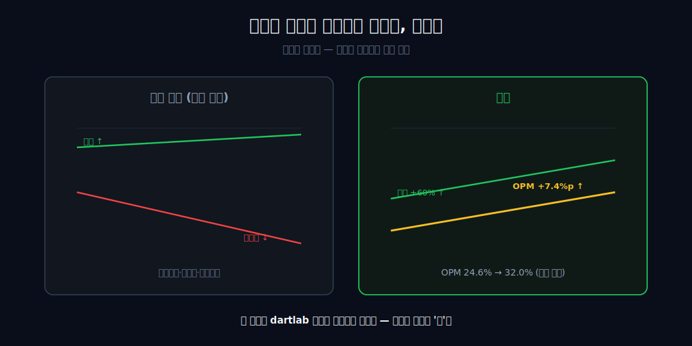
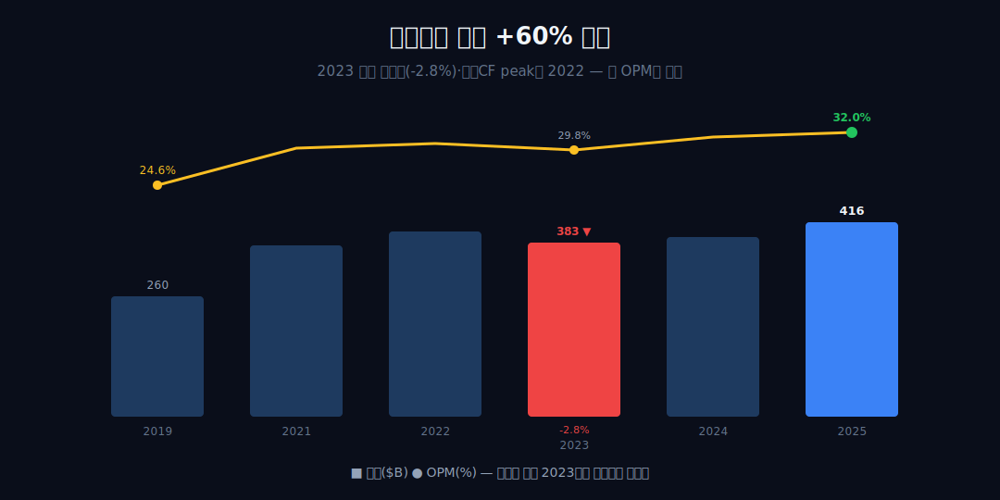
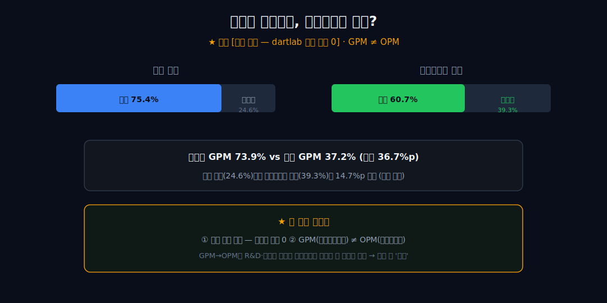
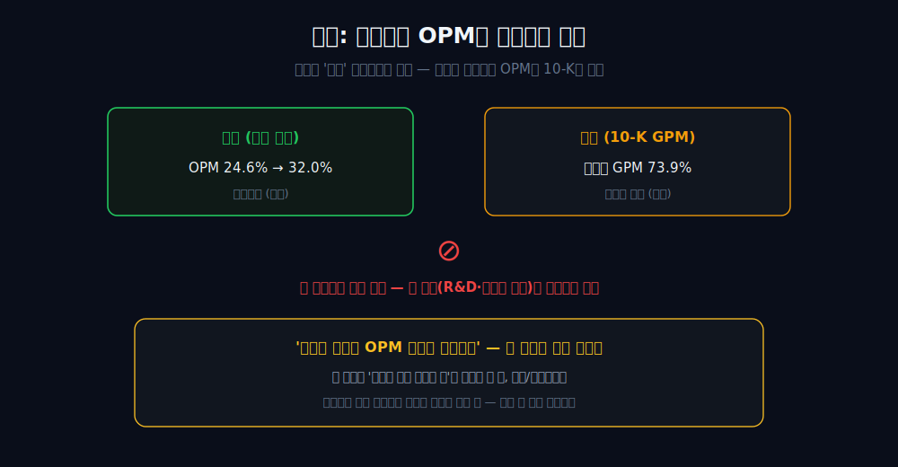
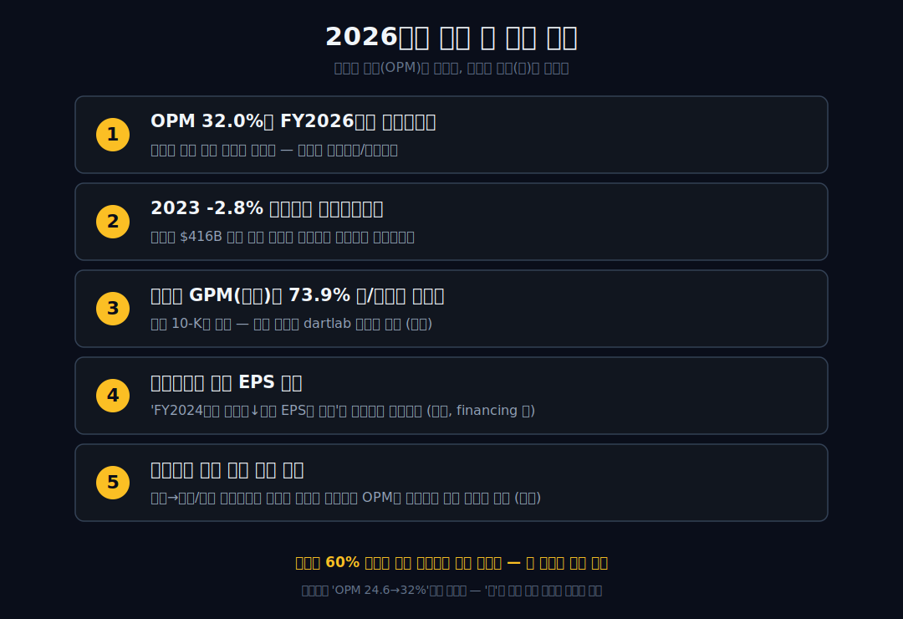

<script>
import ComboChart from '$lib/components/blog/ComboChart.svelte';
import StackBar from '$lib/components/blog/StackBar.svelte';
</script>

> **데이터 기준**: 2026-06-20 dartlab 실측 — Apple(AAPL) **미국 연결(USD)** 기준, 분기 데이터를 회계연도(9월말 결산)로 합산. 서비스 vs 제품 세그먼트 비중·GPM, 자사주·배당 환원은 연결 손익에 안 나오므로 **10-K·IR(외부 인용)**로 표기하며 dartlab 연결로는 증명되지 않는다. ※대차대조표 항목은 매핑이 불안정해 인용에 주의.
>
> **핵심 숫자**: 매출 **$416.2B** (2019→2025 **+60%**) · 영업이익 **$133.1B** (OPM **32.0%**) · 당기순이익 **$112.0B** · OPM 2019 **24.6%** → 2025 **32.0%** (+7.4%p 동행) · 2023 매출 **-2.8%** 역성장
>
> **이 글의 용어**: OPM(영업이익률)·GPM(매출총이익률)·NPM(순이익률) = 모두 별개 비율 · 디커플링 = 외형(매출)과 수익성(이익률)이 따로 움직이는 것 · 봉인 = 데이터가 답할 수 없어 질문을 '정합/양립'까지만 두는 것 · financing/BS 축 = 손익(IS)이 아닌 현금흐름·재무상태 항목.

---

## 프롤로그 — 규모를 키우면 마진율은 깎인다, 보통은

규모를 키우면 마진율은 깎인다. 이 시리즈에서 본 [코스트코](/blog/COST-costco)도, [펩시코](/blog/PEP-pepsico)도, [스타벅스](/blog/SBUX-starbucks)도 외형이 커질수록 영업이익률은 얇아지거나 무너졌다 — 흔한 방향이다. 그런데 애플은 6년간 매출을 60% 불리는 동안, 영업이익률을 24.6%에서 **32.0%**로 7.4%p 끌어올렸다.



외형과 마진율이 같은 방향으로 갔다. 이 문장은 제공된 dartlab 연결 손익으로 반박하기 어렵다. 문제는 그다음 한 글자 — **'왜'**다. 거기서부터 dartlab은 손을 벌려 외부 자료를 빌려야 한다.

관통선은 둘이다. 하나, 애플은 규모와 수익성 비율을 *동시에* 올린 드문 케이스다(연결이 증명). 둘, 그 *이유*는 연결 손익이 답하지 못한다(외부 인용·봉인). 이 글은 '확정된 관찰 → 봉인된 질문'의 2단으로 간다.


---

## 1막 — 비교 기준선: 보통은 마진율이 얇아진다

**왜 애플의 OPM 확대가 '대단한 일'인가.** 규모를 키울수록 마진율은 보통 *희석*되기 때문이다.

규모를 키울수록 저마진 물량·매대·점포가 섞여 들어와 이익률은 얇아지는 게 유통·소비재에서 흔한 방향이다. 앞선 글들이 그 방향을 숫자로 보여줬다 — 코스트코는 마진을 3%대에 묶었고, 펩시코는 외형 +40%에도 OPM이 12~15%에 갇혔으며, 스타벅스는 사상 최대 매출의 해에 OPM이 반토막 났다(각 글의 구체 수치 참조).

이건 애플을 칭찬하기 위한 게 아니라, *비교 기준선*을 세우기 위한 것이다. 그 기준선 위에서, 애플의 6년치 숫자가 이 통상 패턴 안에 있는지 밖에 있는지를 다음 막에서 연결 손익으로 직접 확인한다.

---

## 2막 — 애플은 거꾸로 갔다 (연결 손익 단독 증명)

**통상 패턴과 비교하면 애플은 어디 있나.** 정반대 자리에 있다.

```python
import dartlab
c = dartlab.Company("AAPL")
c.select("IS", ["매출액", "영업이익"], freq="Q")  # 분기→회계연도 합산
```

| 항목 ($B, 회계연도) | 2019 | 2021 | 2022 | 2024 | 2025 |
|---|---:|---:|---:|---:|---:|
| 매출 | 260.2 | 365.8 | 394.3 | 391.0 | **416.2** |
| 영업이익 | 63.9 | 108.9 | 119.4 | 123.2 | **133.1** |
| 연결 OPM | 24.6% | 29.8% | 30.3% | 31.5% | **32.0%** |

매출은 2019년 $260.2B에서 2025년 $416.2B로 **+60%**, 같은 기간 OPM은 24.6%에서 32.0%로 **+7.4%p**. 둘이 같은 방향이다. 영업이익(63.9→133.1)도 순이익(55.3→112.0)도 절대액과 비율이 함께 올랐다 — 디커플링의 정반대다.

정직하게 짚자 — 이 +60%·+7.4%p는 *시작점과 끝점*을 비교한 값이다(6년 구간 끝점). '매년 상승'이나 '6년 연속'이라고 쓰지 않는다 — 그 연속성은 곧 다음 막에서 의심한다. 그리고 OPM은 매출 대비 영업이익 비율일 뿐, 여기서 해자나 경쟁우위를 읽지 않는다. 곡선이 정말 매끈한지부터 보자.

---

## 3막 — 곡선을 의심한다: 2023, 외형은 꺾였다

**그 +60%는 한 번도 안 꺾인 직선인가.** 아니다.

```python
c.select("CF", ["영업활동현금흐름"], freq="Q")
```

2023년 매출은 $394.3B에서 $383.3B로 **-2.8% 역성장**했다. 영업현금흐름도 2022년 $122.2B가 peak였고, 2025년 $111.5B는 그 아래다 — 현금 창출이 매년 늘기만 한 게 아니다.



그런데 흥미로운 건, 그 역성장 해(2023)에도 OPM은 **29.8%**로 방어됐다는 점이다. 외형이 꺾여도 마진율은 버텼다 — 이 사실이 2막의 강사실을 오히려 단단하게 만든다. ('무한 성장'이나 '꺾이지 않는 신기록' 같은 서사는 여기서 사살된다. 또 영업CF가 영업이익보다 작은 건 발생주의 이익과 현금주의의 정상적 차이일 수 있어, 이상신호로 과대해석하지 않는다.) 그러면 이제 진짜 질문 — 마진은 *왜* 올랐나?

---

## 4막 — '왜'를 묻는 순간, dartlab은 손을 벌린다 (경계)

**마진은 왜 올랐나.** 연결 손익은 여기서 침묵한다.

마진이 왜 올랐는가에 대한 설명은 dartlab 연결로는 증명이 **0**이다. 외부 인용(FY2024 10-K)에 손을 벌리면 이렇다 — 매출 비중은 Services 24.6% / Products 75.4%인데, 매출총이익률(GPM)은 Services 73.9% vs Products 37.2%로 격차가 크고, 전사 매출총이익에서 Services가 차지하는 비중은 39.3%로 매출 비중(24.6%)보다 14.7%p 높다(전부 외부 인용).




여기서 *두 개의 경계*를 동시에 그어야 한다. 첫째, 이 수치는 전부 **[외부 인용 — dartlab 연결 증명 0]**이다. 둘째, **GPM(매출총이익률)과 OPM(영업이익률)은 별개 비율**이다 — GPM에서 OPM으로 가려면 R&D·판관비 배분을 건너뛰어야 하는데, 그 다리는 dartlab에도 10-K에도 없다. 그래서 '서비스가 진짜 돈줄이다'라고 단언하지 않는다. *'외부 인용 기준으로는 간판이 하드웨어(매출 75.4%·매출총이익 60.7%는 여전히 본업)이고, 매출총이익의 결정적 몫에서 서비스 비중이 매출 비중보다 높게 보인다'*까지다. 이 GPM 구조를 2막의 OPM 확대와 한 문장으로 잇는 순간 세 규율(내부↔외부 혼합·GPM↔OPM 혼동·관찰→인과)을 동시에 어긴다. 그래서 다음 막에서 그 금지선 자체를 글의 골격으로 박는다.

---

## 5막 — 봉인: 애플은 세그먼트 OPM을 공시조차 안 한다

**외부 GPM 구조가 그렇게 선명한데, 왜 OPM 확대의 원인이라고 못 박나.** 그 다리가 어디에도 없기 때문이다.

애플은 *지역* 세그먼트(미주·유럽·중국 등)로 보고한다. 그래서 'Services 세그먼트의 영업이익률(OPM)'은 10-K에 *존재조차 하지 않는다.* 매출총이익률(GPM)은 공시되지만, 거기서 R&D·판관비를 서비스와 제품에 어떻게 나눠 OPM을 만들지는 회사도 공시하지 않는다 — dartlab에도 10-K에도 그 분해가 없다.




그러므로 4막의 구조(외부 GPM)와 2막의 OPM 확대(내부)는 *'시간상 같이 일어난 두 관찰'*로 나란히 놓을 뿐, 한 문장으로 봉합하지 않는다. '서비스 믹스가 OPM 확대를 견인했다' — 이 한 문장이 가장 위험한 클리셰이고, 이 글은 그걸 쓰지 않는다. 그리고 이 *봉인*은 약점이 아니다. 데이터가 답할 수 없는 자리에서 답하는 척하지 않는 것 — 그게 이 글의 페이오프다. 같은 '간판 뒤 엔진' 의심이 외부 인용으로만 닿는 [코카콜라](/blog/KO-coca-cola)·[펩시코](/blog/PEP-pepsico)처럼, 애플의 진짜 엔진도 연결 손익 바깥에 있다.

---

## 6막 — 같은 규율로 자본정책까지: 환원은 다른 축

**마진 말고, 주주에게 돌려준 돈은 좋은 신호 아닌가.** 그건 다른 축의 이야기다.

외부 인용(FY2024)에 따르면 애플은 자사주 매입 약 $94.9B + 배당 약 $15.2B = 약 **$110.2B**를 환원해 그해 영업현금흐름(약 $118B)에 근접했다. 그러나 이는 현금흐름표의 *financing·BS 항목*이라 손익의 OPM·NPM과 회계적으로 분리된 별축이다.

게다가 — '환원이 많아서 좋았다'를 그해 데이터가 반증한다. FY2024 순이익은 전년 대비 **-3.4%**, 희석EPS는 **-0.8%**였다. '성장'이 아니라 자사주 매입으로 주식수가 줄어 '덜 하락'한 사례다. 그래서 환원→EPS→주가로 잇는 인과는 그해엔 성립조차 않는다.

정리하면 — 이 글이 내릴 수 있는 유일하게 정직한 결론은 두 겹이다. **애플은 규모와 수익성 비율을 동시에 올린 드문 케이스이고(연결 증명), 그 이유는 연결 손익이 답하지 못한다(외부·봉인).** 애플의 강사실은 'OPM이 24.6%에서 32.0%로 올랐다'에서 끝난다 — '왜'를 묻는 순간, 모든 문장은 증명이 아니라 인용이 된다. 외형이 커질수록 마진이 얇아진 [코스트코](/blog/COST-costco)·[스타벅스](/blog/SBUX-starbucks)의 정반대 거울이자, '왜'가 손익 밖에 있다는 점에선 같은 계열이다.

---

## 2026년 2분기 — 봉인은 더 선명해졌다

2026년 2분기 공시는 이 글의 결론을 약하게 만들지 않는다. 오히려 더 선명하게 만든다. 애플은 2026년 3월 28일로 끝난 분기에 매출 **111.184B**를 냈고, 전년 동기 대비 **+17%** 성장했다. 순이익은 **29.578B**, 희석 EPS는 **2.01달러**였다. 회사 보도자료는 "Services revenue reaches new all-time high"라고 말한다. 숫자만 보면 흔한 결론이 바로 튀어나온다. "서비스가 애플 마진을 끌어올렸다." 이 글은 그 문장을 일부러 쓰지 않는다.

왜냐하면 2026년 2분기 10-Q는 두 종류의 표를 동시에 보여주기 때문이다. 하나는 제품군별 매출과 gross margin 표다. 여기에는 iPhone, Mac, iPad, Wearables, Services가 나온다. 다른 하나는 reportable segment 표다. 여기에는 Americas, Europe, Greater China, Japan, Rest of Asia Pacific 같은 **지역**이 나온다. 즉 애플은 제품군별 매출총이익률은 보여주지만, 사업별 영업이익률은 보여주지 않는다.

이 차이가 전부다. 제품군별 gross margin은 "서비스가 매출총이익 단계에서 두껍다"는 관찰을 가능하게 한다. 그러나 reportable segment가 지역이기 때문에 "Services OPM"은 여전히 없다. R&D와 판관비가 서비스와 제품에 어떻게 배부되는지 알 수 없고, 따라서 서비스가 전사 OPM 32%대를 만들었다는 인과는 여전히 봉인된다.

2026년 2분기 숫자는 이 봉인을 더 어렵게 만든다. Services 매출은 **30.976B**, 전년 동기 **26.645B**에서 **+16%** 늘었다. iPhone 매출도 **56.994B**, 전년 동기 **46.841B**에서 **+22%** 늘었다. 즉 2026년 2분기는 "서비스만 좋았다"가 아니라 iPhone도 강했던 분기다. 애플이 스스로 말한 March quarter records에는 total company revenue, iPhone revenue, EPS가 같이 들어간다. 이 공시는 서비스 서사를 강화하지만 동시에 하드웨어 서사도 강화한다.

그래서 이 글의 후킹은 바뀌지 않는다. 애플은 외형과 OPM을 같이 올린 회사다. 다만 왜 그랬는지에 대해, 2026년 2분기 공시는 쉬운 답을 주지 않는다. 오히려 "제품군 gross margin은 보이지만 사업별 OPM은 안 보인다"는 구조를 더 또렷하게 보여준다. 데이터가 더 많아졌는데 답은 여전히 봉인된 상태다. 이게 애플 글의 핵심 보상이다.

---

## 제품과 서비스 — 보이는 것과 안 보이는 것

2026년 2분기 제품군 표를 보면 서비스의 존재감은 분명하다. 전체 매출 **111.184B** 중 Services는 **30.976B**다. 비중으로는 약 **27.9%**다. 그런데 gross margin 표로 내려오면 Services gross margin은 **23.752B**이고, Services gross margin percentage는 **76.7%**다. Products gross margin percentage **38.7%**의 거의 두 배다. 전체 gross margin percentage는 **49.3%**다.

이 표는 강하다. 하지만 강한 만큼 위험하다. 왜냐하면 독자가 보고 싶은 답과 실제 표가 답하는 질문이 다르기 때문이다. 표가 답하는 질문은 "제품군별 매출총이익 단계에서 어느 쪽이 두꺼운가"다. 표가 답하지 않는 질문은 "서비스가 전사 영업이익률을 얼마나 올렸는가"다. 전자는 10-Q가 보여준다. 후자는 10-Q가 보여주지 않는다.

이 차이를 수치로 보면 더 분명하다. 2026년 2분기 Services는 매출의 약 27.9%지만 gross margin의 약 43.4%(23.752/54.781)를 차지한다. 이 문장은 쓸 수 있다. Services가 매출 비중보다 gross margin 비중에서 더 크다는 뜻이기 때문이다. 그러나 "Services가 영업이익의 43%를 차지한다"는 문장은 쓸 수 없다. 영업비용 배부가 없기 때문이다.

또 하나의 함정은 iPhone이다. 2026년 2분기 iPhone 매출은 **56.994B**로 전년 동기 대비 **+22%**였다. Services 매출 성장률 +16%보다 높다. 애플의 2026년 2분기 성장은 "서비스만의 성장"이 아니다. 제품과 서비스가 같이 움직인 분기다. 이 점을 놓치면, 서비스 서사 하나로 모든 마진을 설명하는 글이 된다.

애플의 강함은 바로 이 양면성에 있다. 소비자에게 보이는 간판은 iPhone이고, 2026년 2분기에도 iPhone은 매출 성장을 강하게 끌었다. 동시에 Services는 gross margin 단계에서 훨씬 두꺼운 비율을 보인다. 하드웨어와 서비스가 서로 대체 관계가 아니라, 손익계산서의 서로 다른 줄에서 다른 역할을 하는 구조다. 하지만 이 역할 분담을 OPM까지 끌고 가려면 데이터가 모자란다.

그래서 이 글의 문장은 이렇게 닫혀야 한다. "서비스는 gross margin 단계에서 전사 수익성의 질을 높이는 방향과 정합한다." 여기까지는 가능하다. "서비스가 전사 OPM 확대의 원인이다." 여기부터는 불가능하다. 둘의 차이는 작아 보이지만, 블로그의 정직성에서는 전부다.

---

## 비용선 — 마진을 지키는 대신 연구개발이 커졌다

2026년 2분기 애플 공시에서 또 봐야 할 줄은 비용선이다. 같은 10-Q는 R&D 비용 **11.419B**, 전년 동기 **8.550B** 대비 **+34%**를 제시한다. SG&A는 **7.477B**, 전년 동기 **6.728B** 대비 **+11%**다. 총 operating expenses는 **18.896B**, 전년 동기 **15.278B** 대비 **+24%**다.

이 숫자는 애플의 마진 서사를 단순한 "서비스 고마진" 이야기로 만들지 못하게 막는다. 매출총이익률이 올라가도, R&D와 SG&A가 빠르게 늘면 OPM은 별도로 흔들린다. 2026년 2분기 R&D는 매출의 **10%**다. 전년 동기는 **9%**였다. 이는 AI, 인프라, 반도체, 소프트웨어 기능 경쟁이 손익계산서에 비용으로 들어오고 있다는 신호다. 회사는 R&D 증가를 인프라 관련 비용과 인력 관련 비용으로 설명한다.

여기서 "AI 비용 때문에 애플 마진이 망가진다"는 식의 결론도 빠르다. 2026년 2분기 전사 영업이익은 **35.885B**이고, 매출 대비 OPM은 약 **32.3%**다. 비용이 늘었는데도 OPM은 32%대다. 즉 애플은 R&D를 크게 늘리는 와중에도 영업마진을 지키고 있다. 이것이 더 중요한 관찰이다.

그러나 이 관찰도 인과로 바꾸면 안 된다. R&D가 늘어서 미래 성장이 보장된다는 말도 아니고, 비용 증가에도 마진이 유지됐으니 영원히 괜찮다는 말도 아니다. 2026년 2분기 10-Q는 거시 여건, 관세, 부품 공급, DMA·DOJ·Epic 같은 법적 리스크를 함께 적는다. 특히 관세와 부품 비용은 gross margin에 직접적인 하방 압력을 줄 수 있다. 회사도 미래 gross margin이 변동성과 하방 압력을 받을 수 있다고 설명한다.

애플을 강한 회사로 읽는 쉬운 길은 "서비스가 고마진이다"에서 끝난다. 그러나 2026년 2분기 공시는 더 복잡하다. iPhone이 다시 강했고, Services도 최고치를 찍었고, gross margin은 올라갔고, R&D는 34% 늘었고, 법적·관세 리스크도 늘었다. 이 다섯 줄이 동시에 존재한다. 이 글은 그 복잡성을 줄이지 않는다.

따라서 2026년 애플의 마진을 볼 때 핵심 질문은 "서비스냐 제품이냐"가 아니다. **제품과 서비스가 같이 성장하는 동안, R&D와 규제 비용이 OPM 32%대를 얼마나 잠식하는가**다. 서비스 서사는 마진의 한쪽 설명이고, 비용선은 그 설명을 검산하는 반대쪽 표다.

---

## 이 글이 틀리는 조건

이 글의 중심 주장은 단순하다. 애플은 외형과 OPM을 같이 올렸고, 그 이유를 서비스 하나로 단정할 수 없다. 이 주장은 다음 조건에서 틀린다.

첫째, 애플이 Products/Services 기준으로 영업이익 또는 영업이익률을 공시하기 시작하는 경우다. 지금은 reportable segment가 지역이어서 Services OPM이 없다. 만약 회사가 사업별 OPM을 공개하고, Services OPM이 전사 OPM 확대를 직접 설명한다면 이 글의 "봉인"은 풀린다. 그때는 봉인을 유지하는 게 아니라 글을 고쳐야 한다.

둘째, Services gross margin이 급격히 내려가고 전사 OPM도 같이 내려가는 경우다. 2026년 2분기 Services GPM은 76.7%이고 전체 GPM은 49.3%다. 이 구조가 유지될 때 서비스는 gross margin 단계에서 강한 보조 근거다. 그러나 서비스 GPM이 하락하고 전사 OPM도 꺾이면, 서비스 믹스 정합성은 약해진다.

셋째, iPhone 매출이 다시 크게 꺾이고 Services만 성장하는데도 OPM이 유지되는 경우다. 그러면 서비스가 OPM을 방어한다는 설명이 지금보다 강해질 수 있다. 반대로 2026년 2분기처럼 iPhone +22%, Services +16%가 같이 나타나는 분기에서는 서비스 단독 설명이 약하다.

넷째, R&D와 SG&A가 매출보다 빠르게 늘어 OPM 32%대가 무너지는 경우다. 2026년 2분기 R&D +34%, SG&A +11%, 총 operating expenses +24%는 가볍게 볼 수 없다. 비용선이 계속 매출 성장률을 앞지르면, gross margin이 좋아도 OPM은 압박을 받는다.

다섯째, 법적·규제 리스크가 서비스 경제성을 직접 바꾸는 경우다. DMA, DOJ, Epic 관련 이슈는 서비스 수익화 방식과 앱스토어 경제성에 영향을 줄 수 있다. 이 글은 법적 결과를 예측하지 않는다. 다만 서비스 GPM이 높은 구조가 규제 변화에도 유지되는지는 앞으로 확인해야 한다.

그래서 애플 글의 결론은 "서비스가 답이다"가 아니라 "서비스라고 말하고 싶을수록 더 조심해야 한다"다. 2026년 2분기 공시는 서비스의 강함을 보여줬지만, 동시에 iPhone의 강함과 R&D 비용의 확대도 보여줬다. 데이터가 한쪽 답으로 깔끔하게 접히지 않는다. 애플의 진짜 강함은 그 복잡한 표를 견디면서도 OPM 32%대를 유지한다는 데 있다.

### 애플을 읽는 가장 위험한 문장

애플을 읽을 때 가장 위험한 문장은 "서비스가 마진을 올렸다"다. 이 문장은 너무 그럴듯하다. Services GPM은 76.7%이고 Products GPM은 38.7%다. Services 매출 비중은 약 27.9%인데 gross margin 비중은 더 높다. 숫자만 보면 서비스가 전사 수익성을 끌어올린 것처럼 보인다. 문제는 "gross margin"에서 "operating margin"으로 넘어가는 다리가 공시에 없다는 점이다.

이 다리가 없으면 문장의 강도가 달라져야 한다. "서비스가 gross margin 단계에서 두껍다"는 강한 사실이다. "서비스가 전사 OPM 확대와 정합한다"는 조심스러운 해석이다. "서비스가 전사 OPM을 올렸다"는 증명되지 않은 인과다. 셋은 비슷해 보이지만, 독자에게 전달하는 정확도는 완전히 다르다.

왜 이런 구분이 중요한가. 애플은 제품과 서비스가 분리된 회사처럼 보이지만, 실제 소비자 경험은 분리되지 않는다. iPhone이 팔려야 App Store와 구독, 클라우드, 광고의 접점이 커진다. Services가 두껍다고 해서 하드웨어가 덜 중요해지는 게 아니다. 2026년 2분기 iPhone 매출이 +22%였다는 사실은 이 구조를 다시 보여준다. 서비스는 하드웨어 위에 올라탄다.

그래서 애플의 마진은 "제품 vs 서비스"의 승패가 아니라 "제품이 만든 설치 기반 위에서 서비스가 얼마나 두껍게 붙는가"의 문제다. 그런데 이 문장도 OPM 인과로 쓰면 안 된다. 설치 기반, 서비스 이용, 매출총이익, R&D, SG&A, 지역별 비용 구조가 모두 섞이기 때문이다. 애플은 이 연결고리를 충분히 자세히 공개하지 않는다.

애플 글이 독자에게 줘야 하는 보상은 답이 아니라 경계다. 많은 글이 "서비스 비중 상승"을 답으로 제시한다. 이 글은 그 답을 반쯤만 인정한다. 서비스는 중요하다. 하지만 서비스가 전사 OPM을 얼마나 만들었는지는 공식 공시로 확인할 수 없다. 그래서 "그럴듯한 답"을 "검증된 답"으로 승격하지 않는다.

### 2026년 2분기에서 정말 달라진 것

2026년 2분기는 애플의 강사실을 갱신했다. 매출 111.184B, 순이익 29.578B, EPS 2.01달러는 모두 강한 숫자다. 그러나 이 글의 관점에서 더 중요한 변화는 제품군 표의 구성이 더 또렷해졌다는 점이다. iPhone은 다시 강했고, Services도 최고치를 찍었다. 즉 애플의 2026년 2분기는 "서비스 전환"이 아니라 "하드웨어와 서비스의 동시 강세"에 가깝다.

이 동시 강세는 투자자에게 좋지만, 해석자에게는 까다롭다. 서비스만 좋아졌다면 서비스 서사의 힘이 커진다. iPhone만 좋아졌다면 하드웨어 사이클 서사가 커진다. 그런데 둘이 같이 좋아졌다. 그러면 전사 OPM 32%대의 원인을 한쪽으로 몰아줄 수 없다. 제품 mix, 환율, 가격, 부품 비용, 서비스 mix, R&D 비용, SG&A 효율이 함께 움직인다.

10-Q는 제품 gross margin 증가 이유로 제품 mix와 환율, 비용을 언급한다. Services gross margin 증가 이유로는 Services net sales, services mix, 환율, 비용을 언급한다. 여기서도 애플은 원인을 하나로 줄이지 않는다. 제품 쪽도 mix이고, 서비스 쪽도 mix다. 환율은 양쪽에 영향을 준다. 비용은 양쪽에서 압박한다.

이런 공시를 한 문장으로 줄이면 손실이 생긴다. "서비스 덕분"이라고 쓰면 iPhone +22%가 사라진다. "iPhone 덕분"이라고 쓰면 Services GPM 76.7%가 사라진다. "환율 덕분"이라고 쓰면 R&D +34%와 법적 리스크가 사라진다. 애플의 2026년 2분기는 한 줄 요약이 아니라, 서로 다른 표를 겹쳐 읽어야 하는 분기다.

따라서 이 글의 추가 결론은 이렇다. 2026년 2분기 공시는 기존 봉인을 풀지 않았고, 오히려 봉인을 더 정당화했다. 데이터가 더 많아졌는데도 Services OPM은 없다. 제품과 서비스가 둘 다 강했기 때문에 단일 원인 설명은 더 위험해졌다. 애플은 강하지만, 그 강함은 한 단어로 설명되지 않는다.

### 비용선이 주는 반전

많은 애플 해석은 매출과 gross margin에서 멈춘다. 그런데 2026년 2분기에는 비용선이 더 흥미롭다. R&D가 11.419B로 +34% 늘었고, SG&A도 7.477B로 +11% 늘었다. 총 operating expenses는 18.896B다. 비용이 이 정도로 늘었는데도 영업이익은 35.885B이고 OPM은 약 32.3%다.

이 말은 두 가지를 동시에 뜻한다. 첫째, 애플은 미래 기능과 인프라, 인력에 더 많은 비용을 쓰고 있다. 둘째, 그 비용 증가를 현재의 gross margin과 매출 규모가 아직 흡수하고 있다. 비용선이 커졌는데 마진이 유지되는 상태는 강한 상태다. 하지만 동시에 앞으로 더 봐야 할 리스크다. 비용이 더 빨라지면 OPM은 압박받는다.

특히 AI 기능은 여기서 조심해야 한다. 10-Q는 AI를 미래 리스크와 품질 문제의 한 요소로 언급한다. 하지만 "AI 때문에 R&D가 늘었다"라고 단정하려면 부족하다. 회사는 R&D 증가를 인프라 관련 비용과 인력 관련 비용으로 설명한다. AI는 그 일부일 수 있지만, 공시 문장만으로 전부라고 말할 수 없다.

규제 비용도 마찬가지다. DMA, DOJ, Epic은 서비스 경제성의 주변부가 아니라 핵심에 가까울 수 있다. App Store의 수수료 구조나 외부 결제 링크, 개발자와의 관계는 서비스 gross margin에 영향을 줄 수 있다. 그러나 법적 결과가 아직 확정되지 않은 상태에서 매출·마진 추정으로 넘겨버리면 추정이 된다. 이 글은 추정 숫자를 만들지 않는다.

그래서 애플의 비용선은 봉인을 더 단단하게 만든다. OPM은 연결 손익으로 볼 수 있지만, OPM의 원인을 제품·서비스·비용·지역·규제 중 어디에 얼마나 배분할지는 공시가 허락하지 않는다. 독자가 답을 원할수록, 글은 선을 지켜야 한다. 이 선을 지키는 것이 애플 글의 품질이다.

### 다음 공시에서 표를 읽는 순서

다음 애플 공시를 볼 때는 세 표를 순서대로 봐야 한다. 먼저 연결 손익이다. 매출, 영업이익, 순이익, OPM이 계속 같은 방향인지 확인한다. 이 표는 dartlab으로도 검증 가능한 중심축이다.

둘째, 제품군 매출과 gross margin 표다. iPhone, Mac, iPad, Wearables, Services가 각각 얼마나 자랐는지 보고, Products GPM과 Services GPM의 격차가 유지되는지 본다. 여기서 알 수 있는 것은 gross margin 단계의 두께다. 여기서 OPM 원인을 결론내리지 않는다.

셋째, operating expenses 표다. R&D와 SG&A가 매출보다 빠르게 늘어나는지, 그럼에도 OPM이 유지되는지 본다. 이 표를 빼면 서비스 서사는 지나치게 깨끗해진다. 서비스가 두꺼워도 비용선이 더 빠르게 커지면 전사 OPM은 눌린다.

이 세 표를 분리해 읽으면 애플은 더 흥미로운 회사가 된다. 외형과 OPM이 같이 올라간 강사실은 유지된다. 서비스의 높은 GPM도 유지된다. 동시에 Services OPM이 미공시라는 한계도 유지된다. 독자는 답 하나를 얻는 대신, 답을 검증하는 순서를 얻는다. 애플처럼 잘 알려진 회사일수록 이 순서가 더 중요하다.

마지막으로, 애플 글은 "몰라서 못 쓴다"가 아니다. **공식 공시가 알려주는 것과 알려주지 않는 것을 나누는 글**이다. 알려주는 것: 애플은 매출과 OPM을 같이 올렸고, 2026년 2분기에도 제품·서비스 gross margin 구조가 강했다. 알려주지 않는 것: Services가 전사 OPM 확대에 얼마나 기여했는가. 이 두 문장을 같이 들고 가야 애플을 과대해석하지 않는다.

---

## 2026년에 봐야 할 다섯 가지

1. **OPM 32.0%가 FY2026까지 이어지는가** — 연결로 직접 검증 가능한 추적점. 확대가 멈추는지/꺾이는지.
2. **2023 -2.8% 역성장이 단발이었는가** — 매출이 $416.2B 위로 외형 성장을 재개하면서 마진율도 동행하는지.
3. **서비스 GPM(외부)이 73.9% 위/아래로 가는가** — 최신 10-K로 갱신(연결 증명은 dartlab 재실측 필요, 외부).
4. **자본환원과 그해 EPS 방향** — 'FY2024처럼 순이익↓인데 EPS는 완충'이 반복인지 반전인지(외부, financing 축).
5. **세그먼트 보고 구조 변경 여부** — 지역→사업/제품 세그먼트로 바뀌어 'Services 세그먼트 OPM'이 처음 공시되면, 5막 봉인의 전제 자체가 갱신된다(외부).



---

## 재무제표 — 최근 6개 회계연도 (dartlab 연결, $B)

> 미국 연결(USD)·분기 합산(회계연도 9월말) 기준. dartlab에서 직접 확인:
> ```python
> import dartlab
> c = dartlab.Company("AAPL")
> c.select("IS", ["매출액","영업이익","당기순이익"], freq="Q")
> c.select("CF", ["영업활동현금흐름"], freq="Q")
> ```

<ComboChart data={[{year:"2020",매출:274.5,영업이익:66.3,당기순이익:57.4},{year:"2021",매출:365.8,영업이익:108.9,당기순이익:94.7},{year:"2022",매출:394.3,영업이익:119.4,당기순이익:99.8},{year:"2023",매출:383.3,영업이익:114.3,당기순이익:97.0},{year:"2024",매출:391.0,영업이익:123.2,당기순이익:93.7},{year:"2025",매출:416.2,영업이익:133.1,당기순이익:112.0}]} lineKeys={["매출"]} barKeys={["영업이익","당기순이익"]} lineColors={["#22c55e"]} barColors={["#3b82f6","#f59e0b"]} title="매출(라인) vs 영업이익·당기순이익(막대) — $B" unit="$B" />

| 항목 ($B) | 2020 | 2021 | 2022 | 2023 | 2024 | 2025 |
|---|---:|---:|---:|---:|---:|---:|
| 매출 | 274.5 | 365.8 | 394.3 | 383.3 | 391.0 | 416.2 |
| 영업이익 | 66.3 | 108.9 | 119.4 | 114.3 | 123.2 | 133.1 |
| 당기순이익 | 57.4 | 94.7 | 99.8 | 97.0 | 93.7 | 112.0 |
| 연결 OPM | 24.2% | 29.8% | 30.3% | 29.8% | 31.5% | 32.0% |
| 영업현금흐름 | 80.7 | 104.0 | 122.2 | 110.5 | 118.3 | 111.5 |

이 표를 한 줄로 읽으면 이렇다 — 매출 행은 2023년 한 칸 꺾이지만 큰 흐름은 우상향이고, **OPM 행은 24%대에서 32%로 올라선다.** 외형과 마진율이 같은 방향이라는 게 이 표의 핵심이다(통상 패턴의 정반대). 단 영업CF 행은 2022년 $122.2B에서 정점을 찍고 내려와, 현금 창출이 매년 늘기만 하진 않았음을 보여준다. 이 표가 증명하는 건 '함께 올랐다'는 결과까지이고, *왜* 올랐는지는 이 표 어디에도 안 적혀 있다(세그먼트=외부).

---

## 검증표

본문 인용 수치를 dartlab 호출과 결과로 검증한다. 외부 출처(세그먼트·GPM·환원)는 분리 표기. 📅 dartlab 실측 2026-06-20 · Apple(AAPL) 미국 연결(USD)·분기 합산 기준.

| 본문 수치 | 출처 / 호출 | 결과 |
|---|---|---|
| 매출 2019 260.2B → 2025 416.2B (+60%, 끝점) | `c.select("IS",["매출액"],freq="Q")` 합산 | ✓ 실측 |
| OPM 2019 24.6% → 2025 32.0% (+7.4%p 동행) | 영업이익÷매출 | ✓ 실측 |
| 영업이익 63.9→133.1B · 당기순이익 55.3→112.0B | `c.select("IS",[...])` | ✓ 실측 |
| 2023 매출 -2.8% 역성장 (394.3→383.3), OPM 29.8% 방어 | `c.select("IS",[...])` | ✓ 실측 |
| 영업현금흐름 peak 2022 122.2B, 2025 111.5B | `c.select("CF",["영업활동현금흐름"])` | ✓ 실측 |
| Services 매출 24.6%/Products 75.4%, GPM 73.9% vs 37.2%, 매출총이익 비중 Services 39.3% | [AAPL 10-K (SEC)](https://www.sec.gov/cgi-bin/browse-edgar?action=getcompany&CIK=0000320193&type=10-K) | 외부 인용·연결 증명 0 |
| Services 세그먼트 OPM은 미공시(지역 세그먼트 보고) — 믹스↔OPM 봉인 | [AAPL 10-K (SEC)](https://www.sec.gov/cgi-bin/browse-edgar?action=getcompany&CIK=0000320193&type=10-K) | 방법론/봉인 |
| FY2024 자사주 $94.9B+배당 $15.2B≈$110.2B / 순이익 -3.4% / 희석EPS -0.8% | [AAPL IR](https://investor.apple.com/) · [Reuters](https://www.reuters.com/) · [CNBC](https://www.cnbc.com/) | 외부 인용·financing/BS 축 |
| 통상 패턴(규모↑→마진율 희석) 비교군 코스트코·펩시코·스타벅스 | 본 시리즈 각 글 | 정성 비교 |
| BS(대차대조표) 매핑 불안정 — 인용 주의 | dartlab 데이터 한계 | 주의/제외 |
| 2026년 2분기 매출 111.184B(+17%), 순이익 29.578B, 희석 EPS $2.01 | [Apple 2026 Q2 10-Q](https://www.sec.gov/Archives/edgar/data/320193/000032019326000013/aapl-20260328.htm) · [Apple Newsroom](https://www.apple.com/newsroom/2026/04/apple-reports-second-quarter-results/) | SEC·회사 공식 |
| 2026년 2분기 영업이익 35.885B, Q2 OPM 약 32.3% | [Apple 2026 Q2 10-Q](https://www.sec.gov/Archives/edgar/data/320193/000032019326000013/aapl-20260328.htm) | 지역 세그먼트 표 합계 |
| 2026년 2분기 iPhone 56.994B(+22%), Services 30.976B(+16%), Total net sales 111.184B | [Apple 2026 Q2 10-Q](https://www.sec.gov/Archives/edgar/data/320193/000032019326000013/aapl-20260328.htm) | 제품군별 매출 |
| 2026년 2분기 Products GPM 38.7%, Services GPM 76.7%, Total GPM 49.3% | [Apple 2026 Q2 10-Q](https://www.sec.gov/Archives/edgar/data/320193/000032019326000013/aapl-20260328.htm) | GPM, OPM 아님 |
| 2026년 2분기 R&D 11.419B(+34%), SG&A 7.477B(+11%), 총 Opex 18.896B(+24%) | [Apple 2026 Q2 10-Q](https://www.sec.gov/Archives/edgar/data/320193/000032019326000013/aapl-20260328.htm) | 비용선 |
| 2026년 3월 말 제조 구매의무 44.6B, 기타 구매의무 30.4B, 잔여 buyback authorization 63.8B + 신규 100B | [Apple 2026 Q2 10-Q](https://www.sec.gov/Archives/edgar/data/320193/000032019326000013/aapl-20260328.htm) | 약정·환원 |
| DMA·DOJ·Epic 리스크, 관세·부품 비용의 gross margin 하방 압력 | [Apple 2026 Q2 10-Q](https://www.sec.gov/Archives/edgar/data/320193/000032019326000013/aapl-20260328.htm) | 리스크 요인 |

본문의 숫자 중 이 표에 없는 것은 발행 차단 대상이다. 서비스 세그먼트·GPM·환원은 dartlab 연결로 증명되지 않으며 외부 인용임을, 세그먼트 OPM은 미공시라 믹스↔마진 인과가 봉인됨을 명시한다 — 연결이 증명하는 것은 '함께 올랐다'(결과)까지이고, '왜'는 손익 밖에 있다.

---

## 공시 / Filings

| 문서 | 확인한 내용 | URL |
|---|---|---|
| Apple FY2026 Q2 Form 10-Q | 2026년 3월 28일 분기 손익, 제품군별 매출·gross margin, 지역 세그먼트, 비용선, 리스크 | [SEC 10-Q](https://www.sec.gov/Archives/edgar/data/320193/000032019326000013/aapl-20260328.htm) |
| Apple FY2026 Q2 Filing Detail | 제출일 2026-05-01, accession `0000320193-26-000013`, period `2026-03-28` 확인 | [SEC filing detail](https://www.sec.gov/Archives/edgar/data/320193/000032019326000013/0000320193-26-000013-index.htm) |
| Apple FY2026 Q2 8-K Exhibit 99.1 | 회사 공식 실적 발표, 매출 111.2B·EPS 2.01·서비스 사상 최고 설명 | [SEC 8-K exhibit](https://www.sec.gov/Archives/edgar/data/320193/000032019326000011/a8-kex991q2202603282026.htm) |
| Apple FY2025 Form 10-K | 연간 제품/서비스 gross margin, 지역 세그먼트, 리스크 기준점 | [SEC 10-K](https://www.sec.gov/Archives/edgar/data/320193/000032019325000079/aapl-20250927.htm) |

이 섹션의 핵심은 Apple 공시가 두 종류의 분해를 제공한다는 점이다. 제품/서비스 표는 gross margin까지 보여주지만, reportable segment는 지역이다. 그래서 서비스 OPM은 공식 공시에 없다. 애플을 읽을 때 이 빈칸을 추정으로 메우지 않는 것이 이 글의 품질 기준이다.

### 마지막 검산 — 답이 아니라 금지선을 얻는 글

애플 글은 결론이 일부러 덜 화려하다. "서비스가 답이다"라고 쓰면 독자는 빨리 이해한다. 하지만 그 문장은 공시가 허락하는 것보다 강하다. 이 글이 독자에게 주는 것은 답 하나가 아니라 금지선이다. **Services GPM은 말할 수 있다. Services OPM은 말할 수 없다.** 이 구분을 얻는 것이 이 글의 핵심 보상이다.

왜 금지선이 보상인가. 애플은 너무 유명해서, 대부분의 독자가 이미 답을 알고 있다고 느낀다. iPhone은 설치 기반이고, Services는 고마진이고, 자사주는 EPS를 돕는다. 모두 어느 정도 맞다. 그러나 어느 정도 맞는 문장일수록 공시 표에서는 더 위험하다. 맞는 말처럼 보이기 때문에 검증 강도가 낮아진다.

2026년 2분기 공시는 이 위험을 보여준다. Services는 강했다. 하지만 iPhone도 강했다. Services GPM은 높았다. 하지만 Products GPM도 개선됐다. 전체 GPM은 높았다. 하지만 R&D와 SG&A도 빠르게 늘었다. 자사주 매입 여력은 크다. 하지만 규제와 관세, 부품 비용 리스크도 커졌다. 애플은 한 줄로 접히지 않는다.

그래서 이 글의 읽는 순서는 엄격하다. 먼저 연결 손익으로 "외형과 OPM이 함께 올랐다"를 확인한다. 그 다음 제품군 gross margin으로 "서비스가 매출총이익 단계에서 두껍다"를 확인한다. 그 다음 reportable segment가 지역이라는 사실로 "서비스 OPM은 없다"를 확인한다. 마지막으로 R&D와 SG&A를 보며 "gross margin의 장점이 비용선에서 얼마나 유지되는가"를 확인한다.

이 네 단계 중 하나라도 빠지면 결론이 흔들린다. 연결 손익이 없으면 애플이 정말 OPM을 올렸는지 모른다. gross margin 표가 없으면 서비스의 질을 말할 수 없다. 세그먼트 구조를 보지 않으면 OPM 인과를 과장한다. 비용선을 보지 않으면 마진 방어의 비용을 놓친다. 애플처럼 탄탄한 회사일수록 표를 더 촘촘히 읽어야 한다.

이 글은 애플을 깎아내리는 글이 아니다. 오히려 애플의 강함을 더 정확히 인정하는 글이다. 정말 강한 회사는 쉬운 설명 하나에 의존하지 않아도 된다. 애플은 iPhone이 여전히 크고, Services가 두껍고, R&D가 늘어도 OPM을 지키고, 자본환원 여력도 크다. 그러나 그 강함을 서비스 한 단어에 몰아주면 오히려 약한 해석이 된다.

다음 공시에서 이 글을 갱신한다면 첫 질문은 "Services 매출이 늘었나"가 아니다. 첫 질문은 "전사 OPM이 유지됐나"다. 둘째 질문은 "Products와 Services GPM 격차가 유지됐나"다. 셋째 질문은 "R&D와 SG&A가 그 GPM을 얼마나 먹었나"다. 넷째 질문은 "여전히 Services OPM은 미공시인가"다. 이 순서가 유지되면 애플 글은 흔한 서비스 찬양에서 벗어난다.

결국 애플은 답이 없는 회사가 아니라, 답의 층위가 다른 회사다. 연결 손익은 결과를 보여준다. 제품군 표는 gross margin의 구조를 보여준다. 세그먼트 표는 지역별 영업 성과를 보여준다. 법적 리스크와 비용선은 그 구조가 흔들릴 수 있는 조건을 보여준다. 이 네 장을 겹쳐 읽을 때만 "외형과 마진을 같이 올린 회사"라는 문장이 과장 없이 살아남는다.

### 한 문단으로 다시 판정한다

애플을 한 문단으로 다시 판정하면 이렇다. 연결 손익으로 확인되는 강사실은 애플이 외형과 OPM을 함께 올렸다는 것이다. 제품군 표로 확인되는 보조 사실은 Services가 gross margin 단계에서 매우 두껍다는 것이다. 그러나 reportable segment가 지역이기 때문에 Services OPM은 없다. 따라서 서비스가 OPM 확대의 원인이라는 문장은 아직 검증된 답이 아니라, 그럴듯한 설명 후보에 머문다.

이 차이를 지키는 것이 애플 글의 전부다. 많은 독자는 이미 애플을 안다고 느낀다. 아이폰을 팔고, 서비스로 돈을 벌고, 자사주를 사고, 높은 마진을 유지한다. 이 요약은 틀리지 않지만 너무 빠르다. 공시를 읽는 목적은 빠른 요약을 더 빠르게 반복하는 것이 아니라, 그 요약이 어디까지 증명됐는지 확인하는 것이다. 애플은 강하지만, 강한 이유를 공시가 끝까지 열어주지는 않는다.

2026년 2분기가 중요한 이유도 여기에 있다. 서비스는 더 커졌고, iPhone도 더 강했다. gross margin은 좋아졌고, R&D도 크게 늘었다. 법적·관세 리스크도 살아 있다. 한쪽만 보면 쉬운 이야기가 되고, 네 줄을 같이 보면 더 정확한 이야기가 된다. 이 글은 쉬운 이야기를 일부러 늦춘다. 그 늦춤이 애플 분석의 품질이다.

다음 공시에서 독자가 해야 할 일은 명확하다. 먼저 전사 OPM을 확인한다. 그 다음 Products와 Services GPM을 확인한다. 그 다음 R&D와 SG&A가 그 GPM을 얼마나 먹는지 본다. 마지막으로 Services OPM이 여전히 미공시인지 확인한다. 이 네 단계가 그대로라면, 결론도 그대로다. 애플은 외형과 마진을 같이 올린 회사지만, 그 이유를 서비스 하나로 단정할 수는 없다.

이 글은 답을 미루는 글이 아니라 답의 권한을 제한하는 글이다. 연결 손익이 답할 수 있는 것은 결과다. 10-Q 제품군 표가 답할 수 있는 것은 gross margin 구조다. 세그먼트 표가 답할 수 없는 것은 사업별 OPM이다. 그 빈칸을 메우는 순간 분석은 추정이 된다. 애플처럼 좋은 회사일수록, 좋은 이야기를 더 조심스럽게 써야 한다.

### 독자 체크리스트 — 애플을 빠르게 틀리지 않는 법

- "서비스가 고마진"이라는 문장을 쓰기 전에 어떤 마진인지 확인한다. Services GPM은 공시된다. Services OPM은 공시되지 않는다. GPM과 OPM을 섞으면 좋은 이야기가 아니라 틀린 이야기가 된다.
- iPhone을 낡은 하드웨어로만 보지 않는다. 2026년 2분기에도 iPhone은 강한 성장률을 보였다. 서비스는 설치 기반 위에서 작동하므로, 하드웨어와 서비스를 분리해 승패처럼 읽으면 구조가 흐려진다.
- R&D와 SG&A를 빼먹지 않는다. gross margin이 좋아도 비용선이 더 빠르게 커지면 OPM은 압박받는다. 애플의 강함은 높은 gross margin만이 아니라, 비용 증가를 통과하고도 OPM을 지키는 데 있다.
- 자사주 매입을 EPS 성장의 자동 원인으로 쓰지 않는다. 환원은 손익계산서가 아니라 자본정책과 현금흐름의 축이다. 순이익이 줄어드는 해에도 EPS 하락을 완충할 수 있지만, 사업 성장과 같은 뜻은 아니다.
- 법적·규제 리스크를 단순 각주로 밀지 않는다. App Store와 외부 결제, DMA, Epic, DOJ 이슈는 서비스 경제성의 주변부가 아니라, 서비스 수익화 방식 자체와 연결될 수 있다.

이 체크리스트를 지키면 애플은 덜 화려하지만 더 정확한 회사가 된다. 많은 분석은 애플을 "서비스 회사로 바뀌었다"라고 말한다. 이 문장은 방향으로는 맞을 수 있지만, 공시 언어로는 부족하다. 애플은 여전히 제품을 팔고, 그 제품 위에서 서비스가 붙고, 그 서비스가 gross margin을 두껍게 만들고, 비용선과 규제선이 전사 OPM을 다시 조정하는 회사다.

그래서 애플을 잘 읽는다는 것은 답을 빨리 찾는 것이 아니다. 어떤 표가 어떤 질문에 답하는지 구분하는 것이다. 연결 손익은 결과의 표다. 제품군 표는 gross margin의 표다. 지역 세그먼트 표는 사업별 OPM이 없다는 증거다. 리스크 섹션은 그 구조가 앞으로 흔들릴 수 있는 조건이다. 이 네 표를 같이 읽으면, 애플의 강함은 과장이 아니라 검증된 형태로 남는다.

이 글을 닫는 문장은 그래서 일부러 느리다. 애플은 서비스 회사가 됐다, 라고 쓰지 않는다. 애플은 제품과 서비스가 함께 크는 동안 전사 OPM을 지킨 회사이고, 서비스는 gross margin 단계에서 매우 두껍지만, 서비스가 전사 OPM을 얼마나 만들었는지는 공시되지 않는다. 이 문장은 길지만 정확하다. 애플처럼 많이 알려진 회사일수록, 짧고 멋진 문장보다 길고 정확한 문장이 더 필요하다.

다음 업데이트에서도 같은 원칙을 유지한다. 결과는 연결 손익으로 보고, 설명 후보는 제품군 표로 보고, 봉인은 세그먼트 구조로 확인한다. 이 세 단계가 유지되면 애플 글은 유행하는 서비스 서사에 휩쓸리지 않는다.

애플의 장점은 설명이 쉬운 데 있지 않다. 오히려 쉬운 설명을 견디지 않아도 될 만큼 숫자가 강하다는 데 있다. 매출과 OPM이 함께 올라간 결과는 이미 강하다. Services GPM이 높은 구조도 강하다. 그런데 강한 숫자를 더 강하게 보이게 하려고 인과를 과장하면 분석은 약해진다. 좋은 회사일수록 좋은 숫자만으로도 충분하다. 애플 글의 목표는 그 충분함을 지키는 것이다.

따라서 이 글의 최종 판정은 보수적이지만 약하지 않다. 애플은 외형과 마진율을 같이 올린 회사다. 서비스는 gross margin 구조에서 핵심이다. 하지만 서비스 OPM은 미공시다. 이 세 문장을 동시에 유지하는 것이 가장 강한 애플 분석이다.

다음 공시에서 서비스 매출이 다시 사상 최고를 찍어도 결론은 자동으로 바뀌지 않는다. 먼저 전사 OPM을 보고, 그 다음 제품과 서비스의 gross margin을 본다. 마지막으로 세그먼트 공시가 여전히 지역 기준인지 확인한다. 애플은 숫자가 강한 회사라서, 오히려 과장하지 않아도 충분하다.

그 절제가 애플 글의 결론이다. 강한 회사는 강한 문장이 필요하지만, 강한 문장은 반드시 짧을 필요가 없다. 검증 가능한 만큼만 말할 때 애플의 숫자는 더 오래 남는다.

서비스라는 답을 말하기 전에 표가 허락하는 문장인지 확인한다. 이 작은 지연이 애플을 과장 없이 강하게 읽는 방법이다.

다음 분기에도 이 금지선을 먼저 확인한다. 그래야 좋은 숫자가 좋은 분석으로 남는다.

애플을 읽는 마지막 원칙은 단순하다. 결과는 연결 손익에서 확인하고, 설명은 제품군 표에서 제한적으로 빌리고, 빈칸은 빈칸으로 둔다. 이 세 단계를 지키면 서비스 서사는 강하지만 과장되지 않는다.
