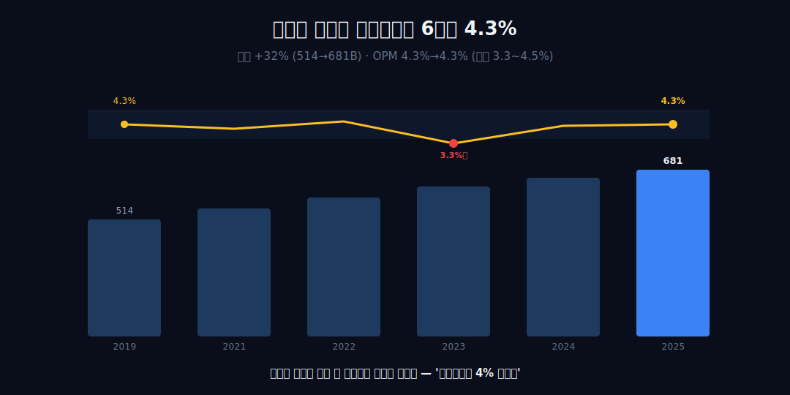
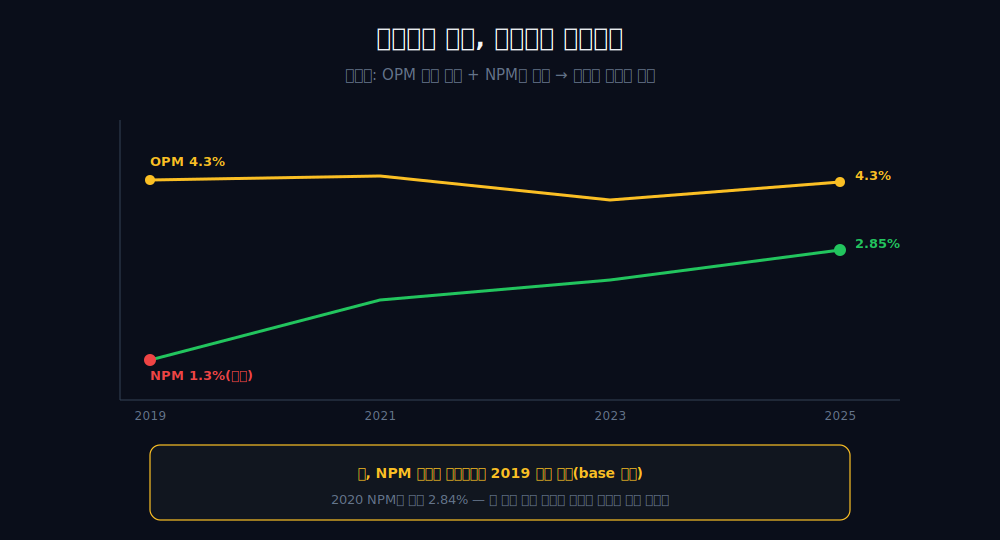
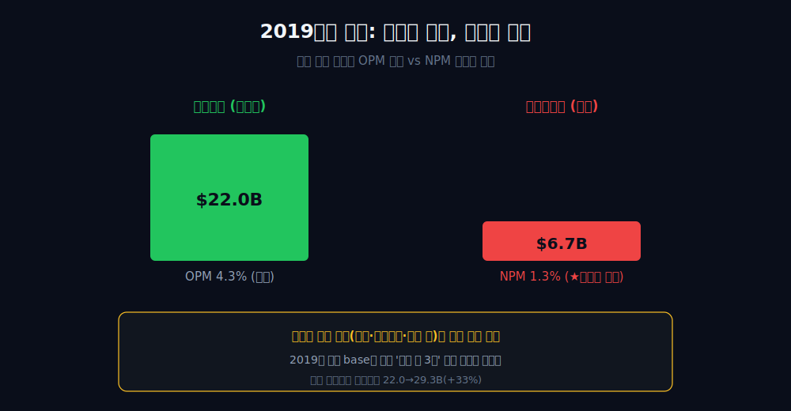
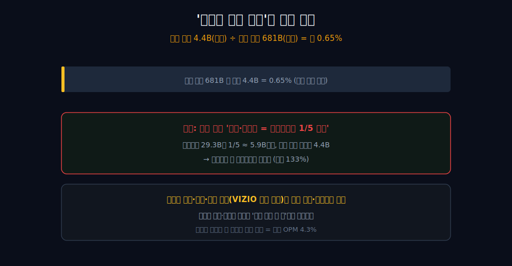
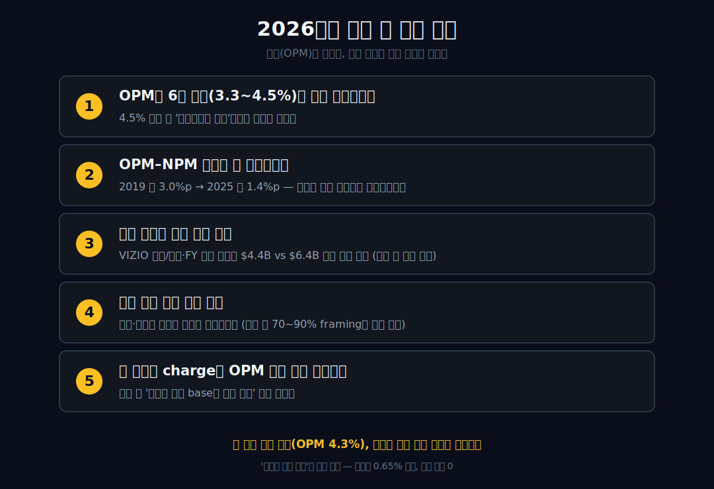

<script>
import ComboChart from '$lib/components/blog/ComboChart.svelte';
import StackBar from '$lib/components/blog/StackBar.svelte';
</script>

> **데이터 기준**: 2026-06-20 dartlab 실측 + Walmart FY2026 Form 10-K + Q1 FY2027 earnings release — Walmart(WMT) **미국 연결(USD)** 기준, 분기 데이터를 회계연도(1월말 결산)로 합산. 광고(Walmart Connect)·멤버십·부문 마진, 2019 저점·2023 딥의 구체 원인은 연결 손익에 안 나오므로 **10-K·IR·언론(외부 인용)**으로 표기. ※대차대조표 항목은 매핑이 불안정해 인용에 주의.
>
> **핵심 숫자**: 매출 **$681.0B** (2019→2025 **+32%**) · 영업이익 **$29.3B** (OPM **4.3%**) · 당기순이익 **$19.4B** · OPM 2019 **4.3%** → 2025 **4.3%** (밴드 3.3~4.5%) · NPM 2019 **1.3%** → 2025 **2.85%**
>
> **이 글의 용어**: OPM(영업이익률)·NPM(순이익률) = 별개 비율 · 영업선 아래 = 영업이익 이후의 이자·세금·해외손익 등 · base 효과 = 비교 시작점이 비정상이라 성장률이 부풀려 보이는 것 · Walmart Connect = 월마트의 광고 사업.

---

## 프롤로그 — 매출 6810억 달러, 그리고 4.3%

매출 **6,810억 달러**(약 940조 원). 세계 최대 소매기업이 한 해 벌어들인 돈이다. 그런데 이 거인이 그 매출에서 남긴 영업이익률은 **4.3%.** 2019년에도 4.3%였다.

팬데믹, 인플레이션, 이커머스 전환을 다 통과하고도 영업마진은 6년째 약 1.2%p 밴드(3.3~4.5%) 안에서 거의 움직이지 않았다. 보통 '안 변했다'는 지루한 사실이다. 그런데 같은 회사의 순이익률(NPM)은 같은 기간 1.3%에서 2.85%로 두 배 넘게 벌어졌다.



영업단은 못 박힌 듯 고정인데, 순이익만 따로 움직였다. **이 분리가 이 회사의 진짜 골격이다.** 관통선을 먼저 쓴다 — 간판(초박리 영업)은 변하지 않은 *상수*이고, 손익을 움직인 줄기는 거의 전부 영업선 *아래*에 있었다. '다른 사업이 돈을 번다'가 아니라, *간판 사업의 마진이 충격적으로 얇고 안 변한다*는 게 이 글의 핵심이다.


---

## 1막 — 6810억 달러, 그리고 4.3%

**왜 거인의 마진이 이렇게 얇나.** 규모가 마진을 *낮추는* 쪽 원인이기 때문이다.

```python
import dartlab
c = dartlab.Company("WMT")
c.select("IS", ["매출액", "영업이익"], freq="Q")  # 분기→회계연도 합산
```

| 항목 ($B, 회계연도) | 2019 | 2022 | 2023 | 2024 | 2025 |
|---|---:|---:|---:|---:|---:|
| 매출 | 514.4 | 572.8 | 611.3 | 648.1 | **681.0** |
| 영업이익 | 22.0 | 25.9 | 20.4 | 27.0 | **29.3** |
| 연결 OPM | 4.3% | 4.5% | 3.3% | 4.2% | **4.3%** |

매출은 2019년 $514.4B에서 2025년 $681.0B로 +32% 컸고, 영업이익도 $22.0B에서 $29.3B로 +33% 늘었다. 그런데 OPM은 2019년 4.3%, 2025년 4.3% — 6년째 약 1.2%p 밴드를 못 벗어난다.

여기서 방향을 분명히 하자. '거인이라서 4%로도 버틴다'는 *규모=해자* 봉합이 아니다 — 오히려 그 반대다. **규모는 OPM이 낮은 쪽 원인이다.** 세계 곳곳의 매대에 식료품·생필품을 깔아 박리로 파는 일은, 아무리 크게 해도 한 자릿수 마진의 고된 사업이다. '거인인데도 4% 초박리'가 정확한 읽기다.


그렇다면 이 밴드의 바닥은 어디까지 눌렸나?

---

## 2막 — 밴드의 하한, 2023년 3.3%

**6년 밴드의 바닥은 어디인가.** 2023년 OPM 3.3%다.

밴드의 하한은 2023년 영업이익 $20.4B, OPM **3.3%** 딥이다. 2022년 4.5%에서 한 칸 푹 꺼졌다가 2024년 4.2%, 2025년 4.3%로 돌아왔다.

이 딥의 *원인*(재고 조정·각종 충당 등)은 연결 손익 밖이라 본문에서 인과를 설명하지 않는다 — 외부 추측으로 미끄러지기 때문이다. 이 점은 *'밴드의 하한이 3.3%까지 눌렸다'는 데이터 포인트*로만 쓴다. 중요한 건 이거다 — 그렇게 눌렸다 돌아와도, 6년 전체로 보면 OPM은 여전히 4.3%다. 영업단은 위로도 아래로도 멀리 못 간다. 그런데 같은 기간, 순이익은 달랐다.

---

## 3막 — 영업단은 못 박혔는데 순이익만 움직였다

**OPM이 고정인데 순이익률은 왜 움직였나.** 정의상, 변동이 영업선 *아래*에서 왔기 때문이다.

```python
c.select("IS", ["당기순이익"], freq="Q")
```

OPM이 6년 밴드 안에 거의 고정(4.3%→4.3%)인 동안, NPM은 2019년 1.3%에서 2025년 2.85%로 **+1.55%p**(두 배 초과) 올랐다.



이건 인과 주장이 아니라 *항등식*이다 — 영업이익률이 거의 안 변했는데 순이익률만 움직였다면, 그 변동분은 정의상 *영업선 아래*(이자·세금·해외손익 등)에서 온 것이다. OPM과 NPM은 별개 비율이고, 둘 사이 괴리는 2019년 약 3.0%p에서 2025년 약 1.4%p로 좁혀졌다.

단, 정직하게 짚을 게 있다 — 이 NPM 상승의 *상당 부분은 2019년이 비정상 저점이었기 때문*이다(다음 막). 2020년 NPM은 이미 2.84%였다. 즉 '새 이익 엔진이 켜져 NPM이 구조적으로 올랐다'가 아니라, *2019년에 눌렸던 게 풀리고 영업선 아래가 정상화*된 것에 가깝다. 그 2019년을 보자.

---

## 4막 — 2019년의 함정: OPM은 정상, 순익만 저점

**2019년에 무슨 일이 있었나.** 영업은 정상인데 순이익만 무너졌다.

2019년 월마트는 영업이익 $22.0B, OPM 4.3%로 *정상권*이었다. 그런데 당기순이익은 **$6.7B**, NPM 1.3%로 무너졌다. 영업과 순이익의 괴리가 연결 손익 *안에서* 직접 드러난다.



이 막은 연결 손익 안의 사실만 쓴다 — OPM은 정상인데 NPM은 붕괴했다는 *공존*. 그 저점의 구체 원인(해외 사업·투자손실·세금 등)은 외부 인용 영역이라 단정하지 않는다. 핵심은 이거다 — 2019년이 *일회성으로 눌린 base*라면, 거기서 출발한 성장률은 부풀려 보일 수밖에 없다. 그래서 다음 막은 그 착시와, 거기에 얹힌 외부 서사를 함께 본다.

---

## 5막 — 저점 기준 성장률이라는 착시, 그리고 외부 인용의 모순

**'순이익이 약 3배 늘었다'고 쓰면 왜 안 되나.** 출발점이 비정상 저점이기 때문이다.

2019년 순익 $6.7B은 일회성으로 눌린 base다. 거기서 2025년 $19.4B를 비교하면 '약 2.9배'라는 화려한 숫자가 나오지만, 그건 *저점 기준 인공물*이라 헤드라인으로 쓰지 않는다. 정직한 성장선은 영업이익 $22.0B→$29.3B(**+33%**)다.

한편 '광고가 진짜 돈줄'이라는 외부 서사는 그 자체로 산술 모순을 안고 있다. 외부 인용 기준 월마트의 광고(Walmart Connect) 매출은 FY2025 약 $4.4B다 — 이는 전사 매출 $681B(연결 실측)의 약 **0.65%**에 불과하다(외부 광고매출 ÷ 내부 매출로 도출). 그런데 일부 보도는 광고·멤버십을 '영업이익의 1/5 초과'로 묘사한다 — 영업이익 $29.3B의 1/5이면 약 $5.9B인데, 광고 매출 자체가 $4.4B이라 *매출보다 큰 영업이익*은 불가능하다(마진 133%). 출처별로 정의·기간·집계 범위(VIZIO 포함 여부 등)가 달라 합산·교차검증이 안 된다.




그래서 광고·멤버십 수치는 *외부 인용 한 막으로 격리*하고, 연결로 증명된 척하지 않는다. 그러면 이 작은 부가 채널을 회사가 그토록 강조하는 건 무슨 뜻인가?

---

## 6막 — 회사조차 작은 부가 채널을 강조한다는 것

**광고가 작은데 왜 자꾸 광고 이야기인가.** 두 사실이 *공존*할 뿐이다.

'광고·멤버십이 빠르게 큰다'는 보도와, 그것이 여전히 전사 매출의 약 0.65% 소형이라는 사실은 서로 어긋나지 않는다 — 둘 다 참이다. 다만 한 가지는 분명히 해 둔다. *'광고가 작다'를 '그래서 영업마진이 얇다'의 증거로 잇지 않는다* — 둘은 각각 참인 별개의 사실이지, 하나가 다른 하나의 인과 증거가 아니다(부문 마진 70~90% vs 소매 3~4% 같은 격차는 회사 공식 공시가 아닌 언론·업계 추정 framing이다).

정직한 결론은 이렇다. 연결 손익으로 증명된 단 하나의 마진 사실은 *전사 OPM 4.3%*다. 간판 사업의 마진은 6년째 그 자리에 못 박혀 있고, 손익을 움직인 건 영업 바깥(2019 저점의 소멸·정상화)이었다. **6,810억 달러를 굴리는 거인의 영업마진은 6년째 4.3% — 안 변한 것은 간판이고, 움직인 것은 영업 바깥의 순이익뿐이었다.** 같은 초박리라도 입구의 회비로 이익을 정산받는 [코스트코](/blog/COST-costco)와 달리, 월마트는 통합형으로 그 박리를 그대로 떠안는다. 그리고 외형을 키울수록 마진율을 *올린* [애플](/blog/AAPL-apple)의 정반대 자리에 선다 — 같은 시리즈의 두 극단이다. 한국 대형마트의 거울로는 [이마트](/blog/139480-emart)가, 외형은 +40% 컸는데 수익성이 안 따라온 결로는 [펩시코](/blog/PEP-pepsico)가 나란히 놓이고, 간판 사업의 마진 자체가 무너진 [스타벅스](/blog/SBUX-starbucks)와도 '간판=초박리 상수'라는 점에서 갈린다.

---

## 공시 / Filings — FY2026와 Q1 FY2027을 같은 연도로 섞지 않는다

월마트를 최신 숫자로 읽을 때 가장 먼저 막아야 할 오류는 회계연도다. Walmart의 FY2026은 **2026년 1월 31일 종료 회계연도**이고, 2026년 4월 30일 종료 분기는 **Q1 FY2027**이다. 한국식으로 달력연도 2026년 1분기라고 부르면 직관적으로는 맞아 보여도, 월마트의 공시 체계에서는 이미 FY2027의 첫 분기다. 그래서 이 글은 두 층을 나눈다. 첫째, 연결 장부의 장기 관찰은 dartlab 분기 합산과 FY2026 Form 10-K로 본다. 둘째, 최신 모멘텀은 Q1 FY2027 earnings release로만 따로 본다. 두 층을 섞어 1년치 실적처럼 더하지 않는다.

| 공식 자료 | 기간 | 이 글에서 쓰는 역할 | 숫자 사용 원칙 |
|---|---|---|---|
| [FY2026 Form 10-K](https://www.sec.gov/Archives/edgar/data/104169/000010416926000055/wmt-20260131.htm) | 2026-01-31 종료 회계연도 | 연간 기준선 확정 | total revenues, net sales, segment sales, segment operating income |
| [FY2026 Q4 earnings release](https://www.sec.gov/Archives/edgar/data/104169/000010416926000032/earningsreleasefy26q4.htm) | 2026-01-31 종료 연도 발표 | FY2027 가이던스의 기준값 확인 | net sales 706.4B, adjusted operating income 31.0B는 비-GAAP 기준으로 표기 |
| [Q1 FY2027 earnings release](https://corporate.walmart.com/content/dam/corporate/documents/newsroom/2026/05/21/walmart-releases-q1-fy27-earnings/q1-fy27-earnings-release.pdf) | 2026-04-30 종료 3개월 | 최신 분기 확인 | net sales, membership and other income, operating income, OCF, capex |
| [Walmart IR filings page](https://stock.walmart.com/sec-filings/annual-reports) | 원문 색인 | 원문 접근 경로 | 날짜와 form 종류 확인 |

FY2026 Form 10-K가 세운 최신 연간 기준선은 분명하다. 연결 net sales는 **$706.413B**, membership and other income은 **$6.750B**, total revenues는 **$713.163B**다. 전년 FY2025 total revenues $680.985B보다 커졌고, 기존 dartlab 본문이 쓰던 FY2025 매출 $681.0B는 이 공시의 total revenues와 거의 같은 층이다. 다시 말해 기존 글의 관찰은 낡은 방향이 아니라, FY2026에서 한 번 더 커진 규모 위에서도 같은 질문을 던지게 만든다. 매출은 더 커졌는데, 영업마진은 정말 올라갔나.

10-K의 세그먼트 표는 그 질문을 더 날카롭게 만든다. Walmart U.S.는 FY2026 net sales **$482.975B**와 operating income **$25.158B**를 냈다. Walmart International은 net sales **$130.423B**, operating income **$5.103B**다. Sam's Club U.S.는 net sales **$93.015B**, operating income **$2.442B**다. 세 부문을 합치면 엄청난 절대 이익이지만, 비율로 보면 여전히 본질은 초박리다. Walmart U.S.의 operating income / net sales는 약 **5.2%**, Sam's Club U.S.는 약 **2.6%**, International은 약 **3.9%**다. 이 회사가 거대한 이유는 마진이 높아서가 아니라, 낮은 마진을 통과하는 금액이 압도적으로 크기 때문이다.

여기서 "membership and other income"을 조심해야 한다. 10-K에서 membership and other income은 FY2026 연결 **$6.750B**로, FY2025 $6.447B보다 늘었다. 하지만 이 줄은 멤버십만이 아니라 여러 항목이 섞인 줄이다. Sam's Club U.S. 설명에는 멤버십 수입이 세그먼트 영업이익의 중요한 구성요소라는 문장이 있지만, 그것만으로 "멤버십이 전사 이익을 바꿨다"까지 가지 않는다. 전사 operating income은 부문 영업이익에서 corporate and support 손실을 빼고, 광고는 일부가 net sales가 아니라 cost of sales 차감으로 기록될 수 있다. 즉 공시의 줄은 투자자가 좋아하는 한 단어로 잘라 먹기 어렵다. 이 글의 문장은 그래서 보수적으로 간다. **광고·멤버십은 빠르게 자라는 믹스 개선 요인일 수 있지만, 연결 손익이 단독으로 증명하는 것은 전사 4%대 영업마진까지다.**

FY2026 Q4 release의 가이던스 표도 같은 원칙으로 읽는다. 회사는 FY2027 연간 가이던스를 제시하면서 FY2026 기준값을 net sales **$706.4B**, adjusted operating income **$31.0B**, adjusted EPS **$2.64**로 둔다. 여기서 adjusted operating income은 non-GAAP다. 따라서 본문에서 "FY2026 영업이익 31.0B"라고 단정하면 틀린다. 그 숫자는 가이던스 산식의 조정 영업이익 기준값이다. 연결 GAAP의 세그먼트 operating income 합산·corporate cost와도 같은 층이 아니다. 이 경계를 지키지 않으면 월마트 글은 금방 "고마진 플랫폼 기업으로 전환 중"이라는 쉬운 서사로 미끄러진다. 좋은 이야기처럼 보이지만, 공시가 허락한 문장은 거기까지가 아니다.

공시로 닫히는 핵심은 세 가지다. 첫째, FY2026에도 규모는 더 커졌다. total revenues가 $713B까지 왔다. 둘째, 부문별 운영이익률은 여전히 낮다. Walmart U.S.조차 5% 안팎이고 Sam's Club은 fuel 포함 net sales 기준으로 더 낮다. 셋째, advertising·membership·marketplace는 성장률이 크지만 표기 방식이 분산되어 있어 전사 영업이익 기여를 한 줄로 확정하기 어렵다. 그러니 이 회사의 최신 문장은 "플랫폼으로 바뀌어 마진이 폭발했다"가 아니라, **"초박리 본업 위에 고성장 부가 레이어가 붙었지만, 전사 장부는 아직 4%대 회사를 보여준다"**가 더 정확하다.

## 최신 분기 — Q1 FY2027은 논지를 바꾸지 않고, 더 선명하게 만든다

Q1 FY2027 earnings release는 이 글의 결론을 뒤집지 않는다. 오히려 더 선명하게 만든다. 2026년 4월 30일 종료 3개월 동안 Walmart의 net sales는 **$175.684B**, membership and other income은 **$2.067B**, total revenues는 **$177.751B**였다. operating income은 **$7.493B**다. 단순히 operating income / total revenues로 보면 약 **4.2%**다. 전년 동기보다 매출은 커졌고 영업이익도 늘었지만, 전사 마진의 자리는 여전히 4%대다.

이 숫자가 중요한 이유는 하나다. 최신 분기에서도 "큰 회사라서 마진이 자연스럽게 올라간다"는 가정이 증명되지 않았기 때문이다. Q1 FY2027에서 global eCommerce sales는 26% 늘었고, global advertising은 37% 늘었고, global membership fee revenue는 17.4% 늘었다. Walmart U.S. advertising은 36%, Walmart Connect는 VIZIO 제외 44% 증가했다. 텍스트만 읽으면 고마진 플랫폼 기업의 전환 서사가 즉시 떠오른다. 그러나 같은 release의 연결 손익계산서로 내려오면 operating income은 $7.493B, total revenues는 $177.751B다. 부가 레이어의 성장률은 크지만, 전사 마진의 방은 아직 좁다.

왜 이런 일이 벌어지나. 답은 공시 안에서 보수적으로만 말할 수 있다. Q1 FY2027 release는 영업이익 증가가 higher fuel costs in distribution and fulfillment의 영향을 받았다고 설명한다. Walmart U.S.에서는 gross profit rate가 29bp 개선됐지만, operating expense는 56bp deleverage됐다. eCommerce economics, Walmart+ growth, other income benefits가 조정 영업이익을 도왔다는 문장도 있다. 이 세 문장을 합치면 방향은 읽을 수 있다. 고마진으로 보이는 부가 레이어가 자라도, 물류·인건비·감가상각·헬스케어 비용 같은 거대한 운영비 줄이 동시에 움직인다. 그래서 전사 OPM은 한 번에 레벨업하지 않는다.

여기서 투자자가 흔히 하는 실수는 "광고가 37% 늘었다"와 "전사 이익이 좋아질 것이다" 사이에 다리를 놓는 것이다. 광고 성장률은 빠르다. 하지만 footnote는 광고 사업이 계약 성격에 따라 net sales 또는 cost of sales 차감으로 기록된다고 밝힌다. 그러면 광고 매출 증가율을 전사 매출의 한 항목처럼 단순 합산할 수 없다. 더구나 회사가 공개한 것은 성장률이지, 광고 영업이익의 절대액과 마진율이 아니다. 이 글이 광고를 무시하는 게 아니다. 반대로 광고를 너무 진지하게 읽기 때문에, 공시가 주지 않은 숫자를 만들지 않는다.

Q1 FY2027에서 더 흥미로운 줄은 cash flow다. 영업현금흐름은 **$4.738B**였고, capex는 **$6.684B**였다. release는 free cash flow를 **-$1.9B**로 제시한다. 연간 단위로 보면 월마트는 거대한 현금창출 기업이지만, 분기 단위에서는 재고·투자·운전자본 때문에 현금이 얼마든지 흔들린다. 그래서 한 분기의 FCF를 들고 "이제 현금흐름이 나빠졌다"라고 말하지 않는다. 동시에 "고마진 플랫폼이 자라니 capex 부담이 사라졌다"라고도 말하지 않는다. Q1의 capex는 여전히 크고, 자동화·eCommerce fulfillment·store investment가 이 회사의 구조적 비용이라는 점을 보여준다.

Q1 FY2027을 기존 6년 표와 연결하면 결론은 이렇게 정리된다. 2019~2025 dartlab 표에서는 OPM이 3.3~4.5% 밴드에 갇혀 있었다. FY2026 10-K에서는 total revenues가 $713B로 더 커졌고, 부문별 operating margin은 여전히 낮다. Q1 FY2027에서는 광고·멤버십·eCommerce가 빠르게 크는데도 연결 operating income / total revenues가 약 4.2%다. 세 층이 같은 문장을 가리킨다. **월마트의 강점은 높은 마진이 아니라 낮은 마진을 압도적 규모와 운영 규율로 반복하는 능력이다.**

## 읽기 규칙 — 월마트를 코스트코처럼도, 플랫폼 기업처럼도 읽지 않는다

월마트를 읽을 때 가장 유혹적인 비교는 [코스트코](/blog/COST-costco)다. 둘 다 낮은 상품 마진과 거대한 트래픽을 가진다. 그러나 코스트코의 투자 포인트는 회비가 전사 이익을 얼마나 떠받치는지 비교적 깨끗하게 보인다는 데 있다. 월마트에도 Sam's Club membership fee가 있고 Walmart+도 있지만, 연결 공시는 그 둘을 전사 이익의 단일 엔진으로 깨끗하게 분리해 주지 않는다. 월마트의 membership and other income은 성장하지만, 이 줄을 곧장 "회비 기업"으로 번역하면 공시보다 앞서간다. 월마트는 코스트코의 회비 모델과 닮은 조각을 갖고 있지만, 회사 전체는 여전히 통합형 대형 유통 장부다.

두 번째 유혹은 월마트를 플랫폼 기업처럼 읽는 것이다. Marketplace, advertising, data, fulfillment automation이라는 단어가 모두 있다. 특히 광고 성장률은 강하고, Walmart Connect는 미국 소매 광고 시장에서 실제로 중요한 플레이어다. 그러나 [아마존](/blog/AMZN-amazon)을 떠올리며 "소매는 미끼, 광고가 본체"라고 쓰려면 전사 이익 기여의 절대액과 마진율이 필요하다. 월마트 공시는 아직 그 문장을 허락하지 않는다. Q1 FY2027 release가 말한 것은 "commerce solutions가 profit sources를 diversify한다"는 방향성이다. 그것은 투자 가설의 출발점이지, 결론이 아니다.

세 번째 유혹은 월마트의 낮은 마진을 약점으로만 읽는 것이다. 이것도 반만 맞다. 4%대 OPM은 낮지만, 그 낮은 마진을 $700B 이상의 매출 위에서 반복하는 회사는 드물다. 낮은 마진 자체가 해자는 아니지만, 낮은 마진을 견디는 조달력·물류망·재고회전·가격 인식은 쉽게 복제되지 않는다. 문제는 그 해자가 주주에게 높은 마진율로 보상되지 않는다는 데 있다. 월마트는 브랜드 소프트웨어 회사가 아니라 운영 복합체다. 그래서 이 글의 질문은 "마진이 낮으니 나쁘다"가 아니라, **"낮은 마진이 유지되는 동안 어떤 줄이 순이익과 현금을 움직이는가"**다.

네 번째 규칙은 fuel을 조심하는 것이다. Sam's Club net sales에는 fuel이 들어가고, comp sales는 often ex-fuel로 제시된다. Q1 FY2027에서도 Sam's Club U.S. net sales는 fuel 포함 **$23.4B**, ex-fuel net sales는 **$20.5B**다. 이 둘을 같은 표에 섞으면 성장률과 마진 해석이 흔들린다. fuel은 매출을 키우지만 구조적으로 낮은 마진을 만들 수 있고, 가격 변동이 매출 성장률을 왜곡할 수 있다. 그래서 Sam's Club을 볼 때는 "매출이 6.1% 늘었다"와 "ex-fuel net sales가 3.9% 늘었다"를 따로 적어야 한다.

다섯 번째 규칙은 adjusted 숫자를 headline으로 쓰지 않는 것이다. Walmart는 FY2027 가이던스에서 adjusted operating income과 adjusted EPS를 제시한다. 이는 투자자에게 유용한 지표지만, GAAP operating income과 같은 말이 아니다. 이 글에서 adjusted 숫자는 가이던스의 기준값을 설명할 때만 쓰고, 연결 손익의 핵심 문장에는 GAAP 또는 명시된 부문 operating income을 쓴다. 월마트 같은 성숙 기업은 숫자가 많을수록 그럴듯한 서사가 많아진다. 좋은 글은 그중 가장 화려한 숫자를 고르는 글이 아니라, 서로 다른 회계 층을 섞지 않는 글이다.

이 규칙들을 적용하면 월마트의 최신 결론은 차갑지만 강하다. FY2026 total revenues는 $713B다. Q1 FY2027 total revenues는 $177.8B다. 광고와 멤버십은 빠르게 자란다. eCommerce도 자란다. 그런데 연결 영업마진은 여전히 4%대다. 그러니 월마트는 "소매에서 플랫폼으로 완전히 변신한 회사"가 아니라, **거대한 소매 장부 위에 플랫폼적 수익원이 붙는 중인 회사**다. 그 차이는 작아 보이지만 투자 해석에서는 결정적이다. 전자는 이미 레벨업이 끝났다는 문장이고, 후자는 아직 검증해야 할 문장이다.

## 반론과 재반론 — 플랫폼 전환을 언제 인정할 것인가

여기까지 읽으면 자연스러운 반론이 나온다. "광고와 멤버십이 빠르게 자라고 있고, eCommerce도 좋아지고 있는데 왜 아직도 월마트를 초박리 유통회사로 묶느냐"는 반론이다. 이 반론은 중요하다. 월마트를 과거의 오프라인 할인점으로만 읽는 것도 틀리기 때문이다. 회사는 분명히 바뀌고 있다. 매장은 fulfillment node가 되고, 광고는 Walmart Connect로 커지고, marketplace는 제3자 판매자와 데이터 기반 광고를 붙인다. Sam's Club과 Walmart+의 membership economics도 예전보다 중요해졌다. 문제는 변화의 존재가 아니라 변화의 **회계적 크기**다.

플랫폼 전환을 인정하려면 세 가지가 필요하다. 첫째, 플랫폼성 수익원의 절대 매출 또는 순수익이 전사 매출 대비 의미 있는 비중으로 올라와야 한다. 둘째, 그 수익원이 전사 operating income을 얼마나 올리는지 회사가 공시하거나 최소한 합리적으로 추정 가능한 구조가 필요하다. 셋째, 전사 OPM이 4%대에서 구조적으로 이탈해야 한다. 현재 공시로 확실히 말할 수 있는 것은 첫째의 일부와 둘째의 방향성이다. 광고·멤버십·marketplace가 자라는 것은 맞지만, 전사 operating income의 구조적 레벨업은 아직 숫자로 닫히지 않았다.

반대로 "월마트는 영원히 4%대 회사"라고 단정하는 것도 위험하다. Q1 FY2027에서 Walmart U.S. eCommerce growth 26%, Walmart Connect growth 44%(ex-VIZIO), global membership fee revenue growth 17.4%가 동시에 나왔다. 이 흐름이 몇 년 누적되면 전사 마진 구조를 바꿀 수 있다. 특히 광고는 상품 매출과 달리 incremental margin이 높을 가능성이 있다. marketplace는 inventory risk를 줄이고, 자동화는 fulfillment cost를 낮출 수 있다. 이 모든 것은 장기적으로 OPM을 올릴 수 있는 후보들이다. 그래서 이 글은 플랫폼 전환을 부정하지 않는다. 다만 **아직 연결 손익이 그 전환을 완성된 사실로 보여주지는 않는다**고 말한다.

투자 판단에서 이 차이는 크다. 플랫폼 전환이 이미 완성됐다고 믿으면 월마트의 valuation은 소매업보다 높은 배수를 정당화하기 쉽다. 아직 검증 중이라고 보면, 높은 배수는 미래 개선을 선반영한 가격이 된다. 같은 숫자를 봐도 해석이 달라진다. 이 글은 주가 판단을 하지 않지만, 숫자 읽기의 순서를 정한다. 먼저 GAAP 연결 OPM을 본다. 다음으로 광고·멤버십 성장률을 본다. 마지막으로 그 성장률이 연결 OPM의 레벨을 바꾸는지 본다. 순서를 바꾸면 가설이 결론이 된다.

또 다른 반론은 "월마트는 마진이 낮아도 ROA와 ROI가 좋다"는 것이다. Q1 FY2027 release는 ROA 8.4%, ROI 14.9%를 제시한다. 맞다. 월마트는 낮은 영업마진을 높은 회전율과 공급망 효율로 보완하는 회사다. 낮은 OPM만 보고 질 낮은 사업이라고 단정하면 회전율의 힘을 놓친다. 그러나 ROA와 ROI 역시 낮은 OPM을 삭제하지 않는다. 오히려 이 회사의 본질을 더 분명하게 만든다. 월마트는 높은 단위마진 회사가 아니라, 낮은 단위마진을 거대한 자산 회전과 운영 규율로 수익화하는 회사다.

세 번째 반론은 "소비 방어력"이다. 경기 둔화나 인플레이션 때 소비자는 더 싼 곳으로 이동하고, 월마트는 점유율을 얻는다. Q1 FY2027에서도 Walmart U.S. comp sales growth와 upper-income households 유입이 언급된다. 이 방어력은 진짜 강점이다. 그러나 방어력은 마진 레벨업과 다르다. 방어력은 매출과 traffic을 지키고, 가격 신뢰를 강화한다. 반면 마진 레벨업은 상품 믹스·광고·멤버십·automation·expense leverage가 동시에 맞아야 한다. 월마트는 방어력이 강한 회사지만, 방어력이 곧 고마진 전환을 뜻하지 않는다.

네 번째 반론은 "Q1의 fuel cost 같은 일회성 압박을 빼면 더 좋아 보인다"는 것이다. 맞다. Q1 FY2027 operating income은 higher fuel costs in distribution and fulfillment의 영향을 받았다. 이런 비용이 완화되면 OPM은 개선될 수 있다. 하지만 소매 운영에서는 한 비용이 사라지면 다른 비용이 올라오는 일이 많다. 임금, 헬스케어, depreciation, shrink, transportation, technology investment가 번갈아 손익을 누른다. 그래서 한 분기의 비용 압박을 제거해 normalized margin을 상상하는 것은 가능하지만, 그것을 곧장 구조적 마진으로 쓰면 안 된다.

다섯 번째 반론은 "광고가 net sales 또는 cost of sales 차감으로 기록된다는 footnote는 보수적 회계일 뿐, 실제 경제성은 더 좋다"는 것이다. 이 역시 일부 맞을 수 있다. 투자자는 공시보다 경제적 실질을 보려 한다. 다만 실질을 보려면 추정이 필요하고, 추정은 민감도를 가져야 한다. 광고 매출, 광고 마진, marketplace take-rate, fulfillment cost, membership retention, automation capex를 각각 가정해야 한다. 이 글은 추정 모델을 만들지 않는다. 대신 추정 모델의 입력값 중 회사가 공시한 것과 공시하지 않은 것을 구분한다. 공시가 없는 입력값은 흥미로운 가설이지 본문 핵심 수치가 아니다.

결국 월마트에서 인정해야 할 것과 미뤄야 할 것이 나뉜다. 인정해야 할 것: 회사는 빠르게 디지털화되고 있고, 광고·멤버십·marketplace는 성장 중이며, Q1 FY2027에서도 그 방향은 유지됐다. 미뤄야 할 것: 그 수익원이 전사 영업마진을 구조적으로 4%대 밖으로 밀어냈다는 결론. 이 구분을 지키면 월마트는 훨씬 흥미로운 회사가 된다. 완성된 플랫폼 기업도 아니고, 낡은 할인점도 아니다. **$713B 장부를 가진 초박리 유통회사가 고마진 레이어를 실제 장부에 얼마나 두껍게 쌓을 수 있는지 검증받는 회사**다.

그래서 다음 12개월의 핵심 질문은 단순하다. FY2027 내내 revenue growth보다 operating income growth가 더 빨라지는가. gross profit rate 개선이 SG&A deleverage를 이기는가. advertising growth가 여전히 30%대 이상을 유지하는가. membership fee income이 절대액으로 전사 operating income의 몇 퍼센트까지 커지는가. capex와 automation investment가 FCF를 얼마나 누르는가. 이 질문에 대한 답이 쌓이면, 그때 월마트를 "4%대 유통회사"에서 "마진 구조가 바뀌는 플랫폼형 소매회사"로 한 칸 옮길 수 있다. 아직은 그 문장을 유보한다.

이 유보는 약한 결론이 아니다. 오히려 월마트처럼 숫자가 큰 회사에서는 가장 강한 결론이다. $713B total revenues라는 규모는 어떤 작은 변화도 거대한 절대 금액으로 보이게 만든다. 광고가 수십 퍼센트 성장했다는 문장도, membership fee income이 두 자릿수 성장했다는 문장도, eCommerce가 20%대 성장했다는 문장도 모두 매력적이다. 그러나 전사 손익계산서의 분모가 너무 크기 때문에, 그 변화가 실제 OPM을 한 단계 끌어올리려면 몇 년의 누적이 필요하다. 큰 회사는 변화가 느려서가 아니라 분모가 커서 늦게 보인다.

월마트를 분석할 때 절대액과 비율을 번갈아 봐야 하는 이유도 여기에 있다. operating income $7.493B는 한 분기 숫자로 엄청나다. 하지만 total revenues $177.751B 대비로는 약 4.2%다. membership and other income $2.067B도 크지만, total revenues 대비로는 약 1.2%다. 광고 성장률 37%도 크지만, 회사가 광고의 절대 이익을 공개하지 않는 한 전사 손익의 몇 퍼센트를 바꿨는지 알 수 없다. 월마트는 모든 숫자가 커 보이는 회사라서, 투자자는 항상 "큰가"와 "비율을 바꾸는가"를 분리해야 한다.

또 하나의 체크는 재투자다. 월마트는 자동화와 fulfillment, store remodel, supply chain에 계속 돈을 넣는다. Q1 FY2027 capex $6.684B는 한 분기 operating cash flow $4.738B보다 컸다. 이 투자는 장기적으로 비용을 낮출 수 있지만, 단기적으로는 FCF를 누른다. 그래서 automation을 마진 개선 촉매로만 읽으면 반쪽이다. automation은 먼저 자본 지출이고, 나중에 생산성 가설이다. 이 가설이 맞으려면 capex 이후 gross profit rate와 operating expense leverage가 함께 좋아져야 한다.

경쟁 구도도 비율의 문제다. 월마트가 가격을 올려 OPM을 끌어올리기는 쉽지 않다. 이 회사의 브랜드 약속은 낮은 가격이고, 소비자가 월마트를 찾는 핵심 이유도 가격 신뢰다. 마진을 올리려면 상품 가격을 크게 올리는 방식보다 mix, advertising, membership, marketplace, automation, shrink control, logistics efficiency가 필요하다. 이 개선들은 모두 유효하지만 천천히 쌓인다. 따라서 월마트의 마진 개선은 폭발형보다 누적형일 가능성이 높다. 폭발형 서사를 붙이면 회사의 성격을 잘못 읽는다.

반대로 낮은 가격 약속은 위기 때 강점이 된다. 경기 둔화와 인플레이션이 소비자를 압박할 때 월마트는 traffic을 얻을 수 있다. Q1 FY2027의 upper-income households 유입은 이 방어력을 보여준다. 다만 방어력은 valuation의 하방을 설명할 수 있어도, 영업마진의 상방을 자동으로 설명하지는 않는다. 방어력은 매출을 지키고 점유율을 늘린다. 마진 상방은 그 매출이 어떤 믹스와 비용 구조로 통과되는지에 달려 있다. 월마트의 다음 과제는 점유율 확대를 마진 구조 개선으로 번역하는 일이다.

마지막으로, 이 글이 FY2026 total revenues $713.163B와 dartlab의 기존 FY2025 $681.0B를 함께 쓰는 이유를 다시 고정한다. 기존 표는 2019~2025의 장기 밴드를 보여주고, 최신 공시는 그 밴드가 더 커진 분모 위에서도 유효한지 묻는다. 두 숫자는 서로 충돌하지 않는다. 오히려 같은 질문을 두 번 던진다. 6810억 달러에서도 4%대였고, 7132억 달러에서도 아직 전사 마진은 4%대다. 이 반복성이 월마트 글의 힘이다.

투자자가 이 반복성을 실제로 추적하려면 분기마다 같은 표를 갱신하면 된다. total revenues, operating income, operating income / total revenues, membership and other income, operating cash flow, capex, inventory, Walmart U.S. operating expense ratio를 한 줄에 놓는다. 그 다음 advertising growth와 membership fee growth를 옆에 둔다. 플랫폼 레이어의 성장률이 아무리 높아도, 앞의 전사 표가 움직이지 않으면 아직 가설이다. 반대로 전사 OPM이 4.5%를 안정적으로 넘고, SG&A leverage가 반복되고, FCF가 capex 부담을 흡수하면 가설은 사실에 가까워진다.

이 방식은 단순하지만 강하다. 월마트는 워낙 큰 회사라 복잡한 narrative가 많다. grocery share gain, health and wellness, eCommerce delivery speed, marketplace seller growth, advertising, VIZIO, automation, Sam's Club renewal, international Flipkart까지 모두 흥미롭다. 그러나 투자자가 모든 narrative를 따라가면 핵심을 잃는다. 결국 손익계산서에는 매출, gross profit, operating expense, operating income만 남는다. narrative는 이 네 줄을 움직였을 때만 장부의 사실이 된다.

또 하나의 실전 규칙은 "fuel 제외"와 "fuel 포함"을 표기하는 것이다. Sam's Club U.S.는 fuel이 들어가면 매출이 커 보이고, fuel 제외 기준으로 보면 retail traffic과 membership economics가 더 잘 보인다. Q1 FY2027에서 Sam's Club net sales는 $23.4B지만 ex-fuel은 $20.5B다. 같은 분기 같은 회사인데 분모가 다르다. 이 차이를 적지 않으면 성장률도, OPM도, comp sales도 흐려진다. 월마트 글에서 사소해 보이는 footnote가 중요한 이유다.

마지막 숫자는 inventory다. Q1 FY2027 inventory는 $62.6B로 증가했다. 회사는 timing of receipts, grocery unit demand, fuel 등을 이유로 설명한다. 재고 증가는 매출 성장의 준비일 수도 있고, 수요 둔화의 부담일 수도 있다. 월마트 같은 대형 유통사에서 재고는 손익보다 먼저 위험을 알려줄 수 있다. gross margin이 좋아져도 재고가 과하게 쌓이면 markdown 위험이 생긴다. 따라서 FY2027을 볼 때 inventory growth와 sales growth의 차이도 같이 봐야 한다.

결론적으로 월마트의 최신 관찰은 세 줄로 압축된다. 첫째, FY2026 total revenues는 $713.163B로 더 커졌다. 둘째, Q1 FY2027에서도 operating income / total revenues는 약 4.2%다. 셋째, 광고·멤버십·eCommerce는 빠르게 자라지만 전사 마진을 아직 결정적으로 바꾸지는 못했다. 이 세 줄이 동시에 참이라는 점이 월마트를 흥미롭게 만든다. 크고, 느리고, 그러나 방향은 바뀌는 회사다. 다만 변화가 장부의 비율을 바꾸기 전까지는 "전환 완료"가 아니라 "전환 검증 중"이다.

이 검증 중이라는 말은 투자 판단을 미루라는 뜻이 아니다. 오히려 무엇을 보고 판단할지 좁히라는 뜻이다. 매출 성장률만 보면 이미 충분히 강하다. 광고 성장률만 봐도 충분히 빠르다. 하지만 월마트의 주주가 결국 사는 것은 전사 이익과 현금흐름이다. 따라서 분기마다 "성장률이 좋았다"보다 "성장률이 operating income과 FCF로 얼마나 남았는가"를 먼저 물어야 한다. 이 질문이 월마트를 소매 뉴스가 아니라 투자 대상 장부로 바꾼다.

마지막으로, 월마트의 낮은 마진은 실패의 증거가 아니라 사업 모델의 출발점이다. 실패는 낮은 마진 그 자체가 아니라, 낮은 마진 위에서 새 레이어를 쌓고도 마진·현금·회전율 중 아무것도 좋아지지 않는 경우다. 아직 공시는 그 실패를 말하지 않는다. 동시에 완성된 성공도 말하지 않는다. 그래서 이 글의 결론은 중간에 선다. 월마트는 거대한 초박리 본업 위에 고마진 후보를 쌓는 중이고, 그 후보가 전사 비율을 바꾸는지는 FY2027 이후의 공시가 결정한다.

결국 월마트를 읽는 태도는 기다림보다 기록에 가깝다. 매 분기 같은 항목을 같은 순서로 적어두면 전환 여부는 생각보다 선명하게 드러난다. 전사 OPM이 그대로인데 광고 성장률만 빠르면 아직 주변부 성장이다. 전사 OPM이 오르는데 FCF가 계속 눌리면 투자 회수 시점이 문제다. 전사 OPM과 FCF가 함께 좋아지고 재고가 안정되면 그때는 전환을 더 강하게 인정할 수 있다. 월마트는 한 번의 headline보다 누적된 표가 더 잘 말하는 회사다.

이 기록 방식은 가치판단의 속도도 조절한다. 월마트는 좋다/나쁘다로 빨리 나누기보다, 어떤 줄이 좋아졌고 어떤 줄이 그대로인지 분리해야 한다. 매출은 좋다. traffic도 좋다. 광고와 멤버십도 좋다. 그러나 전사 마진은 아직 낮다. capex도 크다. 이 상반된 줄을 모두 유지할 때 글의 힘이 생긴다. 월마트는 단순한 찬반보다 훨씬 큰 회사이고, 큰 회사일수록 결론은 여러 줄의 동시 관찰로만 버틴다.

따라서 이 글의 마지막 문장은 숫자의 방향보다 숫자의 순서다. 광고를 먼저 보고 OPM을 나중에 맞추지 않는다. OPM을 먼저 보고 광고가 그 OPM을 얼마나 바꿨는지 본다. 매출을 먼저 보고 FCF를 잊지 않는다. FCF를 보고 capex의 이유를 확인한다. 이 순서를 지키면 월마트는 과거형 할인점도, 완성형 플랫폼도 아닌 현재진행형 장부로 읽힌다.

그 현재진행형이라는 단어가 중요하다. 월마트의 다음 공시는 결론을 확인하는 자료가 아니라, 전환이 실제 비율로 번역되는지 계속 재는 눈금이다.

그 눈금이 움직일 때만 이 글의 결론도 움직인다.

지금 단계에서 가장 좋은 결론은 단정이 아니라 관찰의 지속이다. 월마트는 매출 규모, 점유율, 광고 성장, 멤버십 성장, 자동화 투자를 모두 갖고 있다. 동시에 낮은 전사 마진, 큰 capex, 재고와 비용 압박도 갖고 있다. 이 두 묶음이 함께 존재한다는 사실을 유지해야 한다. 한쪽만 고르면 월마트는 너무 낡아 보이거나 너무 새로워 보인다. 실제 장부는 그 중간에서 천천히 움직인다.

## 2026년에 봐야 할 다섯 가지

1. **OPM이 6년 밴드(3.3~4.5%)를 위로 이탈하는가** — 4.5% 초과 시 '구조적으로 고정'이라는 전제를 재검토.
2. **OPM–NPM 괴리가 더 좁혀지는가** — 2019 약 3.0%p → 2025 약 1.4%p 추세. 영업선 아래 정상화가 일단락됐는지.
3. **광고 매출의 단일 정의 확정** — 광고가 net sales 또는 cost of sales 차감으로 기록될 수 있다는 footnote가 남아 있는 한, 성장률을 전사 매출·이익에 단순 합산하지 않는다.
4. **부문 마진 공식 공시 여부** — 광고·멤버십 마진을 회사가 공시하기 시작하는가(공시 전 70~90% framing은 외부 추정).
5. **Q1 FY2027의 비용 압박이 완화되는가** — fuel·depreciation·healthcare costs가 gross profit mix 개선을 얼마나 흡수하는지. 플랫폼 성장률보다 전사 OPM 레벨이 우선이다.



---

## 재무제표 — 최근 6개 회계연도 (dartlab 연결, $B)

> 미국 연결(USD)·분기 합산(회계연도 1월말) 기준. dartlab에서 직접 확인:
> ```python
> import dartlab
> c = dartlab.Company("WMT")
> c.select("IS", ["매출액","영업이익","당기순이익"], freq="Q")
> c.select("CF", ["영업활동현금흐름"], freq="Q")
> ```

<ComboChart data={[{year:"2020",매출:524.0,영업이익:20.6,당기순이익:14.9},{year:"2021",매출:559.2,영업이익:22.5,당기순이익:13.5},{year:"2022",매출:572.8,영업이익:25.9,당기순이익:13.7},{year:"2023",매출:611.3,영업이익:20.4,당기순이익:11.7},{year:"2024",매출:648.1,영업이익:27.0,당기순이익:15.5},{year:"2025",매출:681.0,영업이익:29.3,당기순이익:19.4}]} lineKeys={["매출"]} barKeys={["영업이익","당기순이익"]} lineColors={["#22c55e"]} barColors={["#3b82f6","#f59e0b"]} title="매출(라인) vs 영업이익·당기순이익(막대) — $B" unit="$B" />

| 항목 ($B) | 2020 | 2021 | 2022 | 2023 | 2024 | 2025 |
|---|---:|---:|---:|---:|---:|---:|
| 매출 | 524.0 | 559.2 | 572.8 | 611.3 | 648.1 | 681.0 |
| 영업이익 | 20.6 | 22.5 | 25.9 | 20.4 | 27.0 | 29.3 |
| 당기순이익 | 14.9 | 13.5 | 13.7 | 11.7 | 15.5 | 19.4 |
| 연결 OPM | 3.9% | 4.0% | 4.5% | 3.3% | 4.2% | 4.3% |
| 영업현금흐름 | 25.3 | 36.1 | 24.2 | 28.8 | 35.7 | 36.4 |

이 표를 한 줄로 읽으면 이렇다 — 매출 행은 멈춤 없이 우상향($524B→$681B)하는데, **OPM 행은 3.3~4.5% 밴드를 한 번도 벗어나지 않는다.** 당기순이익 행은 영업이익 행보다 *변동이 크고 노이즈가 많다*(11.7~19.4) — 그게 바로 '손익이 영업 바깥에서 갈렸다'는 그림이다. 매출 행만 보면 거대한 성장 기업이지만, OPM 행의 *불변성*과 순이익 행의 *변동성*을 겹쳐 보면, 이 회사의 이야기는 간판(영업)이 아니라 영업선 아래에 있다는 게 드러난다(구체 원인=외부).

---

## 검증표

본문 인용 수치를 dartlab 호출과 결과로 검증한다. 외부 출처(광고·부문 마진·저점 원인)는 분리 표기. 📅 dartlab 실측 2026-06-20 · Walmart(WMT) 미국 연결(USD)·분기 합산 기준.

| 본문 수치 | 출처 / 호출 | 결과 |
|---|---|---|
| 매출 2019 514.4B → 2025 681.0B (+32%) | `c.select("IS",["매출액"],freq="Q")` 합산 | ✓ 실측 |
| OPM 2019 4.3% → 2025 4.3% (밴드 3.3~4.5%) | 영업이익÷매출 | ✓ 실측 |
| 영업이익 22.0B → 29.3B (+33%, 정직한 성장선) | `c.select("IS",["영업이익"])` | ✓ 실측 |
| NPM 2019 1.3% → 2025 2.85% (+1.55%p), 괴리 3.0→1.4%p | 순이익÷매출 | ✓ 실측 |
| 2023 OPM 3.3% 딥(영업이익 20.4B) | `c.select("IS",[...])` | ✓ 실측 |
| 2019 영업이익 22.0B(OPM 정상)인데 순이익 6.7B 저점(NPM 1.3%) | `c.select("IS",[...])` | ✓ 실측 |
| 영업현금흐름 27.8B → 36.4B | `c.select("CF",["영업활동현금흐름"])` | ✓ 실측 |
| FY2026 net sales 706.413B / membership and other income 6.750B / total revenues 713.163B | [FY2026 Form 10-K](https://www.sec.gov/Archives/edgar/data/104169/000010416926000055/wmt-20260131.htm) | 공식 공시 |
| FY2026 부문: Walmart U.S. net sales 482.975B·OI 25.158B, International 130.423B·5.103B, Sam's Club U.S. 93.015B·2.442B | FY2026 Form 10-K segment table | 공식 공시 |
| Q1 FY2027 net sales 175.684B / membership and other income 2.067B / total revenues 177.751B / operating income 7.493B | [Q1 FY2027 earnings release](https://corporate.walmart.com/content/dam/corporate/documents/newsroom/2026/05/21/walmart-releases-q1-fy27-earnings/q1-fy27-earnings-release.pdf) | 공식 IR |
| Q1 FY2027 OCF 4.738B / capex 6.684B / free cash flow -1.9B | Q1 FY2027 earnings release cash flow table | 공식 IR·FCF는 non-GAAP |
| Q1 FY2027 global eCommerce +26%, global advertising +37%, Walmart Connect ex-VIZIO +44%, global membership fee revenue +17.4% | Q1 FY2027 earnings release highlights | 공식 IR |
| Q1 FY2027 Sam's Club U.S. net sales 23.4B vs ex-fuel 20.5B | Q1 FY2027 earnings release segment table | fuel 포함/제외 구분 |
| 광고(Walmart Connect) 매출 FY2025 약 4.4B = 전사 681B의 약 0.65% | [WMT 10-K (SEC)](https://www.sec.gov/cgi-bin/browse-edgar?action=getcompany&CIK=0000104169&type=10-K) ÷ 내부 매출 | 외부÷내부 파생 |
| 2019 순익 저점·2023 OPM 딥 구체 원인 / 광고 '1/5' framing 모순 | [WMT IR](https://stock.walmart.com/) · [Reuters](https://www.reuters.com/) · [CNBC](https://www.cnbc.com/) | 외부 인용·합산 불가 |
| 부문 마진 70~90% vs 3~4%는 언론·업계 추정(회사 미공시) | 언론·업계 framing | 외부 추정 |
| BS(대차대조표) 매핑 불안정 — 인용 주의 | dartlab 데이터 한계 | 주의/제외 |

본문의 숫자 중 이 표에 없는 것은 발행 차단 대상이다. 광고·멤버십·부문 마진·저점 원인은 dartlab 연결로 증명되지 않으며 외부 인용임을 명시한다 — 연결이 증명하는 것은 'OPM 6년 불변 + NPM은 영업선 아래에서 움직임'까지이고, '광고가 진짜 돈줄'은 외부 가설(매출 0.65% 소형)이다.
